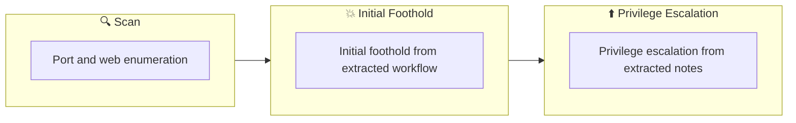

## Overview

| Field                     | Value |
|---------------------------|-------|
| OS                        | Linux |
| Difficulty                | Not specified |
| Attack Surface            | 22/tcp   open     ssh, 80/tcp   open     http, 3527/tcp filtered beserver-msg-q, 8080/tcp open     http |
| Primary Entry Vector      | web, ssh attack path to foothold |
| Privilege Escalation Path | Local misconfiguration or credential reuse to elevate privileges |

## Reconnaissance

### 1. PortScan

---
## Rustscan

💡 Why this works  
High-quality reconnaissance narrows a large attack surface into a few validated exploitation paths. Accurate service mapping prevents time loss and supports targeted follow-up testing.

## Initial Foothold

### Not implemented (not recorded in PDF)


## Nmap


### Not implemented (not recorded in PDF)


### 2. Local Shell

---

PDFメモから抽出した主要コマンドと要点を整理しています。必要に応じて後続で詳細追記してください。

### 実行コマンド（抽出）
```bash
curl -O http://10.10.35.142/secret.txt
```

### 抽出画像

画像抽出なし（PDF内に有効な埋め込み画像なし）

### 抽出メモ（先頭120行）
```bash
jokerctf
August 5, 2023 2:09

https://drf0x.github.io/HAJokerCTF
#1
Immediately insert the search tool
─$ python3 ~/tool/search.py
________________________________________________
:: Method           : GET
:: URL              : http://10.10.35.142/FUZZ
:: Wordlist         : FUZZ: /home/n0z0/SecLists/Discovery/Web-Content/common.txt
:: Follow redirects : false
:: Calibration      : false
:: Timeout          : 10
:: Threads          : 40
:: Matcher          : Response status: 200,204,301,302,307,401,403,405,500
________________________________________________
:: Progress: [4715/4715] :: Job [1/1] :: 66 req/sec :: Duration: [0:01:42] :: Errors: 0 ::
=== ffuf results ===
.htpasswd               [Status: 403, Size: 277, Words: 20, Lines: 10, Duration: 2037ms]
.htaccess               [Status: 403, Size: 277, Words: 20, Lines: 10, Duration: 2079ms]
.hta                    [Status: 403, Size: 277, Words: 20, Lines: 10, Duration: 4827ms]
css                     [Status: 301, Size: 310, Words: 20, Lines: 10, Duration: 563ms]
img                     [Status: 301, Size: 310, Words: 20, Lines: 10, Duration: 517ms]
index.html              [Status: 200, Size: 5954, Words: 783, Lines: 97, Duration: 364ms]
phpinfo.php             [Status: 200, Size: 94862, Words: 4706, Lines: 1160, Duration: 596ms]
server-status           [Status: 403, Size: 277, Words: 20, Lines: 10, Duration: 1195ms]
=== nmap results ===
Starting Nmap 7.93 ( https://nmap.org ) at 2023-08-06 19:22 JST
Nmap scan report for 10.10.35.142
Host is up (0.30s latency).
Not shown: 996 closed tcp ports (conn-refused)
PORT     STATE    SERVICE        VERSION
22/tcp   open     ssh            OpenSSH 7.6p1 Ubuntu 4ubuntu0.3 (Ubuntu Linux; protocol 2.0)
| ssh-hostkey:
|   2048 ad201ff4331b0070b385cb8700c4f4f7 (RSA)
|   256 1bf9a8ecfd35ecfb04d5ee2aa17a4f78 (ECDSA)
|_  256 dcd7dd6ef6711f8c2c2ca1346d299920 (ED25519)
80/tcp   open     http           Apache httpd 2.4.29 ((Ubuntu))
|_http-title: HA: Joker
|_http-server-header: Apache/2.4.29 (Ubuntu)
3527/tcp filtered beserver-msg-q
8080/tcp open     http           Apache httpd 2.4.29
|_http-server-header: Apache/2.4.29 (Ubuntu)
|_http-title: 401 Unauthorized
| http-auth:
| HTTP/1.1 401 Unauthorized\x0D
|_  Basic realm=Please enter the password.
Service Info: Host: localhost; OS: Linux; CPE: cpe:/o:linux:linux_kernel
Service detection performed. Please report any incorrect results at https://nmap.org/submit/ .
Nmap done: 1 IP address (1 host up) scanned in 129.91 seconds
The web is open with ssh on port 22 and 80, and basic authentication is required on 8080.
Bypass authentication
#2
There is an instruction to search for .txt, so search using dirb.
┌──(n0z0㉿kali)-[~/work/thm]
└─$ dirb http://$ip -X .txt
-----------------
DIRB v2.22
OneNote
1/2
By The Dark Raver
-----------------
START_TIME: Sun Aug  6 21:18:13 2023
URL_BASE: http://10.10.35.142/
WORDLIST_FILES: /usr/share/dirb/wordlists/common.txt
EXTENSIONS_LIST: (.txt) | (.txt) [NUM = 1]
-----------------
GENERATED WORDS: 4612
---- Scanning URL: http://10.10.35.142/ ----
+ http://10.10.35.142/secret.txt (CODE:200|SIZE:320)
-----------------
END_TIME: Sun Aug  6 21:42:17 2023
DOWNLOADED: 4612 - FOUND: 1
#3
Download it with curl
curl -O http://10.10.35.142/secret.txt
OneNote
2/2
```

### Not implemented (not recorded in PDF)


💡 Why this works  
Initial access succeeds when enumeration findings are turned into a practical exploit chain. Capturing credentials, file disclosure, or direct RCE creates reliable pivot points for privilege escalation.

## Privilege Escalation

### 3.Privilege Escalation

---

Privilege elevation related commands extracted from PDF memo.

💡 Why this works  
Privilege escalation depends on chaining local weaknesses such as sudo misconfiguration, weak file permissions, or credential reuse. If a GTFOBins technique is used, the mechanism is that an allowed binary executes a child process or shell without dropping elevated effective privileges.

## Credentials

```text
https://drf0x.github.io/HAJokerCTF
─$ python3 ~/tool/search.py
:: URL              : http://10.10.35.142/FUZZ
:: Wordlist         : FUZZ: /home/n0z0/SecLists/Discovery/Web-Content/common.txt
:: Progress: [4715/4715] :: Job [1/1] :: 66 req/sec :: Duration: [0:01:42] :: Errors: 0 ::
.htpasswd               [Status: 403, Size: 277, Words: 20, Lines: 10, Duration: 2037ms]
22/tcp   open     ssh            OpenSSH 7.6p1 Ubuntu 4ubuntu0.3 (Ubuntu Linux; protocol 2.0)
80/tcp   open     http           Apache httpd 2.4.29 ((Ubuntu))
|_http-server-header: Apache/2.4.29 (Ubuntu)
3527/tcp filtered beserver-msg-q
8080/tcp open     http           Apache httpd 2.4.29
| HTTP/1.1 401 Unauthorized\x0D
|_  Basic realm=Please enter the password.
Service detection performed. Please report any incorrect results at https://nmap.org/submit/ .
┌──(n0z0㉿kali)-[~/work/thm]
2026/02/27 18:46
WORDLIST_FILES: /usr/share/dirb/wordlists/common.txt
---- Scanning URL: http://10.10.35.142/ ----
+ http://10.10.35.142/secret.txt (CODE:200|SIZE:320)
```

## Lessons Learned / Key Takeaways

### 4.Overview

---




## References

- nmap
- rustscan
- ssh
- curl
- php
- GTFOBins
