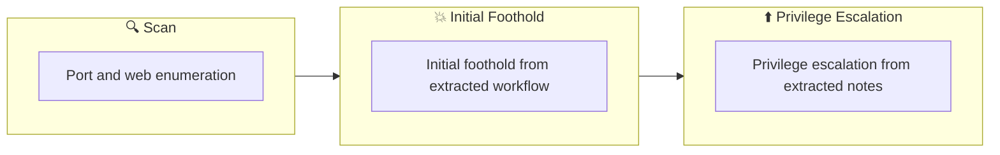

## Overview

| Field                     | Value |
|---------------------------|-------|
| OS                        | Windows |
| Difficulty                | Not specified |
| Attack Surface            | Not specified |
| Primary Entry Vector      | web attack path to foothold |
| Privilege Escalation Path | Local misconfiguration or credential reuse to elevate privileges |

## Reconnaissance

### 1. PortScan

---
## Rustscan

💡 Why this works  
High-quality reconnaissance narrows a large attack surface into a few validated exploitation paths. Accurate service mapping prevents time loss and supports targeted follow-up testing.

## Initial Foothold

### Not implemented (not recorded in PDF)


## Nmap


### Not implemented (not recorded in PDF)


### 2. Local Shell

---

PDFメモから抽出した主要コマンドと要点を整理しています。必要に応じて後続で詳細追記してください。

### 実行コマンド（抽出）

### Not implemented (not recorded in PDF)


### 抽出画像


*Caption: Screenshot captured during ps-eclipse attack workflow (step 1).*


*Caption: Screenshot captured during ps-eclipse attack workflow (step 2).*


*Caption: Screenshot captured during ps-eclipse attack workflow (step 3).*


*Caption: Screenshot captured during ps-eclipse attack workflow (step 4).*


*Caption: Screenshot captured during ps-eclipse attack workflow (step 5).*

### 抽出メモ（先頭120行）
```bash
PS Eclipse
June 24, 2023 22:14

Perform digital forensics using Splunk in a Windows environment
#1
Connect to Splunk
Reports>Splunk errors last 24 hours
From custom time to full time
Found powershell running with mysterious arguments
OneNote
1/3
Since the command argument was Base64, encode it nicely.
Command to run suspicious binaries with elevated privileges
create a task scheduler
”C:\Windows\system32\schtasks.exe” /Create /TN OUTSTANDING_GUTTER.exe /TR C:\Windows\Temp\COUTSTANDING_GUTTER.exe /SC
ONEVENT /EC Application /MO *[System/EventID=777] /RU SYSTEM /f
Search for executable file name
Search hash value with virustotal
search query
■or conditions
.ps1
| dedup TargetFilename
| table TargetFilename
OneNote
2/3
■and conditions
test.exe AND "http://10.10.10.10"
OneNote
3/3
```

### Not implemented (not recorded in PDF)


💡 Why this works  
Initial access succeeds when enumeration findings are turned into a practical exploit chain. Capturing credentials, file disclosure, or direct RCE creates reliable pivot points for privilege escalation.

## Privilege Escalation

### 3.Privilege Escalation

---

Privilege elevation related commands extracted from PDF memo.

💡 Why this works  
Privilege escalation depends on chaining local weaknesses such as sudo misconfiguration, weak file permissions, or credential reuse. If a GTFOBins technique is used, the mechanism is that an allowed binary executes a child process or shell without dropping elevated effective privileges.

## Credentials

```text
2026/02/27 18:44
ONEVENT /EC Application /MO *[System/EventID=777] /RU SYSTEM /f
```

## Lessons Learned / Key Takeaways

### 4.Overview

---




## References

- nmap
- rustscan
- GTFOBins
