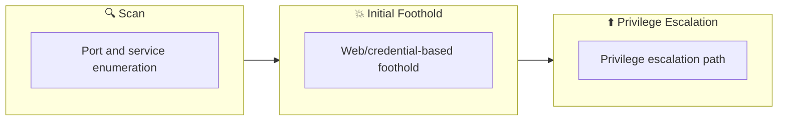

## Overview

| Field                     | Value |
|---------------------------|-------|
| OS                        | Windows |
| Difficulty                | Not specified |
| Attack Surface            | 80/tcp   open  http, 3389/tcp open  ms-wbt-server |
| Primary Entry Vector      | brute-force |
| Privilege Escalation Path | Local misconfiguration or credential reuse to elevate privileges |

## Reconnaissance

### 1. PortScan

---

Initial reconnaissance narrows the attack surface by establishing public services and versions. Under the OSCP assumption, it is important to identify "intrusion entry candidates" and "lateral expansion candidates" at the same time during the first scan.

## Rustscan

💡 Why this works  
High-quality reconnaissance narrows a large attack surface into a few validated exploitation paths. Accurate service mapping prevents time loss and supports targeted follow-up testing.

## Initial Foothold

### Not implemented (or log not saved)


## Nmap
```bash
nmap -p- -sC -sV -T4 -A -Pn $ip
✅[21:36][CPU:1][MEM:25][IP:10.11.87.75][/home/n0z0/work/thm]
🐉 > nmap -p- -sC -sV -T4 -A -Pn $ip
Starting Nmap 7.94SVN ( https://nmap.org ) at 2024-12-08 21:36 JST
Nmap scan report for 10.10.84.91
Host is up (0.24s latency).
Not shown: 65533 filtered tcp ports (no-response)
PORT     STATE SERVICE       VERSION
80/tcp   open  http          Microsoft IIS httpd 10.0
|_http-title: IIS Windows Server
|_http-server-header: Microsoft-IIS/10.0
| http-methods:
|_  Potentially risky methods: TRACE
3389/tcp open  ms-wbt-server Microsoft Terminal Services
|_ssl-date: 2024-12-08T12:41:31+00:00; -2s from scanner time.
| ssl-cert: Subject: commonName=RetroWeb
| Not valid before: 2024-12-07T12:35:50
|_Not valid after:  2025-06-08T12:35:50
| rdp-ntlm-info:
|   Target_Name: RETROWEB
|   NetBIOS_Domain_Name: RETROWEB
|   NetBIOS_Computer_Name: RETROWEB
|   DNS_Domain_Name: RetroWeb
|   DNS_Computer_Name: RetroWeb
|   Product_Version: 10.0.14393
|_  System_Time: 2024-12-08T12:41:26+00:00
Warning: OSScan results may be unreliable because we could not find at least 1 open and 1 closed port
OS fingerprint not ideal because: Missing a closed TCP port so results incomplete
No OS matches for host
Network Distance: 2 hops
Service Info: OS: Windows; CPE: cpe:/o:microsoft:windows

Host script results:
|_clock-skew: mean: -2s, deviation: 0s, median: -3s

TRACEROUTE (using port 3389/tcp)
HOP RTT       ADDRESS
1   243.15 ms 10.11.0.1
2   243.23 ms 10.10.84.91

OS and Service detection performed. Please report any incorrect results at https://nmap.org/submit/ .
Nmap done: 1 IP address (1 host up) scanned in 282.83 seconds
```

### 2. Local Shell

---

ここでは初期侵入からユーザーシェル獲得までの手順を記録します。コマンド実行の意図と、次に見るべき出力（資格情報、設定不備、実行権限）を意識して追跡します。

### 実施ログ（統合）

ポートスキャンを実施してみる

```bash
✅[21:36][CPU:1][MEM:25][IP:10.11.87.75][/home/n0z0/work/thm]
🐉 > nmap -p- -sC -sV -T4 -A -Pn $ip
Starting Nmap 7.94SVN ( https://nmap.org ) at 2024-12-08 21:36 JST
Nmap scan report for 10.10.84.91
Host is up (0.24s latency).
Not shown: 65533 filtered tcp ports (no-response)
PORT     STATE SERVICE       VERSION
80/tcp   open  http          Microsoft IIS httpd 10.0
|_http-title: IIS Windows Server
|_http-server-header: Microsoft-IIS/10.0
| http-methods:
|_  Potentially risky methods: TRACE
3389/tcp open  ms-wbt-server Microsoft Terminal Services
|_ssl-date: 2024-12-08T12:41:31+00:00; -2s from scanner time.
| ssl-cert: Subject: commonName=RetroWeb
| Not valid before: 2024-12-07T12:35:50
|_Not valid after:  2025-06-08T12:35:50
| rdp-ntlm-info:
|   Target_Name: RETROWEB
|   NetBIOS_Domain_Name: RETROWEB
|   NetBIOS_Computer_Name: RETROWEB
|   DNS_Domain_Name: RetroWeb
|   DNS_Computer_Name: RetroWeb
|   Product_Version: 10.0.14393
|_  System_Time: 2024-12-08T12:41:26+00:00
Warning: OSScan results may be unreliable because we could not find at least 1 open and 1 closed port
OS fingerprint not ideal because: Missing a closed TCP port so results incomplete
No OS matches for host
Network Distance: 2 hops
Service Info: OS: Windows; CPE: cpe:/o:microsoft:windows

Host script results:
|_clock-skew: mean: -2s, deviation: 0s, median: -3s

TRACEROUTE (using port 3389/tcp)
HOP RTT       ADDRESS
1   243.15 ms 10.11.0.1
2   243.23 ms 10.10.84.91

OS and Service detection performed. Please report any incorrect results at https://nmap.org/submit/ .
Nmap done: 1 IP address (1 host up) scanned in 282.83 seconds
```

結果

- http/80で稼働している
- IISで稼働している
- 3389ポートでRDP稼働している
- Retrowebのドメイン取得してる

ディレクトリ探索する

```bash
✅[21:41][CPU:1][MEM:25][IP:10.11.87.75][/home/n0z0/work/thm]
🐉 > feroxbuster -u http://$ip -w /usr/share/wordlists/SecLists/Discovery/Web-Content/directory-list-2.3-big.txt -t 50 -x php,html,txt -r --timeout 3 --no-state -s 200,301 -e -E

 ___  ___  __   __     __      __         __   ___
|__  |__  |__) |__) | /  `    /  \ \_/ | |  \ |__
|    |___ |  \ |  \ | \__,    \__/ / \ | |__/ |___
by Ben "epi" Risher 🤓                 ver: 2.11.0
───────────────────────────┬──────────────────────
 🎯  Target Url            │ http://10.10.84.91
 🚀  Threads               │ 50
 📖  Wordlist              │ /usr/share/wordlists/SecLists/Discovery/Web-Content/directory-list-2.3-big.txt
 👌  Status Codes          │ [200, 301]
 💥  Timeout (secs)        │ 3
 🦡  User-Agent            │ feroxbuster/2.11.0
 💉  Config File           │ /etc/feroxbuster/ferox-config.toml
 🔎  Extract Links         │ true
 💲  Extensions            │ [php, html, txt]
 💰  Collect Extensions    │ true
 💸  Ignored Extensions    │ [Images, Movies, Audio, etc...]
 🏁  HTTP methods          │ [GET]
 📍  Follow Redirects      │ true
 🔃  Recursion Depth       │ 4
───────────────────────────┴──────────────────────
 🏁  Press [ENTER] to use the Scan Management Menu™
──────────────────────────────────────────────────
200      GET      334l     2089w   180418c http://10.10.84.91/iisstart.png
200      GET       32l       55w      703c http://10.10.84.91/
200      GET      545l     2796w    30515c http://10.10.84.91/retro/
200      GET        0l        0w        0c http://10.10.84.91/retro/wp-content/
200      GET        0l        0w        0c http://10.10.84.91/retro/wp-content/index.php
200      GET        0l        0w        0c http://10.10.84.91/retro/wp-content/themes/
200      GET        0l        0w        0c http://10.10.84.91/retro/wp-content/themes/index.php
200      GET       69l      205w     2743c http://10.10.84.91/retro/wp-login.php
200      GET      385l     3179w    19935c http://10.10.84.91/retro/license.txt
200      GET        0l        0w    30515c http://10.10.84.91/retro/Index.php/
200      GET        0l        0w        0c http://10.10.84.91/retro/wp-content/plugins/
200      GET      447l      868w     6989c http://10.10.84.91/retro/wp-admin/css/install.css
200      GET       13l       78w     4373c http://10.10.84.91/retro/wp-admin/images/wordpress-logo.png
200      GET        0l        0w        0c http://10.10.84.91/retro/wp-content/Index.php
200      GET       98l      845w     7447c http://10.10.84.91/retro/README.html
200      GET        0l        0w        0c http://10.10.84.91/retro/wp-includes/category.php
200      GET        0l        0w        0c http://10.10.84.91/retro/wp-content/plugins/index.php
200      GET        0l        0w        0c http://10.10.84.91/retro/wp-includes/feed.php
200      GET        0l        0w        0c http://10.10.84.91/retro/wp-includes/user.php
200      GET        0l        0w        0c http://10.10.84.91/retro/wp-content/themes/Index.php
200      GET        0l        0w        0c http://10.10.84.91/retro/wp-includes/version.php
200      GET        0l        0w        0c http://10.10.84.91/retro/wp-includes/post.php
200      GET        0l        0w        0c http://10.10.84.91/retro/wp-includes/comment.php
200      GET        0l        0w        0c http://10.10.84.91/retro/wp-content/Themes/
200      GET       98l      845w     7447c http://10.10.84.91/retro/readme.html
200      GET        0l        0w        0c http://10.10.84.91/retro/wp-includes/query.php
```

結果

- wordpressで稼働している

wpscanを実行する

```bash
✅[21:47][CPU:1][MEM:25][IP:10.11.87.75][/home/n0z0]
🐉 > wpscan --url http://$ip/retro --enumerate u
_______________________________________________________________
         __          _______   _____
         \ \        / /  __ \ / ____|
          \ \  /\  / /| |__) | (___   ___  __ _ _ __ ®
           \ \/  \/ / |  ___/ \___ \ / __|/ _` | '_ \
            \  /\  /  | |     ____) | (__| (_| | | | |
             \/  \/   |_|    |_____/ \___|\__,_|_| |_|

         WordPress Security Scanner by the WPScan Team
                         Version 3.8.27
       Sponsored by Automattic - https://automattic.com/
       @_WPScan_, @ethicalhack3r, @erwan_lr, @firefart
_______________________________________________________________

[+] URL: http://10.10.84.91/retro/ [10.10.84.91]
[+] Started: Sun Dec  8 21:47:24 2024

Interesting Finding(s):

[+] Headers
 | Interesting Entries:
 |  - Server: Microsoft-IIS/10.0
 |  - X-Powered-By: PHP/7.1.29
 | Found By: Headers (Passive Detection)
 | Confidence: 100%

[+] XML-RPC seems to be enabled: http://10.10.84.91/retro/xmlrpc.php
 | Found By: Direct Access (Aggressive Detection)
 | Confidence: 100%
 | References:
 |  - http://codex.wordpress.org/XML-RPC_Pingback_API
 |  - https://www.rapid7.com/db/modules/auxiliary/scanner/http/wordpress_ghost_scanner/
 |  - https://www.rapid7.com/db/modules/auxiliary/dos/http/wordpress_xmlrpc_dos/
 |  - https://www.rapid7.com/db/modules/auxiliary/scanner/http/wordpress_xmlrpc_login/
 |  - https://www.rapid7.com/db/modules/auxiliary/scanner/http/wordpress_pingback_access/

[+] WordPress readme found: http://10.10.84.91/retro/readme.html
 | Found By: Direct Access (Aggressive Detection)
 | Confidence: 100%

[+] The external WP-Cron seems to be enabled: http://10.10.84.91/retro/wp-cron.php
 | Found By: Direct Access (Aggressive Detection)
 | Confidence: 60%
 | References:
 |  - https://www.iplocation.net/defend-wordpress-from-ddos
 |  - https://github.com/wpscanteam/wpscan/issues/1299

[+] WordPress version 5.2.1 identified (Insecure, released on 2019-05-21).
 | Found By: Rss Generator (Passive Detection)
 |  - http://10.10.84.91/retro/index.php/feed/, <generator>https://wordpress.org/?v=5.2.1</generator>
 |  - http://10.10.84.91/retro/index.php/comments/feed/, <generator>https://wordpress.org/?v=5.2.1</generator>

[+] WordPress theme in use: 90s-retro
 | Location: http://10.10.84.91/retro/wp-content/themes/90s-retro/
 | Latest Version: 1.4.10 (up to date)
 | Last Updated: 2019-04-15T00:00:00.000Z
 | Readme: http://10.10.84.91/retro/wp-content/themes/90s-retro/readme.txt
 | Style URL: http://10.10.84.91/retro/wp-content/themes/90s-retro/style.css?ver=5.2.1
 | Style Name: 90s Retro
 | Style URI: https://organicthemes.com/retro-theme/
 | Description: Have you ever wished your WordPress blog looked like an old Geocities site from the 90s!? Probably n...
 | Author: Organic Themes
 | Author URI: https://organicthemes.com
 |
 | Found By: Css Style In Homepage (Passive Detection)
 |
 | Version: 1.4.10 (80% confidence)
 | Found By: Style (Passive Detection)
 |  - http://10.10.84.91/retro/wp-content/themes/90s-retro/style.css?ver=5.2.1, Match: 'Version: 1.4.10'

[+] Enumerating Users (via Passive and Aggressive Methods)
 Brute Forcing Author IDs - Time: 00:00:07 <============================================> (10 / 10) 100.00% Time: 00:00:07

[i] User(s) Identified:

[+] wade
 | Found By: Author Posts - Author Pattern (Passive Detection)
 | Confirmed By:
 |  Wp Json Api (Aggressive Detection)
 |   - http://10.10.84.91/retro/index.php/wp-json/wp/v2/users/?per_page=100&page=1
 |  Author Id Brute Forcing - Author Pattern (Aggressive Detection)
 |  Login Error Messages (Aggressive Detection)

[+] Wade
 | Found By: Rss Generator (Passive Detection)
 | Confirmed By: Login Error Messages (Aggressive Detection)

[!] No WPScan API Token given, as a result vulnerability data has not been output.
[!] You can get a free API token with 25 daily requests by registering at https://wpscan.com/register

[+] Finished: Sun Dec  8 21:48:00 2024
[+] Requests Done: 54
[+] Cached Requests: 6
[+] Data Sent: 13.442 KB
[+] Data Received: 238.983 KB
[+] Memory used: 173.195 MB
[+] Elapsed time: 00:00:36
```

結果

- Microsoft-IIS/10.0で稼働している
- Wordpress5.2.1が稼働している

pe-jiwop

サイトを見てみるとユーザとパスワードっぽい文字列が手に入る


*Caption: Screenshot captured during retro attack workflow (step 1).*

RDPするとデスクトップにuser.txtがあるから取得

powershellからはアクセスできなかったからブラウザからアクセスして

脆弱性exploitコードを転送する


*Caption: Screenshot captured during retro attack workflow (step 2).*

powershellで実行するとターミナルがntsystem権限で立ち上がって

administratorフラグが取れる


*Caption: Screenshot captured during retro attack workflow (step 3).*

Windowsのカーネルexploitcodeいっぱい

https://github.com/SecWiki/windows-kernel-exploits/tree/master

Windows周りの権限昇格とかで困ったら確認できる

https://github.com/swisskyrepo/PayloadsAllTheThings/tree/master/Methodology%20and%20Resources

💡 Why this works  
Initial access succeeds when enumeration findings are turned into a practical exploit chain. Capturing credentials, file disclosure, or direct RCE creates reliable pivot points for privilege escalation.

## Privilege Escalation

### 3.Privilege Escalation

---

During the privilege escalation phase, we will prioritize checking for misconfigurations such as `sudo -l` / SUID / service settings / token privilege. By starting this check immediately after acquiring a low-privileged shell, you can reduce the chance of getting stuck.

💡 Why this works  
Privilege escalation depends on chaining local weaknesses such as sudo misconfiguration, weak file permissions, or credential reuse. If a GTFOBins technique is used, the mechanism is that an allowed binary executes a child process or shell without dropping elevated effective privileges.

## Credentials

```text
No credentials obtained.
```

## Lessons Learned / Key Takeaways

### 4.Overview

---




## References

- nmap
- rustscan
- sudo
- find
- php
- GTFOBins
