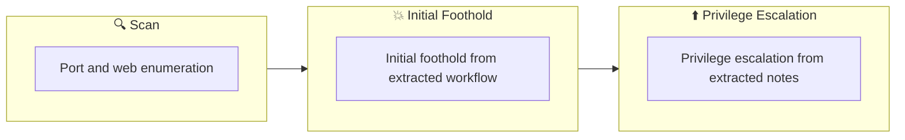

## 概要

| 項目 | 内容 |
|---------------------------|-------|
| OS | Windows |
| 難易度 | 記録なし |
| 攻撃対象 | 21/tcp   open  ftp, 22/tcp   open  ssh, 139/tcp  open  netbios-ssn, 445/tcp  open  netbios-ssn, 3128/tcp open  http-proxy, 3333/tcp open  http |
| 主な侵入経路 | web, ssh attack path to foothold |
| 権限昇格経路 | Local misconfiguration or credential reuse to elevate privileges |

## 偵察

### 1. PortScan

---
## Rustscan

💡 なぜ有効か  
High-quality reconnaissance narrows a large attack surface into a few validated exploitation paths. Accurate service mapping prevents time loss and supports targeted follow-up testing.

## 初期足がかり

### Not implemented (not recorded in PDF)


## Nmap


### Not implemented (not recorded in PDF)


### 2. Local Shell

---

PDFメモから抽出した主要コマンドと要点を整理しています。必要に応じて後続で詳細追記してください。

### 実行コマンド（抽出）
```bash
find / -user root -perm -4000 -exec ls -ldb {} \; 2>dev/null
cat output
```

### 抽出画像

画像抽出なし（PDF内に有効な埋め込み画像なし）

### 抽出メモ（先頭120行）
```bash
Vulnversity
July 11, 2023 20:23

#1
Explore quickly
You can see that http is exposed on port 3333
Check that /internal is published from gobuster
Looks like I can upload a reverse shell
=== nmap results ===
Starting Nmap 7.93 ( https://nmap.org ) at 2023-07-10 22:57 JST
Nmap scan report for 10.10.202.233
Host is up (0.27s latency).
Not shown: 994 closed tcp ports (conn-refused)
PORT     STATE SERVICE     VERSION
21/tcp   open  ftp         vsftpd 3.0.3
22/tcp   open  ssh         OpenSSH 7.2p2 Ubuntu 4ubuntu2.7 (Ubuntu Linux; protocol 2.0)
| ssh-hostkey:
|   2048 5a4ffcb8c8761cb5851cacb286411c5a (RSA)
|   256 ac9dec44610c28850088e968e9d0cb3d (ECDSA)
|_  256 3050cb705a865722cb52d93634dca558 (ED25519)
139/tcp  open  netbios-ssn Samba smbd 3.X - 4.X (workgroup: WORKGROUP)
445/tcp  open  netbios-ssn Samba smbd 4.3.11-Ubuntu (workgroup: WORKGROUP)
3128/tcp open  http-proxy  Squid http proxy 3.5.12
|_http-server-header: squid/3.5.12
|_http-title: ERROR: The requested URL could not be retrieved
3333/tcp open  http        Apache httpd 2.4.18 ((Ubuntu))
|_http-server-header: Apache/2.4.18 (Ubuntu)
|_http-title: Vuln University
Service Info: Host: VULNUNIVERSITY; OSs: Unix, Linux; CPE: cpe:/o:linux:linux_kernel
Host script results:
| smb-security-mode:
|   account_used: guest
|   authentication_level: user
|   challenge_response: supported
|_  message_signing: disabled (dangerous, but default)
|_clock-skew: mean: 1h19m59s, deviation: 2h18m35s, median: -1s
| smb-os-discovery:
|   OS: Windows 6.1 (Samba 4.3.11-Ubuntu)
|   Computer name: vulnuniversity
|   NetBIOS computer name: VULNUNIVERSITY\x00
|   Domain name: \x00
|   FQDN: vulnuniversity
|_  System time: 2023-07-10T09:59:03-04:00
| smb2-security-mode:
|   311:
|_    Message signing enabled but not required
| smb2-time:
|   date: 2023-07-10T13:59:01
|_  start_date: N/A
OneNote
1/4
|_nbstat: NetBIOS name: VULNUNIVERSITY, NetBIOS user: <unknown>, NetBIOS MAC: 000000000000 (Xerox)
Service detection performed. Please report any incorrect results at https://nmap.org/submit/ .
Nmap done: 1 IP address (1 host up) scanned in 118.09 seconds
┌──(n0z0㉿galatea)-[~/work/thm/Vulnversity]
└─$ gobuster dir -u http://$ip:3333 -w /usr/share/wordlists/dirbuster/directory-list-1.0.txt
===============================================================
Gobuster v3.5
by OJ Reeves (@TheColonial) & Christian Mehlmauer (@firefart)
===============================================================
[+] Url:                     http://10.10.202.233:3333
[+] Method:                  GET
[+] Threads:                 10
[+] Wordlist:                /usr/share/wordlists/dirbuster/directory-list-1.0.txt
[+] Negative Status codes:   404
[+] User Agent:              gobuster/3.5
[+] Timeout:                 10s
===============================================================
===============================================================
/images               (Status: 301) [Size: 322] [--> http://10.10.202.233:3333/images/]
/css                  (Status: 301) [Size: 319] [--> http://10.10.202.233:3333/css/]
/js                   (Status: 301) [Size: 318] [--> http://10.10.202.233:3333/js/]
/internal             (Status: 301) [Size: 324] [--> http://10.10.202.233:3333/internal/]
Progress: 57795 / 141709 (40.78%)
[!] Keyboard interrupt detected, terminating.
===============================================================
===============================================================
#2
Uploading a reverse shell
Upload the usual pentestmonky file as phtml
■It seems that if you specify uploads in the following directory, it will usually be here.
Index of /internal/uploads
[ICO] Name Last modified Size Description
[PARENTDIR] Parent Directory -
[   ] shell.phtml 2023-07-14 11:13 5.4K
Apache/2.4.18 (Ubuntu) Server at 10.10.132.204 Port 3333
Stand by on the terminal and get it with wget
#3
Search for user.txt
www-data@vulnuniversity:/$ find / -type f -name user.txt 2> /dev/null
find / -type f -name user.txt 2> /dev/null
/home/bill/user.txt
www-data@vulnuniversity:/$ cat /home/bill/user.txt
cat /home/bill/user.txt
8bd7992fbe8a6ad22a63361004cfcedb
OneNote
2/4
#4
privilege elevation
Elevate privileges using SUID
Check what SUID is related to
https://gtfobins.github.io/gtfobins/systemctl/#suid
$ find / -user root -perm -4000 -exec ls -ldb {} \; 2>dev/null
-rwsr-xr-x 1 root root 32944 May 16  2017 /usr/bin/newuidmap
-rwsr-xr-x 1 root root 49584 May 16  2017 /usr/bin/chfn
-rwsr-xr-x 1 root root 32944 May 16  2017 /usr/bin/newgidmap
-rwsr-xr-x 1 root root 136808 Jul  4  2017 /usr/bin/sudo
-rwsr-xr-x 1 root root 40432 May 16  2017 /usr/bin/chsh
-rwsr-xr-x 1 root root 54256 May 16  2017 /usr/bin/passwd
-rwsr-xr-x 1 root root 23376 Jan 15  2019 /usr/bin/pkexec
-rwsr-xr-x 1 root root 39904 May 16  2017 /usr/bin/newgrp
-rwsr-xr-x 1 root root 75304 May 16  2017 /usr/bin/gpasswd
-rwsr-sr-x 1 root root 98440 Jan 29  2019 /usr/lib/snapd/snap-confine
-rwsr-xr-x 1 root root 14864 Jan 15  2019 /usr/lib/policykit-1/polkit-agent-helper-1
-rwsr-xr-x 1 root root 428240 Jan 31  2019 /usr/lib/openssh/ssh-keysign
-rwsr-xr-x 1 root root 10232 Mar 27  2017 /usr/lib/eject/dmcrypt-get-device
-rwsr-xr-x 1 root root 76408 Jul 17  2019 /usr/lib/squid/pinger
-rwsr-xr-- 1 root messagebus 42992 Jan 12  2017 /usr/lib/dbus-1.0/dbus-daemon-launch-helper
-rwsr-xr-x 1 root root 38984 Jun 14  2017 /usr/lib/x86_64-linux-gnu/lxc/lxc-user-nic
-rwsr-xr-x 1 root root 40128 May 16  2017 /bin/su
```

### Not implemented (not recorded in PDF)


💡 なぜ有効か  
Initial access succeeds when enumeration findings are turned into a practical exploit chain. Capturing credentials, file disclosure, or direct RCE creates reliable pivot points for privilege escalation.

## 権限昇格

### 3.Privilege Escalation

---

Privilege elevation related commands extracted from PDF memo.

💡 なぜ有効か  
Privilege escalation depends on chaining local weaknesses such as sudo misconfiguration, weak file permissions, or credential reuse. If a GTFOBins technique is used, the mechanism is that an allowed binary executes a child process or shell without dropping elevated effective privileges.

## 認証情報

```text
21/tcp   open  ftp         vsftpd 3.0.3
22/tcp   open  ssh         OpenSSH 7.2p2 Ubuntu 4ubuntu2.7 (Ubuntu Linux; protocol 2.0)
139/tcp  open  netbios-ssn Samba smbd 3.X - 4.X (workgroup: WORKGROUP)
445/tcp  open  netbios-ssn Samba smbd 4.3.11-Ubuntu (workgroup: WORKGROUP)
3128/tcp open  http-proxy  Squid http proxy 3.5.12
|_http-server-header: squid/3.5.12
3333/tcp open  http        Apache httpd 2.4.18 ((Ubuntu))
|_http-server-header: Apache/2.4.18 (Ubuntu)
2026/02/27 18:45
|_nbstat: NetBIOS name: VULNUNIVERSITY, NetBIOS user: <unknown>, NetBIOS MAC: 000000000000 (Xerox)
Service detection performed. Please report any incorrect results at https://nmap.org/submit/ .
┌──(n0z0㉿galatea)-[~/work/thm/Vulnversity]
└─$ gobuster dir -u http://$ip:3333 -w /usr/share/wordlists/dirbuster/directory-list-1.0.txt
[+] Wordlist:                /usr/share/wordlists/dirbuster/directory-list-1.0.txt
[+] User Agent:              gobuster/3.5
2023/07/10 23:03:51 Starting gobuster in directory enumeration mode
/images               (Status: 301) [Size: 322] [--> http://10.10.202.233:3333/images/]
/css                  (Status: 301) [Size: 319] [--> http://10.10.202.233:3333/css/]
/js                   (Status: 301) [Size: 318] [--> http://10.10.202.233:3333/js/]
```

## まとめ・学んだこと

### 4.Overview

---




## 参考文献

- nmap
- rustscan
- gobuster
- sudo
- ssh
- cat
- find
- gtfobins
