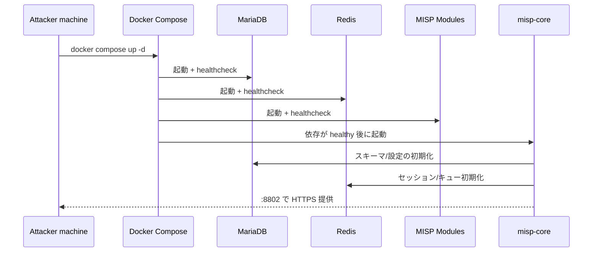

## TL;DR

本記事は、MISP を Docker で安定運用に乗せるための構築手順です。重要点は、`misp-core` の `supervisord` 前景実行、MySQL 値の明示設定（`database.php` 破損回避）、Docker 健康状態とHTTP疎通の両方を確認することです。

---

## 構成概要

| コンポーネント | 役割 | 既定ポート |
|---|---|---|
| `misp-core` | MISP Web/API とバックグラウンド処理 | `8802 -> 443` |
| `db` (MariaDB) | メインDB | 内部 `3306` |
| `redis` | キュー/キャッシュ/セッション | 内部 `6379` |
| `misp-modules` | 拡張モジュール（enrichment） | 内部 |
| `mail` | SMTP リレー | 内部 `25` |



---

## 事前準備

- Docker Engine + Docker Compose plugin
- 例: `/opt/threat-intelligence/misp-docker` の作業ディレクトリ
- HTTPS を使う場合は証明書ファイル
- `files/` が大きくなる前提で十分なディスク容量

---

## Step 1: `.env` を準備する

初回起動前に `.env` を作成し、DB項目を明示しておくとトラブルを減らせます。

```bash
cd /opt/threat-intelligence/misp-docker
cp -n template.env .env
```

最低限、以下は設定してください。

```env
BASE_URL=https://<YOUR_SERVER_IP>:8802
ADMIN_EMAIL=admin@admin.test
ADMIN_PASSWORD=<STRONG_PASSWORD>
MYSQL_HOST=db
MYSQL_PORT=3306
MYSQL_USER=misp
MYSQL_PASSWORD=example
MYSQL_DATABASE=misp
REDIS_HOST=redis
REDIS_PORT=6379
REDIS_PASSWORD=redispassword
```

---

## Step 2: MISP を起動する

依存サービスを含めて全体を起動します。

```bash
docker compose up -d
```

状態確認:

```bash
docker compose ps
```

期待状態: `db` / `redis` / `misp-modules` が `healthy`、その後 `misp-core` が `Up` 維持。

---

## Step 3: 疎通とヘルスを確認する

まずホスト側からログインページの応答を確認します。

```bash
curl -kI https://127.0.0.1:8802/users/login
```

`HTTP/2 200` が返ればUI到達は正常です。次にコンテナ内部の heartbeat を確認します。

```bash
docker exec misp-docker-misp-core-1 /bin/bash -lc 'curl -ks https://localhost/users/heartbeat'
```

---

## Step 4: よくある起動エラーの対処

### 1) `misp-core` が再起動ループ

ログにソケット関連メッセージが続く場合、`supervisor` の設定を確認してください。`nodaemon=true` で前景実行されないと PID 1 が終了し、コンテナが落ちます。

```bash
docker logs misp-docker-misp-core-1 --tail 200
```

確認ポイント:

```ini
[supervisord]
nodaemon=true
```

### 2) `database.php` の PHP 構文エラーで HTTP 500

DB設定が壊れているとパースエラーになります。コンテナ内で構文確認します。

```bash
docker exec misp-docker-misp-core-1 /bin/bash -lc 'php -l /var/www/MISP/app/Config/database.php'
```

失敗時は `.env` の MySQL 値を修正し、`database.php` を再生成または正しい値（`port=3306`, `database=misp`）に修正します。

### 3) UI は見えるのに `unhealthy` のまま

ヘルスチェック先が外部マップポートになっていると、コンテナ内チェックで失敗します。内部向けにします。

```yaml
healthcheck:
  test: curl -ks https://localhost/users/heartbeat > /dev/null || exit 1
```

---

## 初回ログイン

- URL: `https://<SERVER_IP>:8802`
- 初期アカウントは `.env` の `ADMIN_EMAIL` / `ADMIN_PASSWORD`

ログイン後に必ず実施:

1. 管理者パスワード変更
2. 組織情報と API キー運用設計
3. worker/cron の実行設計確認

---

## 運用前ハードニングチェック

- デフォルト/弱い認証情報の廃止と秘密情報ローテーション
- `8802` へのアクセス元制限
- `configs/` `files/` MariaDB データの定期バックアップ
- コンテナログと MISP 監査ログの継続監視
- イメージタグ固定と更新手順の変更管理

---

## 参考

- [MISP Docker (official)](https://github.com/MISP/misp-docker)
- [MISP Project](https://www.misp-project.org/)
