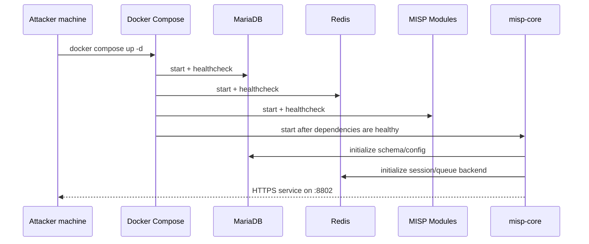

## TL;DR

This guide walks through a production-minded MISP Docker deployment with validation and troubleshooting included. The key points are: keep `misp-core` running under `supervisord` in foreground mode, define explicit MySQL values to avoid malformed `database.php`, and verify health from both Docker and HTTP endpoints.

---

## Target Architecture

| Component | Role | Default Port |
|---|---|---|
| `misp-core` | MISP web/API + background workers | `8802 -> 443` |
| `db` (MariaDB) | Main relational database | internal `3306` |
| `redis` | Queue/cache/session backend | internal `6379` |
| `misp-modules` | Enrichment and expansion modules | internal |
| `mail` | SMTP relay container | internal `25` |



---

## Prerequisites

- Docker Engine + Docker Compose plugin
- A dedicated directory such as `/opt/threat-intelligence/misp-docker`
- TLS files if you want HTTPS termination in the container
- Enough disk I/O for MISP file storage (`files/` grows quickly)

---

## Step 1: Prepare Environment

Create and review `.env` before first launch. Even if defaults exist, define database fields explicitly to avoid startup edge cases in generated config.

```bash
cd /opt/threat-intelligence/misp-docker
cp -n template.env .env
```

Set at least these values:

```env
BASE_URL=https://<YOUR_SERVER_IP>:8802
ADMIN_EMAIL=admin@admin.test
ADMIN_PASSWORD=<STRONG_PASSWORD>
MYSQL_HOST=db
MYSQL_PORT=3306
MYSQL_USER=misp
MYSQL_PASSWORD=example
MYSQL_DATABASE=misp
REDIS_HOST=redis
REDIS_PORT=6379
REDIS_PASSWORD=redispassword
```

---

## Step 2: Start MISP Stack

Start all services in detached mode and wait for dependency health checks to pass.

```bash
docker compose up -d
```

Watch status:

```bash
docker compose ps
```

Expected state: `db`, `redis`, and `misp-modules` should become `healthy`, then `misp-core` should stay `Up`.

---

## Step 3: Verify Access and Core Health

Validate from the host first.

```bash
curl -kI https://127.0.0.1:8802/users/login
```

You should get `HTTP/2 200` (or at least a login page response). Then verify container-side heartbeat:

```bash
docker exec misp-docker-misp-core-1 /bin/bash -lc 'curl -ks https://localhost/users/heartbeat'
```

---

## Step 4: Common Startup Problems and Fixes

### 1) `misp-core` keeps restarting

If logs show repeated socket cleanup or immediate exits, verify your supervisor config mounted into the container. `supervisord` must run in foreground mode (`nodaemon=true`) or container PID 1 exits.

```bash
docker logs misp-docker-misp-core-1 --tail 200
```

Check mounted supervisor file:

```ini
[supervisord]
nodaemon=true
```

### 2) HTTP 500 due PHP parse error in `database.php`

A common failure is malformed generated DB config (for example empty `port` value). Validate syntax from inside container:

```bash
docker exec misp-docker-misp-core-1 /bin/bash -lc 'php -l /var/www/MISP/app/Config/database.php'
```

If parsing fails, correct DB env values in `.env`, then regenerate or patch `database.php` with valid values (`port=3306`, `database=misp`).

### 3) Healthcheck says `unhealthy` while UI works

If healthcheck calls an external mapped port from inside container, it can fail. Use internal target in healthcheck:

```yaml
healthcheck:
  test: curl -ks https://localhost/users/heartbeat > /dev/null || exit 1
```

---

## First Login

- URL: `https://<SERVER_IP>:8802`
- Initial account comes from `.env` (`ADMIN_EMAIL`, `ADMIN_PASSWORD`)

After first login:

1. Change admin password immediately.
2. Configure organization metadata and API key strategy.
3. Review worker/cron schedules.

---

## Hardening Checklist (Before Real Operations)

- Disable weak/default credentials and rotate admin secret.
- Restrict inbound access (`8802`) by source IP where possible.
- Back up `configs/`, `files/`, and MariaDB data regularly.
- Monitor container logs and MISP audit logs continuously.
- Pin image tags and change-control upgrades.

---

## References

- [MISP Docker (official)](https://github.com/MISP/misp-docker)
- [MISP Project](https://www.misp-project.org/)
